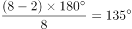

# 2020年陕西省公务员考试《行测》试题（网友回忆版）

> 常识判断 · 15 题 · 陕西 2020

## 第 1 题　qid 2578820 · 人文常识

20世纪50年代中期，交通大学部分教职员工响应党和国家号召，从上海迁至西安办学，支投祖国的大西北建设，形成了“西迁精神”,“西迁精神”的核心是：

- **A**. 爱国主义　✅
- **B**. 科教报国
- **C**. 自力更生，艰苦创业
- **D**. 听党话，跟党走

**答案**：A

**官方解析**

本题考查政治常识。
2020年4月22日，习近平总书记在西安交通大学考察时指出：“‘西迁精神’的核心是爱国主义，精髓是听党指挥跟党走，与党和国家、与民族和人民同呼吸、共命运，具有深刻现实意义和历史意义。”
故正确答案为A。

---

## 第 2 题　qid 2578822 · 人文常识

在“一带一路”国家战略的推动下,中欧班列（长安号）线路发展迅速，该线路从西安出发，开行14个国家，44个城市，实现了欧亚区域全覆盖，目前最远到达：

- **A**. 巴黎
- **B**. 巴塞罗那　✅
- **C**. 罗马
- **D**. 布鲁塞尔

**答案**：B

**官方解析**

本题考查政治常识。
2020年4月8日，75019次列车从中国铁路西安局集团有限公司新筑车站驶出，这是陕西省首次开行中欧班列（西安-巴塞罗那）。西安至巴塞罗那班列开行后，开行已达14国44个城市，开行线路15条，图定班列数量居全国前列。其中，巴塞罗那位于伊比利亚半岛东北部，濒临地中海，是西班牙第二大城市，它目前是中欧班列（长安号）最远到达的城市。
故正确答案为B。

---

## 第 3 题　qid 2577923 · 人文常识

2019年12月4日，中共中央、国务院印发《关于营造更好发展环境支持民营企业改革发展的意见》，充分肯定了我国民营经济的地位和作用，提出了有力举措，为民营企业未来发展指明了方向。下列与之相关的说法错误的是：

- **A**. 要进一步放开民营企业市场准入和实施公平统一的市场监管制度，保障民营企业平等获得资源要素
- **B**. 民营企业在推动发展、促进创新、增加就业、改善民生和扩大开放等方面发挥了不可替代的作用
- **C**. 支持民营企业发行债券，降低可转债发行门槛
- **D**. 对民营企业实行公平竞争审查制度的软性约束　✅

**答案**：D

**官方解析**

本题考查政治常识。
2019年12月4日，中共中央、国务院印发《关于营造更好发展环境支持民营企业改革发展的意见》（以下简称《意见》）。
A项正确，《意见》第二项，优化公平竞争的市场环境。（三）进一步放开民营企业市场准入······（四）实施公平统一的市场监管制度。深化要素市场化配置体制机制改革，健全市场化要素价格形成和传导机制，保障民营企业平等获得资源要素。
B项正确，《意见》中指出，改革开放40多年来，民营企业在推动发展、促进创新、增加就业、改善民生和扩大开放等方面发挥了不可替代的作用。民营经济已经成为我国公有制为主体多种所有制经济共同发展的重要组成部分。
C项正确，《意见》第三项，完善精准有效的政策环境。（九）完善民营企业直接融资支持制度。支持民营企业发行债券，降低可转债发行门槛。在依法合规的前提下，支持资管产品和保险资金通过投资私募股权基金等方式积极参与民营企业纾困。鼓励通过债务重组等方式合力化解股票质押风险。积极吸引社会力量参与民营企业债转股。
D项错误，《意见》第二项，优化公平竞争的市场环境。（五）强化公平竞争审查制度刚性约束。坚持存量清理和增量审查并重，持续清理和废除妨碍统一市场和公平竞争的各种规定和做法等。
本题为选非题，故正确答案为D。

---

## 第 4 题　qid 2577930 · 法律常识

甲方将乙方诉至人民法院，要求乙方偿还借款期限为一年，且已到期的2万元借款以及借款利息。在诉讼中，甲方向法庭提交了借据作为乙方借款的证据。下列与之相关的说法正确的是：

- **A**. 
甲方除了提交借据外，还需要提交向乙方实际付款的凭证，才能证明甲、乙双方之间的借贷关系真实发生

- **B**. 
虽然借据上未约定利息，但是乙方仍应按照年利率的标准向甲方支付借期内和逾期后的资金占用利息

- **C**. 
甲方提交借据足以证明甲、乙双方之间的借贷关系合法成立，乙方抗辩无效

- **D**. 
借据上没有约定利息，故乙方无须向甲方支付借期内利息
　✅

**答案**：D

**官方解析**

本题考查法律常识。
A项错误，根据《最高人民法院关于审理民间借贷案件适用法律若干问题的规定(2020第二次修正)》第二条第一款规定：“出借人向人民法院提起民间借贷诉讼时，应当提供借据、收据、欠条等债权凭证以及其他能够证明借贷法律关系存在的证据。”甲方凭借借据提起诉讼，可以证明甲乙之间借贷法律关系存在。
B项错误，根据《最高人民法院关于审理民间借贷案件适用法律若干问题的规定(2020第二次修正)》第二十八条规定：“借贷双方对逾期利率有约定的，从其约定，但是以不超过合同成立时一年期贷款市场报价利率四倍为限。未约定逾期利率或者约定不明的，人民法院可以区分不同情况处理：（一）既未约定借期内利率，也未约定逾期利率，出借人主张借款人自逾期还款之日起参照当时一年期贷款市场报价利率标准计算的利息承担逾期还款违约责任的，人民法院应予支持；（二）约定了借期内利率但是未约定逾期利率，出借人主张借款人自逾期还款之日起按照借期内利率支付资金占用期间利息的，人民法院应予支持。”因此，甲、乙双方之间借据上未约定利息，则视为不支付借款期间内的利息，但是甲可以主张乙自逾期还款之日起承担逾期还款违约责任。
C项错误，根据《最高人民法院关于审理民间借贷案件适用法律若干问题的规定(2020第二次修正)》第十五条规定：“第十五条　原告仅依据借据、收据、欠条等债权凭证提起民间借贷诉讼，被告抗辩已经偿还借款的，被告应当对其主张提供证据证明。被告提供相应证据证明其主张后，原告仍应就借贷关系的存续承担举证责任。被告抗辩借贷行为尚未实际发生并能作出合理说明的，人民法院应当结合借贷金额、款项交付、当事人的经济能力、当地或者当事人之间的交易方式、交易习惯、当事人财产变动情况以及证人证言等事实和因素，综合判断查证借贷事实是否发生。”因此，在甲提供借据的情况下，乙仍然可以抗辩。
D项正确，根据《民法典》第六百八十条规定：“禁止高利放贷，借款的利率不得违反国家有关规定。借款合同对支付利息没有约定的，视为没有利息。借款合同对支付利息约定不明确，当事人不能达成补充协议的，按照当地或者当事人的交易方式、交易习惯、市场利率等因素确定利息；自然人之间借款的，视为没有利息。”因此，借据上没有约定利息，乙方无需向甲方支付借期内利息。
故正确答案为D。

---

## 第 5 题　qid 2578162 · 人文常识

二十八星宿对于古人来说，不仅与军事、农耕等有紧密关系，与文学关系也很密切，所以古代诗文中对于二十八星宿的引用很多。下列诗句中，没有涉及到二十八星宿的是：

- **A**. 二十四桥仍在，波心荡，冷月无声　✅
- **B**. 人生不相见，动如参与商
- **C**. 迢迢牵牛星，皎皎河汉女
- **D**. 七月流火，九月授衣

**答案**：A

**官方解析**

本题考查人文常识。
二十八星宿，是中国古代天文学名词，由东方苍龙、南方朱雀、西方白虎、北方玄武各七宿组成。东方苍龙七宿：角宿，亢宿，氐宿，房宿，心宿，尾宿，箕宿；北方玄武七宿：斗宿，牛宿，女宿，虚宿，危宿，室宿，壁宿；西方白虎七宿：奎宿，娄宿，胃宿，昴宿，毕宿，觜宿，参宿；南方朱雀七宿：井宿，鬼宿，柳宿，星宿，张宿，翼宿，轸宿。
A项错误，“二十四桥仍在，波心荡，冷月无声”出自姜夔的《扬州慢·淮左名都》。意思是二十四桥仍然还在，桥下江中的波浪浩荡，凄冷的月色，处处寂静无声。未涉及二十八星宿。
B项正确，“人生不相见，动如参与商”出自杜甫的《赠卫八处士》。意思是世间上的挚友真难得相见，好比此起彼落的参星与商星这两个星宿。参星属西方白虎七宿。商星属东方苍龙七宿中的心宿。
C项正确，“迢迢牵牛星，皎皎河汉女”出自《迢迢牵牛星》。意思是看那遥远的牵牛星，明亮的织女星。牵牛星和织女星分别属于北方玄武七宿中的牛宿和女宿。
D项正确，“七月流火，九月授衣”出自《七月》。意思是在农历七月天气转凉的时节，天黑以后可以看见大火星从西方落下去。九月就该准备御寒的衣服了。此处的“大火星”即商星。商星，属东方苍龙七宿中的心宿，由于它火红的颜色，也称“大辰”、“大火”、“龙星”。
本题为选非题，故正确答案为A。

---

## 第 6 题　qid 2578166 · 科技常识

下列关于激光的说法错误的是：

- **A**. “激光”一词是受激辐射的光放大的简称
- **B**. 产生激光的必要条件是要有泵浦源和谐振腔
- **C**. 激光按不同的波长可以分为红外激光、可见激光和紫外激光　✅
- **D**. 激光由于能量高、方向性好，目前广泛应用于测量、加工和军事等领域

**答案**：C

**官方解析**

本题考查科技常识。
A项正确，爱因斯坦提出了一套全新的技术理论“光与物质相互作用”。这一理论是说在组成物质的原子中，有不同数量的粒子（电子）分布在不同的能级上，在高能级上的粒子受到某种光子的激发，会从高能级跳（跃迁）到低能级上，这时将会辐射出与激发它的光相同性质的光，而且在某种状态下，能出现一个弱光激发出一个强光的现象。这就叫做“受激辐射的光放大”，简称激光。
B项正确，产生激光需要增益介质、泵浦器和谐振腔三个条件。增益介质是工作物质，比如二氧化碳、蓝宝石等，都可以作为增益介质。泵浦器是用于激发增益介质中的粒子，使得高能粒子增加，这种激发方式被形象地称为泵浦。被激发的强度往往很弱，达不到实用强度，因此使用谐振腔进行放大。通过以上三个条件，才能获得激光。因此，泵浦器和谐振腔是产生激光的必要条件。
C项错误，激光按不同的波长可分为：红外激光、可见激光、紫外激光、X射线激光和多波段可调谐激光。
D项正确，激光是20世纪60年代的新光源，具有方向性好、亮度高、单色性好和相干性好等特点。以激光器为基础的激光工业在全球发展势头迅猛，现在已广泛应用于工业生产、测量、通信、信息处理、医疗卫生、军事、文化教育以及科研等方面。
本题为选非题，故正确答案为C。

---

## 第 7 题　qid 2578823 · 地理国情

近年来，陕西着力推动区域协调发展，形成“国家战略引领，三大区域联动”的新格局，“三大区域联动”是指：

- **A**. 关中协同创新发展、陕南绿色循环发展、陕北转型持续发展　✅
- **B**. 关中协同创新发展、陕南绿色循环发展、陕北能源支撑发展
- **C**. 关中绿色循环发展、陕南协同创新发展、陕北转型持续发展
- **D**. 关中绿色循环发展、陕南协同创新发展、陕北能源支撑发展

**答案**：A

**官方解析**

本题考查政治常识。
《2019年陕西省政府工作报告》中指出：“十三五”期间，关中协同创新发展、陕北转型持续发展、陕南绿色循环发展，三大区域齐发力，塑造陕西高质量发展新格局。
故正确答案为A。

---

## 第 8 题　qid 2578168 · 人文常识

李某认为某电商平台上的商户所销售服装的外观侵害了其设计著作权，于是通知电商平台对该商户采取删除、屏蔽、断开链接、终止交易和服务等措施。关于李某的上述通知，下列说法正确的是：

- **A**. 李某只需要提出主张，无须举证，举证商户是否侵权的责任由电商平台和商户承担
- **B**. 李某通知错误，造成商户损失的，李某应当加倍赔偿商户损失
- **C**. 李某必须提供商户侵权的确切证据
- **D**. 李某必须提供商户侵权的初步证据　✅

**答案**：D

**官方解析**

本题考查法律常识。
根据《电子商务法》第四十二条规定：“知识产权权利人认为其知识产权受到侵害的，有权通知电子商务平台经营者采取删除、屏蔽、断开链接、终止交易和服务等必要措施。通知应当包括构成侵权的初步证据。电子商务平台经营者接到通知后，应当及时采取必要措施，并将该通知转送平台内经营者；未及时采取必要措施的，对损害的扩大部分与平台内经营者承担连带责任。因通知错误造成平台内经营者损害的，依法承担民事责任。恶意发出错误通知，造成平台内经营者损失的，加倍承担赔偿责任。”
A项错误，李某作为知识产权权利人认为其知识产权受到侵害提出主张，需要举证。
B项错误，恶意发出错误通知，造成平台内经营者损失的，才是加倍承担赔偿责任。
C项错误，D项正确，通知应当包括的是侵权的初步证据，不是确切证据。
故正确答案为D。

---

## 第 9 题　qid 2578826 · 人文常识

关于统筹推进新冠肺炎疫情防控和经济社会发展工作，下列表述错误的是：

- **A**. 疫情防控的总要求是坚定信心、同舟共济、科学防治、精准施策
- **B**. 疫情防控的总目标是坚决遏制疫情蔓延势头、坚决打赢疫情防控阻击战
- **C**. 新冠肺炎疫情改变了我国经济的基本局面，其冲击是长期的　✅
- **D**. 在应对疫情中，暴露出我国在重大疫情防控体制机制方面存在的明显短板

**答案**：C

**官方解析**

本题考查政治常识。
A、B两项正确，2020年2月23日，习近平总书记在统筹推进新冠肺炎疫情防控和经济社会发展工作部署会议上的讲话中指出，打胜仗首先要有正确战略策略。党中央审时度势、综合研判，及时提出坚定信心、同舟共济、科学防治、精准施策的总要求，明确了坚决遏制疫情蔓延势头、坚决打赢疫情防控阻击战的总目标。
C项错误，从长期来看，中国经济具有超强的发展韧性，疫情所造成的经济短期波动会逐渐减弱并回归到经济发展的一般趋势，它改变不了我国以供给侧结构性改革推进实现经济高质量发展的大逻辑，不会改变我国经济稳中向好、长期向好的基本趋势，不会改变中国经济在全球经济中的上升地位。
D项正确，应对新冠肺炎疫情，暴露出我国在重大疫情防控体制机制、公共卫生体系等方面存在的一些短板，要改革完善疾病预防控制体系，建设平战结合的重大疫情防控救治体系，健全应急物资保障体系，加快构建关键核心技术攻关新型举国体制，深入开展爱国卫生运动，不断完善我国公共卫生体系，切实提高应对突发重大公共卫生事件的能力和水平。
本题为选非题，故正确答案为C。

---

## 第 10 题　qid 2577899 · 人文常识

《荀子·儒效》中写道，“不闻不若闻之，闻之不若见之，见之不若知之，知之不若行之”。
关于这句论述反映的思想，下列说法错误的是：

- **A**. 知行合一
- **B**. 实践出真知
- **C**. 人定胜天　✅
- **D**. 实践决定认识

**答案**：C

**官方解析**

本题考查政治常识。
“不闻不若闻之，闻之不若见之，见之不若知之，知之不若行之”意思是：学习中听说比不听好，见到比听说好，知晓比见到好，实践比知晓好，学习的最终就是实践，实践了，就明白了。反映了实践和认识的辩证关系，实践是认识的基础，实践决定认识。认识对实践有反作用，正确的认识、科学的理论对实践有指导作用。错误的认识、不科学的理论对实践有阻碍作用。
A项正确，“知”就是知识，理论；“行”指行为，也就是实践。“知行合一”就是要将理论转化为实践，而且实践是理论的具体体现，是题干所反映的实践和认识的辩证关系。
B项正确，题干反映了任何事情只有通过自己亲自尝试、实践，才能真正地认识、理解、掌握。即“实践出真知”。
C项错误，“人定胜天”过分夸大了主观能动性，否认了规律的客观性。主观能动性的发挥要受到客观条件的制约。
D项正确，题干反映了实践是认识的基础，实践决定认识。
本题为选非题，故正确答案为C。

---

## 第 11 题　qid 2577901 · 人文常识

下列关于生活中数学现象的表述错误的是：

- **A**. 用瓷砖铺地，只有用正三角、四角、六角、八角这四种正多角砖才能刚好将地铺满　✅
- **B**. 圆形的井盖是利用了直径相等原理，这样不论怎么移动井盖，盖子都不会掉下去
- **C**. 每个平面地图都可以只用四种颜色来染色，而且没有两个邻接的区域颜色相同
- **D**. 世界上只有五种正多面体，即正四、六、八、十二、二十面体

**答案**：A

**官方解析**

本题考查科技常识。  A项错误，正多角形瓷砖能刚好把地面铺满，则每个角应为的约数。根据多边形内角和公式可知，正八角形的瓷砖一个角的度数为，不能被整除。

B项正确，圆的每一条直径均相等，井盖设计为圆形，无论如何转动其直径长度都不变，因此不会掉下去。

C项正确，根据四色定理，只需要四种颜色就可以将平面地图都涂上颜色，且保证相邻两个区域颜色不同。

D项正确，正多面体要求必须是多个全等的正多边形组成，满足此要求的只有正四面体、正六面体、正八面体、正十二面体和正二十面体五种类型。

本题为选非题，故正确答案为A。

---

## 第 12 题　qid 2577905 · 科技常识

西汉末巧工丁缓发明的“被中香炉”是世界上已知最早的常平支架，其构造精巧，使用时把燃烧的炭火放入香炉中心的火盆中，无论香炉如何滚动，香炉中心的火盆都能保持水平，炭火始终不会掉出来。下列装置的物理原理与之相同的是：

- **A**. 指南针
- **B**. 陀螺仪　✅
- **C**. 水平仪
- **D**. 高度计

**答案**：B

**官方解析**

本题考查科技常识。
“被中香炉”是基于角动量守恒的力学原理，角动量守恒定律反映质点和质点系围绕一点或一轴运动的普遍规律；反映不受外力作用或所受诸外力对某定点（或定轴）的合力矩始终等于零的质点和质点系围绕该点（或轴）运动的普遍规律。
A项错误，指南针是利用磁铁“同性相斥、异性相吸”的特性，与题干“被中香炉”原理不同。
B项正确，陀螺仪是基于角动量守恒的理论设计出来的，主要是由一个位于轴心且可旋转的转子构成，一旦开始旋转，由于转子的角动量，陀螺仪有抗拒方向改变的趋向，与题干“被中香炉”原理相同。
C项错误，水平仪利用的是重力的方向总是竖直向下的原理，与题干“被中香炉”原理不同。
D项错误，常见的高度计主要为气压高度计，利用气压差得出高度差，在3000m范围内，每升高12m，大气压减小1mmHg，与题干“被中香炉”原理不同。
故正确答案为B。

---

## 第 13 题　qid 2578706 · 人文常识

近年来，3D电影由于具有非常逼真的视觉效果，而受到人们的广泛喜爱。根据其光学原理，在拍摄和播放3D电影的过程中所必需的设备组合是：

- **A**. 2台摄影机、2台放映机、2个平行偏振片
- **B**. 3台摄影机、3台放映机、2个平行偏振片
- **C**. 2台摄影机、2台放映机、2个正交偏振片　✅
- **D**. 3台摄影机、3台放映机、2个正交偏振片

**答案**：C

**官方解析**

本题考查科技常识。
3D电影的制作运用了人眼观察物体的视角，之所以我们用肉眼看到的世界是有立体感的，是因为两个眼睛细微的角度差别经由视网膜传至大脑后就能区分出景物的前后远近，进而产生强烈的立体感。
拍摄时，3D电影在拍摄时由两架摄像机各自使用一个镜头从不同角度同时拍摄，制成电影胶片。
放映时，通过两个放映机把用两个镜头拍下的两组胶片同步放映，并且每台放映机前装一块偏振镜，且偏振方向相互垂直，放映机发出两束相互垂直的偏振光投射到银幕上再发射给观众，偏振方向不变。
观看时，观众佩戴的偏振镜片的偏振方向也是相互垂直的（即正交偏振片），这样左眼只能看到左放映机的画面，右眼只能看到右放映机的画面，两眼看到的画面略有差别，从而产生了立体感。
故正确答案为C。

---

## 第 14 题　qid 2577917 · 科技常识

国家最高科学技术奖自设立以来，已有33位杰出科学工作者获得该奖。下列国家最高科学技术奖得主与其主要贡献对应正确的是：

- **A**. 李振声一一中国现代预警机事业的开拓者和奠基人，被誉为“中国预警机之父”
- **B**. 闵恩泽一一从事石油炼制催化剂制造技术领域研究，被誉为“中国催化剂之父”　✅
- **C**. 曾庆存一一为中国核潜艇事业的发展做出重要贡献，被誉为“中国核潜艇之父”
- **D**. 侯云德一一从事医学病毒学、新发传染病控制研究，被誉为“中国传染病学之父”

**答案**：B

**官方解析**

本题考查科技常识。
A项错误，李振声，中国科学院院士、第三世界科学院院士，著名小麦遗传育种学家，中国小麦远缘杂交育种奠基人，有“当代后稷”和“中国小麦远缘杂交之父”之称。王小谟，中国现代预警机事业的开拓者和奠基人，被誉为“中国预警机之父”，2013年1月18日荣获2012年度国家最高科学技术奖。
B项正确，闵恩泽，石油化工催化剂专家，2007年度国家最高科学技术奖获得者，中国炼油催化应用科学的奠基者，石油化工技术自主创新的先行者，被誉为“中国催化剂之父”。
C项错误，曾庆存，国际著名大气科学家，国际数值天气预报奠基人之一，为现代大气科学和气象事业的两大领域——数值天气预报和气象卫星遥感做出了开创性的贡献，2020年1月10日，获得2019年度国家最高科学技术奖。黄旭华，中国第一代攻击型核潜艇和战略导弹核潜艇总设计师，被誉为“中国核潜艇之父”，2020年1月10日，获得2019年度国家最高科学技术奖。
D项错误，侯云德，医学病毒学专家，我国分子病毒学和基因工程药物的开拓者，在国内首先研制成功临床级人白细胞干扰素，被誉为“中国干扰素之父”，2018年1月8日，获得2017年度国家最高科学技术奖。
故正确答案为B。

---

## 第 15 题　qid 2577948 · 科技常识

下列关于基因工程表述正确的是：

- **A**. 各种遗传病的基因异常是不同的，同一遗传病的基因异常是相同的
- **B**. 基因治疗就是把缺陷基因诱变成正常基因
- **C**. 基因诊断的基本原理就是DNA分子杂交　✅
- **D**. 一种基因探针能检测水体中的各种病毒

**答案**：C

**官方解析**

本题考查科技常识。
A项错误，人类的遗传病主要可以分为单基因遗传病、多基因遗传病和染色体异常遗传病三大类，其中多基因遗传病中的任一个基因变异都可能会得遗传病，因此同一遗传病的基因变异可能是不同的。 
B项错误，基因治疗是指用正常基因取代或修补病人细胞中有缺陷的基因，以纠正或补偿因基因缺陷和异常引起的疾病，达到治疗目的。
C项正确，基因诊断的基本原理是DNA分子杂交，指用放射性同位素、荧光分子等标记的DNA分子做探针，利用DNA分子杂交原理，鉴定被检测样本上的遗传信息，从而达到检测疾病的目的。
D项错误，基因探针是一段带有标记的，与待测基因有关的核酸序列，而各种病毒的核酸序列各不相同。因此一种基因探针只能检测水体中的一种病毒。
故正确答案为C。

---
