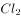

# 2021年北京市公务员录用考试《行测》题（区级及以上卷）（网友回忆版）

> 常识判断 · 32 题 · 北京 2021

## 材料 1

        2017年9月，党中央、国务院批复的《北京城市总体规划（2016年-2035年）》提出，要构建“一核一主一副，两轴多点一区”的城市空间结构。2020年8月，党中央国务院批复的《首都功能核心区控制性详细规划（街区层面）（2018年-2035年）》，对未来核心区发展、建设和管理的目标方向、基本依据和具体要求都做了较为详细的规定。至此，首都规划体系的“四梁八柱”已初步形成，首都规划进入新的历史阶段。

### 第 1 题　qid 2742114 · 经济常识

根据《首都功能核心区控制性详细规划（街区层面）（2018年-2035年）》，下列选项中，符合首都功能核心区的战略定位是：

- **A**. 国际交往中心的核心承载区　✅
- **B**. 高科技发展的重点地区
- **C**. 国家金融活动的中心地区
- **D**. 人居环境一流的核心示范区

**答案**：A

**官方解析**

本题考查政治常识。
2020年8月21日，中共中央、国务院批复同意《首都功能核心区控制性详细规划（街区层面）（2018年-2035年）》。《批复》指出，核心区是全国政治中心、文化中心和国际交往中心的核心承载区，是历史文化名城保护的重点地区，是展示国家首都形象的重要窗口地区。
故正确答案为A。

---

### 第 2 题　qid 2742115 · 人文常识

《首都功能核心区控制性详细规划（街区层面）（2018年-2035年）》提出，要全面强化老城空间的整体性，加强九坛八庙保护。关于九坛八庙，下列说法中错误的是：

- **A**. 天坛为明清两代帝王祭天的场所
- **B**. 明清两代帝王每年秋分时在日坛祭日　✅
- **C**. 太庙是明清两代皇帝祭奠祖先的家庙
- **D**. 雍和宫先为雍亲王府，后成为藏传佛教寺庙

**答案**：B

**官方解析**

本题考查人文常识。九坛八庙指的是京城九坛和京华八庙。九坛，即天坛、地坛、祈谷坛、朝日坛、夕月坛、太岁坛、先农坛、先蚕坛和社稷坛诸坛；八庙系指太庙、奉先殿、传心殿、寿皇殿、雍和宫、堂子、文庙和历代帝王庙。
A项正确，天坛始建于明永乐十八年（1420年），是明清两代帝王祭祀皇天、祈五谷丰登之场所。而夕月坛始建于明嘉靖年间，是明清两代皇帝每年秋分祭夜明之神(月亮)和天上诸星宿的处所。
B项错误，日坛于明嘉靖九年（1530年）建造，明清二代均于每年春分日遣官致祭，清制遇甲丙戊庚壬年由皇帝亲祭。
C项正确，太庙始建于明永乐十八年（1420年），根据中国古代“敬天法祖”的传统礼制建造，是明清两代皇帝祭奠祖先的家庙。
 D项正确，雍和宫最早为清世宗胤禛作贝勒和亲王时期的府邸、清高宗弘历降生和成长之地。清朝康熙三十三年（1694），康熙帝在此建造府邸，赐予四子雍亲王，称雍亲王府；雍正三年（1725），改王府为行宫，称雍和宫；乾隆九年（1744），雍和宫改为喇嘛庙，特派总理事务王大臣管理其事务，并成为清政府掌管全国藏传佛教事务的中心。
本题为选非题，故正确答案为B。

---

### 第 3 题　qid 2742116 · 经济常识

《首都功能核心区控制性详细规划（街区层面）（2018年-2035年）》确定了首都核心区“两轴、一城、一环”的城市空间结构。其中，“两轴”指的是中轴线和：

- **A**. 金融街
- **B**. 两广路
- **C**. 长安街　✅
- **D**. 平安大街

**答案**：C

**官方解析**

本题考查政治常识。
《首都功能核心区控制性详细规划（街区层面）（2018年-2035年）》第八条指出：“落实城市战略定位，延续古都历史格局，保障首都功能，强化‘两轴、一城、一环’的城市空间结构。两轴：长安街和中轴线。长安街以国家行政、文化、国际交往功能为主，体现庄严、沉稳、厚重、大气的形象气质。中轴线以文化功能为主，展示传统文化精髓，体现现代文明魅力。一城：北京老城。推动老城整体保护与复兴，使之成为体现中华优秀传统文化的代表地区。一环：沿二环路的文化景观环线。建设展示历史人文景观和现代化首都风貌的公园环。”
故正确答案为C。

---

### 第 4 题　qid 2742119 · 人文常识

《首都功能核心区控制性详细规划（街区层面）（2018年-2035年）》提到，疏解非首都核心功能，让核心区“静”下来，要实施“双控”（控制人口、建设规模）和“四降”。“四降”包括：

- **A**. 降低人口密度、交通密度、建筑密度及商业密度
- **B**. 降低人口密度、交通密度、建筑密度及产业密度
- **C**. 降低人口密度、旅游密度、建筑密度及商业密度　✅
- **D**. 降低人口密度、旅游密度、建筑密度及产业密度

**答案**：C

**官方解析**

本题考查政治常识。
《首都功能核心区控制性详细规划（街区层面）（2018年-2035年）》第十二条指出：“严格实施‘双控四降’，优化配置资源，形成功能集中、疏密有度、便捷顺畅、衔接有序、职住平衡、环境优美、外部环境良好的核心区。‘双控四降’：‘双控’指控制人口规模、控制建设规模，‘四降’指切实把人口密度、建筑密度、商业密度、旅游密度降下来。”
故正确答案为C。

---

## 材料 2

        自2020年5月1日《北京市生活垃圾管理条例》（以下简称《条例》）实施以来，本市垃圾分类工作成效显著，全市厨余垃圾分出量增长、其他垃圾日清运量下降的良好态势得到巩固。10月份，全市家庭厨余垃圾分出量从《条例》实施前的309吨/日增长至3946吨/日，增长了近12倍，厨余垃圾分出率达到。进入到末端处理设施的其他垃圾量减少到1.6万吨/日，同比2019年下降。随着垃圾分类工作的深入推进，全市厨余垃圾分出质量、桶站设置达标率、指导员值守率等多项指标也逐步提升，绝大部分小区已启动垃圾分类，大部分家庭已能够有意识地进行垃圾分类。

### 第 5 题　qid 2742122 · 人文常识

源头减量是全面推行垃圾分类制度的关键环节，下列措施中有利于从源头减少生活垃圾产生量的有：
①逐步推行净菜上市
②推动外卖包装绿色化
③生活垃圾分类运输至集中收集设施
④要求餐馆不主动提供一次性用品

- **A**. ①②③
- **B**. ①②④　✅
- **C**. ①③④
- **D**. ②③④

**答案**：B

**官方解析**

本题考查科技常识。
①正确，净菜上市是菜篮子工程的要求之一。即蔬菜市场应该提供无残留农药、茎叶类菜无菜根、无枯黄叶、无泥沙、无杂物的蔬菜。故逐步推行净菜上市有利于从源头减少生活垃圾产生量。
②正确，随着外卖市场不断扩大，外卖垃圾问题愈发凸显，推动外卖包装绿色化，有利于从源头减少生活垃圾产生量。
③错误，生活垃圾分类运输至集中收集设施可有效推进生活垃圾分类工作，并不能从源头减少生活垃圾产生量。
④正确，践行绿色生活方式，树立绿色环保的理念，餐馆不主动提供一次性用品有利于从源头减少生活垃圾产生量。
由此可知，①②④正确。
故正确答案为B。

---

### 第 6 题　qid 2742124 · 人文常识

近期，本市组织动员党政机关、企事业单位党员干部签订垃圾分类个人承诺书并尽快到社区报到，参加“桶前值守”活动。这一措施将直接有助于：
①缓解桶前值守人力不足的问题
②提升党员干部及其家属垃圾分类意识
③营造积极进行垃圾分类的氛围和声势
④强化垃圾分类执法倒逼机制

- **A**. ①②③　✅
- **B**. ①②④
- **C**. ②③④
- **D**. ①③④

**答案**：A

**官方解析**

本题考查科技常识。
①正确，党政机关、企事业单位党员干部到社区参加“桶前值守”活动，为“桶前值守”活动增添人手，可缓解桶前值守人力不足的问题。
②③正确，党政机关、企事业单位党员干部签订垃圾分类个人承诺书，可提升垃圾分类意识，带头影响家人，做好垃圾分类的倡导者、践行者和宣传员，营造“人人参与、家家分类”的良好社会氛围。
④错误，党员干部无执法权，相关执法部门可以开展城市地区与农村地区、各行业主体全覆盖检查，加大对桶站设置等方面的检查，通过执法倒逼机制促进企业、个人自觉履行法定义务和社会责任。
故正确答案为A。

---

### 第 7 题　qid 2742125 · 法律常识

下列居民的行为中，符合《条例》要求的是：

- **A**. 小王将装着剩饭的快餐盒投入厨余垃圾桶
- **B**. 张大爷将两根废旧节能灯管投入写有“其他”字样的垃圾桶
- **C**. 赵奶奶翻拣出垃圾分类投放站可回收物垃圾桶中的废纸箱
- **D**. 刘阿姨将废纸和金属易拉罐投入可回收物垃圾桶　✅

**答案**：D

**官方解析**

本题考查科技常识。
A项错误，根据《北京市生活垃圾管理条例》第七十八条第二款规定：“厨余垃圾，是指家庭中产生的菜帮菜叶、瓜果皮核、剩菜剩饭、废弃食物等易腐性垃圾；从事餐饮经营活动的企业和机关、部队、学校、企业事业等单位集体食堂在食品加工、饮食服务、单位供餐等活动中产生的食物残渣、食品加工废料和废弃食用油脂；以及农贸市场、农产品批发市场产生的蔬菜瓜果垃圾、腐肉、肉碎骨、水产品、畜禽内脏等。其中，废弃食用油脂是指不可再食用的动植物油脂和油水混合物。”故小王应将剩饭单独倒出，投入厨余垃圾桶。
B项错误，根据《北京市生活垃圾管理条例》第七十八条第四款规定：“有害垃圾，是指生活垃圾中的有毒有害物质，主要包括废电池（镉镍电池、氧化汞电池、铅蓄电池等），废荧光灯管（日光灯管、节能灯等），废温度计，废血压计，废药品及其包装物，废油漆、溶剂及其包装物，废杀虫剂、消毒剂及其包装物，废胶片及废相纸等。”故张大爷应将废旧节能灯管投入写有“有害垃圾”字样的垃圾桶。
C项错误，《北京市生活垃圾管理条例》第三十六条第六款规定：“生活垃圾分类管理责任人应当遵守下列规定：及时制止翻拣、混合已分类的生活垃圾的行为。”故赵奶奶不可以翻拣出垃圾分类投放站可回收物垃圾桶中的废纸箱。
D项正确，根据《北京市生活垃圾管理条例》第七十八条第三款规定：“可回收物，是指在日常生活中或者为日常生活提供服务的活动中产生的，已经失去原有全部或者部分使用价值，回收后经过再加工可以成为生产原料或者经过整理可以再利用的物品，主要包括废纸类、塑料类、玻璃类、金属类、电子废弃物类、织物类等。”
故正确答案为D。

---

### 第 8 题　qid 2742126 · 法律常识

《条例》的顺利实施，重要的是鼓励居民积极参加生活垃圾分类活动。为此，亟需：
①抓好宣传引导工作，提升居民的知晓率
②严格执行惩罚制度，加大惩罚力度，提升居民的参与率
③加强垃圾分类投放行为的指导，提高居民垃圾正确投放率
④完善环境保护公益诉讼制度，提升居民的满意率

- **A**. ①②
- **B**. ②④
- **C**. ③④
- **D**. ①③　✅

**答案**：D

**官方解析**

本题考查科技常识。
①正确，《条例》的顺利实施的前提是公众知晓《条例》，而抓好《条例》宣传引导工作，有利于提升居民的知晓率，推进《条例》的顺利实施。
②错误，惩罚并不是提升居民参与率的措施，而且现阶段的垃圾分类以鼓励提倡为主，在没有法律法规的明确规定下，不易过多使用处罚手段。
③正确，垃圾分类的基础是有正确的垃圾投放行为，加强垃圾分类投放行为的指导，提高居民垃圾正确投放率，有利于垃圾分类的实施。
④错误，环境保护公益诉讼制度是事后监督制度，与居民参加生活垃圾分类和满意率无关。
故正确答案为D。

---

### 第 9 题　qid 2742097 · 人文常识

近年来，北京市全面贯彻落实党中央，国务院部署，不断把“放管服”改革推向深入，持续转变政府职能、改革优化营商环境，为首都高质量发展提供有力支撑。下列具体措施中，能够体现政府部门深化“放管服”改革理念的有：
①在疫情期间，交管部门推出车驾管业务“延期办”“容缺办”举措
②全面推进权责清单“两单融合”，持续清理各类证明
③设置快递业务入职门槛，快递员上岗必须考取国家职业资格证书
④告知承诺制应用于不动产继承登记

- **A**. ①②③
- **B**. ①②④　✅
- **C**. ①③④
- **D**. ②③④

**答案**：B

**官方解析**

本题考查政治常识。
2016年5月9日，李克强在全国推进简政放权放管结合优化服务改革电视电话会议上强调，上下联动，攻坚克难，深化“放管服”改革，加快转变政府职能，不断提高行政效能。深化简政放权、放管结合、优化服务改革是推动经济社会持续健康发展的战略举措。
①正确，针对疫情变化，切实降低窗口单位等人员密集场所病毒传播风险，交管部门推行“网上办、自助办、延期办、容缺办”等措施，简化办事流程，减少办事环节，体现了政府部门深化“放管服”改革理念。
②正确，全面推进权责清单“两单融合”，持续清理各类证明，进一步清理规范行政审批中介服务。大力推进业务流程再造，以企业和群众需求倒逼政府职能转变，结合“信息共享、数据跑路”，真正提升行政效率，体现了政府部门深化“放管服”改革理念。
③错误，为贯彻落实“放管服”改革政策，扩大惠民利企力度，简化群众办事和认证流程，《北京市快递安全管理办法》规定，快递员上岗不再需要国家职业资格证书，申请快递业务经营许可不再要求申请人提供快递业务员的资格认定。
④正确，告知承诺制，是指行政机关在办理有关许可登记等事项时，以书面形式将法律法规规定证明的义务或者证明条件一次性告知当事人，由申请人书面进行承诺，已经符合这些条件、标准和要求，同时也愿意承担承诺不实的法律责任，行政机关就不再索要证明，直接予以办理。告知承诺制降低了行政管理成本，提高了行政效率，便利了申请人办事，从源头上预防腐败，实现了政府从传统管制型审批到现代契约化管理的转变。告知承诺制应用于不动产继承登记体现了政府部门深化“放管服”改革理念。
因此①②④正确。
故正确答案为B。

---

### 第 10 题　qid 2742095 · 地理国情

下列关于我国国家发展重大战略或推动区域发展的重大举措，前后关系对应正确的是：

- **A**. 粤港澳大区建设——推动成渝地区双城经济圈建设
- **B**. 黄河流域生态保护和高质量发展——坚持山水林田湖草综合治理、系统治理、源头治理　✅
- **C**. 京津冀协同发展——在维护好国家粮食安全的前提下促进人口向中心城市聚集
- **D**. 长江经济带发展——打造中国最大的工业密集区

**答案**：B

**官方解析**

本题考查政治常识。

A项错误，2019年2月18日，中共中央、国务院印发《粤港澳大湾区发展规划纲要》。《纲要》指出：粤港澳大湾区包括香港特别行政区、澳门特别行政区和广东省广州市、深圳市、珠海市、佛山市、惠州市、东莞市、中山市、江门市、肇庆市。建设粤港澳大湾区，既是新时代推动形成全面开放新格局的新尝试，也是推动“一国两制”事业发展的新实践。而成渝地区双城经济圈主要指成都、重庆。

B项正确，2019年9月18日，习近平总书记在郑州主持召开黄河流域生态保护和高质量发展座谈会并发表重要讲话。他指出：治理黄河，重在保护，要在治理。要坚持山水林田湖草综合治理、系统治理、源头治理，统筹推进各项工作，加强协同配合，推动黄河流域高质量发展。

C项错误，2015年4月30日，中央政治局会议审议通过的《京津冀协同发展规划纲要》指出，推动京津冀协同发展是一个重大国家战略，核心是有序疏解北京非首都功能。要坚持协同发展、重点突破、深化改革、有序推进。要严控增量、疏解存量、疏堵结合调控北京市人口规模。

D项错误，2016年9月，《长江经济带发展规划纲要》正式印发，确立了长江经济带“一轴、两翼、三极、多点”的发展新格局，以推动经济高质量发展。环渤海经济圈约占中国国土面积的和人口的，是中国最大的工业密集区，也是中国科技力量最强大的地区。

故正确答案为B。

---

### 第 11 题　qid 2742099 · 法律常识

2020年3月27日，《北京市物业管理条例》（以下简称《条例》）经北京市十五届人大常委会第二十次会议表决通过，于2020年5月1日施行。下列与该《条例》相关的说法中，错误的是：

- **A**. 是推进城市治理体系和治理能力现代化的重要举措
- **B**. 在社区治理中坚持党建引领，将物业管理纳入社区治理体系
- **C**. 对于没有业主大会、没有业主委员会小区的自治管理问题，首创组建过渡性质的“物业管理委员会”
- **D**. 进一步提高业主大会成立的“门槛”　✅

**答案**：D

**官方解析**

本题考查法律常识。
A项正确，根据北京市政协部署《北京市物业管理条例》立法协商工作一文：“开展《北京市物业管理条例》立法协商工作，是贯彻党的十九届四中全会精神，推进城市治理体系和治理能力现代化的重要举措”。
B项正确，根据《条例》第三条规定：“本市物业管理纳入社区治理体系，坚持党委领导、政府主导、居民自治、多方参与、协商共建、科技支撑的工作格局。建立健全社区党组织领导下居民委员会、村民委员会、业主委员会或者物业管理委员会、业主、物业服务人等共同参与的治理架构。推动在物业服务企业、业主委员会、物业管理委员会中建立党组织，发挥党建引领作用。”
C项正确，根据《条例》第五十三条规定：“有下列情形之一的，可以组建物业管理委员会：（一）不具备成立业主大会条件；（二）具备成立业主大会条件，但是确有困难未成立；（三）业主大会成立后，未能选举产生业主委员会。”
D项错误，《条例》第二十九条、第三十条、第三十一条规定了业主大会的组成、成立的申请等事宜，并未提高业主大会成立的“门槛”。
本题为选非题，故正确答案为D。

---

### 第 12 题　qid 2742101 · 人文常识

用“九个指头和一个指头的关系”比喻成绩与不足哪个是主要的哪个是次要的，这种思想方法可以帮助我们在观察和处理问题时分清主流与支流、整体与局部、本质与现象。这是因为：
①事物的性质主要是由取得支配地位的矛盾主要方面决定的
②矛盾的双方互相依存、互相影响、互相转化
③应该抓住主要矛盾和矛盾的主要方面
④矛盾无时无处不在，具有普遍性和客观性

- **A**. ①④
- **B**. ②③
- **C**. ①③　✅
- **D**. ②④

**答案**：C

**官方解析**

本题考查政治常识。
矛盾就是对立统一。复杂事物发展过程中包含多重矛盾并有主次之分，主要矛盾在事物发展中处于支配地位，起着决定作用；次要矛盾对事物发展起着重要作用，但不是根本作用。主次矛盾关系原理要求我们处理复杂事物时要善于抓住重点。
同一矛盾内部可以分为矛盾的主要方面和次要方面，事物矛盾的双方有主次之分，事物的性质由矛盾的主要方面决定，这要求我们看问题要善于分清主流和支流。
题目用“九个指头和一个指头的关系”比喻成绩与不足哪个是主要的哪个是次要的，体现的正是主次矛盾和矛盾的主次方面的哲学原理，对应①③。②矛盾的双方互相依存、互相影响、互相转化的原理和④矛盾的普遍性和客观性原理并未体现，排除。
故正确答案为C。

---

### 第 13 题　qid 2742102 · 经济常识

下列属于我国分配制度中的第三次分配手段的是：

- **A**. 慈善事业　✅
- **B**. 社会保障
- **C**. 转移支付
- **D**. 税收

**答案**：A

**官方解析**

本题考查经济常识。
在社会分配制度中，包含不同的分配形式。初次分配是按照各生产要素对国民收入贡献大小进行的分配，主要依靠市场机制形成。再分配是在初次分配基础上，对部分国民收入进行的重新分配，主要由政府调节机制起作用。第三次分配是在道德、文化、习惯等影响下，社会力量自愿通过民间捐赠、慈善事业、志愿行动等方式济困扶弱的行为，是对再分配的有益补充。
A项正确，党的十九届四中全会通过的《中共中央关于坚持和完善中国特色社会主义制度、推进国家治理体系和治理能力现代化若干重大问题的决定》中指出：“重视发挥第三次分配作用，发展慈善等社会公益事业。”因此，慈善事业属于第三次分配手段之一。
B项错误，社会保障是以国家或政府为主体，依据法律，通过国民收入的再分配，对公民在暂时或永久丧失劳动能力以及由于各种原因而导致生活困难时给予物质帮助，以保障其基本生活的制度。社会保障属于再分配的一种方式。
C项错误，转移支付是指政府或企业无偿地支付给个人以增加其收入和购买力的费用。转移支付属于再分配的一种方式。
D项错误，税收是指国家为了向社会提供公共产品、满足社会共同需要、按照法律的规定，参与社会产品的分配、强制、无偿取得财政收入的一种规范形式。税收属于再分配的一种方式。
故正确答案为A。

---

### 第 14 题　qid 2742106 · 科技常识

2020年10月16日，中共中央政治局就量子科技研究和应用前景举行第二十四次集体学习。量子力学是人类探究微观世界的重大成果，量子科技发展具有重大科学意义和战略价值。以下关于量子科技的说法中，不正确的一项是：

- **A**. “量子”是一个天文学概念，是光传播的最小单位　✅
- **B**. 量子革命催生了激光、核磁共振、全球定位系统等现代技术
- **C**. 量子通信利用量子力学的基本原理对信息进行加密，具有传统通信技术不可比拟的安全性
- **D**. 量子计算机的一个量子比特既可处于0和1，还可处于0和1两种状态的叠加

**答案**：A

**官方解析**

本题考查科技常识。
A项错误，量子是现代物理的重要概念，即一个物理量如果存在最小的不可分割的基本单位，则这个物理量是量子化的，并把最小单位称为量子。量子并非光传播的最小单位。
B项正确，第一次量子革命催生了晶体管、激光、核磁共振、全球定位系统等现代技术，使人类进入信息时代。也是在这一次信息革命中，美国在全世界奠定了霸主地位。
C项正确，量子通信的应用方式包括量子密钥分发和量子隐形传态。量子密钥分发是原理上绝对安全的通信手段，是目前仅有的得到严格数学证明的通信方式。在量子密钥传输过程中，窃听者无法做到既偷看又不留下痕迹。利用量子力学的基本原理对信息进行加密，具有不可克隆、不可窃听的特性。
D项正确，在量子计算机中，基本信息单位是量子比特，用两个量子态│0&gt;和│1&gt;代替经典比特状态0和1。量子比特相较于比特来说，有着独一无二的存在特点，它以两个逻辑态的叠加态的形式存在，这表示的是两个状态是0和1的相应量子态叠加。
本题为选非题，故正确答案为A。

---

### 第 15 题　qid 2742107 · 科技常识

下列与病毒、细菌有关的说法正确的是：

- **A**. 病毒是细菌的一种
- **B**. 病毒以二分裂方式增殖
- **C**. 病毒可以被细菌感染
- **D**. 病毒不具有细胞结构　✅

**答案**：D

**官方解析**

本题考查科技常识。
A项错误，病毒不是细菌。细菌是原核生物的一种，主要特点是没有核膜，其遗传物质分散在细胞质内一个相对固定的区域内，称为核区。病毒构造很简单，外面是一层蛋白质，称为病毒外壳。蛋白质外壳内部包裹着病毒的遗传物质，可以是DNA，也可以是RNA。
B项错误，病毒增殖的方式是以其基因为模板，合成与原来一样的基因，这种以病毒核酸分子为模板进行复制的方式称为自我复制。以无性二分裂方式繁殖（裂殖）的是细菌，细菌在生长到一定时期，其细胞中间会逐渐形成横隔，由一个母细胞分裂为两个大小相等的子细胞。
C项错误，病毒不能被细菌感染，相反，病毒能感染细菌。侵袭细菌的病毒有一个专门的名字叫噬菌体。噬菌体具有病毒的一些特性：个体微小；不具有完整细胞结构；只含有单一核酸。
D项正确，病毒是一种个体微小，结构简单，只含一种核酸（DNA或RNA），必须在活细胞内寄生并以复制方式增殖的非细胞型生物。因此病毒不具有细胞结构。
故正确答案为D。

---

### 第 16 题　qid 2742108 · 科技常识

2020年7月23日，我国首次火星探测任务“天问一号”探测器成功发射，迈出了我国行星探测第一步。“天问”取自下列经典中的：

- **A**. 《中庸》
- **B**. 《楚辞》　✅
- **C**. 《山海经》
- **D**. 《淮南子》

**答案**：B

**官方解析**

本题考查科技常识。
A项错误，《中庸》是中国古代论述人生修养境界的一部道德哲学专著，其内容肯定“中庸”是道德行为的最高标准，把“诚”看成是世界的本体，认为“至诚”则达到人生的最高境界，并提出“博学之，审问之，慎思之，明辨之，笃行之”的学习过程和认识方法。
B项正确，“天问”取自屈原长诗《天问》，表达了中华民族对真理追求的坚韧与执着，体现了对自然和宇宙空间探索的文化传承，寓意探求科学真理征途漫漫，追求科技创新永无止境，《天问》出自《楚辞》。
C项错误，《山海经》内容主要是民间传说中的地理知识，包括山川、地理、民族等，保存了包括夸父逐日、精卫填海等不少脍炙人口的远古神话传说和寓言故事。它对中国古代历史、地理等的研究，均有参考价值。其中的矿物记录，更是世界上最早的有关文献。
D项错误，《淮南子》是西汉皇族淮南王刘安及其门客收集史料集体编写而成的一部哲学著作，其在继承先秦道家思想的基础上，综合了诸子百家学说中的精华部分，对后世研究秦汉时期文化起到了不可替代的作用。
故正确答案为B。

---

### 第 17 题　qid 2742360 · 人文常识

一个生活在“文景之治”时期的读书人，不可能看到的书籍是：

- **A**. 《吕氏春秋》
- **B**. 《孙子兵法》
- **C**. 《世说新语》　✅
- **D**. 《诗经》

**答案**：C

**官方解析**

本题考查人文常识。
文景之治是指西汉汉文帝、汉景帝统治时期出现的治世。
A项正确，《吕氏春秋》，又称《吕览》，是在秦国相邦吕不韦的主持下，集合门客们编撰的一部杂家名著。其编撰的时代为先秦时期，在西汉之前，故生活在西汉时期的读书人可以看到《吕氏春秋》这本书。
B项正确，《孙子兵法》是中国现存最早的兵书，也是世界上最早的军事著作，作者为春秋时祖籍齐国乐安的吴国将军孙武。其编撰的时代为春秋时期，在西汉之前，故生活在西汉时期的读书人可以看到《孙子兵法》这本书。
C项错误，《世说新语》是南朝宋时所作的文言志人小说集，坊间基本上认为由南朝宋刘义庆所撰写，也有称是由刘义庆所组织门客编写，内容主要是记载东汉后期到魏晋间一些名士的言行与轶事。其编撰的时代为南朝，在西汉之后，故生活在西汉时期的读书人不可能看到《世说新语》这本书。
D项正确，《诗经》是中国古代诗歌开端，也是最早的一部诗歌总集，收集了西周初年至春秋中叶（前11世纪至前6世纪）的诗歌，共311篇。《诗经》约成书于春秋中期，起初叫做《诗》，其编撰的时代为春秋时期，在西汉之前，故生活在西汉时期的读书人可以看到《诗经》这本书。
本题为选非题，故正确答案为C。

---

### 第 18 题　qid 2742110 · 人文常识

某单位要给贫困地区的孩子邮寄一批学习用品，想在物资上写上一句古诗词，下列诗词最合适的是：

- **A**. 谁言寸草心，报得三春晖
- **B**. 海上生明月，天涯共此时
- **C**. 唯有门前镜湖水，春风不改旧时波
- **D**. 长风破浪会有时，直挂云帆济沧海　✅

**答案**：D

**官方解析**

本题考查人文常识。
A项错误，“谁言寸草心，报得三春晖”出自唐代诗人孟郊所作的《游子吟》，这两句诗的意思是：有谁敢说，子女像小草那样微弱的孝心，能够报答得了像春晖普泽的慈母恩情呢？反映的是子女报答慈母之恩，该项与题意不符。
B项错误，“海上生明月，天涯共此时”出自唐代诗人张九龄的《望月怀古》，这两句诗的意思是：茫茫的海上升起一轮明月，你我相隔天涯却共赏月亮。抒发的是怀念远方亲人之情，该项与题意不符。
C项错误，“唯有门前镜湖水，春风不改旧时波”出自唐代诗人贺知章的《回乡偶书·其二》，这两句诗的意思是：只有门前那在春风吹拂下泛起一圈一圈涟漪的镜湖的碧水，还是旧时模样。抒写的是久客伤老之情，该项与题意不符。
D项正确，“长风破浪会有时，直挂云帆济沧海”出自唐代诗人李白的《行路难·其一》，这两句诗的意思是：相信总有一天，能乘长风破万里浪；高高挂起云帆，在沧海中勇往直前。意喻孩子们总能走出困难，冲向更广阔的天地。符合题意。
故正确答案为D。

---

### 第 19 题　qid 2742103 · 法律常识

按照我国法律的相关规定，高级人民法院院长由（    ）选举。

- **A**. 自治区、设区的市的人民代表大会常务委员会
- **B**. 省（自治区、直辖市）的人民代表大会常务委员会
- **C**. 自治区、设区的市的人民代表大会
- **D**. 省（自治区、直辖市）的人民代表大会　✅

**答案**：D

**官方解析**

本题考查法律常识。
《法官法》第十八条规定：“······地方各级人民法院院长由本级人民代表大会选举和罢免，副院长、审判委员会委员、庭长、副庭长和审判员，由院长提请本级人民代表大会常务委员会任免······”因此，高级人民法院院长由省（自治区、直辖市）的人民代表大会选举。
故正确答案为D。

---

### 第 20 题　qid 2742361 · 人文常识

“灰犀牛”事件是指太过于常见以至于人们习以为常的风险，比喻大概率且影响巨大的潜在危机。下列说法中，与防范应对“灰犀牛”事件思路有关的一项是：

- **A**. 明者防祸于未萌，智者图患于将来　✅
- **B**. 祸兮福之所倚，福兮祸之所伏
- **C**. 在危机中育先机，于变局中开新局
- **D**. 一室之不治，何以天下家国为

**答案**：A

**官方解析**

本题考查人文常识。
A项正确，“明者防祸于未萌，智者图患于将来”见于西晋陈寿的《三国志》，大意是说，明智的人在灾祸没有萌生的时候就加以防范，聪明的人对于将来可能发生的危害会预先进行估计，只有这样，在灾祸危害发生的时候，才能从容应对。防范应对“灰犀牛”事件就需要提前预判，防患于未然。
B项错误，“祸兮福之所倚，福兮祸之所伏”出自《老子》，指福与祸相互依存，互相转化。比喻坏事可以引发出好结果，好事也可以引发出坏结果。暗示人们在顺境中要谦虚谨慎，戒骄戒躁；志得意满，狂妄自大，反而滋生灾祸，由福转祸；逆境中百折不挠，勤奋刻苦，可变逆境为顺境，由苦而甜的道理。
C项错误，“在危机中育先机，于变局中开新局”意思是要充分发挥主观能动性，转危为机，开拓创新。
D项错误，“一室之不治，何以天下家国为”出自清·刘蓉《习惯说》，意思是你连一间屋子都不能治理，凭什么能治理好国家呢？告诫人要成就一件大事，就得从小事做起。
故正确答案为A。

---

### 第 21 题　qid 2742104 · 法律常识

根据《中华人民共和国公务员法》，国家实行公务员交流制度。以下不属于公务员交流的是：

- **A**. 某区农业农村局公务员戴科长转任到该区医疗保障局
- **B**. 某事业单位新入职工作人员小李借调到某行政机关帮忙　✅
- **C**. 某国有企业管理人员严经理调入某机关担任领导职务
- **D**. 某市统计局采取挂职方式选派公务员小张到该市某低收入村任一年第一书记

**答案**：B

**官方解析**

本题考查法律常识。
A项正确，《公务员法》第六十九条第一款、第二款规定：“国家实行公务员交流制度。公务员可以在公务员和参照本法管理的工作人员队伍内部交流，也可以与国有企业和不参照本法管理的事业单位中从事公务的人员交流。”因此，某区农业农村局公务员戴科长转任到该区医疗保障局，属于公务员交流。
B项错误，《公务员法》第六十九条第三款规定：“交流的方式包括调任、转任。”借调不属于公务员交流。
C项正确，《公务员法》第七十条第一款规定：“国有企业、高等院校和科研院所以及其他不参照本法管理的事业单位中从事公务的人员，可以调入机关担任领导职务或者四级调研员以上及其他相当层次的职级。”因此，某国有企业管理人员严经理调入某机关担任领导职务，属于公务员交流。
D项正确，《公务员法》第七十二条规定：“根据工作需要，机关可以采取挂职方式选派公务员承担重大工程、重大项目、重点任务或者其他专项工作。”
注意：旧《公务员法》规定了公务员的交流方式包括：调任、转任、挂职锻炼三种，但根据最新的《公务员法》，公务员的交流包括调任和转任两种方式。因此本题出题不太严谨，由于是单选题，最佳答案给的是B。
本题为选非题，故正确答案为B。

---

### 第 22 题　qid 2742362 · 法律常识

2020年6月1日《北京市野生动物保护管理条例》（简称《条例》）正式施行。下列行为中，违反该《条例》相关规定的是：

- **A**. 某甲散步时发现一只受伤的戴胜，为其冲洗伤口后将其送至动物收容救护站
- **B**. 某乙于宠物市场购得一对家鸽，后不愿饲养，放出家门，任其自生自灭
- **C**. 某丙购得一对野生鸳鸯，在家中饲养　✅
- **D**. 某丁从邻居家抱回一只刚出生的泰迪犬，在家中饲养，还未到派出所登记

**答案**：C

**官方解析**

本题考查法律常识。
A项正确，某甲因紧急情况而救治受伤的戴胜（濒危鸟类的一种），为冲洗伤口而暂时将其控制，不违反《北京市野生动物保护管理条例》规定。
B项正确，家鸽不属于野生动物，不受《北京市野生动物保护管理条例》管制，且不愿饲养家鸽将其放出家门任其自生自灭也不违反法律强制性规定。
C项错误，《北京市野生动物保护管理条例》第六条第一款规定，“······不得违法从事猎捕、交易、运输、食用野生动物等法律法规规定的禁止性行为······”野生动物鸳鸯禁止非法交易，也不得擅自饲养。
D项正确，泰迪犬不属于野生动物，不受《北京市野生动物保护管理条例》管制。
本题为选非题，故正确答案为C。

---

### 第 23 题　qid 2742105 · 人文常识

如图所示，应为亚洲东部哪个月的气压和风向图：

- **A**. 一月
- **B**. 四月
- **C**. 七月　✅
- **D**. 十一月

**答案**：C

**官方解析**

本题考查地理国情。
该图显示的是亚欧大陆上出现印度低压，因此是在北半球的夏季，即七月份。印度低压，又称“亚洲低压”，是亚洲大陆夏季大气活动中心之一。由于印度低压的存在，加强了亚洲南部夏季的西南季风，该季风会对我国东部的东南季风产生一定影响。因此，我国在七月份盛行偏南风，风从太平洋、印度洋带来丰沛的降水，降水量则由沿海向内陆逐渐减少。
故正确答案为C。

---

### 第 24 题　qid 2742129 · 经济常识

建设国家服务业扩大开放综合示范区和设立中国（北京）自由贸易试验区，是党中央、国务院作出的重大战略决策，彰显了新形势下我国坚定不移扩大开放的信心决心，为新时代推动首都新发展注入了强大动力。下列关于抓好上述“两区”建设的说法，正确的是：

- **A**. 有利于深入落实首都城市战略定位，更好服务党和国家工作大局　✅
- **B**. 有利于为中央政务活动提供彰显文化自信、不断扩大中华文化影响力的空间场所
- **C**. 有利于发挥北京作为“一核”的辐射带动作用，推进京津冀协同发展　✅
- **D**. 有利于更好发挥首都资源优势，推动经济高质量发展　✅

**答案**：ACD

**官方解析**

本题考查政治常识。
A、C、D三项正确，2020年10月9日，北京市委书记蔡奇在建设国家服务业扩大开放综合示范区和中国（北京）自由贸易试验区动员部署大会上强调：“抓好‘两区’建设，有利于深入落实首都城市战略定位，更好服务党和国家工作大局；有利于更好发挥首都资源优势，推动经济高质量发展；有利于发挥北京作为‘一核’的辐射带动作用，推进京津冀协同发展。”
B项错误，2020年8月21日，《首都功能核心区控制性详细规划（街区层面）（2018年—2035年）》得到党中央国务院正式批复。该规划提出，通过加强老城整体保护、中轴线申遗，为中央政务活动提供彰显文化自信、不断扩大中华文化影响力的空间场所。
故正确答案为ACD。

---

### 第 25 题　qid 2742131 · 法律常识

2020年5月28日，第十三届全国人民代表大会第三次会议表决通过了《中华人民共和国民法典》。该法自2021年1月1日起施行，下列哪些法律同时废止？

- **A**. 《中华人民共和国婚姻法》　✅
- **B**. 《中华人民共和国继承法》　✅
- **C**. 《中华人民共和国合同法》　✅
- **D**. 《中华人民共和国证券法》

**答案**：ABC

**官方解析**

本题考查法律常识。
《民法典》第一千二百六十条规定：“本法自2021年1月1日起施行。《中华人民共和国婚姻法》、《中华人民共和国继承法》、《中华人民共和国民法通则》、《中华人民共和国收养法》、《中华人民共和国担保法》、《中华人民共和国合同法》、《中华人民共和国物权法》、《中华人民共和国侵权责任法》、《中华人民共和国民法总则》同时废止。”
故正确答案为ABC。

---

### 第 26 题　qid 2742132 · 人文常识

南方有一句谚语“人在屋里热得跳，稻在田里哈哈笑”，意思是夏季高温有利于水稻的生长，却使人感到闷热难耐。这句话体现的哲学原理有：

- **A**. 矛盾具有特殊性，对具体问题具体分析　✅
- **B**. 现象是本质的表现
- **C**. 人们很难认识到事物的发展规律
- **D**. 客观事物是不以人的主观意识为转移的　✅

**答案**：AD

**官方解析**

本题考查政治常识。
A项正确，矛盾的特殊性，是指具体事物所含的矛盾及其每一个侧面各有其特点。对人而言，夏季高温是不利条件；而对水稻而言，夏季高温则利于生长。换言之，对人而言，在高温与低温这一对矛盾中，高温是不利的；而对水稻而言，在高温与低温这一对矛盾中，高温是有利的，这体现了矛盾具有特殊性，对具体问题应具体分析。
B项错误，任何事物都有自己的现象和本质，二者不可分割，现象离不开本质，现象是本质的表现。选项表述正确，但与题干无关。
C项错误，选项表述错误，人能够发挥主观能动性，认识事物发展的规律。
D项正确，水稻是一种客观事物，喜高温，这一自然规律也是客观的，不以人的主观意识为转移。
故正确答案为AD。

---

### 第 27 题　qid 2742135 · 科技常识

以下科学家与其所做的重要科学发现，对应正确的有：

- **A**. 牛顿——万有引力定律　✅
- **B**. 居里夫人一一元素铀
- **C**. 门捷列夫——元素周期表　✅
- **D**. 爱因斯坦一一能量守恒定律

**答案**：AC

**官方解析**

本题考查科技常识。
A项正确，万有引力定律为物体间相互作用的一条定律，1687年为牛顿所发现。
B项错误，元素铀的发现者为德国化学家克拉普罗特；居里夫人因发现元素钋和镭获得诺贝尔化学奖。
C项正确，俄国化学家门捷列夫于1869年总结发表元素周期表。
D项错误，能量守恒定律是自然界普遍的基本定律之一，发现者为德国物理学家罗伯特·迈尔；爱因斯坦的主要成就为提出光量子假说，解决了光电效应问题，创立了狭义相对论、广义相对论等。
故正确答案为AC。

---

### 第 28 题　qid 2742136 · 科技常识

在自然条件下，下列关于植物种子及其主要传播方式的对应关系，正确的有：

- **A**. 红树一一水传播　✅
- **B**. 苍耳一一风传播
- **C**. 蒲公英一一动物传播
- **D**. 豌豆——弹射传播　✅

**答案**：AD

**官方解析**

本题考查科技常识。
A项正确，红树通过水传播种子。红树树形奇特，种子在果子未脱离母树前即行发芽，故又常称为胎生树，红树的种子在果实脱离母体前发育为长棒状幼苗后落水，沿海岸漂流一段时间后扎根定居。
B项错误，苍耳靠动物传播种子。苍耳种子的表面分布着很多钩刺，种子成熟后比较容易脱落，当人或动物触碰到成熟的苍耳种子时，钩刺很容易钩附在人或动物的身上，由人或动物将其带到其它地方予以传播。
C项错误，蒲公英通过风来传播种子。蒲公英一般先会开出黄色的小花。过一段时间后，金黄的花瓣脱落后，花托上会接着长出白色的绒球。一阵微风吹过，种子就随着风飘到其他地方。如果掉落到适合生长的地方，明年春天种子就会发芽，又会进行之前的循环。
D项正确，豌豆靠自身弹射和鸟类等动物来传播种子。其中自身弹射是指豌豆成熟之后，豆荚自己会裂开，然后将里面的种子弹射出去。
故正确答案为AD。

---

### 第 29 题　qid 2742137 · 人文常识

关于生活用电，下列说法中正确的有：

- **A**. 可以用铜丝代替保险丝
- **B**. 严禁在高压电线下打井　✅
- **C**. 家用电器着火时应先切断电源再救火　✅
- **D**. 换灯泡时需要先切断电源　✅

**答案**：BCD

**官方解析**

本题考查科技常识。
A项错误，保险丝的作用是在电流异常升高到一定的高度和热度的时候，自身熔断切断电流，保护电路安全运行。铜丝的电阻率小，且不易熔断，不能起到保护电路的作用，因此禁止用铜丝代替保险丝。
B项正确，在高压电线下打井可能会使井管触碰高压线造成人员死亡，因此严禁在高压电线下打井。
C项正确，若家用电器着火，应立即关闭电器电源开关，切断电源再救火。救火时应使用不导电的灭火器，如二氧化碳灭火器等，不可用水直接灭火。
D项正确，换灯泡前需要先切断电源，防止触电。
故正确答案为BCD。

---

### 第 30 题　qid 2742363 · 人文常识

关于我国基本公共服务及其均等化的相关政策，下述表述正确的有：

- **A**. 基本公共服务由政府主导　✅
- **B**. 基本公共服务均等化的核心是基本公共服务的平均化
- **C**. 社会保险和劳动就业创业属于基本公共服务的范围　✅
- **D**. 国家应加强基本公共服务的财力保障和人才建设　✅

**答案**：ACD

**官方解析**

本题考查新思想。
A项正确、B项错误，《“十三五”推进基本公共服务均等化规划》明确规定：“基本公共服务是由政府主导、保障全体公民生存和发展基本需要、与经济社会发展水平相适应的公共服务。基本公共服务均等化是指全体公民都能公平可及地获得大致均等的基本公共服务，其核心是促进机会均等，重点是保障人民群众得到基本公共服务的机会，而不是简单的平均化。”
C项正确，基本社会保险和劳动就业创业属于基本公共服务的范围和主要发展指标。
D项正确，《“十三五”推进基本公共服务均等化规划》明确规定：“国家基本公共服务制度以基本公共服务清单为核心，以促进城乡、区域、人群基本公共服务均等化为主线，以各领域重点任务、保障措施为依托，以统筹协调、财力保障、人才建设、多元供给、监督评估等五大实施机制为支撑，是政府保障全民基本生存发展需求的制度性安排。”
故正确答案为ACD。

---

### 第 31 题　qid 2742133 · 科技常识

关于钢铁，下列说法中正确的是：

- **A**. 钢铁被腐蚀是发生了氧化反应　✅
- **B**. 钢铁在空气中的腐蚀需要空气中氮气的参与
- **C**. 油漆能与钢铁发生化学反应，使它与空气反应减慢
- **D**. 钢铁在海水中的腐蚀速率较快，是由于海水中含有浓度较高的电解质　✅

**答案**：AD

**官方解析**

本题考查科技常识。

A项正确，金属跟接触到的物质（如、、）等直接发生化学反应而引起的腐蚀叫做化学腐蚀。这类反应比较简单，仅仅是金属与氧化剂之间的化学反应。钢铁（一种碳铁合金）被空气中的氧气（作为氧化剂）腐蚀，是发生氧化反应。

B项错误，氮气不参与氧化还原反应，即不参加对钢铁的腐蚀。真正参加腐蚀的是空气中的氧气。

C项错误，油漆不与钢铁发生化学反应，钢铁刷油漆是为了隔绝氧气，以此避免或延缓氧气对钢铁的腐蚀。

D项正确，不纯的金属（或合金）跟电解质溶液接触时，会发生原电池反应，比较活泼的金属失去电子而被氧化，这种腐蚀叫做电化学腐蚀。钢铁（一种碳铁合金）在海水中的腐蚀速率较快，是由于海水中含有浓度较高的电解质。

故正确答案为AD。

---

### 第 32 题　qid 2742134 · 地理国情

黄河是我国境内的第二长河，下列关于黄河的说法正确的是（    ）。

- **A**. 黄河河套地区有时会发生凌汛　✅
- **B**. 银川和济南都是其流经的省会城市　✅
- **C**. 其主要支流包括汾河、渭河等　✅
- **D**. 黄河壶口瀑布位于山西和河南的交界处

**答案**：ABC

**官方解析**

本题考查地理国情。
A项正确，凌汛是黄河常见的一种自然现象，由冰凌壅塞引起的暂时涨水。黄河许多河段在冬季都要结冰封河，由于黄河流经的地理位置和纬度不一，特别是兰州到内蒙古河口镇、郑州花园口到入海口两个河段，流向都是自低纬度流向高纬度，即从西南向东北流动。
B项正确，黄河发源于中国青海省巴颜喀拉山脉，流经青海、四川、甘肃、宁夏、内蒙古、陕西、山西、河南、山东9个省区。黄河在宁夏境内流经中卫市、吴忠市、银川市、石嘴山市；山东境内流经菏泽、济宁、泰安、聊城、济南、德州、滨州、淄博、东营。
C项正确，黄河主要支流有湟水、白河、黑河、洮河、清水河、大黑河、窟野河、汾河、无定河、泾、渭河、洛河、沁河、金堤河、大汶河十三条。
D项错误，壶口瀑布西临陕西省延安市宜川县壶口乡，东濒山西省临汾市吉县壶口镇，为两省共有旅游景区。
故正确答案为ABC。

---
