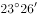

# 2021年四川下半年公务员录用考试《行测》试题（网友回忆版）

> 常识判断 · 13 题 · 四川 2021

## 第 1 题　qid 4658514 · 人文常识

社会治理现代化是国家治理体系和治理能力现代化的题中应有之义。关于社会治理现代化的内容，下列表述正确的是：
①社会治理结构的合理化
②社会治理过程的民主化
③社会治理方式的科学化
④社会治理目标的多样化

- **A**. ①②③　✅
- **B**. ①③④
- **C**. ①②④
- **D**. ②③④

**答案**：A

**官方解析**

本题考查政治常识。
①②③正确，④错误，作为国家治理的重要领域，社会治理必须正确处理好维稳与维权、活力与秩序的关系，充分调动一切积极因素，确保社会既充满生机活力又保持安定有序。因此，提高社会治理效能，助推社会治理现代化，是完善国家治理体系和提升治理能力的应有之义。当前我国社会治理体系不断完善，社会安全稳定形势持续向好，人民生命财产安全得到有效维护，人民群众对社会事务参与意愿更加强烈，广大人民群众的安全感和满意度不断增强。提高治理效能，加强和创新社会治理，逐步实现社会治理结构的合理化、治理方式的科学化、治理过程的民主化，将有力推进国家治理现代化的进程。
故正确答案为A。

---

## 第 2 题　qid 4658515 · 人文常识

“十四五”规划纲要指出，全面推进健康中国建设，构建强大公共卫生体系。下列不属于公共卫生范畴的是：

- **A**. 大病医疗保障　✅
- **B**. 食品安全风险监测
- **C**. 流感流行应急预案
- **D**. 预防艾滋病母婴传播

**答案**：A

**官方解析**

本题考查政治常识。
A项错误，B、C、D三项正确，公共卫生，是全社会的公私机构、大小社群以及所有个人，通过有组织的努力与有根据的选择，来预防疾病、延长寿命并促进健康的科学与技术。公共卫生具体包括对重大疾病，尤其是传染病（如结核、艾滋病、SARS、新冠肺炎等）的预防、监控和治疗；对食品、药品、公共环境卫生的监督管制，以及相关的卫生宣传、健康教育、免疫接种等。
本题为选非题，故正确答案为A。

---

## 第 3 题　qid 4658516 · 法律常识

为了加强安全生产工作，防止和减少生产安全事故、保障人民群众生命和财产安全，促进经济社会持续健康发展，我国制定了相关的法律法规。根据我国安全生产管理的相关制度，下列说法错误的是：

- **A**. 建设工程施工单位应当在施工现场入口处设置明显的安全警示标志
- **B**. 烟花爆竹生产企业若未取得安全生产许可证的，不得从事生产活动
- **C**. 大型游乐设施属于特种设备，使用单位应当记录其日常使用情况
- **D**. 电梯应当至少每30日进行一次清洁、润滑、调整和检查　✅

**答案**：D

**官方解析**

本题考查法律常识。
A项正确，根据《建设工程安全生产管理条例》第二十八条第一款规定：“施工单位应当在施工现场入口处、施工起重机械、临时用电设施、脚手架、出入通道口、楼梯口、电梯井口、孔洞口、桥梁口、隧道口、基坑边沿、爆破物及有害危险气体和液体存放处等危险部位，设置明显的安全警示标志。安全警示标志必须符合国家标准。”
B项正确，根据《烟花爆竹生产企业安全生产许可证实施办法》第三条规定：“企业应当依照本办法的规定取得烟花爆竹安全生产许可证（以下简称安全生产许可证）。未取得安全生产许可证的，不得从事烟花爆竹生产活动。”
C项正确，根据《中华人民共和国特种设备安全法》第二条第二款规定：“本法所称特种设备，是指对人身和财产安全有较大危险性的锅炉、压力容器（含气瓶）、压力管道、电梯、起重机械、客运索道、大型游乐设施、场（厂）内专用机动车辆，以及法律、行政法规规定适用本法的其他特种设备。”第三十五条规定：“特种设备使用单位应当建立特种设备安全技术档案。安全技术档案应当包括以下内容：（一）特种设备的设计文件、产品质量合格证明、安装及使用维护保养说明、监督检验证明等相关技术资料和文件；（二）特种设备的定期检验和定期自行检查记录；（三）特种设备的日常使用状况记录；（四）特种设备及其附属仪器仪表的维护保养记录；（五）特种设备的运行故障和事故记录。”
D项错误，根据《特种设备安全监察条例》第三十一条规定：“电梯的日常维护保养必须由依照本条例取得许可的安装、改造、维修单位或者电梯制造单位进行。电梯应当至少每15日进行一次清洁、润滑、调整和检查。”
本题为选非题，故正确答案为D。

---

## 第 4 题　qid 4658481 · 人文常识

组织是经设计以达到某种特定目标的社会群体，下列关于组织的判断正确的是：

- **A**. 我国的共青团属于政府组织
- **B**. 机关的合唱团属于非正式组织　✅
- **C**. 社区是城市最基层的政府组织
- **D**. 职业足球俱乐部不属于经济组织

**答案**：B

**官方解析**

本题考查管理常识。
A、C两项错误，政府组织指国家的行政机关，即根据宪法和法律组建的、正是行政权力、执行行政职能、推行政务、管理国家公共事务的机关体系，是国家权力机关的执行机关。共青团不具有行政管理职能，不属于政府组织；社区是若干社会群体或社会组织聚集在某一个领域里所形成的一个生活上相互关联的大集体，是综合基础的群众基础机构，不具有行政管理职能，不属于政府组织。
B项正确，非正式组织指以情感、兴趣、爱好和需要为基础，以满足个体的不同需要为纽带，没有正式文件规定的、自发形成的一种开放式的社会组织。机关合唱团的组成没有正式文件规定，是喜欢合唱的人员自发形成的，属于非正式组织。
D项错误，经济组织是指如家庭、企业、公司等按一定方式组织生产要素进行生产、经营活动的单位，是一定的社会集团为了保证经济循环系统的正常运行，通过权责分配和相应层次结构所构成的一个完整的有机整体。职业足球俱乐部是进行经营活动的有机整体，属于经济组织。
故正确答案为B。

---

## 第 5 题　qid 4658484 · 人文常识

下列名言与作者对应不正确的是：

- **A**. 疾风知劲草，板荡识诚臣——刘邦　✅
- **B**. 世有伯乐，然后有千里马——韩愈
- **C**. 江山代有才人出，各领风骚数百年——赵翼
- **D**. 大鹏一日同风起，扶摇直上九万里——李白

**答案**：A

**官方解析**

本题考查人文常识。
A项错误，“疾风知劲草，板荡识诚臣”出自唐代李世民的《赐萧瑀》，意思是只有经过疾风的考验，才会知道什么是劲草；社会动荡，才能分辨出谁是忠臣。这是李世民对萧瑀的高度赞美和肯定，其中也不无感激之情。
B项正确，“世有伯乐，然后有千里马”出自唐代韩愈的《韩昌黎集·杂说》，意思是世间因有善识千里马的人然后才能有千里马。喻指人才常有，而能识才用才的人却难能可贵。
C项正确，“江山代有才人出，各领风骚数百年”出自清代赵翼的《论诗五首·其二》，意思是国家代代都有很多有才情的人，他们的诗篇文章以及人气都会流芳百世。
D项正确，“大鹏一日同风起，扶摇直上九万里”出自唐代李白的《上李邕》，意思是大鹏总有一天会和风飞起，凭借风力直上九霄云外。
本题为选非题，故正确答案为A。

---

## 第 6 题　qid 4658486 · 人文常识

人体包括运动系统、神经系统、内分泌系统、循环系统、呼吸系统、消化系统、泌尿系统、生殖系统这八大系统，关于人体八大系统，下列说法错误的是：

- **A**. 唾液腺和胃腺是消化腺，属于消化系统
- **B**. 组成人体循环系统的是体循环和肺循环　✅
- **C**. 糖尿病是内分泌系统紊乱所导致的疾病
- **D**. 泌尿系统由肾、输尿管、膀胱及尿道组成

**答案**：B

**官方解析**

本题考查科技常识。
A项正确，人体消化系统由消化道和消化腺两大部分组成。人体消化道包括口腔、咽、食管、胃、小肠(包括十二指肠、空肠、回肠)和大肠(包括盲肠、阑尾、结肠、直肠)。消化腺包括唾液腺、胃腺、肝脏、胰腺、肠腺，其主要功能是分泌消化液，参与消化。
B项错误，循环系统是分布于全身各部的连续封闭管道系统，它包括心血管系统和淋巴系统。心血管系统内循环流动的是血液，包括心、动脉、毛细血管和静脉。血液由心室射出，经动脉、毛细血管、静脉返回心房，这种周而复始循环不止的过程称血液循环，根据循环途径不同，可分为体循环和肺循环。淋巴系统内流动的是淋巴液。淋巴液沿着一系列的淋巴管道向心流动，最终汇入静脉，因此淋巴系统也可认为是静脉系统的辅助部分。
C项正确，内分泌系统紊乱，即内分泌失调。人体分泌各种激素和神经系统一起调节人体的代谢和生理功能。正常情况下各种激素是保持平衡的。如因某种原因使这种平衡打破了（某种激素过多或过少）这就造成内分泌紊乱，会引起相应的临床表现。糖尿病是一组以高血糖为特征的代谢性疾病。高血糖则是由于胰岛素分泌缺陷或其生物作用受损，或两者兼有引起。
D项正确，泌尿系统由肾脏、输尿管、膀胱及尿道组成。其主要功能为排泄。排泄是指机体代谢过程中所产生的各种不为机体所利用或者有害的物质向体外输送的生理过程。
本题为选非题，故正确答案为B。

---

## 第 7 题　qid 4658491 · 地理国情

关于地理知识，下列说法错误的是：

- **A**. 北京的气候类型特点是夏季高温多雨，冬季寒冷干燥
- **B**. 南北归线之间的区域每年太阳直射两次，形成热带
- **C**. 欧亚地震带，环太平洋地震带分别主要影响着我国西南部、中部地区　✅
- **D**. 北回归线自西向东依次穿越我国的云贵高原、东南丘陵等主要地形区

**答案**：C

**官方解析**

本题考查地理国情。

A项正确，北京地区属于华北，气候为暖温带半湿润半干旱季风气候，夏季高温多雨，冬季寒冷干燥，春、秋短促。全年无霜期180～200天，西部山区较短。2007年平均降雨量483.9毫米，为华北地区降雨最多的地区之一。降水季节分配很不均匀，全年降水的80%集中在夏季6、7、8三个月，7、8月有大雨。

B项正确，回归线指的是地球上南、北纬的两条纬度圈，是太阳每年在地球上直射来回移动的分界线。北纬称为北回归线，是阳光在地球上直射点的最北界线。南纬称为南回归线，是阳光在地球上直射点的最南界线。南北回归线是热带和南北温带间的分界线。北回归线和南回归线之间的地区为热带，这个区域太阳每年直射两次，获得的热量最多。

C项错误，欧亚地震带主要分布于欧亚大陆，从印度尼西亚开始，经中南半岛西部和我国的云、贵、川、青、藏地区，以及印度、巴基斯坦、尼泊尔、阿富汗、伊朗、土耳其到地中海北岸，一直延伸到大西洋的亚速尔群岛。环太平洋地震带是一个围绕太平洋经常发生地震和火山爆发的地区，有一连串海沟、列岛和火山。它像一个巨大的环，围绕着太平洋分布，主要影响我国台湾和福建等东部地区。

D项正确，北回归线在中国境内自西往东穿过的地区依次是：云南、广西、广东、台湾四省区，自西向东依次穿越我国的云贵高原、东南丘陵等主要地形区。

本题为选非题，故正确答案为C。

---

## 第 8 题　qid 4658493 · 人文常识

关于我国名胜古迹，下列说法错误的是：

- **A**. 桂林山水是典型的丹霞地貌　✅
- **B**. 敦煌石窟是世界现存壁画最多的石窟群
- **C**. 秦始皇陵兵马俑大部分采用泥土陶冶烧制
- **D**. 万里长城的修建是为了抵御游牧部落的侵扰

**答案**：A

**官方解析**

本题考查地理国情。

A项错误，桂林山水属于喀斯特地貌，也称岩溶地貌，而非丹霞地貌，桂林地区的岩溶洞穴，分布广(2400)，数量多(达3000多个)，内容丰富，具多方面的研究和开发利用价值。

B项正确，敦煌石窟，即莫高窟，位于甘肃敦煌县城东南25公里处。始建于前秦建元二年（366年），经北魏、西魏、北周、隋、唐、五代、宋、西夏、元诸代相继凿建，成为庞大的石窟群，是我国乃至世界壁画最多、内容最丰富的石窟壁画。它与雕塑、建筑组成艺术的综合体，成为举世闻名的艺术宝库。

C项正确，兵马俑大部分是采用陶冶烧制的方法制成，先用陶模做出初胎，再覆盖一层细泥进行加工刻画加彩，有的先烧后接，有的先接再烧。火候均匀、色泽单纯、硬度很高。每一道工序中，都有不同的分工，都有一套严格的工作系统。

D项正确，万里长城是古代中国在不同时期为抵御塞北游牧部落联盟侵袭而修筑的规模浩大的军事工程的统称。长城东西绵延上万华里，因此又称作万里长城。现存的长城遗迹主要为明长城，西起嘉峪关，东至辽东虎山。

本题为选非题，故正确答案为A。

---

## 第 9 题　qid 4658476 · 科技常识

关于病毒，下列说法错误的是：

- **A**. 利用寄主细胞中的物质和能量，以复制的方式进行繁殖
- **B**. 据寄生的寄主不同分为动物病毒、植物病毒、细菌病毒
- **C**. 多数耐寒不耐热且对抗生素不敏感，可用碘化物等灭活
- **D**. 含有一种或两种核酸：DNA或RNA，或两种核酸兼有　✅

**答案**：D

**官方解析**

本题考查科技常识。
A项正确，病毒是一种个体微小，结构简单，必须在活细胞内寄生并以复制方式增殖的非细胞型生物。病毒离开宿主细胞，就成了没有任何生命活动、也不能独立自我繁殖的化学物质。它的复制、转录、和转译都是在宿主细胞中进行，当它进入宿主细胞后，它就可以利用细胞中的物质和能量完成生命活动，按照它自己的核酸所包含的遗传信息产生和它一样的新一代病毒。
B项正确，根据病毒寄生的宿主细胞的不同，病毒分为植物病毒、动物病毒和细菌病毒（噬菌体是侵袭细菌的病毒）。
C项正确，大多数病毒耐冷不耐热，对热不稳定。高温会使病毒的蛋白质变性。病毒对抗生素不敏感。碘能引起蛋白质变性（形成碘化蛋白质）而具有极强的杀菌力，能杀死细菌、霉菌、芽胞和病毒，碘化物（如碘酒、碘甘油等）可以杀灭病毒。
D项错误，病毒结构简单，只含一种核酸（DNA或RNA），从结构上还分为：单链RNA病毒，双链RNA病毒，单链DNA病毒和双链DNA病毒。
本题为选非题，故正确答案为D。

---

## 第 10 题　qid 4658479 · 人文常识

关于消防安全知识，下列说法错误的是：

- **A**. 居民小区消防通道宽度不应小于4米
- **B**. 电器着火、油着火时不能用水去扑救
- **C**. 生活区域应配置的灭火器为泡沫灭火器　✅
- **D**. 高层民用建筑内不得用瓶装液化石油气

**答案**：C

**官方解析**

本题考查科技常识。
A项正确，根据《中华人民共和国国际标准GB 50016-2006 建筑设计防火规范》：6.0.9消防车道的净宽度和净空高度均不应小于4.0m。即小区的消防车道最基本的标准是4米宽4米高。
B项正确，电器着火不能用水扑救，因为电器一般来说都是带电的，而泼上去的水是能导电的，用水救火可能会使人触电。油比水轻，当油着火的时候，如果泼水灭火，水会沉到油层底下去，使油层往上涨，大大增加它与空气接触的面积，导致火越烧越旺。
C项错误，生活区域配备的灭火器类型是干粉灭火器或者二氧化碳灭火器。泡沫灭火器最适宜扑救B类火灾，如汽油、柴油等液体火灾；也可用来扑灭A类火灾，如木材、棉布等固体物质燃烧引起的失火。
D项正确，瓶装液化石油气一旦泄漏会迅速气化，火灾危险系数高。高层建筑在人员疏散、扑救火灾上难度较高，而且运输不方便，如用电梯运输气瓶，一旦液化气漏入电梯中，容易发生严重爆炸事故。
本题为选非题，故正确答案为C。
注：本题A项说法不严谨，应为居民小区消防车道宽度不应小于4米。

---

## 第 11 题　qid 4658489 · 科技常识

石墨是一种①化合物，能够②导电，可用作③润滑剂，与金刚石互为④同素异形体。关于石墨性质的描述，画线部分错误的有几处?

- **A**. 1　✅
- **B**. 2
- **C**. 3
- **D**. 4

**答案**：A

**官方解析**

本题考查科技常识。
①错误，④正确，化合物是由两种或两种以上不同元素组成的纯净物（区别于单质）。石墨与金刚石、碳60、碳纳米管、石墨烯等都是碳元素的单质，它们互为同素异形体。
②正确，石墨的导电性比一般非金属矿高一百倍。石墨能够导电是因为石墨中每个碳原子与其他碳原子只形成3个共价键，每个碳原子仍然保留1个自由电子来传输电荷。
③正确，石墨的润滑性能取决于石墨鳞片的大小，鳞片越大，摩擦系数越小，润滑性能越好。
故②③④正确，①错误。
本题为选非题，故正确答案为A。

---

## 第 12 题　qid 4658496 · 科技常识

下列教学行为与体现的教学原则对应不正确的是：

- **A**. 陈老师在讲完一节课后，会给学生布置与上课内容相关的作业——巩固性原则
- **B**. 王老师在上新课时讲到“镭”这一元素，向同学们介绍了居里夫人和镭的故事，同学们深受教育——启发性原则　✅
- **C**. 刘老师对马虎的学生，注意抓他们的学习习惯，对课堂反应不积极的学生，激励他们主动回答问题——因材施教原则
- **D**. 李老师在讲《黄河大合唱》一文时，为了让学生更好地感受到《黄河大合唱》的气势，播放了对应歌曲——直观性原则

**答案**：B

**官方解析**

本题考查管理常识。
A项正确，巩固性原则是指教学中使学生在理解的基础上，将知识、技能牢固地保持在记忆中，达到熟练程度，需要时能及时、准确地再现。巩固知识、技能的主要方法是复习和练习。运用已经学过的知识解释新的事实或解决实际问题，是最有效地巩固旧知识的方法。陈老师布置与上课内容相关的作业是为了让学生复习课堂上所学的知识，体现了巩固性原则。
B项错误，启发性原则是指在教学中教师要承认学生是学习的主体，在教学工作中依据学习过程的客观规律，运用各种教学手段充分调动学生学习主动性、积极性，引导他们独立思考，积极探索，自觉地掌握科学知识、提析和解决问题的能力的教学原则。王老师介绍居里夫人和镭的故事没有体现出学生是学习的主体。
C项正确，因材施教原则是指教师要从学生实际情况、个别差异出发，有的放矢地进行有差别的教学，使每一个学生都能扬长避短，获得最佳发展。刘老师对不同的学生注意加强他们的不同方面，体现了因材施教原则。
D项正确，直观性原则是指教学中引导学生直接感知事物、模型或通过教师形象语言描绘学习对象，使学生获得感性认识。反映了从感性到理性的认识发展规律。李老师播放《黄河大合唱》属于直观性原则的电教应用中的语言直观。
本题为选非题，故正确答案为B。

---

## 第 13 题　qid 4658499 · 科技常识

辛弃疾所作《生查子·独游雨岩》写到：“溪边照影行，天在清溪底”。下列诗句中与此情景体现的物理原理一致的是：

- **A**. 举杯邀明月，对影成三人
- **B**. 潭清疑水浅，荷动知鱼散
- **C**. 独行潭底影，数息树边身　✅
- **D**. 香炉初上日，瀑水喷成虹

**答案**：C

**官方解析**

本题考查科技常识。
“溪边照影行，天在清溪底”意思是人在溪边行走溪水映照出人影，蓝天倒映在清清的溪水里。体现的物理原理是光的反射，指当光在两种物质分界面上改变传播方向又返回原来物质中的现象。光遇到水面、玻璃以及其他许多物体的表面都会发生反射。
A项错误，“对影成三人”（月亮、作者及其影子是为“三人”）中影子的形成是由于光的直线传播。光在同一种均匀介质中沿直线传播，当遇到障碍物遮挡时，由于光线不能穿过而在障碍物后形成阴影区，是为影子。
B项错误，“潭清疑水浅”意思是潭水清澈见底，感觉潭水很浅，原因是光线发生折射，当光线从水或其它介质中斜射入空气中时，折射光线会远离法线，因此，人会感觉池水变浅。
C项正确，“独行潭底影，数息树边身”意思是潭水中倒映着他独行的身影，他多次身倚树边休息。体现的物理原理是光的反射，与题干一致。
D项错误，“香炉初上日，瀑水喷成虹”意思是香炉峰升起一轮红日，飞瀑映照幻化成彩虹。彩虹的形成需要两个条件：①空气中有小水滴；②有光。当阳光照射到小水滴时，光线被折射和反射（阳光进入水滴，先折射一次，然后在水滴的背面反射，最后离开水滴时再折射一次，总共经过一次反射两次折射），不同波长的光折射率不同，所以就可以看到由外到内红、橙、黄、绿、蓝、靛、紫的七色彩虹。
故正确答案为C。

---
