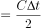
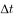
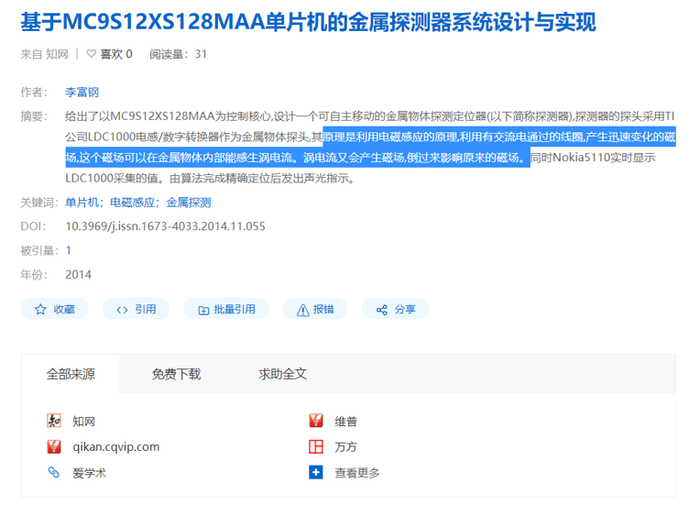
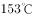
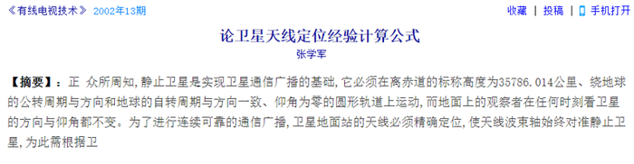
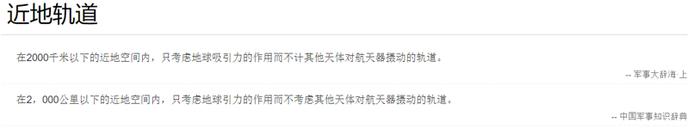
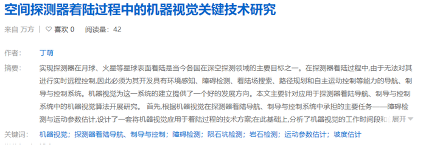
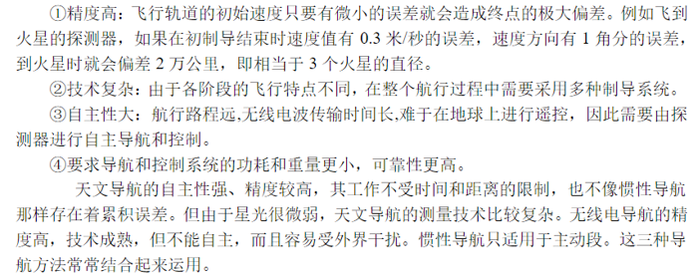

# 2021年国家公务员录用考试《行测》题（副省级网友回忆版）

> 常识判断 · 16 题 · 国考 2021

## 第 1 题　qid 2719289 · 法律常识

2020年3月9日，中共中央办公厅发布《党委（党组）落实全面从严治党主体责任规定》，根据该规定，党组（党委）应当加强对本单位（本系统）全面从严治党各项工作的领导。在加强党的建设方面，下列理解不准确的是：

- **A**. 支持纪检监察机关履行监督责任，一体推进不敢腐、不能腐、不想腐
- **B**. 持续整治“四风”特别是形式主义、官僚主义，反对特权思想和特权现象
- **C**. 把党的思想建设摆在首位，坚定政治信仰，强化政治领导，提高政治能力，净化政治生态　✅
- **D**. 党组（党委）带头遵守党内法规制度，严格落实党内法规执行责任制

**答案**：C

**官方解析**

本题考查政治常识。
A项正确，根据《党委（党组）落实全面从严治党主体责任规定》第七条第七款规定：加强党的纪律建设，履行党风廉政建设主体责任，支持纪检监察机关履行监督责任，一体推进不敢腐、不能腐、不想腐。
B项正确，根据《党委（党组）落实全面从严治党主体责任规定》第六条第六款规定：持之以恒抓好党的作风建设，落实中央八项规定精神，持续整治“四风”特别是形式主义、官僚主义，反对特权思想和特权现象，密切党同人民群众的血肉联系。
C项错误，根据《党委（党组）落实全面从严治党主体责任规定》第六条第三款规定：把党的政治建设摆在首位，坚定政治信仰，强化政治领导，提高政治能力，净化政治生态，始终在政治立场、政治方向、政治原则、政治道路上同党中央保持高度一致。
D项正确，根据《党委（党组）落实全面从严治党主体责任规定》第七条第八款规定：带头遵守党内法规制度，严格落实党内法规执行责任制，建立健全本单位（本系统）党建工作制度，不断提高制度执行力。
本题为选非题，故正确答案为C。

---

## 第 2 题　qid 2719302 · 地理国情

下列先烈的书信，按时间先后排序正确的是：
①“看最近之情况，敌人或要再来碰一下钉子，只要敌来犯，兄即到河东与弟等共同去牺牲。······更相信只要我等能本此决心，我们的国家及我五千年历史之民族，决不致亡于区区三岛倭奴之手。”
②“志兰！亲爱的：别时容易见时难，分离二十一个月了，何日相聚······愿在党的整顿之风下各自努力，力求进步吧！以进步来安慰自己，以进步来酬报别后衷情。”
③“母亲因为坚决地做了反满抗日的斗争，今天已经到了牺牲的前夕了。······母亲不用千言万语来教育你，就用实行来教育你。在你长大成人之后，希望不要忘记你的母亲是为国而牺牲的！”
④“山东交涉及北京学界之举动，迪纯兄归，当知原委。······现每日有游行演讲，有救国日刊，各举动积极进行，但取不越轨范以外，以稳健二字为宗旨。”

- **A**. ③④②①
- **B**. ④②①③
- **C**. ③④①②
- **D**. ④③①②　✅

**答案**：D

**官方解析**

本题考查人文常识。

①这封信是1940年5月1日，枣宜会战前夕张自忠亲笔昭告各将领、各部队的书信。枣宜会战中，张自忠将军身负七处重伤，壮烈殉国，成为抗战期间中国军队牺牲的最高将领、二战中盟军牺牲的最高将领。

②这封家书是1942年5月22日，左权将军壮烈殉国前三天写给爱妻刘志兰的最后一封信。由信中“党的整顿之风”可判断当时党内正开展整风运动（1941年-1945年）。

③这封信是1936年赵一曼写给儿子的遗书，九一八事变后，日本帝国主义于1932年在长春成立了伪满洲国傀儡政权，信中“反满抗日”指的便是东北人民反抗伪满洲国的抗日活动，此时处于东北局部抗战时期。

④这封信是1919年5月17日，闻一多写给父母的家书，信中“山东交涉及北京学界之举动”“每日有游行演讲”等交代了当时北京学界游行演讲是为了争取山东主权问题，故可判断当时正处于五四运动时期。

综上，上述先烈的书信，按时间先后排序应为④③①②（五四运动局部抗战全面抗战延安整风）。

故正确答案为D。

---

## 第 3 题　qid 2719294 · 人文常识

根据2020年1月21日中共中央办公厅发布的《纪检监察机关处理检举控告工作规则》，下列表述错误的是：

- **A**. 对匿名检举控告材料，确有需要的，可以直接核查检举控告人的笔迹、网际协议地址（IP地址）等信息　✅
- **B**. 纪检监察机关提倡、鼓励实名检举控告，对实名检举控告优先办理、优先处置、给予答复
- **C**. 承办的监督检查、审查调查部门应当将实名检举控告的处理结果在办结之日起15个工作日内向检举控告人反馈
- **D**. 纪检监察机关信访举报部门可以通过面谈方式核实是否属于实名检举控告

**答案**：A

**官方解析**

本题考查法律常识。
A项错误，第五章，实名检举控告的处理中第二十九条第二款规定：对匿名检举控告材料，不得擅自核查检举控告人的笔迹、网际协议地址（IP地址）等信息。对检举控告人涉嫌诬告陷害等违纪违法行为，确有需要采取上述方式追查其身份的，应当经设区的市级以上纪委监委批准。
B项正确，第五章，实名检举控告的处理中第二十五条规定：纪检监察机关提倡、鼓励实名检举控告，对实名检举控告优先办理、优先处置、给予答复。
C项正确，第五章，实名检举控告的处理中第二十七条第一款规定：承办的监督检查、审查调查部门应当将实名检举控告的处理结果在办结之日起15个工作日内向检举控告人反馈，并记录反馈情况。
D项正确，第五章，实名检举控告的处理中第二十四条第二款规定：纪检监察机关信访举报部门可以通过电话、面谈等方式核实是否属于实名检举控告。
本题为选非题，故正确答案为A。

---

## 第 4 题　qid 2719307 · 人文常识

根据2020年7月1日起实施的《中华人民共和国公职人员政务处分法》，下列说法错误的是：

- **A**. 政务处分的对象不仅包括公务员，也包括国有企业管理人员
- **B**. 政务处分不同于党纪处分
- **C**. 政务处分决定由监察机关依法作出，也可以由公职人员任免机关、单位作出　✅
- **D**. 对公职人员的同一违法行为，监察机关和公职人员任免机关、单位不得重复给予政务处分和处分

**答案**：C

**官方解析**

本题考查法律常识。
A项正确，《政务处分法》第二条规定：“本法适用于监察机关对违法的公职人员给予政务处分的活动。本法第二章、第三章适用于公职人员任免机关、单位对违法的公职人员给予处分。处分的程序、申诉等适用其他法律、行政法规、国务院部门规章和国家有关规定。本法所称公职人员，是指《中华人民共和国监察法》第十五条规定的人员。”《监察法》第十五条规定：“监察机关对下列公职人员和有关人员进行监察：（一）中国共产党机关、人民代表大会及其常务委员会机关、人民政府、监察委员会、人民法院、人民检察院、中国人民政治协商会议各级委员会机关、民主党派机关和工商业联合会机关的公务员，以及参照《中华人民共和国公务员法》管理的人员；（二）法律、法规授权或者受国家机关依法委托管理公共事务的组织中从事公务的人员；（三）国有企业管理人员；（四）公办的教育、科研、文化、医疗卫生、体育等单位中从事管理的人员；（五）基层群众性自治组织中从事管理的人员；（六）其他依法履行公职的人员。”
B项正确：政务处分是监察机关对违法的公职人员给予的惩戒。党纪处分是党员违反党的纪律，危害党、国家和人民利益，应当依照规定受到的纪律处分。政务处分与党纪处分的区别主要有：①党纪处分的对象是党员，政务处分的对象是行使公权力的公职人员；②党纪处分对应的是违纪行为，政务处分对应的是违法行为；③党纪处分的依据主要是党章、党纪处分条例、党内监督条例等党内法规，政务处分的依据主要是政务处分法、监察法、公务员法、法官法、检察官法、行政机关公务员处分条例、事业单位工作人员处分暂行规定、公职人员政务处分暂行规定等法律法规。
C项错误，《政务处分法》第三条规定：“监察机关应当按照管理权限，加强对公职人员的监督，依法给予违法的公职人员政务处分。公职人员任免机关、单位应当按照管理权限，加强对公职人员的教育、管理、监督，依法给予违法的公职人员处分。监察机关发现公职人员任免机关、单位应当给予处分而未给予，或者给予的处分违法、不当的，应当及时提出监察建议。”政务处分由监察机关依法作出。
D项正确，《政务处分法》第十六条规定：“对公职人员的同一违法行为，监察机关和公职人员任免机关、单位不得重复给予政务处分和处分。”
本题为选非题，故正确答案为C。

---

## 第 5 题　qid 2719426 · 法律常识

关于我国民法典，下列说法正确的是：

- **A**. 秉持“民商合一”传统，把许多商事法律规范纳入其中　✅
- **B**. 对我国先前的民法体系和内容实现了颠覆性突破
- **C**. 首次将节约资源、保护生态环境列为民事活动基本原则
- **D**. 知识产权和涉外民事法律关系独立成编

**答案**：A

**官方解析**

本题考查法律常识。
十三届全国人大三次会议审议通过的《中华人民共和国民法典》，是新中国成立以来第一部以“法典”命名的法律，是新时代我国社会主义法治建设的重大成果。
A项正确，我国民事法律制度建设一直秉持“民商合一”的传统，把许多商事法律规范纳入民法之中。编纂民法典，进一步完善我国民商事领域基本法律制度和行为规则，为各类民商事活动提供基本遵循，有利于充分调动民事主体的积极性和创造性、维护交易安全、维护市场秩序，有利于营造各种所有制主体依法平等使用资源要素、公开公平公正参与竞争、同等受到法律保护的市场环境，推动经济高质量发展。
B项错误，《民法典》系统整合了新中国成立70多年来长期实践形成的民事法律规定，既不是制定全新的民事法律，也不是简单的法律汇编。所以实现颠覆性突破说法错误。
C项错误，民法的基本原则包括平等、自愿、公平、诚信、不得违反法律和公序良俗、有利于节约资源和保护生态环境的原则（简称为绿色原则）。节约资源和保护生态环境的原则在《民法总则》就已经规定了。
D项错误，《民法典》共7编、1260条，各编依次为总则、物权、合同、人格权、婚姻家庭、继承、侵权责任，以及附则。《民法典》没有将知识产权单独成编，我国知识产权立法既包括民事权利的内容，也有行政管理的内容，但《民法典》调整的是平等民事主体之间的民事法律关系，不宜纳入行政管理方面的内容。
故正确答案为A。

---

## 第 6 题　qid 2719293 · 人文常识

中共中央、国务院于2019年11月印发了《国家积极应对人口老龄化中长期规划》，其中提及的积极应对人口老龄化的战略目标包括：
①制度基础持续巩固
②财富储备日益充沛
③人力资本不断提升
④科技支撑更加有力
⑤城乡区域协调发展

- **A**. ①③④⑤
- **B**. ①②③④　✅
- **C**. ①②④⑤
- **D**. ②③④⑤

**答案**：B

**官方解析**

本题考查政治常识。
《国家积极应对人口老龄化中长期规划》提出的积极应对人口老龄化的战略目标是：积极应对人口老龄化的制度基础持续巩固，财富储备日益充沛，人力资本不断提升，科技支撑更加有力，产品和服务丰富优质，社会环境宜居友好，经济社会发展始终与人口老龄化进程相适应，顺利建成社会主义现代化强国，实现中华民族伟大复兴的中国梦。
综上，①②③④属于积极应对人口老龄化的战略目标。
故正确答案为B。

---

## 第 7 题　qid 2719312 · 人文常识

长征是宣言书、长征是宣传队、长征是播种机。下列《长征组歌》中的诗句，按所反映事件发生的先后顺序排列正确的是：
①六盘山上红旗展，势如破竹扫敌骑
②昼夜兼程二百四，猛打穷追夺泸定
③雪山低头迎远客，草毯泥毡扎营盘
④战士双脚走天下，四渡赤水出奇兵

- **A**. ③①④②
- **B**. ③④②①
- **C**. ④③①②
- **D**. ④②③①　✅

**答案**：D

**官方解析**

本题考查毛中特。
①1935年10月，中央红军在毛泽东等人率领下，经过艰苦斗争，于7日经宁夏隆德县，翻越六盘山。
②1935年5月29日。中央红军部队在四川省中西部强渡大渡河成功，沿大渡河东岸北上，主力由安顺场沿大渡河右岸北上，红四团官兵在天下大雨的情况下，在崎岖陡峭的山路上跑步前进，在5月29日凌晨6时许按时到达泸定桥西岸。第2连连长和22名突击队员沿着枪林弹雨和火墙密布的铁索踩着铁链夺下桥头，并与东岸部队合围占领了泸定桥。
③1935年6月至1936年7月，红四方面军在所经过的四川、西藏、青海、甘肃四省内，翻越了海拔4400米以上的雪山共5座，其中梦笔山、夹金山都是两次经过，虹桥山、折多山、巴郎山是一次经过。虹桥山海拔4592米，是红四方面军翻过的雪山中最高的一座。草地在四川省西北部与甘肃交接处，纵横数百里，四川松潘以北，班佑地区之南，也叫松潘大草地。
④四渡赤水是中央红军在长征途中，为争取战略主动，在贵州、四川、云南边境地区，成功进行的一次高度灵活机动的战略性战役。从1935年1月19日红军离开遵义开始，到5月9日胜利渡过金沙江为止，历时3个多月。在毛泽东、周恩来等的领导下，中央红军粉碎了蒋介石围歼红军于川黔滇的企图，展现了中国共产党领导人高超的军事指挥艺术，是我军革命战争史上的光辉典范。
正确的顺序为④②③①。
故正确答案为D。

---

## 第 8 题　qid 2719427 · 人文常识

下列与军事武器有关说法错误的是：

- **A**. 东风-31是我国最新一代洲际战略核导弹　✅
- **B**. 电磁脉冲武器可以打击敌军导弹防护系统
- **C**. 护卫舰在吨位和火力上一般次于驱逐舰
- **D**. 机枪的有效射程和射速优于突击步枪

**答案**：A

**官方解析**

本题考查科技常识。
A项错误，东风-41是我国最新一代洲际战略核导弹。2019年10月1日，在庆祝新中国成立70周年阅兵式上，东风-41洲际战略核导弹首次亮相。东风-41性能与发达国家的第六代，如美国民兵-3和俄罗斯的白杨-M洲际弹道导弹基本相当，部分技术甚至已经超过它们。
B项正确，电磁脉冲武器是能产生强电磁脉冲以毁坏敌方电子信息装备或破坏其正常工作的各种弹药的总称。电磁脉冲弹包括电磁脉冲炸弹、电磁脉冲炮弹、电磁脉冲导弹等。主要用来破坏雷达、无线电通信设备、电子对抗设备、计算机以及光电、射频制导武器等。
C项正确，护卫舰是以导弹、舰炮、深水炸弹及反潜鱼雷为主要武器的轻型水面战斗舰艇，其主要任务是为舰艇编队担负反潜、护航、巡逻、警戒、侦察及支援登陆作战任务以及提供无人舰载机的起飞和降落。在现代海军编队中，护卫舰是在吨位和火力上仅次于驱逐舰的水面作战舰只，但由于其吨位较小，自持力较驱逐舰为弱，远洋作战能力逊于驱逐舰。
D项正确，机枪和突击步枪同为具备自动射击能力的轻武器，但是两者在定位、性能等方面有明显的区别。机枪分为重机枪、轻机枪、通用机枪等，其与突击步枪相比，主要担任的是中远程的火力压制和支援任务，因此它射程远，一般有效射程在600~1000米范围，子弹出口速度高，存速存能和威力都超过突击步枪，具有相当大的威力。而突击步枪有效射程一般在400米左右，主要强调的是中近距离突击作战。
本题为选非题，故正确答案为A。

---

## 第 9 题　qid 2719290 · 科技常识

下列我国科技成就，按照时间先后排序正确的是：
①屠呦呦获诺贝尔生理学或医学奖
②汉字激光照相排版系统研制成功
③袁隆平成功培育出籼型杂交水稻
④超级计算机“天河一号”研制成功
⑤北斗三号全球卫星导航系统正式开通

- **A**. ③②④①⑤　✅
- **B**. ②③⑤④①
- **C**. ③⑤②④①
- **D**. ②④③①⑤

**答案**：A

**官方解析**

本题考查科技常识。
①2015年10月5日，我国科学家屠呦呦获得诺贝尔生理学或医学奖，她也由此成为迄今为止第一位获得诺贝尔科学奖项的本土中国科学家。
②1975年5月，北京大学开始研制汉字激光照排系统，由王选教授等主持这项工作。1979年7月27日，科研人员用自己研制的照排系统，一次成版地输出一张由各种大小字体组成、版面布局复杂的八开报纸样纸，报头是“汉字信息处理”六个大字。这是首次用激光照排机输出的中文报纸版面。
③1973年，袁隆平成功培育出世界上第一个籼型杂交水稻，他也因此获得了“杂交水稻之父”的称号。
④“天河一号”是中国首台千兆次超级计算机。“天河一号”超级计算机从2008年开始研制，按两期工程实施：一期系统于2009年9月研制成功；二期系统于2010年8月在国家超级计算天津中心升级完成。
⑤2020年7月31日上午，北斗三号全球卫星导航系统建成暨开通仪式在北京举行。中共中央总书记、国家主席、中央军委主席习近平出席仪式，宣布北斗三号全球卫星导航系统正式开通。
因此，按时间先后顺序排序应为③②④①⑤。
故正确答案为A。

---

## 第 10 题　qid 2719299 · 经济常识

下列与贷款有关的说法错误的是：

- **A**. 若采用等额本息的还款方式，每月还款额相同
- **B**. 贷款市场报价利率（LPR）是基于央行公开市场操作利率形成的一种市场化利率
- **C**. 以公益为目的的非营利法人对外提供的贷款担保是有效的　✅
- **D**. 学生在校期间的国家助学贷款利息由财政全额补贴

**答案**：C

**官方解析**

本题考查经济常识。
A项正确，等额本息还款方式指在贷款期限内每月以相等的还款额足额偿还贷款本金和利息。与之相对的还款方式是等额本金，等额本金指每月还款时偿还的贷款本金相同，利息不等，因此每月还款总额是不等的。
B项正确，贷款市场报价利率（LPR）是由具有代表性的报价行，根据本行对最优质客户的贷款利率，以公开市场操作利率（主要指中期借贷便利利率）加点形成的方式报价，由中国人民银行授权全国银行间同业拆借中心计算得出并发布的利率，由中国人民银行授权全国银行间同业拆借中心计算并公布的基础性的贷款参考利率。LPR市场化程度较高，能够充分反映信贷市场资金供求情况，使用LPR进行贷款定价可以促进形成市场化的贷款利率，提高市场利率向信贷利率的传导效率。实际操作中，LPR每月都会进行集中报价和发布。
C项错误，根据《民法典》第683条第2款规定：“以公益为目的的非营利法人、非法人组织不得为保证人。”因此，以公益为目的的非营利法人对外提供的担保是无效的。
D项正确，2015年7月8日，李克强总理主持召开国务院常务会议。会议决定高校学生在读期间助学贷款利息由财政全额补贴，毕业后在还款期内继续攻读学位或在校期间因病等休学的,也可申请贴息。同时将贷款最长期限由原先的10年、14年，统一延长至20年。
本题为选非题，故正确答案为C。

---

## 第 11 题　qid 2719428 · 人文常识

关于探测设备，下列说法错误的是：

- **A**. 热像仪可以在黑夜之中使用
- **B**. 声呐主要用于在陆地上及空中探测距离　✅
- **C**. 雷达测距利用了无线电波沿直线传播的原理
- **D**. 地下金属探测仪器利用了电磁感应原理

**答案**：B

**官方解析**

本题考查科技常识。

A项正确，自然界中的一切物体都在不停地向外辐射红外线，热像仪利用这个原理，将物体辐射出的红外线的功率信号转换为电信号，经过处理，从而得到物体的热像图。因此，热像仪成像不依靠可见光，可以在黑夜中使用。

B项错误，声呐是利用水中声波对水下目标进行距离探测、定位和通信的电子设备。由于电磁波在水中衰减大、传播距离短，雷达无法有效探测，而声波在水中衰减小，传播距离远，因此声呐就成为水下探测、定位和联系的重要工具，而在陆地上及空中进行探测主要使用雷达。

C项正确，雷达是利用电磁波探测目标的电子设备。其原理为：距离，式中为雷达发出与接收电磁波的时间间隔，为电磁波传播速度。因此可知，雷达测距正是利用了电磁波沿直线传播的原理。

D项正确，多数金属探测器利用电磁感应的原理，利用有交流电通过的线圈，产生迅速变化的磁场，这个磁场在金属物体内部能产生涡电流，涡电流又会产生磁场，反过来影响原来的磁场，引发探测器发出鸣声。

本题为选非题，故正确答案为B。

---

## 第 12 题　qid 2719303 · 人文常识

很多伟大科学家的墓志铭简练而富有诗意，是了解其一生成就的窗口。下列墓志铭与科学家对应错误的是：

- **A**. 我曾测量天空，现在测量幽冥。灵魂飞向天国，肉体安息土中——爱因斯坦　✅
- **B**. 他把世界翻了一个个儿，虽然并不完全——达尔文
- **C**. 他从苍天处取得闪电，从暴君处取得民权——富兰克林
- **D**. 他失明了，因为自然界已经没有剩下什么他没有看见过的东西了——伽利略

**答案**：A

**官方解析**

本题考查人文常识。
A项错误，德国天文学家、数学家开普勒发现了行星运动的三大定律，分别是轨道定律、面积定律和周期定律。他为自己撰写的墓志铭是：“我曾测量天空，现在测量幽冥。灵魂飞向天国，肉体安息土中。”
B项正确，英国科学家达尔文提出了生物进化论，他的墓志铭是：“他把世界翻了一个个儿，虽然并不完全。”
C项正确，美国政治家、物理学家富兰克林发明了避雷针，他曾在雷电交加的情况下，利用风筝将大气电收集到莱顿瓶中，使其充电，由此证明了他所提出的“闪电和静电的同一性”的设想。法国经济学家杜尔哥评价富兰克林：“他从苍天处取得闪电，从暴君处取得民权。”
D项正确，意大利天文学家伽利略研究了速度和加速度、重力和自由落体等理论，发明了温度计，并使用用于天体科学观测的望远镜。晚年的伽利略失明，后人在其墓志铭写道：“他失明了，因为自然界已经没有剩下什么他没有看见过的东西了。”
本题为选非题，故正确答案为A。

---

## 第 13 题　qid 2719332 · 科技常识

干热岩是埋深数千米的高温岩体，属于一种新兴的地热能源。下列有关说法正确的是：

- **A**. 我国在青藏高原首次发现大规模可利用的干热岩资源　✅
- **B**. 注入低温水回收高温水的干热岩利用过程发生了能量转化
- **C**. 干热岩发电技术已在世界多个国家的工业生产中普遍应用
- **D**. 干热岩的开发利用过程中容易产生导致酸雨的污染气体

**答案**：A

**官方解析**

本题考查科技常识。

干热岩（HDR），也称增强型地热系统（EGS），或称工程型地热系统，是埋深数千米，内部不存在流体或仅有少量地下流体的高温岩体。

A项正确，2014年，我国青海地勘人员在青海共和盆地成功钻获温度高达的干热岩。这是我国首次发现大规模可利用干热岩资源。

B项错误，在干热岩利用过程中，注入井将低温水输入热储水库中，经过高温岩体加热这一过程并未发生能量转化，只发生热能的传递。

C项错误，干热岩发电技术属于新兴环保发电技术，该技术尚未成熟，该项中“普遍应用”表述错误。

D项错误，干热岩是指一种没有水或蒸汽的热岩体，主要是各种变质岩或结晶岩类岩体，属清洁能源，可用于地热发电。在干热岩地热发电系统中不排放废水、废物、废气，对环境基本没有影响。因此，干热岩发电技术可大幅降低温室效应和酸雨对环境的影响，且不受季节、气候制约。

故正确答案为A。

---

## 第 14 题　qid 2719429 · 科技常识

DNA双螺旋结构的发现极大地促进了人们对遗传的研究和理解。下列哪项技术须以该发现为基础？

- **A**. 用多倍体育种技术培育无籽西瓜
- **B**. 利用组织培养方法培育无病毒马铃薯
- **C**. 利用杂交技术培育抗倒伏水稻
- **D**. 通过基因工程培育抗虫棉植株　✅

**答案**：D

**官方解析**

本题考查科技常识。
基因是染色体上具有控制生物性状的DNA片段，遗传信息蕴藏在DNA的脱氧核苷酸排列顺序中，基因是遗传信息的基本单位，是有功能的DNA片段，染色体是DNA的载体，DNA和蛋白质共同组成了染色体。
A项错误，多倍体育种是指利用人工诱变或自然变异等，通过细胞染色体组加倍获得多倍体育种材料，用以选育符合人们需要的优良品种。
B项错误，组织培养方法是将具有充分生命力的植物组织从植株上分离出来，在无菌条件下置于人工培养基上进行培养，使之保持成活状态并继续生长发育的科学研究方法和技术应用方法。
C项错误，通过杂交实验培育出抗倒伏水稻，运用的是杂交育种法。杂交育种是将父母本杂交，形成不同的遗传多样性，再通过对杂交后代的筛选，获得具有父母本优良性状，且不带有父母本中不良性状的新品种的育种方法。杂交改变生物的遗传组成，不产生新的基因，和DNA双螺旋结构的发现没有关系。
D项正确，基因工程又称基因拼接技术和DNA重组技术，是以分子遗传学为理论基础，以分子生物学和微生物学的现代方法为手段，将不同来源的基因按预先设计的蓝图，在体外构建杂种DNA分子，然后导入活细胞，以改变生物原有的遗传特性、获得新品种、生产新产品的遗传技术。基因是遗传信息的基本单位，是DNA片段，DNA双螺旋结构的发现使人们清楚地了解遗传信息的构成和传递的途径，奠定了基因工程的基础。
故正确答案为D。

---

## 第 15 题　qid 2719328 · 人文常识

下列与口罩相关的说法正确的是：

- **A**. 纱布口罩可达到防雾霾的效果
- **B**. 活性炭口罩可吸附过滤空气中的甲醛　✅
- **C**. 医用外科口罩是医用口罩中防护等级最高的一类
- **D**. 在成分不明的毒气污染环境中应佩戴过滤式防毒口罩

**答案**：B

**官方解析**

本题考查科技常识。

A项错误，雾霾天气是对大气中各种悬浮颗粒物含量超标的笼统表述，PM2.5（空气动力学当量直径小于等于2.5微米的颗粒物）被认为是造成雾霾天气的“元凶”，而普通纱布口罩对于直径小于2.5微米的空气颗粒基本起不到过滤作用。

B项正确，活性炭是一种粉状、粒状或丸状的无定形具有多孔的碳，用其制成的口罩有很强的吸附性能，可以用来吸附过滤空气中的甲醛等有毒有害气体。

C项错误，目前我国医用口罩主要分为3种：医用防护口罩、医用外科口罩、一次性使用医用口罩，其中防护级别最高的是“医用防护口罩”，可过滤空气中的微粒，阻隔飞沫、血液、体液、分泌物等污染物，对非油性颗粒的过滤效率可达到以上。

D项错误，过滤式防毒口罩是通过滤毒药剂等滤除空气中的有毒气体再供人呼吸。滤毒药剂只能在确定了毒物种类、浓度、气温和一定的作业时间内起防护作用。所以过滤式防毒口罩不能用于成分不明的毒气污染环境。

故正确答案为B。

---

## 第 16 题　qid 2719432 · 科技常识

下列与航天科技有关的说法错误的是：

- **A**. 静止通信卫星的运动方向和地球自转方向一致
- **B**. 航天员在空间站飞行时不能吃新鲜水果和蔬菜　✅
- **C**. 空间站建立在近地轨道上，会受到地球万有引力作用
- **D**. 空间探测器一般无法被地面实时遥控，须具备自主导航能力

**答案**：B

**官方解析**

本题考查科技常识。

A项正确，静止卫星是实现卫星通信广播的基础，它必须在离赤道的标称高度约35790公里、绕地球的公转周期与方向和地球的自转周期与方向一致、仰角为零的圆形轨道上运动。从地球上看，这颗卫星好似不动地悬在天上，正因为它对地球是相对静止的，故名。

B项错误，航天员在空间站虽无法栽培新鲜水果和蔬菜，但往返于空间站和地面的货运飞船将承担“太空快递员”的角色，将地面新鲜蔬菜水果等物资运往空间站，并携带空间废弃物带回地面，避免造成太空垃圾。

C项正确，一般轨道高度在2000公里以下的近圆形轨道都可以称之为近地轨道，空间站通常在离地面几百公里的高度上环绕地球运行，由于距地面较近，一般只考虑地球万有引力的作用而不计其他天体对空间站的摄动。

D项正确，空间探测器一般航行路程远，无线电信号传输时间长，地面不能进行实时遥控，特别是在探测器着陆过程中，由于无法对其进行实时远程控制，因此空间探测器必须具备自主导航能力。

本题为选非题，故正确答案为B。

https://www.henan100.com/news/2017/701270.shtml

---
