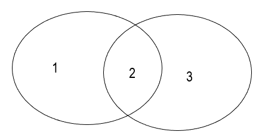
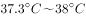
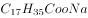
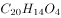

# 2021年山东省公务员录用考试《行测》试题（网友回忆版）

> 常识判断 · 9 题 · 山东 2021

## 第 1 题　qid 2741643 · 地理国情

“十三五”时期，山东省在对外开放、区域协调发展、基础设施建设等方面取得显著成就。下列相关表述错误的是：

- **A**. 构建了“一群两心三圈”的区域发展总体格局
- **B**. “齐鲁号”欧亚班列已将西向运行最远端延伸到波兰　✅
- **C**. 省内高速公路通车里程突破7200公里，重回全国第一方阵
- **D**. 打造“山水圣人”中华文化枢轴，建设尼山世界儒学中心

**答案**：B

**官方解析**

本题考查政治常识。
A项正确，2020年山东省印发的《贯彻落实〈中共中央、国务院关于建立更加有效的区域协调发展新机制的意见〉的实施方案》提出，构建“一群两心三圈”的区域发展格局。“一群”即打造具有全球影响力的山东半岛城市群；“两心”即支持济南、青岛建设成为国家中心城市；“三圈”即推进省会、胶东、鲁南三大经济圈区域一体化发展。
B项错误，2020年11月12日，由山东高速集团统筹运营的“齐鲁号”欧亚班列（济南－荷兰芬洛）首班顺利开行。该班列装载服饰、箱包等货品，由济南南站发出，经二连浩特出境，预计18天后到达荷兰芬洛。本次班列的发运，标志着“齐鲁号”已将西向运行最远端延伸到荷兰，为山东省及周边地区外贸企业开拓荷兰市场搭建起一条便捷、高效的物流大通道。
C项正确，2020年11月26日，京沪高速莱芜至临沂（鲁苏界）段改扩建项目、济南绕城高速二环线东环段、岚山至罗庄高速公路、潍日高速潍坊连接线正式建成通车，创山东省高速公路同日建成通车数量和里程之最。上述项目建成通车后，山东高速公路通车里程达到7204公里，重回全国第一方阵。
D项正确，2019年8月25日，由教育部、山东省人民政府和相关教育研究机构牵头筹建的“尼山世界儒学中心”在孔子诞生地山东曲阜尼山揭牌成立，标志着全球儒学研究实体平台的诞生。2020年6月8日，山东省政府新闻办召开的发布会上，提出要“以文旅合作为切入点，加快济南、泰安、曲阜三地文旅合作，联合各市打造‘山水圣人’中华文化枢轴”。
本题为选非题，故正确答案为B。

---

## 第 2 题　qid 2741646 · 经济常识

下列经济状况与国家的应对措施对应正确的是：

- **A**. 通货膨胀——增发专项基建国债
- **B**. 通货紧缩——增加税收
- **C**. 经济下行——实行赤字财政　✅
- **D**. 经济过热——降低再贴现率

**答案**：C

**官方解析**

本题考查经济常识。
A项错误，国债可以分为建设性国债和减少货币供应量的国债。建设性国债是指政府发行国债所得用于基础建设，增发建设性国债会导致市场上的货币供应量变多。减少货币供应量的国债是指政府发行国债所得不流向市场，增发减少货币供应量的国债会导致市场上的货币量减少。因此，发生通货膨胀时，应该减发建设性国债，即减发专项基建国债。
B项错误，税收增加，市场上的货币量会流向政府，市场中流通的货币总量减少，会加剧通货紧缩。
C项正确，财政赤字是指财政支出超过财政收入。实行赤字财政会导致政府增加支出，市场上的货币供应量增多，有利于拉动经济增长，抵制经济下行。
D项错误，再贴现率是指商业银行到中央银行兑换未到期的票据时，中央银行将利息先行扣除所使用的利率。降低再贴现率会增加市场上的货币供应量，不利于缓解经济过热。
故正确答案为C。

---

## 第 3 题　qid 2741655 · 法律常识

下列行为符合我国法律规定的是（    ）。

- **A**. 甲面包食品有限公司在其生产的面包外包装上使用“哈哈娃”标识
- **B**. 乙酒店向送乘客到酒店就餐的出租车司机发送餐券作为奖励，因金额较小，不在公司账面上详细记录
- **C**. 经丙百货公司同意，某快递公司在丙公司官网上插入其快递服务链接　✅
- **D**. 丁超市举办购物抽奖活动，某副经理小张未购物却获得一等奖

**答案**：C

**官方解析**

本题考查法律常识。
A项错误，根据《反不正当竞争法》第六条规定：“经营者不得实施下列混淆行为，引人误认为是他人商品或者与他人存在特定联系：（一）擅自使用与他人有一定影响的商品名称、包装、装潢等相同或者近似的标识；（二）擅自使用他人有一定影响的企业名称（包括简称、字号等）、社会组织名称（包括简称等）、姓名（包括笔名、艺名、译名等）；（三）擅自使用他人有一定影响的域名主体部分、网站名称、网页等；（四）其他足以引人误认为是他人商品或者与他人存在特定联系的混淆行为。”本案中，甲面包食品有限公司在其生产的面包外包装上使用“哈哈娃”标识，构成擅自使用与他人有一定影响的商品名称近似的标识的违法行为。
B项错误，根据《反不正当竞争法》第七条规定：“经营者不得采用财物或者其他手段贿赂下列单位或者个人，以谋取交易机会或者竞争优势：（一）交易相对方的工作人员；（二）受交易相对方委托办理相关事务的单位或者个人；（三）利用职权或者影响力影响交易的单位或者个人。经营者在交易活动中，可以以明示方式向交易相对方支付折扣，或者向中间人支付佣金。经营者向交易相对方支付折扣、向中间人支付佣金的，应当如实入账。接受折扣、佣金的经营者也应当如实入账······”酒店向出租车司机发送餐券应当如实入账。
C项正确，根据《反不正当竞争法》第十二条规定：“经营者利用网络从事生产经营活动，应当遵守本法的各项规定。经营者不得利用技术手段，通过影响用户选择或者其他方式，实施下列妨碍、破坏其他经营者合法提供的网络产品或者服务正常运行的行为：（一）未经其他经营者同意，在其合法提供的网络产品或者服务中，插入链接、强制进行目标跳转；（二）误导、欺骗、强迫用户修改、关闭、卸载其他经营者合法提供的网络产品或者服务；（三）恶意对其他经营者合法提供的网络产品或者服务实施不兼容；（四）其他妨碍、破坏其他经营者合法提供的网络产品或者服务正常运行的行为。”快递公司在丙公司官网上插入服务链接得到了丙公司的同意，故快递公司与丙公司的约定有效。
D项错误，根据《反不正当竞争法》第十条规定：“经营者进行有奖销售不得存在下列情形：······（二）采用谎称有奖或者故意让内定人员中奖的欺骗方式进行有奖销售······”本案中，丁超市故意让未购物的副经理中奖，构成违法行为。
故正确答案为C。

---

## 第 4 题　qid 2741657 · 人文常识

下列哪一诗句的主题与其他三项不同？

- **A**. 南有乔木，不可休思。汉有游女，不可求思
- **B**. 呦呦鹿鸣，食野之苹。我有嘉宾，鼓瑟吹笙　✅
- **C**. 野有蔓草，零露漙兮。有美一人，清扬婉兮
- **D**. 风雨如晦，鸡鸣不已。既见君子，云胡不喜

**答案**：B

**官方解析**

本题考查人文常识。
A项，“南有乔木，不可休思。汉有游女，不可求思”出自《国风·周南·汉广》，意为南有大树枝叶高，树下行人休憩少。汉江有个漫游女，想要追求只徒劳。这首诗是男子追求女子而不能得的情歌，写的是爱情。
B项，“呦呦鹿鸣，食野之苹。我有嘉宾，鼓瑟吹笙”出自曹操的《短歌行》，意为一群鹿儿呦呦欢鸣，在那原野悠然自得的啃食艾蒿。一旦四方贤才光临舍下，我将奏瑟吹笙宴请宾客。表示了曹操渴求贤才的愿望。
C项，“野有蔓草，零露漙兮。有美一人，清扬婉兮”出自《国风·郑风·野有蔓草》，意为野草蔓蔓连成片，草上露珠亮闪闪。有位美女路上走，眉清目秀美又艳。表现了浪漫而自由的爱情。
D项，“风雨如晦，鸡鸣不已。既见君子，云胡不喜”出自《诗经·郑风·风雨》，意为风吹雨打天地昏，雄鸡啼叫声不停。既然已见到意中人，心中怎能不欢喜。表现了见到意中人喜出望外之情。
综上，B项主题与其他三项不同。
故正确答案为B。

---

## 第 5 题　qid 2741638 · 法律常识

小王和小张系工友，因琐事发生纠纷后互殴，小王将小张打成轻伤，公安机关立案后双方达成和解协议，小张也表示了谅解，下列说法错误的是：

- **A**. 人民检察院可以作出不起诉的决定
- **B**. 公安机关可以向人民检察院提出从宽处理的建议
- **C**. 人民检察院可以向人民法院提出从宽处罚的建议
- **D**. 公安机关可以撤销刑事立案并作出行政处罚的决定　✅

**答案**：D

**官方解析**

本题考查法律常识。
A、B、C三项均正确，根据《刑事诉讼法》第二百九十条规定：“对于达成和解协议的案件，公安机关可以向人民检察院提出从宽处理的建议。人民检察院可以向人民法院提出从宽处罚的建议；对于犯罪情节轻微，不需要判处刑罚的，可以作出不起诉的决定。人民法院可以依法对被告人从宽处罚。”
D项错误，根据《刑事诉讼法》第一百一十二条规定：“人民法院、人民检察院或者公安机关对于报案、控告、举报和自首的材料，应当按照管辖范围，迅速进行审查，认为有犯罪事实需要追究刑事责任的时候，应当立案；认为没有犯罪事实，或者犯罪事实显著轻微，不需要追究刑事责任的时候，不予立案，并且将不立案的原因通知控告人······”。根据我国刑事诉讼法的规定，刑事案件不同于民事案件，需要案件撤销的，应当是人民检察院撤销立案。
本题为选非题，故正确答案为D。

---

## 第 6 题　qid 2741644 · 人文常识

下图中①代表金砖国家，③代表联合国安理会常任理事国，则关于②所代表的国家说法正确的是：

- **A**. 领土接壤　✅
- **B**. 官方语言相同
- **C**. 属于同一大洲
- **D**. 同属四大文明古国

**答案**：A

**官方解析**

本题考查地理国情。
金砖国家包括巴西、俄罗斯、印度、中国、南非。联合国安理会常任理事国包括中国、俄罗斯、英国、法国、美国。因此，既属于金砖国家又属于联合国常任理事国的是中国和俄罗斯。
A项正确，中国陆地边界长达2.28万公里，东邻朝鲜，北邻蒙古，东北邻俄罗斯，西北邻哈萨克斯坦、吉尔吉斯斯坦、塔吉克斯坦，西和西南与阿富汗、巴基斯坦、印度、尼泊尔、不丹等国家接壤，南与缅甸、老挝、越南相连。东部和东南部同韩国、日本、菲律宾、文莱、马来西亚、印度尼西亚隔海相望。因此，中国与俄罗斯领土接壤。
B项错误，中国的官方语言是汉语（通用普通话）；俄罗斯的官方语言为俄语。
C项错误，中国位于亚洲东部，太平洋西岸，陆地面积约960万平方千米，国土面积位于世界第三；俄罗斯位于欧亚大陆北部，地跨欧亚两大洲，是世界上面积最大的国家，俄罗斯被认为是属于欧洲。
D项错误，四大文明古国分别是中国、古巴比伦、古埃及、古印度。因此，俄罗斯不属于四大文明古国。
故正确答案为A。

---

## 第 7 题　qid 2741651 · 人文常识

发热是临床上常见的症状。关于发热，下列说法正确的是：

- **A**. 
体温超过说明病人已经发热

- **B**. 
一定程度的发热可使人体免疫功能增强
　✅
- **C**. 
手术后就发热说明病人发生了伤口感染

- **D**. 
病人发热后没有食欲主要因为唾液淀粉酶失去活性

**答案**：B

**官方解析**

本题考查科技常识。

A项错误，正常情况下，人的体温会保持在，因为人体有自带的体温调节系统。以口腔温度为标准，可将发烧程度分为：低烧，体温为；中等烧，体温为；高烧，体温为；超高烧，体温为以上。但要注意，有时体温升高不一定都是疾病引起的，某些情况可有生理性体温升高，如剧烈运动、月经前期及妊娠期，进入高温环境或热水浴等均可使体温较平时略高，但这些可以通过自身调节很快恢复正常。

B项正确，一定程度的发热时，人体内的免疫细胞和免疫因子的活性提高了，当体温在时，机体免疫活动非常活跃，在某种程度上增强了身体的免疫力。

C项错误，术后一些患者会出现发热症状，但只有一小部分是由于感染引起。非感染性发热如输血引起的发热反应、部分药物引起的发热反应等一般在术后24-48小时内出现，且体温左右。感染性发热往往体温较高（），多在术后第3天以后才开始出现连续发热。

D项错误，人身体内的消化是由酶控制的，酶的活性直接影响人的新陈代谢。人体在发热时，体温升高，消化酶（唾液淀粉酶为消化酶的一种）活性降低，表现为食欲减退。因此，唾液淀粉酶是活性降低，而非失去活性。

故正确答案为B。

---

## 第 8 题　qid 2741652 · 人文常识

宋徽宗酷爱书法和绘画，以下哪幅画他不可能鉴赏过?

- **A**. 《富春山居图》　✅
- **B**. 《步辇图》
- **C**. 《千里江山图》
- **D**. 《簪花仕女图》

**答案**：A

**官方解析**

本题考查人文常识。
宋徽宗即赵佶，号宣和主人，宋朝第八位皇帝（1100年2月23日-1126年1月18日在位），书画家。
A项错误，《富春山居图》是元代画家黄公望于1350年创作的纸本水墨画，是中国十大传世名画之一。因此，宋徽宗不可能鉴赏过《富春山居图》。
B项正确，《步辇图》是唐朝画家阎立本的名作之一，是中国十大传世名画之一。
C项正确，《千里江山图》是北宋王希孟创作的绢本设色画。
D项正确，《簪花仕女图》传为唐代周昉绘制的一幅粗绢本设色画。
本题为选非题，故正确答案为A。

---

## 第 9 题　qid 2741656 · 科技常识

下列鉴别物质的方法错误的是（    ）。

- **A**. 用肥皂水鉴别硬水与软水
- **B**. 用稀硫酸鉴别锌片与铜片
- **C**. 用酚酞试液鉴别纯碱与烧碱　✅
- **D**. 用燃着的木条鉴别氧气与二氧化碳

**答案**：C

**官方解析**

本题考查科技常识。

A项正确，硬水，是指含有较多可溶性钙镁化合物的水。软水指的是不含或含较少可溶性钙镁化合物的水。肥皂的主要成分是硬脂酸钠()，在水中硬脂酸钠被水电离，形成硬脂酸根离子和钠离子。硬脂酸根离子会和镁离子和钙离子结合生成硬脂酸镁和硬脂酸钙，硬脂酸镁和硬脂酸钙都是不溶于水的沉淀。因此，如果是将肥皂投入到硬水中，会出现有沉淀的现象；如果是将肥皂投入到软水中，不会出现有沉淀的现象，水是纯净透明的。

B项正确，锌片可以和稀硫酸反应生成氢气，而铜片不行，因此，把锌片放入稀硫酸中会产生大量的气泡，锌片不断溶解，而铜片不会产生反应。

C项错误，纯碱即碳酸钠，是一种无机化合物，分子式为。烧碱即氢氧化钠，无机化合物，化学式。酚酞是一种有机化合物，分子式为，其特性是在酸性和中性溶液中为无色，在碱性溶液中为紫红色。纯碱和烧碱都可以使酚酞变红，因此不能用酚酞试液鉴别纯碱与烧碱。可以用稀盐酸来进行鉴别，纯碱与盐酸反应生成二氧化碳，会产生气泡，烧碱与盐酸反应则无明显现象。

D项正确，氧气具有助燃性，能使燃着的木条燃烧更旺，二氧化碳不具有助燃性，能使燃着的木条熄灭。

本题为选非题，故正确答案为C。

---
