# 2021年广东省公务员录用考试《行测》题（县级卷）（网友回忆版）

> 常识判断 · 21 题 · 广东 2021

## 第 1 题　qid 3018770 · 人文常识

党的新闻舆论工作必须“坚持正确舆论导向，坚持正面宣传为主，唱响主旋律，弘扬正能量，做大做强主流思想舆论”。下列选项最能体现这一理念的是：

- **A**. 独阴不成，独阳不生
- **B**. 事必有法，然后可成
- **C**. 事不凝滞，理贵变通
- **D**. 先立乎其大者，则其小者不能夺也　✅

**答案**：D

**官方解析**

本题考查人文常识。
A项错误，“独阴不成，独阳不生”出自《春秋谷梁传·庄公三年》，意思是单独有阴，不能生发，单独有阳，不能生发。泛指单凭一方面的因素或条件促成不了事物的生长或出现。
B项错误，“事必有法，然后可成”出自《孟子集注》，意思是做任何事情都要有相应的方法，找到方法之后才能把事情做成。
C项错误，“事不凝滞，理贵变通”出自《宋史·赵普列传》，意思是做事灵活不拘泥，善于根据事物的发展变化采取相应的变通方式。
D项正确，“先立乎其大者，则其小者不能夺也”出自《孟子·告子上》，意思是首先把重要的部分树立起来，其它次要的部分就不会被引入迷途。与题干中坚持正确舆论导向，坚持正面宣传为主，唱响主旋律，弘扬正能量，做大做强主流思想舆论的理念相一致。
故正确答案为D。

---

## 第 2 题　qid 3018777 · 人文常识

嘉兴南湖革命纪念馆的题诗“革命声传画舫中，诞生共党庆工农”纪念的历史事件是：

- **A**. 中共一大的召开　✅
- **B**. 第一次国共合作
- **C**. 中共工农红军的组建
- **D**. 第一次全国劳动大会的召开

**答案**：A

**官方解析**

本题考查毛中特。
A项正确，1964年4月5日，董必武同志来到浙江嘉兴南湖，为了纪念中共一大的召开、中国共产党的诞生，题诗：“革命声传画舫中，诞生共党庆工农。重来正值清明节，烟雨迷蒙访旧踪”。
B项错误，中国共产党和中国国民党两党的第一次合作是从1924年1月起至1927年7月止，历时三年半。1924年1月，中国国民党第一次全国代表大会在广州召开，标志着国民党改组的完成和第一次国共合作的正式建立。
C项错误，1928年5月25日，中国共产党中央委员会决定，全国各地工农革命军正式定名为红军。1930年后，又逐渐改称中国工农红军。在国共内战时期，中国工农红军不断发展壮大，先后组成了第一方面军（曾经称中央红军）、第四方面军、第二方面军和西北红军等红军部队。
D项错误，1922年5月1日至6日，根据党的决定，由中国劳动组合书记部发起的第一次全国劳动大会在广州召开，这是中国工人阶级第一次全国性的盛会。
故正确答案为A。

---

## 第 3 题　qid 3018782 · 人文常识

以下机构按照成立时间的先后顺序排列，正确的是：
①国家乡村振兴局
②中华人民共和国教育部
③中华人民共和国文化和旅游部
④中央人民政府驻香港特别行政区维护国家安全公署

- **A**. ①②④③
- **B**. ②③④①　✅
- **C**. ③②①④
- **D**. ③④②①

**答案**：B

**官方解析**

本题考查政治常识。
①，2021年2月16日出版的《求是》杂志2021年第4期发表“中共国家乡村振兴局党组”的署名文章《人类减贫史上的伟大奇迹》，表明“国家乡村振兴局”已经成立。2021年2月25日，国家乡村振兴局牌子正式挂出。
②，中华人民共和国教育部成立于1949年10月，新中国成立后，成立文化教育委员会、教育部，设立普通教育、专门教育和社会教育三司。
③，中华人民共和国文化和旅游部成立于2018年3月，是根据党的十九届三中全会审议通过的《中共中央关于深化党和国家机构改革的决定》《深化党和国家机构改革方案》和第十三届全国人民代表大会第一次会议批准的《国务院机构改革方案》设立。
④，中央人民政府驻香港特别行政区维护国家安全公署，全称中华人民共和国中央人民政府驻香港特别行政区维护国家安全公署，是中央人民政府驻香港特别行政区维护国家安全机构，依法履行维护国家安全职责，行使相关权力。2020年7月8日上午，中央人民政府驻香港特别行政区维护国家安全公署在香港揭牌。
因此按照成立时间的先后顺序排序正确的是②③④①。
故正确答案为B。

---

## 第 4 题　qid 3018790 · 人文常识

青少年是祖国的未来，民族的希望。青少年教育最重要的是教给他们正确的思想。引导他们走正路。其中，（    ）是落实立德树人根本任务的关键课程。

- **A**. 思政课　✅
- **B**. 劳动课
- **C**. 通识课
- **D**. 美育课

**答案**：A

**官方解析**

本题考查政治常识。
2020年9月1日出版的第17期《求是》杂志发表中共中央总书记、国家主席、中央军委主席习近平的重要文章《思政课是落实立德树人根本任务的关键课程》。文章强调，青少年是祖国的未来、民族的希望。青少年教育最重要的是教给他们正确的思想，引导他们走正路。思政课是落实立德树人根本任务的关键课程，思政课作用不可替代，思政课教师队伍责任重大。办好思政课，最根本的是要全面贯彻党的教育方针，解决好培养什么人、怎样培养人、为谁培养人这个根本问题。
故正确答案为A。

---

## 第 5 题　qid 3018800 · 地理国情

2020年是“十三五”收官之年，广东经济社会发展取得重大成果。下列有关说法正确的是：
①第一届全国职业技能大赛在广东举行
②全省地区生产总值超过11万亿元，连续32年位居全国第一
③区域创新综合能力跃居全国第一，有效发明专利量保持全国首位

- **A**. ②
- **B**. ①②
- **C**. ①③
- **D**. ①②③　✅

**答案**：D

**官方解析**

本题考查政治常识。

①项正确，中华人民共和国第一届职业技能大赛在广州开幕。首届大赛以“新时代 新技能 新梦想”为主题，设86个比赛项目，共有2500多名选手、2300多名裁判人员参赛，是新中国成立以来规格最高、项目最多、规模最大、水平最高的综合性国家职业技能赛事。

②项正确，广东省省长马兴瑞在2021年1月24日广东省十三届人大四次会议上作政府工作报告并提出，广东全省地区生产总值2015年为7.5万亿元，2020年超过11万亿元，年均增长，总量连续32年位居全国第一。其中，2020年广东全省地区生产总值增长。目标2021年全省地区生产总值增长以上。

③项正确，广东省省长马兴瑞在2021年1月24日广东省十三届人大四次会议上作政府工作报告并提出，全省研发经费支出从1800亿元增加到3200亿元，占地区生产总值比重从提高到，区域创新综合能力跃居全国第一，有效发明专利量、PCT国际专利申请量保持全国首位。

综上，说法正确的是①②③。

故正确答案为D。

---

## 第 6 题　qid 3018766 · 人文常识

2021年2月25日召开的全国脱贫攻坚总结表彰大会宣告，我国脱贫攻坚战取得了全面胜利。关于脱贫攻坚，以下表述准确的有（    ）。
①完成了消除相对贫困的艰巨任务
②2018年底拉开了新时代脱贫攻坚的序幕
③我国提前10年实现《联合国2030年可持续发展议程》减贫目标
④精准扶贫是打赢脱贫攻坚战的制胜法宝
⑤开发式扶贫方针是中国特色减贫道路的鲜明特征

- **A**. ①③⑤
- **B**. ③④⑤　✅
- **C**. ①②④⑤
- **D**. ②③④⑤

**答案**：B

**官方解析**

本题考查政治常识。
①错误，完成了消除绝对贫困的艰巨任务。
②错误，2012年年底，党的十八大召开后不久，党中央就突出强调，“小康不小康，关键看老乡，关键在贫困的老乡能不能脱贫”，承诺“决不能落下一个贫困地区、一个贫困群众”，拉开了新时代脱贫攻坚的序幕。
③正确，在全球贫困状况依然严峻、一些国家贫富分化加剧的背景下，我国提前10年实现《联合国2030年可持续发展议程》减贫目标，赢得国际社会广泛赞誉。
④⑤正确，事实充分证明，精准扶贫是打赢脱贫攻坚战的制胜法宝，开发式扶贫方针是中国特色减贫道路的鲜明特征。
故正确答案为B。

---

## 第 7 题　qid 3018775 · 人文常识

2020年是中国人民志愿军抗美援朝出国作战70周年。以下战役发生在抗美援朝战争期间的是：

- **A**. 辽沈战役
- **B**. 百团大战
- **C**. 上甘岭战役　✅
- **D**. 仁川登陆战

**答案**：C

**官方解析**

本题考查毛中特。
抗美援朝战争开始于1950年10月，结束于1953年7月，交战双方是以美军为首的“联合国军”和中国人民志愿军。
A项错误，辽沈战役是中国近代史解放战争中的“三大战役”之一，发生于1948年9月至11月，此次战役一举摧毁了国民党在关外的全部主力部队，解放了东北全境。
B项错误，1940年下半年，彭德怀指挥八路军105个团在华北发动了一次大规模的对日作战，史称“百团大战”。百团大战是抗日战争进入相持阶段后，八路军在华北地区发动的一次规模最大、持续时间最长的战役。
C项正确，上甘岭战役是1952年10月14日至11月25日中国人民志愿军与“联合国军”在上甘岭及其附近地区展开的一场战役。该战役历时40多天，双方伤亡惨重，是抗美援朝战争中最惨烈的一次战役，最终中国人民志愿军取得胜利。
D项错误，仁川登陆战是朝鲜战争初期，以美国为首的“联合国军”在仁川发动的一次登陆作战。战役开始于1950年9月15日，至9月28日结束。仁川战役令朝鲜人民军腹背受敌，被迫后撤，“联合国军”和韩国军队开始反攻。随后，由于朝鲜人民无力抵抗，中国政府决定派出中国人民志愿军，支援朝鲜。
故正确答案为C。

---

## 第 8 题　qid 3018781 · 人文常识

《中共中央关于制定国民经济和社会发展第十四个五年规划和二〇三五年远景目标的建议》提出，增强消费对经济发展的基础性作用，顺应消费升级趋势，提升传统消费，培育新型消费，适当增加公共消费。下列措施中，有助于增强消费对经济发展的基础性作用的有：
①提高服务消费领域市场准入门槛，减少产品供给
②推动汽车等消费品由购买管理向使用管理转变
③完善节假日制度，落实带薪休假制度
④改善消费环境，强化消费者权益保护

- **A**. ①③
- **B**. ①④
- **C**. ②④
- **D**. ②③④　✅

**答案**：D

**官方解析**

本题考查政治常识。
①错误，②③④正确。《中共中央关于制定国民经济和社会发展第十四个五年规划和二〇三五年远景目标的建议》提出：“全面促进消费。增强消费对经济发展的基础性作用，顺应消费升级趋势，提升传统消费，培育新型消费，适当增加公共消费。以质量品牌为重点，促进消费向绿色、健康、安全发展，鼓励消费新模式新业态发展。推动汽车等消费品由购买管理向使用管理转变，促进住房消费健康发展。健全现代流通体系，发展无接触交易服务，降低企业流通成本，促进线上线下消费融合发展，开拓城乡消费市场。发展服务消费，放宽服务消费领域市场准入。完善节假日制度，落实带薪休假制度，扩大节假日消费。培育国际消费中心城市。改善消费环境，强化消费者权益保护。”
故正确答案为D。

---

## 第 9 题　qid 3018787 · 法律常识

中华人民共和国全国人民代表大会是最高国家权力机关。全国人民代表大会行使的职权不包括：

- **A**. 选举国家监察委员会主任以及最高人民法院院长
- **B**. 撤销全国人民代表大会常务委员会不适当的决定
- **C**. 编制和执行国民经济和社会发展计划和国家预算　✅
- **D**. 制定和修改刑事、民事、国家机构的和其他的基本法律

**答案**：C

**官方解析**

本题考查法律常识。
A项正确，根据《宪法》第六十二条第七、八项：“全国人民代表大会行使下列职权：······（七）选举国家监察委员会主任；（八）选举最高人民法院院长；······”
B项正确，根据《宪法》第六十二条第十二项：“全国人民代表大会行使下列职权：······（十二）改变或者撤销全国人民代表大会常务委员会不适当的决定；······”
C项错误，根据《宪法》第六十二条第十、十一项：“全国人民代表大会行使下列职权：······（十）审查和批准国民经济和社会发展计划和计划执行情况的报告；（十一）审查和批准国家的预算和预算执行情况的报告；······”第八十九条第五项：“国务院行使下列职权：······（五）编制和执行国民经济和社会发展计划和国家预算；······”
D项正确，根据《宪法》第六十二条第三项：“全国人民代表大会行使下列职权：······（三）制定和修改刑事、民事、国家机构的和其他的基本法律；······”
本题为选非题，故正确答案为C。

---

## 第 10 题　qid 3018793 · 法律常识

民法典与人们生活息息相关，被誉为“社会生活的百科全书”。以下内容中，民法典未涉及的是：

- **A**. 监管保险业务　✅
- **B**. 禁止高空抛物
- **C**. 见义勇为补偿
- **D**. 保护个人信息

**答案**：A

**官方解析**

本题考查法律常识。
A项，根据《保险法》第一百三十三条：“保险监督管理机构依照本法和国务院规定的职责，遵循依法、公开、公正的原则，对保险业实施监督管理，维护保险市场秩序，保护投保人、被保险人和受益人的合法权益。”故民法典未涉及监管保险业务。
B项，根据《民法典》第一千二百五十四条第一款：“禁止从建筑物中抛掷物品。从建筑物中抛掷物品或者从建筑物上坠落的物品造成他人损害的，由侵权人依法承担侵权责任；经调查难以确定具体侵权人的，除能够证明自己不是侵权人的外，由可能加害的建筑物使用人给予补偿。可能加害的建筑物使用人补偿后，有权向侵权人追偿。”故民法典涉及禁止高空抛物。
C项，根据《民法典》第一百八十三条：“因保护他人民事权益使自己受到损害的，由侵权人承担民事责任，受益人可以给予适当补偿。没有侵权人、侵权人逃逸或者无力承担民事责任，受害人请求补偿的，受益人应当给予适当补偿。”故民法典涉及见义勇为补偿。
D项，根据《民法典》第一百一十一条：“自然人的个人信息受法律保护。任何组织或者个人需要获取他人个人信息的，应当依法取得并确保信息安全，不得非法收集、使用、加工、传输他人个人信息，不得非法买卖、提供或者公开他人个人信息。”故民法典涉及保护个人信息。
本题为选非题，故正确答案为A。

---

## 第 11 题　qid 3018795 · 科技常识

下列关于生活常识的说法，正确的是：

- **A**. 发现煤气中毒病人后，施救者应立即进行人工呼吸
- **B**. 商场中绿色的消防安全标志用于指示安全和疏散通道　✅
- **C**. 暴雨黄色预警信号生效时，所在区域的中小学校应当自动停课
- **D**. 隔夜茶指放置时间超过6小时的茶，其致癌物的含量会显著增加

**答案**：B

**官方解析**

本题考查科技常识。
A项错误，发现煤气中毒病人后，应立即打开门窗，通风换气，关闭煤气气阀，并及时将病人转移至室外或空气新鲜的地方，然后再实施抢救措施。
B项正确，消防安全标志是由安全色、边框、图象为主要特征的图形符号或文字构成的标志，用以表达与消防有关的安全信息。共分为三种颜色，红色：表示禁止。黄色：表示火灾爆炸危险。绿色：表示安全和疏散途径。
C项错误，暴雨预警信号是气象部门通过气象监测在暴雨到来之前做出的预警信号，暴雨预警信号分四级，分别以蓝色、黄色、橙色、红色表示。其中暴雨黄色预警信号是第二级别，所在区域的中小学校注意天气变化，做好防御措施即可。
D项错误，隔夜茶一般是指茶叶浸泡12小时以上，或者是搁置了一晚上的茶。隔夜茶被误认为会致癌的主要原因是有可能产生致癌物质亚硝胺。但茶叶本身富含维生素C和茶多酚，反而成为了合成亚硝胺的天然抑制剂，因此隔夜茶致癌物质的含量并不会显著增加。
故正确答案为B。

---

## 第 12 题　qid 3018759 · 科技常识

如图所示，物体A在F的作用下静止在物体B的斜面上，物体B始终静止在水平面上，如果物体B的斜面完全光滑，则下列说法正确的是（    ）。

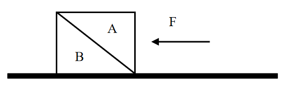

- **A**. 物体B总共受到3个力的作用
- **B**. 物体B受到的摩擦力的大小等于F　✅
- **C**. 物体A对物体B的作用力大小为F
- **D**. 物体A与物体B的相互作用力大小不等

**答案**：B

**官方解析**

由题目可知，物体A、B都处于静止状态，即两物体都受力平衡，受到的合外力均为0，且物体B的斜面完全光滑，即物体A、B的接触面完全光滑，所以物体A、B之间不存在摩擦力。

该题可以先通过整体法将物体A、B看作一个整体对其进行受力分析来判断地面对于这个整体是否有摩擦力：这个整体受到自身竖直向下的重力，水平向左的已知力F，水平面对其向上的支持力，且支持力的大小等于重力的大小，所以竖直方向受力平衡。水平方向也需要受力平衡，所以需要有一个水平向右的力来跟F平衡，那么只能是水平面对其产生的摩擦力f，方向水平向右，大小等于F。而这个整体与水平面的接触面就是物体B与水平面的接触面，所以这个摩擦力即为水平面对物体B的摩擦力。受力分析图示如下：

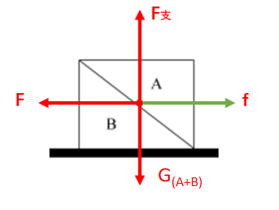

再对物体A使用隔离法进行受力分析：物体A受到自身竖直向下的重力，水平向左的已知力，以及斜面对其产生的垂直于B的斜面向上的弹力（弹力方向垂直于接触面），而物体A也是受力平衡，合外力为0，因此这个斜向右上的弹力在竖直方向上的分力的大小等于物体A受到的重力的大小，在水平方向上的分力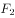的大小等于已知力F的大小，因此弹力的大小要大于已知力F的大小。而物体B对物体A有弹力，根据作用力与反作用力可知，物体A对物体B也有弹力，且两者大小相等，方向相反。受力分析图示如下：

A项，物体B除受到自身的重力，水平面对其向上的支持力， 根据以上分析可知还会受到物体A对它的弹力，以及水平面对它的摩擦力，因此物体B受到4个力，而不是3个力的作用，错误；

B项，根据整体法分析可知，物体B受到的水平面对它的摩擦力方向水平向右，大小等于已知力F的大小，正确；

C项，根据对物体A隔离进行受力分析可得，物体A、B间的弹力在水平方向上的分力的大小等于已知力F的大小，因此弹力的大小要大于已知力F的大小，错误；

D项，直接由相互作用力（即作用力与反作用力）的定义可得，相互作用力是一对大小相等，方向相反，同一直线，作用在两个物体上的力，因此物体A、B之间的相互作用力大小肯定是相等，错误。

故正确答案为B。

---

## 第 13 题　qid 3018776 · 科技常识

下面3个图分别表示两种生物种群随时间（t）推移而发生的数量（n）变化情况，则甲、乙、丙三图表示的关系最有可能依次是（    ）。

- **A**. 共生、捕食、竞争　✅
- **B**. 竞争、捕食、共生
- **C**. 捕食、竞争、共生
- **D**. 竞争、共生、捕食

**答案**：A

**官方解析**

甲图，两种生物种群的数量变化是同步的，同时增多，同时减少，说明两种群是共同生活，彼此有利，为互利共生的关系；
乙图，两种生物种群的数量随时间的变化是当一方减少，另一方稍后也会开始减少，一方增多，另一方稍后也会增多，呈现“跟随”现象，因此两者间应该为捕食关系；
丙图，两种生物种群的数量变化是一方数量不断增多，另一方数量基本上是不断减小，为此消彼长，因此两者应该为竞争关系。
故正确答案为A。

---

## 第 14 题　qid 3018785 · 科技常识

下列现象与科学原理搭配正确的是（    ）。
①白醋能除去水垢——水垢在白醋中溶解度较高
②用稀硫酸除铜锈——铜锈与稀硫酸发生氧化还原反应
③含氟牙膏能预防龋齿——氟化物作用于牙齿表面增强耐酸蚀能力

- **A**. ②
- **B**. ①②
- **C**. ①③　✅
- **D**. ②③

**答案**：C

**官方解析**

①白醋除水垢的原理是白醋中的醋酸与水垢主要成分碳酸钙、氢氧化镁等发生反应，使其转化为可溶性盐，从而除去水垢，反应方程式分别为：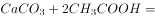，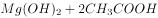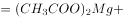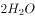，这个过程是化学反应，与溶解度无关，错误；

②铜锈的主要成分是碱式碳酸铜，与稀硫酸发生反应的方程式为：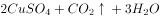，反应前后无化合价变化，不是氧化还原反应，错误；

③含氟牙膏能提供氟离子，与牙齿中的、结合，生成难溶于水和弱酸的氟磷酸钙，增强牙齿抗酸腐蚀的能力，从而达到预防龋齿，保护牙齿的作用，正确。

备注：根据以上分析可知，严格来说只有③正确，但是并无对应选项。不过在化工领域中，当固体在酸中发生反应时，也常常表述为“将该固体溶于酸”，以此为依据，①勉强可以接受，故粉笔倾向于正确答案选C。

故正确答案为C。

---

## 第 15 题　qid 3018804 · 科技常识

如图所示，高尔夫球在力的作用下从水平地面的M点飞到N点。忽略高尔夫球在飞行过程中的空气阻力，下列选项能正确表示高尔夫球从M点到达N点前的动能关系的是（    ）。

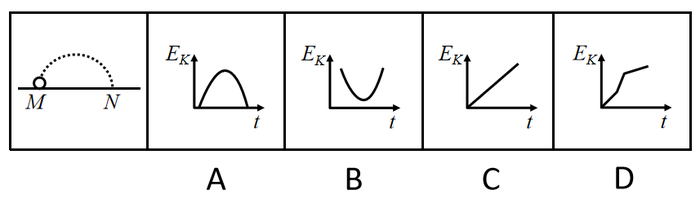

- **A**. A
- **B**. B　✅
- **C**. C
- **D**. D

**答案**：B

**官方解析**

从题目所给的运动轨迹可知，高尔夫球做斜抛运动，忽略空气阻力的情况下，整个过程只有重力做功，即重力势能和动能相互转化，因此系统机械能守恒。因此可知，从M点到轨迹最高点的过程中，随着球的高度升高，重力势能增大，相应的动能减小；而从最高点到N的过程中，球的高度降低，重力势能减小，相应的动能增大。观察四个选项图形特征可见，只有B项满足动能先减小后增大的趋势，因此B项正确。
故正确答案为B。

---

## 第 16 题　qid 3018811 · 科技常识

如图所示，利用电子坐位体前屈测试仪进行身体柔韧性测试时，测试者向前推动滑动变阻器滑片上的滑块。滑块被向右推动的距离越大，仪表的示数就越大，下列选项中，若将电流表（A）或电压表（V）作为测试仪的仪表，则下列电路不可能满足要求的是（    ）。

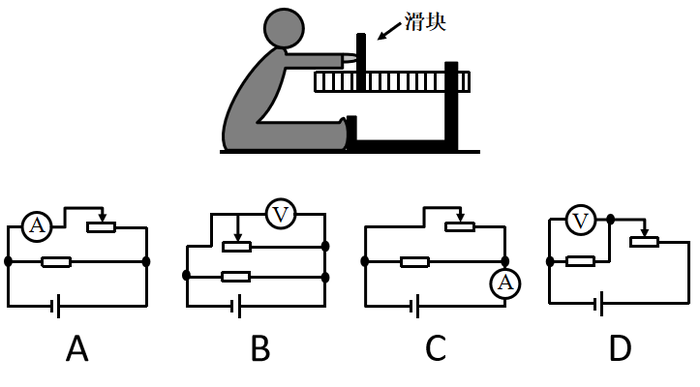

- **A**. A
- **B**. B　✅
- **C**. C
- **D**. D

**答案**：B

**官方解析**

根据题意，滑块被向右推动的距离越大，滑动变阻器的阻值越小。
A项，电路图中滑动变阻器直接连在电源两端，故电压不变；电流表测试的是滑动变阻器所在支路的电流，当滑动变阻器的阻值变小时，电流变大，电流表的示数变大，正确；
B项，电路图中滑动变阻器直接连在电源两端，电压一直等于电源电压，无论阻值如何变化，电压表的示数不变，错误；
C项，电路图中滑动变阻器直接连在电源两端，电流表测试的是电路的总电流，当滑动变阻器的阻值变小时，总电阻变小，总电流变大，则电流表的示数变大，正确；
D项，电路图中滑动变阻器与定值电阻串联，电压表测试的是定值电阻的电压，当滑动变阻器的阻值变小时，滑动变阻器的分压变小，定值电阻的分压变大，故电压表的示数变大，正确。
本题为选非题，故正确答案为B。

---

## 第 17 题　qid 3018849 · 科技常识

X染色体显性遗传病是由于位于X染色体上的显性致病基因引起的疾病，则以下遗传图谱中，最有可能显示X染色体显性遗传病的是（    ）。

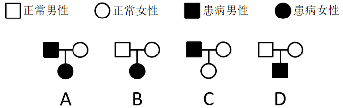

- **A**. A　✅
- **B**. B
- **C**. C
- **D**. D

**答案**：A

**官方解析**

根据题意，该病为伴X显性遗传病，用D、d来表示显性和隐性基因。

A、C两项，两图中父亲为患病男性，即其X染色体上为显性基因，故其染色体为；母亲为正常女性，染色体上均为隐性基因，故其染色体为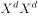；他们的女儿染色体一定为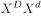，即一定是患病女性，故A项正确，C项错误；

B、D两项，两图中父亲和母亲均不患病，但生出来的孩子患病，故染色体上致病基因均为隐性基因，故B、D两项均错误。

故正确答案为A。

---

## 第 18 题　qid 3018854 · 科技常识

在赛车比赛中，赛车在水平直道转入弯道时，常常在弯道上冲出跑道。下列分析正确的是（    ）。

- **A**. 赛车的速度越快，赛车的惯性越大
- **B**. 赛车的速度越快，转弯所需的向心力越大　✅
- **C**. 赛车的转角越大，发动机对抗的离心力越大
- **D**. 赛车的转角越大，轮胎与地面之间的摩擦系数越小

**答案**：B

**官方解析**

A项，惯性是物体的固有属性，只与物体的质量有关，和速度无关，速度变大，惯性也是不变的，错误；

B项，根据向心力的公式可知，当赛车进入弯道时，速度越快，则赛车所需的向心力也就越大，正确；

C项，根据向心力的公式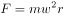可知，转角变大，相同时间内角速度变大，向心力变大，摩擦力对抗的离心力变大，发动机对离心力没有影响，错误；

D项，轮胎与地面之间的摩擦系数主要是与接触面的粗糙程度有关，与赛车的转角无关，错误。

故正确答案为B。

---

## 第 19 题　qid 3018857 · 科技常识

常见的泡沫灭火器内有两个容器，外壳内装碳酸氢钠与泡沫灭火剂的混合溶液。另有一玻璃瓶内胆，装有硫酸铝水溶液。如图所示，正常情况（图Ⅰ）下。两种溶液互不接触。当需要使用泡沫灭火器时把灭火器倒立（图Ⅱ），两种溶液发生化学反应，打开灭火器开关时，泡沫从灭火器中喷出，覆盖在燃烧物品上。则下列说法正确的是（    ）。

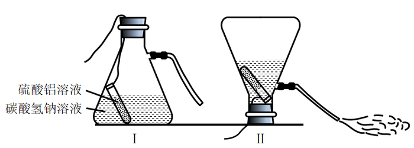 

- **A**. 泡沫灭火器灭火时喷出的物质会对周围环境造成污染
- **B**. 泡沫灭火器在灭火时使燃烧物与空气隔绝，达到灭火的目的　✅
- **C**. 泡沫灭火器适宜用于扑救汽油、柴油、带电设备等引起的火灾
- **D**. 泡沫灭火器使用完静置一段时间后，内装物质将全部变为液体

**答案**：B

**官方解析**

A项，泡沫灭火器灭火时喷出的物质主要成分是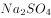、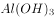和，这三种物质对周围环境都不会造成污染，错误；

B项，泡沫灭火器灭火时能喷射出大量二氧化碳及泡沫，它们能粘附在可燃物上，使可燃物与空气隔绝，达到灭火的目的，正确；

C项，泡沫灭火器主要适用于扑救一般B类火灾，如油制品、油脂等火灾，也可适用于A类火灾，如木材、棉、毛、麻、纸张等燃烧的火灾，但不能扑救带电设备，错误；

D项，泡沫灭火器使用后内装物质已经发生反应，生成的几乎不溶于水，所以静置一段时间后会有沉淀，错误。

故正确答案为B。

---

## 第 20 题　qid 3018859 · 科技常识

根据板块构造论，地球分为亚欧板块、美洲板块、非洲板块、印度洋板块、太平洋板块和南极洲板块，除太平洋板块几乎全为海洋外，其余板块既包括大陆又包括海洋。以下关于板块交界处位置关系对应正确的是（    ）。

- **A**. 亚欧板块和美洲板块一一冰岛　✅
- **B**. 非洲板块和印度洋板块一一蒙古
- **C**. 亚欧板块和太平洋板块一一英国北部
- **D**. 美洲板块和太平洋板块一一美国东海岸

**答案**：A

**官方解析**

A项，亚欧板块和美洲板块的交界处位于冰岛，冰岛位于北大西洋中部，大西洋中脊上，是板块生长边界，正确；
B项，非洲板块和印度洋板块的交界处位于红海，错误；
C项，亚欧板块和太平洋板块的交界处位于中国和日本，错误；
D项，美洲板块和太平洋板块的交界处位于美国西部，错误。
故正确答案为A。

---

## 第 21 题　qid 3018862 · 科技常识

下图是一辆汽车行驶在道路上速度（V）随时间（T）变化的关系图，则下列说法正确的是（    ）。

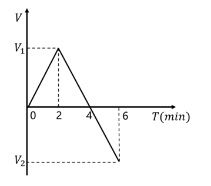

- **A**. 汽车在第6分钟的时候回到原出发点
- **B**. 汽车在第2分钟的时候距离出发点最远
- **C**. 汽车在第2分钟的速度与第6分钟的速度大小相等　✅
- **D**. 汽车在0-2分钟时的加速度与2-4分钟时的加速度相同

**答案**：C

**官方解析**

A项，速度-时间图像的面积表示的是汽车的位移，由图像可知在0时刻，汽车的位移为0，在第6分钟时，图像与坐标轴围成的面积不为0，错误；
B项，速度-时间图像的面积表示的是汽车的位移，在第4分钟时，图像与坐标轴围成的面积是最大值，故第4分钟时离出发点最远，错误；
C项，由图像可知，在2-6分钟时，运动图像是倾斜的直线，物体的斜率恒定，2-4分钟汽车的速度变化和4-6分钟汽车的速度变化相同，故第2分钟汽车的速度大小等于第6分钟汽车速度的大小，正确；
D项，速度-时间图像的斜率表示加速度，加速度是矢量，有大小和方向，0-2分钟时的加速度是正值，2-4分钟时汽车的加速度是负值，加速度的正负表示的是方向，故汽车在0-2分钟时的加速度与2-4分钟时的加速度不同，错误。
故正确答案为C。

---
