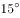
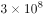

# 2021年湖北省公务员录用考试《行测》题（网友回忆版）

> 常识判断 · 18 题 · 湖北 2021

## 第 1 题　qid 3522336 · 人文常识

“十四五”时期是我国全面建成小康社会、实现第一个百年奋斗目标之后，乘势而上开启全面建设社会主义现代化国家新征程、向第二个百年奋斗目标进军的第一个五年。下列有关说法正确的是：

- **A**. 提出到本世纪中叶基本实现社会主义现代化远景目标，人均国内生产总值达到中等发达国家水平，中等收入群体显著扩大
- **B**. 坚持把发展经济着力点放在实体经济上，坚定不移建设制造强国、质量强国、网络强国、数字中国　✅
- **C**. 坚持又快又好工作总基调，以推动高质量发展为主题，以深化供给侧结构性改革为主线
- **D**. “十四五”规划是在党的十九届四中全会上审议通过的，将于2021年开始实施

**答案**：B

**官方解析**

本题考查政治常识。2020年10月29日，中国共产党第十九届中央委员会第五次全体会议通过了《中共中央关于制定国民经济和社会发展第十四个五年规划和二〇三五年远景目标的建议》（以下简称《建议》）。
A项错误：《建议》指出：“到二〇三五年基本实现社会主义现代化远景目标。党的十九大对实现第二个百年奋斗目标作出分两个阶段推进的战略安排，即到二〇三五年基本实现社会主义现代化，到本世纪中叶把我国建成富强民主文明和谐美丽的社会主义现代化强国。展望二〇三五年，······人均国内生产总值达到中等发达国家水平，中等收入群体显著扩大，基本公共服务实现均等化，城乡区域发展差距和居民生活水平差距显著缩小；平安中国建设达到更高水平，基本实现国防和军队现代化；人民生活更加美好，人的全面发展、全体人民共同富裕取得更为明显的实质性进展。”
B项正确：《建议》指出：“坚持把发展经济着力点放在实体经济上，坚定不移建设制造强国、质量强国、网络强国、数字中国，推进产业基础高级化、产业链现代化，提高经济质量效益和核心竞争力。”
C项错误：《建议》指出：“坚持稳中求进工作总基调，以推动高质量发展为主题，以深化供给侧结构性改革为主线，以改革创新为根本动力，以满足人民日益增长的美好生活需要为根本目的，统筹发展和安全，加快建设现代化经济体系，加快构建以国内大循环为主体、国内国际双循环相互促进的新发展格局，推进国家治理体系和治理能力现代化，实现经济行稳致远、社会安定和谐，为全面建设社会主义现代化国家开好局、起好步。”
D项错误，2021年3月11日，十三届全国人大四次会议表决通过了《中华人民共和国国民经济和社会发展第十四个五年规划和2035年远景目标纲要》（简称“十四五”规划）。“十四五”规划将于2021年开始实施。
故正确答案为B。

---

## 第 2 题　qid 3522744 · 人文常识

下列国家勋章和国家荣誉称号与人名对应关系不正确的是：

- **A**. 共和国勋章：申纪兰、屠呦呦、钟南山
- **B**. 人民科学家：吴文俊、南仁东、程开甲
- **C**. 人民英雄：张伯礼、张定宇、陈薇
- **D**. 人民楷模：王文教、王继才、张桂梅　✅

**答案**：D

**官方解析**

本题考查政治常识。
A项正确，2019年9月，为了庆祝中华人民共和国成立70周年，隆重表彰为新中国建设和发展作出杰出贡献的功勋模范人物，弘扬民族精神和时代精神，第十三届全国人民代表大会常务委员会第十三次会议决定，授予于敏、申纪兰、孙家栋、李延年、张富清、袁隆平、黄旭华、屠呦呦“共和国勋章”。2020年8月，第十三届全国人大常委会第二十一次会议表决通过关于授予在抗击新冠肺炎疫情斗争中作出杰出贡献的人士国家勋章和国家荣誉称号的决定，授予钟南山“共和国勋章”。
B项正确，2019年9月，为了庆祝中华人民共和国成立70周年，隆重表彰为新中国建设和发展作出杰出贡献的功勋模范人物，弘扬民族精神和时代精神，第十三届全国人民代表大会常务委员会第十三次会议决定，授予叶培建、吴文俊、南仁东、顾方舟、程开甲“人民科学家”国家荣誉称号。
C项正确，2020年8月，第十三届全国人大常委会第二十一次会议表决通过关于授予在抗击新冠肺炎疫情斗争中作出杰出贡献的人士国家勋章和国家荣誉称号的决定，授予张伯礼、张定宇、陈薇“人民英雄”国家荣誉称号。
D项错误，2019年9月，为了庆祝中华人民共和国成立70周年，隆重表彰为新中国建设和发展作出杰出贡献的功勋模范人物，弘扬民族精神和时代精神，第十三届全国人民代表大会常务委员会第十三次会议决定，授予王文教、王有德（回族）、王启民、王继才、布茹玛汗·毛勒朵（女，柯尔克孜族）、朱彦夫、李保国、都贵玛（女，蒙古族）、高德荣（独龙族）“人民楷模”国家荣誉称号。2020年12月，在如期完成新时代脱贫攻坚目标任务、决战脱贫攻坚取得重大胜利之际，中宣部向全社会宣传发布张桂梅同志的先进事迹，授予她“时代楷模”称号。
本题为选非题，故正确答案为D。

---

## 第 3 题　qid 3522345 · 科技常识

下列有关我国2020年科技成就的说法正确的是：

- **A**. 2020年12月，嫦娥五号返回器成功着陆，这是我国首次完成月球采样返回任务　✅
- **B**. 我国研制的“奋斗者”号载人潜水器于2020年11月坐底菲律宾海沟，创造了我国载人深潜新纪录
- **C**. 中国环流器二号M装置于2020年底建成并实现首次放电，为我国核裂变堆的设计建造打下了坚实基础
- **D**. 2020年7月，北斗三号全球卫星导航系统全面建成并开通服务，我国成为第四个独立拥有全球卫星导航系统的国家

**答案**：A

**官方解析**

本题考查科技常识。
A项正确，2020年12月17日，探月工程嫦娥五号返回器在内蒙古四子王旗预定区域成功着陆，标志着我国首次月球采样返回任务圆满完成。
B项错误，2020年11月10日8时12分，中国“奋斗者”号载人潜水器在马里亚纳海沟成功坐底，坐底深度10909米，创造了中国载人深潜的新纪录。
C项错误，2020年12月4日14时，新一代“人造太阳”装置——中国环流器二号M装置（HL-2M）在成都建成并实现首次放电，标志着中国自主掌握了大型先进托卡马克装置的设计、建造、运行技术，为我国核聚变堆的自主设计与建造打下坚实基础。
D项错误，北斗系统是党中央决策实施的国家重大科技工程。工程自1994年启动，2000年完成北斗一号系统建设，2012年完成北斗二号系统建设。北斗三号全球卫星导航系统全面建成并开通服务，标志着工程“三步走”发展战略取得决战决胜，我国成为世界上第三个独立拥有全球卫星导航系统的国家。目前，全球已有120余个国家和地区使用北斗系统。
故正确答案为A。

---

## 第 4 题　qid 3522743 · 人文常识

下列有关我国抗美援朝战争的说法正确的是：

- **A**. 志愿军与美军第一次交锋，是在仁川登陆战
- **B**. 抗美援朝战争中，中国人民志愿军的司令员是粟裕
- **C**. 中国人民志愿军在战争中涌现出一大批英雄官兵，杨根思、黄继光、解秀梅是其中的优秀代表　✅
- **D**. 2020年是抗美援朝出国作战70周年，我国拍摄了《金刚川》《芳华》等一系列影视作品展现志愿军英勇无畏的优秀品质

**答案**：C

**官方解析**

本题考查毛中特。
A项错误，云山之战，是抗美援朝战争第一次战役的一次重要战斗，是中国人民志愿军与美军在朝鲜战场上首次交锋。云山之战从1950年11月1开始至3日结束，志愿军取得了同美军第一次较量的胜利。
B项错误，1950年10月19日，中国人民志愿军在司令员兼政治委员彭德怀率领下，跨过鸭绿江，赶赴朝鲜战场，25日，揭开抗美援朝战争序幕。
C项正确，杨根思是中国人民解放军全国战斗英雄、中国人民志愿军第一位特等功臣和特级战斗英雄，中国人民志愿军第一位“朝鲜民主主义人民共和国英雄”。解秀梅是我军在抗美援朝战争中唯一荣立一等功的女战士。黄继光在朝鲜上甘岭战役中，用胸膛堵住疯狂扫射的敌机枪眼英勇牺牲。中国人民志愿军给他追记特等功，追授“特级英雄”称号，所在部队追认他为中国共产党党员；朝鲜民主主义人民共和国追授他“朝鲜民主主义人民共和国英雄”称号和金星奖章和一级国旗勋章。
D项错误，《芳华》是根据严歌苓同名小说改编，以1970至1980年代为背景，讲述了在充满理想和激情的军队文工团，一群正值芳华的青春少年，经历着成长中的爱情萌发与充斥着变数的人生命运故事，与抗美援朝故事无关。
故正确答案为C。

---

## 第 5 题　qid 3522754 · 人文常识

下列关于我国突发事件应对的表述错误的是：

- **A**. 突发事件应对工作实行预防为主、预防与应急相结合的原则
- **B**. 新闻媒体应当无偿开展突发事件预防与应急、自救与互救知识的公益宣传
- **C**. 突发事件分为自然灾害、事故灾难、公共卫生事件和群体性事件　✅
- **D**. 国务院有关部门、县级以上地方各级人民政府及其有关部门、有关单位应当为专业应急救援人员购买人身意外伤害保险

**答案**：C

**官方解析**

本题考查法律常识。
A项正确，根据《中华人民共和国突发事件应对法》第五条规定：“突发事件应对工作实行预防为主、预防与应急相结合的原则。”
B项正确，根据《中华人民共和国突发事件应对法》第二十九条第三款规定：“新闻媒体应当无偿开展突发事件预防与应急、自救与互救知识的公益宣传。”
C项错误，根据《中华人民共和国突发事件应对法》第三条第一款规定：“本法所称突发事件，是指突然发生，造成或者可能造成严重社会危害，需要采取应急处置措施予以应对的自然灾害、事故灾难、公共卫生事件和社会安全事件。”
D项正确，根据《中华人民共和国突发事件应对法》第二十七条规定：“国务院有关部门、县级以上地方各级人民政府及其有关部门、有关单位应当为专业应急救援人员购买人身意外伤害保险，配备必要的防护装备和器材，减少应急救援人员的人身风险。”
本题为选非题，故正确答案为C。

---

## 第 6 题　qid 3522348 · 人文常识

下列四位作家原名与其作品、笔名对应错误的是：

- **A**. 李尧棠——《寒夜》——巴金
- **B**. 万家宝——《原野》——曹禺
- **C**. 舒庆春——《月牙儿》——老舍
- **D**. 郭开贞——《太阳照在桑干河上》——丁玲　✅

**答案**：D

**官方解析**

本题考查人文常识。
A项正确，巴金，原名李尧棠，字芾甘，代表作有《爱情三部曲》《寒夜》等。
B项正确，曹禺，原名万家宝，代表作有《雷雨》《日出》《原野》《北京人》等。
C项正确，老舍，原名舒庆春，字舍予，代表作有《骆驼祥子》《四世同堂》《月牙儿》等。
D项错误，丁玲，原名蒋伟，字冰之，代表作有《太阳照在桑干河上》等；郭沫若，本名郭开贞，代表作有《抱和儿浴博多湾中》《凤凰涅槃》等。
本题为选非题，故正确答案为D。

---

## 第 7 题　qid 3522346 · 法律常识

下列有关《中华人民共和国民法典》的说法不正确的是：

- **A**. 民法典将人格权独立成编，调整的是因人格权的享有和保护产生的民事关系
- **B**. 八周岁以上的未成年人为限制民事行为能力人，不可独立实施纯获利益的民事法律行为　✅
- **C**. 民法典实施后，婚姻法、继承法、民法通则、收养法、担保法、合同法、物权法、侵权责任法、民法总则同时废止
- **D**. 民法典规定，自然人享有隐私权，隐私是自然人的私人生活安宁和不愿为他人知晓的私密空间、私密活动、私密信息

**答案**：B

**官方解析**

本题考查法律常识。
A项正确，根据《中华人民共和国民法典》第九百八十九条规定：“本编调整因人格权的享有和保护产生的民事关系。”民法典将人格权独立成编，调整的是因人格权的享有和保护产生的民事关系。
B项错误，根据《中华人民共和国民法典》第十九条规定：“八周岁以上的未成年人为限制民事行为能力人，实施民事法律行为由其法定代理人代理或者经其法定代理人同意、追认；但是，可以独立实施纯获利益的民事法律行为或者与其年龄、智力相适应的民事法律行为。”因此，八周岁以上的未成年人可以独立实施纯获利益的民事法律行为或者与其年龄、智力相适应的民事法律行为。
C项正确，根据《中华人民共和国民法典》第一千二百六十条规定：“本法自2021年1月1日起施行。《中华人民共和国婚姻法》、《中华人民共和国继承法》、《中华人民共和国民法通则》、《中华人民共和国收养法》、《中华人民共和国担保法》、《中华人民共和国合同法》、《中华人民共和国物权法》、《中华人民共和国侵权责任法》、《中华人民共和国民法总则》同时废止。”
D项正确，根据《中华人民共和国民法典》第一千零三十二条规定：“自然人享有隐私权。任何组织或者个人不得以刺探、侵扰、泄露、公开等方式侵害他人的隐私权。隐私是自然人的私人生活安宁和不愿为他人知晓的私密空间、私密活动、私密信息。”
本题为选非题，故正确答案为B。

---

## 第 8 题　qid 3522365 · 人文常识

下列表述按照所代表的年龄从小到大排序正确的是：

- **A**. 
从心之年舞勺之年知非之年期颐之年鲐背之年

- **B**. 
舞勺之年知非之年从心之年鲐背之年期颐之年
　✅
- **C**. 
舞勺之年从心之年知非之年期颐之年鲐背之年

- **D**. 
从心之年舞勺之年知非之年鲐背之年期颐之年

**答案**：B

**官方解析**

本题考查人文常识。

舞勺之年，出自《礼记·内则》，意为男孩子13至15岁期间学习舞勺。

知非之年，出自《淮南子·原道训》，意为到了五十岁，才知道以前四十九年中的错误，后人因此称五十岁为知非之年。

从心之年，出自《论语·为政》，意为随心所欲的年龄，后用为七十岁的称谓。

鲐背之年，出自《诗经·大雅·行苇》：“黄耇台背，以引以翼。”指九十岁高龄的时候，形容老人高寿。

期颐之年，出自《礼记·曲礼上》，用以指活到百岁之人。

正确顺序为：舞勺之年知非之年从心之年鲐背之年期颐之年。

故正确答案为B。

---

## 第 9 题　qid 3522746 · 人文常识

下列情形不可能发生的是：

- **A**. 唐代安史之乱导致北方农业受损，农民不得不以红薯为主食　✅
- **B**. 明末英国瓷器商人评论曾看过的《牡丹亭》《罗密欧与朱丽叶》
- **C**. 明代随郑和访问斯里兰卡的水手，听说东晋法显曾在当地游学
- **D**. 清代随隐元禅师到日本的僧人，到奈良唐招提寺瞻仰鉴真塑像

**答案**：A

**官方解析**

本题考查人文常识。
A项错误，红薯原产于美洲，明万历年间从东南亚传入我国福建等地，清代乾隆嘉庆时期在北方广泛种植，成为全国主要杂粮作物中的一种。故唐代安史之乱时农民不可能吃得到红薯。
B项正确，《牡丹亭》是明代戏曲家汤显祖（1550年—1616年）的代表作，《罗密欧与朱丽叶》是英国剧作家莎士比亚（1564年—1616年）创作的戏剧，明朝时间为1368年到1644年，故明末瓷器商人可能看过《牡丹亭》《罗密欧与朱丽叶》。
C项正确，在《大唐西域记》中，明人的注中有这样的记载：“皇帝遣中使太监郑和，奉香花往诣彼国（指锡兰，今斯里兰卡）供养······当就礼，请佛牙。”公元409年(东晋义熙五年)，法显从恒河口的多摩梨帝登船，经14日抵楞伽岛，登岸即狮子国（斯里兰卡），故明代访问斯里兰卡的水手，可能听说东晋法显曾在这里游学。
D项正确，隐元禅师为明末清初临济宗高僧，隐元晚年应日本长崎兴福寺之请赴日弘法。唐招提寺，日本佛教律宗建筑群。简称为招提寺。在日本奈良市西京五条。由中国唐朝鉴真主持，于公元759年开始建造，公元770年建成。鉴真生前，他的弟子们为他制了一尊坐像，供奉在寺中的开山堂，故清代到日本的僧人，可能到奈良唐招提寺瞻仰鉴真塑像。
本题为选非题，故正确答案为A。

---

## 第 10 题　qid 3522344 · 人文常识

下列谚语不涉及二十四节气的是：

- **A**. 花木管时令，鸟鸣报农时
- **B**. 白露身不露，寒露脚不露
- **C**. 日晕三更雨，月晕午时风　✅
- **D**. 秋分早，霜降迟，寒露种麦正当时

**答案**：C

**官方解析**

本题考查人文常识。

二十四节气，是干支历中表示自然节律变化以及确立“十二月建”的特定节令。现行的“二十四节气”是依据太阳在回归黄道上的位置制定，即把太阳周年运动轨迹划分为24等份，每为1等份，每1等份为一个节气，始于立春，终于大寒。“二十四节气”是中华民族悠久历史文化的重要组成部分。

A项正确，“花木管时令，鸟鸣报农时”，意为不管是花草也好，鸟兽也罢，它们的活动大多呈现出季节性以及规律性，因此，被当作区分时令的重要参考。该谚语涉及二十四节气。

B项正确，“白露身不露，寒露脚不露”，意为白露节气一过，穿衣服就不能再赤膊露体；寒露节气一过，应注重足部保暖。该谚语涉及二十四节气。

C项错误，“日晕三更雨，月晕午时风”，意为若出现日晕的话，夜半三更将有雨，若出现月晕，则次日中午会刮风。该谚语不涉及二十四节气。

D项正确，“秋分早，霜降迟，寒露种麦正当时”，意为把握种麦时间，秋分时种麦早了，霜降时种麦迟了，而寒露时种麦是最好的。该谚语涉及二十四节气。

本题为选非题，故正确答案为C。

---

## 第 11 题　qid 3523373 · 人文常识

下列关于历代正式行政区划的描述，正确的是：

- **A**. 秦代：郡—县　✅
- **B**. 唐代：道—州、府—县
- **C**. 汉代：道—郡—县
- **D**. 宋代：路—军、州—县

**答案**：A

**官方解析**

本题考查人文常识。
A项正确，秦朝行政区划分为郡、县两级，以郡统县。秦始皇在前221年分全国为36郡，到秦末增加到40多个郡。县共有1000多个，一个郡一般管十几到二三十个县。
B项错误，从汉朝开始逐渐成形的州郡县三级制，唐高祖建国后，将郡改称州，长官复称汉朝的刺史，成为一级行政区划，下领县，实行州县两级制。唐太宗贞观元年（627年）又将全国分为十个道，唐玄宗开元年间，改为十五道，设置采访处置使，相当于汉武帝时的刺史。另外，玄宗以后，还将一些地位特殊的州改称为府。至唐末共有十几个府。安史之乱以后，形成了以掌兵权的节度使作为地方行政长官的制度。一个节度使管几个州，其辖区也叫道，形成了道—州—县三级行政区划制度。
C项错误，汉武帝元封五年（前106年）将全国分为十三个监察区，名为州，州设刺史，由中央管辖。到东汉时，州已经成为一级行政区划，形成了州、郡、县三级制。
D项错误，宋朝行政区划，实行州、县二级制，在西南少数民族地区，继承了唐朝的羁縻制度，也可以算是一定程度上的民族自治。同时在地方设置路，路是直辖于中央并高于府、州、军、监的一级监察区。
故正确答案为A。

---

## 第 12 题　qid 3522335 · 经济常识

下列关于风险管理的做法合适的是：

- **A**. 某商业银行对不同信用等级的客户适用相同的贷款利率
- **B**. 李某担心家中古董被盗造成损失，向保险公司购买财产保险　✅
- **C**. 考虑到大人和小孩风险承受力强弱不一，购买保险时小孩应优先于大人
- **D**. 某外贸公司将要进口一批美国货物，为规避美元升值风险，向银行申请开立保函

**答案**：B

**官方解析**

本题考查经济常识。风险管理流程主要包括风险识别、风险计量、风险监测和风险控制四个步骤，其中风险控制是对经过识别和计量的风险采取分散、对冲、转移、规避和补偿等措施，进行有效管理和控制的过程。
A项错误，商业银行可以预先在金融资产定价中充分考虑到各种风险因素，通过价格调整来获得合理的风险回报，而对于那些无法通过风险分散、风险对冲、风险转移或风险规避进行有效管理的风险，商业银行可以采取在交易价格上附加更高的风险溢价，即通过提高风险回报的方式，获得承担风险的价格补偿。不同的信用的等级的客户有着不同程度的违约风险，应该适用不同的贷款利率，而不是相同的贷款利率，低信用等级的贷款利率由于信用风险更高，银行为了获得风险的价格补偿，应提供相对较高的贷款利率。
B项正确，风险转移是指通过购买某种金融产品或采取其他合法的经济措施将风险转移给其他经济主体的一种策略性选择。风险转移可分为保险转移和非保险转移，其中保险转移是指通过买保险，以缴纳保险费为代价，将风险转移给承保人。李某担心家中古董被盗造成财产损失，可以通过向保险公司购买财产保险，将财产损失的风险转移给保险公司。
C项错误，根据购买保险的原则，大人应该优先于小孩。如果优先给小孩配置保险，一旦大人生病或发生意外事故，则家庭将失去主要的经济来源，同时还要负担大笔的医疗费用支出，小孩的生活、教育开支将同样受到影响。因此，在购买保险时应该优先考虑大人，尤其是家中的经济支柱。
D项错误，保函，又称保证书，是指银行、保险公司、担保公司或担保人应申请人的请求，向受益人开立的一种书面信用担保凭证。保证在申请人未能按双方协议履行其责任或义务时，由担保人代其履行一定金额、一定时限范围内的某种支付或经济赔偿责任。银行保函以银行为担保人转移违约风险，但并不能转移美元升值的外汇风险。进口商为了避免美元升值所带来的外汇风险，可以采取远期外汇交易的套期保值，买入远期美元，而不是找银行开立保函。
故正确答案为B。

---

## 第 13 题　qid 3522349 · 法律常识

根据我国法律规定，下列表述正确的是：

- **A**. 甲应聘某基层人民法院陪审员，其就职时可以依照法律规定公开进行宪法宣誓
- **B**. 乙是某大型超市收银员，利用工作便利私自窃取货款5万元，其行为构成贪污罪
- **C**. 丙是某县负责抗洪指挥工作的领导，在救灾过程中带人打麻将，未及时检查造成垮堤，其行为构成玩忽职守罪　✅
- **D**. 丁是某市电视台总导演，利用职务便利收受他人财物数额巨大，但因其不属于国家工作人员，因此不构成贪污罪

**答案**：C

**官方解析**

本题考查法律常识。
A项错误，根据《中华人民共和国人民陪审员法》第十二条规定：“人民陪审员经人民代表大会常务委员会任命后，应当公开进行就职宣誓。宣誓仪式由基层人民法院会同司法行政机关组织。”《全国人民代表大会常务委员会关于实行宪法宣誓制度的决定》指出：“一、各级人民代表大会及县级以上各级人民代表大会常务委员会选举或者决定任命的国家工作人员，以及各级人民政府、监察委员会、人民法院、人民检察院任命的国家工作人员，在就职时应当公开进行宪法宣誓。”本项中，甲就职时应当依照法律规定公开进行宪法宣誓，而非“可以”。
B项错误，贪污罪，是指国家工作人员和受国家机关、国有公司、企业、事业单位、人民团体委托管理、经营国有财产的人员，利用职务上的便利，侵吞、窃取、骗取或者以其他手段非法占有公共财物的行为。职务侵占罪，指公司、企业或者其他单位的人员，利用职务上的便利，将本单位财物非法占为己有，数额较大的行为。乙是超市的收银员，并非国家工作人员，不构成贪污罪，构成职务侵占罪。
C项正确，玩忽职守罪，是指国家机关工作人员严重不负责任，不履行或不正确地履行自己的工作职责，致使公共财产、国家和人民利益遭受重大损失的行为。因此，玩忽职守罪的主观方面是过失。丙作为某县负责抗洪指挥工作的领导，在救灾过程中带人打麻将，未及时检查造成垮堤就属于严重不负责任，构成玩忽职守罪。
D项错误，贪污罪，是指国家工作人员和受国家机关、国有公司、企业、事业单位、人民团体委托管理、经营国有财产的人员，利用职务上的便利，侵吞、窃取、骗取或者以其他手段非法占有公共财物的行为。受贿罪，指国家工作人员利用职务上的便利，索取他人财物，或者非法收受他人财物，为他人谋取利益的行为。《刑法》第九十三条规定：“本法所称国家工作人员，是指国家机关中从事公务的人员。国有公司、企业、事业单位、人民团体中从事公务的人员和国家机关、国有公司、企业、事业单位委派到非国有公司、企业、事业单位、社会团体从事公务的人员，以及其他依照法律从事公务的人员，以国家工作人员论。”丁是事业单位电视台总导演，属于国家工作人员，利用职务便利收受他人财物，不构成贪污罪，应当构成受贿罪。
故正确答案为C。

---

## 第 14 题　qid 3522747 · 人文常识

下列关于电磁波的说法正确的是：

- **A**. 地震波是一种电磁波
- **B**. 电磁波可以在真空中传播　✅
- **C**. 在导体中传播的电磁能量不衰减
- **D**. 同一频率的电磁波在不同介质中的传播速度相同

**答案**：B

**官方解析**

本题考查科技常识。

A项错误，地震波是地下岩石受强烈冲击产生弹性振动而形成的弹性波，属于物理学中的机械波；电磁波源于电场与磁场的相互转换并向远方传播，地震波不属于电磁波。

B项正确，电磁波的传播不需要介质，可以在真空中传播，电磁波在真空中的传播速度约为m/s。

C项错误，电磁波进入导体后必将引起传导电流，电场对传导电流做功使得电磁波能量转化为焦耳热，故在导体中传播电磁波能量会衰减。

D项错误，电磁波在各种介质中的传播速度不一样。电磁波在各种介质中的传播速度可由来计算，其中是真空中的光速，是介质的折射率。在光密介质中的速度会小些，真空中的速度最大。

故正确答案为B。

---

## 第 15 题　qid 3522355 · 科技常识

下列变化过程包含化学反应的有：
①鬼火
②光合作用
③水垢形成
④高粱酿酒
⑤舞台云雾的生成

- **A**. ②③④⑤
- **B**. ①②④⑤
- **C**. ①③④⑤
- **D**. ①②③④　✅

**答案**：D

**官方解析**

本题考查科技常识。
①正确，“鬼火”也被称为“磷火”，是化学中的自燃现象，常发生在农村，一般出现在夏季的坟墓周围。发生“鬼火”的原因是人的骨头里含有磷元素，尸体腐烂后经过变化会生成磷化氢，磷化氢的燃点很低，可以自燃。
②正确，光合作用是指含有叶绿素等光合色素的绿色植物和某些细菌，在可见光的照射下，经过光反应和碳反应，利用光合色素，将二氧化碳和水转化为有机物，并释放出氧气的生化过程。同时也有将光能转变为有机物中化学能的能量转化过程。
③正确，含有钙、镁等盐类杂质的水进入水壶后，在烧水时吸收了许多热量，钙、镁盐类杂质便会发生化学反应，生成难以溶解的物质，最后析出，析出物随着沸水的不断蒸发而逐渐浓缩，当达到一定浓度时，就会成为固体，并沉淀附着在水壶内壁上，形成一层白色的“膜”。这就是我们所说的水垢，它的主要成分是碳酸钙、碳酸镁等。
④正确，酿酒是利用微生物发酵生产含一定浓度酒精饮料的过程。高粱在微生物作用下，经过复杂的生物化学反应，产生乙醇和白酒中的香味物质。
⑤错误，干冰是固态的二氧化碳，其升华时吸收大量的热，使其周围的温度迅速降低。处于低温区内的水蒸气就会液化成小水珠，许多细小的水珠聚在一起，在空中飘浮，就成为舞台上的云雾，属于物理变化。
因此①②③④包含化学反应。
故正确答案为D。

---

## 第 16 题　qid 3522443 · 科技常识

优秀的足球运动员会利用技巧使踢出的足球在空中旋转，旋转的足球在行进过程中会突然改变原来的运动方向并转弯，这被称为“香蕉球”。
下列选项的物理原理与“香蕉球”原理不同的是：

- **A**. 飞机机翼通常设计为上沿是弧形，下沿是平的
- **B**. 用吸管喝袋装牛奶，喝完后用力吸一下，袋子瘪了　✅
- **C**. 火车站台设置黄色安全线以警示乘客与列车保持距离
- **D**. 两张相距5厘米的A4纸垂直放置，往中间吹气，两张纸会互相吸引

**答案**：B

**官方解析**

本题考查科技常识。“香蕉球”之所以可以沿弧线飞行，主要是由于伯努利原理（流速越快，压强越小）。运动员踢出的“香蕉球”后，球会边旋转边前进，导致在球周围形成与球旋转方向一致的环形气流，环形气流与足球前进方向一致的一侧，流速会变快，压强减小，环形气流与足球前进方向相反的一侧，流速会变慢，压强增大。由于此时两侧受到的空气压强不相等，在压强作用下，球向压强小的一侧拐弯。
A项正确，根据伯努利原理，飞机飞行时，机翼将气流分为上下两个部分，上半部分走的路径为弧线，流速快，压强小，下半部分气流走直线，流速慢，压强大。正是由于机翼下侧压强大于机翼上侧，上下压强不相等，产生升力，使飞机能飞起来。
B项错误，当用吸管吸走袋中空气后，袋中气压瞬间减小，此时外界大气压并未减小，在内外压强差的作用下，袋子被压瘪。该过程并未涉及伯努利原理。
C项正确，根据伯努利原理，人若离列车太近时，列车高速行驶过程中，使人和列车之间的空气流动速度很快，压强很小，而人外侧的压强不变，人在内外压强差的作用下，被压向列车容易出现事故。因此火车站台设置黄色安全线以警示乘客与列车保持距离。
D项正确，根据伯努利原理，向两张相距5厘米的A4纸中间吹气时，两张纸中间空气流速快，压强小，而外侧空气基本静止，压强较大，在压力差的作用下，两张纸向中间靠拢。
本题为选非题，故正确答案为B。

---

## 第 17 题　qid 3522367 · 人文常识

下列词语与“天干地支”无关的是：

- **A**. 寅吃卯粮
- **B**. 猴年马月
- **C**. 甲乙丙丁
- **D**. 龙马精神　✅

**答案**：D

**官方解析**

本题考查人文常识。
天干地支，简称为干支，源自中国远古时代对天象的观测。在中国历法中，“甲、乙、丙、丁、戊、己、庚、辛、壬、癸”称为十天干，“子、丑、寅、卯、辰、巳、午、未、申、酉、戌、亥”称为十二地支。十二生肖是十二地支的形象化代表，即子（鼠）、丑（牛）、寅（虎）、卯（兔）、辰（龙）、巳（蛇）、午（马）、未（羊）、申（猴）、酉（鸡）、戌（狗）、亥（猪）。
A项正确，寅吃卯粮，比喻入不敷出，财物亏空。寅、卯，与天干地支有关。
B项正确，猴年马月，泛指未来的岁月，和时间有关。午（马）、申（猴），与天干地支有关。
C项正确，甲乙丙丁，与天干地支有关。
D项错误，龙马精神，就是像龙马一样精神，形容健旺非凡的精神。根据《中国成语大词典》解释：龙马是指传说中的骏马，与时间无关，与天干地支无关。
本题为选非题，故正确答案为D。

---

## 第 18 题　qid 3523372 · 科技常识

下列物理现象与地球自转无关的是：

- **A**. 日月星辰四季方位的变化　✅
- **B**. 昼夜更替
- **C**. 在北半球，物体从高空自由下落，存在落点偏东的现象
- **D**. 在北半球，水自然形成的漩涡是逆时针方向的

**答案**：A

**官方解析**

本题考查地理国情。
A项错误，日月星辰泛指宇宙的天体，日月星辰四季方位的变化也就是地球绕着太阳公转，转一圈是四个季节，每个季节的位置不同。日月星辰四季方位是由于地球公转引起的。
B项正确，由于地球是一个既不透明、也不发光的球体，所以在同一时间里，太阳只能照亮地球表面的一半。向着太阳的半球是白天，背着太阳的半球是黑夜。由于地球不停地自转，昼夜也就不断地更替。
C项正确，落体偏东是由于地球自西向东的旋转引起的。由于随地球自转而具有的线速度，一定大于地面上物体的线速度。所以该物体下落时必然相对地面有一个偏东的速度，落点自然就会偏东。
D项正确，在北半球，由于地球自转所形成的自转偏向力是向右的，因此水自然形成的漩涡是逆时针方向的。
本题为选非题，故正确答案为A。

---
