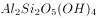
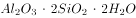

# 2022年上海市公务员录用考试《行测》题（B类）（网友回忆版）

> 常识判断 · 35 题 · 上海 2022

## 材料 1

        习近平总书记在庆祝中国共产党成立100周年大会上的重要讲话中指出：“中国共产党为什么能，中国特色社会主义为什么好，归根到底是因为马克思主义行！”100年来，闪耀着真理光芒、彰显着真理力量的马克思主义指引我们走好了过往的奋斗路，也必将继续指引我们走好前方的奋进路。马克思主义是我们认识世界、把握规律、追求真理、改造世界的强大思想武器，是党和国家必须始终遵循的指导思想。习近平总书记指出：“马克思主义基本原理是普遍真理，具有永恒的思想价值，但马克思主义经典作家并没有穷尽真理，而是不断为寻求真理和发展真理开辟道路。”100年来，我们党坚定不移坚持以马克思主义为指导，同时创造性地把马克思主义基本原理同中国具体实际相结合、同中华优秀传统文化相结合，以实事求是的态度发展马克思主义，不断推进马克思主义中国化，不断开辟马克思主义新境界，创立了毛泽东思想、邓小平理论，形成了“三个代表”重要思想、科学发展观，创立了习近平新时代中国特色社会主义思想，为党和人民事业发展提供了科学理论指导。马克思主义在中国大地、在人民群众心中落地生根，充分表明了马克思主义行；马克思主义不断解答中国发展提出的新课题、回应人类社会面临的新挑战，有力证明了马克思主义行。

### 第 1 题　qid 4652003 · 人文常识

，是马克思主义活的灵魂，是我们适应新形势、认识新事物、完成新任务的根本思想武器。

- **A**. 解放思想　✅
- **B**. 实事求是　✅
- **C**. 开拓创新
- **D**. 与时俱进　✅

**答案**：ABD

**官方解析**

本题考查政治常识。
习近平总书记指出，“解放思想、实事求是、与时俱进，是马克思主义活的灵魂”。这一重要论断深刻总结了中国特色社会主义的历史成就与宝贵经验，包含了彻底的辩证唯物主义和历史唯物主义，展现了当代中国马克思主义和21世纪马克思主义发展的新高度。新时代坚持马克思主义、坚持社会主义，必须始终坚持解放思想、实事求是、与时俱进，奋力开拓中国特色社会主义新境界。
故正确答案为ABD。

---

### 第 2 题　qid 4652008 · 人文常识

100年来，在推进马克思主义中国化的进程中，我们党始终坚持并不断发展马克思主义人民观，明确回答                    的重大命题，坚持发展为了人民、发展依靠人民、发展成果由人民共享。

- **A**. “为了谁、依靠谁、领导谁”
- **B**. “为了谁、依靠谁、我是谁”　✅
- **C**. “为了谁、针对谁、我是谁”
- **D**. “我是谁、从哪里来、到哪里去”

**答案**：B

**官方解析**

本题考查政治常识。
历史和实践证明，一百年来，我们党正是毫不动摇地坚持并不断发展马克思主义人民观，明确回答“为了谁、依靠谁、我是谁”的重大命题，坚持发展为了人民、发展依靠人民、发展成果由人民共享，始终牢记“江山就是人民、人民就是江山，打江山、守江山，守的是人民的心”，才凝聚起众志成城的磅礴力量，团结带领人民共创历史伟业。
故正确答案为B。

---

### 第 3 题　qid 4652013 · 人文常识

马克思主义为什么行，既是一个基本的理论问题，又是一个重要的实践问题。下列能够回答这个问题的是：

- **A**. 马克思主义占据真理制高点，科学回答“历史之问”　✅
- **B**. 马克思主义占据道义制高点，科学回答“人民之问”　✅
- **C**. 马克思主义占据实践制高点，科学回答“实践之问”　✅
- **D**. 马克思主义占据时代制高点，科学回答“时代之问”　✅

**答案**：ABCD

**官方解析**

本题考查政治常识。
A项正确，马克思主义是无产阶级的科学世界观和方法论，是关于自然、社会和思维发展的一般规律的学说，是关于社会主义必然代替资本主义、最终实现共产主义的学说。它对人类的最大贡献就是“两大发现”：揭示历史之谜的唯物史观和揭示资本主义之谜的剩余价值学说。这两大发现创造性地揭示了人类社会发展的一般规律和资本主义发展的特殊规律，为人民指明了实现自由和解放的道路。
B项正确，人民性是马克思主义的鲜明品格。人民至上是马克思主义的政治立场，马克思主义政党把人民放在心中最高位置，一切奋斗都致力于实现最广大人民的根本利益，这是马克思主义最鲜明的政治立场。坚持人的自由全面发展的观点，一切从群众中来、到群众中去的观点等，都是马克思主义人民性的具体内容。
C项正确，实践的观点是马克思主义首要的、基本的观点。马克思认为，理论的真理性和现实性只能在实践中得到检验和实现。马克思主义的实践性，集中体现为中国共产党人的思想路线，即一切从实际出发，理论联系实际，实事求是，在实践中检验真理和发展真理。
D项正确，时代性是马克思主义的鲜明特征，与时俱进是马克思主义的理论品质，是其能够永葆蓬勃生命力的根本途径。一部马克思主义发展史，就是马克思主义创始人及后继者根据时代和实践的发展而不断创新发展马克思主义的历史。
故正确答案为ABCD。

---

### 第 4 题　qid 4652015 · 人文常识

是马克思主义之所以成为科学的两大理论基石。正是在此基础之上，马克思建立了马克思主义政治经济学、科学社会主义理论，形成了关于自然、社会和人类思维规律的一系列原理、观点和结论，创立了为无产阶级和全人类实现解放的最科学、最彻底的理论体系。

- **A**. 唯物史观和剩余价值理论　✅
- **B**. 唯物史观和劳动价值论
- **C**. 劳动价值论和剩余价值理论
- **D**. 唯物史观和辩证法思想

**答案**：A

**官方解析**

本题考查政治常识。
A项正确，B、C、D三项错误，唯物史观和剩余价值理论是马克思主义之所以成为科学的两大理论基石。正是在唯物史观和剩余价值理论的坚实基础之上，马克思建立了马克思主义政治经济学、科学社会主义理论，形成了关于自然、社会和人类思维规律的一系列原理、观点和结论，创立了为无产阶级和全人类实现解放的最科学、最彻底的理论体系。
故正确答案为A。

---

## 材料 2

        行政处罚是行政机关有效实施行政管理，保障法律法规贯彻施行的重要手段。《行政处罚法》的修订工作深入贯彻习近平新时代中国特色社会主义思想特别是习近平法治思想，是贯彻落实党中央关于全面依法治国重大决策部署的体现，亦是巩固行政执法领域重大改革成果的体现。《行政处罚法》于2019年10月形成修订草案征求意见稿，多次征求国务院部门、各省市人大常委会法制工作机构，以及基层立法联系点、部分高等院校、科研单位的意见。2020年6月委员长会议将《行政处罚法（修订草案）》提请十三届全国人大常委会一审，2020年10月再次审议，2021年1月22日三审通过。新修订的《行政处罚法》于2021年7月15日起施行。

        此次修改的主要内容有：第一，全面落实行政执法体制改革要求。增加综合行政执法制度，推动解决多头执法、重复执法和执法力量分散问题，规定国家在特定领域推行建立综合行政执法制度，相对集中行政处罚权。第二，严格规范公正文明执法要求。一是丰富行政处罚种类、完善没收违法所得制度、延长追责期限。二是完善执法程序，将行政执法公示、执法全过程记录、重大执法决定法制审核“三项制度”明确纳入《行政处罚法》。三是明确行政处罚裁量权基准制度，规范行使行政处罚自由裁量权。规范非现场执法和行政处罚信息化，提高行政效率的同时体现便民原则，强化当事人的陈述、归辩等权利保护等等。

### 第 5 题　qid 4651981 · 法律常识

《行政处罚法》的修订是对社会主义法治理念            内容的反映。

- **A**. 依法治国　✅
- **B**. 执法为民　✅
- **C**. 公平正义　✅
- **D**. 服务大局　✅

**答案**：ABCD

**官方解析**

本题考查法律常识。
A项正确，依法治国是社会主义法治的核心内容，包括“科学立法、严格执法、公正司法、全民守法”的“十六字方针”。《行政处罚法》的修订反映了严格执法的方针，也反映了依法治国的理念。
B项正确，执法为民是社会主义法治的本质要求，内涵是：以人为本；保障人权；文明执法。《行政处罚法》修改的内容中，强化当事人的陈述、申辩等权利保护等内容反映了执法为民的理念。
C项正确，公平正义是社会主义法治的价值追求，其内涵包括：法律面前人人平等；合法合理；程序正当；及时高效。《行政处罚法》修改的内容中，明确行政处罚裁量权基准制度，规范行使行政处罚自由裁量权等反映了公平正义的理念。
D项正确，服务大局是社会主义法治的重要使命。材料中“《行政处罚法》的修订是贯彻落实党中央关于全面依法治国重大决策部署的体现”反映了服务大局。
故正确答案为ABCD。

---

### 第 6 题　qid 4651986 · 法律常识

《行政处罚法》的修订过程体现了                    的立法原则。

- **A**. 依照法定的程序和权限　✅
- **B**. 发扬社会主义民主　✅
- **C**. 高效便民
- **D**. 以经济建设为中心

**答案**：AB

**官方解析**

本题考查法律常识。
A项正确，《立法法》第二十六条第一款规定：“委员长会议可以向常务委员会提出法律案，由常务委员会会议审议。”《立法法》第二十九条第一款规定：“列入常务委员会会议议程的法律案，一般应当经三次常务委员会会议审议后再交付表决。”《行政处罚法》的修订过程“2020年6月委员长会议将《行政处罚法（修订草案）》提请十三届全国人大常委会一审，2020年10月再次审议，2021年1月22日三审通过。新修订的《行政处罚法》于2021年7月15日起施行。”符合《立法法》的规定，体现了依照法定的程序和权限的立法原则。
B项正确，《行政处罚法》于2019年10月形成修订草案征求意见稿，并且根据各方面意见，对征求意见稿进一步修改完善，形成了《行政处罚法（修订草案）》。这体现了发扬社会主义民主的立法原则。
C项错误，高效便民，是指行政机关应依法高效率、高效益地行使职权，最大程度地方便人民群众，从而更好地服务于人民和实现行政管理的目标。主要体现在行政执法过程中，“修订过程”是立法程序，二者并无太大关系。
D项错误，以经济建设为中心是指中国共产党在社会主义初级阶段基本路线的中心，是兴国之要，是党和国家兴旺发达和长治久安的根本要求。根据《行政处罚法》第一条规定：“为了规范行政处罚的设定和实施，保障和监督行政机关有效实施行政管理，维护公共利益和社会秩序，保护公民、法人或者其他组织的合法权益，根据宪法，制定本法。”行政处罚法的修订并非体现以经济建设为中心的立法原则。
故正确答案为AB。

---

### 第 7 题　qid 4652001 · 法律常识

根据新修订的《行政处罚法》，在            领域可建立综合行政执法制度。

- **A**. 市场监管　✅
- **B**. 生态环境　✅
- **C**. 文化市场　✅
- **D**. 交通运输　✅

**答案**：ABCD

**官方解析**

本题考查法律常识。
根据《行政处罚法》第十八条第一款规定：“国家在城市管理、市场监管、生态环境、文化市场、交通运输、应急管理、农业等领域推行建立综合行政执法制度，相对集中行政处罚权。”
故正确答案为ABCD。

---

### 第 8 题　qid 4652002 · 法律常识

新修订的《行政处罚法》中增加的行政处罚种类有：

- **A**. 通报批评　✅
- **B**. 责令改正
- **C**. 降低资质等级　✅
- **D**. 责令关闭　✅

**答案**：ACD

**官方解析**

本题考查法律常识。
修订前的《行政处罚法》第八条规定：“行政处罚的种类：（一）警告；（二）罚款；（三）没收违法所得、没收非法财物；（四）责令停产停业；（五）暂扣或者吊销许可证、暂扣或者吊销执照；（六）行政拘留；（七）法律、行政法规规定的其他行政处罚。”修订后的《行政处罚法》第九条规定：“行政处罚的种类：（一）警告、通报批评；（二）罚款、没收违法所得、没收非法财物；（三）暂扣许可证件、降低资质等级、吊销许可证件；（四）限制开展生产经营活动、责令停产停业、责令关闭、限制从业；（五）行政拘留；（六）法律、行政法规规定的其他行政处罚。”通报批评、降低资质等级、责令关闭属于新增加的行政处罚种类，责令改正不属于行政处罚。
故正确答案为ACD。

---

### 第 9 题　qid 4652005 · 法律常识

新修订的《行政处罚法》将行政执法公示、执法全过程记录等制度明确纳入，体现了行政法基本原则中的：

- **A**. 行政公开原则
- **B**. 程序正当原则　✅
- **C**. 信赖保护原则
- **D**. 合法行政原则

**答案**：B

**官方解析**

本题考查法律常识。
A项错误，B项正确，程序正当原则包括行政公开原则、公众参与原则和回避原则，行政公开原则是程序正当原则的内容之一，指的是除涉及国家秘密和依法受到保护的商业秘密、个人隐私外，行政机关实施行政管理应当做到信息公开。《行政处罚法》规定行政执法公示、执法全过程记录等制度，将行政处罚中的相关信息进行公开，体现了程序正当原则。
C项错误，信赖保护原则指非因法定事由并经法定程序，行政机关不得撤销、变更已经生效的行政决定；因国家利益、公共利益或者其他法定事由需要撤回或者变更行政决定的，应当按照法定权限和程序进行，并对行政管理相对人因此而受到的财产损失依法予以补偿。题中并未体现信赖保护原则。
D项错误，合法行政原则指行政机关必须遵守和执行法律，一切行政活动都要以法律为依据，严格遵守法律的有关规定，不得享有法外的特权，超越其权限的行为无效，违反法律导致相应的后果，一切行政违法行为都必须承担相应的法律责任。题中并未体现信赖保护原则。
故正确答案为B。

---

## 材料 3

        2021年4月8日，上海浦东新区上线了升级版的城市大脑，该版本将此前涉及经济治理104个场景、城市治理50个场景和社会治理11个场景进行了整合集成，形成了10类57个整合场景。在物业管理场景中，升级后的城市大脑可以通过视频捕获智能识别楼道充电、飞线充电行为，发现后即通过平台推送物业公司进行劝阻，如劝阻无效，即通过区城运中心指挥平台推送城管、公安、消防等部门进行执法处置。

        同时，城市大脑还会推送居委会、业委会，通过召开“三会”等方式，商议建设集中充电设施来缓解充电矛盾，实现治理全流程无缝衔接；推动各方业务流程精准衔接，建立高效联动响应机制，通过村居“微闭环”、街镇（片区）“小闭环”、部门“中闭环”、政府市场社会“大闭环”，实现智能发现、自动派单、管理闭环、高效处置。

        2020年12月，浦东城市大脑升级版启动上线试运行，7个全面融合经济、社会、城市治理要素的智能化场景深化整合后投入实战运行。近年来，浦东围绕重大风险防范和治理体系治理能力现代化持续创新探索，从以“城市大脑”为基础的城市治理创新到以“家门口”服务体系为基础的社会治理创新，超大城市治理的制度体系日趋完整。

        场景建设从无到有、从少到多、从多到精的过程背后，是浦东打破部门之间、条线之间、层级之间职责壁垒。其中，垃圾分类应用场景就是一个典型。上海实施垃圾分类以来，浦东作为特大型区，面临产生点位多、收运覆盖面广、全程分类体系监管难度大等特点。城市大脑通过物联感知设备、大数据分析和智能监测，从源头收集到中转运输和末端处置全过程智能发现小包垃圾、跑冒滴漏等管理顽疾，整合集成包括政府管理部门、物业公司和收运企业等市场主体，居委会和志愿者等自治共治组织在内的各方力量，实现治理需求和资源、制度供给高效衔接。如今垃圾分类场景已经将浦东新区全区2662个住宅小区、337个行政村、2441个垃圾产生单位、43627个沿街商铺、91个小压站、12个中转站、4个处置场全部落图管理。

        在养老服务场景中，浦东新区共有120多家养老机构，2万6千多个养老床位，传统管理按照部门“单打独斗”和人工管理模式，监管难度很大。此次城市大脑通过深化整合，针对养老机构共制定出38个治理要素，其中城市治理分成场所、设备两大类7个要素，经济治理要素分成人员、资金、制度、证照、经营五大类20个要素，社会治理分成信访舆情、紧急救助、防疫管理等三类5个要素。这明确了行业监管范围和职责边界，推动各方治理职责全覆盖衔接，缺位的完善补位，交叉的优化协同，在党建引领下，实现政府、市场、社会同向发力。

### 第 10 题　qid 4652022 · 人文常识

阅读资料可知，以下有关城市大脑的描述正确的是：

- **A**. 浦东新区于2021年正式启动城市大脑项目
- **B**. 城市大脑是电力时代技术进步的重要产物
- **C**. 城市大脑兼容互联网架构与智慧城市建设　✅
- **D**. 城市大脑推动城市治理并彻底解决城市病

**答案**：C

**官方解析**

本题考查政治常识。
A项错误，浦东“城市大脑”于2020年7月正式上线，并非于2021年正式启动。
B项错误，19世纪60年代后期，各种新技术、新发明层出不穷，并被应用于各种工业生产领域，促进经济的进一步发展，第二次工业革命蓬勃兴起，人类进入了“电气时代”。城市大脑以互联网为依托，是信息时代技术进步的产物。
C项正确，城市大脑依托于互联网，一般都会定位自身是“基于云计算、大数据、物联网、人工智能等新一代信息技术”所构建的系统与应用，其是智慧城市的一个有机组成部分，更多地属于智慧城市中的管理与决策系统，强调的数据资源依然来自构建智慧城市的物联网等信息技术基础设施。故“城市大脑兼容互联网架构与智慧城市建设”的说法正确。
D项错误，城市大脑连接散落在城市各个单元的数据资源，打通城市神经网络，让数据帮助城市来做思考、决策和运营，形成城市基础运行能力、城市实时“健康”状态的大视图，形成“全时段、全区域、自动化、多途径”的事件预警网络和协同治理体系，为城市综合治理提供决策依据，让城市管理工作更加有效。但“城市大脑推动城市治理并彻底解决城市病”的表述过于绝对。
故正确答案为C。

---

### 第 11 题　qid 4652023 · 人文常识

城市大脑最为关键的功能体现在：

- **A**. 预判问题
- **B**. 转移问题
- **C**. 处置问题　✅
- **D**. 终结问题

**答案**：C

**官方解析**

本题考查管理常识。
C项正确，A、B、D三项错误，城市大脑是支撑未来城市可持续发展的全新基础设施，其核心是利用实时全量的城市数据资源全局优化城市公共资源，将散布在城市各个角落的数据连接起来，通过对大量数据的分析和整合，对城市进行全域的即时分析、指挥、调动、管理，从而实现对城市的精准分析、整体研判、协同指挥。材料描述的几类主要场景中，可以看出城市大脑最终还是为了缓解社会治理中的矛盾和问题，所以其最为关键的功能体现在处置问题上。
故正确答案为C。

---

### 第 12 题　qid 4652024 · 人文常识

城市大脑运行依托的主体包括：

- **A**. 政府部门　✅
- **B**. 互联网企业
- **C**. 社会组织　✅
- **D**. 自治组织　✅

**答案**：ACD

**官方解析**

本题考查管理常识。
A、C、D三项正确，B项错误，根据第四段“上海实施垃圾分类以来，浦东作为特大型区，面临产生点位多、收运覆盖面广、全程分类体系监管难度大等特点。城市大脑通过物联感知设备、大数据分析和智能监测，从源头收集到中转运输和末端处置全过程智能发现小包垃圾、跑冒滴漏等管理顽疾，整合集成包括政府管理部门、物业公司和收运企业等市场主体，居委会和志愿者等自治共治组织在内的各方力量，实现治理需求和资源、制度供给高效衔接”，可知，城市大脑的运行依托的主体包括：政府管理部门、居委会（自治组织）和志愿者（社会力量）等自治共治组织在内的各方力量和物联感知设备，未涉及到互联网企业。
故正确答案为ACD。

---

### 第 13 题　qid 4652025 · 人文常识

分析材料可知，城市大脑具有：

- **A**. 感知现实场景的能力　✅
- **B**. 数据采集、分析、应用能力　✅
- **C**. 大数据计算能力　✅
- **D**. 精细化管理能力　✅

**答案**：ABCD

**官方解析**

本题考查管理常识。
A项正确，材料所述：“在物业管理场景中，升级后的城市大脑可以通过视频捕获智能识别楼道充电、飞线充电行为，发现后即通过平台推送物业公司进行劝阻。”说明城市大脑具有感知现实场景的能力。
B项正确，材料所述：“城市大脑通过物联感知设备、大数据分析和智能监测，从源头收集到中转运输和末端处置全过程智能发现小包垃圾、跑冒滴漏等管理顽疾，整合集成包括政府管理部门、物业公司和收运企业等市场主体，居委会和志愿者等自治共治组织在内的各方力量，实现治理需求和资源、制度供给高效衔接。”说明城市大脑具有数据采集、分析、应用能力。
C项正确，材料所述“升级后的城市大脑可以通过视频捕获智能识别楼道充电、飞线充电行为，发现后即通过平台推送物业公司进行劝阻，如劝阻无效，即通过区城运中心指挥平台推送城管、公安、消防等部门进行执法处置。”“城市大脑通过物联感知设备、大数据分析和智能监测，从源头收集到中转运输和末端处置全过程智能发现小包垃圾”说明城市大脑具有大数据计算能力，通过大数据计算发现问题，进行推送处理。
D项正确，材料所述：“如今垃圾分类场景已经将浦东新区全区2662个住宅小区、337个行政村、2441个垃圾产生单位、43627个沿街商铺、91个小压站、12个中转站、4个处置场全部落图管理。”说明城市大脑具有精细化管理能力。
故正确答案为ABCD。

---

### 第 14 题　qid 4652041 · 人文常识

根据材料可推断，在养老服务场景中，城市大脑通过深化整合实现了：

- **A**. 从以服务对象为中心向以部门合作为中心转变
- **B**. 从传统治理方式向数字化治理方式的转变　✅
- **C**. 从碎片化治理目标向整体性治理目标的转变　✅
- **D**. 从单一部门应对问题向多部门协同联动的转变　✅

**答案**：BCD

**官方解析**

本题考查管理常识。
A项错误，B、D两项正确，城市大脑场景建设从无到有、从少到多、从多到精的过程背后，是浦东打破部门之间、条线之间、层级之间职责壁垒，坚持以群众和市场主体需求为中心推动治理流程再造的自我革命。整合后的场景充分体现了从以部门为中心向以服务对象为中心的转变，从各部门依据职责各司其职向围绕服务对象需求主动跨前、协同联动、集成服务的转变，从传统治理方式向数字化转型引领数字治理转变。
C项正确，此次城市大脑通过深化整合，针对养老机构共制定出38个治理要素，这明确了行业监管范围和职责边界，推动各方治理职责全覆盖衔接，缺位的完善补位，交叉的优化协同，在党建引领下，实现政府、市场、社会同向发力。体现了从碎片化治理目标向整体性治理目标的转变。
故正确答案为BCD。

---

### 第 15 题　qid 4651958 · 人文常识

历史充分证明，江山就是人民，人民就是江山，人心向背关系党的生死存亡。赢得人民信任，得到人民支持，党能够克服任何困难，就能够无往而不胜。从哲学的角度来看，人民与江山的关系体现了：

- **A**. 唯物主义认识论：实践是认识发展的动力
- **B**. 唯物辩证法：整体由部分组成、部分服从于整体
- **C**. 唯物史观：人民群众是历史的创造者　✅
- **D**. 辩证唯物论：矛盾的主次方面在一定条件下相互转化

**答案**：C

**官方解析**

本题考查政治常识。
A项错误，实践是认识发展的动力强调实践中产生的新问题需要新的认识去解决，从而推动认识的发展。与题干无关。
B项错误，整体与部分的辩证关系表现在二者是不可分割的，整体由部分组成，整体只有对于组成它的部分而言，才是一个确定的整体，没有部分就无所谓整体；部分是整体中的部分，只有相对于它所构成的整体而言，才是一个确定的部分，没有整体也无所谓部分，任何部分离开了整体，它就失去了原来的意义。与题干无关。
C项正确，人民群众是历史的主体和历史的创造者，主要体现在：人民群众是社会物质财富的创造者，人民群众是社会精神财富的创造者，人民群众是实现社会变革的决定力量。题干指出“人心向背关系党的生死存亡”强调了人民群众的重要性，体现了该哲理。
D项错误，一个矛盾中两个方面的地位和作用不平衡，其中居于支配地位，对事物的发展起主导作用的矛盾方面叫做矛盾的主要方面，对事物的发展不起主导作用的叫做矛盾的次要方面。事物的性质主要是由矛盾的主要方面决定，次要方面对事物的性质也有一定的影响，一定条件下二者可以相互转化。与题干无关。
故正确答案为C。

---

### 第 16 题　qid 4651959 · 人文常识

2021年5月，上海市推出首本《劳动教育特色课程范例》，劳动教育进课堂有了具体的教学内容和教学要求。从历史唯物主义的视角来看，加强劳动教育的哲学依据是：

- **A**. 人生的真正价值就在于自我价值的实现
- **B**. 劳动和奉献是实现人生价值的根本途径　✅
- **C**. 奋斗才能让理想摆脱条件制约变为现实
- **D**. 劳动是推动和引领社会发展的第一动力

**答案**：B

**官方解析**

本题考查政治常识。
A项错误，人生价值包括个人对社会的责任和贡献（社会价值）、社会对个人的承认与满足（自我价值）两个方面，人生的真正价值在于社会价值与个人价值的统一。
B项正确，实现人生价值的根本途径是投身于人民群众的社会实践，进行积极的创造性的实践活动，而劳动在本质上就是人的创造性实践活动，人只有在劳动中才能进行创造性活动。题干中提到加强劳动教育，意在强调劳动的重要性。
C项错误，客观规律作为限制条件，始终制约着主观能动性的发挥，必须在尊重客观规律的基础之上发挥主观能动性，因此即便奋斗也无法摆脱条件制约。
D项错误，创新是引领发展的第一动力，而不是劳动。
故正确答案为B。

---

### 第 17 题　qid 4651962 · 人文常识

某市政协扎实推进“请你来协商”平台建设，开展“请你来协商”重点活动，通过面对面协商、点对点交流，不少意见建议得到采纳并转化为工作举措。从实质民主角度看，“请你来协商”平台：

- **A**. 丰富了公众通过政协行使民主权利的形式
- **B**. 是拓宽公民行使知情权、监督权的渠道
- **C**. 是实现人民当家作主的有益探索　✅
- **D**. 进一步完善了政治协商制度

**答案**：C

**官方解析**

本题考查政治常识。
A项错误，C项正确，社会主义协商民主的最终目的就是要让人民更好的当家作主，让人民群众更加直接、便捷地参与到公共生活中来，让人民群众更多的能在涉及自身利益的事务中发出声音，让人民群众真正参与到中华民族伟大复兴的生动实践中来。“请你来协商”平台丰富了公众行使民主权利的形式，但并未通过政协这一组织。通过“请你来协商”这个平台，人民群众更多的能在涉及自身利益的事务中发出声音、表达意见，是实现人民当家作主的有益探索。
B项错误，知情权指知悉、获取官方信息的自由与权利，是公民作为民事主体所必须享有的人格权的一部分；监督权，是指公民有监督一切行使公共权力人员的权利。“请你来协商”平台是人民群众参与管理的方式，并未体现知情权和监督权。
D项错误，政治协商制度是指在中国共产党领导下，各政党、各人民团体、各少数民族和社会各界的代表，以中国人民政治协商会议为组织形式，经常就国家的大政方针进行民主协商的一种制度。“请你来协商”只是群众提意见的平台，与政治协商制度无关。
故正确答案为C。

---

### 第 18 题　qid 4651968 · 人文常识

社区是城市基层治理的“最后一公里”。特别是城市化进入当前阶段，社区成为承载群众对美好生活的需求和日常矛盾最集中的单元。加上社区工作人员往往缺口较大，所辖人群基数又大，容易出现“小马拉大车”的情况。破解基层治理难题应该主要依靠：

- **A**. 人大代表，针对具体的问题向人大提出意见和建议
- **B**. 社区工作者，提高业务水平，增强独立决策的能力
- **C**. 科技，提高基层治理社会化、智能化及专业化水平
- **D**. 群众，做实参与机制，推动社区治理的“多元共治”　✅

**答案**：D

**官方解析**

本题考查管理常识。
D项正确，A、B、C三项错误，社区是城市基层治理的“最后一公里”。特别是城市化进入当前阶段，社区成为承载群众对美好生活的需求和日常矛盾最集中的单元。加上社区工作人员往往缺口较大，所辖人群基数又大，容易出现“小马拉大车”的情况。突出依靠群众，做实参与机制，推动社区治理“多元共治”成为破解基层治理难题的重要手段。要坚持依靠居民、依法有序组织居民群众参与社区治理，实现人人参与、人人尽力、人人共享。
故正确答案为D。

---

### 第 19 题　qid 4651970 · 人文常识

“幽灵，一个共产主义的幽灵，在欧洲游荡。为了对这个幽灵进行神圣的围剿，旧欧洲的一切势力，教皇和沙皇、梅特涅和基佐、法国的激进派和德国的警察，都联合起来了。”旧势力围剿“幽灵”的原因是：

- **A**. 它宣告资产阶级的灭亡是不可避免的　✅
- **B**. 它否定了资本主义社会存在的合理性
- **C**. 它实现了团结全体社会劳动者的壮举
- **D**. 它引发了资产阶级和无产阶级的矛盾

**答案**：A

**官方解析**

本题考查人文常识。
A项正确，B、C、D三项错误，题干文段出自《共产党宣言》，“幽灵”是旧欧洲反动势力对共产主义的污蔑和攻击。共产主义一出场，就公开宣布用暴力摧毁资产阶级的统治，资产阶级自然就把共产主义当作洪水猛兽看待，指责它是“鬼怪”“怪物”“幽灵”。由于共产党人坚信，共产主义要“使整个社会永远摆脱剥削、压迫和阶级斗争”，这必然会引起反动力量的恐惧和仇视。所以，包括资产阶级在内的“旧欧洲的一切势力”都攻击共产主义。而“幽灵”的降临就是要宣告：“资产阶级的灭亡和无产阶级的胜利是同样不可避免的。”共产党人的目的“只有用暴力推翻全部现存的社会制度才能达到······无产者在这个革命中失去的只是锁链。他们获得的将是整个世界”。故旧势力围剿“幽灵”的原因是其宣告了资产阶级的灭亡是不可避免的。
故正确答案为A。

---

### 第 20 题　qid 4651984 · 人文常识

1953年9月25日，《人民日报》正式公布了由毛泽东提出的过渡时期的总路线，总路线内容是：要在一个相当长的历史时期内，                    。

- **A**. 大力发展重工业，努力提高农业生产
- **B**. 解放生产力、发展生产力，尽快进入社会主义
- **C**. 将落后的农业国变成先进的工业国、最终全面实现现代化
- **D**. 基本上实现国家工业化和对农业、手工业、资本主义工商业的社会主义改造　✅

**答案**：D

**官方解析**

本题考查毛中特。
D项正确，A、B、C项错误，1953年9月25日，《人民日报》正式公布了由毛泽东提出的过渡时期的总路线。总路线内容是：要在一个相当长的历史时期内，基本上实现国家工业化和对农业、手工业、资本主义工商业的社会主义改造。这是国民经济发展的基本要求，又是实现三大改造的物质基础；而实现对农业、手工业和资本主义工商业社会主义改造又是实现国家工业化的必要条件。两者互相依赖、相辅相成。
故正确答案为D。

---

### 第 21 题　qid 4651992 · 人文常识

“每一场革命都有它自身的传奇。毛泽东率领数万名工农红军所完成的战略转移，就是中国革命史上的伟大传奇。”下列选项中，（    ）是描述这一“伟大传奇”的诗词。

- **A**. 天连五岭银锄落，地动三河铁臂摇。借问瘟君欲何往，纸船明烛照天烧。
- **B**. 钟山风雨起苍黄，百万雄师过大江。虎踞龙盘今胜昔，天翻地覆慨而慷。
- **C**. 一山飞峙大江边，跃上葱茏四百旋。冷眼向洋看世界，热风吹雨洒江天。
- **D**. 金沙水拍云崖暖，大渡桥横铁索寒。更喜岷山千里雪，三军过后尽开颜。　✅

**答案**：D

**官方解析**

本题考查毛中特。
由“毛泽东率领数万名工农红军所完成的战略转移”，可知题干中的“伟大传奇”是指长征。
A项错误，“天连五岭银锄落，地动三河铁臂摇。借问瘟君欲何往，纸船明烛照天烧”出自毛泽东的《七律二首·送瘟神·其二》，是毛泽东在1958年6月30日《人民日报》上读到余江县消灭了血吸虫的消息后写下的组诗作品。该诗写新时代新社会人民当家作主、改天换地的壮举和人民幸福安康、瘟神被逐的情景，浓情歌颂了伟大的时代和英雄的人民。与长征无关。
B项错误，“钟山风雨起苍黄，百万雄师过大江。虎踞龙盘今胜昔，天翻地覆慨而慷”出自毛泽东的《七律·人民解放军占领南京》，该诗描绘了1949年解放军渡江解放南京的雄伟场面，赞颂了南京解放所取得的历史性胜利，抒发了欢庆南京解放的革命豪情。与长征无关。
C项错误，“一山飞峙大江边，跃上葱茏四百旋。冷眼向洋看世界，热风吹雨洒江天”出自毛泽东的《七律·登庐山》，全诗紧扣诗题“登庐山”来写，概写登山过程和抒写登山后的所见所思所感，歌颂了新中国的新社会现实，并对反华势力表示极大的蔑视，表达了自己高度乐观的形势观。与长征无关。
D项正确，“金沙水拍云崖暖，大渡桥横铁索寒。更喜岷山千里雪，三军过后尽开颜”出自毛泽东的《七律·长征》，意思是不惧急流巧渡金沙江，不畏严寒飞夺泸定桥；翻过白雪皑皑的千里岷山，红军战士个个喜笑颜开。《七律·长征》高度概括了红军长征的战斗历程，描绘了红军的英雄形象，充满了革命英雄主义和乐观主义精神，也展现了作者对革命胜利的坚定信念。
故正确答案为D。

---

### 第 22 题　qid 4651950 · 法律常识

社会保险通过政府、单位、个人三方共同筹集资金，保障公民在年老、疾病、工伤、失业、生育等情况下依法从国家和社会获得物质帮助。以下选项属于社会保险的是：

- **A**. 社区居民在医院接种新冠疫苗
- **B**. 利用医保账户购买“沪惠保”
- **C**. 通过“水滴筹”为患者捐款治病
- **D**. 生病时使用医保卡进行住院报销　✅

**答案**：D

**官方解析**

本题考查经济常识。
A项错误，我国新冠疫苗属于公共物品，在医院免费接种新冠疫苗属于社会福利，不属于社会保险。
B项错误，“沪惠保”是针对上海市基本医保参保人定制推出的上海城市定制型商业补充医疗保险，因此属于普惠性商业保险，不属于社会保险。
C项错误，水滴筹属于互助计划平台，通过“水滴筹”为患者捐款治病指的是部分家庭或者个人对其他人的帮助行为，因此属于社会互助，不属于社会保险。
D项正确，生病时使用医保卡进行住院报销属于医疗报销，是我国社会保障制度中的医疗保险，因此属于社会保险。
故正确答案为D。

---

### 第 23 题　qid 4651964 · 人文常识

为了助力体育企业纾困发展，激发体育消费市场活力，近期，全国多地陆续推出体育消费券，发放形式及体量也在不断升级。上海推出“消费券”配送升级版，五一小长假期间，上海体育消费券累积领券42542张，产生订单7916笔，拉动定点场馆直接消费70多万元。“消费券”助推经济发展，其传导路径应该是：

- **A**. 
发放体育消费券提高居民消费意愿带动体育消费上升促进体育经济发展
　✅
- **B**. 
发放消费券扩大居民劳动性收入增强居民实际购买力推动体育事业发展

- **C**. 
发放消费券降低商品消费价格刺激居民的消费欲望增加新的消费对象

- **D**. 
增加居民实际收入提振居民消费信心扩大线上消费比例带动体育经济的发展

**答案**：A

**官方解析**

本题考查经济常识。
消费券是专用券的一种，为实现经济政策的工具之一。消费券的功能与现金一样，但只能用来买商品，不能兑换成现金。消费券一般都会指定购物地点，在指定的商场才可以购买商品，而且要一次性消费完毕，不设找零。
A项正确，政府发放体育类消费券，能够使居民购买体育类产品时有巨大优惠，从而提高其消费意愿，进而带动体育类产品消费提高，使体育产业的供给增加，最终促进体育产业的蓬勃发展。
B项错误，消费券的发放是政府的无偿性福利支出，并没有扩大居民的劳动性收入。
C项错误，发放消费券指的是居民购买产品时可以使用消费券进行消费，居民实际支付中有巨大优惠，并不会降低商品的消费价格。
D项错误，发放政府消费券不可以兑换成现金，因此并没有增加居民的实际收入。
故正确答案为A。

---

### 第 24 题　qid 4651967 · 法律常识

如果将“公共政策”定义为执政党或者国家机关为解决某一公共问题而制定和实施的具有权威性的行为规范、行动准则和活动策略，那么基于此定义，（    ）不属于公共政策。

- **A**. 中华人民共和国最高人民法院民事判决书　✅
- **B**. “一带一路”国家战略
- **C**. 《中华人民共和国环境保护法》
- **D**. 2021年中央一号文件

**答案**：A

**官方解析**

本题考查政治常识。
A项错误，中华人民共和国最高人民法院民事判决书是人民法院代表国家行使审判权，对受理的民事案件和经济纠纷案件按照民事诉讼法规定的第一审普通程序或简易程序审理终结后，依照国家的民事法律、法规或经济法律、法规，就解决案件的实体问题作出的具有法律效力的书面文书处理决定。而公共政策是为了解决公共问题，二者并不一致。
B项正确，“一带一路”战略体现了国内公共政策与国家对外政策的紧密结合，是以调整社会公共利益为目标的国家外交战略，将有助于形成切实有效的、可持续发展的外交政策。属于公共政策。
C项正确，《中华人民共和国环境保护法》是为保护和改善环境，防治污染和其他公害，保障公众健康，推进生态文明建设，促进经济社会可持续发展，制定的法律。属于公共政策。
D项正确，2021年2月21日，《中共中央 国务院关于全面推进乡村振兴加快农业农村现代化的意见》，即2021年中央一号文件发布。2021年中央一号文件针对全面推进乡村振兴，加快农业农村现代化，提出了相关举措。属于公共政策。
本题为选非题，故正确答案为A。

---

### 第 25 题　qid 4651971 · 科技常识

目前，上海市加快推进“一网通办”“一网通管”平台建设，通过大数据、云计算、人工智能等技术，让城市变得更智慧，让城市管理“更艺术”，这体现了行政技术有助于：

- **A**. 行政资源的扩大
- **B**. 行政层级的增加
- **C**. 行政幅度的拓展
- **D**. 行政管理的精细化　✅

**答案**：D

**官方解析**

本题考查管理常识。
A项错误，行政资源是行政组织所拥有的实现组织目标的人力、物力、财力、权力、信息等一切要素的总称。通过大数据、云计算、人工智能等技术，让城市变得更智慧并不会扩大行政资源。
B项错误，行政层级指的是行政组织中的层次数目。按层级组建的行政组织，被划分为若干层次，形成一个等级分明的金字塔结构，处在塔尖的行政高层通过一个等级垂直链控制着整个行政体系。通过大数据、云计算、人工智能等技术，让城市变得更智慧并不会增加行政层级。
C项错误，行政幅度又称行政控制幅度，指的是一个层次的行政机构或一位行政领导所能直接、有效控制的下级机构或人员的数目。通过大数据、云计算、人工智能等技术，让城市变得更智慧并不会拓展行政幅度。
D项正确，行政技术指行政方法当中运用自然科学与工程科学方面的技术；行政管理的精细化就是落实管理责任，将管理责任具体化、明确化，以最大限度地减少管理所占用的资源和降低管理成本为主要目标的管理方式。题中，通过大数据、云计算、人工智能等技术，让城市变得更智慧，让城市管理“更艺术”，体现了行政技术有助于行政管理的精细化。
故正确答案为D。

---

### 第 26 题　qid 4651975 · 法律常识

按照我国《公务员法》对考录制度的规定，国家公务员实行公开考试、竞争择优的进入体制。随着人事制度改革的深化，普通公民经过法定程序进入政府机关将成为经常的、普遍的政治现象。这体现了人事行政具有（    ）的功能与作用。

- **A**. 巩固国家政权、保持政治稳定
- **B**. 提高行政管理质量和效率
- **C**. 推进政治民主化进程　✅
- **D**. 促进人才国际竞争

**答案**：C

**官方解析**

本题考查管理常识。
A项错误，人事行政作为国家政治制度的重要方面，对整个国家的政治发展和政权建设起着十分重要的作用。科学的人事行政制度能保证政府工作的连续性和正常化，不因领导人的更替或突发事件的发生而影响“行政机器”的运转。这既是政治稳定的一个重要标志，也是影响政治稳定的一个重要因素。该功能与题干表述无关。
B项错误，所有的行政管理活动以及行政管理过程的各个环节都要通过人去组织进行。公务员的素质与行为对政府管理的质量与效率具有关键作用，甚至决定着政府管理的成败。科学的人事行政管理能造就一支高素质的国家公务员队伍，并能充分调动和发挥他们的积极性、主动性与创造性，从而能最有效地提高行政效率，实现政府的管理目标。该功能与题干表述无关。
C项正确，按照《公务员法》对考录制度的规定，国家公务员实行公开考试、竞争择优的进入机制，每个公民都有权利报考公务员，经过公开、平等、竞争、择优的录用考试，一部分优秀人才进入公务员队伍，直接参与政府管理工作。普通公民经过法定程序进入政府机关成为经常的、普遍的政治现象，这是政治民主化的重要体现，也是社会主义民主政治的必然要求。
D项错误，当今世界各国之间的竞争是综合国力的竞争，其实质是科学技术、管理与人力资源的竞争。哪个国家高度重视人才资源的开发和利用，哪个国家就会在国际竞争中处于领先地位。因此，充分开发利用一切人才资源就成为我国在国际竞争中立于不败之地的根本保证。此功能与题干表述无关。
故正确答案为C。

---

### 第 27 题　qid 4651979 · 法律常识

根据我国《立法法》的规定，行政法规公布的形式为：

- **A**. 由总理签署国务院令公布　✅
- **B**. 由主席签署主席令公布
- **C**. 由国务院法制机构公布
- **D**. 由国务院办公厅公布

**答案**：A

**官方解析**

本题考查法律常识。
根据《立法法》第七十条第一款规定：“行政法规由总理签署国务院令公布。”
故正确答案为A。

---

### 第 28 题　qid 4651983 · 人文常识

我国是人民民主专政的社会主义国家，民主的主体具有广泛性，爱国统一战线就是这种广泛民主性的突出表现。爱国统一战线通过（    ）这一组织形式行使参政议政等民主权利。

- **A**. 各级人民代表大会
- **B**. 中共中央统一战线工作部
- **C**. 国家统一战线工作委员会
- **D**. 中国人民政治协商会议　✅

**答案**：D

**官方解析**

本题考查法律常识。
D项正确，A、B、C三项错误，中国人民政治协商会议是中国人民爱国统一战线的组织，是中国共产党领导的多党合作和政治协商的重要机构，是我国政治生活中发扬社会主义民主的重要形式，是社会主义协商民主的重要渠道和专门协商机构，是国家治理体系的重要组成部分，是具有中国特色的制度安排。爱国统一战线包括全体社会主义劳动者、社会主义事业的建设者、拥护社会主义的爱国者、拥护祖国统一和致力于中华民族伟大复兴的爱国者，其通过中国人民政治协商会议行使参政议政等民主权利。
故正确答案为D。

---

### 第 29 题　qid 4651990 · 法律常识

中国银行保险监督管理委员会是国务院直属事业单位，其主要职责是依照法律法规统一监督管理银行业和保险业，其在行使银行业、保险业监督管理职责时，属于：

- **A**. 行政机关
- **B**. 受委托组织
- **C**. 被授权组织　✅
- **D**. 行业协会组织

**答案**：C

**官方解析**

本题考查法律常识。
C项正确，A、B、D三项错误，根据《保险法》第一百三十三条规定：“保险监督管理机构依照本法和国务院规定的职责，遵循依法、公开、公正的原则，对保险业实施监督管理，维护保险市场秩序，保护投保人、被保险人和受益人的合法权益。”《商业银行法》第十条规定：“商业银行依法接受国务院银行业监督管理机构的监督管理，但法律规定其有关业务接受其他监督管理部门或者机构监督管理的，依照其规定。”中国银行保险监督管理委员会作为银行业和保险业的监督管理机构，其根据《保险法》和《商业银行法》的授权行使银行业、保险业监督管理职责，属于被授权组织。
故正确答案为C。

---

### 第 30 题　qid 4651998 · 科技常识

电子在原子核外很小的空间内作高速运动，其运动规律跟一般物体不同，没有明确的轨道。因此，人们常用一种能够表示电子在一定时间内在核外空间各处出现机会的模型来描述电子运动,并称之为“电子云”。如图是氢原子的电子云，图中的点表示的含义是：

- **A**. 一个电子
- **B**. 电子个数
- **C**. 电子运动的轨迹
- **D**. 电子在核外空间出现的几率　✅

**答案**：D

**官方解析**

本题考查科技常识。

A项错误，电子是一种带有负电的亚原子粒子，通常标记为。

B项错误，电子个数即电子数，代表电子的数量。电子数一般是指原子或离子的核外电子的数目。

C项错误，D项正确，电子云就是用小黑点疏密来表示空间各电子出现概率大小的一种图形。电子在原子核外很小的空间内作高速运动，其运动规律跟一般物体不同，它没有明确的轨道。根据量子力学中的测不准原理，我们不可能同时准确地测定出电子在某一时刻所处的位置和运动速度，也不能描画出它的运动轨迹。因此，人们常用一种能够表示电子在一定时间内在核外空间各处出现机会的模型来描述电子在核外的运动。在这个模型里，某个点附近的密度表示电子在该处出现的机会的大小。密度大的地方，表明电子在核外空间单位体积内出现的机会多；反之，则表明电子出现的机会少。由于这个模型很像在原子核外有一层疏密不等的“云”，所以，人们形象地称之为“电子云”。

故正确答案为D。

---

### 第 31 题　qid 4651974 · 人文常识

中国的瓷器驰名世界，传统陶瓷是以黏土等天然硅酸盐为主要原料烧成的制品，黏土的主要成分为，而广泛用于航空的压电陶瓷材料是锆钛酸铅。下列有关说法错误的是：

- **A**. 
黏土的主要成分也可以表示为

- **B**. 
陶瓷材料是人类应用最早的硅酸盐材料

- **C**. 
唐三彩、秦兵马俑制品属于陶瓷制品

- **D**. 
传统陶瓷材料的成分与压电陶瓷材料的成分相同
　✅

**答案**：D

**官方解析**

本题考查科技常识。

A项正确，黏土的主要成分为，该化学式可以分开写，也可以表示为，即黏土主要成分高岭石的化学式。

B项正确，陶瓷材料是指用天然或合成化合物经过成形和高温烧结制成的一类无机非金属材料，它具有高熔点、高硬度、高耐磨性、耐氧化等优点。陶瓷是人类利用物质特有的属性首先试制成功为自身生活服务的最早的硅酸盐材料，据考古学家发现，远在距今六七千年以前，我国就已经有了陶器。

C项正确，唐三彩是中国古代陶瓷烧制工艺的珍品，全名唐代三彩釉陶器，是盛行于唐代的一种低温釉陶器，釉彩有黄、绿、白、褐、蓝、黑等色彩，而以黄、绿、白三色为主，所以人们习惯称之为“唐三彩”。秦始皇陵兵马俑大部分是采用陶冶烧制的方法制成，1974年3月，兵马俑被发现。1987年，秦始皇陵及兵马俑坑被联合国教科文组织批准列入《世界遗产名录》，并被誉为“世界第八大奇迹”。

D项错误，陶瓷材料分为普通陶瓷（传统陶瓷）材料和特种陶瓷（现代陶瓷）材料两大类。传统陶瓷材料采用天然原料如长石、粘土和石英等烧结而成，是典型的硅酸盐材料，主要组成元素是硅、铝、氧，这三种元素占地壳元素总量的90%。压电陶瓷材料属于现代陶瓷材料，常用的压电陶瓷有钛酸钡系、锆钛酸铅二元系及在二元系中添加第三种ABO3(A表示二价金属离子，B表示四价金属离子或几种离子总和为正四价）型化合物。

本题为选非题，故正确答案为D。

---

### 第 32 题　qid 4651978 · 科技常识

生物群落是指在一定时间内一定空间上分布的各物种的种群集合，包括动物、植物、微生物等各物种的种群，共同组成生态系统中有生命的部分。下列不能构成生物群落的是：

- **A**. 西双版纳热带雨林中的生物
- **B**. 无菌培养基被污染后长出的共生菌落
- **C**. 无菌培养基上接种后长出的大肠杆菌菌落　✅
- **D**. 内蒙古大草原上的生物

**答案**：C

**官方解析**

本题考查科技常识。
一般组成群落的各种生物种群不是任意地拼凑在一起的，而是有规律地组合在一起才能形成一个稳定的群落。群落可理解为居住在一个地区的一切生物所组成的共同体，它们彼此通过各种途径相互作用和相互影响，是不同种群之间通过种间关系（互利共生、竞争、寄生、捕食等）形成的有机整体。
A项正确，“西双版纳热带雨林中的生物”指的是热带雨林生态系统中各种物种种群的集合，属于群落。
B项正确，“无菌培养基被污染后长出的共生菌落”是指培养基被污染后自然长出的各种菌类种群的集合，属于群落。
C项错误，“无菌培养基上接种后长出的大肠杆菌菌落”是在人类干预下产生的大肠杆菌种群，是一个种群，不属于群落。
D项正确，“内蒙古大草原上的生物”指的是草原生态系统中所有生物种群的集合，属于群落。
本题为选非题，故正确答案为C。

---

### 第 33 题　qid 4651980 · 人文常识

田山歌，作为吴歌形式的一个组成部分，是以稻作文化为基础的一种歌曲形式。稻作文化是人们在农事劳作中产生的一种文化。细数田山歌产生的历史，就能够感受到浓厚的稻作文化。田山歌的原始形态产生于：

- **A**. 新石器时代的太湖流域　✅
- **B**. 南北朝时期长江下游的江南一带
- **C**. 春秋时期的江浙一带
- **D**. 青铜时代的长江流域

**答案**：A

**官方解析**

本题考查人文常识。
A项正确，B、C、D三项错误。青浦田山歌是上海市青浦区的传统民歌，当地劳动人民在耘稻、耥稻时，由一人领唱，众人轮流接唱的田山歌，又称吆卖山歌、落秧歌、大头山歌。主要流传于青浦区的赵巷、练塘等地区。
田山歌的历史源头，一直可以追溯到新石器时代。早在七、八千年前，当太湖流域开始有了原始的栽培水稻农业时，包括上海在内的整个吴越水网地区就已经产生了田山歌的原始形态。
故正确答案为A。

---

### 第 34 题　qid 4651989 · 人文常识

我们每个人都有自己的姓氏。在上古三代，姓和氏不同，氏是从姓派生出来的，从汉代开始，姓氏合二为一，考其来历，有多种类别。下列对姓氏来源分类错误的一项是：

- **A**. 以所封诸侯国为姓氏，如齐、鲁、郑、吴、秦、楚、韩、魏等
- **B**. 以居住地为姓氏，这类姓氏中，复姓较多，如闾丘、西门、东郭等
- **C**. 以技艺为姓氏，如巫、卜、陶、屠等
- **D**. 以社会阶层为姓氏，如司徒、司马、司空、司寇等　✅

**答案**：D

**官方解析**

本题考查人文常识。
A项正确，以所封诸侯国为姓氏，如春秋战国时期的诸侯国，齐、鲁、郑、吴、秦、楚、韩、魏等。
B项正确，以居住地为姓氏，这类姓氏中，复姓较多，一般都带邱、门、乡、闾、里、郭等字，表示不同环境的居住地点，如闾丘、西门、东郭等。
C项正确，以技艺为姓氏，古代有一些职业，技术性很强，以技艺传家，用技艺名称命名姓氏，如巫、卜、陶、屠等。
D项错误，“司徒、司马、司空、司寇”是以官职为姓氏，古代有五官，即司徒、司马、司空、司士、司寇，他们的后代都以这些官职为姓氏。
本题为选非题，故正确答案为D。

---

### 第 35 题　qid 4651994 · 人文常识

下列诗歌各表现了一个传统节日，按节日的先后，排序正确的是：
①未得渡清浅，相对遥相望
②昨日登高罢，今朝更举觞
③海上生明月，天涯共此时
④日暮汉宫传蜡烛，轻烟散入五侯家

- **A**. ④①③②　✅
- **B**. ④①②③
- **C**. ①④③②
- **D**. ①④②③

**答案**：A

**官方解析**

本题考查人文常识。
①句出自唐代孟郊的《古意》，意为（牛郎和织女）不能渡过银河（相会），只能遥遥地隔岸相望。表现的节日是农历7月7日七夕节。
②句出自唐代李白的《九月十日即事》，意为昨天刚登完龙山，今天是小重阳，又要举杯宴饮。表现的节日是农历9月9日重阳节。
③句出自出自唐代张九龄的《望月怀远》，意为茫茫的海上升起一轮明月，此时你我都在天涯共相望。这首诗是望月怀思的名篇，表现的节日是农历8月15日中秋节。
④句出自出自唐代韩翃的《寒食》，意为寒食节这天家家都不能生火点灯，但皇宫却例外，天还没黑，宫里就忙着分送蜡烛，除了皇宫，贵近宠臣也可得到这份恩典。表现的节日是寒食节，在清明节前一二日。
按照节日先后的排序为④①③②。
故正确答案为A。

---
