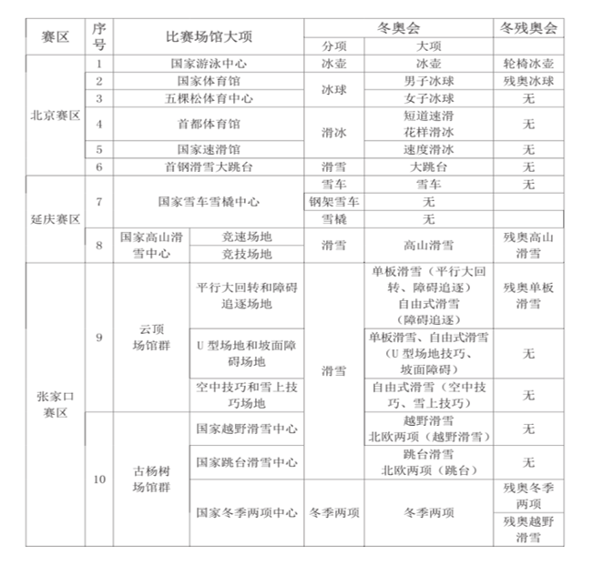
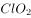
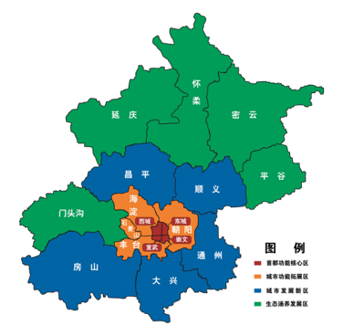

# 2022年北京市公务员录用考试《行测》题（网友回忆版）

> 常识判断 · 32 题 · 北京 2022

## 材料 1

阅读以下材料，完成18—21题

        2014年党中央站在国家发展全局的高度，作出了实施京津冀协同发展战略这一重大决策。七年来，三省市和有关部门狠抓落实，《京津冀协同发展规划纲要》确定的到2020年的目标任务已全面顺利完成。有序推进北京非首都功能疏解，空间布局和经济结构得到优化提升；高标准高质量推进雄安新区建设，新区呈现塔吊林立、热火朝天的新面貌；加快推进重点地区发展，引领带动周边地区协同发展；大力推进重点领域协同发展，交通、生态、产业等不断取得新突破；谋划推进一批重大改革创新举措落地，协同发展体制机制日趋完善；积极推进民生领域补短板强弱项，基本公共服务均等化水平持续提高。

        “京津冀如同一朵花上的花瓣，瓣瓣不同，却瓣瓣同心”。七年来的实践充分证明：实现京津冀协同发展，是面向未来打造新的首都经济圈、推进区域发展体制机制创新的需要，是探索完善城市群布局和形态、为优化开发区域发展提供示范和样板的需要，是探索生态文明建设有效路径、促进人口经济资源环境相协调的需要，是实现京津冀优势互补、促进环渤海经济区发展、带动北方腹地发展的需要。京津冀协同发展重大战略给京畿大地带来广阔的发展前景。

### 第 1 题　qid 4652193 · 人文常识

根据《中共中央 国务院关于对&lt;北京城市副中心控制性详细规划（街区层面）（2016年-2035年）&gt;的批复》，下列地区与北京市通州区统一规划、统一政策、统一标准、统一管控的有：
①三河  ②宝坻  ③香河  ④固安  ⑤大厂  ⑥武清

- **A**. ①④⑤
- **B**. ②④⑥
- **C**. ①③⑤　✅
- **D**. ②③⑥

**答案**：C

**官方解析**

本题考查政治常识。
①③⑤正确，②④错误，《中共中央 国务院关于对&lt;北京城市副中心控制性详细规划（街区层面）（2016年-2035年）&gt;的批复》在“九、推动城市副中心与河北省廊坊北三县地区协同发展”部分指出：“发挥城市副中心对周边的辐射带动作用，实现通州区与河北省廊坊北三县地区统一规划、统一政策、统一标准、统一管控，促进协同发展。”其中，廊坊北三县指廊坊市的三河县、大厂回族自治县以及香河县。
故正确答案为C。

---

### 第 2 题　qid 4652194 · 人文常识

北京2022年冬奥会是我国重要历史节点的重大标志性活动，京津冀三地在公共安全、公共卫生、道路交通等方面出台临时性行政措施，共同保障冬奥会筹办工作。下列冬奥会比赛场馆与所承接比赛项目对应正确的是：

- **A**. 首都体育馆——花样滑冰　✅
- **B**. 国家高山滑雪中心——钢架雪车
- **C**. 五棵松体育中心——速度滑冰
- **D**. 云顶滑雪公园——冬季两项

**答案**：A

**官方解析**

本题考查政治常识。

北京冬奥会是第24届冬奥会，将于2022年2月4日至20日举行，共设7个大项、15个分项、109个小项。2022冬奥会和冬残奥会竞赛场馆及项目分布如下图所示。

A项正确，首都体育馆将举办的项目是短道速滑与花样滑冰。

B项错误，国家高山滑雪中心将举办项目的是高山滑雪；钢架雪车项目将在国家雪车雪橇中心举办。

C项错误，五棵松体育中心将举办的项目是女子冰球。速度滑冰项目将在国家速滑馆举办。

D项错误，云顶滑雪公园将举办的是单板滑雪、自由式滑雪等项目。冬季两项将在古杨树场馆群的国家冬季两项中心举办。

故正确答案为A。

---

### 第 3 题　qid 4652195 · 人文常识

为充分整合京津冀三地文化和旅游等资源，有关部门发行了“京津冀旅游一卡通”。下列不可能列入其中的旅游景点是:

- **A**. 盘山风景名胜区
- **B**. 赵州桥展览馆
- **C**. 古北口古镇
- **D**. 沙家浜旅游区　✅

**答案**：D

**官方解析**

本题考查地理国情。
A项正确，盘山位于天津市蓟州区西北，为国家5A级景区。该景区始记于汉，兴于唐，极盛于清，是自然山水与名胜古迹并著，佛家文化与皇家文化共融的旅游休闲胜地。
B项正确，赵州桥，是一座位于河北省石家庄市赵县城南洨河之上的石拱桥，因赵县古称赵州而得名。赵州桥始建于隋代，由匠师李春设计建造。赵州桥展览馆位于河北省石家庄市赵县赵州镇赵州桥景区。
C项正确，古北口镇，隶属于北京市密云区。主要景点有司马台长城、古北口瓮城、杨令公庙等。
D项错误，沙家浜旅游区一般指沙家浜芦苇荡风景区。沙家浜芦苇荡风景区位于江苏省常熟市阳澄湖畔，不属于京津冀三地的范围。
本题为选非题，故正确答案为D。

---

### 第 4 题　qid 4652196 · 人文常识

2021年8月北京市政府印发的《北京市“十四五”时期高精尖产业发展规划》指出，2035年京津冀产业协同发展新格局将全面形成。下列哪项不可能是该文件提出的相关措施？

- **A**. 完善以智能网联汽车为核心的京津冀汽车产业生态圈，加快有条件自动驾驶的智能网联汽车研发生产和示范应用
- **B**. 支持北京工业互联网和智能制造头部企业对接津冀生产制造资源，加速赋能津冀传统产业
- **C**. 抓紧抓好协同发展重点任务落实，促进养老、教育、医疗等公共服务的跨区域协同　✅
- **D**. 推动京津冀规模化、协同化布局氢能产业，重点布局制备、运输、存储、加注和氢燃料电池产业链环节

**答案**：C

**官方解析**

本题考查政治常识。
A、B、D三项正确，《北京市“十四五”时期高精尖产业发展规划》在“四、优化区域协同发展新格局”中的“（四）构建京津冀产业协同发展新格局”部分第1点指出：“（1）氢能产业协同发展示范。推动京津冀规模化、协同化布局氢能产业，重点布局制备、运输、存储、加注和氢燃料电池产业链环节······（2）智能网联汽车产业协同发展示范。完善以智能网联汽车为核心的京津冀汽车产业生态圈，加快有条件自动驾驶的智能网联汽车研发生产和示范应用，提高自动驾驶功能装备率······（3）工业互联网产业协同发展示范。加快推进京津冀联网协同智造，支持北京工业互联网和智能制造头部企业对接津冀生产制造资源，加速赋能津冀传统产业。”
C项错误，“抓紧抓好协同发展重点任务落实，促进养老、教育、医疗等公共服务的跨区域协同”不是该文件提出的相关措施。
本题为选非题，故正确答案为C。

---

## 材料 2

阅读以下材料，完成22—25题

        北京朝阳原国营798厂等电子工业的老厂区所在地，已华丽转身，成为赫赫有名的北京798艺术区，即北京的文化新地标。数以百计的设计、文化艺术机构云集此地，形成了别具一格的“SOHO式艺术聚落”和“LOFT生活方式”。798艺术区的形成，主要基于对原有空间和建筑的开发、改造和利用，这是北京市开展城市更新行动的方式之一。

        城市更新主要是指对城市空间形态和城市功能的持续完善和优化调整，是小规模、渐进式、可持续的更新。2021年，北京市相继发布了《北京市人民政府关于实施城市更新行动的指导意见》和《北京市城市更新行动计划（2021-2025年）》。北京市人大常委会还启动了《北京市城市更新条例》立项论证工作。

        近年来，北京市提出了减量发展，要从集聚资源求增长转向疏解功能谋发展。北京实施的城市更新行动，不是点状或线状式的更新，而是创新性地以街区为单元，加强统筹片区单元更新与分项更新，统筹城市更新与疏解整治促提升，统筹地上和地下更新，统筹重大项目建设与周边地区更新，统筹政府支持与社会资本参与，推进城市更新行动高效有序开展。

### 第 5 题　qid 4652168 · 人文常识

北京市的城市更新行动主要在（    ）开展。

- **A**. 城市建成区　✅
- **B**. 城市核心区
- **C**. 城市规划区
- **D**. 城乡结合部

**答案**：A

**官方解析**

本题考查政治常识。
2021年6月10日，北京市人民政府发布了《北京市人民政府关于实施城市更新行动的指导意见》，文件在“一、总体要求“中的“（二）基本原则”部分指出：“城市更新主要是指对城市建成区（规划基本实现地区）城市空间形态和城市功能的持续完善和优化调整，是小规模、渐进式、可持续的更新。”
故正确答案为A。

---

### 第 6 题　qid 4652170 · 人文常识

按照北京市的政策，下述选项中，不符合城市更新行动精神的是：

- **A**. 规划引领，试点推行
- **B**. 大拆大建，更新城市面貌　✅
- **C**. 提质增效，盘活存量空间资源
- **D**. 政府引导，多种方式吸引社会资本参与

**答案**：B

**官方解析**

本题考查政治常识。
2021年08月31日，北京市人民政府办公厅发布了《北京市城市更新行动计划（2021-2025年）》。
A项正确，《北京市城市更新行动计划（2021-2025年）》在“一、总体要求”中的“（三）基本原则”部分指出：“1.规划引领，试点先行。贯彻落实北京城市总体规划、控制性详细规划和分区规划，做到严控总量、分区统筹、增减平衡。按照城市空间布局和不同圈层功能定位、资源禀赋，注重分区引导、分类制定政策。坚持自下而上的更新需求与自上而下的规划引导要求相结合，加大政策机制改革力度，试点先行、以点带面、项目化推进，探索城市更新的新模式、新路径、新机制，有序开展城市更新行动。”
B项错误，《北京市城市更新行动计划（2021-2025年）》在“二、项目类型”部分指出：“实施城市更新行动，聚焦城市建成区存量空间资源提质增效，不搞大拆大建，除城镇棚户区改造外，原则上不包括房屋征收、土地征收、土地储备、房地产一级开发等项目。城市更新行动与疏解整治促提升专项行动进行有效衔接，规划利用好疏解腾退的空间资源。”
C项正确，《北京市城市更新行动计划（2021-2025年）》在“一、总体要求”中的“（二）总体目标”部分指出：“通过实施城市更新行动，进一步完善城市空间结构和功能布局，促进产业转型升级，建设国际科技创新中心；建立良性的城市自我更新机制，实现存量空间资源提质增效，为‘两区’建设提供更加有效的空间载体；大力发展数字经济，以盘活存量空间资源支持建设全球数字经济标杆城市······”
D项正确，《北京市城市更新行动计划（2021-2025年）》在“一、总体要求”中的“（三）基本原则”部分指出：“3.政府引导，市场运作。充分发挥政府统筹引导作用，建立以区为主、市区联动的城市更新行动工作机制，研究制定支持政策，强化统筹推进力度。充分激发市场活力，调动不动产产权人、市场主体和社会力量等各方积极性，多种方式引入社会资本。更新改造空间以持有经营为主，探索形成多渠道投资模式。”
本题为选非题，故正确答案为B。

---

### 第 7 题　qid 4652173 · 人文常识

城市更新行动中，应当注重加强“微空间”更新改造。下列措施中，最能体现这一点的是：

- **A**. 将798老厂区改为798艺术区
- **B**. 将老旧小区楼房外立面涂新
- **C**. 将批发市场拆迁后改为城市送风通道
- **D**. 将街道“边角地”改为口袋公园　✅

**答案**：D

**官方解析**

本题考查政治常识。
D项正确，A、B、C三项错误，在我国快速城市化发展背景下，城市空间格局发生巨大变化，伴随人口数量的急剧增长，城市用地日趋紧张。尤其在城市旧城区，公共开放空间不足、环境品质不佳等“城市病”问题日益显现。相对于城市街道空间、广场空间等城市主体空间，微空间往往规模较小，依附于城市主体空间存在。四个选项中，街道“边角地”更符合“微空间”的定义。
故正确答案为D。

---

### 第 8 题　qid 4652177 · 法律常识

北京市推进城市更新立法工作的意义在于：
①为城市更新工作提供制度保障
②进一步明确有关部门各自职责范围，协同开展相关工作
③依法保障公众在城市更新行动中的知情权、参与权、表达权和监督权
④为国家出台法律规范全国的城市更新工作起到示范作用

- **A**. ①②③
- **B**. ①②④　✅
- **C**. ①③④
- **D**. ②③④

**答案**：B

**官方解析**

本题考查管理常识。
①正确，2021年8月19日上午，北京市人大常委会城建环保办公室组织召开《北京市城市更新条例》立项论证工作启动会。会上郝志兰主任表示，城市更新工作十分重要，有利于进一步完善城市功能、改善人居环境、激发城市活力，通过立法为城市更新工作提供制度保障非常必要。
②正确，北京市推进城市更新立法，如《北京市城市更新条例》讨论涉及城市更新范围、责任主体、政策保障、审批流程优化、社会资本与公众参与机制等重点问题。将通过法律明确有关部门在城市更新工作中的职责范围，有利于各部门依照程序协同开展相关工作。
③错误，北京市政府、人大常委会通过发布文件、启动立项论证工作推进城市更新立法，无法体现公众的参与权、表达权和监督权。
④正确，早在党的十九届五中全会、中央城市工作会议等就已经提出全国城市更新工作的相关要求，北京推进城市更新立法是对这些会议精神的贯彻，为国家出台法律规范全国的城市更新工作起到了示范作用。
综上①②④说法正确。
故正确答案为B。

---

### 第 9 题　qid 4652158 · 法律常识

北京市S区本着“小事不出社区，大事不出街道”的原则，推出线上矛盾纠纷多元化解平台，通过大数据等技术汇聚多方调节力量，让百姓遇到纠纷可在线答疑，足不出户调解纠纷，降低矛盾化解成本，为百姓维权提供新途径。这有利于：
①为矛盾纠纷化解提供跨时空、跨地域的一站式解决方案
②形成“社会调节替代法律诉讼”的新型调解纠纷模式
③提升诉讼服务水平，从根本上消除社区居民矛盾
④形成基层社会治理新格局，打造城市版的“枫桥经验”

- **A**. ①②
- **B**. ①③
- **C**. ①④　✅
- **D**. ②④

**答案**：C

**官方解析**

本题考查管理常识。
①正确，题干提到“北京市S区本着‘小事不出社区，大事不出街道’的原则，推出线上矛盾纠纷多元化解平台”，矛盾化解平台是一个集咨询、评估、调解、诉讼于一体的“社会化解纷服务共享平台”，通过大数据、云计算、人工智能技术汇聚多方调解力量，连接多元解纷资源，合理配置共享，为矛盾纠纷化解提供跨时空、跨地域的一站式解决方案。
②错误，法律诉讼和社会调节之间的关系是相互作用相互补充的，二者都是调节老百姓之间矛盾的方式。社会调节如果不能解决问题，最终还是要用法律调节解决。故社会调节不可以代替法律调节。
③错误，题干中“从根本上消除社区居民矛盾”的说法错误，违背了马克思主义哲学中对立统一规律强调的矛盾的普遍性，即矛盾存在于一切事物中，存在于一切事物发展过程的始终，旧的矛盾解决了，新的矛盾又产生，事物始终在矛盾中运动。人不能从根本上消除矛盾。
④正确，“枫桥经验”是20世纪60年代初，在浙江省绍兴市诸暨县枫桥镇干部群众创造的“发动和依靠群众，坚持矛盾不上交，就地解决，实现捕人少，治安好”的基层管理方式。题干中“小事不出社区，大事不出街道”的原则可称之为城市版的“枫桥经验”。
故①④说法正确。
故正确答案为C。

---

### 第 10 题　qid 4652163 · 人文常识

《中共中央 国务院关于深入打好污染防治攻坚战的意见》中提出，“十四五”时期，推进100个左右地级及以上城市开展“无废城市”建设，鼓励有条件的省份全域推进“无废城市”建设。下列关于“无废城市”的理解正确的是：

- **A**. “无废城市”意味着城市没有固体废物产生
- **B**. “无废城市”旨在将固体废物环境影响降至最低　✅
- **C**. “无废城市”将不再采用填埋的方式进行固体废物处理
- **D**. “无废城市”意味着固体废物能完全资源化利用

**答案**：B

**官方解析**

本题考查政治常识。
B项正确，A、C、D三项错误，《国务院办公厅关于印发“无废城市”建设试点工作方案的通知》在首段指出：“‘无废城市’是以创新、协调、绿色、开放、共享的新发展理念为引领，通过推动形成绿色发展方式和生活方式，持续推进固体废物源头减量和资源化利用，最大限度减少填埋量，将固体废物环境影响降至最低的城市发展模式。‘无废城市’并不是没有固体废物产生，也不意味着固体废物能完全资源化利用，而是一种先进的城市管理理念，旨在最终实现整个城市固体废物产生量最小、资源化利用充分、处置安全的目标，需要长期探索与实践。”
故正确答案为B。

---

### 第 11 题　qid 4652164 · 法律常识

近年来，各地开始全面推行证明事项和涉企经营许可事项告知承诺制。下列说法中，正确的是：

- **A**. 直接涉及国家安全、国家秘密和公共安全等事项的证明，首先适用告知承诺制
- **B**. 实行告知承诺制后，所有申请人不再提交证明，只提交承诺
- **C**. 告知承诺中的“承诺”，指的是申请人以口头形式承诺已经符合告知的相关要求，并愿意承担不实承诺的法律责任
- **D**. 告知承诺中的“告知”指的是审批部门以书面形式将证明义务、证明内容以及不实承诺的法律责任一次性告知申请人　✅

**答案**：D

**官方解析**

本题考查政治常识。
A项错误，2020年11月9日，国务院办公厅印发《关于全面推行证明事项和涉企经营许可事项告知承诺制的指导意见》(以下简称《意见》)。《意见》在“二、主要任务”中的“（四）明确实行告知承诺制的证明事项”部分指出：“直接涉及国家安全、国家秘密、公共安全、金融业审慎监管、生态环境保护，直接关系人身健康、生命财产安全，以及重要涉外等风险较大、纠错成本较高、损害难以挽回的证明事项不适用告知承诺制。”
B项错误，实行告知承诺制后，申请人可自主选择采用告知承诺制方式办理或提交法定证明，申请人有较严重的不良信用记录或者存在曾作出虚假承诺等情形的，在信用修复前不适用告知承诺制。
C项错误，告知承诺中的“承诺”，指的是申请人以书面形式承诺已经符合告知的相关要求，并愿意承担不实承诺的法律责任。
D项正确，告知承诺中的“告知”指的是审批部门以书面形式（含电子文本）将证明义务、证明内容以及不实承诺的法律责任一次性告知申请人。
故正确答案为D。

---

### 第 12 题　qid 4652172 · 科技常识

碳中和的实现离不开我们在生活中时刻践行“低碳生活”。以下哪项不属于日常生活中倡导的低碳生活方式?

- **A**. 选择使用电动牙刷　✅
- **B**. 节能灯代替普通灯泡
- **C**. 晾晒衣服代替干衣机
- **D**. 外出自备购物布袋

**答案**：A

**官方解析**

本题考查科技常识。
低碳生活就是指减少二氧化碳的排放，低能量、低消耗、低开支的生活方式。主要是从节电、节气和回收三个环节来改变生活细节。
A项错误，选择使用电动牙刷，相比于普通牙刷，更加费电，因此不符合低碳的生活方式。 
B项正确，节能灯代替普通灯泡，可以更加节约电能，因此符合低碳的生活方式。 
C项正确，晾晒衣服代替干衣机，可以节约干衣机在使用过程中消耗的电能，因此符合低碳的生活方式。
D项正确，外出自备购物布袋，可以使购物布袋循环使用，因此符合低碳的生活方式。
本题为选非题，故正确答案为A。

---

### 第 13 题　qid 4652215 · 法律常识

下列说法中，不符合《中华人民共和国宪法》规定的是：

- **A**. 中华人民共和国国务院实行领导集体负责制　✅
- **B**. 中华人民共和国国务院是最高国家权力机关的执行机关
- **C**. 中华人民共和国国务院是最高国家行政机关
- **D**. 中华人民共和国国务院即中央人民政府

**答案**：A

**官方解析**

本题考查法律常识。
A项错误，根据《中华人民共和国宪法》第八十六条规定：“······国务院实行总理负责制。各部、各委员会实行部长、主任负责制。国务院的组织由法律规定。”
B、C、D项正确，根据《中华人民共和国宪法》第八十五条规定：“中华人民共和国国务院，即中央人民政府，是最高国家权力机关的执行机关，是最高国家行政机关。”
本题为选非题，故正确答案为A。

---

### 第 14 题　qid 4652216 · 法律常识

李某因盗窃罪被判处有期徒刑2年，缓刑3年。缓刑期间李某再次盗窃邻居财产，数额巨大，对李某应当：

- **A**. 维持缓刑，从重对新罪处罚
- **B**. 维持缓刑，对原罪和新罪合并处罚
- **C**. 撤销缓刑，从重对新罪处罚
- **D**. 撤销缓刑，对原罪和新罪合并处罚　✅

**答案**：D

**官方解析**

本题考查法律常识。
D项正确，A项、B项、C项错误，根据《中华人民共和国刑法》第七十七条第一款规定：“被宣告缓刑的犯罪分子，在缓刑考验期限内犯新罪或者发现判决宣告以前还有其他罪没有判决的，应当撤销缓刑，对新犯的罪或者新发现的罪作出判决，把前罪和后罪所判处的刑罚，依照本法第六十九条的规定，决定执行的刑罚。”第二百六十四条规定：“盗窃公私财物，数额较大的，或者多次盗窃、入户盗窃、携带凶器盗窃、扒窃的，处三年以下有期徒刑、拘役或者管制，并处或者单处罚金；数额巨大或者有其他严重情节的，处三年以上十年以下有期徒刑，并处罚金；数额特别巨大或者有其他特别严重情节的，处十年以上有期徒刑或者无期徒刑，并处罚金或者没收财产。”《刑法》第六十九条是关于数罪并罚的规定。缓刑期间李某再次盗窃邻居财产，数额巨大，构成盗窃罪，应当撤销缓刑，将李某的原罪和新罪数罪并罚。
故正确答案为D。

---

### 第 15 题　qid 4652217 · 法律常识

王某带3岁的小孙子到某餐厅用餐时，小孙子将一餐盘打碎，结账时餐厅拿出损失赔偿单，要求按上面规定的价格赔偿500元。事实上，此餐盘的市场价格为50元左右，王某和餐厅发生争执。下列说法正确的是：

- **A**. 由于餐厅赔偿单价格明显高于市场价格，故王某应以市场价格予以赔偿　✅
- **B**. 王某的小孙子为无行为能力人，打碎餐盘不需要承担赔偿责任，王某也不需要承担赔偿责任
- **C**. 由于餐厅赔偿单价格明显高于市场价格，餐厅涉嫌欺诈犯罪，故王某不应予以赔偿
- **D**. 餐厅制定的赔偿单具有法律效力，王某到餐厅就餐说明对赔偿的认可，应当按赔偿单规定的价格赔偿

**答案**：A

**官方解析**

本题考查法律常识。
A项正确，B、D两项错误，根据《中华人民共和国民法典》第一千一百八十四条规定：“侵害他人财产的，财产损失按照损失发生时的市场价格或者其他合理方式计算。”第一千一百八十八条规定：“无民事行为能力人、限制民事行为能力人造成他人损害的，由监护人承担侵权责任。监护人尽到监护职责的，可以减轻其侵权责任。”小孙子是无民事行为能力人，造成的损害应由王某承担侵权责任，赔偿的数额应以市场价格为准。
C项错误，诈骗罪是指以非法占有为目的，使用欺骗方法，骗取数额较大的公私财物的行为。餐厅并没有虚构事实或隐瞒真相的欺诈行为，不构成犯罪。
故正确答案为A。

---

### 第 16 题　qid 4652219 · 人文常识

小李为某行政机关正式工作人员，因工作失误受到行政处分。小李不可能受到的行政处分是：

- **A**. 警告
- **B**. 记过
- **C**. 诫勉　✅
- **D**. 撤职

**答案**：C

**官方解析**

本题考查法律常识。
A、B、D三项正确，C项错误，根据《公务员法》第六十二条规定：“处分分为：警告、记过、记大过、降级、撤职、开除。”因此，小李不可能受到的行政处分是“诫勉”。
本题为选非题，故正确答案为C。

---

### 第 17 题　qid 4652220 · 科技常识

下列哪种仪器，不以图中所示原理为基础：

- **A**. 电子导盲仪
- **B**. 甲醛检测仪　✅
- **C**. 海底地貌探测仪
- **D**. B型超声诊断仪

**答案**：B

**官方解析**

本题考查科技常识。
A项正确，电子导盲器定向发射某种形式的能量波并以接收障碍物反射回波的方式来定位，与雷达控测飞机，声呐探测潜艇的原理相同，电子导盲器最终将环境障碍信息以某种视觉方式提供给盲人，常用的能量波有超声、激光、红外和微波，目前比较成熟的导盲器采用超声或激光原理。
B项错误，电子式甲醛检测仪的检测方法通常分为光电光度法和半导体式检测法。光电光度法利用甲醛跟浸有显色剂的试纸反应产生变色，变色程度不同导致反射光强度不一，把光强度转变为电信号即可提示甲醛浓度。半导体式检测法是利用半导体材料在一定温度下，电导率随着环境中气体成份的变化而变化的原理。
C项正确，海底地貌探测仪又称侧扫声纳，可以获得海底地貌声纳图像。侧扫声纳发射的脉冲回波，按返回时间的先后顺序记录，再经过成像处理便可得到图像。通过对声纳图像的判读和量测可以确定海底目标的概略位置和高度。
D项正确，B型超声诊断仪是根据脉冲回声原理制成的，由于动物机体的肌肉、脂肪、骨骼等不同组织间声阻值具有较大差异，当脉冲超声进入动物机体时，在体内遇到组织界面产生反射脉冲回声电信号，回声信号强，光点就亮，回声信号弱，光点就暗，从而形成灰度不同的生物体结构图像。
本题为选非题，故正确答案为B。

---

### 第 18 题　qid 4652221 · 科技常识

下列物质中，最不可能用于防疫消毒的是：

- **A**. 过氧化氢
- **B**. 二氧化氯
- **C**. 高锰酸钾
- **D**. 丙烯酰胺　✅

**答案**：D

**官方解析**

本题考查科技常识。

A项正确，过氧化氢，化学式为，是一种无机化合物。纯过氧化氢是淡蓝色的黏稠液体，可任意比例与水混溶，是一种强氧化剂。其水溶液俗称双氧水，为无色透明液体，适用于医用伤口消毒、环境消毒和食品消毒。医疗上常用3％的双氧水进行伤口或中耳炎消毒。

B项正确，二氧化氯，化学式为，是一种无机化合物，常温常压下是一种黄绿色到橙黄色气体，具有杀菌、漂白、除臭、消毒、保鲜的功能，是一种广谱、高效的灭菌剂。常用于饮用水的消毒杀菌处理、对环境进行消毒（可以杀灭环境中的病原微生物等）、厨房用具和食品机械设备的消毒，在医疗领域二氧化氯可用于口腔含漱以控制牙龈炎、牙斑菌和口臭，对防治红眼病、皮肤病及除臭有良好效果。二氧化氯还可用于水产养殖领域，治疗鱼、虾、蟹、甲鱼、蛙类等细菌性、病毒性疾病。

C项正确，高锰酸钾（别称PP粉），化学式为，为黑紫色结晶，带蓝色的金属光泽，无臭。高锰酸钾是一种强氧化剂，杀菌力极强，其水溶液常用于物体表面、织物、水果等的消毒，医疗上常用0.1%溶液清洗溃疡及脓肿。

D项错误，丙烯酰胺，化学式为，为无色透明片状晶体，无臭，有毒。溶于水、乙醇，微溶于苯、甲苯。其聚合物或共聚物用作化学灌浆物料；在印刷工业上制光敏树脂板；石油工业可用作增粘剂；玻璃纤维工业上可用作浸润剂；另外还用作土壤改良剂、絮凝剂、纤维改性剂和涂料等。不能用作消毒剂。

本题为选非题，故正确答案为D。

---

### 第 19 题　qid 4652222 · 人文常识

孙某生活在明朝中叶，在他的一生中，最有可能发生的事情是：

- **A**. 追随郑成功收复台湾
- **B**. 与戚继光抵抗倭寇的侵掠骚扰　✅
- **C**. 欣赏孔尚任的新戏《桃花扇》
- **D**. 与关汉卿讨论《西厢记》的创作

**答案**：B

**官方解析**

本题考查人文常识。
明朝（1368年―1644年）是中国历史上最后一个由汉族建立的大一统中原王朝。明朝中叶是从正统元年（1436）到嘉靖四十五年（1566）。
A项错误，1624年，荷兰殖民者侵占台湾。1661年（清朝顺治十八年，南明永历十五年），郑成功率领2.5万名将士，乘着数百艘战舰，进军台湾；1662年2月，经过8个月的围攻，郑成功发动总攻，荷兰殖民长官被迫投降。至此，被荷兰侵略者占据了38年的台湾，重新回到祖国的怀抱。故此事件不可能发生在孙某的一生中。
B项正确，戚继光抗倭发生在明嘉靖年间，约在1555年－1561年，故此事件可能发生在孙某的一生中。
C项错误，《桃花扇》的作者是清代剧作家孔尚任，于1699年左右写成的。《桃花扇》讲述了明末清初长江以南，南明小朝廷官员侯方域和秦淮名妓李香君的爱情故事。故此事件不可能发生在孙某的一生中。
D项错误，《西厢记》是元代王实甫创作的杂剧，主要描写了张君瑞与崔莺莺在丫鬟红娘相助下，冲破重重障碍，历尽悲欢离合，最终结为夫妻的故事。《西厢记》作者并非是关汉卿，且关汉卿同为元代的戏曲作家，故此事件不可能发生在孙某的一生中。
故正确答案为B。

---

### 第 20 题　qid 4652223 · 人文常识

下列节气与物候对应错误的是：

- **A**. 立春——东风解冻
- **B**. 大暑——大雨时行
- **C**. 处暑——腐草为萤　✅
- **D**. 寒露——菊有黄华

**答案**：C

**官方解析**

本题考查人文常识。
A项正确，立春，二十四节气之首，意味着春夏秋冬新的一个轮回正式开始。立春节气分为三候：一候东风解冻；二候蛰虫始振；三候鱼陟负冰。
B项正确，大暑，二十四节气中第十二个节气，夏季的最后一个节气，大暑节气处于三伏天中的中伏阶段，是一年之中日照最多、气温最高的时期。大暑有“三候”：一候腐草为萤；二候土润溽暑；三候大雨时行，大暑时常有大的雷雨出现，大雨使得暑热减弱，天气开始向立秋过渡。
C项错误，处暑，二十四节气中第十四个节气，秋季的第二个节气。处暑，标志着炎热天气到了尾声，暑气渐渐消退，天气由炎热向凉爽过渡。古人将处暑节气分为三候：一候鹰乃祭鸟；二候天地始肃；三候禾乃登。
D项正确，寒露，二十四节气中第十七个节气，秋季的第五个节气，出现在每年的10月8日或9日。寒露分为三候：一候鸿雁来宾；二候雀入大水为蛤；三候菊有黄华。黄华，即黄花，指此时菊花已普遍开放。
本题为选非题，故正确答案为C。

---

### 第 21 题　qid 4652167 · 科技常识

在超市中广泛使用的消费明细单是由下列哪种打印技术实现的？

- **A**. 3D打印
- **B**. 喷墨打印
- **C**. 热敏打印　✅
- **D**. 激光打印

**答案**：C

**官方解析**

本题考查科技常识。
A项错误，3D打印是采用材料逐渐累加堆积的方法制造实体零件的技术。不同于传统的“材料去除-切削加工”技术，3D打印是一种“自下而上”的制造方法，既适用于金属材料，也适用于非金属材料。
B项错误，喷墨打印是根据计算机输出的信息，在纸等介质上喷墨形成图文的印刷技术。无须印版，由一个喷嘴喷墨，也可由多个喷嘴排列成行同时喷墨。广泛用于办公室文件印刷、美术设计和广告喷绘。
C项正确，热敏打印技术的原理是当传真机接受输入信号后，与热敏纸纸面接触的“热头”升温，使热敏变色层中无色染料的分子结构发生变化，显现发色基团，从而显示相应的文字和图像。热敏打印主要用于传真机，医疗、计测系统（如心电图机、热工仪表），计算机联网终端打印，小票打印，签码（POS）等。超市中使用的消费明细单通常利用热敏打印技术生成。
D项错误，激光打印是利用电子照相技术和激光技术，根据要打印的字符、图形，控制激光打印机内激光束的通、断，使感光鼓表面氧化锌薄膜上的电荷极性发生改变，未受激光束照射的区域能吸附碳粉或其他色粉，再将图案转移到纸上。具有分辨率高、打印速度快与色彩丰富等特点。
故正确答案为C。

---

### 第 22 题　qid 4652184 · 人文常识

血压是重要的生命体征，在测量中我们获得高压、低压两个数值，并以此评估血压水平。下列与血压有关的说法错误的是：

- **A**. 高血压是指高压和低压同时高于正常值的现象　✅
- **B**. 测量得到的低压是指心室舒张时产生的压力
- **C**. 高钠低钾膳食是我国人群重要的高血压发病危险因素
- **D**. 高血压患者在血压过高时常常伴随头晕等症状

**答案**：A

**官方解析**

本题考查科技常识。

A项错误，在未使用抗高血压药物且安静休息坐位的情况下，非同日三次测量，收缩压均140mmHg和（或）舒张压均90mmHg可诊断为高血压；既往有高血压史，现使用抗高血压药物，虽现血压未达到上述水平，亦应诊断为高血压。所以一项指标高于正常值即可诊断为高血压。

B项正确，当心室收缩时，主动脉压快速升高，在收缩期中期达到了最大值，此时动脉血压被称作“高压”，也被称作收缩压，其正常值在90-140mmHg之间；当心室舒张时，主动脉压下降，在心舒末期动脉血压的最低值称为“低压”，也被称作舒张压，其正常值在60-90mmHg之间。

C项正确，我国人群高血压发病重要危险因素包括遗传因素、年龄以及多种不良生活方式等多方面。《中国高血压防治指南》指出，高钠、低钾膳食是我国人群重要的高血压发病危险因素。

D项正确，高血压是现在的一种常见疾病，它可以分为原发性高血压和继发性高血压，它的特点是全身性与发病慢。高血压患者常常伴随着头痛、头晕、乏力等一系列症状。

本题为选非题，故正确答案为A。

---

### 第 23 题　qid 4652189 · 人文常识

某小学生给北京市行政区划图上色。按照老师要求，将全区或该区部分区域属于生态涵养区的行政区涂为绿色，其他区涂为黄色。下列行政区中，与其相邻的区被涂为绿色最多的是:

- **A**. 密云区
- **B**. 顺义区　✅
- **C**. 石景山区
- **D**. 海淀区

**答案**：B

**官方解析**

本题考查政治常识。

生态涵养发展区是首都生态屏障和重要资源保证地，是构建全市城乡一体化发展的重点地区，也是产业结构优化调整的重要区域。北京市生态涵养发展区包括门头沟、平谷、怀柔、密云、延庆五个区，是北京的生态屏障和水源保护地，是环境友好型产业基地，是保证北京可持续发展的支撑区域，也是北京市民休闲游憩的理想空间。根据图片，顺义区相邻了3个生态涵养区，数量最多。

故正确答案为B。

---

### 第 24 题　qid 4652185 · 人文常识

下列各项体现出矛盾双方相互依存或相互转化的辩证思想的有：

- **A**. 有无相生，难易相成，长短相形　✅
- **B**. 祸兮福所倚，福兮祸所伏　✅
- **C**. 物必先腐，而后虫生
- **D**. 贵上极则反贱，贱下极则反贵　✅

**答案**：ABD

**官方解析**

本题考查政治常识。
A项正确，“有无相生，难易相成，长短相形”的意思是有和无因相互对立而存在，难和易因相互对立而形成，长和短因相互对立而出现。这句话体现了矛盾双方相互依存，互为存在的前提。
B项正确，“祸兮福所倚，福兮祸所伏”的意思是福与祸相互依存、互相转化，比喻坏事可以引发出好结果，好事也可以引发出坏结果。这句话句体现了矛盾双方的相互贯通，在一定条件下可以相互转化。
C项错误，“物必先腐，而后虫生”的意思是东西总是自身先腐烂，然后虫子才可以寄生，比喻自己先有弱点而后为外物所侵害。这句话体现了内因是事物发展的根据。
D项正确，“贵上极则反贱，贱下极则反贵”的意思是物价贵到极点，就一定会下跌；物价贱到极点，就一定会上涨。这句话句体现了矛盾双方的相互贯通，在一定条件下可以相互转化。
故正确答案为ABD。

---

### 第 25 题　qid 4652187 · 人文常识

“十四五规划”提出要“坚持系统观念”，加强前瞻性思考、全局性谋划、战略性布局、整体性推进，实现发展质量、结构、规模、速度、效益、安全相统一。“系统观念”所蕴含的哲学原理有：

- **A**. 世界是一个普遍联系的有机整体　✅
- **B**. 掌握系统优化的方法，要着眼于事物的整体性　✅
- **C**. 部分的功能及其变化决定整体的功能及其变化
- **D**. 事物内部不同部分之间和不同事物之间存在着固有的联系　✅

**答案**：ABD

**官方解析**

本题考查政治常识。
A、D两项正确，唯物辩证法认为事物是普遍联系的，世界上没有孤立存在的事物，每一种事物都是在与其他事物的联系之中存在的。任何事物内部的不同部分和要素之间都是相互联系的，任何事物都具有内在的结构性；任何事物都不能孤立存在，都同其他事物处于一定的联系之中；整个世界是相互联系的统一整体。题中“坚持系统观念”强调了要加强全局性谋划、战略性布局、整体性推进，体现了世界是一个普遍联系的有机整体和事物内部不同部分之间和不同事物之间存在着固有的联系。
B项正确，掌握系统优化的方法，要着眼于事物的整体性，要注意遵循系统内部结构的有序性，要注意系统内部结构的优化趋向。“坚持系统观念”，加强前瞻性思考、全局性谋划、战略性布局、整体性推进体现了这一哲学原理。
C项错误，整体是由部分构成的，部分的功能及其变化会影响整体的功能，关键部分的功能及其变化甚至对整体的功能起决定作用。选项本身表述有误。
故正确答案为ABD。

---

### 第 26 题　qid 4652191 · 人文常识

甲、乙、丙和丁四人计划合作出资成立一股份公司，注册时可以被认可的出资形式有：

- **A**. 甲以现金出资　✅
- **B**. 乙以自己的发明出资　✅
- **C**. 丙以自己的产权房出资　✅
- **D**. 丁以自己的机械设备出资　✅

**答案**：ABCD

**官方解析**

本题考查法律常识。
根据《公司法》第八十二条的规定，股份公司发起人的出资方式，适用该法第二十七条的规定。第二十七条第一款规定：“股东可以用货币出资，也可以用实物、知识产权、土地使用权等可以用货币估价并可以依法转让的非货币财产作价出资；但是，法律、行政法规规定不得作为出资的财产除外。”
A项正确，甲以现金出资属于用货币出资的形式。
B项正确，乙以自己的发明出资属于用知识产权出资的形式。
C、D两项正确，丙以自己的产权房出资，丁以自己的机械设备出资均属于用实物出资的形式。
故正确答案为ABCD。

---

### 第 27 题　qid 4652265 · 人文常识

党的七大把党在长期奋斗中形成的优良作风概括为三大作风，即：

- **A**. 理论和实践相结合的作风　✅
- **B**. 和人民群众紧密联系在一起的作风　✅
- **C**. 艰苦奋斗的作风
- **D**. 自我批评的作风　✅

**答案**：ABD

**官方解析**

本题考查毛中特。
三大优良作风是指理论联系实际、密切联系群众以及批评与自我批评的作风。它是毛泽东在中共七大上作的《论联合政府》的政治报告中总结概括出来的，是中国共产党在长期的革命斗争中形成的全党统一的优良作风，是我们党同其他政党相区别的显著标志。
A项，理论和实践相结合的作风，就是把马克思列宁主义的基本原理同中国革命的具体实践相结合，从实际出发，实事求是的作风，符合题意。
B项，密切联系群众的作风，是指党的各级组织和党员干部要和党内外的群众结合在一起，密切党和人民群众的关系，一切为了群众，一刻也不脱离群众，符合题意。
C项，“两个务必”即“务必使同志们继续地保持谦虚、谨慎、不骄、不躁的作风，务必使同志们继续地保持艰苦奋斗的作风”，是毛泽东同志在党的七届二中全会上提出的，不符合题意。
D项，批评与自我批评是正确处理和有效地解决党内矛盾，克服缺点，纠正错误的科学方法，符合题意。
故正确答案为ABD。

---

### 第 28 题　qid 4652141 · 经济常识

货币的职能包括：

- **A**. 价值尺度　✅
- **B**. 流通手段　✅
- **C**. 贮藏手段　✅
- **D**. 支付手段　✅

**答案**：ABCD

**官方解析**

本题考查经济常识。
货币是固定充当一般等价物的特殊商品，是商品交换和价值形态发展的必然产物。
货币的职能包括：①价值尺度，货币以自身价值作为尺度来衡量其他一切商品的价值；②流通手段，货币充当商品交换的媒介；③支付手段，在发生赊购赊销的情况下，货币用于清偿债务所执行的职能；④贮藏手段，货币退出流通领域，被人们当作社会财富的一般代表加以贮藏；⑤世界货币，货币在世界市场上作为一种购买手段、支付手段和社会财富的代表所发挥的作用。其中，价值尺度和流通手段是货币的两个最基本职能，其他三种职能是在这两种基本职能的基础上派生和发展出来的。
故正确答案为ABCD。

---

### 第 29 题　qid 4652144 · 人文常识

下列选项中，前后表述内涵对应一致的有：

- **A**. 政之所兴，在顺民心。政之所废，在逆民心——江山就是人民，人民就是江山　✅
- **B**. 当官避事平生耻，视死如归社稷心——科学决策，精准施策
- **C**. 廉者，民之表也；贪者，民之贼也——清正廉洁，严格自律　✅
- **D**. 成功不必在我，而功力必不唐捐——依法行政，处事公正

**答案**：AC

**官方解析**

本题考查人文常识。
A项正确，“政之所兴，在顺民心。政之所废，在逆民心”出自《管子·牧民》，意思是政权之所以能兴盛，在于顺应民心；政权之所以废弛，则因为违逆民心。“江山就是人民，人民就是江山”出自习近平2021年2月20日在党史学习教育动员大会上的讲话。前后两句都表明了人民对于国家政权的重要性，要顺应民心，为民服务。
B项错误，“当官避事平生耻，视死如归社稷心”出自元好问的《四哀诗·李钦叔》，意思是做官避事是平生最大的耻辱，为了国家民族牺牲生命也在所不惜。“科学决策，精准施策”是疫情当前，形势严峻，各地各部门越应当因时因地制宜把各项工作抓实、抓细、抓落地，避免形式主义，打赢疫情防控的准则。前后两句表述内涵不一致。
C项正确，“廉者，民之表也；贪者，民之贼也”出自包拯《孝肃奏议集·乞不用赃吏》，意思是廉洁的官吏是民众的表率，贪官是侵害民众的盗贼，强调为官者要清廉为民。“清正廉洁，严格自律”是党员和国家干部必备的政治品德，是保持共产党员先进性和纯洁性的基本要求，强调清廉为民。前后两句表述内涵一致。
D项错误，“成功不必在我，而功力必不唐捐”出自胡适的《致毕业生》，意思是成功不一定非要看自己，社会的进步也是成功。你做出的所有努力都不会白费，至少会得到经验教训。“依法行政，处事公正”是我国政府工作的基本原则，是政府公信力的来源和树立的方法。前后两句表述内涵不一致。
故正确答案为AC。

---

### 第 30 题　qid 4652146 · 人文常识

中国古代许多诗人喜欢写“山”，以下诗句与作者对应正确的有：

- **A**. 不识庐山真面目，只缘身在此山中——苏轼　✅
- **B**. 五岳寻仙不辞远，一生好入名山游——谢灵运
- **C**. 会当凌绝顶，一览众山小——杜甫　✅
- **D**. 采菊东篱下，悠然见南山——陶渊明　✅

**答案**：ACD

**官方解析**

本题考查人文常识。
A项正确，“不识庐山真面目，只缘身在此山中”出自北宋诗人苏轼的《题西林壁》，意思是之所以认不清庐山真正的面目，是因为人身处在庐山之中。
B项错误，“五岳寻仙不辞远，一生好入名山游”出自唐代李白的《庐山谣寄卢侍御虚舟》，意思是攀登五岳寻仙道不畏路远，这一生就喜欢踏上名山游。
C项正确，“会当凌绝顶，一览众山小”出自唐代杜甫的《望岳》，意思是一定要登上那最高峰，俯瞰在泰山面前显得渺小的群山。
D项正确，“采菊东篱下，悠然见南山”出自魏晋陶渊明的《饮酒·其五》，意思是在东篱之下采摘菊花，悠然间，那远处的南山映入眼帘。
故正确答案为ACD。

---

### 第 31 题　qid 4652148 · 地理国情

根据板块学说，喜马拉雅山脉是由下列哪些板块碰撞造成的？

- **A**. 欧亚板块　✅
- **B**. 非洲板块
- **C**. 太平洋板块
- **D**. 印度洋板块　✅

**答案**：AD

**官方解析**

本题考查地理国情。
喜马拉雅山脉是由印度洋板块和欧亚板块的挤压碰撞而形成的，位于青藏高原南巅边缘，是世界海拔最高的山脉，主峰是世界最高峰珠穆朗玛峰。喜马拉雅山脉是东亚大陆与南亚次大陆的天然界山，也是中国与印度、尼泊尔、不丹、巴基斯坦等国的天然国界，西起克什米尔的南迦-帕尔巴特峰，东至雅鲁藏布江大拐弯处的南迦巴瓦峰。
故正确答案为AD。

---

### 第 32 题　qid 4652152 · 人文常识

在以下绘画技法中，属于中国画的技法有：

- **A**. 白描　✅
- **B**. 素描
- **C**. 写意　✅
- **D**. 水墨

**答案**：AC

**官方解析**

本题考查人文常识。
A项正确，白描，中国画技法名。指用墨线勾勒描摹物象的轮廓，不设颜色。白描多用于画人物、花卉，着墨不多，气韵生动。白描源于古代的“白画”。一般运用同一墨色，通过线条的长短、粗细、轻重、转折等表现物象的质感和动势。
B项错误，素描，是一种用单色或少量色彩绘画材料描绘生活所见真实事物或所感的绘画形式，习惯上素描是以单色画为主，但在美术辞典中，水彩画也属于素描；素描的起源，普遍都是以文艺复兴开始，希腊的瓶绘、雕塑都有良好的素描基础。初期的素描是视为绘画的底稿。
C项正确，写意，中国画技法名。指以简练恣纵的笔墨勾勒描绘物象的意态神韵，重在抒发创作主体的意兴情趣。用笔灵活，不拘工细，不求形似（与“工笔”相对）。写意有小写意、大写意之分，后者多采用泼墨技法。
D项错误，水墨，即“水墨画”，指中国画中纯用水墨、不用色彩的一种绘画形式，也称国画、中国画。以水、墨、毛笔和宣纸作为主要材料，通过调配清水的多少，引为浓墨、淡墨、干墨、湿墨、焦墨等，画出浓淡层次不同的作品。水墨是中国画的表现形式而非中国画技法。
故正确答案为AC。

---
