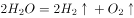
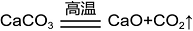

# 2022年国家公务员录用考试《行测》题（副省级网友回忆版）

> 常识判断 · 14 题 · 国考 2022

## 第 1 题　qid 4637179 · 人文常识

“七一勋章”获得者都来自人民，植根人民，是立足本职、默默奉献的平凡英雄，他们的事迹可学可做，他们的精神可追可及。以下“七一勋章”获得者与其先进事迹表述对应正确的是：

- **A**. 张桂梅——坚持志愿服务十余载，群众心中的“活雷锋”
- **B**. 王兰花——点亮贫困山区女孩梦想的“校长妈妈”
- **C**. 孙景坤——公而忘私，永葆革命本色的战斗功臣　✅
- **D**. 李宏塔——为国守海寸步不让，带领群众共同致富

**答案**：C

**官方解析**

本题考查政治常识。
A、B两项错误，张桂梅扎根贫困地区40余年，创办全国第一所全免费女子高中，帮助近2000名贫困山区女孩圆了大学梦，是点亮贫困山区女孩梦想的“校长妈妈”，先后荣获“全国脱贫攻坚楷模”“全国优秀共产党员”“全国先进工作者”等荣誉称号。王兰花，中共党员，她十多年如一日坚持志愿服务，带领“王兰花热心小组”先后为居民解决各类困难7000多件，调解各类民事纠纷600多起，开展公益活动7000多场次，推动宁夏吴忠市利通区的志愿者从最初7人发展到6.5万余人，是群众心中的“活雷锋”，先后荣获“全国三八红旗手标兵”“全国民族团结进步模范个人”等称号。
C项正确，孙景坤是永葆革命本色的战斗功臣，先后参加了四平、辽沈、平津、解放长沙、解放海南岛、抗美援朝等战役战争，荣立一等功一次、二等功多次，荣获“抗美援朝一级战士荣誉勋章”。退役后他回乡带领群众改变家乡面貌，是共产党员吃苦在前、公而忘私崇高品质的典范。
D项错误，李宏塔，安徽省政协原党组成员、副主席，第十一、十二届全国政协委员，他始终艰苦朴素、严于律己，在每个岗位上都践行党的根本宗旨，当好人民“勤务员”，树立了党员领导干部忠诚干净担当的典范。王书茂，中共党员，他先后参加多项国家重大涉海工作，在南海维权斗争中冲锋在前，不怕牺牲、寸步不让，坚决捍卫我国领海主权和海洋权益。此外他还带领群众造大船、闯深海，发展休闲渔业、建起海洋民宿，实现共同致富。荣获了“全国劳动模范”“改革先锋”等称号，是第十三届全国人大代表。
故正确答案为C。

---

## 第 2 题　qid 4637430 · 科技常识

根据《中华人民共和国国民经济和社会发展第十四个五年规划和2035年远景目标纲要》，下列不属于“十四五”规划重要目标的是：

- **A**. 保持制造业比重基本稳定，增强制造业竞争优势
- **B**. 优化提升供给结构，促进农业、制造业、服务业、能源资源等产业协调发展
- **C**. 健全农业支持保护制度，完善粮食主产区利益补偿机制
- **D**. 关键核心技术实现重大突破，进入创新型国家前列　✅

**答案**：D

**官方解析**

本题考查政治常识。
A项正确，《中华人民共和国国民经济和社会发展第十四个五年规划和2035年远景目标纲要》在第八章“深入实施制造强国战略”指出：“坚持自主可控、安全高效，推进产业基础高级化、产业链现代化，保持制造业比重基本稳定，增强制造业竞争优势，推动制造业高质量发展。”
B项正确，《中华人民共和国国民经济和社会发展第十四个五年规划和2035年远景目标纲要》在第十二章第一节“提升供给体系适配性”指出：“深化供给侧结构性改革，提高供给适应引领创造新需求能力。适应个性化、差异化、品质化消费需求，推动生产模式和产业组织方式创新，持续扩大优质消费品、中高端产品供给和教育、医疗、养老等服务供给，提升产品服务质量和客户满意度，推动供需协调匹配。优化提升供给结构，促进农业、制造业、服务业、能源资源等产业协调发展。”
C项正确，《中华人民共和国国民经济和社会发展第十四个五年规划和2035年远景目标纲要》第二十五章第二节“加强农业农村发展要素保障”指出：“健全农业农村投入保障制度，加大中央财政转移支付、土地出让收入、地方政府债券支持农业农村力度。健全农业支持保护制度，完善粮食主产区利益补偿机制，构建新型农业补贴政策体系，完善粮食最低收购价政策。”
D项错误，《中华人民共和国国民经济和社会发展第十四个五年规划和2035年远景目标纲要》在第三章第一节“2035年远景目标”指出：“展望2035年，我国将基本实现社会主义现代化。经济实力、科技实力、综合国力将大幅跃升，经济总量和城乡居民人均收入将再迈上新的大台阶，关键核心技术实现重大突破，进入创新型国家前列。”可知，“关键核心技术实现重大突破，进入创新型国家前列”是2035年远景目标，不属于“十四五”规划重要目标。
本题为选非题，故正确答案为D。

---

## 第 3 题　qid 4637186 · 法律常识

《中华人民共和国宪法》（1982年）实施以来，先后五次以修正案的形式进行了修改。下列宪法条款与宪法修正案对应正确的是：

- **A**. 公民的合法的私有财产不受侵犯——1993年宪法修正案
- **B**. 农村集体经济组织实行家庭承包经营为基础、统分结合的双层经营体制——2004年宪法修正案
- **C**. 国家尊重和保障人权——1999年宪法修正案
- **D**. 中国共产党领导是中国特色社会主义最本质的特征——2018年宪法修正案　✅

**答案**：D

**官方解析**

本题考查法律常识。
A项错误，2004年宪法修正案将第十三条改为：公民的合法的私有财产不受侵犯。国家依照法律规定保护公民的私有财产权和继承权。国家为了公共利益的需要，可以依照法律规定对公民的私有财产实行征收或者征用并给予补偿。
B项错误，1999年宪法修正案将第八条第一款改为：农村集体经济组织实行家庭承包经营为基础、统分结合的双层经营体制······
C项错误，2004年宪法修正案将第三十三条改为：凡具有中华人民共和国国籍的人都是中华人民共和国公民。中华人民共和国公民在法律面前一律平等。国家尊重和保障人权。任何公民享有宪法和法律规定的权利，同时必须履行宪法和法律规定的义务。
D项正确，2018年宪法修正案将第一条改为：中华人民共和国是工人阶级领导的、以工农联盟为基础的人民民主专政的社会主义国家。社会主义制度是中华人民共和国的根本制度。中国共产党领导是中国特色社会主义最本质的特征。禁止任何组织或者个人破坏社会主义制度。
故正确答案为D。

---

## 第 4 题　qid 4637432 · 法律常识

根据《中华人民共和国公职人员政务处分法》，下列哪一处分不恰当？

- **A**. 甲系某行政主管部门公务员，犯故意伤害罪被判处有期徒刑六个月，缓刑一年，被撤职　✅
- **B**. 乙系交通运输部门公务员，交通肇事犯罪情节轻微，检察机关对其作出不起诉决定，乙被撤职
- **C**. 丙系某国有企业管理人员，犯盗窃罪被单处罚金，被撤职
- **D**. 丁系某公办高校事业编管理人员，犯侵占罪但被免予刑事处罚，被撤职

**答案**：A

**官方解析**

本题考查法律常识。
根据《中华人民共和国公职人员政务处分法》第十四条规定：“公职人员犯罪，有下列情形之一的，予以开除：（一）因故意犯罪被判处管制、拘役或者有期徒刑以上刑罚（含宣告缓刑）的；（二）因过失犯罪被判处有期徒刑，刑期超过三年的；（三）因犯罪被单处或者并处剥夺政治权利的。因过失犯罪被判处管制、拘役或者三年以下有期徒刑的，一般应当予以开除；案件情况特殊，予以撤职更为适当的，可以不予开除，但是应当报请上一级机关批准。公职人员因犯罪被单处罚金，或者犯罪情节轻微，人民检察院依法作出不起诉决定或者人民法院依法免予刑事处罚的，予以撤职；造成不良影响的，予以开除。”
A项错误，甲因故意犯罪被判处有期徒刑以上，应予以开除，而非撤职。
B项正确，乙交通肇事犯罪情节轻微，检察院对其不起诉，予以撤职符合上述规定。
C项正确，丙犯盗窃罪被单处罚金，予以撤职符合上述规定。
D项正确，丁虽为故意犯罪，但人民法院依法免予刑事处罚，予以撤职符合上述规定。
本题为选非题，故正确答案为A。

---

## 第 5 题　qid 4639315 · 人文常识

2021年4月27日，国务院常务会议上确定了知识产权领域“放管服”改革新举措。下列与之相关的说法错误的是：

- **A**. 进一步压缩商标、专利审查周期，推行商标电子注册证
- **B**. 提高知识产权质量，增加对商标和专利申请阶段的资助和奖励　✅
- **C**. 确保数据安全基础上，开放知识产权基础数据，助力企业研发创新
- **D**. 加强知识产权全链条保护，依法打击违法违规代理和商标恶意注册行为

**答案**：B

**官方解析**

本题考查政治常识。
2021年4月27日，国务院总理李克强主持召开国务院常务会议，部署加强县域商业体系建设，促进流通畅通和农民收入、农村消费双提升；确定知识产权领域“放管服”改革新举措，更大便利创业创新，激发市场主体创造活力；部署做好“五一”假期疫情防控和安全生产等工作。会议指出，要持续深化知识产权领域“放管服”改革，更大激发创新动力和活力。
A项正确，会议确定，进一步压缩商标、专利审查周期。今年底前将一般情形商标注册周期由8个月压缩至7个月。推进专利优先审查和质押登记电子申请全程网办，推行商标电子注册证和专利电子证书，明显压缩发明专利和电子申请的商标变更续展审查周期。在商标和专利质押登记、专业代理机构执业许可等审批中推行告知承诺制。
B项错误，会议确定，促进提高知识产权质量。纠正片面追求数量的倾向，不得直接将专利申请、授权数量作为享受奖励或资质资格评定政策的主要条件，全面取消对商标和专利申请阶段的资助和奖励，着力营造潜心研究氛围，促进多出基础性、原创性成果。
C项正确，会议确定，在确保数据安全基础上，开放知识产权基础数据，助力企业研发创新。
D项正确，会议确定，加强知识产权全链条保护，依法打击违法违规代理和商标恶意注册、非正常专利申请行为。
本题为选非题，故正确答案为B。

---

## 第 6 题　qid 4637182 · 人文常识

下列毛泽东诗词与创作背景对应正确的是：

- **A**. 金沙水拍云崖暖，大渡桥横铁索寒——1930年第一次反“围剿”
- **B**. 宜将剩勇追穷寇，不可沽名学霸王——1949年解放南京　✅
- **C**. 军叫工农革命，旗号镰刀斧头。匡庐一带不停留，要向潇湘直进——1948年淮海战役
- **D**. 三十八年过去，弹指一挥间。可上九天揽月，可下五洋捉鳖，谈笑凯歌还——1941年延安整风运动

**答案**：B

**官方解析**

本题考查人文常识。
A项错误，诗句出自毛泽东同志1935年创作的《七律·长征》。1934年第五次反“围剿”失败，中国共产党被迫进行战略转移，红军开始了二万五千里长征。在1935年10月长征即将胜利时，毛主席心潮澎湃写下了《七律·长征》一诗，回顾了长征的过程。其中“金沙水拍云崖暖，大渡桥横铁索寒”反映的是长征途中红军巧渡金沙江、强渡大渡河、飞夺泸定桥的历史事件。
B项正确，诗句出自毛泽东同志1949年创作的《七律·人民解放军占领南京》。1949年4月20日，全面内战已进入尾声，国民党军队全线溃败，拒绝在和平协定上签字。4月21日，毛泽东和朱德发出《向全国进军的命令》，号令全军坚决、彻底、干净、全部地歼灭中国境内一切敢于抵抗的国民党反动派，解放全中国。当夜，中国人民解放军百万雄师在东起江苏江阴、西至江西湖口的一千余里的战线上分三路强渡长江。23日晚，东路陈毅的第三野战军占领南京。毛泽东听到这个消息后欢欣鼓舞，写下了这首诗。
C项错误，该句词出自毛泽东同志1927年创作的《西江月·秋收起义》。1927年9月，毛主席以中央特派员的身份，回到湘赣边界领导了秋收起义。起义后几天，当时革命正处在异常艰苦的关头，毛主席激情满怀地写下了《西江月·秋收起义》一词。“军叫工农革命，旗号镰刀斧头。匡庐一带不停留，要向潇湘直进”是词作上阙部分，描写了起义军声势浩大的局面，体现了工农革命军的坚决态度。
D项错误，该句词出自毛泽东同志1965年创作的《水调歌头·重上井冈山》。1965年5月，毛主席重上井冈山，回顾自1927年上井冈山开辟工农武装割据道路起，中国的革命历程，他感慨良多，写下了《水调歌头·重上井冈山》一词。他希望的“可上九天揽月，可下五洋捉鳖”如今都已实现，即奋斗者号潜入马里亚纳海沟探寻深度和生物，嫦娥五号顺利从月球带回样品。
故正确答案为B。

---

## 第 7 题　qid 4637433 · 科技常识

关于我国近年来取得的重大科技成就，下列说法错误的是：

- **A**. “郭守敬望远镜”开创大规模光谱巡天，其光谱获取率全球最高
- **B**. “深海一号”在马里亚纳海沟成功坐底，创造了中国载人深潜纪录　✅
- **C**. 中国散裂中子源就像“超级显微镜”，可探测物质微观结构
- **D**. “天问一号”任务在我国航天发展史上首次实现地外行星软着陆

**答案**：B

**官方解析**

本题考查科技常识。
A项正确，郭守敬望远镜（LAMOST）是一架由我国科学家自主创新设计、在技术上极具挑战性的大视场兼备大口径的新型光学天文望远镜，即“王-苏反射施密特望远镜”。作为国家重大科技基础设施之一，LAMOST在国际上首先发展了在一块镜面上同时实现几十块薄镜面的拼接和曲面形状的连续变化的主动光学技术，以及新的数千根光纤的快速定位技术，从而成为全球光学天文望远镜的一个里程碑。LAMOST在科学上开创了大规模的光谱巡天，成为目前世界上光谱获取率最高的望远镜，具有“光谱之王”的美誉。
B项错误，2020年11月10日，我国自主研发的“奋斗者”号载人潜水器，在马里亚纳海沟，成功坐底深度10909米，再创我国载人深潜的新纪录。“深海一号”有两种含义，（1）“深海一号”是中国首艘载人潜水器支持母船，2017年9月16日在武汉开工建造；（2）“深海一号”是由我国自主研发建造的全球首座10万吨级深水半潜式生产储油平台。2021年6月25日，该平台正式投产，标志着中国从装备技术到勘探开发能力全面实现从300米到1500米超深水的跨越。
C项正确，中国散裂中子源位于中国广东省东莞市境内，是中国国家“十一五”期间重点建设的十二大科学装置之首。中国散裂中子源可以探测微观物质结构，如散裂中子源优异的脉冲时间特性和高通量的超热中子有利于研究有机高分子体系中磁、热、电、光等物性与微观结构的关系等。
D项正确，天问一号任务成功是中国航天事业自主创新，跨越发展的标志性成就。在中国航天发展史上，天问一号任务实现了6个首次，一是首次实现地火转移轨道探测器发射；二是首次实现行星际飞行；三是首次实现地外行星软着陆；四是首次实现地外行星表面巡视探测；五是首次实现4亿公里距离的测控通信；六是首次获取第一手的火星科学数据。
本题为选非题，故正确答案为B。

---

## 第 8 题　qid 4639323 · 科技常识

目前新冠病毒疫苗研发主要集中在5条技术路线，涵盖灭活疫苗、重组蛋白疫苗、腺病毒载体疫苗、减毒流感病毒载体疫苗和核酸疫苗。下列有关说法错误的是：

- **A**. 灭活疫苗的成分和天然的病毒结构相似
- **B**. 重组蛋白疫苗利用了基因工程技术
- **C**. 腺病毒载体疫苗可以采取单针免疫
- **D**. 核酸疫苗可以在常温下运输和存储　✅

**答案**：D

**官方解析**

本题考查科技常识。
A项正确，灭活病毒疫苗的研发工艺主要是通过在细胞基质上对病毒进行培养，然后用物理或化学方法将具有感染性的病毒杀死，但同时保持其抗原颗粒的完整性，使其失去致病力而保留抗原性。灭活新冠疫苗的特点是与天然病毒结构接近，安全性也是可控的，注射后人体的免疫应答反应较强。
B项正确，重组蛋白疫苗是将某种病毒的目的抗原基因构建在表达载体上，将已构建的表达蛋白载体转化到细菌、酵母或哺乳动物或昆虫细胞中，在一定的诱导条件下，表达出大量的抗原蛋白，通过纯化后制备的疫苗。在生产过程中，采用基因工程技术构建工程细胞株，重组表达抗原蛋白的疫苗，具有靶点明确、针对性强的特点。
C项正确，腺病毒载体可以采取单针接种方式。腺病毒载体新冠疫苗的原理是将新冠病毒的刺突糖蛋白（S蛋白）基因重组到复制缺陷型的人5型腺病毒基因内，基因重组腺病毒在体内表达新冠病毒S蛋白抗原，诱导机体产生免疫应答。腺病毒载体新冠疫苗注射一针14天左右预防有效率能达到60%以上。
D项错误，核酸疫苗也被称为基因疫苗，是将致病原特定抗原的基因遗传物质直接导入人体细胞中，让人体细胞生产这些抗原，并刺激机体产生对该抗原的免疫应答，从而使接种者获得相应的免疫保护。核酸疫苗从生产到使用过程中要保持低温，以确保疫苗效用。
本题为选非题，故正确答案为D。

---

## 第 9 题　qid 4637554 · 人文常识

我国自古十分重视对人的品德的培养。下列有关“德”的表述与出处对应错误的是：

- **A**. 大德不逾闲，小德出入可也——《论语》
- **B**. 富有之谓大业，日新之谓盛德——《周易》
- **C**. 所求于己者多，故德行立——《管子》
- **D**. 道生之，德畜之，物形之，势成之——《庄子》　✅

**答案**：D

**官方解析**

本题考查人文常识。
A项正确，“大德不逾闲，小德出入可也”出自《论语·子张》，意思是大的道德节操上不能逾越界限，在小节上有些出入是可以的。既体现了儒家思想的人性化，也体现了其原则性与权变性相结合的特点。
B项正确，“富有之谓大业，日新之谓盛德”出自《周易·系辞传上》，意思是实现包罗万象、无所不有，就可称之为伟大的事业；而日日更新、不断进步，就可称之为崇高的品德。《周易》是儒家经典之一，被誉为“群经之首，大道之源”。
C项正确，“所求于己者多，故德行立”出自《管子·君臣》，意思是严于律己的人，高尚的品德就树立起来了。《管子》是先秦时期各学派的言论汇编。
D项错误，“道生之，德畜之，物形之，势成之”出自《道德经》，意思是道生成万事万物，德养育万事万物。万事万物虽现出各种各样的形态，环境使万事万物成长起来。故此，万事万物莫不尊崇道而珍贵德。《道德经》又名《老子》，是春秋时期道家创始人老子的代表作，展现了老子的政治道德和哲学思想。《庄子》又名《南华真经》，是战国时期道家代表人物庄子的代表作，展现了其人生观和政治思想。
本题为选非题，故正确答案为D。

---

## 第 10 题　qid 4639332 · 科技常识

关于常见气体的工业制备方法，下列说法错误的是：

- **A**. 木炭和二氧化碳可以作为制备一氧化碳的原料
- **B**. 电解水时制备得到的氢气体积比氧气体积更大
- **C**. 通过低温液化的方法可以分离出沼气中的甲烷
- **D**. 高温煅烧石灰石制备二氧化碳属于复分解反应　✅

**答案**：D

**官方解析**

本题考查科技常识。

A项正确，在通常状况下，一氧化碳是无色、无臭、无味、难溶于水的气体。高温条件下，木炭粉和二氧化碳发生还原反应可以制得一氧化碳气体：。

B项正确，电解水通常是指含盐（如硫酸钠，食盐不可以，会生成氯气）的水经过电解之后所生成的产物，化学方程式为（通电），表示水通电后生成氢气和氧气。一个水分子是由两个氢原子和一个氧原子组成，所以得到氢气和氧气的体积比为2：1。

C项正确，沼气的主要成分是甲烷。低温条件下，沼气会冷凝成固态，加温后在未达到熔点的情况下，可以提取出甲烷。

D项错误，复分解反应是由两种化合物互相交换成分，生成另外两种化合物的反应。石灰石的主要成分为碳酸钙（），煅烧石灰石就是煅烧碳酸钙，而碳酸钙是不溶于水的碳酸盐，受热容易分解为对应的金属氧化物（氧化钙）和二氧化碳气体（化学方程式：），属于分解反应而非复分解反应。

本题为选非题，故正确答案为D。

---

## 第 11 题　qid 4637195 · 人文常识

下列哪一情形在历史上有可能发生？

- **A**. 秦朝时郑某升任西域都护，友人为他摆酒饯行
- **B**. 唐朝富商李某在女儿出嫁时陪送白瓷数十套　✅
- **C**. 西汉时张某担任市舶使，负责采购舶来品
- **D**. 明代官员王某请戏班演出京剧《白蛇传》

**答案**：B

**官方解析**

本题考查人文常识。
A项错误，西域都护是汉代在西域设立的最高军政长官，西域都护府是汉朝时期在西域（今新疆轮台）设置的管辖机构，其主要职责在于守境安土，协调西域各国间的矛盾和纠纷，制止外来势力的侵扰，维护西域地方的社会秩序，确保丝绸之路的畅通。因此，秦朝的郑某不可能升任西域都护。
B项正确，白瓷是传统瓷器分类（青瓷、黑瓷、白瓷、红瓷、蓝瓷、彩瓷等品种）中的一种，它一般是指瓷胎或化妆土为白色、表面施有一层薄而透明釉的瓷器。邢窑是中国最早的白瓷窑址，有中华白瓷鼻祖的美誉。邢窑创烧于北朝晚期，经过隋朝的飞速发展，到唐朝已达到鼎盛阶段。因此，唐朝的富商可能用白瓷做陪嫁品。
C项错误，市舶司在宋代出现，是中国在宋、元及明初在各海港设立的管理海上对外贸易的官府，是中国古代管理对外贸易的机关，相当于海关。而市舶司前身是市舶使，唐玄宗开元间（713年—741年），广州即设有市舶使，一般由宦官担任。西汉时期没有市舶使这一官职。
D项错误，京剧形成于清代乾隆年间。清代乾隆五十五年（1790年）起，原在南方演出的三庆、四喜、和春、春台四大徽班陆续进入北京，与来自湖北的汉调艺人合作，同时接受了昆曲、秦腔的部分剧目、曲调和表演方法，又吸收了一些地方民间曲调，通过不断交流、融合，最终形成京剧。在明代尚未形成京剧这一剧种。
故正确答案为B。

---

## 第 12 题　qid 4637548 · 科技常识

我国很多成语都与植物有关，下列有关说法错误的是：

- **A**. “投桃报李”中的“桃”和“李”属于同一科植物
- **B**. “藕断丝连”中藕丝的作用是为植物输送水和养分
- **C**. “望梅止渴”和“折梅寄远”中的“梅”分别是果梅和花梅
- **D**. “胸有成竹”中“竹”的年龄可以根据竹节的数量判断　✅

**答案**：D

**官方解析**

本题考查科技常识。
A项正确，“投桃报李”出自《诗经·大雅·抑》，桃是蔷薇科、桃属植物，落叶小乔木；李是蔷薇科、李属植物，落叶乔木。
B项正确，“藕断丝连”中的“丝”即藕丝，它是藕的导管壁增厚连续成螺旋状，形成的螺旋形导管，是输导组织，可以运输水分和无机盐（养分）。输导组织是植物体中担负物质长途运输的主要组织，其细胞呈管状并上下连接，形成一个连续的运输通道。
C项正确，梅花按应用可分为花梅和果梅，一般所说的梅花即指花梅，以观赏为栽培目的的梅花品种；果梅又名春梅、酸梅、乌梅，植物分类学上属于蔷薇科，李属，原产中国。“望梅止渴”意为眼望梅林，流出口水而解渴，这里的“梅”指果梅。“折梅寄远”意思是折一枝梅花送给远方的朋友，这里的“梅”指花梅，即梅花。
D项错误，竹又名竹子，品种繁多，为多年生禾本科竹亚科植物，茎多为木质，也有草本。竹笋（即幼竹）在土中生长阶段，经过顶端分生组织不断进行细胞分裂和分化，形成节、节间、节隔、笋箨、侧芽和居间分生组织，到出土前全笋（也是全株）的节数已定，出土后不再增加新节。一般通过观察竹子的叶片颜色来判断竹龄。
本题为选非题，故正确答案为D。

---

## 第 13 题　qid 4637184 · 科技常识

下列物理学家与名言对应错误的是：

- **A**. 费曼——没有人真正了解量子力学
- **B**. 麦克斯韦——电和磁的实验中最明显的现象是，处于彼此距离相当远的物体之间的相互作用
- **C**. 卢瑟福——固执于光的旧有理论的人们，最好是从它自身的原理出发，提出实验的说明　✅
- **D**. 牛顿——万有引力、电的相互作用和磁的相互作用，可以在很远的地方明显地表现出来，因此用肉眼就可以观察到

**答案**：C

**官方解析**

本题考查科技常识。

A项正确，理查德·菲利普斯·费曼，美籍犹太裔物理学家，加州理工学院物理学教授，1965年诺贝尔物理学奖得主。他提出了费曼图、费曼规则和重正化的计算方法，这是研究量子电动力学和粒子物理学不可缺少的工具。1964年的11月，费曼在康奈尔大学开展的系列讲座“物理定律的本性”中提到了“没有人真正了解量子力学”的名言。

B项正确，詹姆斯·克拉克·麦克斯韦，英国物理学家、数学家，经典电动力学的创始人，统计物理学的奠基人之一。“电和磁的实验中最明显的现象是，处于彼此距离相当远的物体之间的相互作用。因此，把这些现象化为科学的第一步就是，确定物体之间作用力的大小和方向”这句话是由麦克斯韦提出的。

C项错误，欧内斯特·卢瑟福是英国著名物理学家，知名的原子核物理学之父。1911年，卢瑟福根据粒子散射实验现象提出原子核式结构模型。该实验被评为“物理最美实验”之一。1919年，卢瑟福做了用粒子轰击氮核的实验。“固执于光的旧有理论的人们，最好是从它自身的原理出发，提出实验的说明。并且，如果他的这种努力失败的话，他应该承认这些事实”这句话是由托马斯·杨提出的。托马斯·杨是英国医生、物理学家，光的波动说的奠基人之一。

D项正确，艾萨克·牛顿，英国皇家学会会长，英国著名的物理学家、数学家，百科全书式的“全才”，著有《自然哲学的数学原理》《光学》。“万有引力、电的相互作用和磁的相互作用，可以在很远的地方明显地表现出来，因此用肉眼就可以观察到；但也许存在另一些相互作用力，他们的距离如此之小，以至无法观察”这句话是由牛顿提出的。

本题为选非题，故正确答案为C。

---

## 第 14 题　qid 4637196 · 科技常识

下列与急救有关的说法正确的是：

- **A**. 误服氨水者应该立即进行洗胃或催吐
- **B**. 农药沾染皮肤中毒可立即用热水擦洗
- **C**. 误食强酸可以立即口服氢氧化铝凝胶　✅
- **D**. 烧伤时应立即饮用大量凉水补充体液

**答案**：C

**官方解析**

本题考查科技常识。
A项错误，氨水是无色透明液体，有强烈的刺激性气味，极易挥发出氨气，浓氨水对呼吸道和皮肤有刺激作用，并能损伤中枢神经系统，具有弱碱性。误服氨水者应立即漱口，口服稀释的醋或柠檬汁，并及时就医。切不可催吐，也不能洗胃，防止发生食道和胃穿孔。
B项错误，农药进入人体的主要途径有三条：皮肤、消化道和呼吸道。大部分农药都可以通过完好的皮肤吸收，而且吸收后在皮肤表面不留任何痕迹，生产和使用农药时发生了农药中毒，要尽快将中毒病人脱离污染的现场至阴凉通风的场所，同时立即脱去病人被污染的衣物，用肥皂水或流动清水反复清洗被污染的皮肤、毛发等部位，并及时就医。不可用热水清洗，因为热水会使皮肤温度升高，毛孔扩张，可能会加速农药的溶解和吸收。
C项正确，误食强酸可以引起食道灼伤，导致食管粘膜损伤或者坏死、狭窄，甚至危及生命。如果误食强酸，可以口服3％-4％氢氧化铝凝胶60ml，或者0.17％的氢氧化钙200ml。如果在家找不到上述药物，可服用鸡蛋清或牛奶60ml，或者植物油100ml，以保护食管及胃黏膜。
D项错误，烧伤时应少量多次饮用凉水以补充体液，因为烧伤后的病人身体虚弱，一次性大量喝水可能会导致水肿。如果有条件，一升水中外加半汤匙盐，或者加半勺小苏打效果更好，因为烧伤后病人流失的体液除了水还包括一些电解质（如钠离子、氯离子等无机盐），所以喝一些淡盐水更好。
故正确答案为C。

---
