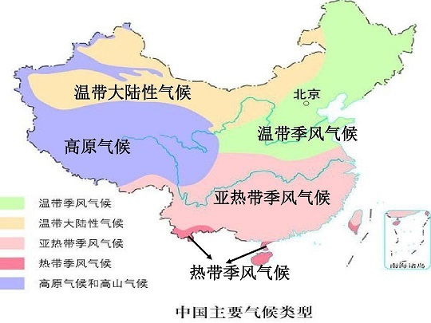

# 2022年国家公务员录用考试《行测》题（行政执法卷网友回忆版）

> 常识判断 · 15 题 · 国考 2022

## 第 1 题　qid 4637179 · 人文常识

“七一勋章”获得者都来自人民，植根人民，是立足本职、默默奉献的平凡英雄，他们的事迹可学可做，他们的精神可追可及。以下“七一勋章”获得者与其先进事迹表述对应正确的是：

- **A**. 张桂梅——坚持志愿服务十余载，群众心中的“活雷锋”
- **B**. 王兰花——点亮贫困山区女孩梦想的“校长妈妈”
- **C**. 孙景坤——公而忘私，永葆革命本色的战斗功臣　✅
- **D**. 李宏塔——为国守海寸步不让，带领群众共同致富

**答案**：C

**官方解析**

本题考查政治常识。
A、B两项错误，张桂梅扎根贫困地区40余年，创办全国第一所全免费女子高中，帮助近2000名贫困山区女孩圆了大学梦，是点亮贫困山区女孩梦想的“校长妈妈”，先后荣获“全国脱贫攻坚楷模”“全国优秀共产党员”“全国先进工作者”等荣誉称号。王兰花，中共党员，她十多年如一日坚持志愿服务，带领“王兰花热心小组”先后为居民解决各类困难7000多件，调解各类民事纠纷600多起，开展公益活动7000多场次，推动宁夏吴忠市利通区的志愿者从最初7人发展到6.5万余人，是群众心中的“活雷锋”，先后荣获“全国三八红旗手标兵”“全国民族团结进步模范个人”等称号。
C项正确，孙景坤是永葆革命本色的战斗功臣，先后参加了四平、辽沈、平津、解放长沙、解放海南岛、抗美援朝等战役战争，荣立一等功一次、二等功多次，荣获“抗美援朝一级战士荣誉勋章”。退役后他回乡带领群众改变家乡面貌，是共产党员吃苦在前、公而忘私崇高品质的典范。
D项错误，李宏塔，安徽省政协原党组成员、副主席，第十一、十二届全国政协委员，他始终艰苦朴素、严于律己，在每个岗位上都践行党的根本宗旨，当好人民“勤务员”，树立了党员领导干部忠诚干净担当的典范。王书茂，中共党员，他先后参加多项国家重大涉海工作，在南海维权斗争中冲锋在前，不怕牺牲、寸步不让，坚决捍卫我国领海主权和海洋权益。此外他还带领群众造大船、闯深海，发展休闲渔业、建起海洋民宿，实现共同致富。荣获了“全国劳动模范”“改革先锋”等称号，是第十三届全国人大代表。
故正确答案为C。

---

## 第 2 题　qid 4637186 · 法律常识

《中华人民共和国宪法》（1982年）实施以来，先后五次以修正案的形式进行了修改。下列宪法条款与宪法修正案对应正确的是：

- **A**. 公民的合法的私有财产不受侵犯——1993年宪法修正案
- **B**. 农村集体经济组织实行家庭承包经营为基础、统分结合的双层经营体制——2004年宪法修正案
- **C**. 国家尊重和保障人权——1999年宪法修正案
- **D**. 中国共产党领导是中国特色社会主义最本质的特征——2018年宪法修正案　✅

**答案**：D

**官方解析**

本题考查法律常识。
A项错误，2004年宪法修正案将第十三条改为：公民的合法的私有财产不受侵犯。国家依照法律规定保护公民的私有财产权和继承权。国家为了公共利益的需要，可以依照法律规定对公民的私有财产实行征收或者征用并给予补偿。
B项错误，1999年宪法修正案将第八条第一款改为：农村集体经济组织实行家庭承包经营为基础、统分结合的双层经营体制······
C项错误，2004年宪法修正案将第三十三条改为：凡具有中华人民共和国国籍的人都是中华人民共和国公民。中华人民共和国公民在法律面前一律平等。国家尊重和保障人权。任何公民享有宪法和法律规定的权利，同时必须履行宪法和法律规定的义务。
D项正确，2018年宪法修正案将第一条改为：中华人民共和国是工人阶级领导的、以工农联盟为基础的人民民主专政的社会主义国家。社会主义制度是中华人民共和国的根本制度。中国共产党领导是中国特色社会主义最本质的特征。禁止任何组织或者个人破坏社会主义制度。
故正确答案为D。

---

## 第 3 题　qid 4637187 · 法律常识

新修订的《中华人民共和国行政处罚法》自2021年7月15日起施行。依据该法，下列说法正确的是：

- **A**. 行政机关拟作出降低资质等级的处罚之前，应当组织听证
- **B**. 法律、行政法规对违法行为未作出行政处罚规定的，地方性法规可补充设定　✅
- **C**. 行政机关可以在其法定权限内书面委托其他组织或个人实施行政处罚
- **D**. 对当事人依法给予一百元以上罚款的，执法人员不得当场收缴

**答案**：B

**官方解析**

本题考查法律常识。
A项错误，根据《中华人民共和国行政处罚法》第六十三条第一款规定：“行政机关拟作出下列行政处罚决定，应当告知当事人有要求听证的权利，当事人要求听证的，行政机关应当组织听证：（一）较大数额罚款；（二）没收较大数额违法所得、没收较大价值非法财物；（三）降低资质等级、吊销许可证件；（四）责令停产停业、责令关闭、限制从业；（五）其他较重的行政处罚；（六）法律、法规、规章规定的其他情形。”
B项正确，根据《中华人民共和国行政处罚法》第十二条第三款规定：“法律、行政法规对违法行为未作出行政处罚规定，地方性法规为实施法律、行政法规，可以补充设定行政处罚。拟补充设定行政处罚的，应当通过听证会、论证会等形式广泛听取意见，并向制定机关作出书面说明。地方性法规报送备案时，应当说明补充设定行政处罚的情况。”
C项错误，根据《中华人民共和国行政处罚法》第二十条第一款规定：“行政机关依照法律、法规、规章的规定，可以在其法定权限内书面委托符合本法第二十一条规定条件的组织实施行政处罚。行政机关不得委托其他组织或者个人实施行政处罚。”
D项错误，根据《中华人民共和国行政处罚法》第六十八条规定：“依照本法第五十一条的规定当场作出行政处罚决定，有下列情形之一，执法人员可以当场收缴罚款：（一）依法给予一百元以下罚款的；（二）不当场收缴事后难以执行的。”第六十九条规定：“在边远、水上、交通不便地区，行政机关及其执法人员依照本法第五十一条、第五十七条的规定作出罚款决定后，当事人到指定的银行或者通过电子支付系统缴纳罚款确有困难，经当事人提出，行政机关及其执法人员可以当场收缴罚款。”故对当事人依法给予一百元以上罚款，但符合以上情况的，执法人员也可以当场收缴罚款。
故正确答案为B。

---

## 第 4 题　qid 4637189 · 法律常识

新修订的《中华人民共和国安全生产法》自2021年9月1日起施行。依据该法，下列说法正确的是：

- **A**. 应急管理部门对安全生产进行监督管理，其他行业主管部门无监管职责
- **B**. 生产经营单位分管生产的负责人是本单位安全生产第一责任人
- **C**. 安全生产违法行为导致重大事故损害公益的，人民检察院及有关公益组织可提起公益诉讼
- **D**. 生产安全事故情节特别严重、影响特别恶劣的，罚款额最高可达一亿元　✅

**答案**：D

**官方解析**

本题考查法律常识。
A项错误，根据《中华人民共和国安全生产法》第十条规定：“国务院应急管理部门依照本法，对全国安全生产工作实施综合监督管理；县级以上地方各级人民政府应急管理部门依照本法，对本行政区域内安全生产工作实施综合监督管理。国务院交通运输、住房和城乡建设、水利、民航等有关部门依照本法和其他有关法律、行政法规的规定，在各自的职责范围内对有关行业、领域的安全生产工作实施监督管理；县级以上地方各级人民政府有关部门依照本法和其他有关法律、法规的规定，在各自的职责范围内对有关行业、领域的安全生产工作实施监督管理。对新兴行业、领域的安全生产监督管理职责不明确的，由县级以上地方各级人民政府按照业务相近的原则确定监督管理部门。应急管理部门和对有关行业、领域的安全生产工作实施监督管理的部门，统称负有安全生产监督管理职责的部门。负有安全生产监督管理职责的部门应当相互配合、齐抓共管、信息共享、资源共用，依法加强安全生产监督管理工作。”可知，应急管理部门对安全生产工作实施综合监督管理，交通运输、住房和城乡建设、水利、民航等其他行业主管部门在各自的职责范围内实施监督管理。
B项错误，根据《中华人民共和国安全生产法》第五条规定：“生产经营单位的主要负责人是本单位安全生产第一责任人，对本单位的安全生产工作全面负责。其他负责人对职责范围内的安全生产工作负责。”由此可知，生产经营单位分管生产的负责人对职责范围内的安全生产工作负责。
C项错误，根据《中华人民共和国安全生产法》第七十四条第二款规定：“因安全生产违法行为造成重大事故隐患或者导致重大事故，致使国家利益或者社会公共利益受到侵害的，人民检察院可以根据民事诉讼法、行政诉讼法的相关规定提起公益诉讼。”
D项正确，根据《中华人民共和国安全生产法》第一百一十四条规定：“发生生产安全事故，对负有责任的生产经营单位除要求其依法承担相应的赔偿等责任外，由应急管理部门依照下列规定处以罚款：（一）发生一般事故的，处三十万元以上一百万元以下的罚款；（二）发生较大事故的，处一百万元以上二百万元以下的罚款；（三）发生重大事故的，处二百万元以上一千万元以下的罚款；（四）发生特别重大事故的，处一千万元以上二千万元以下的罚款。发生生产安全事故，情节特别严重、影响特别恶劣的，应急管理部门可以按照前款罚款数额的二倍以上五倍以下对负有责任的生产经营单位处以罚款。”由此可知，生产安全事故情节特别严重、影响特别恶劣的，应急管理部门最高可以按照二千万元的五倍处以罚款，即罚款额最高可达一亿元。
故正确答案为D。

---

## 第 5 题　qid 4637190 · 法律常识

《中华人民共和国数据安全法》自2021年9月1日起施行。依据该法，下列说法错误的是（    ）。

- **A**. 国家工业和信息化主管部门负责国家数据安全工作的决策和议事协调　✅
- **B**. 省级以上人民政府应当将数字经济发展纳入本级国民经济和社会发展规划
- **C**. 国家建立数据分类分级保护制度，对数据实行分类分级保护
- **D**. 从事数据交易中介服务的机构提供服务，应当要求数据提供方说明数据来源

**答案**：A

**官方解析**

本题考查法律常识。
A项错误，根据《中华人民共和国数据安全法》第五条规定：“中央国家安全领导机构负责国家数据安全工作的决策和议事协调，研究制定、指导实施国家数据安全战略和有关重大方针政策，统筹协调国家数据安全的重大事项和重要工作，建立国家数据安全工作协调机制。”
B项正确，根据《中华人民共和国数据安全法》第十四条规定：“国家实施大数据战略，推进数据基础设施建设，鼓励和支持数据在各行业、各领域的创新应用。省级以上人民政府应当将数字经济发展纳入本级国民经济和社会发展规划，并根据需要制定数字经济发展规划。”
C项正确，根据《中华人民共和国数据安全法》第二十一条规定：“国家建立数据分类分级保护制度，根据数据在经济社会发展中的重要程度，以及一旦遭到篡改、破坏、泄露或者非法获取、非法利用，对国家安全、公共利益或者个人、组织合法权益造成的危害程度，对数据实行分类分级保护。国家数据安全工作协调机制统筹协调有关部门制定重要数据目录，加强对重要数据的保护。关系国家安全、国民经济命脉、重要民生、重大公共利益等数据属于国家核心数据，实行更加严格的管理制度。各地区、各部门应当按照数据分类分级保护制度，确定本地区、本部门以及相关行业、领域的重要数据具体目录，对列入目录的数据进行重点保护。”
D项正确，根据《中华人民共和国数据安全法》第三十三条规定：“从事数据交易中介服务的机构提供服务，应当要求数据提供方说明数据来源，审核交易双方的身份，并留存审核、交易记录。”
本题为选非题，故正确答案为A。

---

## 第 6 题　qid 4637192 · 人文常识

下列甲乙丙丁的行为构成利用影响力受贿罪的是（    ）。

- **A**. 甲为某生态环境局副局长，某项目经理王某为减轻环境行政罚款向其行贿5万元，后甲向下属监察大队负责人打招呼撤销罚款决定
- **B**. 乙为某市场监督管理局局长，某项目经理张某为减轻国土资源行政罚款向其行贿5万元，后乙向自然资源局领导打招呼望撤销罚款决定
- **C**. 丙为某税务局公务员，其夫为教育局局长，丙收受李某5万元并通过其夫职权解决李某小孩跨区入学问题，其夫不知情　✅
- **D**. 丁为某教育局局长，其妻为私企员工，私下收受刘某5万元并通过其夫职权解决刘某小孩跨区入学问题，丁知情后未反对

**答案**：C

**官方解析**

本题考查法律常识。
根据《刑法》第三百八十八条规定：“国家工作人员利用本人职权或者地位形成的便利条件，通过其他国家工作人员职务上的行为，为请托人谋取不正当利益，索取请托人财物或者收受请托人财物的，以受贿论处。”第三百八十八条之一规定：“国家工作人员的近亲属或者其他与该国家工作人员关系密切的人，通过该国家工作人员职务上的行为，或者利用该国家工作人员职权或者地位形成的便利条件，通过其他国家工作人员职务上的行为，为请托人谋取不正当利益，索取请托人财物或者收受请托人财物，数额较大或者有其他较重情节的，处三年以下有期徒刑或者拘役，并处罚金；数额巨大或者有其他严重情节的，处三年以上七年以下有期徒刑，并处罚金；数额特别巨大或者有其他特别严重情节的，处七年以上有期徒刑，并处罚金或者没收财产。离职的国家工作人员或者其近亲属以及其他与其关系密切的人，利用该离职的国家工作人员原职权或者地位形成的便利条件实施前款行为的，依照前款的规定定罪处罚。”第三百八十八条之一是关于利用影响力受贿罪的规定。
A项错误，甲为某生态环境局副局长，是国家工作人员，其利用本人职权形成的便利条件，通过其他国家工作人员职务上的行为，为请托人王某谋取不正当利益，打招呼撤销罚款决定，收受5万元贿赂，构成受贿罪。
B项错误，乙为某市场监督管理局局长，是国家工作人员，其利用本人职权形成的便利条件，通过其他国家工作人员职务上的行为，为请托人张某谋取不正当利益，打招呼撤销罚款决定，收受5万元贿赂，构成受贿罪。
C项正确，丙系教育局局长之妻，属于国家工作人员的近亲属，利用其夫的职务便利，收取了李某钱款5万元，为请托人谋取不正当利益，解决李某小孩跨区入学问题，构成利用影响力受贿罪。
D项错误，丁为某教育局局长，其妻利用其教育局局长的职权，收取了刘某钱款5万元，解决刘某小孩跨区入学问题，为请托人谋取不正当利益。虽然是丁的妻子收取的钱款，但丁知情未反对，属于事后收受贿赂的情形，构成受贿罪。
故正确答案为C。

---

## 第 7 题　qid 4637193 · 人文常识

甲乙丙丁4人发起设立某商贸股份有限公司，并租赁了1处办公场所。在公司设立过程中，甲由于疏忽忘关水龙头致办公场所被淹，给办公场所业主戊造成5万元损失。公司设立后，业主戊向公司索赔。下列说法正确的是（    ）。

- **A**. 因公司已设立，5万元损失由公司承担即可
- **B**. 因系发起人责任，5万元损失由发起人共同承担
- **C**. 因在公司设立过程中产生损失，5万元由公司和发起人共同承担
- **D**. 公司可以先行向业主戊赔偿，再向甲追赔　✅

**答案**：D

**官方解析**

本题考查法律常识。
D项正确，A、B、C三项错误，根据《最高人民法院关于适用&lt;中华人民共和国公司法&gt;若干问题的规定（三）》第二条规定：“发起人为设立公司以自己名义对外签订合同，合同相对人请求该发起人承担合同责任的，人民法院应予支持；公司成立后合同相对人请求公司承担合同责任的，人民法院应予支持。”《公司法》第九十四条规定：“股份有限公司的发起人应当承担下列责任：（一）公司不能成立时，对设立行为所产生的债务和费用负连带责任；（二）公司不能成立时，对认股人已缴纳的股款，负返还股款并加算银行同期存款利息的连带责任；（三）在公司设立过程中，由于发起人的过失致使公司利益受到损害的，应当对公司承担赔偿责任。”本题中，甲乙丙丁4人在公司设立过程中租赁了1处办公场所，公司成立后，业主戊可以向该公司要求赔偿。但由于甲的疏忽过失导致办公场所被淹，因此甲应当对公司承担赔偿责任。
故正确答案为D。

---

## 第 8 题　qid 4637194 · 法律常识

下列做法符合《中华人民共和国乡村振兴促进法》的是：

- **A**. 某县政府为培育良种，划定一块永久基本农田作为重要农产品生产保护区　✅
- **B**. 某省政府严控农用地转为建设用地，不限制耕地转为林地
- **C**. 某市政府为了方便规模经营，对农用地未分类而进行统一管理
- **D**. 某乡政府遵循法定程序撤并村庄，要求涉及的农民无条件配合

**答案**：A

**官方解析**

本题考查法律常识。
A项正确，B、C两项错误，根据《中华人民共和国乡村振兴促进法》第十四条规定：“国家建立农用地分类管理制度，严格保护耕地，严格控制农用地转为建设用地，严格控制耕地转为林地、园地等其他类型农用地。省、自治区、直辖市人民政府应当采取措施确保耕地总量不减少、质量有提高。国家实行永久基本农田保护制度，建设粮食生产功能区、重要农产品生产保护区，建设并保护高标准农田。地方各级人民政府应当推进农村土地整理和农用地科学安全利用，加强农田水利等基础设施建设，改善农业生产条件。”
D项错误，根据《中华人民共和国乡村振兴促进法》第五十一条规定：“县级人民政府和乡镇人民政府应当优化本行政区域内乡村发展布局，按照尊重农民意愿、方便群众生产生活、保持乡村功能和特色的原则，因地制宜安排村庄布局，依法编制村庄规划，分类有序推进村庄建设，严格规范村庄撤并，严禁违背农民意愿、违反法定程序撤并村庄。”故某乡政府遵循法定程序对村庄进行撤并的同时严禁违背农民意愿。
故正确答案为A。

---

## 第 9 题　qid 4637181 · 经济常识

下列经济现象或做法符合经济学常理的是：

- **A**. 中央银行增加外汇储备引起货币供应量减少
- **B**. 通货紧缩时期政府减少在社会福利方面的支出
- **C**. 政府通过降低税率、减少税收，抑制通货膨胀
- **D**. 流动性过剩时中央银行在金融市场上出售国债　✅

**答案**：D

**官方解析**

本题考查经济常识。
A项错误，外汇储备又称为外汇存底，指为了应付国际支付的需要，各国的中央银行及其他政府机构所集中掌握并可以随时兑换成外国货币的外汇资产。中央银行增加外汇储备时，为了维持外汇市场的稳定，必须发行更多的本国货币，致使国内货币的基础供应量增加，容易形成并加重国内通货膨胀的局面。
B项错误，通货紧缩是指流通中的货币量少于实际需要的货币量，从而引起的货币升值和物价普遍持续下跌的经济现象，其实质是社会总需求小于社会总供给。通货紧缩时期，市场上流通的货币量较少，此时政府应增加在社会福利方面的支出，从而刺激需求、拉动经济，以达到供需平衡的状态。
C项错误，通货膨胀是指流通中的货币量超过实际需要的货币量，从而引起的货币贬值和物价水平全面而持续上涨的经济现象，其实质是社会总需求大于社会总供给。政府作为财政政策的主体，在抑制通货膨胀时，应提高税率增加税收，减少人均可支配收入，促使流通中的货币量减少。
D项正确，流动性过剩又称为资金周转过度，即有过多的货币投放量，这些多余的资金需要寻找投资出路，于是就有了投资或经济过热的现象以及通货膨胀的危险。流动性过剩时需要紧缩银根，中央银行将其持有的资产如国债出售，可以回收市场上多余的资金，从而达到紧缩流动性的目的。
故正确答案为D。

---

## 第 10 题　qid 4637182 · 人文常识

下列毛泽东诗词与创作背景对应正确的是：

- **A**. 金沙水拍云崖暖，大渡桥横铁索寒——1930年第一次反“围剿”
- **B**. 宜将剩勇追穷寇，不可沽名学霸王——1949年解放南京　✅
- **C**. 军叫工农革命，旗号镰刀斧头。匡庐一带不停留，要向潇湘直进——1948年淮海战役
- **D**. 三十八年过去，弹指一挥间。可上九天揽月，可下五洋捉鳖，谈笑凯歌还——1941年延安整风运动

**答案**：B

**官方解析**

本题考查人文常识。
A项错误，诗句出自毛泽东同志1935年创作的《七律·长征》。1934年第五次反“围剿”失败，中国共产党被迫进行战略转移，红军开始了二万五千里长征。在1935年10月长征即将胜利时，毛主席心潮澎湃写下了《七律·长征》一诗，回顾了长征的过程。其中“金沙水拍云崖暖，大渡桥横铁索寒”反映的是长征途中红军巧渡金沙江、强渡大渡河、飞夺泸定桥的历史事件。
B项正确，诗句出自毛泽东同志1949年创作的《七律·人民解放军占领南京》。1949年4月20日，全面内战已进入尾声，国民党军队全线溃败，拒绝在和平协定上签字。4月21日，毛泽东和朱德发出《向全国进军的命令》，号令全军坚决、彻底、干净、全部地歼灭中国境内一切敢于抵抗的国民党反动派，解放全中国。当夜，中国人民解放军百万雄师在东起江苏江阴、西至江西湖口的一千余里的战线上分三路强渡长江。23日晚，东路陈毅的第三野战军占领南京。毛泽东听到这个消息后欢欣鼓舞，写下了这首诗。
C项错误，该句词出自毛泽东同志1927年创作的《西江月·秋收起义》。1927年9月，毛主席以中央特派员的身份，回到湘赣边界领导了秋收起义。起义后几天，当时革命正处在异常艰苦的关头，毛主席激情满怀地写下了《西江月·秋收起义》一词。“军叫工农革命，旗号镰刀斧头。匡庐一带不停留，要向潇湘直进”是词作上阙部分，描写了起义军声势浩大的局面，体现了工农革命军的坚决态度。
D项错误，该句词出自毛泽东同志1965年创作的《水调歌头·重上井冈山》。1965年5月，毛主席重上井冈山，回顾自1927年上井冈山开辟工农武装割据道路起，中国的革命历程，他感慨良多，写下了《水调歌头·重上井冈山》一词。他希望的“可上九天揽月，可下五洋捉鳖”如今都已实现，即奋斗者号潜入马里亚纳海沟探寻深度和生物，嫦娥五号顺利从月球带回样品。
故正确答案为B。

---

## 第 11 题　qid 4637188 · 科技常识

关于我国航天事业，下列说法正确的是：

- **A**. 所有发射任务都是长征系列火箭承担的
- **B**. 我国第一颗地球同步轨道卫星是在文昌发射
- **C**. 航天员搭乘“神舟十二号”首次进入我国自己的空间站　✅
- **D**. “实践十三号”是用于监测国土资源的卫星

**答案**：C

**官方解析**

本题考查科技常识。
A项错误，长征系列运载火箭，是中国航天的主力运载火箭，承担了我国绝大部分的发射任务，比如搭载神舟十三号载人飞船的长征二号F遥十三运载火箭。除此之外，我国还有“快舟”一号等其他火箭。“快舟”一号固体运载火箭是我国首个“星箭一体化”设计的小型固体运载火箭，具有快速集成、快速入轨等特点。主要应用于自然灾害突发和通信系统发生故障时，实现卫星的快速发射和空间部署，及时获取灾害情况信息，以最大限度地减少灾害损失并组织抗灾救灾。
B项错误，1984年4月8日，我国在西昌卫星发射中心用长征三号运载火箭成功将东方红二号第二颗试验通信卫星准确送入预定轨道。4月17日，卫星成功开通通信、电视传输。此次发射标志着中国成为世界上第五个能独立研制和发射静止轨道卫星（地球同步卫星）的国家，第三个掌握先进低温火箭技术的国家。而文昌卫星发射中心是2009年始建，2016年首次使用。
C项正确，2021年6月17日，搭载神舟十二号载人飞船的长征二号F遥十二运载火箭，在酒泉卫星发射中心点火发射，顺利将聂海胜、刘伯明、汤洪波3名航天员送入太空，飞行乘组状态良好，发射取得圆满成功。神舟十二号载人飞行任务是空间站关键技术验证阶段第四次飞行任务，也是空间站阶段首次载人飞行任务，是我国航天员首次进入我国自己的空间站。
D项错误，2017年4月12日，我国在西昌卫星发射中心用长征三号乙运载火箭成功发射实践十三号卫星。实践十三号卫星是我国首颗高通量通信卫星，也是我国技术试验和示范应用成功结合的典范，对于促进我国通信卫星技术及产业的跨越发展具有重要里程碑意义。2018年1月23日，中国首颗高通量通信卫星实践十三号在轨交付，正式投入使用。资源卫星是专门用于探测和研究地球资源的卫星，可分陆地资源卫星和海洋资源卫星，一般都采用太阳同步轨道。比如我国的资源一号卫星、资源三号卫星。
故正确答案为C。

---

## 第 12 题　qid 4637191 · 地理国情

我国一直致力于改善生态环境，在长期不懈的治理之下，陕西榆林以北的毛乌素沙漠正在消失。关于毛乌素沙漠，下列说法正确的是：

- **A**. 治理之前毛乌素沙漠是我国最大的沙漠
- **B**. 毛乌素沙漠地区属于温带大陆性气候　✅
- **C**. 治理毛乌素沙漠适合种植耐酸性植物
- **D**. 毛乌素沙漠在“三北”防护林体系范围之外

**答案**：B

**官方解析**

本题考查地理国情。

A项错误，塔克拉玛干沙漠位于新疆南疆的塔里木盆地中心，是中国最大的沙漠，面积约为33万平方公里。毛乌素沙漠面积约为4.22万平方公里。

B项正确，如图所示，我国温带季风气候与温带大陆性气候的分界线：大兴安岭——阴山——贺兰山——祁连山——巴颜喀拉山一线。毛乌素沙漠位于陕西省榆林市长城一线以北，属于温带大陆性气候。

C项错误，治理毛乌素沙漠适合种植耐盐性植物，沙漠中的地下水往往都是高浓度的盐水，并且在沙漠土壤当中也含有大量盐分，所以最适合的植物是耐盐性的，避免因干涸而死。

D项错误，“三北”防护林工程是指在中国三北地区（西北、华北和东北）建设的大型人工林业生态工程。毛乌素沙漠位于陕西省榆林市长城一线以北，属于西北地区，在“三北”防护林体系范围之内。

故正确答案为B。

---

## 第 13 题　qid 4637184 · 科技常识

下列物理学家与名言对应错误的是：

- **A**. 费曼——没有人真正了解量子力学
- **B**. 麦克斯韦——电和磁的实验中最明显的现象是，处于彼此距离相当远的物体之间的相互作用
- **C**. 卢瑟福——固执于光的旧有理论的人们，最好是从它自身的原理出发，提出实验的说明　✅
- **D**. 牛顿——万有引力、电的相互作用和磁的相互作用，可以在很远的地方明显地表现出来，因此用肉眼就可以观察到

**答案**：C

**官方解析**

本题考查科技常识。

A项正确，理查德·菲利普斯·费曼，美籍犹太裔物理学家，加州理工学院物理学教授，1965年诺贝尔物理学奖得主。他提出了费曼图、费曼规则和重正化的计算方法，这是研究量子电动力学和粒子物理学不可缺少的工具。1964年的11月，费曼在康奈尔大学开展的系列讲座“物理定律的本性”中提到了“没有人真正了解量子力学”的名言。

B项正确，詹姆斯·克拉克·麦克斯韦，英国物理学家、数学家，经典电动力学的创始人，统计物理学的奠基人之一。“电和磁的实验中最明显的现象是，处于彼此距离相当远的物体之间的相互作用。因此，把这些现象化为科学的第一步就是，确定物体之间作用力的大小和方向”这句话是由麦克斯韦提出的。

C项错误，欧内斯特·卢瑟福是英国著名物理学家，知名的原子核物理学之父。1911年，卢瑟福根据粒子散射实验现象提出原子核式结构模型。该实验被评为“物理最美实验”之一。1919年，卢瑟福做了用粒子轰击氮核的实验。“固执于光的旧有理论的人们，最好是从它自身的原理出发，提出实验的说明。并且，如果他的这种努力失败的话，他应该承认这些事实”这句话是由托马斯·杨提出的。托马斯·杨是英国医生、物理学家，光的波动说的奠基人之一。

D项正确，艾萨克·牛顿，英国皇家学会会长，英国著名的物理学家、数学家，百科全书式的“全才”，著有《自然哲学的数学原理》《光学》。“万有引力、电的相互作用和磁的相互作用，可以在很远的地方明显地表现出来，因此用肉眼就可以观察到；但也许存在另一些相互作用力，他们的距离如此之小，以至无法观察”这句话是由牛顿提出的。

本题为选非题，故正确答案为C。

---

## 第 14 题　qid 4637195 · 人文常识

下列哪一情形在历史上有可能发生？

- **A**. 秦朝时郑某升任西域都护，友人为他摆酒饯行
- **B**. 唐朝富商李某在女儿出嫁时陪送白瓷数十套　✅
- **C**. 西汉时张某担任市舶使，负责采购舶来品
- **D**. 明代官员王某请戏班演出京剧《白蛇传》

**答案**：B

**官方解析**

本题考查人文常识。
A项错误，西域都护是汉代在西域设立的最高军政长官，西域都护府是汉朝时期在西域（今新疆轮台）设置的管辖机构，其主要职责在于守境安土，协调西域各国间的矛盾和纠纷，制止外来势力的侵扰，维护西域地方的社会秩序，确保丝绸之路的畅通。因此，秦朝的郑某不可能升任西域都护。
B项正确，白瓷是传统瓷器分类（青瓷、黑瓷、白瓷、红瓷、蓝瓷、彩瓷等品种）中的一种，它一般是指瓷胎或化妆土为白色、表面施有一层薄而透明釉的瓷器。邢窑是中国最早的白瓷窑址，有中华白瓷鼻祖的美誉。邢窑创烧于北朝晚期，经过隋朝的飞速发展，到唐朝已达到鼎盛阶段。因此，唐朝的富商可能用白瓷做陪嫁品。
C项错误，市舶司在宋代出现，是中国在宋、元及明初在各海港设立的管理海上对外贸易的官府，是中国古代管理对外贸易的机关，相当于海关。而市舶司前身是市舶使，唐玄宗开元间（713年—741年），广州即设有市舶使，一般由宦官担任。西汉时期没有市舶使这一官职。
D项错误，京剧形成于清代乾隆年间。清代乾隆五十五年（1790年）起，原在南方演出的三庆、四喜、和春、春台四大徽班陆续进入北京，与来自湖北的汉调艺人合作，同时接受了昆曲、秦腔的部分剧目、曲调和表演方法，又吸收了一些地方民间曲调，通过不断交流、融合，最终形成京剧。在明代尚未形成京剧这一剧种。
故正确答案为B。

---

## 第 15 题　qid 4637196 · 科技常识

下列与急救有关的说法正确的是：

- **A**. 误服氨水者应该立即进行洗胃或催吐
- **B**. 农药沾染皮肤中毒可立即用热水擦洗
- **C**. 误食强酸可以立即口服氢氧化铝凝胶　✅
- **D**. 烧伤时应立即饮用大量凉水补充体液

**答案**：C

**官方解析**

本题考查科技常识。
A项错误，氨水是无色透明液体，有强烈的刺激性气味，极易挥发出氨气，浓氨水对呼吸道和皮肤有刺激作用，并能损伤中枢神经系统，具有弱碱性。误服氨水者应立即漱口，口服稀释的醋或柠檬汁，并及时就医。切不可催吐，也不能洗胃，防止发生食道和胃穿孔。
B项错误，农药进入人体的主要途径有三条：皮肤、消化道和呼吸道。大部分农药都可以通过完好的皮肤吸收，而且吸收后在皮肤表面不留任何痕迹，生产和使用农药时发生了农药中毒，要尽快将中毒病人脱离污染的现场至阴凉通风的场所，同时立即脱去病人被污染的衣物，用肥皂水或流动清水反复清洗被污染的皮肤、毛发等部位，并及时就医。不可用热水清洗，因为热水会使皮肤温度升高，毛孔扩张，可能会加速农药的溶解和吸收。
C项正确，误食强酸可以引起食道灼伤，导致食管粘膜损伤或者坏死、狭窄，甚至危及生命。如果误食强酸，可以口服3％-4％氢氧化铝凝胶60ml，或者0.17％的氢氧化钙200ml。如果在家找不到上述药物，可服用鸡蛋清或牛奶60ml，或者植物油100ml，以保护食管及胃黏膜。
D项错误，烧伤时应少量多次饮用凉水以补充体液，因为烧伤后的病人身体虚弱，一次性大量喝水可能会导致水肿。如果有条件，一升水中外加半汤匙盐，或者加半勺小苏打效果更好，因为烧伤后病人流失的体液除了水还包括一些电解质（如钠离子、氯离子等无机盐），所以喝一些淡盐水更好。
故正确答案为C。

---
