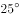

# 2022年天津市公务员录用考试《行测》试题（网友回忆版）

> 常识判断 · 8 题 · 天津 2022

## 第 1 题　qid 5102643 · 科技常识

2021年，《中共中央 国务院关于完整准确全面贯彻新发展理念做好碳达峰碳中和工作的意见》发布。根据此意见，关于我国碳达峰碳中和工作的主要目标，下列说法错误的是（    ）。

- **A**. 到2025年，森林蓄积量达到180亿立方米
- **B**. 到2030年，二氧化碳排放量达到峰值并实现稳中有降
- **C**. 到2035年，绿色低碳循环发展的经济体系初步形成　✅
- **D**. 到2060年，非化石能源消费比重达到80%以上

**答案**：C

**官方解析**

本题考查政治常识。
A项正确，C项错误，《中共中央 国务院关于完整准确全面贯彻新发展理念做好碳达峰碳中和工作的意见》在“二、主要目标”部分指出：“到2025年，绿色低碳循环发展的经济体系初步形成，重点行业能源利用效率大幅提升。单位国内生产总值能耗比2020年下降13.5%；单位国内生产总值二氧化碳排放比2020年下降18%；非化石能源消费比重达到20%左右；森林覆盖率达到24.1%，森林蓄积量达到180亿立方米，为实现碳达峰、碳中和奠定坚实基础。”
B项正确，《中共中央 国务院关于完整准确全面贯彻新发展理念做好碳达峰碳中和工作的意见》在“二、主要目标”部分指出：“到2030年，经济社会发展全面绿色转型取得显著成效，重点耗能行业能源利用效率达到国际先进水平。单位国内生产总值能耗大幅下降；单位国内生产总值二氧化碳排放比2005年下降65%以上；非化石能源消费比重达到25%左右，风电、太阳能发电总装机容量达到12亿千瓦以上；森林覆盖率达到25%左右，森林蓄积量达到190亿立方米，二氧化碳排放量达到峰值并实现稳中有降。”
D项正确，《中共中央 国务院关于完整准确全面贯彻新发展理念做好碳达峰碳中和工作的意见》在“二、主要目标”部分指出：“到2060年，绿色低碳循环发展的经济体系和清洁低碳安全高效的能源体系全面建立，能源利用效率达到国际先进水平，非化石能源消费比重达到80%以上，碳中和目标顺利实现，生态文明建设取得丰硕成果，开创人与自然和谐共生新境界。”
本题为选非题，故正确答案为C。

---

## 第 2 题　qid 5102592 · 法律常识

关于我国国家机构，下列说法正确的是：

- **A**. 全国人大和全国人大常委会之间是领导和被领导的关系　✅
- **B**. 全国人大常委会有权修改国务院制定的同宪法相抵触的行政法规
- **C**. 我国军委主席有任期限制，需对全国人大及其常委会负责
- **D**. 我国的上下级检察院之间是监督与被监督的关系

**答案**：A

**官方解析**

本题考查法律常识。
A项正确，根据《宪法》第五十七条规定：“中华人民共和国全国人民代表大会是最高国家权力机关。它的常设机关是全国人民代表大会常务委员会。”第六十九条规定：“全国人民代表大会常务委员会对全国人民代表大会负责并报告工作。”因此，全国人大和全国人大常委会之间是领导和被领导的关系。
B项错误，根据《宪法》第六十七条第七项规定：“全国人民代表大会常务委员会行使下列职权：（七）撤销国务院制定的同宪法、法律相抵触的行政法规、决定和命令。”全国人大常委会有权撤销国务院制定的同宪法相抵触的行政法规，但无权修改。
C项错误，根据《宪法》第九十三条第四款规定：“中央军事委员会每届任期同全国人民代表大会每届任期相同。”第九十四条规定：“中央军事委员会主席对全国人民代表大会和全国人民代表大会常务委员会负责。”因此，中央军委主席没有任期限制。
D项错误，根据《宪法》第一百三十七条第二款规定：“最高人民检察院领导地方各级人民检察院和专门人民检察院的工作，上级人民检察院领导下级人民检察院的工作。”
故正确答案为A。

---

## 第 3 题　qid 5102647 · 人文常识

下列学习数学的情形中，最不可能出现的是：

- **A**. 战国时期学生在背诵“九九乘法表”
- **B**. 东汉时期出现了介绍勾股定理的书
- **C**. 秦朝时期人们用负数表示零下温度　✅
- **D**. 隋唐时期老师在课堂上教学圆周率

**答案**：C

**官方解析**

本题考查人文常识。
A项正确，九九乘法表是数学中的乘法口诀，别名有九九歌，产生年代是春秋战国。在当时的许多著作中，已经引用部分乘法口诀。最初的九九歌是以“九九八十一”起到“二二如四”止，共36句口诀。所以战国时期学生背诵“九九乘法表”的情形可能出现。
B项正确，周朝时期商高提出了“勾三股四弦五”的勾股定理的特例。编写于公元前一世纪以前的《周髀算经》中记录着商高的一段话：“······故折矩，勾广三，股修四，经隅五。”意为：当直角三角形的两条直角边分别为3（勾）和4（股）时，经隅（弦）则为5。以后人们就简单地把这个事实说成“勾三股四弦五”，根据该典故称勾股定理为商高定理。所以东汉时可能出现介绍勾股定理的书。
C项错误，从史料来看，中国人很早就确立了寒、冷、温、热的“温度”概念，先秦时期观察“瓶中之冰”、南朝已使用“腋下温度”，还通过“火候”“物候”来测定超高温、预测未来气温趋势等。但中国古人没有定量的温度标度概念，只有相对固定的“基准点”，比如体温。古人测量温度更多是通过对比，天冷的时候对比水面是否结冰，常温天对比体温，更高的温度，则是观察火候带来的颜色变化。所以秦朝时期人们用负数这种具体数字来表示温度的情形不可能出现。
D项正确，约成书于公元前1世纪的《周髀算经》中即有“径一而周三”的记载。公元263年，中国数学家刘徽用“割圆术”计算圆周率。世界上第一个将圆周率精确到小数点后7位的人是中国南北朝时期的数学家祖冲之。所以隋唐时期老师在课堂上教学圆周率的情形可能出现。
本题为选非题，故正确答案为C。

---

## 第 4 题　qid 5102683 · 地理国情

下列不同气候区和景观的对应错误的是：

- **A**. 热带草原气候——纺锤树
- **B**. 热带雨林气候——板状根
- **C**. 热带沙漠气候——海市蜃楼
- **D**. 亚热带季风气候——硬叶常绿林　✅

**答案**：D

**官方解析**

本题考查地理国情。

A项正确，热带草原气候全年气温高，年平均气温约，且分明显干季和湿季，其自然景观为热带稀树草原。纺锤树是热带稀树草原上的典型植物，其主要生长在南美洲的巴西高原上，是一种身材高大、体形别致的树木。

B项正确，热带雨林气候主要分布在赤道两侧南北纬之间，终年高温多雨，季节分配均匀，无干旱期。板状根是一种热带木本植物所特有的板状不定根，也是热带雨林气候下的一种特殊生态现象。

C项正确，热带沙漠气候分布在南北回归线至南北纬之间的大陆内部或大陆西岸，其特点为年平均气温高，年温差较大，日温差更大，降水稀少。海市蜃楼是一种光学幻景，是地球上物体反射的光经大气折射和全反射而形成的虚像。多发生于热带沙漠气候地区，夏天沙漠下层空气温度比上层高，密度比上层小，故当沙质或石质地表热空气上升，使得光线发生折射作用，于是就产生了海市蜃楼。

D项错误，亚热带季风气候夏热冬温，四季分明，季风发达，主要分布在亚热带大陆东岸，纬度-之间。硬叶常绿林是指在地中海气候下发育的一种常绿乔木或灌木植被类型。

本题为选非题，故正确答案为D。

---

## 第 5 题　qid 5102603 · 人文常识

关于太阳系相关常识，下列说法错误的是：

- **A**. 彗星的尾巴主要是灰尘和气体
- **B**. 太阳是太阳系中最强的电磁波辐射源
- **C**. 1个天文单位的距离为地球和太阳之间的平均距离
- **D**. 类木行星和类地行星主要区别在公转周期的长短　✅

**答案**：D

**官方解析**

本题考查科技常识。
A项正确，彗星是指进入太阳系内亮度和形状会随日距变化而变化的绕日运动的天体，分为彗核、彗发、彗尾三部分。彗核是彗星最中心、最本质、最主要的部分，一般认为是固体，由石块、铁、尘埃及氨、甲烷、冰块组成。彗尾被认为是由气体和尘埃组成。彗发是彗核周围由气体和尘埃组成星球状的雾状物。
B项正确，太阳辐射是指太阳以电磁波的形式向外传递能量，太阳是太阳系中最强的电磁波辐射源，也是唯一常态化发出可见光的天体。
C项正确，天文单位是天文学中计量天体之间距离的一种单位，1个天文单位指的是太阳到地球的平均距离，以A.U.表示，其数值为1.5亿千米。
D项错误，类地行星是以硅酸盐石作为主要成分的行星，体积小，密度大，自转慢、卫星少，属于类地行星的有水星、金星、地球、火星；类木行星主要由氢、氦、冰、氨、甲烷等物质组成，体积大、密度低，自转相当快、卫星较多，还有由碎石、冰块或气尘组成的环系。属于类木行星的有木星、土星、天王星、海王星。因此类木行星和类地行星主要区别在主要成分不同。
本题为选非题，故正确答案为D。

---

## 第 6 题　qid 5102653 · 科技常识

关于金属和人类健康，下列说法错误的是：

- **A**. 长期使用铝制食品容器更容易导致脑损伤
- **B**. 钾、钠离子维持着人体内细胞内外渗透压平衡
- **C**. 铁是人体中许多酶的激活剂，能促进新陈代谢
- **D**. 锌能参与血红蛋白的合成，维持红细胞代谢　✅

**答案**：D

**官方解析**

本题考查科技常识。
A项正确，长期使用铝制食品容器，可能导致过量的铝元素进入人体。铝元素是一种慢性的、蓄积性的毒素，若长期摄入人体的铝“超标”，铝元素会沉积在大脑、肺脏、骨骼和睾丸等组织中，会影响磷、钙代谢以及阻滞神经递质传导，引起脑萎缩、神经元变形，甚至造成儿童智力发育缓慢、阿尔茨海默病等。
B项正确，钾是细胞内的主要阳离子，能维持细胞内液的渗透压和体液的酸碱平衡，参与细胞内糖和蛋白质的代谢。钠是人体中一种重要的无机元素，是细胞外液中的主要阳离子，能够参与水的代谢，保证体内水的平衡，调节体内水分与渗透压。
C项正确，铁是人体必需的微量元素，是血红蛋白的重要组成部分，在血液中参与氧的输送。铁是许多酶的组成成分和氧化还原反应酶的激活剂，能促进人体的新陈代谢。
D项错误，人体内的铁元素参与血红蛋白的合成，是合成血红蛋白的原料。血红蛋白的合成是由原卟啉和亚铁离子结合成血红素，血红素再结合珠蛋白生成血红蛋白。锌具有维持人体正常食欲、增强人体免疫力、帮助生长发育、智力发育的生理功能，锌是调节基因表达即调节DNA复制、转译和转录的DNA聚合酶的必需组成部分。
本题为选非题，故正确答案为D。

---

## 第 7 题　qid 5102686 · 科技常识

下列与物理学相关的说法正确的是：

- **A**. 高山上压强小，煮水易沸腾　✅
- **B**. 声波是以磁场的形式传播的
- **C**. 红外线的穿透性可用于灭菌
- **D**. 太阳的亮度与观察方向有关

**答案**：A

**官方解析**

本题考查科技常识。
A项正确，水的沸点与气压有关，气压增大，沸点升高；气压减小，沸点降低。高山上的空气稀薄，大气压强有所降低，水的沸点会低于平原地区，所以水一般不到100摄氏度就会沸腾了。
B项错误，声音是以声波的形式传播的，发声体产生的振动在空气或其他物质中的传播叫做声波，声波借助各种介质向四面八方传播。磁场是指传递实物间磁力作用的场，磁体间的相互作用以磁场作为媒介，声波与磁场无关。
C项错误，红外线是频率介于微波与可见光之间的电磁波，一般利用红外线的穿透性制成医用红外线仪，其作用于治疗部位，直接使肌肉和皮下组织产生热效应，从而加速血液循环、增加新陈代谢、缓解疼痛，而不是用于灭菌。紫外线具有杀菌作用，医院里的病房会利用紫外线消毒灭菌。
D项错误，恒星的亮度由其温度和表面积决定，温度愈高光度愈大，表面积愈大光度也愈大，太阳是位于太阳系中心的恒星，其采用核聚变的方式不断向太空各方向释放光和热，太阳亮度与观察方向无关。
故正确答案为A。

---

## 第 8 题　qid 5102589 · 科技常识

关于信息传递，下列说法错误的是：

- **A**. 互联网通信中的IP协议应用于网络层
- **B**. 光纤通信是将电信号和光信号进行转换
- **C**. 微波通信具有建设周期短但建设费用高的特点　✅
- **D**. 抗震救灾时卫星通信是一种非常可靠的通信手段

**答案**：C

**官方解析**

本题考查科技常识。
A项正确，IP指网际互连协议，是TCP/IP体系中的网络层协议。设计IP的目的是提高网络的可扩展性：一是解决互联网问题，实现大规模、异构网络的互联互通；二是分割顶层网络应用和底层网络技术之间的耦合关系，以利于两者的独立发展。 
B项正确，光纤即为光导纤维的简称，光纤通信是以光波作为信息载体，以光纤作为传输媒介的一种通信方式。光纤通信的原理是：在发送端首先要把传送的信息（如话音）变成电信号，然后调制到激光器发出的激光束上，使光的强度随电信号的幅度（频率）变化而变化，并通过光纤发送出去；在接收端，检测器收到光信号后把它变换成电信号，经解调后恢复原信息。
C项错误，微波通信是使用波长在0.1毫米至1米之间的电磁波，即微波进行的通信。微波通信具有传输容量大、长途传输质量稳定、投资少、建设周期短、维护方便、建设费用低等特点，得到了广泛的应用。 
D项正确，卫星通信简单地说就是地球上（包括地面和低层大气中）的无线电通信站间利用卫星作为中继而进行的通信。卫星通信的特点是：通信范围大；只要在卫星发射的电波所覆盖的范围内，从任何两点之间都可进行通信；不易受陆地灾害的影响（可靠性高）；只要设置地球站电路即可开通（开通电路迅速）；同时可在多处接收，能经济地实现广播、多址通信（多址特点）；电路设置非常灵活，可随时分散过于集中的话务量；同一信道可用于不同方向或不同区间（多址联接）。 
本题为选非题，故正确答案为C。

---
