# 2022年广东省公务员录用考试《行测》题（乡镇卷）（网友回忆版）

> 常识判断 · 40 题 · 广东 2022

## 第 1 题　qid 4673098 · 人文常识

党的十八大以来，我们深化对民主政治发展规律的认识，提出（    ）的重大理念，其不仅有完整的制度程序，而且有完整的参与实践。

- **A**. 全方位人民民主
- **B**. 全链条人民民主
- **C**. 全过程人民民主　✅
- **D**. 全覆盖人民民主

**答案**：C

**官方解析**

本题考查政治常识。
C项正确，A、B、D三项错误，2021年10月13日至14日中央人大工作会议在北京召开。中共中央总书记、国家主席、中央军委主席习近平出席会议并发表重要讲话指出，“党的十八大以来，我们深化对民主政治发展规律的认识，提出全过程人民民主的重大理念。我国全过程人民民主不仅有完整的制度程序，而且有完整的参与实践。我国全过程人民民主实现了过程民主和成果民主、程序民主和实质民主、直接民主和间接民主、人民民主和国家意志相统一，是全链条、全方位、全覆盖的民主，是最广泛、最真实、最管用的社会主义民主。我们要继续推进全过程人民民主建设，把人民当家作主具体地、现实地体现到党治国理政的政策措施上来，具体地、现实地体现到党和国家机关各个方面各个层级工作上来，具体地、现实地体现到实现人民对美好生活向往的工作上来。”
故正确答案为C。

---

## 第 2 题　qid 4673241 · 人文常识

基层治理是国家治理的基石，在打造基层治理共同体中，基层群众性自治组织发挥的是：

- **A**. 主导作用
- **B**. 决定作用
- **C**. 引领作用
- **D**. 基础作用　✅

**答案**：D

**官方解析**

本题考查政治常识。
D项正确，A、B、C三项均错误，《中共中央 国务院关于加强和完善城乡社区治理的意见》的“二、健全完善城乡社区治理体系”中指出：“注重发挥基层群众性自治组织基础作用。进一步加强基层群众性自治组织规范化建设，合理确定其管辖范围和规模。促进基层群众自治与网格化服务管理有效衔接。加快工矿企业所在地、国有农（林）场、城市新建住宅区、流动人口聚居地的社区居民委员会组建工作······”
故正确答案为D。

---

## 第 3 题　qid 4673101 · 人文常识

《中共中央关于党的百年奋斗重大成就和历史经验的决议》阐明了四个历史时期党面临的主要任务，以下关于各个历史时期党面临的主要任务表述正确的是（    ）。

- **A**. 新民主主义革命时期——继续探索中国建设社会主义的正确道路，解放和发展社会生产力，使人民摆脱贫困、尽快富裕起来，为实现中华民族伟大复兴提供充满新的活力的体制保证和快速发展的物质条件
- **B**. 社会主义革命和建设时期——反对帝国主义、封建主义、官僚资本主义，争取民族独立、人民解放，为实现中华民族伟大复兴创造根本社会条件
- **C**. 改革开放和社会主义现代化建设新时期——实现从新民主主义到社会主义的转变，进行社会主义革命，推进社会主义建设，为实现中华民族伟大复兴奠定根本政治前提和制度基础
- **D**. 中国特色社会主义新时代——实现第一个百年奋斗目标，开启实现第二个百年奋斗目标新征程，朝着实现中华民族伟大复兴的宏伟目标继续前进　✅

**答案**：D

**官方解析**

本题考查政治常识。
2021年11月11日，中国共产党第十九届中央委员会第六次全体会议通过《中共中央关于党的百年奋斗重大成就和历史经验的决议》（以下简称《决议》）。
A项错误，《决议》指出：“新民主主义革命时期，党面临的主要任务是，反对帝国主义、封建主义、官僚资本主义，争取民族独立、人民解放，为实现中华民族伟大复兴创造根本社会条件。”
B项错误，《决议》指出：“社会主义革命和建设时期，党面临的主要任务是，实现从新民主主义到社会主义的转变，进行社会主义革命，推进社会主义建设，为实现中华民族伟大复兴奠定根本政治前提和制度基础。”
C项错误，《决议》指出：“改革开放和社会主义现代化建设新时期，党面临的主要任务是，继续探索中国建设社会主义的正确道路，解放和发展社会生产力，使人民摆脱贫困、尽快富裕起来，为实现中华民族伟大复兴提供充满新的活力的体制保证和快速发展的物质条件。”
D项正确，《决议》指出：“党的十八大以来，中国特色社会主义进入新时代。党面临的主要任务是，实现第一个百年奋斗目标，开启实现第二个百年奋斗目标新征程，朝着实现中华民族伟大复兴的宏伟目标继续前进。”
故正确答案为D。

---

## 第 4 题　qid 4673105 · 人文常识

近年来，我国在“大国重器”的研发上成果显著，捷报频传。以下关于“大国重器”与其宣传语的对应关系不正确的是（    ）。

- **A**. “奋斗者号”——只有沉得下去，才能浮得上来
- **B**. “复兴号”——暂时地降落是为了下一次更好地起飞　✅
- **C**. “北斗三号”——其实，方向比方法更重要
- **D**. “中国天眼”——要仰望星空，也要脚踏实地

**答案**：B

**官方解析**

本题考查科技常识。
A项正确，“奋斗者号”是中国研发的万米载人潜水器。2020年11月10日，“奋斗者号”在马里亚纳海沟成功坐底，坐底深度10909米，刷新中国载人深潜的新纪录。2020年11月28日，习近平致信祝贺“奋斗者号“全海深载人潜水器成功完成万米海试并胜利返航。2021年3月16日，“奋斗者号”全海深载人潜水器在三亚正式交付，2021年10月，“奋斗者号“已在马里亚纳海沟正式投入常规科考应用。与宣传语中的“沉”、“浮”对应。
B项错误，新一代标准高速动车组“复兴号”是中国自主研发、具有完全知识产权的新一代高速列车，它集成了大量现代国产高新技术，牵引、制动、网络、转向架、轮轴等关键技术实现重要突破，是中国科技创新的又一重大成果。与宣传语中的“降落”、“起飞”无关。
C项正确，“北斗三号”全球卫星导航系统由24颗中圆地球轨道卫星、3颗地球静止轨道卫星和3颗倾斜地球同步轨道卫星，共30颗卫星组成，是我国自主建设运行的全球卫星导航系统。2020年6月23日，“北斗三号”最后一颗全球组网卫星在西昌卫星发射中心点火升空，2020年7月31日上午，“北斗三号”全球卫星导航系统建成暨开通仪式在北京举行。与宣传语中的“方向”对应。
D项正确，“中国天眼”即500米口径球面射电望远镜（FAST），位于中国贵州省黔南布依族苗族自治州境内，2020年1月11日，500米口径球面射电望远镜通过中国国家验收工作，并正式开放运行。500米口径球面射电望远镜作为一个多学科基础研究平台，可以观测暗物质和暗能量、发现脉冲星、有希望发现奇异星和夸克星物质、发现中子星——黑洞双星、还可能发现高红移的巨脉泽星系、寻找地外文明等等。与宣传语中的“仰望星空”对应。
本题为选非题，故正确答案为B。

---

## 第 5 题　qid 4673107 · 人文常识

在经济全球化时代，任何一个国家都不可能孤立于世界之外，团结合作是所有国家的必然选择，各国人民更需要同舟共济、共克时艰。
下列选项最符合该观点内涵的是（    ）。

- **A**. 人视水见形，视民知治不
- **B**. 孤举者难起，众行者易趋　✅
- **C**. 安而不忘危，存而不忘亡
- **D**. 天不言而四时行，地不语而百物生

**答案**：B

**官方解析**

本题考查政治常识。
题干中“任何一个国家都不可能孤立于世界之外，团结合作是所有国家的必然选择，各国人民更需要同舟共济、共克时艰”体现了联系的观点，强调要团结、合作。
A项错误，“人视水见形，视民知治不”出自《史记》，意思是人在水中可以照见自己的样子，在民众中可以看出政治治理的状况。体现的是唯物史观中的群众史观，强调人民群众是历史的主体。
B项正确，“孤举者难起，众行者易趋”出自魏源《默觚》，意思是一个人独自举起重物可能会很困难，但许多人一块行走则容易走快。体现了人多力量大，强调了团结、合作的重要性。
C项错误，“安而不忘危，存而不忘亡”出自《易传》，意思是君子在国家安定的时候要不忘危险，国家存在的时候要不忘败亡。体现的是对立统一规律，矛盾的双方相互转化。
D项错误，“天不言而四时行，地不语而百物生”出自李白《上安州裴长史书》的首句，意思是苍天闭口不言，却使四季不断运行；大地默默不语，却让万物蓬勃生长。说明天地之间万事万物都有其发展规律，人们要顺应自然的客观规律，按自然规律办事。
故正确答案为B。

---

## 第 6 题　qid 4673097 · 人文常识

马克思主义指引中国成功走上了全面建设社会主义现代化强国的康庄大道，事业越向前发展，新情况新问题势必越多，更应重视理论的作用，增强理论自信和战略定力。这主要体现了（    ）。

- **A**. 认识对实践有着巨大的指导作用　✅
- **B**. 一切从实际出发，实事求是
- **C**. 实践是检验真理的唯一标准
- **D**. 认识是主体对客体的能动反映

**答案**：A

**官方解析**

本题考查政治常识。
A项正确，马克思主义指引中国成功走上了全面建设社会主义现代化强国的康庄大道，体现了在理论指导下，实践的巨大发展和伟大成就。体现了马克思主义哲学的认识论中，关于认识对实践有指导作用的原理，正确的认识会促进实践的发展，错误的认识会阻碍实践的发展。马克思主义正是指导我国实践发展的正确认识。
B项错误，一切从实际出发，就是我们想问题、办事情要把客观存在的实际事物作为根本出发点。实事求是，就是说，我们无论做什么事情，都要从客观实际出发，从中引出其固有的而不是臆造的规律性，作为我们行动的向导，做到按客观规律办事。与题干无关。
C项错误，辩证唯物主义认为，只有实践才是检验真理的唯一标准，这是由实践的特点和真理的本性所决定的。真理是标志主观与客观相符合的哲学范畴，因此，要判断主观与客观是否符合以及符合的程度，在主观的领域内是无法解决的，而仅仅在客观世界的范围内也不能检验。要证明主观与客观的符合，唯一能够充当真理性标准的只能是把主观与客观联结起来的“桥梁”即实践。与题干无关。
D项错误，认识的本质是主体对客体能动的反映，这是在揭示认识是什么。而题干中并未强调认识的本质，而是通过重视理论的作用、增强理论自信等来表现认识的反作用。与题干无关。
故正确答案为A。

---

## 第 7 题　qid 4673234 · 法律常识

《中华人民共和国乡村振兴促进法》全面实施乡村振兴战略，应该遵循的原则不包括：

- **A**. 坚持政府主体地位　✅
- **B**. 坚持人与自然和谐共生
- **C**. 坚持农业农村优先发展
- **D**. 坚持因地制宜、规划先行、循序渐进

**答案**：A

**官方解析**

本题考查法律常识。
A项错误，B、C、D三项均正确，根据《中华人民共和国乡村振兴促进法》第四条规定：“全面实施乡村振兴战略，应当坚持中国共产党的领导，贯彻创新、协调、绿色、开放、共享的新发展理念，走中国特色社会主义乡村振兴道路，促进共同富裕，遵循以下原则：（一）坚持农业农村优先发展，在干部配备上优先考虑，在要素配置上优先满足，在资金投入上优先保障，在公共服务上优先安排；（二）坚持农民主体地位，充分尊重农民意愿，保障农民民主权利和其他合法权益，调动农民的积极性、主动性、创造性，维护农民根本利益；（三）坚持人与自然和谐共生，统筹山水林田湖草沙系统治理，推动绿色发展，推进生态文明建设；（四）坚持改革创新，充分发挥市场在资源配置中的决定性作用，更好发挥政府作用，推进农业供给侧结构性改革和高质量发展，不断解放和发展乡村社会生产力，激发农村发展活力；（五）坚持因地制宜、规划先行、循序渐进，顺应村庄发展规律，根据乡村的历史文化、发展现状、区位条件、资源禀赋、产业基础分类推进。”
本题为选非题，故正确答案为A。

---

## 第 8 题　qid 4673099 · 经济常识

以下是我国改革开放以来发生的重大事件，按时间先后顺序排列正确的是（    ）。
①脱贫攻坚战取得全面胜利②加入世界贸易组织③全面取消农业税
④香港、澳门回归祖国⑤北京举办第二十九届夏季奥运会

- **A**. ④②③⑤①　✅
- **B**. ②⑤④③①
- **C**. ④②⑤①③
- **D**. ②①⑤③④

**答案**：A

**官方解析**

本题考查政治常识。
①2021年2月25日，习近平总书记在全国脱贫攻坚总结表彰大会上的讲话中指出：“今天，我们隆重召开大会，庄严宣告，经过全党全国各族人民共同努力，在迎来中国共产党成立一百周年的重要时刻，我国脱贫攻坚战取得了全面胜利，现行标准下9899万农村贫困人口全部脱贫，832个贫困县全部摘帽，12.8万个贫困村全部出列，区域性整体贫困得到解决，完成了消除绝对贫困的艰巨任务，创造了又一个彪炳史册的人间奇迹！”
②2001年12月11日，我国正式加入世界贸易组织，成为其第143个成员。
③2005年12月，十届全国人大常委会第十九次会议决定，自2006年1月1日起废止《中华人民共和国农业税条例》。自此，在我国延续了两千多年的农业税宣告终结。
④1997年7月1日，中华人民共和国政府对香港恢复行使主权，香港回归祖国；1999年12月20日，中华人民共和国澳门特别行政区成立，中国政府恢复对澳门行使主权，澳门回归祖国。
⑤2008年8月8日至24日，第二十九届夏季奥林匹克运动会在北京举行，国家主席胡锦涛出席开幕式并宣布本届奥运会开幕。
故按时间先后顺序排列正确的是④②③⑤①。
故正确答案为A。

---

## 第 9 题　qid 4673102 · 科技常识

《中华人民共和国国民经济和社会发展第十四个五年规划和2035年远景目标纲要》提出“推进能源革命，建设清洁低碳、安全高效的能源体系”。以下措施有助于建设清洁低碳、安全高效的能源体系的是（    ）。
①提升光伏发电规模
②推进以电代煤
③推动沿海核电建设
④有序发展海上风电

- **A**. ①④
- **B**. ②③
- **C**. ②③④
- **D**. ①②③④　✅

**答案**：D

**官方解析**

本题考查政治常识。
①②③④均正确，《中华人民共和国国民经济和社会发展第十四个五年规划和2035年远景目标纲要》在第十一章第三节“构建现代能源体系”指出：“推进能源革命，建设清洁低碳、安全高效的能源体系，提高能源供给保障能力。加快发展非化石能源，坚持集中式和分布式并举，大力提升风电、光伏发电规模，加快发展东中部分布式能源，有序发展海上风电，加快西南水电基地建设，安全稳妥推动沿海核电建设，建设一批多能互补的清洁能源基地，非化石能源占能源消费总量比重提高到20%左右。推动煤炭生产向资源富集地区集中，合理控制煤电建设规模和发展节奏，推进以电代煤。”
故正确答案为D。

---

## 第 10 题　qid 4673239 · 人文常识

2020年底我国区域性整体贫困得到解决，提前实现《联合国2030年可持续发展议程》减贫目标。下列关于我国在减贫事业获得的成就与其具体表现对应不正确的是：

- **A**. 贫困人口食物权得到稳定保障——实现农产品产量稳定增长，解决食物匮乏和营养不良问题，“不愁吃”问题基本解决
- **B**. 贫困人口饮水安全得到有力保障——实施农村饮水安全巩固提升工程，累计解决2889万贫困人口饮水安全问题，3.82亿农村人口受益
- **C**. 贫困地区义务教育得到充分保障——农村贫困家庭子女义务教育阶段辍学问题实现动态清零
- **D**. 贫困人口基本医疗得到有效保障——基本形成包括疾病预防控制、健康教育、妇幼保健、精神卫生防治等各种专业机构在内的公共卫生服务体系　✅

**答案**：D

**官方解析**

本题考查政治常识。
A项正确，2021年《全面建成小康社会：中国人权事业发展的光辉篇章》白皮书在“二、消除绝对贫困实现基本生活水准权”中的“1.贫困人口食物权得到稳定保障”部分指出：“中国政府通过发展农业生产奠定免于饥饿的坚实基础。建设现代农业产业技术体系，提升农业综合生产能力，实现农产品产量稳定增长，解决食物匮乏和营养不良问题······贫困人口粮谷类食物摄入量稳定增加，‘不愁吃’问题基本解决，重点贫困群体健康营养状况明显改善，免于饥饿的基本权利得以切实保障。”
B项正确，2021年《全面建成小康社会：中国人权事业发展的光辉篇章》白皮书在“二、消除绝对贫困实现基本生活水准权”中的“2.贫困人口饮水安全得到有力保障”部分指出：“2005年以来，中国政府投入大量财政资金实施农村饮水安全工程，到2015年末共解决了5.2亿农村居民和4700多万农村学校师生的饮水安全问题。农村饮水安全问题基本得到解决。‘十三五’规划期间，又实施农村饮水安全巩固提升工程，累计解决2889万贫困人口饮水安全问题，3.82亿农村人口受益。贫困地区自来水普及率从2015年的70%提高到2020年的83%。各地通过实施水源置换、净化处理、易地搬迁等措施，累计解决952万农村人口饮水型氟超标问题。”
C项正确，2021年《全面建成小康社会：中国人权事业发展的光辉篇章》白皮书在“二、消除绝对贫困实现基本生活水准权”中的“3.贫困地区义务教育得到充分保障”部分指出：“全国每年约1.5亿城乡义务教育学生免除杂费并获得免费教科书，约2500万家庭经济困难学生获得生活补助，约1400万进城务工人员随迁子女实现相关教育经费可携带。农村贫困家庭子女义务教育阶段辍学问题实现动态清零，2020年贫困县九年义务教育巩固率达到94.8%。”
D项错误，2021年《全面建成小康社会：中国人权事业发展的光辉篇章》白皮书在“三、以发展促人权增进经济社会文化权利”中的“2.卫生健康服务公平可及”部分指出：“公共卫生服务体系基本形成。全国医疗卫生机构（包含医院、基层医疗机构、专业公共卫生机构）由1978年的17万个大幅增长到2020年的102.3万个。包括疾病预防控制、健康教育、妇幼保健、精神卫生防治、应急救治、采供血、卫生监督等各种专业机构在内的公共卫生服务体系基本形成。公共卫生服务范围不断扩大。城乡居民免费享受的基本公共卫生服务项目由2010年的9类扩展到2020年的12类，项目内容覆盖居民生命的全过程。”
本题为选非题，故正确答案为D。

---

## 第 11 题　qid 4673238 · 人文常识

根据《农村人居环境整治提升五年行动方案（2021-2025年）》，改善农村人居环境是实施乡村振兴战略的重点任务，事关广大农民根本福祉，事关农民群众健康。以下选项不符合“推动村容村貌整体提升”要求的是：

- **A**. 加强传统村落和历史文化名村名镇保护
- **B**. 引导鼓励村民通过栽植果蔬、花木等开展庭院绿化
- **C**. 加快实现由政府全额支付农村生活垃圾处理等费用　✅
- **D**. 开展农村生活垃圾分类与资源化利用示范县创建

**答案**：C

**官方解析**

本题考查政治常识。
A项正确，《农村人居环境整治提升五年行动方案（2021-2025年）》在“五、推动村容村貌整体提升”部分指出：“（十三）加强乡村风貌引导。大力推进村庄整治和庭院整治，编制村容村貌提升导则，优化村庄生产生活生态空间，促进村庄形态与自然环境、传统文化相得益彰。加强村庄风貌引导，突出乡土特色和地域特点，不搞千村一面，不搞大拆大建。弘扬优秀农耕文化，加强传统村落和历史文化名村名镇保护，积极推进传统村落挂牌保护，建立动态管理机制。”
B项正确，《农村人居环境整治提升五年行动方案（2021-2025年）》在“五、推动村容村貌整体提升”部分指出：“（十二）推进乡村绿化美化。深入实施乡村绿化美化行动，突出保护乡村山体田园、河湖湿地、原生植被、古树名木等，因地制宜开展荒山荒地荒滩绿化，加强农田（牧场）防护林建设和修复。引导鼓励村民通过栽植果蔬、花木等开展庭院绿化，通过农村‘四旁’（水旁、路旁、村旁、宅旁）植树推进村庄绿化，充分利用荒地、废弃地、边角地等开展村庄小微公园和公共绿地建设。支持条件适宜地区开展森林乡村建设，实施水系连通及水美乡村建设试点。”
C项错误，加快实现由政府全额支付农村生活垃圾处理等费用不属于《农村人居环境整治提升五年行动方案（2021-2025年）》的内容。
D项正确，《农村人居环境整治提升五年行动方案（2021-2025年）》在“四、全面提升农村生活垃圾治理水平”部分指出：“（十）推进农村生活垃圾分类减量与利用。加快推进农村生活垃圾源头分类减量，积极探索符合农村特点和农民习惯、简便易行的分类处理模式，减少垃圾出村处理量，有条件的地区基本实现农村可回收垃圾资源化利用、易腐烂垃圾和煤渣灰土就地就近消纳、有毒有害垃圾单独收集贮存和处置、其他垃圾无害化处理。有序开展农村生活垃圾分类与资源化利用示范县创建。协同推进农村有机生活垃圾、厕所粪污、农业生产有机废弃物资源化处理利用，以乡镇或行政村为单位建设一批区域农村有机废弃物综合处置利用设施，探索就地就近就农处理和资源化利用的路径······”
本题为选非题，故正确答案为C。

---

## 第 12 题　qid 4673131 · 人文常识

第一次国共合作实现后，以（    ）为中心汇集全国革命力量，很快开创了反对帝国主义和封建军阀的革命新局面。

- **A**. 北京
- **B**. 广州　✅
- **C**. 上海
- **D**. 武汉

**答案**：B

**官方解析**

本题考查毛中特。
1924年1月，中国国民党第一次全国代表大会在广州召开，确认了共产党员以个人身份加入国民党的原则，实现了第一次国共合作，标志着第一次国共合作正式形成。这次合作实现后，以广州为中心，汇集全国的革命力量，很快开创出反帝反封建的革命新局面。
故正确答案为B。

---

## 第 13 题　qid 4673116 · 科技常识

1970年4月24日，我国自行设计、制造的（    ）发射成功，是我国航天空间技术的一个重要里程碑。自2016年起，我国将每年4月24日设立为“中国航天日”。

- **A**. 第一颗人造地球卫星“东方红一号”　✅
- **B**. 第一艘载人航天飞船“神舟五号”
- **C**. 第一颗月球探测卫星“嫦娥一号”
- **D**. 第一艘无人试验飞船“神舟一号”

**答案**：A

**官方解析**

本题考查科技常识。
A项正确，“东方红一号”是20世纪70年代初中国发射的第一颗人造地球卫星，于1970年4月24日由长征一号运载火箭在酒泉卫星发射中心成功发射。“东方红一号”卫星的发射成功使中国成为世界上继前苏联、美国、法国和日本之后，第5个完全依靠自己的力量成功发射人造卫星的国家。中国国务院批复同意自2016年起，将每年4月24日设立为“中国航天日”。
B项错误，“神舟五号”是中国载人航天工程发射的第五艘飞船，也是中华人民共和国发射的第一艘载人航天飞船，于北京时间2003年10月15日9时整在酒泉卫星发射中心发射升空。
C项错误，“嫦娥一号”是中国探月计划中的第一颗绕月人造卫星，2007年10月24日，在西昌卫星发射中心发射升空。
D项错误，“神舟一号”是中国载人航天工程发射的第一艘飞船，也是中华人民共和国载人航天计划中发射的第一艘无人试验飞船，于北京时间1999年11月20日凌晨6点在酒泉卫星发射中心发射升空。
故正确答案为A。

---

## 第 14 题　qid 4673230 · 人文常识

《乡村振兴战略规划（2018－2022年）》提出，到2050年，乡村全面振兴，要全面实现的目标不包括：

- **A**. 农业强
- **B**. 农贸兴　✅
- **C**. 农村美
- **D**. 农民富

**答案**：B

**官方解析**

本题考查政治常识。
A、C、D三项正确，B项错误，2018年5月31日，中共中央政治局召开会议，审议《乡村振兴战略规划（2018－2022年）》。在“第六章 远景谋划”指出，“到2035年，乡村振兴取得决定性进展，农业农村现代化基本实现。农业结构得到根本性改善，农民就业质量显著提高，相对贫困进一步缓解，共同富裕迈出坚实步伐；城乡基本公共服务均等化基本实现，城乡融合发展体制机制更加完善；乡风文明达到新高度，乡村治理体系更加完善；农村生态环境根本好转，生态宜居的美丽乡村基本实现。到2050年，乡村全面振兴，农业强、农村美、农民富全面实现。”
本题为选非题，故正确答案为B。

---

## 第 15 题　qid 4673113 · 人文常识

推进农业绿色发展，有助于加快农业现代化，全面推进乡村振兴。关于“推进农业绿色发展”，下列说法准确的是（    ）。

- **A**. 全面实行全国草原禁牧
- **B**. 放开对非农建设占用耕地的限制
- **C**. 发展节水农业和旱作农业　✅
- **D**. 鼓励发展各种形式规模的农业经营

**答案**：C

**官方解析**

本题考查政治常识。
C项正确，A、B、D三项错误，《中共中央 国务院关于全面推进乡村振兴加快农业农村现代化的意见》在“三、加快推进农业现代化”部分指出：“（十二）推进农业绿色发展。实施国家黑土地保护工程，推广保护性耕作模式。健全耕地休耕轮作制度。持续推进化肥农药减量增效，推广农作物病虫害绿色防控产品和技术。加强畜禽粪污资源化利用。全面实施秸秆综合利用和农膜、农药包装物回收行动，加强可降解农膜研发推广。在长江经济带、黄河流域建设一批农业面源污染综合治理示范县。支持国家农业绿色发展先行区建设。加强农产品质量和食品安全监管，发展绿色农产品、有机农产品和地理标志农产品，试行食用农产品达标合格证制度，推进国家农产品质量安全县创建。加强水生生物资源养护，推进以长江为重点的渔政执法能力建设，确保十年禁渔令有效落实，做好退捕渔民安置保障工作。发展节水农业和旱作农业······”
故正确答案为C。

---

## 第 16 题　qid 4673141 · 人文常识

以下广告宣传用语中，不存在科学性错误的是（    ）。

- **A**. 矿泉水营养丰富，喝了就能满足你和家人每日的矿物质需求
- **B**. 当季新鲜柑橘含有丰富的维生素C，有助于提高人体免疫力　✅
- **C**. 本台灯采用0频闪技术，灯光不再有闪烁，更能保护眼睛
- **D**. 新款无糖月饼只用果糖，不添加蔗糖，让你多吃也不发胖

**答案**：B

**官方解析**

本题考查科技常识。
A项错误，矿泉水是从地下深处自然涌出的或者是经人工揭露的、未受污染的地下矿水，含有一定量的矿物盐、微量元素或二氧化碳气体，在通常情况下，其化学成分、流量、水温等动态在天然波动范围内相对稳定。仅依靠喝矿泉水难以满足人体中所需的全部矿物质，尤其是常量元素，如钙，仍需要从食物中获取，奶制品是钙的最好来源。 
B项正确，新鲜柑橘的果肉中含有丰富的维生素C，维生素C能提高机体的免疫力，同时柑橘还能降低患心血管疾病、肥胖症和糖尿病的几率。 
C项错误，频闪就是在一个电器的屏幕里看另一种电器的屏幕，另一种电器的屏幕会有一条亮线从屏幕的底部推移到顶部，又从底部出现。这样无穷下去，给我们的感觉就是图像在闪烁。绝对意义上的无频闪实际是不可能的，中国行业标准对合格产品的频闪要求是3125Hz。
D项错误，糖包括蔗糖、葡萄糖、果糖、半乳糖、乳糖、麦芽糖、淀粉、糊精和糖原等。在这些糖中，除了葡萄糖、果糖和半乳糖能被人体直接吸收，其余的糖都要在体内转化为基本的单糖后，才能被吸收利用。糖的主要功能是提供热能，因此果糖和蔗糖都能提供热量，也就是都会使人发胖。
故正确答案为B。

---

## 第 17 题　qid 4673137 · 法律常识

根据《党政领导干部选拔任用工作条例》，党政领导干部应当逐级提拔。特别优秀或者工作特殊需要的干部，符合有关条件或情形的可以破格提拔。以下不属于可以破格提拔的条件或情形的是（    ）。

- **A**. 经济发达、高新技术产业发展地区急需引进的　✅
- **B**. 在条件艰苦、环境复杂、基础差的地区或者单位工作实绩突出
- **C**. 专业性较强的岗位或者重要专项工作急需的
- **D**. 在关键时刻或者承担急难险重任务中经受住考验、表现突出、作出重大贡献

**答案**：A

**官方解析**

本题考查法律常识。
A项错误，B、C、D三项均正确，根据《党政领导干部选拔任用工作条例》第九条规定：“破格提拔的特别优秀干部，应当政治过硬、德才素质突出、群众公认度高，且符合下列条件之一：在关键时刻或者承担急难险重任务中经受住考验、表现突出、作出重大贡献；在条件艰苦、环境复杂、基础差的地区或者单位工作实绩突出；在其他岗位上尽职尽责，工作实绩特别显著。因工作特殊需要破格提拔的干部，应当符合下列情形之一：领导班子结构需要或者领导职位有特殊要求的；专业性较强的岗位或者重要专项工作急需的；艰苦边远地区、贫困地区急需引进的。”
本题为选非题，故正确答案为A。

---

## 第 18 题　qid 4673240 · 法律常识

小李在乡道上驾驶汽车，为避让行人，不小心驶入道路旁的农田导致农作物受损。经协商，小李赔偿了农民的损失，则小李承担的是：

- **A**. 民事责任　✅
- **B**. 刑事责任
- **C**. 行政责任
- **D**. 道德责任

**答案**：A

**官方解析**

本题考查法律常识。
A项正确，民事责任是指民事主体违反了民事义务所应承担的法律后果。根据《中华人民共和国民法典》第一百八十二条：“因紧急避险造成损害的，由引起险情发生的人承担民事责任。危险由自然原因引起的，紧急避险人不承担民事责任，可以给予适当补偿。紧急避险采取措施不当或者超过必要的限度，造成不应有的损害的，紧急避险人应当承担适当的民事责任。”题中，小李为避让行人，将车驶入农田，导致农作物受损，属于紧急避险，小李赔偿了农民的损失是在承担民事责任。
B项错误，刑事责任是指犯罪行为应当承担的法律责任。题干中小李的行为并不是犯罪行为，不承担刑事责任。
C项错误，行政责任是指因违反行政法或因行政法规定而应承担的法律责任。题干中小李的行为没有违反行政管理法律法规，不承担行政责任。
D项错误，道德责任是人们对自己行为的过失及其不良后果在道义上所承担的责任。题干中小李的行为已经侵犯了农民的财产权，应依法承担损害赔偿责任，属于法律责任，而不是道德责任。
故正确答案为A。
备注：此题存在瑕疵，题干中并未明确小李与行人之间哪一方存在过错，基于紧急避险的认定和题干中“赔偿”二字，我们倾向于小李承担的是民事责任。

---

## 第 19 题　qid 4673237 · 人文常识

下列诗句中描写的季节，按春夏秋冬排序准确的是：
①枯藤老树昏鸦，小桥流水人家，古道西风瘦马
②沾衣欲湿杏花雨，吹面不寒杨柳风
③稻花香里说丰年，听取蛙声一片
④千山鸟飞绝，万径人踪灭

- **A**. ②①④③
- **B**. ②③①④　✅
- **C**. ③②④①
- **D**. ③②①④

**答案**：B

**官方解析**

本题考查人文常识。
①出自元代马致远的《天净沙·秋思》，意思为天色黄昏，一群乌鸦落在枯藤缠绕的老树上，发出凄厉的哀鸣。小桥下流水哗哗作响，小桥边庄户人家炊烟袅袅，古道上一匹瘦马，顶着西风艰难地前行。描写的是秋天。
②出自宋代释志南的《绝句·古木阴中系短篷》，意思为杏花时节的蒙蒙细雨，像故意要沾湿我的衣裳似的下个不停；吹拂着脸庞的微风已感觉不到寒意，嫩绿的柳条随风舞动，格外轻飏。描写的是春天。
③出自南宋辛弃疾的《西江月·夜行黄沙道中》，意思为在稻花的香气里，人们谈论着丰收的年景，耳边传来一阵阵青蛙的叫声，好像在说着丰收年。描写的是夏天。
④出自唐代柳宗元的《江雪》，意思为所有的山上，飞鸟的身影已经绝迹，所有道路都不见人的踪迹。描写的是冬天。
故按春夏秋冬排序准确的是②③①④。
故正确答案为B。

---

## 第 20 题　qid 4673235 · 地理国情

台湾海峡、渤海海峡、琼州海峡是我国三大海峡。关于三大海峡的地理位置，从北到南正确的是：

- **A**. 琼州海峡——渤海海峡——台湾海峡
- **B**. 渤海海峡——琼州海峡——台湾海峡
- **C**. 渤海海峡——台湾海峡——琼州海峡　✅
- **D**. 台湾海峡——琼州海峡——渤海海峡

**答案**：C

**官方解析**

本题考查地理国情。
琼州海峡是中国广东省雷州半岛与海南岛之间的海峡，东为南海广东海区，西为北部湾；台湾海峡是中国大陆与台湾岛之间连通南海、东海的海峡，西起福建省沿海，东至台湾岛西岸；渤海海峡位于中国辽宁省大连市南端的老铁山角，与山东省山东半岛之间，连接黄海、渤海的海峡，是渤海的唯一出口，所以被称为“渤海咽喉”。从北到南依次为渤海海峡——台湾海峡——琼州海峡。
故正确答案为C。

---

## 第 21 题　qid 4673246 · 科技常识

关于水的净化方法和原理，下列说法不准确的是：

- **A**. 静置沉淀可帮助去除水中大颗粒不溶性物质
- **B**. 消毒剂消毒是利用化学方法杀灭水中的细菌
- **C**. 蒸馏法可以去除水中的所有杂质
- **D**. 过滤法可以降低水的硬度从而使硬水软化　✅

**答案**：D

**官方解析**

A项：由于大颗粒不溶性物质静置一段时间后，会沉淀到容器的底部，所以静置沉淀可帮助去除水中大颗粒不溶性物质，正确；
B项：消毒剂也被称为“化学消毒剂”，大多数具有强氧化能力，可使环境中的细菌无法生存，从而实现消毒作用，因此消毒剂消毒是利用化学方法杀灭水中的细菌，正确；
C项：蒸馏可使液态水变为水蒸气，通过收集水蒸气来获得纯净的水，该过程中收集的只有水，因此蒸馏法可以去除水中的所有杂质，正确；
D项：硬水是含有较多可溶性钙、镁化合物的水，软水是不含或含较少可溶性钙、镁化合物的水，过滤法是常用的分离溶液与沉淀的操作方法，因此无法去除水中可溶性的物质，无法使硬水软化，错误。
本题为选非题，故正确答案为D。

---

## 第 22 题　qid 4673148 · 科技常识

对下列生活中的现象或做法解释不合理的是（    ）。

- **A**. 物体的热胀冷缩——分子随温度升高而变大　✅
- **B**. 油锅着火用锅盖盖灭——使可燃物与空气隔绝
- **C**. 在铁制品表面刷油漆——避免铁制品氧化生锈
- **D**. 利用真空袋包装食品——破坏需氧菌类的生存环境

**答案**：A

**官方解析**

A项：热胀冷缩的原理是温度影响分子间的距离，温度升高，分子间距增大，温度降低，分子间距缩小，升高温度并不会导致分子变大，错误；
B项：物质燃烧需要氧气支持，油锅着火时盖上锅盖，能将油与空气隔绝，使可燃物接触不到氧气，从而使火焰熄灭，正确；
C项：铁暴露在空气中会与空气中的氧气、水蒸气发生化学反应，生成铁锈，所以在铁制品表面刷上一层油漆，可以有效隔绝空气中的氧气和水蒸气，防止铁生锈，正确；
D项：需氧菌是指只能在有氧条件下生长繁殖的菌类，真空包装袋内不含氧气，破坏了需氧菌的生存环境，从而阻止需氧菌的生长繁殖，防止食品腐败，正确。
本题为选非题，故正确答案为A。

---

## 第 23 题　qid 4673158 · 科技常识

以下为甲、乙两车行驶情况的示意图，已知甲、乙同时从一起点出发，甲车在水平道路上匀速直线行驶，乙车在同一水平的道路上匀减速直线行驶，则在两车行驶的过程中，下列说法准确的是（    ）。

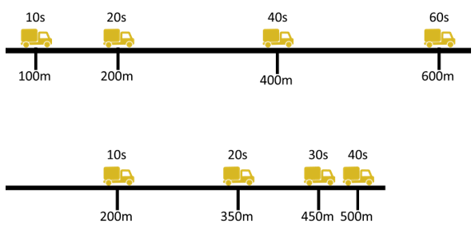

- **A**. 甲车的速度为15m/s
- **B**. 乙车的初始速度为25m/s
- **C**. 45s时，乙车行驶的路程更远　✅
- **D**. 50s时，乙车仍处于行驶状态

**答案**：C

**官方解析**

由图可知，甲车匀速直线行驶，甲车10s行驶了100m，根据速度公式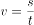可知，甲车的速度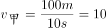m/s，A项错误；乙车匀减速直线行驶，乙车10s行驶了200m，20s行驶了350m，设乙车的初始速度为，加速度为a，根据位移公式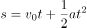可知，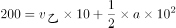······①，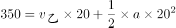······②，联立①、②式解得m/s，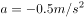，故乙车的初始速度为22.5m/s，B项错误；根据公式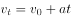可知，当乙车速度减为零时，代入公式可得22.5-0.5t=0，解得t=45s，即乙车在45s时停止行驶，处于静止状态，此时乙车行驶的路程大于500m，而甲车的行驶路程为450m，50s时，乙车仍处于静止状态，故C项正确，D项错误。

故正确答案为C。

---

## 第 24 题　qid 4673163 · 科技常识

如图，小球在细绳的牵引下从A点自由摆动到C点，B点是最低点。若忽略空气阻力，则下列说法不准确的是（    ）。

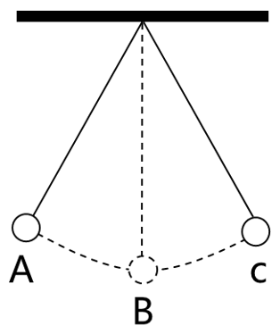

- **A**. 从A点到B点小球的动能增加
- **B**. 从B点到C点小球的势能增加
- **C**. 在B点小球的动能最大
- **D**. 从A点到C点小球的机械能增加　✅

**答案**：D

**官方解析**

由题意可知，小球在细线牵引下自由摆动，绳的拉力方向与运动方向始终垂直，因此绳子拉力不做功，并且忽略空气阻力，则小球在运动过程中只有重力做功，其机械能守恒。

A项：从A点到B点小球的高度降低，根据重力势能公式，小球的重力势能减小，而其机械能守恒，即在此过程中其重力势能转化为动能，因此小球的动能增加，正确；

B项：从B点到C点小球的高度升高，其重力势能增加，根据机械能守恒可知，小球的动能转化为重力势能，因此小球的势能增加，正确；

C项：根据A、B两项分析可知，小球从A点到C点的过程中，重力势能先减小后增大，B点为最低点，小球的重力势能最小，因此在B点小球的动能最大，正确；

D项：根据上述分析可知，小球在整个运动过程中机械能守恒，错误。

本题为选非题，故正确答案为D。

---

## 第 25 题　qid 4673251 · 科技常识

为提升其行驶过程的稳定性，挖掘机装有履带，其原理是：

- **A**. 减小挖掘机对地面的压强　✅
- **B**. 增大挖掘机对地面的压强
- **C**. 减小挖掘机对地面的压力
- **D**. 增大挖掘机对地面的压力

**答案**：A

**官方解析**

根据压强公式，F为挖掘机对地面的压力，S为挖掘机与地面的接触面积，由于挖掘机对地面的压力等于挖掘机的重力，即F=G=mg，且挖掘机的质量m不会发生改变，因此挖掘机的重力G不会发生变化，所以挖掘机对地面的压力F不变，而挖掘机装有履带后，使挖掘机与地面的接触面积S增大，因此挖掘机对地面的压强减小，A项正确，B、C、D三项错误。

故正确答案为A。

---

## 第 26 题　qid 4673244 · 科技常识

如图，甲、乙叠放在一起，静置于地面上。此时，乙受到一个水平向右的拉力F，但甲、乙仍然保持静止状态，在此过程中，以下说法准确的是（    ）。

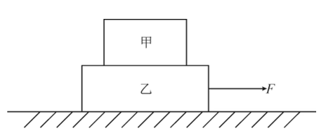

- **A**. 甲和乙之间至少有2对相互作用力
- **B**. 乙对甲的支持力比甲受到的重力大
- **C**. 如果拉力F方向向左，甲、乙将不再保持静止
- **D**. 乙受到的地面摩擦力等于拉力F　✅

**答案**：D

**官方解析**

A项：甲对乙的压力和乙对甲的支持力为一对相互作用力，由于甲在乙受到拉力F之后仍然保持静止，说明甲始终受力平衡，甲仅受到重力和支持力这一对平衡力的作用，若甲在水平方向受到摩擦力，则甲无法保持平衡，所以甲、乙之间没有摩擦力，甲、乙之间仅有压力与支持力这1对相互作用力，错误；
B项：甲处于静止状态，受力平衡，所以甲受到的重力和乙对甲的支持力为一对平衡力，两个力大小相等，错误；
C项：乙受到向右的拉力F后，并未拉动乙，说明拉力F小于乙与地面之间的最大静摩擦力，若拉力方向改为向左，拉力F仍然小于乙与地面之间的最大静摩擦力，甲、乙仍然会保持静止，错误；
D项：由于甲、乙之间没有摩擦力，则乙受到的水平方向的力仅有向右的拉力F和地面对乙向左的静摩擦力，由于乙始终保持静止，处于受力平衡状态，所以乙受到的地面摩擦力和拉力F为一对平衡力，大小相等，正确。
故正确答案为D。

---

## 第 27 题　qid 4673250 · 科技常识

将如图所示卡片面向平面镜时，则该卡片在平面镜中的成像最可能是（    ）。

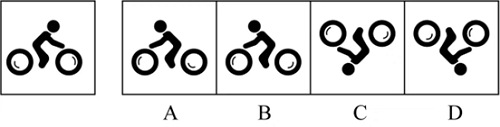

- **A**. A
- **B**. B　✅
- **C**. C
- **D**. D

**答案**：B

**官方解析**

平面镜成像特点为：①正立等大的虚像；②像和物左右相反。
该卡片中骑车的小人镜子中的像应当是正立的，所以应当是轮子在下方人在上方，故C、D两项错误；镜像与卡片中的实像还应当左右相反，所以镜像应当面朝左边，并且前轮中弧线应在轮内左上方，后轮中弧线应在轮内右下方，A项错误，B项正确。
故正确答案为B。

---

## 第 28 题　qid 4673236 · 科技常识

关于常见用电器的工作情况，以下说法不准确的是：

- **A**. 道路两边的路灯定时开关，晚上同时亮，早晨同时灭，则所有路灯是串联的　✅
- **B**. 抽油烟机里的照明灯和电动机，既能同时工作，又能单独工作，则照明灯和电动机是并联的
- **C**. 楼道中的感应电灯是由声控开关和光控开关共同控制的，只有在没有光线且出现声音时才能亮起，则电灯和声控开关、光控开关是串联的
- **D**. 电吹风里的电热丝和电动机，可以控制出风温度，则电热丝和电动机是并联的

**答案**：A

**官方解析**

A项：若道路两边的所有路灯是串联的，当其中一个路灯出现断路时，则所有路灯都会熄灭，为了保证在此种情况发生时其他路灯能够正常工作，那么所有的路灯应该是并联的。所有路灯并联，只需将开关设置在干路上，便能实现所有路灯晚上同时亮，早晨同时灭，错误；
B项：抽油烟机里的照明灯和电动机，可以单独工作，互不影响，因此照明灯和电动机是并联的，正确；
C项：楼道里的感应电灯由声控开关和光控开关共同控制，即二者必须同时闭合时，灯泡才能发光，因此电灯和声控开关、光控开关是串联的，正确；
D项：电吹风可以控制出风温度，说明电热丝和电动机是独立工作的，则电热丝和电动机是并联的，正确。
本题为选非题，故正确答案为A。

---

## 第 29 题　qid 4673166 · 科技常识

如图是某家庭电路图的一部分，家庭内各电器均正确接入电路。则以下说法准确的是（    ）。

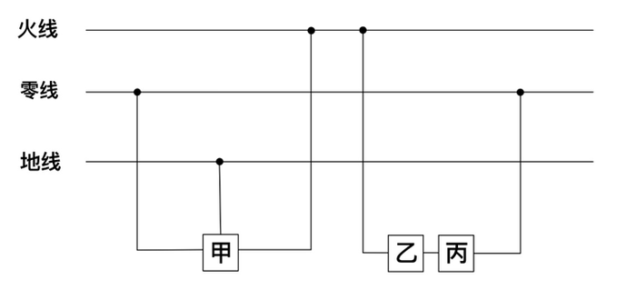

- **A**. 假如乙和甲分别是电器或开关，则丙是开关
- **B**. 假如电路正常，正确使用试电笔接触三孔插座的孔都会显示有电流
- **C**. 假如甲是带金属外壳的用电器，则它接的是三孔插座　✅
- **D**. 假如零线被烧断，应立即关闭开关，否则会引起短路

**答案**：C

**官方解析**

A项：根据家庭电路的特点，开关应接在用电器和火线之间，当开关断开时即可切断用电器与火线的连接，防止触电事故的发生，故乙是开关，丙是用电器，错误；
B项：在正常的电路中，使用试电笔接触火线时，试电笔中的氖管会发光，表示火线有电，使用试电笔接触零线或地线，氖管均不发光，根据三孔插座“左零右火上接地”的接线方式可知，只有使用试电笔接触三孔插座的右孔时氖管才会发光，显示此处有电流，接触左孔和上孔均无此现象，错误；
C项: 图中甲的连接方式为左零右火上接地，并且带金属外壳的用电器也必须接地，以防漏电对人造成伤害，故甲接的是三孔插座，正确；
D项：零线被烧断，整个电路处于断路状态，不会引起短路，错误。
故正确答案为C。

---

## 第 30 题　qid 4673245 · 科技常识

如图是甲、乙两车在同一道路上匀速行驶时路程s随时间t变化的曲线图，则在两车行驶的过程中，下列说法准确的是：

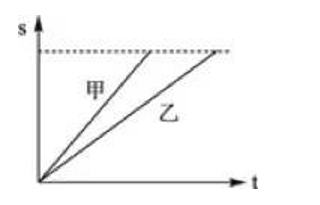

- **A**. 甲车的速度比乙车大　✅
- **B**. 相同时间内，乙车行驶路程更长
- **C**. 甲、乙两车均沿直线运动
- **D**. 甲、乙两车间距离始终保持不变

**答案**：A

**官方解析**

A项：在路程-时间（s-t）图像中，图像的斜率代表速率，图中甲的斜率大于乙的斜率，即甲车的速度比乙车大，正确；
B项：在路程-时间（s-t）图像中，纵坐标代表路程，相同时间内，甲的路程均比乙的路程大，即甲车行驶路程更长，错误；
C项：图像仅能反应出行驶路程随时间的变化情况，无法判断其运动轨迹，即无法判断是否沿直线运动，错误；
D项：在路程-时间（s-t）图像中，纵坐标代表路程，则在相同时刻，两图像纵坐标的高度差即为甲、乙两车间的距离，由图可知，甲、乙两车间距离逐渐增大，错误。
故正确答案为A。

---

## 第 31 题　qid 4673155 · 科技常识

如图，甲、乙两个相同的容器中盛着不同的液体，当相同的小球漂浮在容器中并保持静止时，容器中液面的高度相同，则下列说法准确的是（    ）。

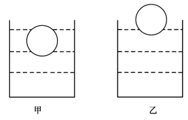

- **A**. 小球在甲容器中受到浮力比在乙容器中的小
- **B**. 小球在甲容器中受到浮力比在乙容器中的大
- **C**. 甲容器中液体的密度比乙容器中液体的小　✅
- **D**. 甲容器中液体的密度比乙容器中液体的大

**答案**：C

**官方解析**

A、B两项错误，相同的小球在甲、乙两容器中均为漂浮状态，则均处于受力平衡状态，小球受到的浮力等于其自身的重力，所以小球在甲容器中和乙容器中受到的浮力一样大。

C项正确、D项错误，由A、B两项分析可知，小球在甲、乙两容器中受到的浮力一样大，由图可知，，根据浮力公式：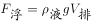可知，。

故正确答案为C。

---

## 第 32 题　qid 4673247 · 科技常识

如图，物体A、B分别位于木板上下方，且处于静止状态，如果将物体B往左移动一段距离，但仍位于木板下方，则下列说法准确的是（    ）。

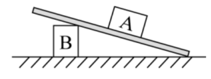

- **A**. 物体A所受合力为零　✅
- **B**. 物体A所受的摩擦力增加
- **C**. 木板对物体A的作用力减小
- **D**. 木板对物体A的作用力增加

**答案**：A

**官方解析**

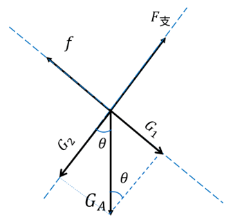

如图所示，对A进行受力分析，受到垂直木板向上的支持力、自身的重力、沿木板向上的摩擦力f。将重力分解成沿木板方向的和垂直于木板方向的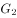，假设此时木板与地面的夹角为，物体A的质量为m，根据三角函数可知，，；由物体A处于静止状态可知，物体A受力平衡，在沿木板方向上可以得到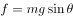，在垂直于木板方向上可以得到；现将B往左移动，可知木板与地面的夹角变小，则变小，变大。

A项：根据前面分析可知，当变小时，增大，变小，所以沿木板方向的始终小于最大静摩擦，故物体A始终处于静止状态，受力平衡，合力为0，正确；

B项：根据前面分析可知，当变小时，变小，摩擦力变小，错误；

C项：木板对物体A的作用力即木板对物体A的摩擦力和支持力，由于物体A处于静止状态，受力平衡，故木板对物体A的摩擦力和支持力的合力与重力等大反向，由于物体A质量不变，故物体A的重力不变，所以木板对物体A的作用力也不变，错误；

D项：由C项分析可知，木板对物体A的作用力不变，错误。

故正确答案为A。

---

## 第 33 题　qid 4673168 · 科技常识

如图是某种固态物质在加热过程中，温度随时间变化的图像。下列说法最不准确的是（    ）。

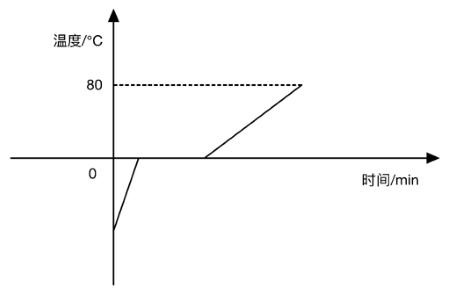

- **A**. 该固态物质有固定的熔点
- **B**. 该固态物质在熔化过程中，比热容增大
- **C**. 温度为0℃时，该物质可能处于固液共存状态
- **D**. 该固态物质在熔化时不断吸收热量，温度不断升高　✅

**答案**：D

**官方解析**

从图中信息可见，该固态物质有固定的熔点，属于晶体，晶体熔化时需要不断地吸收热量，但是温度不会发生变化，这个不变的温度就是晶体的熔点，在熔化过程中固态与液态共存，A、C两项均正确；该物质在熔化时不断吸收热量但温度不变，故D项错误；比热容是指单位质量的某种物质升高或下降单位温度所吸收或放出的热量，物质的质量不变，从图中可以看出，物质在固态与液态下，升高相同的温度，液态所用的时间更长，所以该物质在液态下的比热容更大（即升高相同的温度时，液态物质所吸收的热量更多），物质熔化过程中，固体不断减少，液体不断增加，即液体的占比在增大，所以熔化过程中，该物质的比热容会增大，B项正确。
本题为选非题，故正确答案为D。

---

## 第 34 题　qid 4673248 · 科技常识

2021年9月17日，神舟十二号在甘肃酒泉东风着陆场顺利着陆。那么，酒泉当地气候和当天昼长情况最有可能是：

- **A**. 干旱少雨，着陆当天昼长夜短　✅
- **B**. 干旱少雨，着陆当天昼短夜长
- **C**. 湿润多雨，着陆当天昼长夜短
- **D**. 湿润多雨，着陆当天昼短夜长

**答案**：A

**官方解析**

9月17日，太阳直射点位于北回归线和赤道之间，此时北半球昼长夜短，南半球昼短夜长，酒泉位于北半球，故当天昼长夜短，排除B、D两项；酒泉位于我国西北内陆地区，远离海洋，全年干旱少雨，排除C项，A项当选。
故正确答案为A。

---

## 第 35 题　qid 4673153 · 科技常识

食物链主要反映了生产者与消费者之间的联系，下列关系中最能准确表示食物链的是（    ）。

- **A**. 
草兔狐鹰
　✅
- **B**. 
阳光草鸡狼

- **C**. 
虫鸟蛇

- **D**. 
草羊虎微生物

**答案**：A

**官方解析**

生态系统中生物之间的捕食关系形成了食物链，食物链应该从生产者开始，不包含非生物部分，食物链内生物之间是捕食关系，食物链中不包含分解者。
A项：食物链从草开始，且草、兔、狐、鹰依次为捕食关系，正确；
B项：食物链中不包含非生物部分，阳光属于非生物部分，错误；
C项：食物链应该从生产者开始，虫不是生产者，错误；
D项：食物链中不包含分解者，微生物一般属于分解者，错误。
故正确答案为A。

---

## 第 36 题　qid 4673498 · 科技常识

如图，用绳子分别将两颗不同的磁力球和系在上、下两个平面上，、互相吸引，此时上平面对的作用力为，下平面对的作用力为 ，则以下关于、说法准确的是：

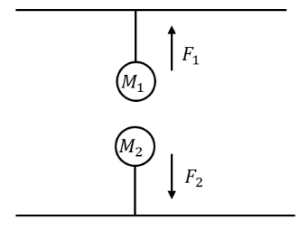

- **A**. 
大于
　✅
- **B**. 
等于

- **C**. 
小于

- **D**. 
无法判断

**答案**：A

**官方解析**

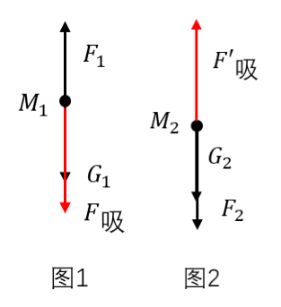

图1为磁力球的受力分析图，在重力，上平面对的拉力，对的吸引力三个力的作用下保持平衡，三个力之间的大小关系为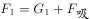；图2为磁力球的受力分析图，在重力，下平面对的拉力，对的吸引力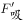三个力的作用下保持平衡，三个力之间的大小关系为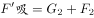，因为和为一对作用力与反作用力，两个力大小相等，方向相反，所以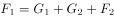，可得大于，A项正确，B、C、D三项均错误。

故正确答案为A。

---

## 第 37 题　qid 4673242 · 科技常识

果树的光合作用主要通过绿叶进行，因此绿叶被称为“食物加工厂”。关于绿叶，下列说法最不准确的是：

- **A**. 通过光合作用，绿叶只能生成碳水化合物　✅
- **B**. 叶片可以通过表皮的气孔与外界进行气体交换
- **C**. 叶脉可以运输水分和无机物
- **D**. 光能主要在叶绿体内转化为化学能

**答案**：A

**官方解析**

A项：绿叶通过光合作用，把二氧化碳和水转化成储存着能量的有机物（主要是淀粉，即选项中所说的碳水化合物），但是光合作用同时还生成氧气，并非只能生成碳水化合物，错误；
B项：植物进行光合作用需要吸收二氧化碳释放氧气，植物的呼吸作用需要吸收氧气呼出二氧化碳，氧气和二氧化碳都是从叶片的气孔进出植物体的，气孔是植物体与外界进行气体交换的“门户”，正确；
C项：叶脉是由贯穿在叶肉内的维管束或维管束及其外围的机械组织组成，它一方面为叶输送水分和无机盐（无机物），另一方面又维持了叶片的基本形状，正确；
D项：光合作用进行的主要场所是叶绿体，光能主要在叶绿体内通过光合作用转化为化学能，正确。
本题为选非题，故正确答案为A。

---

## 第 38 题　qid 4673243 · 科技常识

某蔬菜种植户在农田中种植圆白菜时，采取了以下措施。关于这些情形的解释最不准确的是：

- **A**. 圆白菜和玉米间作套种——提高农田利用率
- **B**. 育苗时覆盖地膜——提高地表温度、保持土壤湿度
- **C**. 长期使用化肥——可就地取材，并能改良土壤结构　✅
- **D**. 移栽圆白菜幼苗时带着土坨——保护幼根和根毛

**答案**：C

**官方解析**

A项：圆白菜和玉米间作套种，能够使作物高矮成层，相间成行，有利于改善农作物的通风透光条件，提高光能利用率，同时还提高了农田利用率，充分发挥边行优势的增产作用，正确；
B项：育苗时覆盖地膜的主要作用是防止水分蒸发、提高地表的温度，土壤中的水分因为在高温和日照的条件下，会蒸发然后凝集在薄膜上，聚少成多形成水流后，再重新滴落回去，从而为种苗提供一个保温、保湿的环境，更有利于种苗的生长，正确；
C项：长期使用化肥会使其养分不能被作物有效地吸收利用，会导致土壤性状恶化、土壤板结，不能改良土壤结构，错误；
D项：移栽圆白菜幼苗时带着土坨，主要是防止对根部根尖成熟区（主要是根毛）造成损伤，保护根部不受破坏，从而能够使其正常的生长，正确。
本题为选非题，故正确答案为C。

---

## 第 39 题　qid 4673249 · 科技常识

为了缓解或者降低行驶车辆发出的噪音对居民的影响，常在离民居较近的高架桥两旁修建隔音墙。对此，下列关于隔音墙说法最不准确的是：

- **A**. 可以吸收汽车产生的噪音
- **B**. 可以反射汽车产生的噪音
- **C**. 出现破裂会影响隔音效果
- **D**. 可以从源头上减少噪音　✅

**答案**：D

**官方解析**

隔音墙主要用于高速公路、高架复合道等处的隔声降噪，目的是减少噪音对居民的影响，隔音墙通常为吸声和隔声混合型的产品，采用的吸音材料可以吸收汽车产生的噪音，隔音材料可以反射汽车产生的噪音，A、B两项正确；如果隔音墙出现破裂，会使隔音墙吸收以及反射噪音的能力减弱，降低隔音效果，C项正确；隔音墙属于在传播过程中控制噪音，不是从源头上减少噪音，D项错误。
本题为选非题，故正确答案为D。

---

## 第 40 题　qid 4673171 · 科技常识

如图是某地生态系统的蒸散示意图，下列说法最准确的是（    ）。

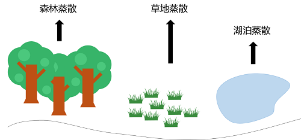

- **A**. 环境温度升高，森林的蒸散作用减弱
- **B**. 空气湿度越大，森林的蒸散作用越弱　✅
- **C**. 任意环境条件下，湖泊的蒸发量比森林蒸散量大
- **D**. 相较于夜晚，该地生态系统在白天时蒸散作用强度明显减弱

**答案**：B

**官方解析**

蒸散包括蒸发作用和蒸腾作用，指的是总水分的散失，包括地面与土壤发生的水分蒸发和植物气孔进行的蒸腾作用，影响蒸散作用的因素包括温度、光照、环境湿度等。
A项：在一定温度范围内，环境温度升高，蒸散作用增强，当温度过高时，叶片气孔会关闭，蒸腾作用会减弱，但蒸发作用会增强，此时无法确定蒸散作用是增强还是减弱，错误；
B项：蒸散作用与空气湿度有关，空气湿度越大，植物蒸散作用越弱，正确；
C项：一般情况下，湖泊多的地方湖泊的蒸发量比森林的蒸散量大，但是在我国大西北地区，湖泊较森林数量少，湖泊的蒸发量就会比森林的蒸散量小，错误；
D项：光照能够促进气孔的开启，使蒸散作用增强，相较于夜晚，白天光照时间长，而且温度也较高，蒸散作用也强，错误。
故正确答案为B。

---
