# 2022年广东省公务员录用考试《行测》题（县级卷）（网友回忆版）

> 常识判断 · 25 题 · 广东 2022

## 第 1 题　qid 4673098 · 人文常识

党的十八大以来，我们深化对民主政治发展规律的认识，提出（    ）的重大理念，其不仅有完整的制度程序，而且有完整的参与实践。

- **A**. 全方位人民民主
- **B**. 全链条人民民主
- **C**. 全过程人民民主　✅
- **D**. 全覆盖人民民主

**答案**：C

**官方解析**

本题考查政治常识。
C项正确，A、B、D三项错误，2021年10月13日至14日中央人大工作会议在北京召开。中共中央总书记、国家主席、中央军委主席习近平出席会议并发表重要讲话指出，“党的十八大以来，我们深化对民主政治发展规律的认识，提出全过程人民民主的重大理念。我国全过程人民民主不仅有完整的制度程序，而且有完整的参与实践。我国全过程人民民主实现了过程民主和成果民主、程序民主和实质民主、直接民主和间接民主、人民民主和国家意志相统一，是全链条、全方位、全覆盖的民主，是最广泛、最真实、最管用的社会主义民主。我们要继续推进全过程人民民主建设，把人民当家作主具体地、现实地体现到党治国理政的政策措施上来，具体地、现实地体现到党和国家机关各个方面各个层级工作上来，具体地、现实地体现到实现人民对美好生活向往的工作上来。”
故正确答案为C。

---

## 第 2 题　qid 4673101 · 人文常识

《中共中央关于党的百年奋斗重大成就和历史经验的决议》阐明了四个历史时期党面临的主要任务，以下关于各个历史时期党面临的主要任务表述正确的是（    ）。

- **A**. 新民主主义革命时期——继续探索中国建设社会主义的正确道路，解放和发展社会生产力，使人民摆脱贫困、尽快富裕起来，为实现中华民族伟大复兴提供充满新的活力的体制保证和快速发展的物质条件
- **B**. 社会主义革命和建设时期——反对帝国主义、封建主义、官僚资本主义，争取民族独立、人民解放，为实现中华民族伟大复兴创造根本社会条件
- **C**. 改革开放和社会主义现代化建设新时期——实现从新民主主义到社会主义的转变，进行社会主义革命，推进社会主义建设，为实现中华民族伟大复兴奠定根本政治前提和制度基础
- **D**. 中国特色社会主义新时代——实现第一个百年奋斗目标，开启实现第二个百年奋斗目标新征程，朝着实现中华民族伟大复兴的宏伟目标继续前进　✅

**答案**：D

**官方解析**

本题考查政治常识。
2021年11月11日，中国共产党第十九届中央委员会第六次全体会议通过《中共中央关于党的百年奋斗重大成就和历史经验的决议》（以下简称《决议》）。
A项错误，《决议》指出：“新民主主义革命时期，党面临的主要任务是，反对帝国主义、封建主义、官僚资本主义，争取民族独立、人民解放，为实现中华民族伟大复兴创造根本社会条件。”
B项错误，《决议》指出：“社会主义革命和建设时期，党面临的主要任务是，实现从新民主主义到社会主义的转变，进行社会主义革命，推进社会主义建设，为实现中华民族伟大复兴奠定根本政治前提和制度基础。”
C项错误，《决议》指出：“改革开放和社会主义现代化建设新时期，党面临的主要任务是，继续探索中国建设社会主义的正确道路，解放和发展社会生产力，使人民摆脱贫困、尽快富裕起来，为实现中华民族伟大复兴提供充满新的活力的体制保证和快速发展的物质条件。”
D项正确，《决议》指出：“党的十八大以来，中国特色社会主义进入新时代。党面临的主要任务是，实现第一个百年奋斗目标，开启实现第二个百年奋斗目标新征程，朝着实现中华民族伟大复兴的宏伟目标继续前进。”
故正确答案为D。

---

## 第 3 题　qid 4673105 · 人文常识

近年来，我国在“大国重器”的研发上成果显著，捷报频传。以下关于“大国重器”与其宣传语的对应关系不正确的是（    ）。

- **A**. “奋斗者号”——只有沉得下去，才能浮得上来
- **B**. “复兴号”——暂时地降落是为了下一次更好地起飞　✅
- **C**. “北斗三号”——其实，方向比方法更重要
- **D**. “中国天眼”——要仰望星空，也要脚踏实地

**答案**：B

**官方解析**

本题考查科技常识。
A项正确，“奋斗者号”是中国研发的万米载人潜水器。2020年11月10日，“奋斗者号”在马里亚纳海沟成功坐底，坐底深度10909米，刷新中国载人深潜的新纪录。2020年11月28日，习近平致信祝贺“奋斗者号“全海深载人潜水器成功完成万米海试并胜利返航。2021年3月16日，“奋斗者号”全海深载人潜水器在三亚正式交付，2021年10月，“奋斗者号“已在马里亚纳海沟正式投入常规科考应用。与宣传语中的“沉”、“浮”对应。
B项错误，新一代标准高速动车组“复兴号”是中国自主研发、具有完全知识产权的新一代高速列车，它集成了大量现代国产高新技术，牵引、制动、网络、转向架、轮轴等关键技术实现重要突破，是中国科技创新的又一重大成果。与宣传语中的“降落”、“起飞”无关。
C项正确，“北斗三号”全球卫星导航系统由24颗中圆地球轨道卫星、3颗地球静止轨道卫星和3颗倾斜地球同步轨道卫星，共30颗卫星组成，是我国自主建设运行的全球卫星导航系统。2020年6月23日，“北斗三号”最后一颗全球组网卫星在西昌卫星发射中心点火升空，2020年7月31日上午，“北斗三号”全球卫星导航系统建成暨开通仪式在北京举行。与宣传语中的“方向”对应。
D项正确，“中国天眼”即500米口径球面射电望远镜（FAST），位于中国贵州省黔南布依族苗族自治州境内，2020年1月11日，500米口径球面射电望远镜通过中国国家验收工作，并正式开放运行。500米口径球面射电望远镜作为一个多学科基础研究平台，可以观测暗物质和暗能量、发现脉冲星、有希望发现奇异星和夸克星物质、发现中子星——黑洞双星、还可能发现高红移的巨脉泽星系、寻找地外文明等等。与宣传语中的“仰望星空”对应。
本题为选非题，故正确答案为B。

---

## 第 4 题　qid 4673107 · 人文常识

在经济全球化时代，任何一个国家都不可能孤立于世界之外，团结合作是所有国家的必然选择，各国人民更需要同舟共济、共克时艰。
下列选项最符合该观点内涵的是（    ）。

- **A**. 人视水见形，视民知治不
- **B**. 孤举者难起，众行者易趋　✅
- **C**. 安而不忘危，存而不忘亡
- **D**. 天不言而四时行，地不语而百物生

**答案**：B

**官方解析**

本题考查政治常识。
题干中“任何一个国家都不可能孤立于世界之外，团结合作是所有国家的必然选择，各国人民更需要同舟共济、共克时艰”体现了联系的观点，强调要团结、合作。
A项错误，“人视水见形，视民知治不”出自《史记》，意思是人在水中可以照见自己的样子，在民众中可以看出政治治理的状况。体现的是唯物史观中的群众史观，强调人民群众是历史的主体。
B项正确，“孤举者难起，众行者易趋”出自魏源《默觚》，意思是一个人独自举起重物可能会很困难，但许多人一块行走则容易走快。体现了人多力量大，强调了团结、合作的重要性。
C项错误，“安而不忘危，存而不忘亡”出自《易传》，意思是君子在国家安定的时候要不忘危险，国家存在的时候要不忘败亡。体现的是对立统一规律，矛盾的双方相互转化。
D项错误，“天不言而四时行，地不语而百物生”出自李白《上安州裴长史书》的首句，意思是苍天闭口不言，却使四季不断运行；大地默默不语，却让万物蓬勃生长。说明天地之间万事万物都有其发展规律，人们要顺应自然的客观规律，按自然规律办事。
故正确答案为B。

---

## 第 5 题　qid 4673097 · 人文常识

马克思主义指引中国成功走上了全面建设社会主义现代化强国的康庄大道，事业越向前发展，新情况新问题势必越多，更应重视理论的作用，增强理论自信和战略定力。这主要体现了（    ）。

- **A**. 认识对实践有着巨大的指导作用　✅
- **B**. 一切从实际出发，实事求是
- **C**. 实践是检验真理的唯一标准
- **D**. 认识是主体对客体的能动反映

**答案**：A

**官方解析**

本题考查政治常识。
A项正确，马克思主义指引中国成功走上了全面建设社会主义现代化强国的康庄大道，体现了在理论指导下，实践的巨大发展和伟大成就。体现了马克思主义哲学的认识论中，关于认识对实践有指导作用的原理，正确的认识会促进实践的发展，错误的认识会阻碍实践的发展。马克思主义正是指导我国实践发展的正确认识。
B项错误，一切从实际出发，就是我们想问题、办事情要把客观存在的实际事物作为根本出发点。实事求是，就是说，我们无论做什么事情，都要从客观实际出发，从中引出其固有的而不是臆造的规律性，作为我们行动的向导，做到按客观规律办事。与题干无关。
C项错误，辩证唯物主义认为，只有实践才是检验真理的唯一标准，这是由实践的特点和真理的本性所决定的。真理是标志主观与客观相符合的哲学范畴，因此，要判断主观与客观是否符合以及符合的程度，在主观的领域内是无法解决的，而仅仅在客观世界的范围内也不能检验。要证明主观与客观的符合，唯一能够充当真理性标准的只能是把主观与客观联结起来的“桥梁”即实践。与题干无关。
D项错误，认识的本质是主体对客体能动的反映，这是在揭示认识是什么。而题干中并未强调认识的本质，而是通过重视理论的作用、增强理论自信等来表现认识的反作用。与题干无关。
故正确答案为A。

---

## 第 6 题　qid 4673102 · 科技常识

《中华人民共和国国民经济和社会发展第十四个五年规划和2035年远景目标纲要》提出“推进能源革命，建设清洁低碳、安全高效的能源体系”。以下措施有助于建设清洁低碳、安全高效的能源体系的是（    ）。
①提升光伏发电规模
②推进以电代煤
③推动沿海核电建设
④有序发展海上风电

- **A**. ①④
- **B**. ②③
- **C**. ②③④
- **D**. ①②③④　✅

**答案**：D

**官方解析**

本题考查政治常识。
①②③④均正确，《中华人民共和国国民经济和社会发展第十四个五年规划和2035年远景目标纲要》在第十一章第三节“构建现代能源体系”指出：“推进能源革命，建设清洁低碳、安全高效的能源体系，提高能源供给保障能力。加快发展非化石能源，坚持集中式和分布式并举，大力提升风电、光伏发电规模，加快发展东中部分布式能源，有序发展海上风电，加快西南水电基地建设，安全稳妥推动沿海核电建设，建设一批多能互补的清洁能源基地，非化石能源占能源消费总量比重提高到20%左右。推动煤炭生产向资源富集地区集中，合理控制煤电建设规模和发展节奏，推进以电代煤。”
故正确答案为D。

---

## 第 7 题　qid 4673109 · 人文常识

结构性就业问题是因经济结构和劳动力结构不对应，使工作岗位要求与劳动者文化技术水平不相适应而产生的就业问题。以下措施最有助于缓解结构性就业问题的是（    ）。

- **A**. 鼓励创业带动就业，支持多渠道灵活就业
- **B**. 持续、大规模、多层次开展职业培训　✅
- **C**. 完善就业失业统计监测调查体系
- **D**. 健全覆盖城乡劳动者的社会保障体系

**答案**：B

**官方解析**

本题考查经济常识。
A项错误，国务院发布的《“十四五”就业促进规划》中“四、强化创业带动作用，放大就业倍增效应”提出：“深入实施创新驱动发展战略，营造有利于创新创业创造的良好发展环境，持续推进双创，更大激发市场活力和社会创造力，促进创业带动就业。”属于扩大就业容量的措施，不符合题意。
B项正确，国务院发布的《“十四五”就业促进规划》中“六、提升劳动者技能素质，缓解结构性就业矛盾”提出：“（十五）大规模多层次开展职业技能培训。”通过职业培训，使得劳动者的素质和能力与工作岗位要求相匹配，符合题意。
C项错误，国务院发布的《“十四五”就业促进规划》中“九、妥善应对潜在影响，防范化解规模性失业风险”提出：“完善就业失业统计监测调查体系。加快构建系统完备、立体化的就业失业监测网络，实现劳动力市场、企业用工主体和劳动者个体全覆盖，全面反映就业增长、失业水平、市场供求状况。完善就业统计指标体系和调查统计方法，探索进行就业质量、就业稳定性等方面的分析。推进大数据在就业统计监测领域的应用。”属于防范化解规模性失业风险的措施，不符合题意。
D项错误，国务院发布的《“十四五”就业促进规划》中“八、优化劳动者就业环境，提升劳动者收入和权益保障水平”提出：“加强劳动者社会保障。健全多层次社会保障体系，持续推进全民参保计划，提高劳动者参保率。加大城镇职工基本养老保险扩面力度，大力发展企业年金、职业年金，规范发展第三支柱养老保险。推进失业保险、工伤保险向职业劳动者广覆盖，实现省级统筹。完善全国统一的社会保险公共服务平台，优化社会保险关系转移接续。”属于提升就业质量的措施，不符合题意。
故正确答案为B。

---

## 第 8 题　qid 4673113 · 人文常识

推进农业绿色发展，有助于加快农业现代化，全面推进乡村振兴。关于“推进农业绿色发展”，下列说法准确的是（    ）。

- **A**. 全面实行全国草原禁牧
- **B**. 放开对非农建设占用耕地的限制
- **C**. 发展节水农业和旱作农业　✅
- **D**. 鼓励发展各种形式规模的农业经营

**答案**：C

**官方解析**

本题考查政治常识。
C项正确，A、B、D三项错误，《中共中央 国务院关于全面推进乡村振兴加快农业农村现代化的意见》在“三、加快推进农业现代化”部分指出：“（十二）推进农业绿色发展。实施国家黑土地保护工程，推广保护性耕作模式。健全耕地休耕轮作制度。持续推进化肥农药减量增效，推广农作物病虫害绿色防控产品和技术。加强畜禽粪污资源化利用。全面实施秸秆综合利用和农膜、农药包装物回收行动，加强可降解农膜研发推广。在长江经济带、黄河流域建设一批农业面源污染综合治理示范县。支持国家农业绿色发展先行区建设。加强农产品质量和食品安全监管，发展绿色农产品、有机农产品和地理标志农产品，试行食用农产品达标合格证制度，推进国家农产品质量安全县创建。加强水生生物资源养护，推进以长江为重点的渔政执法能力建设，确保十年禁渔令有效落实，做好退捕渔民安置保障工作。发展节水农业和旱作农业······”
故正确答案为C。

---

## 第 9 题　qid 4673116 · 科技常识

1970年4月24日，我国自行设计、制造的（    ）发射成功，是我国航天空间技术的一个重要里程碑。自2016年起，我国将每年4月24日设立为“中国航天日”。

- **A**. 第一颗人造地球卫星“东方红一号”　✅
- **B**. 第一艘载人航天飞船“神舟五号”
- **C**. 第一颗月球探测卫星“嫦娥一号”
- **D**. 第一艘无人试验飞船“神舟一号”

**答案**：A

**官方解析**

本题考查科技常识。
A项正确，“东方红一号”是20世纪70年代初中国发射的第一颗人造地球卫星，于1970年4月24日由长征一号运载火箭在酒泉卫星发射中心成功发射。“东方红一号”卫星的发射成功使中国成为世界上继前苏联、美国、法国和日本之后，第5个完全依靠自己的力量成功发射人造卫星的国家。中国国务院批复同意自2016年起，将每年4月24日设立为“中国航天日”。
B项错误，“神舟五号”是中国载人航天工程发射的第五艘飞船，也是中华人民共和国发射的第一艘载人航天飞船，于北京时间2003年10月15日9时整在酒泉卫星发射中心发射升空。
C项错误，“嫦娥一号”是中国探月计划中的第一颗绕月人造卫星，2007年10月24日，在西昌卫星发射中心发射升空。
D项错误，“神舟一号”是中国载人航天工程发射的第一艘飞船，也是中华人民共和国载人航天计划中发射的第一艘无人试验飞船，于北京时间1999年11月20日凌晨6点在酒泉卫星发射中心发射升空。
故正确答案为A。

---

## 第 10 题　qid 4673131 · 人文常识

第一次国共合作实现后，以（    ）为中心汇集全国革命力量，很快开创了反对帝国主义和封建军阀的革命新局面。

- **A**. 北京
- **B**. 广州　✅
- **C**. 上海
- **D**. 武汉

**答案**：B

**官方解析**

本题考查毛中特。
1924年1月，中国国民党第一次全国代表大会在广州召开，确认了共产党员以个人身份加入国民党的原则，实现了第一次国共合作，标志着第一次国共合作正式形成。这次合作实现后，以广州为中心，汇集全国的革命力量，很快开创出反帝反封建的革命新局面。
故正确答案为B。

---

## 第 11 题　qid 4673134 · 人文常识

毛泽东一生中写下了许多脍炙人口的诗句，其中描写长征的是（    ）。

- **A**. 独立寒秋，湘江北去，橘子洲头
- **B**. 宜将剩勇追穷寇，不可沽名学霸王
- **C**. 七百里驱十五日，赣水苍茫闽山碧
- **D**. 更喜岷山千里雪，三军过后尽开颜　✅

**答案**：D

**官方解析**

本题考查毛中特。
A项错误，“独立寒秋，湘江北去，橘子洲头”出自毛泽东的《沁园春·长沙》，这句诗的意思是在深秋一个秋高气爽的日子里，我独自伫立在橘子洲头，眺望着湘江碧水缓缓北流。与长征无关。
B项错误，“宜将剩勇追穷寇，不可沽名学霸王”出自毛泽东的《七律·人民解放军占领南京》，这句诗的意思是应该趁现在这敌衰我盛的大好时机，痛追残敌，解放全中国。不可学那贪图虚名，放纵敌人而造成自己失败的楚霸王项羽。描写的是解放战争。
C项错误，“七百里驱十五日，赣水苍茫闽山碧”出自毛泽东的《渔家傲·反第二次大“围剿”》，这句诗的意思是十五天长驱七百里，从苍茫的赣江边一直打到青翠的闽西山区。描写的是第二次反围剿。
D项正确，“更喜岷山千里雪，三军过后尽开颜”出自毛泽东的《七律·长征》，这句诗的意思是更加令人喜悦的是踏上千里积雪的岷山，红军翻越过去以后个个笑逐颜开。描写的是红军长征中翻越雪山的情景，体现了中国红军的革命乐观主义精神。
故正确答案为D。

---

## 第 12 题　qid 4673137 · 法律常识

根据《党政领导干部选拔任用工作条例》，党政领导干部应当逐级提拔。特别优秀或者工作特殊需要的干部，符合有关条件或情形的可以破格提拔。以下不属于可以破格提拔的条件或情形的是（    ）。

- **A**. 经济发达、高新技术产业发展地区急需引进的　✅
- **B**. 在条件艰苦、环境复杂、基础差的地区或者单位工作实绩突出
- **C**. 专业性较强的岗位或者重要专项工作急需的
- **D**. 在关键时刻或者承担急难险重任务中经受住考验、表现突出、作出重大贡献

**答案**：A

**官方解析**

本题考查法律常识。
A项错误，B、C、D三项均正确，根据《党政领导干部选拔任用工作条例》第九条规定：“破格提拔的特别优秀干部，应当政治过硬、德才素质突出、群众公认度高，且符合下列条件之一：在关键时刻或者承担急难险重任务中经受住考验、表现突出、作出重大贡献；在条件艰苦、环境复杂、基础差的地区或者单位工作实绩突出；在其他岗位上尽职尽责，工作实绩特别显著。因工作特殊需要破格提拔的干部，应当符合下列情形之一：领导班子结构需要或者领导职位有特殊要求的；专业性较强的岗位或者重要专项工作急需的；艰苦边远地区、贫困地区急需引进的。”
本题为选非题，故正确答案为A。

---

## 第 13 题　qid 4673099 · 经济常识

以下是我国改革开放以来发生的重大事件，按时间先后顺序排列正确的是（    ）。
①脱贫攻坚战取得全面胜利②加入世界贸易组织③全面取消农业税
④香港、澳门回归祖国⑤北京举办第二十九届夏季奥运会

- **A**. ④②③⑤①　✅
- **B**. ②⑤④③①
- **C**. ④②⑤①③
- **D**. ②①⑤③④

**答案**：A

**官方解析**

本题考查政治常识。
①2021年2月25日，习近平总书记在全国脱贫攻坚总结表彰大会上的讲话中指出：“今天，我们隆重召开大会，庄严宣告，经过全党全国各族人民共同努力，在迎来中国共产党成立一百周年的重要时刻，我国脱贫攻坚战取得了全面胜利，现行标准下9899万农村贫困人口全部脱贫，832个贫困县全部摘帽，12.8万个贫困村全部出列，区域性整体贫困得到解决，完成了消除绝对贫困的艰巨任务，创造了又一个彪炳史册的人间奇迹！”
②2001年12月11日，我国正式加入世界贸易组织，成为其第143个成员。
③2005年12月，十届全国人大常委会第十九次会议决定，自2006年1月1日起废止《中华人民共和国农业税条例》。自此，在我国延续了两千多年的农业税宣告终结。
④1997年7月1日，中华人民共和国政府对香港恢复行使主权，香港回归祖国；1999年12月20日，中华人民共和国澳门特别行政区成立，中国政府恢复对澳门行使主权，澳门回归祖国。
⑤2008年8月8日至24日，第二十九届夏季奥林匹克运动会在北京举行，国家主席胡锦涛出席开幕式并宣布本届奥运会开幕。
故按时间先后顺序排列正确的是④②③⑤①。
故正确答案为A。

---

## 第 14 题　qid 4673141 · 人文常识

以下广告宣传用语中，不存在科学性错误的是（    ）。

- **A**. 矿泉水营养丰富，喝了就能满足你和家人每日的矿物质需求
- **B**. 当季新鲜柑橘含有丰富的维生素C，有助于提高人体免疫力　✅
- **C**. 本台灯采用0频闪技术，灯光不再有闪烁，更能保护眼睛
- **D**. 新款无糖月饼只用果糖，不添加蔗糖，让你多吃也不发胖

**答案**：B

**官方解析**

本题考查科技常识。
A项错误，矿泉水是从地下深处自然涌出的或者是经人工揭露的、未受污染的地下矿水，含有一定量的矿物盐、微量元素或二氧化碳气体，在通常情况下，其化学成分、流量、水温等动态在天然波动范围内相对稳定。仅依靠喝矿泉水难以满足人体中所需的全部矿物质，尤其是常量元素，如钙，仍需要从食物中获取，奶制品是钙的最好来源。 
B项正确，新鲜柑橘的果肉中含有丰富的维生素C，维生素C能提高机体的免疫力，同时柑橘还能降低患心血管疾病、肥胖症和糖尿病的几率。 
C项错误，频闪就是在一个电器的屏幕里看另一种电器的屏幕，另一种电器的屏幕会有一条亮线从屏幕的底部推移到顶部，又从底部出现。这样无穷下去，给我们的感觉就是图像在闪烁。绝对意义上的无频闪实际是不可能的，中国行业标准对合格产品的频闪要求是3125Hz。
D项错误，糖包括蔗糖、葡萄糖、果糖、半乳糖、乳糖、麦芽糖、淀粉、糊精和糖原等。在这些糖中，除了葡萄糖、果糖和半乳糖能被人体直接吸收，其余的糖都要在体内转化为基本的单糖后，才能被吸收利用。糖的主要功能是提供热能，因此果糖和蔗糖都能提供热量，也就是都会使人发胖。
故正确答案为B。

---

## 第 15 题　qid 4673144 · 科技常识

以下诗句和所描述的植物对应有误的是（    ）。

- **A**. 暗淡轻黄体性柔，情疏迹远只香留——桂花
- **B**. 千磨万击还坚劲，任尔东西南北风——梅花　✅
- **C**. 菡萏香销翠叶残，西风愁起绿波间——荷花
- **D**. 此心生不背朝日，肯信众草能蘙之——葵花

**答案**：B

**官方解析**

本题考查人文常识。
A项正确，“暗淡轻黄体性柔，情疏迹远只香留”出自北宋李清照的《鹧鸪天·桂花》，意思是此花浅黄而清幽，形貌温顺又娇羞；性情萧疏远离尘世，它的浓香却久久存留。描写的是桂花。
B项错误，“千磨万击还坚劲，任尔东西南北风”出自清代郑燮的《竹石》，意思是经历无数磨难和打击身骨仍坚劲，任凭你刮酷暑的东南风，还是严冬的西北风。描写的是竹子，而不是梅花。
C项正确，“菡萏香销翠叶残，西风愁起绿波间”出自南唐李璟的《摊破浣溪沙·菡萏香销翠叶残》，意思是荷花落尽，香气消散，荷叶凋零，深秋的西风拂动绿水，使人愁绪满怀。描写的是荷花。
D项正确，“此心生不背朝日，肯信众草能蘙之”出自北宋梅尧臣的《和石昌言学士官舍十题·葵花》。从“不背朝日”可知描写的是葵花。
本题为选非题，故正确答案为B。

---

## 第 16 题　qid 4673148 · 科技常识

对下列生活中的现象或做法解释不合理的是（    ）。

- **A**. 物体的热胀冷缩——分子随温度升高而变大　✅
- **B**. 油锅着火用锅盖盖灭——使可燃物与空气隔绝
- **C**. 在铁制品表面刷油漆——避免铁制品氧化生锈
- **D**. 利用真空袋包装食品——破坏需氧菌类的生存环境

**答案**：A

**官方解析**

A项：热胀冷缩的原理是温度影响分子间的距离，温度升高，分子间距增大，温度降低，分子间距缩小，升高温度并不会导致分子变大，错误；
B项：物质燃烧需要氧气支持，油锅着火时盖上锅盖，能将油与空气隔绝，使可燃物接触不到氧气，从而使火焰熄灭，正确；
C项：铁暴露在空气中会与空气中的氧气、水蒸气发生化学反应，生成铁锈，所以在铁制品表面刷上一层油漆，可以有效隔绝空气中的氧气和水蒸气，防止铁生锈，正确；
D项：需氧菌是指只能在有氧条件下生长繁殖的菌类，真空包装袋内不含氧气，破坏了需氧菌的生存环境，从而阻止需氧菌的生长繁殖，防止食品腐败，正确。
本题为选非题，故正确答案为A。

---

## 第 17 题　qid 4673159 · 科技常识

镜子前面放有一个圆球。如图是某人站在镜子前从某个角度看到的圆球和其镜像位置关系示意图，则此人在镜子前所站的位置及视角最可能是（    ）。

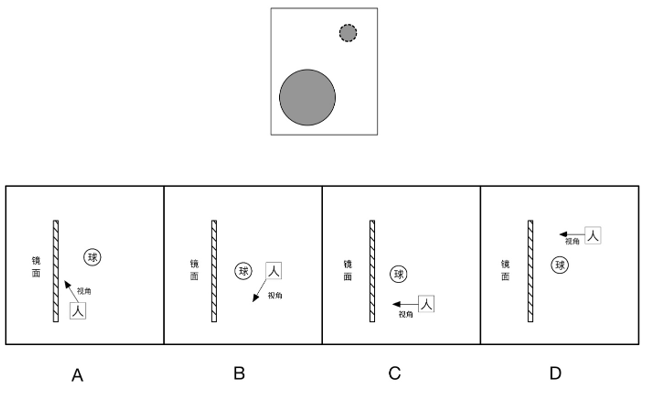

- **A**. A
- **B**. B
- **C**. C
- **D**. D　✅

**答案**：D

**官方解析**

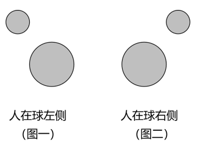

A项：图示位置中，人的视角看到圆球在其镜像的右侧，错误；

B项：图示位置中，人的视角看不到完整的圆球的镜像，错误；

C项：图示位置中，人的视角处于圆球的后方左侧位置，看到的圆球和其镜像位置关系应如图一所示，错误；

D项：图示位置中，人的视角处于圆球的后方右侧位置，看到的圆球和其镜像位置关系应如图二所示，与题干所给图片相符，正确。

故正确答案为D。

---

## 第 18 题　qid 4673166 · 科技常识

如图是某家庭电路图的一部分，家庭内各电器均正确接入电路。则以下说法准确的是（    ）。

- **A**. 假如乙和甲分别是电器或开关，则丙是开关
- **B**. 假如电路正常，正确使用试电笔接触三孔插座的孔都会显示有电流
- **C**. 假如甲是带金属外壳的用电器，则它接的是三孔插座　✅
- **D**. 假如零线被烧断，应立即关闭开关，否则会引起短路

**答案**：C

**官方解析**

A项：根据家庭电路的特点，开关应接在用电器和火线之间，当开关断开时即可切断用电器与火线的连接，防止触电事故的发生，故乙是开关，丙是用电器，错误；
B项：在正常的电路中，使用试电笔接触火线时，试电笔中的氖管会发光，表示火线有电，使用试电笔接触零线或地线，氖管均不发光，根据三孔插座“左零右火上接地”的接线方式可知，只有使用试电笔接触三孔插座的右孔时氖管才会发光，显示此处有电流，接触左孔和上孔均无此现象，错误；
C项: 图中甲的连接方式为左零右火上接地，并且带金属外壳的用电器也必须接地，以防漏电对人造成伤害，故甲接的是三孔插座，正确；
D项：零线被烧断，整个电路处于断路状态，不会引起短路，错误。
故正确答案为C。

---

## 第 19 题　qid 4673153 · 科技常识

食物链主要反映了生产者与消费者之间的联系，下列关系中最能准确表示食物链的是（    ）。

- **A**. 
草兔狐鹰
　✅
- **B**. 
阳光草鸡狼

- **C**. 
虫鸟蛇

- **D**. 
草羊虎微生物

**答案**：A

**官方解析**

生态系统中生物之间的捕食关系形成了食物链，食物链应该从生产者开始，不包含非生物部分，食物链内生物之间是捕食关系，食物链中不包含分解者。
A项：食物链从草开始，且草、兔、狐、鹰依次为捕食关系，正确；
B项：食物链中不包含非生物部分，阳光属于非生物部分，错误；
C项：食物链应该从生产者开始，虫不是生产者，错误；
D项：食物链中不包含分解者，微生物一般属于分解者，错误。
故正确答案为A。

---

## 第 20 题　qid 4673155 · 科技常识

如图，甲、乙两个相同的容器中盛着不同的液体，当相同的小球漂浮在容器中并保持静止时，容器中液面的高度相同，则下列说法准确的是（    ）。

- **A**. 小球在甲容器中受到浮力比在乙容器中的小
- **B**. 小球在甲容器中受到浮力比在乙容器中的大
- **C**. 甲容器中液体的密度比乙容器中液体的小　✅
- **D**. 甲容器中液体的密度比乙容器中液体的大

**答案**：C

**官方解析**

A、B两项错误，相同的小球在甲、乙两容器中均为漂浮状态，则均处于受力平衡状态，小球受到的浮力等于其自身的重力，所以小球在甲容器中和乙容器中受到的浮力一样大。

C项正确、D项错误，由A、B两项分析可知，小球在甲、乙两容器中受到的浮力一样大，由图可知，，根据浮力公式：可知，。

故正确答案为C。

---

## 第 21 题　qid 4673171 · 科技常识

如图是某地生态系统的蒸散示意图，下列说法最准确的是（    ）。

- **A**. 环境温度升高，森林的蒸散作用减弱
- **B**. 空气湿度越大，森林的蒸散作用越弱　✅
- **C**. 任意环境条件下，湖泊的蒸发量比森林蒸散量大
- **D**. 相较于夜晚，该地生态系统在白天时蒸散作用强度明显减弱

**答案**：B

**官方解析**

蒸散包括蒸发作用和蒸腾作用，指的是总水分的散失，包括地面与土壤发生的水分蒸发和植物气孔进行的蒸腾作用，影响蒸散作用的因素包括温度、光照、环境湿度等。
A项：在一定温度范围内，环境温度升高，蒸散作用增强，当温度过高时，叶片气孔会关闭，蒸腾作用会减弱，但蒸发作用会增强，此时无法确定蒸散作用是增强还是减弱，错误；
B项：蒸散作用与空气湿度有关，空气湿度越大，植物蒸散作用越弱，正确；
C项：一般情况下，湖泊多的地方湖泊的蒸发量比森林的蒸散量大，但是在我国大西北地区，湖泊较森林数量少，湖泊的蒸发量就会比森林的蒸散量小，错误；
D项：光照能够促进气孔的开启，使蒸散作用增强，相较于夜晚，白天光照时间长，而且温度也较高，蒸散作用也强，错误。
故正确答案为B。

---

## 第 22 题　qid 4673158 · 科技常识

以下为甲、乙两车行驶情况的示意图，已知甲、乙同时从一起点出发，甲车在水平道路上匀速直线行驶，乙车在同一水平的道路上匀减速直线行驶，则在两车行驶的过程中，下列说法准确的是（    ）。

- **A**. 甲车的速度为15m/s
- **B**. 乙车的初始速度为25m/s
- **C**. 45s时，乙车行驶的路程更远　✅
- **D**. 50s时，乙车仍处于行驶状态

**答案**：C

**官方解析**

由图可知，甲车匀速直线行驶，甲车10s行驶了100m，根据速度公式可知，甲车的速度m/s，A项错误；乙车匀减速直线行驶，乙车10s行驶了200m，20s行驶了350m，设乙车的初始速度为，加速度为a，根据位移公式可知，······①，······②，联立①、②式解得m/s，，故乙车的初始速度为22.5m/s，B项错误；根据公式可知，当乙车速度减为零时，代入公式可得22.5-0.5t=0，解得t=45s，即乙车在45s时停止行驶，处于静止状态，此时乙车行驶的路程大于500m，而甲车的行驶路程为450m，50s时，乙车仍处于静止状态，故C项正确，D项错误。

故正确答案为C。

---

## 第 23 题　qid 4673163 · 科技常识

如图，小球在细绳的牵引下从A点自由摆动到C点，B点是最低点。若忽略空气阻力，则下列说法不准确的是（    ）。

- **A**. 从A点到B点小球的动能增加
- **B**. 从B点到C点小球的势能增加
- **C**. 在B点小球的动能最大
- **D**. 从A点到C点小球的机械能增加　✅

**答案**：D

**官方解析**

由题意可知，小球在细线牵引下自由摆动，绳的拉力方向与运动方向始终垂直，因此绳子拉力不做功，并且忽略空气阻力，则小球在运动过程中只有重力做功，其机械能守恒。

A项：从A点到B点小球的高度降低，根据重力势能公式，小球的重力势能减小，而其机械能守恒，即在此过程中其重力势能转化为动能，因此小球的动能增加，正确；

B项：从B点到C点小球的高度升高，其重力势能增加，根据机械能守恒可知，小球的动能转化为重力势能，因此小球的势能增加，正确；

C项：根据A、B两项分析可知，小球从A点到C点的过程中，重力势能先减小后增大，B点为最低点，小球的重力势能最小，因此在B点小球的动能最大，正确；

D项：根据上述分析可知，小球在整个运动过程中机械能守恒，错误。

本题为选非题，故正确答案为D。

---

## 第 24 题　qid 4673173 · 科技常识

如图，用绳子分别将两颗不同的磁力球和系在上、下两个平面上，、互相吸引，此时上平面对的作用力为，下平面对的作用力为 ，则以下关于、说法准确的是：

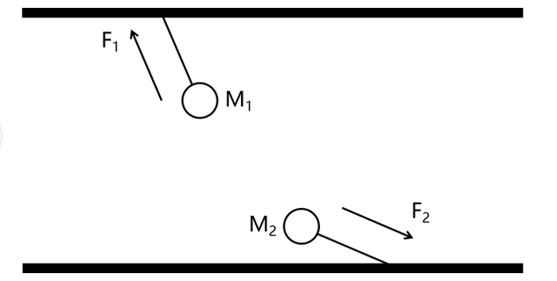

- **A**. 
大于
　✅
- **B**. 
等于

- **C**. 
小于

- **D**. 
无法判断

**答案**：A

**官方解析**

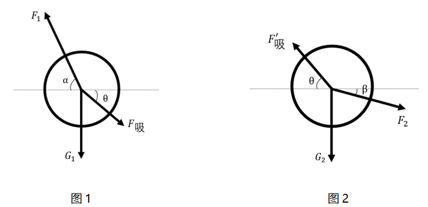

如图1所示，对进行受力分析，受到竖直向下的重力，绳子的拉力，以及对的吸引力，此时处于平衡状态，则水平方向受力平衡，设与水平方向的夹角为，与水平方向的夹角为，则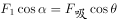；

如图2所示，对进行受力分析，受到竖直向下的重力，绳子的拉力，以及的对的吸引力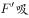，此时处于平衡状态，则水平方向受力平衡，设与水平方向的夹角为，由于与为一对作用力与反作用力，则二者大小相等，方向相反，所以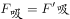且与水平面的夹角为，则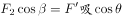；

由此可知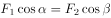，由图可知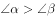，则，所以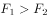。

故正确答案为A。

---

## 第 25 题　qid 4673168 · 科技常识

如图是某种固态物质在加热过程中，温度随时间变化的图像。下列说法最不准确的是（    ）。

- **A**. 该固态物质有固定的熔点
- **B**. 该固态物质在熔化过程中，比热容增大
- **C**. 温度为0℃时，该物质可能处于固液共存状态
- **D**. 该固态物质在熔化时不断吸收热量，温度不断升高　✅

**答案**：D

**官方解析**

从图中信息可见，该固态物质有固定的熔点，属于晶体，晶体熔化时需要不断地吸收热量，但是温度不会发生变化，这个不变的温度就是晶体的熔点，在熔化过程中固态与液态共存，A、C两项均正确；该物质在熔化时不断吸收热量但温度不变，故D项错误；比热容是指单位质量的某种物质升高或下降单位温度所吸收或放出的热量，物质的质量不变，从图中可以看出，物质在固态与液态下，升高相同的温度，液态所用的时间更长，所以该物质在液态下的比热容更大（即升高相同的温度时，液态物质所吸收的热量更多），物质熔化过程中，固体不断减少，液体不断增加，即液体的占比在增大，所以熔化过程中，该物质的比热容会增大，B项正确。
本题为选非题，故正确答案为D。

---
