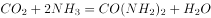

# 2022年深圳市考公务员录用考试《行测》试题（网友回忆版）

> 常识判断 · 16 题 · 深圳市考 2022

## 第 1 题　qid 4651902 · 经济常识

贸易战虽然会产生一定的负面影响，但我国经济韧性好，潜力足，回旋空间大，可以把压力转化为倒逼转型升级的动力，关键是要保持战略定力，贯彻新发展理念。这主要体现的马克思主义原理是：

- **A**. 内因和外因的辩证关系原理　✅
- **B**. 量变和质变的辩证关系原理
- **C**. 事物的普遍联系原理
- **D**. 矛盾的普遍性和特殊性的辩证原理

**答案**：A

**官方解析**

本题考查政治常识。
A项正确，内因是事物变化的根据，它规定着事物发展的方向，是事物发展的根本原因。外因是事物变化的条件，它能够加速或延缓甚至暂时改变事物发展的进程，但它必须通过内因而起作用。题干中我国之所以能够把压力转化为动力，是因为我国自身的经济状态“韧性好，潜力足，回旋空间大”，体现了内因决定事物的变化和发展。
B项错误，量变是事物数量的增减和组成要素排列次序的变动，是保持事物的质的相对稳定性的不显著变化，体现了事物发展渐进过程的连续性；质变是事物性质的根本变化，是事物由一种质态向另一种质态的飞跃，体现了事物发展渐进过程和连续性的中断。量变是质变的必要准备，质变是量变的必然结果，量变和质变是相互渗透、相互依存、相互贯通的。此原理与题干无关。
C项错误，联系是指事物内部诸要素之间以及事物之间的相互影响、相互作用和相互制约。世界上没有孤立存在的事物，每一种事物都是在与其他事物的联系之中存在的，事物的联系是事物本身所固有的，不是主观臆想的。此原理与题干无关。
D项错误，矛盾的普遍性指矛盾存在于一切事物中，存在于一切事物发展过程的始终，旧的矛盾解决了，新的矛盾又产生，事物始终在矛盾中运动。矛盾的特殊性是指各个具体事物的矛盾、每一个矛盾的各个方面在发展的不同阶段上各有其特点。矛盾的普遍性与特殊性的关系是共性和个性、一般和个别的关系，一方面，普遍性寓于特殊性之中，并通过特殊性表现出来，没有特殊性就没有普遍性；另一方面，特殊性也离不开普遍性，不包含普遍性的事物是没有的。此原理与题干无关。
故正确答案为A。

---

## 第 2 题　qid 4651903 · 人文常识

我国人大代表选举制度的基本原则不包括：

- **A**. 普遍性原则
- **B**. 平等性原则
- **C**. 秘密投票原则
- **D**. 间接选举原则　✅

**答案**：D

**官方解析**

本题考查法律常识。
A、B、C三项正确，D项错误，我国人大代表的选举制度包括普遍、平等、差额、直接选举与间接选举相结合、无记名投票的选举原则。普遍性原则，是指享有选举权和被选举权的公民具有广泛性、普遍性，凡是达到法定年龄的公民都享有选举权和被选举权。因依法被剥夺政治权利而没有选举权和被选举权的人是极少数。平等性原则，是指公民在选举中的地位平等，享有同等的选举权。具体来说，就是每一选民在一次选举中都有一个投票权，并且每一张选票的效力相同。直接选举与间接选举相结合的原则，直接选举是指将代表名额分配到选区，由选区选民直接投票选举产生代表；间接选举是指将代表名额分配到选举单位，由选举单位召开选举会议选举产生代表。我国县乡两级人大代表由直接选举产生，全国、省级、设区的市级的人大代表由间接选举产生。差额选举原则，是指代表候选人的人数多于应选代表的名额。无记名投票原则，又称秘密选举原则，即选票上不署投票人的姓名，投票人对代表候选人按照规定的符号表示赞成、反对、弃权，或者另选他人。
本题为选非题，故正确答案为D。

---

## 第 3 题　qid 4651824 · 经济常识

完善社会主义市场经济体制，既要更加尊重市场经济一般规律，充分发挥市场在资源配置中的作用，又要更好发挥政府作用，有效弥补市场失灵，下列事例属于市场失灵的是：

- **A**. 采摘季节遇上台风，导致荔枝减产，价格高企
- **B**. 航空公司在出行淡季推出打折机票
- **C**. 某印刷厂趁雨夜向河道输送污水　✅
- **D**. 某市增加小汽车增量指标后，车牌竞拍价格环比大幅下降

**答案**：C

**官方解析**

本题考查经济常识。
市场失灵是指由于市场机制不能充分发挥作用而导致的资源配置缺乏效率或者资源配置失当的情况。一般导致市场失灵的因素有：公共物品、垄断、外部性、非对称信息。
A项错误，采摘季节由于台风的影响，导致荔枝减产，从而引起的供小于求现象会使荔枝的价格高涨，这属于市场供求关系所引起的正常现象。
B项错误，航空公司在出行淡季推出打折机票，是由淡季供大于求，价格下降所引起的，这属于市场供求关系所引起的正常现象。
C项正确，某印刷厂向河道输送污水，指的是一方或者组织的行为对其他人或者组织产生不利影响，这属于外部性中的负外部性导致的市场失灵现象。
D项错误，小汽车增量指标是指在现有的小汽车基础上增加的小汽车量。增加小汽车增量指标后，会导致汽车供给增加，此时供大于求，汽车价格会下降，随着小汽车量的增加，车牌的发放量也会同比增加，大家获得车牌的机会大幅增加，因此前往竞拍的人会变少，此时竞拍场供大于求，价格大幅下降，这属于市场供求关系所引起的正常现象。
故正确答案为C。

---

## 第 4 题　qid 4651870 · 法律常识

行政主体是指依法享有行政职权，能以自己的名义行使国家行政职权，并能独立承担因此产生法律责任的组织，下列不属于行政主体的是：

- **A**. 深圳市福田区信访局
- **B**. 深圳市福田区建筑工务署　✅
- **C**. 深圳市福田区福田街道办事处
- **D**. 深圳市公安局福田分局福田派出所

**答案**：B

**官方解析**

本题考查法律常识。
行政主体是指享有国家行政权力，能以自己的名义从事行政管理活动并独立承担由此产生的法律责任的组织。行政主体不仅仅是行政机关，还包括法律法规授权的组织。
A项正确，信访局是县级以上人民政府信访工作机构是本级人民政府负责信访工作的行政机构，属于行政主体。
B项错误，根据《印发深圳市建筑工务署职能配置内设机构和人员编制的规定》、《关于调整市建筑工务署体制的通知》规定以及深圳市福田区人民政府官方网站公开信息显示，深圳市福田区建筑工务署为事业单位。不属于行政主体。
C项正确，我国的行政机关包括政府及职能部门、派出机关和派出机构，街道办事处是派出机关，属于行政主体。
D项正确，行政主体包括行政机关和法律、法规授权组织，其中行政机关包括政府及职能部门、派出机关和派出机构，派出所属于派出机构，属于行政主体。
本题为选非题，故正确答案为B。

---

## 第 5 题　qid 4651871 · 法律常识

根据《民法典》，下列婚姻不属于无效婚姻的是：

- **A**. 小陈和小宋的婚姻，二人共于1999年出生，于2019年结婚
- **B**. 25岁的小刘和45岁的老赵的婚姻　✅
- **C**. 阿红和堂哥阿雷的婚姻
- **D**. 王二和已与妻子李四分居多年的张三的婚姻

**答案**：B

**官方解析**

本题考查法律常识。
根据《民法典》第一千零五十一条规定：“有下列情形之一的，婚姻无效：（一）重婚；（二）有禁止结婚的亲属关系；（三）未到法定婚龄。”
A项属于，《民法典》第一千零四十七条规定：“结婚年龄，男不得早于二十二周岁，女不得早于二十周岁。”题中，2019年小陈和小宋中的男方只有二十周岁，该婚姻无效。
B项不属于，小刘和老赵结婚不属于婚姻无效的情形。
C项属于，《民法典》第一千零四十八条规定：“直系血亲或者三代以内的旁系血亲禁止结婚。”题中，阿红和堂哥阿雷是三代以内的旁系血亲，该婚姻无效。
D项属于，张三虽然和李四分居多年，但二人仍具有婚姻关系，王二和张三结婚构成重婚，该婚姻无效。
故正确答案为B。

---

## 第 6 题　qid 4651833 · 人文常识

关于深圳经济特区的发展历程，下列说法错误的是（    ）。

- **A**. 深圳经济特区成立时，地域涵盖今福田、罗湖、南山、盐田4个行政区
- **B**. 深圳经济特区建立20周年时，经中央批准，特区范围扩大到全市　✅
- **C**. 深汕特别合作区位于汕尾市，是全国首个特别合作区
- **D**. 深圳前海蛇口自贸区于2015年挂牌成立，被称为“特区中的特区”

**答案**：B

**官方解析**

本题考查政治常识。
A项正确，1980年8月全国人大常委会颁布了《广东省经济特区条例》，深圳经济特区正式成立，地域包括今罗湖、福田、南山、盐田4个区。
B项错误，2010年5月31日，深圳经济特区建立30周年时中央批准了深圳扩大特区版图的申请。深圳特区范围延伸至全市，总面积将由395平方公里扩容为1948平方公里，接近香港面积的两倍，并于2010年7月1日起执行。地域包括今罗湖、福田、南山、盐田、龙岗、宝安、龙华区，坪山区，光明新区，大鹏新区。
C项正确，深汕特别合作区隶属广东省汕尾市海丰县，是全国首个特别合作区。
D项正确，2015年4月27日，深圳前海蛇口自贸区挂牌成立，被称为“特区中的特区”，被誉为深圳下一个城市中心。
本题为选非题，故正确答案为B。

---

## 第 7 题　qid 4651844 · 人文常识

党员林某出国学习研究超过5年仍未返回，保留其组织关系的党组织一般应予以：

- **A**. 停止党籍　✅
- **B**. 党内除名
- **C**. 开除党籍
- **D**. 严重警告

**答案**：A

**官方解析**

本题考查法律常识。
A项正确，B、C、D三项错误，根据《中国共产党党员教育管理工作条例》第二十四条第二款规定：“对因私出国并在国外长期定居的党员，出国学习研究超过5年仍未返回的党员，一般予以停止党籍。停止党籍的决定由保留其组织关系的党组织按照有关规定作出。”
故正确答案为A。

---

## 第 8 题　qid 4651862 · 人文常识

电影《长津湖》以抗美援朝战争第二次战役中的长津湖战役为背景，生动诠释了伟大的抗美援朝精神，赢得广泛好评。关于中国人民志愿军抗美援朝出国作战，下列说法错误的是：

- **A**. 是新中国成立后第一次出国作战
- **B**. 其本质是以正义之师行正义之举
- **C**. 上甘岭战役也发生于抗美援朝期间
- **D**. 2021年是中国人民志愿军抗美援朝出国作战70周年　✅

**答案**：D

**官方解析**

本题考查毛中特。
A项正确，抗美援朝战争发生于1950年10月—1953年7月，是新中国成立后第一次出国作战。伟大的抗美援朝战争，抵御了帝国主义的侵略扩张，捍卫了新中国的安全，保卫了中国人民的和平生活。
B项正确，2020年10月23日，习主席在纪念中国人民志愿军抗美援朝出国作战70周年大会上的讲话中指出：“值此危急关头，应朝鲜党和政府请求，中国党和政府以非凡气魄和胆略作出抗美援朝、保家卫国的历史性决策。1950年10月19日，中国人民志愿军在彭德怀司令员兼政治委员率领下进入朝鲜战场。这是以正义之师行正义之举。”
C项正确，上甘岭战役，是1952年10月14日至11月25日中国人民志愿军与“联合国军”在上甘岭及其附近地区展开的一场著名战役。发生于抗美援朝期间。
D项错误，1950年10月，中国人民志愿军赴朝作战，拉开了抗美援朝战争的序幕。因此2020年是中国人民志愿军抗美援朝出国作战70周年。
本题为选非题，故正确答案为D。

---

## 第 9 题　qid 4651863 · 人文常识

党的十九届六中全会指出，社会主义革命和建设时期，党面临的主要任务是，实现从新民主主义到社会主义的转变，进行社会主义革命，推进社会主义建设，为实现中华民族伟大复兴：

- **A**. 创造根本社会条件
- **B**. 奠定根本政治前提和制度基础　✅
- **C**. 提供充满新的活力的体制保证
- **D**. 提供快速发展的物质条件

**答案**：B

**官方解析**

本题考查政治常识。
B项正确，A、C、D三项错误，中国共产党第十九届中央委员会第六次全体会议，于2021年11月8日至11日在北京举行。全会提出，社会主义革命和建设时期，党面临的主要任务是，实现从新民主主义到社会主义的转变，进行社会主义革命，推进社会主义建设，为实现中华民族伟大复兴奠定根本政治前提和制度基础。
故正确答案为B。

---

## 第 10 题　qid 4651864 · 人文常识

以下公文处理做法正确的是：

- **A**. 任职于内蒙古自治区的小刘，并用汉字和蒙古文字草拟公文　✅
- **B**. 任职于某区委的小高向市委报送请示，同时抄送请示事项相关的街道办
- **C**. 因时间紧急，虽然涉及其他部门职权范围内的事务未协商一致，小李仍向下级单位印发了通知
- **D**. 小何在向上级机关报送报告时，在报告中就相关事项请示上级机关

**答案**：A

**官方解析**

本题考查公文写作与处理。
A项正确，《党政机关公文处理工作条例》规定：“民族自治地方的公文，可以并用汉字和当地通用的少数民族文字。"故任职于内蒙古自治区的小刘可以并用汉字和蒙古文字草拟公文。
B项错误，街道办一般指街道办事处。市辖区、不设区的市的人民政府，经上一级人民政府批准，可以设立若干街道办事处，作为政府派出机关。区委是区中共中央党办委员会，属于党的机关。《党政机关公文处理工作条例》规定：“向上级机关行文，原则上主送一个上级机关，根据需要同时抄送相关上级机关和同级机关。”区委向上级市委直接报送请示，请求批准相关事项，可以抄送给党系统相关的上级和同级机关，街道办属于政府派出机关，无需抄送给街道办。
C项错误，《党政机关公文处理工作条例》规定：“涉及多个部门职权范围内的事务，部门之间未协商一致的，不得向下行文。”涉及其他部门职权范围内的事务未协商一致，小李仍向下级单位印发通知，违背行文规则。
D项错误，《党政机关公文处理工作条例》规定：“请示应当一文一事。不得在报告等非请示性公文中夹带请示事项。”小何在向上级机关报送报告时，在报告中就相关事项请示上级机关，违背行文规则。
故正确答案为A。

---

## 第 11 题　qid 4651865 · 科技常识

做好二氧化碳的资源化利用是构建低碳社会的一个重要方面，关于二氧化碳的性质和应用，下列说法错误的是：

- **A**. 二氧化碳可控制亲氧微生物的生存和繁殖，用于果蔬保鲜
- **B**. 二氧化碳凝华吸热且不可燃，可用作干冰灭火剂　✅
- **C**. 二氧化碳可与氨合成尿素，用于农业化肥
- **D**. 液态二氧化碳对污垢有溶解作用，可用作干洗溶剂

**答案**：B

**官方解析**

本题考查科技常识。

A项正确，气调储藏是一种安全可靠的果蔬保鲜手段。所谓气调储藏就是在冷藏的基础上增加气体成分调节手段，主要是降氧增碳，即降低氧气的浓度，提高二氧化碳的浓度，必要时可加氮气，以达到更好的储藏效果。污染果蔬产品的微生物大多为亲氧性的，因此二氧化碳可以抑制亲氧微生物的生存和繁殖。而且，在低氧条件下（如含氧1%-5%），适当增大二氧化碳浓度还可抑制果蔬的呼吸，从而提高果蔬品质和延长保存期。

B项错误，凝华是指物质跳过液态直接从气态变为固态的现象，凝华过程物质要放热。升华指物质从固态不经过液态直接变成气态的过程，升华过程要吸收热量。固态二氧化碳即干冰，升华吸热且不可燃，可用作灭火剂。

C项正确，工业上用氨和二氧化碳反应合成尿素，其反应是：。尿素作为一种中性肥料，尿素适用于各种土壤和植物。它易保存，使用方便，对土壤的破坏作用小，是使用量较大的一种化学氮肥，也是含氮量最高的氮肥。

D项正确，液态二氧化碳是一种新型、无污染的衣物干洗清洁剂，基本原理是：二氧化碳在高压下变为液态，清洗过程中能将污物溶解，清洗完后含有污物的液态二氧化碳排放至分离槽，减除压力后，成为气态的二氧化碳与污物分离，分离后的二氧化碳气体经冷凝器处理可循环使用。

本题为选非题，故正确答案为B。

---

## 第 12 题　qid 4651872 · 人文常识

以下为现代诗选段：
我知晓，旷野上我尚属大地的一条细流
是当隔的一片“黄竹酒”诞生了我汨汨生命
我自牛尾岭、虎跃头，穿越沙湾臂，莲峰屿，汇上水河，后溯溪流
逶迤百里西出春江米堵，再入后海湾、内伶仃
当你翻阅历史的时候，便掀开了我的奔流履历
该段诗歌描写的河流最可能是：

- **A**. 龙岗河
- **B**. 坪山河
- **C**. 深圳河　✅
- **D**. 盐田河

**答案**：C

**官方解析**

本题考查地理常识。
A项错误，龙岗河发源于广东省深圳市梧桐山，是东江二级支流淡水河的干流，其上游流经横岗街道的梧桐山河、大康河、简龙河以及何茂盛河；而后流经龙岗街道、坪地街道、坑梓街道后入惠阳境内。上游为低山丘陵区，中下游为陵地带，地形比较复杂。
B项错误，坪山河发源于深圳市三洲田梅沙尖，流经坪山，在兔岗岭进入惠阳境内，在淡水寮湖汇入淡水河，属淡水河一级支流。
C项正确，深圳河正源为沙湾河，发源于广东省深圳市牛尾岭，上游支流莲塘河发源于梧桐山，属于珠江三角洲水系，深圳河干流流经深圳与香港，自东北向西南流入深圳湾（也被称为后海湾），出伶仃洋，是深圳与香港的界河。主要支流有深圳一侧的布吉河、福田河、皇岗河、新洲河及香港一侧的梧桐河和平原河。根据题干中“牛尾岭”、“沙湾臂”、“后海湾”、“内伶仃”等关键词可知，题中所指的河为深圳河。
D项错误，盐田河是盐田辖区最长河流，属山溪性河流，发源于三洲田，在盐田南汇入大鹏湾海域。
故正确答案为C。

---

## 第 13 题　qid 4651807 · 人文常识

经济学上，根据是否具有竞争性和排他性，可将物品分为四类，私人物品、公有资源、自然垄断物和公共物品，根据该分类方法，以下说法正确的是：

- **A**. 冰淇淋属于私人物品　✅
- **B**. 海洋中的鱼类属于自然垄断物
- **C**. 国防属于公有资源
- **D**. 拥挤的不收费道路属于公共物品

**答案**：A

**官方解析**

本题考查经济常识。
竞争性指的是某个人消费了某种产品后，其他人再也不能消费该产品；排他性指的是排除那些没有付费的人消费该产品的能力。
A项正确，私人物品指的是具有竞争性和排他性的物品，冰淇淋属于私人物品，某人消费后，其他人不能购买该冰淇淋，并且不能使用该冰淇淋。
B项错误，自然垄断物品指的是具有排他性而无竞争性的产品，因此又被称为可排他非竞争性准公共物品，多指自来水、电力、燃气以及铁路服务等。海洋中的鱼类属于公有资源。
C项错误，公有资源指的是可供具有一定能力且有兴趣的单位和个人共同使用和消费的资源，没有排他性但具有竞争性。国防不是公有资源，属于公共物品。
D项错误，公共物品指的是能够被所有的人消费的物品，一般具有非竞争性和非排他性。公共物品又可分为纯公共物品和准公共物品。拥挤的不收费的道路属于公有资源。
故正确答案为A。

---

## 第 14 题　qid 4651823 · 人文常识

2021年5月11日，第七次全国人口普查结果公布，全国人口约为（    ）亿人。

- **A**. 13.9
- **B**. 14.1　✅
- **C**. 14.3
- **D**. 14.7

**答案**：B

**官方解析**

本题考查政治常识。
B项正确，A、C、D三项错误，2021年5月11日，第七次全国人口普查结果公布，全国人口共141178万人，与2010年的133972万人相比，增加了7206万人，增长5.38%；年平均增长率为0.53%，比2000年到2010年的年平均增长率0.57%下降0.04个百分点。数据表明，我国人口10年来继续保持低速增长态势。
故正确答案为B。

---

## 第 15 题　qid 4651845 · 人文常识

为隆重表彰在抗击新冠肺炎疫情斗争中作出杰出贡献的功勋模范人物，弘扬他们忠诚、担当、奉献的崇高品质，根据全国人大常委会的决定，授予钟南山“共和国勋章”，授予张伯礼、张定宇、陈薇“人民英雄”国家荣誉称号。该事项应采用的公文文种是：

- **A**. 通报
- **B**. 命令（令）　✅
- **C**. 公告
- **D**. 通知

**答案**：B

**官方解析**

本题考查公文写作与处理。
A项错误，《党政机关公文处理工作条例》规定：通报适用于表彰先进、批评错误、传达重要精神和告知重要情况。通报可以用于表彰，但通报的奖励规格较低，发文机关通常是被表彰对象的直接上级，侧重于起到教育说理的作用，不符合题意。
B项正确，《党政机关公文处理工作条例》规定：命令（令）适用于公布行政法规和规章、宣布施行重大强制性措施、批准授予和晋升衔级、嘉奖有关单位和人员。命令可以用于奖励，奖励规格非常高，侧重于奖励在“急难险重”的工作表现突出，影响重大的人物，并且通常会授予荣誉称号，符合题意。
C项错误，《党政机关公文处理工作条例》规定：公告适用于向国内外宣布重要事项或者法定事项。公告不可用于奖励，不符合题意。
D项错误，《党政机关公文处理工作条例》规定：通知适用于发布、传达要求下级机关执行和有关单位周知或者执行的事项，批转、转发公文。通知不可用于奖励，不符合题意。
故正确答案为B。

---

## 第 16 题　qid 4651866 · 人文常识

下列关于公务员任职与交流的说法错误的是：

- **A**. 小李与其配偶都是公务员，他们不得在同一机关双方直接隶属于同一领导人员的职位工作
- **B**. 公务员小张的配偶经营了一家诊所，小张不得在主管该诊所的卫生行政部门拟任领导成员
- **C**. 公务员小彭可以在公务员队伍内部交流，但不得与国有企业中的人员交流　✅
- **D**. 公务员小宋到其他单位挂职，挂职期间，其与原机关的人事关系不改变

**答案**：C

**官方解析**

本题考查法律常识。
A、B两项正确，根据《公务员法》第七十四条规定：“公务员之间有夫妻关系、直系血亲关系、三代以内旁系血亲关系以及近姻亲关系的，不得在同一机关双方直接隶属于同一领导人员的职位或者有直接上下级领导关系的职位工作，也不得在其中一方担任领导职务的机关从事组织、人事、纪检、监察、审计和财务工作。公务员不得在其配偶、子女及其配偶经营的企业、营利性组织的行业监管或者主管部门担任领导成员。因地域或者工作性质特殊，需要变通执行任职回避的，由省级以上公务员主管部门规定。”
C项错误，根据《公务员法》第六十九条规定：“国家实行公务员交流制度。公务员可以在公务员和参照本法管理的工作人员队伍内部交流，也可以与国有企业和不参照本法管理的事业单位中从事公务的人员交流。交流的方式包括调任、转任。”
D项正确，根据《公务员法》第七十二条规定：“根据工作需要，机关可以采取挂职方式选派公务员承担重大工程、重大项目、重点任务或者其他专项工作。公务员在挂职期间，不改变与原机关的人事关系。”
本题为选非题，故正确答案为C。

---
