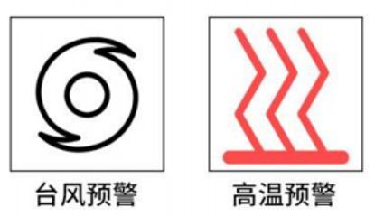
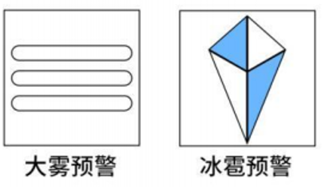
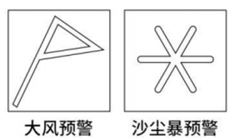
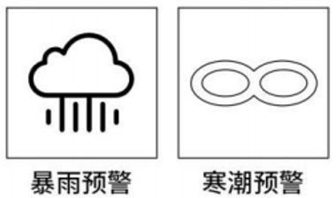

# 2022年福建省公务员录用考试《行测》题（网友回忆版）

> 常识判断 · 16 题 · 福建 2022

## 第 1 题　qid 5101859 · 人文常识

“十四五”时期是我国生态文明建设的关键时期，下列关于这一时期重点任务和战略方向的说法不准确的是（    ）。

- **A**. 以降碳为重点战略方向
- **B**. 推动减污降碳协同增效
- **C**. 促进经济社会全面高速发展　✅
- **D**. 实现生态环境质量改善由量变发展到质变

**答案**：C

**官方解析**

本题考查政治常识。
C项错误，A、B、D三项正确，2021年4月30日，中共中央总书记习近平在十九届中共中央政治局第二十九次集体学习时强调：“‘十四五’时期，我国生态文明建设进入了以降碳为重点战略方向、推动减污降碳协同增效、促进经济社会发展全面绿色转型、实现生态环境质量改善由量变到质变的关键时期。”
本题为选非题，故正确答案为C。

---

## 第 2 题　qid 5101866 · 科技常识

实现碳达峰碳中和目标，是贯彻新发展理念、构建新发展格局、推动高质量发展的内在要求。下列关于“双碳”工作的说法错误的是（    ）。

- **A**. 推进“双碳”工作是破解资源环境约束突出问题、实现可持续发展的迫切需要
- **B**. 要倡导简约适度、绿色低碳、文明健康的生活方式，引导绿色低碳消费，鼓励绿色出行
- **C**. 推进“双碳”工作，必须坚持全国统筹、节约优先、双轮驱动、内外畅通、防范风险的原则
- **D**. 要坚决遏制钢铁、有色、石化、化工、建材等高耗能、高排放、低水平项目发展，严把新上项目的碳排放关　✅

**答案**：D

**官方解析**

本题考查政治常识。
2022年1月，习近平主持中共中央政治局第三十六次集体学习并发表重要讲话。
A项正确，习近平总书记在讲话中指出：“党的十八大以来，党中央贯彻新发展理念，坚定不移走生态优先、绿色低碳发展道路······推进‘双碳’工作是破解资源环境约束突出问题、实现可持续发展的迫切需要，是顺应技术进步趋势、推动经济结构转型升级的迫切需要，是满足人民群众日益增长的优美生态环境需求、促进人与自然和谐共生的迫切需要，是主动担当大国责任、推动构建人类命运共同体的迫切需要。”
B、C两项正确，习近平总书记在讲话中指出：“推进‘双碳’工作，必须坚持全国统筹、节约优先、双轮驱动、内外畅通、防范风险的原则，更好发挥我国制度优势、资源条件、技术潜力、市场活力，加快形成节约资源和保护环境的产业结构、生产方式、生活方式、空间格局。第一，加强统筹协调······第二，推动能源革命······第三，推进产业优化升级······巩固和提升生态系统碳汇能力。要倡导简约适度、绿色低碳、文明健康的生活方式，引导绿色低碳消费，鼓励绿色出行······第四，加快绿色低碳科技革命······第五，完善绿色低碳政策体系。”
D项错误，习近平在讲话中指出：“推进‘双碳’工作，必须坚持全国统筹······要严把新上项目的碳排放关，坚决遏制高耗能、高排放、低水平项目盲目发展。要下大气力推动钢铁、有色、石化、化工、建材等传统产业优化升级，加快工业领域低碳工艺革新和数字化转型。要加大垃圾资源化利用力度，大力发展循环经济，减少能源资源浪费。”故强调坚决遏制高耗能、高排放、低水平项目盲目发展。
本题为选非题，故正确答案为D。

---

## 第 3 题　qid 5101985 · 科技常识

“神舟”系列载人飞船是我国载人航天工程的重要组成部分。下列关于“神舟”系列载人飞船的说法正确的是（    ）。

- **A**. 2011年神舟八号完成我国首次载人空间交会对接
- **B**. 2021年神舟十三号执行空间站阶段首次载人飞行任务
- **C**. 神舟一号至神舟十四号载人飞船均在甘肃酒泉发射升空　✅
- **D**. 2003年神舟五号成功将我国首位航天员聂海胜送入太空

**答案**：C

**官方解析**

本题考查政治常识。
A项错误，神舟八号，为中国载人航天工程发射的第八艘飞船，是中国首次进行交会对接航天飞行任务。2011年11月1日神舟八号飞船发射升空，进入预定轨道；于2011年11月3日与天宫一号完成刚性连接，形成了组合体；于2011年11月17日返回舱降落于内蒙古中部地区的主着陆场区，完成对接任务。神舟九号飞船是中国航天计划中的一艘载人宇宙飞船，2012年6月16日18时37分21秒在酒泉卫星发射中心点火发射升空，2012年6月18日14时左右与天宫一号实施自动交会对接，这是中国实施的首次载人空间交会对接。
B项错误，神舟十三号，为中国载人航天工程发射的第十三艘飞船，2021年10月16日0时23分，搭载神舟十三号载人飞船的长征二号F遥十三运载火箭，在酒泉卫星发射中心按照预定时间精准点火发射；10月16日6时56分，神舟十三号载人飞船与空间站组合体完成自主快速交会对接；11月7日18时51分，航天员先后从天和核心舱节点舱成功出舱。神舟十二号，为中国载人航天工程发射的第十二艘飞船，是空间站关键技术验证阶段第四次飞行任务，也是空间站阶段首次载人飞行任务。
C项正确，神舟飞船是中国自行研制，具有完全自主知识产权，达到或优于国际第三代载人飞船技术的飞船，飞船结构分为：轨道舱、返回舱、推进舱、附加段四部分，发射基地是酒泉卫星发射中心。
D项错误，神舟五号，是在无人飞船的基础上研制的我国第一艘载人飞船，乘有1名航天员：杨利伟，在轨道运行了1天。此次飞行标志着中国成为第三个有能力独自将人送上太空的国家，打破了由美国和前苏联（俄罗斯）在载人航天领域的独霸局面，提高了我国的国际地位。
故正确答案为C。

---

## 第 4 题　qid 5101750 · 人文常识

下列有关爱国精神和民族气节的诗词按其时间先后顺序排列正确的是：
①位卑未敢忘忧国，事定犹须待阖棺
②苟利国家生死以，岂因祸福避趋之
③人生自古谁无死，留取丹心照汗青
④先天下之忧而忧，后天下之乐而乐
⑤保国者，其君其臣肉食者谋之；保天下者，匹夫之贱与有责焉耳矣

- **A**. ④①③⑤②　✅
- **B**. ③④①②⑤
- **C**. ④②⑤③①
- **D**. ①②④⑤③

**答案**：A

**官方解析**

本题考查人文常识。
①“位卑未敢忘忧国，事定犹须待阖棺”出自南宋诗人陆游的《病起书怀》。此诗是作者被免官后于淳熙三年（1176年）在成都所作，表达了诗人的爱国情怀以及忧国忧民之心。
②“苟利国家生死以，岂因祸福避趋之”出自清代林则徐的《赴戍登程口占示家人》。1842年，林则徐被遣戍新疆伊犁，在西安与家人告别时作了此诗，表达了林则徐强烈的爱国之心。
③“人生自古谁无死，留取丹心照汗青”出自南宋文天祥的《过零丁洋》。南宋末年，文天祥在潮州与元军作战时被俘，次年（1279年）途经零丁洋时写下了此诗，表达了诗人慷慨激昂的爱国热情和视死如归的高风亮节。
④“先天下之忧而忧，后天下之乐而乐”出自北宋范仲淹的《岳阳楼记》，是范仲淹应好友巴陵郡太守滕子京之请，于北宋庆历六年（1046年）为重修岳阳楼而创作的一篇散文。
⑤“保国者，其君其臣肉食者谋之；保天下者，匹夫之贱与有责焉耳矣”出自明末清初顾炎武的《日知录·正始》，后梁启超将其概括为“天下兴亡，匹夫有责”八个字。顾炎武是明末清初的杰出的思想家，与黄宗羲、王夫之并称为明末清初“三大启蒙思想家”。
故按其时间先后顺序排列正确的是④①③⑤②。
故正确答案为A。

---

## 第 5 题　qid 5101895 · 人文常识

下列语句与其作者的对应关系正确的有几项？
①要恢复民族的地位，便先要恢复民族的精神——孙中山
②我自横刀向天笑，去留肝胆两昆仑——谭嗣同
③面壁十年图破壁，难酬蹈海亦英雄——周恩来
④如烟往事俱忘却，心底无私天地宽——陶铸

- **A**. 1
- **B**. 2
- **C**. 3
- **D**. 4　✅

**答案**：D

**官方解析**

本题考查人文常识。
①正确，纪念辛亥革命110周年大会于2021年10月9日在人民大会堂举行，习近平总书记出席大会并发表重要讲话。他强调：“辛亥革命110年来的历史启示我们，实现中华民族伟大复兴，中国人民和中华民族必须同舟共济，依靠团结战胜前进道路上一切风险挑战。孙中山先生说过：‘要恢复民族的地位，便先要恢复民族的精神。’近代以来，中国人民和中华民族弘扬伟大爱国主义精神，心聚在了一起、血流到了一起，共同书写了抵御外来侵略、推翻反动统治、建设人民国家、推进改革开放的英雄史诗。”
②正确，“我自横刀向天笑，去留肝胆两昆仑”出自近代政治家、思想家谭嗣同在狱中所作的七言绝句《狱中题壁》，意思是：即使屠刀架在了脖子上，我也要仰天大笑，出逃或留下来的同志们，都是昆仑山一样的英雄好汉。
③正确，“面壁十年图破壁，难酬蹈海亦英雄”出自周恩来的《无题》，意思是：用十年苦功，学成以后要回国干一番事业，挽救中国。即使理想无法实现，投海殉国也是英雄。
④正确，“如烟往事俱忘却，心底无私天地宽”出自陶铸的《赠曾志》，意思是：往事犹如过眼云烟，都忘记吧，心里没有私心，这样人生的天地才宽阔无边。
综上所述，对应关系正确的有4项。
故正确答案为D。

---

## 第 6 题　qid 5101643 · 人文常识

下列关于文化遗址、出土文物和遗址所在地对应关系正确的是：

- **A**. 仰韶村遗址——人面鱼纹彩陶盆——湖南
- **B**. 龙山文化遗址——中华第一龙——山东
- **C**. 殷墟遗址——后母戊大方鼎——河南　✅
- **D**. 三星堆遗址——青铜神树——重庆

**答案**：C

**官方解析**

本题考查人文常识。
A项错误，人面鱼纹彩陶盆一般指新石器时代人面鱼纹彩陶盆，于1955年出土于陕西省西安市半坡。仰韶文化遗址，位于河南省三门峡市渑池县城北9公里处的仰韶村。仰韶文化距今大约7000年左右，是中国新石器时代彩陶最丰盛繁华的时期。
B项错误，“中华第一龙”是指1971年内蒙古赤峰市博物馆从三星他拉村征集的青玉大龙，属于红山文化的代表玉器。龙山文化遗址，位于山东省济南市章丘区龙山街道附近，距今约4000-4600年。注：1987年在位于河南省濮阳县城西水坡仰韶文化址中发现一条由贝壳砌成的龙，也被称为“中华第一龙”。
C项正确，后母戊大方鼎又称司母戊大方鼎，是商后期（约前十四世纪至前十一世纪）铸品，于1939年出土于河南省安阳市武官村。武官村位于安阳市西北3千米的洹河北岸、殷城宫殿宗庙区和王陵区之间，属于殷墟遗址重点保护区。
D项错误，青铜神树一般指商青铜神树，1986年在四川省广汉市三星堆遗址二号祭祀坑出土，现藏于三星堆博物馆。
故正确答案为C。

---

## 第 7 题　qid 5101986 · 人文常识

下列画家与其作品的对应关系不正确的是：

- **A**. 德国画家米勒——《拾穗者》　✅
- **B**. 元代画家赵孟頫——《秋郊饮马图》
- **C**. 西班牙画家毕加索——《格尔尼卡》
- **D**. 五代南唐画家顾闳中——《韩熙载夜宴图》

**答案**：A

**官方解析**

本题考查人文常识。
A项错误，《拾穗者》是法国巴比松派画家让·弗朗索瓦·米勒于1857年创作的一幅布面油画，现存放在巴黎的奥塞美术馆中。该画描绘了农村秋季收获后，人们从地里拣拾剩余麦穗的情景。
B项正确，《秋郊饮马图》是元代画家赵孟頫创作的绢本设色画，现收藏于北京故宫博物院。此幅作品描绘的是初秋时节，牧马人在荒野牧马的情景。
C项正确，《格尔尼卡》是西班牙立体主义画家帕勃洛·鲁伊斯·毕加索于20世纪30年创作的一幅巨型油画。该画以法西斯纳粹轰炸西班牙北部巴斯克的重镇格尔尼卡为主题，表现了法西斯战争给人类的灾难。
D项正确，《韩熙载夜宴图》是五代十国时期南唐画家顾闳中的绘画作品，描绘了官员韩熙载家设夜宴载歌行乐的场面。此画描绘的是一次完整的韩府夜宴过程，即琵琶演奏、观舞、宴间休息、清吹、欢送宾客五段场景。
本题为选非题，故正确答案为A。

---

## 第 8 题　qid 5101993 · 人文常识

下列关于明代郑和下西洋的说法错误的是：

- **A**. 两次到达非洲，增进了中非人民的友谊　✅
- **B**. 使南亚各个国家第一次对中国有了认识
- **C**. 基本打通了中国沿海通往印度半岛的航线
- **D**. 在满剌加建立仓库，作为远航途中的中转站

**答案**：A

**官方解析**

本题考查人文常识。
郑和下西洋是明代永乐、宣德年间的一场海上远航活动，首次航行始于永乐三年（1405年），末次航行结束于宣德八年（1433年），共计七次。
A项错误，郑和七次下西洋，分别是第四、五、六、七次到达非洲，最远到达红海沿岸和非洲东海岸。第四次下西洋于永乐十一年（1413年）出发，船队首次绕过阿拉伯半岛，航行东非麻林迪（肯尼亚）。第五次下西洋，永乐十五年五月（1417年6月）出发，最远到达东非木骨都束、卜喇哇、麻林等国家；第六次下西洋，永乐十九年正月三十日（1421年3月3日）出发，到达国家及地区有占城、暹罗、忽鲁谟斯、阿丹、祖法儿、刺撒、不刺哇、木骨都束等；第七次下西洋，宣德五年闰十二月初六（1431年1月）出发，返航后，郑和因劳累过度于宣德八年（1433年）四月初在印度西海岸古里去世。
B项正确，早在汉唐时期，中国就与南亚地区有了人员上的往来，但大多为通商或游历，缺乏真正的认识和了解。明朝初期，郑和历时28年先后七次下西洋，将先进的中华物质文化、精神文化、政教文化等远播海外。同时，南亚诸国不断以国家之名遣使来华，加强了互相间的政治，经济，文化交往。因此，可以说郑和下西洋使得南亚各个国家第一次对中国有了认识。
C项正确，1411年，郑和第三次远洋归来，19个国家的使节随同他一起到明朝来访问，明朝的对外关系达到了一个高潮。郑和三下西洋基本打通了中国沿海通往印度半岛的航线，为了进一步打通去往波斯湾各国的航路，1413年，明成祖又派郑和第四次远航，横渡印度洋，前往波斯湾。
D项正确，1405年，郑和率领船队，带着大量的丝绸、瓷器、粮食等物资，开始了第一次远航。这次远航途经满剌加（今马六甲），最终到达印度半岛西南著名的大商港的古里（今卡利卡特）。在满剌加和古里，他受到了两地国王的欢迎，宣读了明朝皇帝的国书，向两位国王赠送了礼物，并分别在两国立碑纪念。郑和还在满剌加建立了仓库，存放货物，作为远航途中的一个中转站。
本题为选非题，故正确答案为A。
注：此题题目设置有误，B项说法存在争议，A项错误更明显。

---

## 第 9 题　qid 5101915 · 科技常识

下列关于能量与温度之间关系的说法正确的是：

- **A**. 亘古不化的冰山没有能量
- **B**. 温度高的物体其能量一定也高
- **C**. 绕地卫星在近地点时的势能最大
- **D**. 水被用来做汽车冷凝剂是因为其比热容较大　✅

**答案**：D

**官方解析**

本题考查科技常识。
能量是物质所具有的基本物理属性之一，可以用来表征物理系统做功的本领，以多种不同的形式存在。按照物质的不同运动形式分类，能量可分为机械能、化学能、热能、电能、辐射能、核能等。这些不同形式的能量之间可以通过物理效应或化学反应而相互转化。
A项错误，一切物体，不论温度高低，都具有内能。炙热的铁水具有内能；冰冷的冰块，温度虽然低，其中的水分子仍然在做热运动，所以也具有内能。因此，冰山是有内能的。
B项错误，内能的大小与物体的质量、温度、状态等有关，单比较物体的温度不能判断内能的大小。
C项错误，人造卫星绕地球运行时，在近地点势能最小，在远地点势能最大，从远地点向近地点运行的过程中，动能增大，势能减小。
D项正确，水的比热容大，升高相同的温度时，吸收的热量多，所以能很好地降低温度。而汽车发动机工作时产生大量热量，所以利用水的比热容大的特点，把这些热量迅速吸收，使发动机的温度不致升得太高。
故正确答案为D。

---

## 第 10 题　qid 5101630 · 人文常识

下列诗句所描述的现象与其原理对应正确的有几项：
①飞流直下三千尺——能量守恒定律
②满架蔷薇一院香——分子的运动
③潭清疑水浅——光沿直线传播
④长河落日圆——光的反射

- **A**. 1
- **B**. 2　✅
- **C**. 3
- **D**. 4

**答案**：B

**官方解析**

本题考查科技常识。
①正确，能量守恒定律是指能量既不会凭空产生，也不会凭空消失，它只会从一种形式转化为另一种形式，或者从一个物体转移到其它物体，而能量的总量保持不变。“飞流直下三千尺”意思是高崖上飞腾直落的瀑布好像有几千尺，水从高处落下，重力势能转换为动能，符合能量守恒定律。
②正确，分子的运动是指分子永不停息地做无规则运动。“满架蔷薇一院香”意思是满架蔷薇惹得一院芳香，是因为蔷薇花香中含有的分子是在不断运动的，向四周扩散，使人们闻到蔷薇花香，符合分子的运动。
③错误，“潭清疑水浅”意思是潭水清澈见底，感觉潭水很浅，原因是光线发生折射，当光线从水中斜射入空气中时，折射光线会远离法线，因此，人会感觉池底的位置上升，潭水变浅，与光沿直线传播无关。
④错误，“长河落日圆”意思是无尽黄河上落日浑圆，诗人观察到的落日并不是太阳的实际位置，而是光线经过不均匀的大气时发生了折射形成的虚像，太阳的实际位置在地平线以下。
故①②对应正确，③④对应错误。
故正确答案为B。

---

## 第 11 题　qid 5101807 · 人文常识

下列现象中光的性质与其他三项不同的是：

- **A**. 物体经过小孔能够成倒立的像　✅
- **B**. 肥皂泡在阳光下呈现出彩色条纹
- **C**. 观看立体电影时需要佩戴3D眼镜
- **D**. 光线经过不透光圆屏会在中心轴线上形成亮斑

**答案**：A

**官方解析**

本题考查科技常识。
A项错误，用一个带有小孔的板遮挡在墙体与物之间，墙体上就会形成物的倒立的实像，这就是小孔成像现象。前后移动中间的板，墙体上像的大小也会随之发生变化，这种现象说明了光沿直线传播的性质。光具有波粒二相性，光沿直线传播是光的粒子性的体现。
B项正确，当太阳光照射在肥皂膜的表面时，会分别被薄膜的上、下两个表面反射。如此，一束光就变为两束相互干涉的反射光线。由于肥皂膜在各处的厚度并不均匀，阳光中的7种单色光在肥皂膜厚度不同的地方，就会出现有的会加强，有的会减弱，有的甚至会相互抵消。就这样，肥皂膜把阳光分解，呈现出五颜六色的图案。体现的是光的干涉现象，是光的波动性的体现。
C项正确，3D眼镜即立体眼镜，立体眼镜的左眼和右眼分别装上横偏振片和纵偏振片，横偏振光只能通过横偏振片，纵偏振光只能通过纵偏振片。这样就保证了左边相机拍摄的东西只能进入左眼，右边相机拍摄到的东西只能进入右眼，于是乎就立体了。体现的是光的偏振现象，是光的波动性的体现。
D项正确，当单色光照射在直径恰当的小圆板或圆珠时，会在之后的光屏上出现环状的互为同心圆的衍射条纹，并且在所有同心圆的圆心处会出现一个极小的亮斑，这个亮斑就被称为泊松亮斑。体现的是光的衍射现象，是光的波动性的体现。
本题为选非题，故正确答案为A。

---

## 第 12 题　qid 5101974 · 人文常识

下列关于冰的说法错误的是：

- **A**. 
战国青铜冰鉴被称为“世界上最早的冰箱”

- **B**. 
在常压环境下，水冻结成冰时，体积会增大

- **C**. 
天然冰中水分子结合是按六方晶系规则排列起来的

- **D**. 
用电灯的强光照射冰，其外部会融化出现雪结晶的形状
　✅

**答案**：D

**官方解析**

本题考查科技常识。

A项正确，战国青铜冰鉴是战国时期青铜酒器，出土于湖北省随州市擂鼓墩曾侯乙墓，被称为“世界上最早的冰箱”。青铜冰鉴由方鉴和方缶两部分组成，方缶置于方鉴正中，组合为一个整体。夏季，在鉴和缶之间装上冰，缶内装酒，可使酒凉，起到“冰箱”的作用。

B项正确，冰的密度比液态水的密度小，所以冰能漂浮在水面上。在常压环境下水结冰的温度是，当水冻结成冰时，体积会增大。

C项正确，天然冰中水分子的结合是按六方晶系的规则排列起来的。所谓结晶格子，最简单的例子是紧密地堆砌的砖块，如果在这些砖块的中心处代之以一个假设的原子，便得到了一个结晶格子。冰的晶格为一个带顶锥的三棱柱体，六个角上的氧原子分别为相邻六个晶胞所共有。三个棱上氧原子各为三个相邻晶胞所共有，二个轴顶氧原子各为二个晶胞所共有，只有中央一个氧原子算是该晶胞所独有。

D项错误，如果用电灯等的强光照射，冰的内部就会融化，浮现出称为“冰花”的类似雪结晶的形状。因此是内部融化，而非外部。

本题为选非题，故正确答案为D。

---

## 第 13 题　qid 5101689 · 科技常识

我国古代历史上有许多发明制造，其中一些被视为人工智能在中国的历史渊源。下列有关说法错误的有几项？
①算盘——古代十进制机械式手动计算器
②八卦——古代二进制编码逻辑推理预测器
③候风地动仪——地震方位自动检测与微震敏感报警器
④水运仪象台——重力驱动的天文观测与星象分析设备

- **A**. 1　✅
- **B**. 2
- **C**. 3
- **D**. 4

**答案**：A

**官方解析**

本题考查科技常识。
①正确，算盘是一种手动操作计算辅助工具形式。一般的算盘多为木制（或塑料制品），矩形木框内排列一串串等数目的算珠称为档，中有一道横梁把珠分隔为上下两部分，上半部每算珠代表5，下半部每算珠代表1。算盘是混合进制，包含三种进制形式：下面的珠子满5进1进到上面的珠子是五进制，上面的珠子满2进1进到前面一位下面的珠子是二进制，后面一位整体满10进1进到前面一位是十进制。因此可以说算盘是一种古代十进制机械式手动计算器。
②正确，八卦是一种二进制数据。根据二进制数的规定：有，用1表示；无，用0表示。我们可以得出八卦各卦阳爻和阴爻的二进制数。八卦各卦阳爻的二进制数（即有阳爻为1，无阳爻为0）有坤：黑黑黑，卦符阴阴阴，二进制数为000；艮：黑黑白，卦符阴阴阳，二进制数为001等。因此可以说八卦是一种古代二进制编码逻辑推理预测器。
③正确，候风地动仪是世界上第一架测验地震的仪器，由中国东汉时期的科学家张衡发明于汉顺帝时期，《后汉书·张衡传》详细记载了张衡的这一发明。候风地动仪里面有精巧的结构，主要为中间的都柱和它周围的八套牙机装置。候风装置候风摆的周围与8组牙机机械装置之一部关相互靠近。此处为底座上的沟槽，叫八道。工作原理是候风摆运动到关的位置触发牙机。在樽的外面相应地设置8个龙首，口含小铜丸，每个龙头下面都有一只蟾蜍张口向上。如果有地震被检测，都柱之内候风摆则轻微摆动，此即可触发牙机。使相应的龙口张开，小铜珠即落入蟾蜍口中，由此便可知道地震发生的时间和方向。因此可以说候风地动仪是一种地震方位自动检测与微震敏感报警器。
④错误，水运仪象台是水力驱动的天文观测与星象分析设备，是北宋时期苏颂、韩公廉等人发明制造的以漏刻水力驱动的，集天文观测、天文演示和报时系统为一体的大型自动化天文仪器。标志着中国古代天文仪器制造史上的高峰，被誉为是世界上的最早的天文钟。
综上，错误的有1项。
本题为选非题，故正确答案为A。

---

## 第 14 题　qid 5101704 · 地理国情

下列关于自然现象的说法错误的是：

- **A**. 拉尼娜现象表现为赤道太平洋中东部海水大范围持续异常变冷
- **B**. 龙卷风是一种强对流天气，主要出现在中纬度地区的春季和夏季
- **C**. 凌汛是冰凌对水流产生阻力而引起的江河水位明显上涨的水文现象
- **D**. 霾是大气中因悬浮的水汽凝结而导致能见度低于1千米的天气现象　✅

**答案**：D

**官方解析**

本题考查地理国情。
A项正确，拉尼娜现象就是太平洋中东部海水异常变冷的情况。东南信风将表面被太阳晒热的海水吹向太平洋西部，西部海水温度增高，气压下降，潮湿空气积累形成台风和热带风暴，东部底层海水上翻，致使东太平洋海水变冷。
B项正确，龙卷风是发生于直展云系底部和下垫面之间的直立空管状旋转气流。龙卷风主要出现在中纬度地区。一般发生在春夏过渡季节或夏秋之交（4至10月），以前者居多。
C项正确，凌汛是冰凌堵塞河道，对水流产生阻力而引起的江河水位明显上涨的水文现象。水面结冰的河道，上游河冰先融，下游河道尚未解冻，易出现“凌汛”。
D项错误，雾是由大量悬浮在近地面空气中的微小水滴或冰晶组成的、能见度降低到1千米以内的自然现象。霾又称灰霾，是大量极细微的干尘粒等均匀地浮游在空中，使水平能见度小于10千米的空气普遍有混浊现象，使远处光亮物微带黄、红色，使黑暗物体微带蓝色。
本题为选非题，故正确答案为D。

---

## 第 15 题　qid 5101889 · 人文常识

下列关于气象预警信号的对应关系正确的是：

- **A**. 

- **B**. 

　✅
- **C**. 

- **D**. 

**答案**：B

**官方解析**

本题考查地理国情。

A项错误，台风预警信号样式为，高温预警信号样式为，为干旱预警信号。

B项正确，大雾预警信号样式为，冰雹预警信号样式为。

C项错误，大风预警信号样式为，沙尘暴预警信号样式为，为暴雪预警信号。

D项错误，暴雨预警信号样式为，寒潮预警信号样式为，为霾预警信号。

故正确答案为B。

---

## 第 16 题　qid 5101858 · 地理国情

下列关于滑坡的说法错误的是：

- **A**. 滑动过程中，滑坡体内各物质组成部分的相对位置基本不变
- **B**. 地下水浸入滑坡体后，能够增加滑坡体的重量，加大下滑力
- **C**. 山区河流的凹岸受流水侵蚀，易使斜坡上部软弱面产生滑坡
- **D**. 产生滑坡的基本条件是有坡，坡度越大越有利于滑坡的形成　✅

**答案**：D

**官方解析**

本题考查地理国情。
A项正确，滑坡是指斜坡上岩、土体，由于环境的改变或影响，在以重力为主的力的作用下，沿着一定的滑动面（带）整体下滑，其主滑段的垂直位移与水平位移之比与滑动带倾斜值一致的坡体变形。发生变形破坏的岩土体以水平位移为主，除滑坡体边缘存在为数较少的崩离碎块和翻转现象外，滑坡体上各部分的相对位置在滑动前后基本不变。
B项正确，地下水对滑坡的影响体现在：一方面，地下水会直接增加滑坡体的重量，增大边坡下滑力；另一方面，地下水会润滑和软化土体，降低边坡滑动面处岩体的力学参数，减小抗滑力，致使滑坡发生。
C项正确，河流一开始流动，便会受到地转偏向力的影响，发生偏转（北半球向右、南半球向左）。偏转的河流便会冲蚀河岸，使之慢慢凹进去，变为凹岸。同时在另一岸的河水流速较慢，发生沉积，变为凸岸。凹岸受流水侵蚀，斜坡土地强度降低，形成软弱面，易发生滑坡。
D项错误，凡是有斜坡的地方就有可能产生滑坡，滑坡发生的有利地形是山区。下陡中缓上陡、上部成环状的坡形有利于发生滑坡。据统计，坡度大于10度、小于45度的斜坡发生滑坡的可能性最大。
本题为选非题，故正确答案为D。

---
