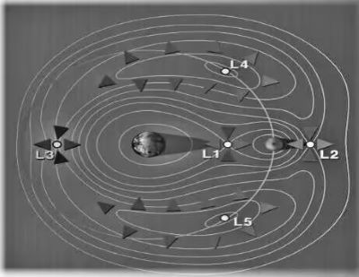

# 2023年吉林省公务员录用考试《行测》题（网友回忆版）

> 常识判断 · 11 题 · 吉林 2023

## 第 1 题　qid 5509641 · 法律常识

中华优秀传统法律文化是全国依法治国的重要思想渊源，下列法治思想、法治实践与传统法律文化观念对应不恰当的是：

- **A**. 坚持依法治国、依法执政、依法行政——人法兼资，而天下之治成　✅
- **B**. 坚持以人民为中心的法治价值取向——民惟邦本，本固邦宁
- **C**. 坚持中国特色社会主义法治道路——观俗立法则治，察国事本则宜
- **D**. 坚持全国推进科学立法、严格执法、公正司法、全民守法——法立，有犯而必施

**答案**：A

**官方解析**

本题考查法律常识。
A项错误，“人法兼资，而天下之治成”，出自明代海瑞的《治黎策》，大意是治理国家的法律法规由人制定，也需要信仰法治、坚守法治，知法、懂法、守法、护法的执法者才能发挥作用。人和法律同等重要，不可或缺，两者齐备，国家才能成功治理。这句话体现了建设一支高素质政法队伍的重要性。与坚持依法治国、依法执政、依法行政无关。
B项正确，“民惟邦本，本固邦宁”，出自《尚书·五子之歌》，是指百姓应该是国家的根本，只有根本稳固，国家才能安宁。这与坚持以人民为中心的法治价值取向相吻合。
C项正确，“为国也，观俗立法则治，察国事本则宜”，出自《商君书》的《算地》篇，大意是治理国家，只有在充分考察风俗的基础上，才能制定合适的法规；只有在弄清国情的基础上，才能抓住国家的根本任务。这与坚持中国特色社会主义法治道路相吻合。
D项正确，“法立，有犯而必施；令出，唯行而不返”，其意为法律一经制定，凡有违犯者，必须实施惩治；法令一经发出，只有坚决执行，决不能违反。既指出了法律运行的流程，也强调了法的严肃性及建立法律威信的重要性。这与坚持全国推进科学立法、严格执法、公正司法、全民守法相吻合。
本题为选非题，故正确答案为A。

---

## 第 2 题　qid 5509642 · 法律常识

根据《中华人民共和国反电信网络诈骗法》，下列行为没有违背法律规定的是：

- **A**. 某电信营业厅未对办理电话卡的用户进行真实身份信息登记
- **B**. 某网络公司拒绝为没有提供真实身份信息的用户安装网络　✅
- **C**. 某市民自愿将自己的电话卡出借给朋友使用
- **D**. 某银行为存在异常开户情形的客户开立账户

**答案**：B

**官方解析**

本题考查法律常识。
A项错误，《中华人民共和国反电信网络诈骗法》第九条第一款规定：“电信业务经营者应当依法全面落实电话用户真实身份信息登记制度。”
B项正确，《中华人民共和国反电信网络诈骗法》第二十一条第一项规定：“电信业务经营者、互联网服务提供者为用户提供下列服务，在与用户签订协议或者确认提供服务时，应当依法要求用户提供真实身份信息，用户不提供真实身份信息的，不得提供服务：（一）提供互联网接入服务。”
C项错误，《中华人民共和国反电信网络诈骗法》第三十一条第一款规定：“任何单位和个人不得非法买卖、出租、出借电话卡、物联网卡、电信线路、短信端口、银行账户、支付账户、互联网账号等，不得提供实名核验帮助；不得假冒他人身份或者虚构代理关系开立上述卡、账户、账号等。”
D项错误，《中华人民共和国反电信网络诈骗法》第十五条规定：“银行业金融机构、非银行支付机构为客户开立银行账户、支付账户及提供支付结算服务，和与客户业务关系存续期间，应当建立客户尽职调查制度，依法识别受益所有人，采取相应风险管理措施，防范银行账户、支付账户等被用于电信网络诈骗活动。”第十六条第二款规定：“对经识别存在异常开户情形的，银行业金融机构、非银行支付机构有权加强核查或者拒绝开户。”题中，对于存在异常开户情形的客户，银行应加强核查或拒绝开户，不得直接开户。
故正确答案为B。

---

## 第 3 题　qid 5509643 · 人文常识

中国画，简称“国画”，在世界美术领域内自成独特体系。下列关于中国画的说法不正确的是：

- **A**. 中国画在技法上可分为工笔画和写意画
- **B**. 诗意画主要特点是画中有诗，诗中有画
- **C**. 山水画通过留影与意境实现情与景统一
- **D**. 水墨画是在黑、白、灰三种颜色上点彩　✅

**答案**：D

**官方解析**

本题考查人文常识。
A项正确，中国画，简称“国画”，它是用毛笔、墨和颜料在特制的宣纸或绢上作画，题材主要有人物、山水、花鸟，技法可分工笔和写意两种，富于传统特色。
B项正确，诗意画是以特定的单一诗文为题材，表达诗文内涵与意趣的绘画，通过画家对诗歌蕴意的理解，将抽象隐晦的诗歌意像转换为具体形象的视觉图像，并以此扩大诗文的流传途径。
C项正确，山水画强调留影与意境。所谓留影，即反对“谨毛而失貌”，主张总体把握；所谓意境，即把表达来自生活的情思放在主导地位，实现情与景的统一。
D项错误，水墨画是指水和墨调成墨色作画的画种。墨为主要原料加以清水的多少引为浓墨、淡墨、干墨、湿墨、焦墨等，画出不同浓淡（黑、白、灰）层次。
本题为选非题，故正确答案为D。

---

## 第 4 题　qid 5509628 · 人文常识

下列描写思念的成语与其所适用的思念对象对应不正确的是：

- **A**. 莼鲈之思——故乡
- **B**. 蒹葭之思——恋人
- **C**. 霜露之思——兄弟　✅
- **D**. 云树之思——朋友

**答案**：C

**官方解析**

本题考查人文常识。
A项正确，“莼鲈之思”出自《晋书·张翰传》，相传晋朝的文学家张翰当时在洛阳做官，因见秋风起，思念家乡的莼羹、鲈鱼脍，便毅然弃官回乡，后来文人常以“莼鲈之思”借指思乡之情。
B项正确，“蒹葭之思”出自 《诗经·秦风·蒹葭》：“蒹葭苍苍，白露为霜，所谓伊人，在水一方。”指恋人的思念之情。
C项错误，“霜露之思”出自《礼记·祭义》：“霜露既降，君子履之，必有凄怆之心，非其寒之谓也。”指对父母或先祖的思念。
D项正确，“云树之思”出自杜甫《春日忆李白》：“渭北春天树，江东日暮云。”此诗抒发了作者对李白的赞誉和怀念之情，后用“云树之思”借指朋友阔别后的相思之情。
本题为选非题，故正确答案为C。

---

## 第 5 题　qid 5509629 · 人文常识

“大雪兆丰年”是一句流传极广的农谚，意思是冬天下几场雪，是来年庄稼能获得丰收的预兆，这不仅是我国先民农业生产的经验总结，而且具有充分的科学依据，下列关于“大雪兆丰年”的理解正确的是：

- **A**. “冬天麦盖三层被，来年枕着馒头睡”说明雪融化时可以冻死害虫
- **B**. “冬雪消除四边草，来年肥多害虫少”说明大雪能为越冬作物保暖
- **C**. “大雪半融加一冰，来年病虫发生轻”说明大雪能为土壤补充养料
- **D**. “雪多下，麦不差”说明雪融化为土壤补充水分，防止农作物干旱　✅

**答案**：D

**官方解析**

本题考查科技常识。
A项错误，“冬天麦盖三层被，来年枕着馒头睡"意思是今年冬天如果下了厚厚的雪，那么麦苗上就有好几层的雪，来年就可以丰收。这是因为大雪覆盖冬小麦时可以起到很好的保温作用，使冬小麦免受冻害。 
B项错误，“冬雪消除四边草，来年肥多害虫少”意思是冬天下雪可以冻死不少的杂草，还可以冻死害虫，这样杂草跟害虫都可以做肥料了，来年自然庄稼长势就会好了。主要是强调大雪能冻死害虫和杂草。
C项错误，“大雪半融加一冰，来年病虫发生轻”意思是如果大雪期间下雪，融化的过程中结冰的话，那么地里的虫卵就会被冻死，来年庄稼长得就好，不会遭受病虫害的影响。主要强调大雪能冻死害虫。 
D项正确，“雪多下，麦不差”意思是今年雨雪量大，明年的麦子会长得很好。雪融化后可以为土壤补充水分，还可以为冬小麦提供充足的水份，防止冬小麦干旱。
故正确答案为D。

---

## 第 6 题　qid 5509631 · 人文常识

下列道地药材与其生产地，功效对应均正确的是：

- **A**. 人参——吉林——大补元气，宁神益智　✅
- **B**. 贝母——广东——养血润肺，化痰止咳
- **C**. 三七——云南——补肾益精，养肝明目
- **D**. 枸杞——宁夏——散瘀止血，消肿定痛

**答案**：A

**官方解析**

本题考查科技常识。
A项正确，人参是多年生草本植物，喜阴凉、湿润的气候。主产于吉林、辽宁、黑龙江地区。人参具有很好的药用价值，常被用作滋补的药，具有调节中枢神经系统、大补元气、改善心脏功能等功效。
B项错误，贝母为多年生草本植物，其干燥鳞茎供药用。贝母主要分布于北半球温带地区，在中国除广东、广西、福建、台湾、江西、内蒙古、贵州（内蒙古、贵州可能有，但没有采到标本）外，其他省区均有分布，其中以四川（8种）和新疆（6种）种类最丰富。贝母具有润肺止咳、清火散结等功效。
C项错误，三七为多年生草本植物，其干燥根供药用。主产于云南文山州各县，为著名的道地药材；具有化瘀止血，活血定痛的功效。
D项错误，枸杞为茄科枸杞属植物。人们日常食用和药用的枸杞多为宁夏枸杞的果实“枸杞子”。宁夏枸杞在中国栽培面积最大，主要分布在中国西北地区。枸杞具有滋补肝肾，益精明目的功效。
故正确答案为A。

---

## 第 7 题　qid 5509633 · 人文常识

关于中国茶，下列说法正确的是：

- **A**. 铁观音、大红袍、龙井茶属于乌龙茶
- **B**. 普洱茶在存放上属于越存越香的茶叶　✅
- **C**. 黄颜色或茶汤是黄色的茶被称为黄茶
- **D**. 碧螺春茶是绿茶浇上水经过发酵制成

**答案**：B

**官方解析**

本题考查常识判断。
A项错误，铁观音和大红袍属于乌龙茶，龙井茶属于绿茶。常见的茶叶有六大类，分别是绿茶、白茶、黄茶、乌龙茶、红茶、黑茶。
B项正确，普洱茶属于后发酵茶。越陈越香也就是在茶菁制成之后仍会持续进行后氧化作用，它经过时间的沉淀，茶性更加温润柔和，陈香悠悠。
C项错误，黄茶的品质特点是黄汤黄叶，制法特点主要是闷黄过程，利用高温杀青破坏酶的活性，其后多酚物质的氧化作用则是由于湿热作用引起，并产生一些有色物质。但是黄颜色或茶汤是黄色并不一定都是黄茶，如青茶的连心、包种等都是黄色黄汤，很易被误认为是黄茶。
D项错误，碧螺春属于未发酵茶。碧螺春属于绿茶，绿茶的特点是“绿叶绿汤”，碧螺春正如此。碧螺春是按照绿茶的加工工艺制成的，主要经过杀青、揉捻、搓团显毫、烘干几道工序制作而成，未经发酵。而六大茶类中只有绿茶是未发酵茶，所以碧螺春属于未发酵茶。绿茶按其干燥和杀青方法的不同，一般分为炒青、烘青、晒青和蒸青绿茶，而碧螺春则是一种细嫩炒青绿茶。
故正确答案为B。

---

## 第 8 题　qid 5509646 · 人文常识

用手抓过蝴蝶的人通常会有这样的经历，蝴蝶被抓到手中之后，接触到蝴蝶翅膀的手指上会留下一层细细的带有其自身颜色的粉末。蝴蝶翅膀上的粉末的主要作用是：

- **A**. 防水　✅
- **B**. 伪装
- **C**. 防晒
- **D**. 御寒

**答案**：A

**官方解析**

本题考查科技常识。
A项正确，B、C、D三项错误，蝴蝶翅膀上表面有一层鳞片，不同颜色的鳞片成就了蝴蝶琳琅满目的“彩衣”，上面的粉末其实是鳞粉。鳞片的宽度大概为50微米。每片鳞片上都分布着彼此平行的脊状结构，学名脊脉。平行的脊脉之间，不规则地排布着类似蜂窝状的凹坑结构，脊脉间的距离大概为1.8微米，蜂窝状凹坑的尺寸大致为0.9微米。这些凹坑里面分布着大量的空气，同样形成了一个个紧密排列的气垫，和脊脉一起托举着水珠使其不能浸润蝴蝶翅膀，蝴蝶因此才能在雨中翩翩起舞，故蝴蝶翅膀上的粉末的主要作用是防水。
故正确答案为A。

---

## 第 9 题　qid 5509649 · 科技常识

在月球背面探测工作中，要实现月球背面和地球的正常通信，需要中继卫星“牵线搭桥”，如下图所示，中继卫星最适合运行的位置是：

- **A**. L1点附近
- **B**. L2点附近　✅
- **C**. L3点附近
- **D**. L4或L5点附近

**答案**：B

**官方解析**

本题考查科技常识。
A项错误，L1点位于地球和月球的连线上，靠近地球一侧。因为地球比月球质量大很多，引力使得物体在L1点保持相对静止。这个点对于太阳天文学和航天科学非常重要，因为在这里放置卫星可以永远面向太阳，而不会被地球遮挡。因此，许多重要的太阳观测卫星都被放置在L1点，例如SOHO卫星。
B项正确，L2点位于地月连线上的月背一侧。中继星运行在地月L2点附近轨道上，既可以同时与地球和月球背面进行信息和数据交换，即完成“中继”任务，又因为受地月引力作用平衡而保持相对稳定状态，从而节省卫星燃料，有利于对其进行轨道控制。
C项错误，L3点位于地月系统的惯性轴上，相对于地月连线在月球的反面。然而，L3点是相对不稳定的，因为微小的干扰会使物体离开这个平衡点。目前尚无卫星或空间探测器在L3点附近运行。
D项错误，L4和L5点则分别位于地球和月球形成的等边三角形的顶点。这些点是非常稳定的平衡点，这使得它们成为小行星、彗星和太空探测器的理想停靠点。事实上，在L4和L5点附近，存在大量小行星家族，这些小行星与地球和月球共同绕太阳公转。
故正确答案为B。

---

## 第 10 题　qid 5509644 · 人文常识

下列四种天气符号与反映的天气状况依次对应正确的是：

- **A**. 雾 霜冻 浮尘 冻雨　✅
- **B**. 霾 霜冻 大雪 大雨
- **C**. 雾 扬沙 大雪 冻雨
- **D**. 霾 暴雨 沙尘 中雨

**答案**：A

**官方解析**

本题考查地理国情。

A项正确，B、C、D三项错误，代表的天气是雾，雾的符号一般是三横线；代表的天气是霜冻，霜冻是指空气温度突然下降，地表温度骤降到以下，使农作物受到损害，甚至死亡的天气状况；代表的天气是浮尘，表示尘土、细沙悬浮于空中；代表的天气是冻雨，冻雨是当雨滴从空中落下来时，由于近地面的气温低于，电线杆、树木、植被及道路表面都会冻结上一层晶莹透亮的薄冰的天气状况。

故正确答案为A。

---

## 第 11 题　qid 5509645 · 人文常识

分贝主要用于度量声音强度，下列分贝数与其对应的声音强度最相近的是：

- **A**. 60分贝——马路上汽车穿梭声
- **B**. 70分贝——正常交流时的声音
- **C**. 85分贝——闹市区熙熙攘攘声
- **D**. 95分贝——摩托车启动的声音　✅

**答案**：D

**官方解析**

本题考查科技常识。
分贝是量度两个相同单位之数量比例的计量单位，主要用于度量声音强度，常用dB表示。
A、B、C三项错误，D项正确，根据分贝自测表可知，0分贝——刚能听到的声音；30分贝——耳语的音量大小；60分贝——正常交谈的声音；70分贝——相当于走在闹市区；85分贝——汽车穿梭的马路上；95分贝——摩托车启动声音；100分贝——装修电钻的声音；120分贝——飞机起飞时的声音。
故正确答案为D。

---
