# 2023年广东省公务员录用考试《行测》题（乡镇卷）（网友回忆版）

> 常识判断 · 33 题 · 广东 2023

## 第 1 题　qid 5510262 · 人文常识

中国式现代化是我们党领导全国各族人民在长期探索和实践中历经千辛万苦、付出巨大代价取得的重大成果，党的领导与中国式现代化关系正确的是（    ）。
①党的领导决定中国式现代化的根本性质
②党的领导确保中国式现代化锚定奋斗目标行稳致远
③党的领导激发建设中国式现代化的强劲动力
④党的领导凝聚建设中国式现代化的磅礴力量

- **A**. ①②③
- **B**. ①②④
- **C**. ①③④
- **D**. ①②③④　✅

**答案**：D

**官方解析**

本题考查政治常识。
①正确。党的领导决定中国式现代化的根本性质。中国共产党是时代的先锋、民族的脊梁、人民的主心骨。没有中国共产党，就没有新中国，就没有中华民族伟大复兴。
②正确。党的领导确保中国式现代化锚定奋斗目标行稳致远。在新中国成立特别是改革开放以来长期探索实践基础上，经过党的十八大以来在理论和实践上的创新突破，我们成功推进和拓展了中国式现代化。
③正确。党的领导激发建设中国式现代化的强劲动力。优势提供原动力，动力创造新优势。中国共产党的领导是中国式现代化最鲜明的特征和最突出的优势。
④正确。党的领导凝聚建设中国式现代化的磅礴力量。力量生于团结，幸福源自奋斗。团结奋斗是党和人民锤炼铸就的最宝贵精神品质。
综上所述，关系正确的是①②③④。
故正确答案为D。

---

## 第 2 题　qid 5510225 · 人文常识

党纪国法不能成为“橡皮泥”、“稻草人”，无论是因为“法盲”导致违纪违法，还是故意违规违法，都要受到追究，否则就会形成“破窗效应”。以下哪句与上述理论意思最为一致？（    ）

- **A**. 靡不有初，鲜克有终
- **B**. 不矜细行，终累大德
- **C**. 浇风易渐，淳化难归
- **D**. 纪纲一废，何事不生　✅

**答案**：D

**官方解析**

本题考查人文常识。
所谓“橡皮泥”，是软的、没有约束力的东西；所谓“稻草人”，则是纯用作摆设的、形式主义的东西。党纪国法不是摆设、不能没有约束力，它必须是有实效性的，习近平总书记用这两个比喻是要向领导干部强调有法必依，有法必行。
A项错误，“靡不有初，鲜克有终”最早出自于《诗经·大雅·荡》，指事情都有个开头，但很少能到终了，多用以告诫人们为人做事要善始善终。与题意不符。
B项错误，“不矜细行，终累大德”出自《尚书·周书·旅獒》，意思是不顾惜小节方面的修养，到头来会伤害大节，酿成终生的遗憾。体现量的积累促成质变的原理，与题意不符。
C项错误，“浇风易渐，淳化难归”出自唐代王勃的《上刘右相书》，意思是浮薄的风气容易蔓延，淳厚的风尚难以回归，与题意不符。
D项正确，“纪纲一废，何事不生”出自宋代苏轼的《上神宗皇帝书》，意思是国家纲纪一经败坏，什么祸国殃民的坏事都会生出来。题干强调党员领导干部要严守党纪国法，与题意相符。
故正确答案为D。

---

## 第 3 题　qid 5510226 · 经济常识

新时代十年，我国实行更加积极主动的开放战略，形成更大范围、更宽领域、更深层次的对外开放格局。以下不属于新时代十年对外开放领域成就的是（    ）。

- **A**. 加快推进海南自由贸易港建设
- **B**. 推动共建“一带一路”
- **C**. 货物贸易总额居世界第一
- **D**. 共建共治共享的制度进一步健全　✅

**答案**：D

**官方解析**

本题考查政治常识。
A、B、C三项正确，二十大报告“一、过去五年的工作和新时代十年的伟大变革”部分指出，“我们实行更加积极主动的开放战略，构建面向全球的高标准自由贸易区网络，加快推进自由贸易试验区、海南自由贸易港建设，共建‘一带一路’成为深受欢迎的国际公共产品和国际合作平台。我国成为一百四十多个国家和地区的主要贸易伙伴，货物贸易总额居世界第一，吸引外资和对外投资居世界前列，形成更大范围、更宽领域、更深层次对外开放格局。”
D项错误，二十大报告“十一、推进国家安全体系和能力现代化，坚决维护国家安全和社会稳定”部分指出，“完善社会治理体系，健全共建共治共享的社会治理制度，提升社会治理效能，畅通和规范群众诉求表达、利益协调、权益保障通道，建设人人有责、人人尽责、人人享有的社会治理共同体。”因此共建共治共享的制度进一步健全属于推进国家安全体系和能力现代化的成就。
本题为选非题，故正确答案为D。

---

## 第 4 题　qid 5510229 · 地理国情

高质量发展是全面建设社会主义现代化国家的首要任务。2023年1月28日，广东召开全省高质量发展大会。关于广东的高质量发展，下列表述不正确的是（    ）。

- **A**. 坚持把发展经济的着力点放在数字经济上　✅
- **B**. 打造更多享誉世界的广东产品、广东企业、广东产业
- **C**. 扎实抓好“双区”和横琴、前海、南沙三大平台建设
- **D**. 实施“百县千镇万村高质量发展工程”，推动产业有序转移

**答案**：A

**官方解析**

本题考查政治常识。
A项错误，广东深入贯彻落实党中央关于坚持把发展经济的着力点放在实体经济上的决策部署，出台《“数字政府2.0”建设落实“实体经济为本，制造业当家”工作若干措施》，发挥数字政府建设牵引驱动作用，依托数字政府大平台持续创新涉企服务应用，赋能实体经济特别是制造业高质量发展。
B项正确，2023年2月2日，在广东省工商联召开广东省民营企业家共同推动高质量发展誓师大会上指出：“用好两种资源、两个市场，加快培育国际合作和竞争新优势，打造更多享誉世界的广东产品、广东企业、广东产业，力争上游、赶超一流。”
C、D两项正确，2023年1月28日，广东省委、省政府召开“新春第一会”——全省高质量发展大会。会议指出，要勃发开局之气象、展示开局之作为，扎实抓好“双区”和横琴、前海、南沙三大平台建设、坚持制造业当家、“百县千镇万村高质量发展工程”、绿美广东生态建设、构建全过程创新生态链、推动产业有序转移等重大部署落实。
本题为选非题，故正确答案为A。

---

## 第 5 题　qid 5514660 · 地理国情

2022年，广东把稳就业摆在突出位置，抓好重点群体就业。以下不属于广东省推出的就业培训工程的是（    ）。

- **A**. 广东智造　✅
- **B**. 粤菜师傅
- **C**. 广东技工
- **D**. 南粤家政

**答案**：A

**官方解析**

本题考查政治常识。
A项错误，B、C、D三项正确，2022年广东省《政府工作报告》中“二、2022年工作安排”指出：“（十）持续保障和改善民生，大力发展各项社会事业，在高质量发展中促进共同富裕。强化就业优先导向。深入实施3.0版‘促进就业九条’，延续减负稳岗扩就业政策，突出抓好高校毕业生、异地务工人员、退役军人、脱贫人口等重点群体就业，确保零就业家庭动态‘清零’。推动‘粤菜师傅’‘广东技工’‘南粤家政’三项工程标准化品牌化发展，培育‘乡村工匠’，实施技工教育‘强基培优’计划，推动技师学院和高职院校政策互通。大力支持创业带动就业和多渠道灵活就业，推进就业实名制。启动新一轮和谐劳动关系综合试验区建设，健全保障农民工工资支付长效机制。”
本题为选非题，故正确答案为A。

---

## 第 6 题　qid 5510231 · 人文常识

“风雨浸衣骨更硬，野菜充饥志越坚；官兵一致同甘苦，革命理想高于天。”该文句最有可能描述的事件是（    ）。

- **A**. 三湾改编
- **B**. 红军长征　✅
- **C**. 百团大战
- **D**. 淮海战役

**答案**：B

**官方解析**

本题考查毛中特。
B项正确，A、C、D三项错误，“风雨浸衣骨更硬，野菜充饥志越坚。”出自开国上将萧华作词的《长征组歌》中的第六章《过雪山草地》。描写了红军长征战天斗地、以野菜充饥的顽强斗志，突出了红军在恶劣环境中的革命乐观主义精神和“不怕难”的钢铁意志。
故正确答案为B。

---

## 第 7 题　qid 5514670 · 法律常识

根据《中华人民共和国土地管理法》，以下属于法律所禁止的行为有（    ）。
①退耕还牧
②围湖造田
③闲置耕地
④耕地取土

- **A**. ①②
- **B**. ③④
- **C**. ①②③
- **D**. ②③④　✅

**答案**：D

**官方解析**

本题考查法律常识。
①正确，根据《中华人民共和国土地管理法》第四十条第二款规定：“根据土地利用总体规划，对破坏生态环境开垦、围垦的土地，有计划有步骤地退耕还林、还牧、还湖。”
②错误，根据《中华人民共和国土地管理法》第四十条第一款规定：“开垦未利用的土地，必须经过科学论证和评估，在土地利用总体规划划定的可开垦的区域内，经依法批准后进行。禁止毁坏森林、草原开垦耕地，禁止围湖造田和侵占江河滩地。”
③错误，根据《中华人民共和国土地管理法》第三十八条第一款规定：“禁止任何单位和个人闲置、荒芜耕地。已经办理审批手续的非农业建设占用耕地，一年内不用而又可以耕种并收获的，应当由原耕种该幅耕地的集体或者个人恢复耕种，也可以由用地单位组织耕种；一年以上未动工建设的，应当按照省、自治区、直辖市的规定缴纳闲置费；连续二年未使用的，经原批准机关批准，由县级以上人民政府无偿收回用地单位的土地使用权；该幅土地原为农民集体所有的，应当交由原农村集体经济组织恢复耕种。”
④错误，根据《中华人民共和国土地管理法》第三十七条第二款规定：“禁止占用耕地建窑、建坟或者擅自在耕地上建房、挖砂、采石、采矿、取土等。”
综上，②③④行为被《中华人民共和国土地管理法》所禁止。
故正确答案为D。

---

## 第 8 题　qid 5510233 · 法律常识

根据我国法律，敏感个人信息是一旦泄露或者非法使用，容易导致自然人的人格尊严受到侵害或者人身、财产安全受到危害的个人信息。以下不属于敏感个人信息的是（    ）。

- **A**. 人脸特征
- **B**. 从业经历　✅
- **C**. 医疗健康
- **D**. 行踪轨迹

**答案**：B

**官方解析**

本题考查法律常识。
A、C、D三项正确，B项错误，根据《中华人民共和国个人信息保护法》第二十八条第一款规定：“敏感个人信息是一旦泄露或者非法使用，容易导致自然人的人格尊严受到侵害或者人身、财产安全受到危害的个人信息，包括生物识别、宗教信仰、特定身份、医疗健康、金融账户、行踪轨迹等信息，以及不满十四周岁未成年人的个人信息。”
本题为选非题，故正确答案为B。

---

## 第 9 题　qid 5514669 · 法律常识

根据《中华人民共和国乡村振兴促进法》，下列说法错误的是（    ）。

- **A**. 国家实行永久基本农田保护制度
- **B**. 每年农历秋分日为中国农民丰收节
- **C**. 各级人民政府应当采取措施发挥村规民约积极作用
- **D**. 县级人民代表大会应当对本县乡村振兴战略实施情况进行评估　✅

**答案**：D

**官方解析**

本题考查法律常识。
A项正确，根据《中华人民共和国乡村振兴促进法》第十四条第二款规定：国家实行永久基本农田保护制度，建设粮食生产功能区、重要农产品生产保护区，建设并保护高标准农田。”
B项正确，根据《中华人民共和国乡村振兴促进法》第七条第二款规定：“每年农历秋分日为中国农民丰收节。”
C项正确，根据《中华人民共和国乡村振兴促进法》第三十条规定：“各级人民政府应当采取措施丰富农民文化体育生活，倡导科学健康的生产生活方式，发挥村规民约积极作用，普及科学知识，推进移风易俗，破除大操大办、铺张浪费等陈规陋习，提倡孝老爱亲、勤俭节约、诚实守信，促进男女平等，创建文明村镇、文明家庭，培育文明乡风、良好家风、淳朴民风，建设文明乡村。”
D项错误，根据《中华人民共和国乡村振兴促进法》第六十九条规定：“国务院和省、自治区、直辖市人民政府有关部门建立客观反映乡村振兴进展的指标和统计体系。县级以上地方人民政府应当对本行政区域内乡村振兴战略实施情况进行评估。”
本题为选非题，故正确答案为D。

---

## 第 10 题　qid 5510228 · 法律常识

下列选项不符合《中华人民共和国立法法》表述的是（    ）。

- **A**. 立法应当遵循宪法的基本原则
- **B**. 立法应当符合社会舆论的观点　✅
- **C**. 立法应当从国家整体利益出发
- **D**. 立法应当适应经济社会发展和全面深化改革的要求

**答案**：B

**官方解析**

本题考查法律常识。
A、C两项正确，根据《中华人民共和国立法法》第五条规定：“立法应当符合宪法的规定、原则和精神，依照法定的权限和程序，从国家整体利益出发，维护社会主义法制的统一、尊严、权威。”（注：本题考查后，《立法法》被修改，将原条文“立法应当遵循宪法的基本原则”改为“立法应当符合宪法的规定、原则和精神”。）
B项错误，根据《中华人民共和国立法法》第六条规定：“立法应当坚持和发展全过程人民民主，尊重和保障人权，保障和促进社会公平正义。立法应当体现人民的意志，发扬社会主义民主，坚持立法公开，保障人民通过多种途径参与立法活动。”因此，立法应当体现人民的意志，而不是符合社会舆论的观点。
D项正确，根据《中华人民共和国立法法》第七条规定：“立法应当从实际出发，适应经济社会发展和全面深化改革的要求，科学合理地规定公民、法人和其他组织的权利与义务、国家机关的权力与责任。”
本题为选非题，故正确答案为B。

---

## 第 11 题　qid 5514676 · 人文常识

以下关于我国社会保障体系相关内容的表述，错误的是（    ）。

- **A**. 我国已建成世界上规模最大的社会保障体系
- **B**. 经济发展和社会保障是水涨船高的关系
- **C**. 以市场主体和社会力量承担的保障为核心　✅
- **D**. 以社会保险为主体，包括社会救助、社会福利、社会优抚等制度

**答案**：C

**官方解析**

本题考查政治常识。
A项正确，“十三五”以来，我国基本公共服务制度体系建设和基本公共服务均等化工作取得了一系列突出成就，建成了世界上规模最大的社会保障体系。
B项正确，党的十九届五中全会明确了“十四五”时期我国社会保障事业发展的蓝图。总书记告诫全党：“经济发展和社会保障是水涨船高的关系，水浅行小舟，水深走大船，违背规律就会搁浅或翻船。”
C项错误，中国要建立的是多层次的养老保险、医疗保障、社会救助、养老服务及住房保障等体系，其实质是要在夯实政府负责或主导的法定社会保障制度的同时，充分发挥市场主体与社会力量的积极性，通过市场机制与慈善机制更多更好地配备资源，进而持续壮大社会保障体系的物质基础，这构成了社会保障可持续发展和满足人民群众日益增长的美好生活需要的必要条件。故我国社会保障体系以政府为主导，并非以市场主体和社会力量承担的保障为核心。
D项正确，目前，我国以社会保险为主体，包括社会救助、社会福利、社会优抚等制度，功能完备的社会保障体系基本建成，基本医疗保险覆盖13.6亿人，基本养老保险覆盖近10亿人，是世界上规模最大的社会保障体系。
本题为选非题，故正确答案为C。

---

## 第 12 题　qid 5510245 · 人文常识

以下诗句描写的节气或节日，发生在秋季的是（    ）。

- **A**. 玉律传佳节，青阳应此辰
- **B**. 岁阴穷暮纪，献节启新芳
- **C**. 西北望乡何处是，东南见月几回圆　✅
- **D**. 节分端午自谁言，万古传闻为屈原

**答案**：C

**官方解析**

本题考查人文常识。
A项错误，诗句出自唐代冷朝阳的《立春》，意指季节转换，春天到了。诗句发生在春季。
B项错误，诗句出自唐代李世民（另一说是董思恭）的《守岁二首/除夜》，意指除夕守岁，迎接新春。诗句发生在冬季。
C项正确，诗句出自唐代白居易的《八月十五日夜湓亭望月》，意指中秋佳节，思念故乡。诗句发生在秋季。
D项错误，诗句出自唐代文秀的《端午》，意指前人传说端午节是为纪念屈原而设。诗句发生在夏季。
故正确答案为C。

---

## 第 13 题　qid 5510223 · 科技常识

碳中和是指某个地区在一定时间内，人类活动直接和间接排放的二氧化碳总量，与通过植树造林、工业固碳等吸收的碳总量相互抵消，实现碳“净零排放”，以下不属于实现碳中和的科学手段的是（    ）。

- **A**. 用清洁能源来替代传统的化石能源
- **B**. 利用化学或生物手段将二氧化碳转化为有用的化学品或燃料
- **C**. 提倡极简生活，限制社会总需求，降低工业生产总量　✅
- **D**. 利用技术手段使碳以其他的形式与大气隔绝并封存

**答案**：C

**官方解析**

本题考查科技常识。
A项正确，清洁能源是不排放污染物、能够直接用于生产生活的能源，它包括核能和“可再生能源”。用清洁能源来替代传统的化石能源，属于碳中和策略中的“碳替代”。
B项正确，利用化学或生物手段将二氧化碳转化为有用的化学品或燃料，让这部分二氧化碳产生作用，叫做人工碳转化，属于碳中和策略中的“碳循环”。
C项错误，提倡极简生活，限制社会总需求，降低工业生产总量，可以从源头上减少碳排放，与碳中和科学手段无关。
D项正确，二氧化碳分子间有间隔，可将其压缩液化后封存。大型火力发电厂、炼钢厂、化工厂可以在二氧化碳集中收集后，利用技术手段将其液化进行地质封存，隔绝在大气碳循环之外。这种方式属于碳中和策略中的“碳封存”。
本题为选非题，故正确答案为C。

---

## 第 14 题　qid 5510319 · 科技常识

某电热水器设计了两个开关。当水温低于指定温度时，两个开关自动闭合，电热丝将水加热，指示灯亮起；当水温升高到指定温度时，一个开关断开，电热丝停止加热，指示灯仍亮。该电热水器的电路图最有可能是（    ）。

- **A**. A
- **B**. B　✅
- **C**. C
- **D**. D

**答案**：B

**官方解析**

A项：该电路中，电热丝与指示灯串联接入电路，当两个开关闭合时，电热丝加热，指示灯亮起；当一个开关断开时，电热丝停止加热，指示灯也熄灭，不满足题干要求，错误；
B项：该电路图中，电热丝与指示灯并联接入电路，两个开关分别与两个用电器串联，当两个开关闭合时，电热丝加热，指示灯亮起；当与电热丝串联的开关断开时，电热丝停止加热，指示灯仍亮，满足题干要求，正确；
C项：该电路图中，电热丝与指示灯串联接入电路，当两个开关闭合时，电热丝被短路，停止加热，指示灯亮起，不满足题干要求，错误；
D项：该电路图中，电热丝与指示灯并联接入电路，两个开关中，其中一个开关与指示灯串联，另一个开关在干路上，当两个开关闭合时，电热丝加热，指示灯亮起；当断开干路上的开关时，电热丝停止加热，指示灯灭，不满足题干要求；当断开与指示灯串联的开关时，电热丝加热，指示灯灭，也不满足题干要求，错误。
故正确答案为B。

---

## 第 15 题　qid 5514867 · 科技常识

水平地面上有甲、乙两块由不同材质构成、质地分布均匀的长方体金属块。已知甲的体积&gt;乙的体积，甲的底面积&lt;乙的底面积，甲的质量&gt;乙的质量。则以下判断一定正确的有（    ）。
①甲的高度&gt;乙的高度
②甲的高度&lt;乙的高度
③甲的密度&gt;乙的密度
④甲的密度&lt;乙的密度

- **A**. ①　✅
- **B**. ③
- **C**. ①③
- **D**. ②④

**答案**：A

**官方解析**

甲和乙的体积分别用和表示，甲和乙的底面积分别用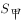和表示，甲和乙的质量分别用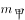和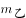表示，甲和乙的高度分别用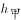和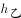表示。

由题意可知，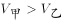，根据长方体的体积公式V=Sh可知，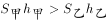，又由于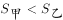，故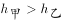，①正确，②错误。

由题意可知，、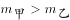，根据密度公式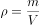，甲的体积和质量均比乙的大，无法判定甲、乙二者的密度大小关系，③④无法确定。

综上所述，一定正确的有①。

故正确答案为A。

---

## 第 16 题　qid 5514866 · 科技常识

如图，物体M在恒力F的作用下沿粗糙的斜面匀速向上移动。下列说法不准确的是（    ）。

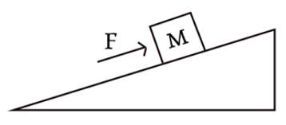

- **A**. 恒力F对物体M做正功
- **B**. 物体M的重力势能逐渐增大
- **C**. 物体所受的摩擦力与运动方向相反
- **D**. 斜面对物体M的支持力和M受到的重力是一对平衡力　✅

**答案**：D

**官方解析**

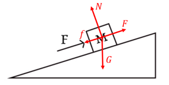

物体M做匀速直线运动，则处于受力平衡状态，对物体M进行受力分析，其受到竖直向下的重力G、沿着斜面向上的恒力F、垂直于斜面向上的支持力N，又因为物体M沿着斜面向上移动，且斜面表面粗糙，所以物体M还会受到沿着斜面向下的摩擦力f。

A项：恒力F的方向与物体M的位移方向相同，因此恒力F对物体M做正功，正确；

B项：物体M的高度逐渐增大，由重力势能公式：可知，物体M的重力势能逐渐增大，正确；

C项：物体M沿斜面向上运动，受到的摩擦力方向为沿着斜面向下，故物体M所受的摩擦力与运动方向相反，正确；

D项：平衡力是指作用于同一物体上的大小相等、方向相反且处于同一直线上的两个力。斜面对物体M的支持力的方向为垂直于斜面向上，物体M受到的重力的方向为竖直向下，这两个力的方向不在同一直线上，不是一对平衡力，错误。

本题为选非题，故正确答案为D。

---

## 第 17 题　qid 5514872 · 科技常识

小李驾驶卡丁车驶过一个半圆形弯道时，滑离了原定赛道，撞到了安全护栏。为了避免卡丁车转弯时滑离赛道，下列做法最可能有效的是（    ）。

- **A**. 增加卡丁车的质量
- **B**. 减少卡丁车的质量
- **C**. 使用更加粗糙的轮胎　✅
- **D**. 减小半圆形弯道的半径

**答案**：C

**官方解析**

当卡丁车转弯时，对卡丁车进行受力分析，竖直方向上受到的重力和支持力为一对平衡力，水平方向上受到的地面对轮胎的静摩擦力提供卡丁车转弯时所需的向心力。当地面对轮胎的最大静摩擦力不足以提供卡丁车转弯时所需的向心力时，卡丁车就会发生滑动。

因为最大静摩擦力近似等于滑动摩擦力，所以可以用滑动摩擦力的公式来计算最大静摩擦力，对于在赛道上行驶的卡丁车，，所以卡丁车受到的最大静摩擦力为。根据向心力公式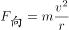可知，若要避免卡丁车转弯时滑离赛道，则需要最大静摩擦力大于向心力，即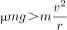，化简为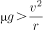，因此可通过增大动摩擦力因数、减小卡丁车的速度v、增大卡丁车的过弯半径r的方式来避免卡丁车转弯时滑离赛道，A、B、D三项均错误，使用更加粗糙的轮胎可增大动摩擦力因数，C项正确。

故正确答案为C。

---

## 第 18 题　qid 5514873 · 科技常识

小张观察发现，自家房屋的北面在夏天能够被阳光照射，而在冬天，房屋的南面可以被阳光照射。则他家最有可能位于以下城市中的（    ）。

- **A**. 海口　✅
- **B**. 武汉
- **C**. 上海
- **D**. 北京

**答案**：A

**官方解析**

太阳直射点在地球表面的南北回归线之间来回移动，夏季时太阳直射点在赤道和北回归线之间，冬季时太阳直射点在赤道和南回归线之间。由题可知，夏季时，小张家的房屋北面能够被阳光照射，则小张家应该位于太阳直射点以南，所以小张家所在城市的纬度应低于北回归线，即城市纬度小于；海口市为海南省省会，坐标为（N，E），武汉市为湖北省省会，坐标为（N，E），上海市坐标为（N，E），北京市坐标为（N，E），其中只有海口市的纬度低于北回归线，A项正确，B、C、D三项错误。

故正确答案为A。

---

## 第 19 题　qid 5514881 · 科技常识

以下延长粮食存放时间的措施，最不合理的是（    ）。

- **A**. 粮库的粮食存放区保持较低温度
- **B**. 将其真空包装，以避免接触氧气
- **C**. 适当在粮库中洒水，保持空气湿度　✅
- **D**. 给粮库的粮食存放区充入二氧化碳

**答案**：C

**官方解析**

储存粮食时既要降低植物细胞的呼吸强度，减少自身养分消耗，又要抑制微生物和粮食害虫的生长，减少其对粮食的破坏。
A项：细胞的生命活动离不开酶的参与，降低温度可降低酶的活性，从而降低植物细胞的呼吸强度，同时也可以抑制微生物和粮食害虫的生长，正确；
B项：细胞的呼吸作用需要氧气的参与，隔绝氧气不仅可以降低植物细胞的呼吸强度，同时也可以抑制微生物和粮食害虫的生长，正确；
C项：提高湿度有可能促进种子的萌发，从而增强植物细胞的呼吸强度，同时潮湿的环境也有助于微生物和粮食害虫的生长，容易导致粮食发霉、变质，不利于粮食的储存，错误；
D项：二氧化碳可抑制细胞的呼吸作用，所以适当地提高二氧化碳浓度不仅可以降低植物细胞的呼吸强度，同时也可以抑制微生物和粮食害虫的生长，正确。
本题为选非题，故正确答案为C。

---

## 第 20 题　qid 5514891 · 科技常识

以下现象属于化学变化的是（    ）。

- **A**. 将木纤维打碎后摊薄晒干制成土纸
- **B**. 石墨在高温高压作用下变成金刚石　✅
- **C**. 打开易拉罐，一股气体喷涌而出
- **D**. 在室外放了一段时间的干冰消失了

**答案**：B

**官方解析**

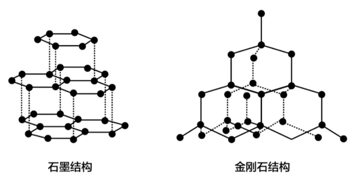

物理变化指没有新物质生成的变化过程，化学变化是指有新物质生成的变化过程。

A项：将木纤维打碎后摊薄晒干制成土纸的过程，只是改变了木纤维的形状，同时降低其含水量，此过程中没有新物质生成，属于物理变化，错误；

B项：石墨和金刚石都是由碳原子组成的碳单质，但是其结构不同（如上图所示），因此是两种不同的物质。在高温高压的条件下，石墨变为金刚石，改变了其原子间的结合与排列方式，即由一种物质变为另一种物质，此过程中有新物质生成，属于化学变化，正确；

C项：气体的溶解度会随压强减小而减小，打开易拉罐后，易拉罐内部的压强会随之减小，罐内气体的溶解度也会减小，所以内部的气体会喷涌而出，此过程中没有新物质生成，属于物理变化，错误；

D项：干冰是固态的二氧化碳，在室外放置一段时间后，会吸热升华，由固态二氧化碳直接变为二氧化碳气体，扩散到空气中，此过程中没有新物质生成，属于物理变化，错误。

故正确答案为B。

---

## 第 21 题　qid 5514909 · 科技常识

透过一块纯绿色的玻璃窗观察白墙上写的纯红色大字，最有可能看到（     ）。

- **A**. 绿墙无字
- **B**. 绿墙黑字　✅
- **C**. 绿墙橙字
- **D**. 黑墙无字

**答案**：B

**官方解析**

玻璃窗呈现绿色，是因为只有绿色的光能透过它，而其他颜色都被吸收或反射了。白墙呈现白色，是因为其反射出白色光，白色光为复色光，是由红、橙、黄、绿、蓝、靛、紫等各种单色光组成，当白色光照射到纯绿色玻璃上时，只有绿色光可以穿透，所以透过绿色玻璃窗观察，白墙会显示绿色；墙上的纯红色大字呈现红色，是因为其反射出红色光，当红色光照射到纯绿色玻璃上时，无法穿透，人在玻璃窗另一侧无法接收到这部分光线，就会看到绿色墙上有一片与字形轮廓相同的黑色区域，也就是看到了“黑字”。综上所述，最有可能看到的是绿墙黑字，B项正确，A、C、D三项均错误。
故正确答案为B。

---

## 第 22 题　qid 5510271 · 科技常识

生物能对外界刺激做出反应。反射是指生物通过神经系统，对外界或内部的各种刺激所发生的有规律的反应。下列生命现象，不属于反射的是（    ）。

- **A**. 小陈刚坐上过山车心跳就开始加速
- **B**. 小狗闻到肉的味道后开始流口水
- **C**. 猎豹发现猎物后停下脚步开始观察环境
- **D**. 乳酸菌向培养皿中果糖浓度高的区域聚集　✅

**答案**：D

**官方解析**

在中枢神经系统的参与下，机体对刺激产生的规律性应答反应叫做反射。高等动物和人类具有中枢神经系统，而植物或单细胞生物（如细菌）无中枢神经系统。
A项：小陈（人）具有中枢神经系统，能够对“坐过山车”的环境刺激产生反射活动（心跳加速），正确；
B项：狗具有中枢神经系统，能够对“肉（食物）”的嗅觉刺激产生反射活动（流口水），正确；
C项：猎豹具有中枢神经系统，能够对猎物所在的环境刺激产生反射活动（观察判断是否存在危险，进而做出下一步行动），正确；
D项：乳酸菌是单细胞生物，不存在中枢神经系统，故不可能产生反射活动，其向培养皿中果糖浓度高的区域聚集的行为，属于应激性（生物体能接受外界刺激并产生合目的的反应，使生物体能趋利避害），错误。
本题为选非题，故正确答案为D。

---

## 第 23 题　qid 5514888 · 科技常识

目前，我国许多城市已经实现5G网络全覆盖，由于5G基站覆盖范围比4G基站的覆盖范围要小，这就意味着想要覆盖同样的区域，5G网络基站数量要比4G基站多。由此可知，与4G信号相比，5G信号（    ）。

- **A**. 频率较低，波长较短
- **B**. 频率较低，波长较长
- **C**. 频率较高，波长较短　✅
- **D**. 频率较高，波长较长

**答案**：C

**官方解析**

5G和4G信号均为电磁波，根据波的特性，其波长越长，越容易绕过障碍物，实现远距离覆盖，由题干可知，5G基站比4G基站覆盖范围小，所以5G信号波长更短。由于各种电磁波的传播速度均为光速，根据公式：波速=波长×频率，由于5G信号比4G信号波长更短，因此5G信号波长较4G信号频率更高，A、B、D三项错误，C项正确。
故正确答案为C。

---

## 第 24 题　qid 5510277 · 科技常识

下图是一束光在空气和玻璃两种不同的介质中传播的路径示意图，则下列说法正确的是（    ）。

- **A**. 
是界面

- **B**. 
AO是入射光线

- **C**. 
OC是反射光线

- **D**. 
下方是玻璃介质
　✅

**答案**：D

**官方解析**

光斜射在介质不均匀的界面上，会同时发生折射和反射。

光的反射定律：入射光线、反射光线、法线三者在同一平面内，入射光线和反射光线分居法线两侧，且入射角等于反射角。

光的折射定律：入射光线、折射光线、法线三者在同一平面内，入射光线和折射光线分居法线两侧，且入射角不等于折射角。并且，当光在空气-玻璃的界面上发生折射时，总是空气侧角更大。

若是界面，则为法线，此时由于AO与CO两条光线在界面同侧，因此是入射光线与反射光线的关系，但是入射角和反射角不相等，不能满足反射定律，故不成立。所以可以确定为界面，为法线，A项错误；

由于AO与BO两条光线在界面同侧，因此是入射光线与反射光线的关系，OC在界面另一侧，是折射光线，而AO和OC在法线同侧，不可能是入射光线与折射光线的关系，因此可确定BO是入射光线，OA为反射光线、OC为折射光线，B、C两项均错误；

由图可知，入射角和反射角均为，折射角为，根据折射时空气侧角更大，可知界面的上方为空气，下方为玻璃，D项正确。

故正确答案为D。

---

## 第 25 题　qid 5510259 · 科技常识

下图是动物养殖场自动喂水装置的简要示意图。当动物通过饮水口饮水后，水箱内的水位下降，水瓶中的水将自动流入水箱，使水位回到一定的高度。关于这一装置，下列说法正确的是（    ）。

- **A**. 水瓶最终会处于真空状态
- **B**. 水瓶内的气压始终等于水箱内的气压
- **C**. 装置达到平衡时，水瓶内的气压高于大气压
- **D**. 该装置是利用水瓶、水箱之间的气压差实现的　✅

**答案**：D

**官方解析**

设水瓶中的液面高度与水箱中的液面高度差为h、水的密度为、水瓶中的气体压强为，由于水箱中液面处的压强等于大气压强，当整个装置平衡时，大气压等于水瓶内的气体压强与液体压强的总和，即，因此水瓶中的气体压强小于水箱中的气体压强（即大气压），B、C两项错误；

水箱的补水过程如下：当动物在饮水口饮水时，水箱中的水减少，水箱中的液面高度也会下降，当水箱中的液面高度低于瓶口的高度时，水瓶的瓶口会与空气接触，导致空气进入到水瓶中，此时水瓶中的气压增大，瓶中的水就会流出，实现自动喂水，直到水箱中的液面高于瓶口的高度时，水将瓶口封住，空气不能再进入水瓶中，则水不会再流出，此时就自动停止对水箱补水。最终水瓶中的水会全部进入到水箱当中，水瓶中最终会充满空气，而不是真空，A项错误；由以上分析也可见，正是水瓶和水箱之间的气压差支持着水瓶内的水柱，从而让瓶中的液面高于水箱中的液面，实现自动喂水，D项正确。

故正确答案为D。

---

## 第 26 题　qid 5514896 · 科技常识

“庄稼一枝花，全靠肥当家。”以下有关农业种植中肥料使用的说法，错误的是（    ）。

- **A**. 肥料的主要作用是给农作物提供有机物　✅
- **B**. 除了根部，肥料也可以通过叶片等部位被农作物吸收
- **C**. 施肥浓度过高导致“烧根”，是由于农作物根部的细胞在高浓度溶液中失水
- **D**. 应根据不同农作物和农作物不同生长阶段的实际需要，有针对性地施用肥料

**答案**：A

**官方解析**

A项：肥料的作用主要是给农作物提供生长所必需的氮、磷、钾等营养元素，植物生长所需要的有机物是由植物自己进行光合作用获得的，错误；
B项：植物所需要的养分主要是靠根部进行吸收的，但是由于植物的叶片等其他部位表面有气孔，喷洒到叶片等部位表面的养分，也可以通过气孔进入叶肉细胞，所以叶片等其他部位也能够吸收肥料，正确；
C项：若给农作物施肥过多，会使土壤的溶液浓度过高，大于植物细胞溶液的浓度，植物根部细胞不仅不能吸水，反而会失水，进而导致植物因失水而萎蔫，造成“烧根”现象，因此要合理施肥，正确；
D项：不同农作物和农作物不同生长阶段所需肥料的种类、数量均有所不同，为了提高农作物产量和品质，发挥肥料的最大效益，应根据不同农作物的不同生长情况有针对性地施用肥料，以达到最佳效果，正确。
本题为选非题，故正确答案为A。

---

## 第 27 题　qid 5510322 · 科技常识

下图是某物体做直线运动时，其速度v与时间t关系的折线图，则以下说法准确的有（    ）。

①在~，物体匀速运动

②在0~和~，物体做同方向运动

③在时，物体离出发点距离最远

④在~和~，物体的加速度方向相反

⑤在时，物体改变运动方向

- **A**. ①⑤
- **B**. ③④
- **C**. ④⑤　✅
- **D**. ①②④

**答案**：C

**官方解析**

在速度-时间（v-t）图像中：纵坐标表示速度，纵坐标的大小表示速度的大小、纵坐标的正负表示速度的方向；斜率表示加速度，斜率的大小表示加速度的大小、斜率的正负表示加速度的方向；图像与横轴围成的面积表示位移，面积的大小表示位移的大小，若围成的面积在横轴的上方则位移方向为正、若围成的面积在横轴的下方则位移为负。

①由图像可知，在~，物体的速度均匀减小，即物体做匀减速直线运动。在~，物体的速度变为负但均匀增大，即朝反方向做匀加速直线运动。因此，在~，物体先减速后朝反方向加速，并非匀速运动，错误；

②由图像可知，在0~，物体的速度为正，即朝正方向做直线运动，在~，物体的速度为负，即朝反向做直线运动，错误；

③由图像可知，在0~，物体的速度为正，始终朝正方向做直线运动，距离出发点越来越远，即位移越来越大。从~，物体的速度变为负，即从时开始朝反向做直线运动，距离出发点越来越近，即位移越来越小，因此在时，物体离出发点距离最远，错误；

④由图像可知，在~，从左往右看，直线呈现下降的趋势，即加速度方向为负。在~，从左往右看，直线呈现上升的趋势，即加速度方向为正，两个时间段的加速度方向相反，正确；

⑤由③的分析可知，在时，物体的速度由正变负，意味着速度方向发生改变，即物体运动方向发生改变，正确。

综上所述，①②③错误，④⑤正确。

故正确答案为C。

---

## 第 28 题　qid 5510278 · 科技常识

甲酸（HCOOH）具有清洁制氢的巨大潜力，其反应前后分子种类变化的微观示意图如下图所示。则下列说法正确的是（    ）。

- **A**. 反应后分子个数增多　✅
- **B**. 该反应类型为化合反应
- **C**. 反应物和生成物都是有机物
- **D**. 该反应不遵守能量守恒定律

**答案**：A

**官方解析**

由题干图示可知，反应物甲酸是由1个碳原子、2个氢原子和2个氧原子组成的，其化学式为，反应后的生成物为2种物质，其中由2个氢原子组成的是，由1个碳原子和2个氧原子组成的是，故甲酸制取氢气的化学反应方程式为。

A项：由上述分析可知，在该反应过程中，1个甲酸分子分解成1个氢气分子和1个二氧化碳分子，即1个分子分解为2个分子，故反应后分子个数增多，正确；

B项：由上述分析可知，甲酸反应后生成氢气和二氧化碳，是由一种物质生成两种物质的反应，属于分解反应，并非化合反应，错误；

C项：有机物主要由碳元素和氢元素组成（也可能有氧、氮等其他元素），一定是含碳的化合物，但是不包括碳的氧化物、碳酸、碳酸盐等，甲酸由碳、氢、氧三种元素组成，属于有机化合物，而生成物中的氢气和二氧化碳则均不属于有机物，错误；

D项：所有的化学反应均遵守能量守恒定律，错误。

故正确答案为A。

---

## 第 29 题　qid 5514897 · 科技常识

下列关于我国家庭用电的说法正确的是（    ）。

- **A**. 我国家庭使用的是220V的直流电
- **B**. 带金属外壳的用电器一般使用两孔插座
- **C**. 要使用电器之间互不影响，用电器应串联接入电路
- **D**. 家庭用电的保险丝可以由电阻率大、熔点低的合金制成　✅

**答案**：D

**官方解析**

A项：我国家庭使用的是220V的交流电，其电流的大小和方向都进行周期性变化，家庭用电的频率为50Hz，即每秒完成50次周期性变化，错误；
B项：由于金属外壳具有导电性，因此带金属外壳的用电器一般需要使用三孔插座，因为三孔插座的上孔连接地线，能够使用电器的金属外壳与地线相连，从而能够避免因用电器外壳漏电而发生触电的危险，错误；
C项：要使用电器之间互不影响，则需每一个用电器开关的闭合与断开均不影响其他用电器的正常工作，故用电器应并联接入电路，错误；
D项：在家庭电路中，保险丝一般是由电阻率较大而熔点较低的铅锑合金制成，其目的是当电路中有过大的电流通过时，保险丝因发热而自动熔断，从而切断电路，因此能够起到保护电路的作用，正确。
故正确答案为D。

---

## 第 30 题　qid 5510258 · 科技常识

无性繁殖是一种不涉及生殖细胞，不需要经过受精过程，由母体的一部分直接形成新个体的繁殖方式。以下繁殖过程不属于无性繁殖的是（    ）。

- **A**. 西瓜的花被授粉后结出了果实　✅
- **B**. 一个草履虫经过细胞分裂变成两个
- **C**. 水螅母体的体壁上形成与母体相似的芽体
- **D**. 马铃薯的块茎发芽生长后，形成新的个体

**答案**：A

**官方解析**

生物的繁殖方式可分为有性繁殖和无性繁殖：有性繁殖是指两性生殖细胞结合（受精过程）成为受精卵后，再由受精卵发育成新的个体的生殖方式；无性繁殖是指不产生生殖细胞，无需经过受精过程，直接由母体的一部分形成新个体的繁殖方式。
A项：西瓜的花朵中有雄蕊和雌蕊，雄蕊和雌蕊可产生生殖细胞，雄蕊产生花粉，花粉中含有西瓜的精子，雌蕊中含有西瓜的卵细胞，授粉是雄蕊中的精子与雌蕊中的卵细胞结合并形成受精卵的过程，属于有性繁殖，错误；
B项：草履虫为单细胞生物，在其细胞分裂过程中，没有产生生殖细胞，也没有经历受精过程，而是直接由母体分裂形成新的个体，属于无性繁殖，正确；
C项：水螅体壁上的芽体即为一个新的小水螅，母体形成芽体的过程中，没有产生生殖细胞，也没有经历受精过程，而是直接从母体的一部分形成新的芽体，属于无性繁殖，正确；
D项：马铃薯块茎中的细胞为马铃薯的体细胞，而非生殖细胞，在马铃薯块茎发芽的过程中，没有产生生殖细胞，也没有经历受精过程，而是从母体的一部分直接形成新的个体，属于无性繁殖，正确。
本题为选非题，故正确答案为A。

---

## 第 31 题　qid 5515034 · 科技常识

夏日，小王调制了一杯的蔗糖水，尝了一口后感觉不够甜，又加入了一些蔗糖，搅拌后蔗糖完全溶解。之后他把蔗糖水放入冰箱，一段时间后取出时发现杯子底部有少许晶体析出，则下列说法正确的有（    ）。

①刚放入冰箱的蔗糖溶液一定不是饱和溶液

②从冰箱中取出的蔗糖溶液一定是饱和溶液

③放入冰箱前后，蔗糖溶液中溶质的质量相等

④用加热蒸发溶剂的方法能够得到与析出晶体相同的物质

- **A**. ①②
- **B**. ①④
- **C**. ②③
- **D**. ②④　✅

**答案**：D

**官方解析**

在一定温度下，向一定量溶剂里加入某种溶质，当溶质不能继续溶解时，所得到的溶液叫做这种溶质的饱和溶液。由题干可知，小王感觉蔗糖水不够甜，又加入蔗糖后，此时蔗糖在杯中完全溶解，但是仅凭这一信息无法判定蔗糖溶液是否饱和，如果再加入更多蔗糖后不能继续溶解，则说明此时溶液恰好为饱和溶液，如果再加入更多蔗糖后还能继续溶解，则说明此时溶液为不饱和溶液，因此无法判断刚放入冰箱的溶液是否饱和，①错误；蔗糖溶液放入冰箱一段时间后取出，发现杯子底部有少许晶体析出，说明此时溶液中有部分溶质不能继续溶解，此时溶液一定为饱和溶液，这部分晶体即为蔗糖，②正确；放入冰箱前，杯子中加入的蔗糖完全溶解，溶质的质量等于杯子中加入蔗糖的质量，放入冰箱后，杯子底部有蔗糖析出，溶液中溶质的质量减少，所以放入冰箱前蔗糖溶液中溶质的质量比放入冰箱后蔗糖溶液中溶质的质量大，③错误；放入冰箱后，杯子底部析出的晶体为蔗糖晶体，加热蒸发溶剂时，溶剂的量减少，溶剂中能够溶解的溶质的量也随之减少，多余的蔗糖就会以晶体的形式析出，也可以得到蔗糖晶体，④正确。
综上，正确的为②④。
故正确答案为D。

---

## 第 32 题　qid 5514910 · 科技常识

大棚种植是一种被广泛采用的农作物种植方式。以下大棚种植的增产做法，有误的是（    ）。

- **A**. 在大棚内补充二氧化碳，促进农作物的光合作用
- **B**. 维持大棚昼夜温度相对稳定，提高农作物的生长速度　✅
- **C**. 傍晚和夜间在大棚内开灯，增加光照时间和光照强度
- **D**. 合理密植农作物，增加单位面积内农作物的光照面积

**答案**：B

**官方解析**

光合作用是指绿色植物利用光能，把二氧化碳和水转化成储存能量的有机物（如淀粉）并释放氧气的过程。呼吸作用是指生物体内的有机物在细胞内经过一系列的氧化分解，最终生成二氧化碳、水或其他产物，并且释放出能量的总过程。
A项：由上述分析可知，二氧化碳是进行光合作用的原料，在大棚内补充二氧化碳，可以促进光合作用，从而提高产量，正确；
B项：白天保持适宜温度，有利于光合作用进行，夜间应该适当降低温度，从而降低农作物的呼吸作用，减少有机物在夜间的消耗，有利于农作物积累更多的有机物，进而提高产量，因此维持大棚昼夜温度相对稳定不能提高产量，错误；
C项：光照是植物进行光合作用的必要条件，因此傍晚和夜间在大棚内开灯，增加了光照时间，可延长光合作用的时间，从而提高产量，正确；
D项：合理密植就是适当提高种植密度，充分利用单位面积上的光照，避免造成光能的浪费，从而增加单位面积内农作物的光照面积，同时又不至于种植过密造成叶片相互遮挡，影响光合作用。因此可以提高产量，正确。
本题为选非题，故正确答案为B。

---

## 第 33 题　qid 5510272 · 科技常识

从北极上空俯视，地球围绕地轴呈逆时针方向自转。如果在北极的地轴正上方有一颗肉眼可见的星星，有一人站在赤道上整晚观察这颗星星。他有可能观察到（    ）。
①这颗星星东升西落
②这颗星星没有东升西落
③周围的星星以这颗星星为中心呈逆时针方向转动
④周围的星星以这颗星星为中心呈顺时针方向转动

- **A**. ②③　✅
- **B**. ①④
- **C**. ①③
- **D**. ②④

**答案**：A

**官方解析**

由题意可知，这颗星星位于北极的地轴的正上方，其实就是北极星，虽然地球绕着地轴不停的自转，但由于北极星位于北极地轴的正上方，因此夜晚看天空，北极星在地面的观察者看来是静止不动的，所以无论地球怎么自转，北极星都不会升起落下，因此没有东升西落，①错误，②正确。

除北极星外，由于地球自西向东的自转，太阳、月亮、星星都有东升西落的现象。如上图所示，人站在赤道上面朝正北方向观察，北极星在正北方位不动，除北极星外的其他星星（图中的黄星）均是东升西落，在人的视野中就是绕着北极星逆时针转动，因此在赤道上会看到其他星星绕着北极星沿逆时针方向旋转，③正确，④错误。

故正确答案为A。

---
