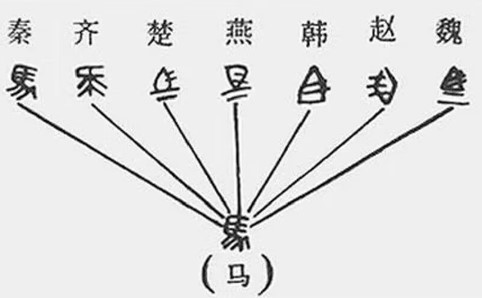
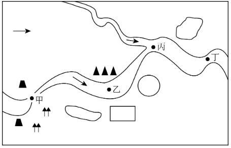

# 2023年江苏省公务员录用考试《行测》题（A类）（网友回忆版）

> 常识判断 · 13 题 · 江苏 2023

## 第 1 题　qid 5699362 · 科技常识

新时代十年，党和国家事业取得历史性成就、发生历史性变革，推动我国迈上全面建设社会主义现代化国家新征程。关于新时代十年的历史性成就，下列表述正确的是（    ）。
①成为世界上森林资源增长最多和人工造林面积最大的国家
②水电、风电、太阳能发电、生物质发电装机均居世界第一
③全社会研发经费、研发投入强度、全球创新指数居世界首位
④建成了全球规模最大的教育体系、社保体系和医疗卫生体系

- **A**. ①②③
- **B**. ①②④　✅
- **C**. ①③④
- **D**. ②③④

**答案**：B

**官方解析**

本题考查政治常识。
①正确，2022年10月21日，生态环境部有关工作人员在党的二十大记者招待会上介绍，我国是全球森林资源增长最多和人工造林面积最大的国家，是全球增绿的主力军。
②正确，2023年1月16日，国家能源局发布的2022年全国电力工业统计数据显示，2022年，全国可再生能源总装机超过12亿千瓦，水电、风电、太阳能发电、生物质发电装机均居世界首位。其中，风电装机容量约3.7亿千瓦，同比增长11.2%；太阳能发电装机容量约3.9亿千瓦，同比增长28.1%。
③错误，党的二十大报告中“一、过去五年的工作和新时代十年的伟大变革”部分指出：“十年来······我们加快推进科技自立自强，全社会研发经费支出从一万亿元增加到二万八千亿元，居世界第二位，研发人员总量居世界首位······”；2023年2月20日召开的国家创新调查制度实施10周年工作座谈会指出，2022年我国全社会研发（R&D）经费投入达到3.09万亿元，是2012年的3倍，稳居世界第二大研发投入国；我国在世界知识产权组织发布的《2022年全球创新指数报告》中排名为全球第11位。
④正确，党的二十大报告在“一、过去五年的工作和新时代十年的伟大变革”部分指出：“十年来，我们坚持马克思列宁主义、毛泽东思想、邓小平理论、‘三个代表’重要思想、科学发展观，全面贯彻新时代中国特色社会主义思想······建成世界上规模最大的教育体系、社会保障体系、医疗卫生体系，教育普及水平实现历史性跨越，基本养老保险覆盖十亿四千万人，基本医疗保险参保率稳定在百分之九十五······”
综上，①②④表述正确。
故正确答案为B。

---

## 第 2 题　qid 5699370 · 科技常识

2022年11月30日，神舟十五号航天员乘组在“天宫”与神舟十四号航天员乘组胜利会师，接过中国空间站建造期的最后一棒。下列属于神舟十五号航天员乘组要完成的任务是（    ）。

- **A**. 在轨转移、组装和测试舱外服
- **B**. 安装梦天舱扩展泵组和载荷暴露平台设备　✅
- **C**. 安装机械臂悬挂装置与转接件
- **D**. 在轨组装完成“T”字基本构型的空间站

**答案**：B

**官方解析**

本题考查科技常识。
A项错误，神舟十二号是空间站关键技术验证阶段第四次飞行任务，也是空间站阶段首次载人飞行任务。舱外服在轨转移、组装、测试是神舟十二号任务之一。
B项正确，神舟十五号是中国空间站建造阶段最后一次飞行任务。神十五乘组将重点开展6个方面工作：一是开展空间站三舱状态长期驻留验证工作；二是完成15个科学实验机柜解锁、安装与测试，开展涵盖空间科学研究与应用、航天医学、航天技术等领域的40余项空间科学实验和技术试验；三是实施3至4次出舱活动，完成梦天舱扩展泵组和载荷暴露平台设备安装等工作；四是验证货物气闸舱出舱工作模式，与地面协同完成6次货物出舱任务；五是开展常态化的平台测试、维护及站务管理工作；六是开展在轨健康防护锻炼、在轨训练与演练等工作。
C项错误，神舟十三号是中国空间站关键技术验证阶段第六次飞行，也是该阶段最后一次飞行任务。机械臂悬挂装置与转接件安装是神舟十三号任务之一。
D项错误，神舟十四号是中国空间站建造阶段第二次飞行任务，也是该阶段首次载人飞行任务。配合问天实验舱、梦天实验舱与核心舱的交会对接和转位，在轨组装完成“T”字基本构型的空间站是神舟十四号的任务之一。
故正确答案为B。

---

## 第 3 题　qid 5699352 · 人文常识

经过我国几代学者接续努力，中华文明探源工程取得了初步的阶段性成果。关于中华文明探源工程已有研究成果，下列说法正确的是（    ）。
①实证了我国百万年的人类史
②实证了我国五千多年的文明史
③实证了我国一万年的文化史
④实证了我国三千多年的城市史

- **A**. ①②③　✅
- **B**. ①②④
- **C**. ①③④
- **D**. ②③④

**答案**：A

**官方解析**

本题考查政治常识。
①②③正确，④错误，2022年7月16日出版的第14期《求是》杂志发表了习近平总书记的重要文章《把中国文明历史研究引向深入，增强历史自觉坚定文化自信》。文章指出，经过几代学者接续努力，中华文明探源工程等重大工程的研究成果，实证了我国百万年的人类史、一万年的文化史、五千多年的文明史。
故正确答案为A。

---

## 第 4 题　qid 5699350 · 科技常识

我国是全球农业文化遗产类型最多、分布最广、传承最好的国家，也是世界农业文化遗产的倡导者、推动者、实践者和受益者。下列关于农业文化遗产说法不正确的是（    ）。

- **A**. 是融经济、生物、技术、文化、景观为一体的复合系统
- **B**. 具有自然遗产、物质文化遗产和非物质文化遗产多重属性
- **C**. 是能普遍地直接推广应用的具体生产体系和知识技术体系　✅
- **D**. 虽生产在过去但至今仍是当地居民的生产方式和经济来源

**答案**：C

**官方解析**

本题考查科技常识。
A项正确，农业文化遗产是融经济、生物、技术、文化、景观为一体的复合系统。受自然条件的限制，保留了更多农耕文明的原始特质。
B项正确，综合性是农业文化遗产的特征，体现在农业文化遗产兼具农业经济、生态保护和文化传承多重功能，具有自然遗产、物质文化遗产和非物质文化遗产等多重属性。
C项错误，对于农业文化遗产，不能追求“一成不变”的“冷冻式保存”，而要根据自然条件和社会经济条件的变化适当调整。但是，遗产系统的基本结构、功能及重要的物种资源、农业景观、水土资源管理技术等不能变，与之相关的民族文化与传统知识也不应有大的改变。也就是说，具体生产体系是要根据自然条件和社会经济条件的变化适当调整的，而不能普遍地直接推广应用。
D项正确，与人们熟知的其他遗产相比，农业文化遗产最显著的特征在于，它是“活着的”。即，它虽然诞生在过去，但至今仍在使用，并且仍是当地居民的生产方式和主要经济来源。
本题为选非题，故正确答案为C。

---

## 第 5 题　qid 5699351 · 人文常识

我国要深入推进环境污染防治，加强土壤污染源头防控，开展新污染物治理。关于新污染物及其治理，下列说法正确的是（    ）。

- **A**. 新污染物是指尚未纳入管理或现有管理措施不足以有效防控其风险的污染物　✅
- **B**. 新污染物包括被排放到环境中的有机污染物、内分泌干扰物、抗生素和塑料
- **C**. 多数新污染物已经通过各种途径进入环境介质中，其短期和长期的危害明显
- **D**. 新污染物的全过程环境风险管控的实现，应当主要采用达标排放的治理手段

**答案**：A

**官方解析**

本题考查科技常识。
A项正确，新污染物是指新近发现或被关注，对生态环境或人体健康存在风险，尚未纳入管理或者现有管理措施不足以有效防控其风险的污染物。新污染物具有生物毒性、环境持久性、生物累积性等特征，且现阶段尚未被有效监管，相对传统已经被监管的污染物而言较“新”。
B项错误，国际上广泛关注的新污染物有四大类：一是持久性有机污染物，二是内分泌干扰物，三是抗生素，四是微塑料。这四类在被排放到环境中后，被界定为新污染物。微塑料，是一种直径小于5毫米的塑料颗粒，其对环境的污染程度比塑料更大。
C项错误，新污染物有五个方面的特征：一是危害比较严重；二是风险比较隐蔽，多数新污染物的短期危害不明显，可是一旦发现其危害性时，污染物可能通过各种途径已经进入环境中；三是环境持久性；四是来源广泛性；五是治理复杂性。
D项错误，新污染物种类繁多、来源广泛、治理复杂，用过去以达标排放为主要手段的常规污染物治理方法，无法实现对新污染物的评估和风险管控。国务院办公厅于2022年5月印发的《新污染物治理行动方案》更加关注物质的评估和风险，要求制定化学物质环境风险筛查和评估方案，以高关注、高产（用）量、高环境检出率、分散式用途的化学物质为重点，开展环境与健康危害测试和风险筛查。
故正确答案为A。

---

## 第 6 题　qid 5699359 · 人文常识

2017-2021年，我国数字经济规模总量稳居世界前列，成为推动经济增长的主要引擎之一。下列关于我国数字经济的说法不正确的是（    ）。

- **A**. 推动经济组织结构扁平化
- **B**. 利用数据来引导资源发挥作用
- **C**. 促进实体经济虚拟化发展　✅
- **D**. 引起社会经济活动的全局变化

**答案**：C

**官方解析**

本题考查经济常识。
A项正确，扁平化组织结构，就是一种通过减少管理层次、压缩职能机构、裁减人员而建立起来的一种紧凑而富有弹性的新型团体组织，它具有敏捷、灵活、快速、高效的优点。与传统层级式组织不同，数字化组织以扁平化、动态化为主要特征，通过不断打破部门边界，不断向服务型组织、平台型组织发展，成为企业数字化转型的重要支柱。
B项正确，数字经济是直接或间接利用数据来引导资源发挥作用进而推动生产力发展的经济形态。当今世界，数字经济发展速度之快、辐射范围之广、影响程度之深前所未有，正在成为重组全球要素资源、重塑全球经济结构、改变全球竞争格局的关键力量。
C项错误，党的二十大要求把发展经济的着力点放在实体经济上。从数字经济发展的角度，需要认识着力实体经济的重要，把数字经济作为着力实体经济的重要抓手，按照加快发展、深度融合、产业集群的策略，找准着力点，使数字经济更好地赋能实体经济，推动经济高质量发展。
D项正确，作为继农业经济和工业经济之后创新的经济发展范式，数字经济引起了生产要素、生产力和生产关系的全面变革。第一，在生产要素方面，数据成为关键的生产要素；第二，在生产力方面，数字技术使生产力极大程度地得到解放；第三，在生产关系方面，以新出现的依托数字技术的平台型企业为代表，表明数字经济时代生产力的变革正在推动生产关系的重大变化。作为新的经济发展范式，数字经济正在引发人类社会系统性、全局性的变化。
本题为选非题，故正确答案为C。

---

## 第 7 题　qid 5746787 · 法律常识

在现代法治社会中，司法是纠纷的最终裁决者，司法公正是社会正义的最后一道防线。下列古语所蕴含的法律思想与现代司法公正理念最契合的是：

- **A**. 罚重可令凶人丧魄
- **B**. 不别亲疏，不殊贵贱，一断于法　✅
- **C**. 居家戒争讼，讼则终凶
- **D**. 父为子隐，子为父隐，直在其中矣

**答案**：B

**官方解析**

本题考查法律常识。
A项错误，“赏厚可令廉士动心，罚重可令凶人丧魄”出自唐代诗人韩愈的《论淮西事宜状》，指的是作战的胜败，与赏罚有直接关系。厚赏能让奉公守法的人感动，重罚可使凶恶违法的人恐惧。因此，此古语所蕴含的法律思想与现代司法公正理念无关。
B项正确，“法家不别亲疏，不殊贵贱，一断于法”出自《史记·太史公自序》，意思是法家不分别关系的亲疏，也不论高贵和贫贱，一切都根据法律来决断，人人平等。因此，此古语所蕴含的法律思想与现代司法公正理念最契合。
C项错误，“居家戒争讼，讼则终凶”指的是居家过日子，禁止争斗诉讼，一旦争斗诉讼，无论胜败，结果都不吉祥。因此，此古语所蕴含的法律思想与现代司法公正理念无关。
D项错误，“父为子隐，子为父隐，直在其中矣”意思是儿子犯了事，做错了事情，父亲应该帮助自己的儿子隐瞒，反过来，如果是自己的父亲犯了事，作为儿子也应该替父亲隐瞒，不要揭露父亲的行为，这就是一种正直的表现，因为这是替家人着想，所以这是正确的，正直的行为。因此，此古语所蕴含的法律思想与现代司法公正理念无关。
故正确答案为B。

---

## 第 8 题　qid 5746791 · 法律常识

下列当事人提起的诉讼中，不属于行政诉讼受案范围的是：

- **A**. 甲向县劳动争议仲裁委员会申请劳动仲裁，仲裁委以不符合条件为由不予受理，甲不服而起诉的　✅
- **B**. 乙外嫁后其原居住地进行改造，申请区政府责令居委会补发其居民待遇，因未获回复而起诉的
- **C**. 丙根据与镇政府签订的关停养猪场协议，拆除了养猪场并领取了奖励金，后认为协议不公而起诉的
- **D**. 丁向街道办申请公开所在小区被拆迁人的补偿信息，街道办以涉及个人隐私为由拒绝提供，丁不服而起诉的

**答案**：A

**官方解析**

本题考查法律常识。
A项错误，根据《中华人民共和国行政诉讼法》第二条规定：“公民、法人或者其他组织认为行政机关和行政机关工作人员的行政行为侵犯其合法权益，有权依照本法向人民法院提起诉讼。前款所称行政行为，包括法律、法规、规章授权的组织作出的行政行为。”选项中，仲裁委不属于行政机关，其所作出的不予受理的决定也不属于行政行为，因此，不属于行政诉讼的受案范围。
B项正确，根据《中华人民共和国行政诉讼法》第十二条第六项规定：“人民法院受理公民、法人或者其他组织提起的下列诉讼：（六）申请行政机关履行保护人身权、财产权等合法权益的法定职责，行政机关拒绝履行或者不予答复的。”选项中，乙申请区政府履行责令居委会补发其居民待遇的职责，区政府未回复，因此，属于行政诉讼的受案范围。
C项正确，根据《最高人民法院关于审理行政协议案件若干问题的规定》第二条规定：“公民、法人或者其他组织就下列行政协议提起行政诉讼的，人民法院应当依法受理：（一）政府特许经营协议；（二）土地、房屋等征收征用补偿协议；（三）矿业权等国有自然资源使用权出让协议；（四）政府投资的保障性住房的租赁、买卖等协议；（五）符合本规定第一条规定的政府与社会资本合作协议；（六）其他行政协议。”选项中的协议属于行政协议，丙对协议不服，认为侵犯其权益，因此，属于行政诉讼的受案范围。
D项正确，根据《中华人民共和国政府信息公开条例》第五十一条规定：“公民、法人或者其他组织认为行政机关在政府信息公开工作中侵犯其合法权益的，可以向上一级行政机关或者政府信息公开工作主管部门投诉、举报，也可以依法申请行政复议或者提起行政诉讼。”选项中，丁不服街道办不公开被拆迁人的补偿信息的决定，因此，属于行政诉讼的受案范围。
本题为选非题，故正确答案为A。

---

## 第 9 题　qid 5699404 · 人文常识

某日，M公司收发员方某因家有急事，没有请假就提前半小时下班，在乘坐公交车回家途中，发生交通事故受伤，但公司没有为他办理工伤保险。下列关于本案的说法正确的是（    ）。

- **A**. 方某在下班途中受伤，不构成工伤
- **B**. 方某没有工伤保险，不能被认定为工伤
- **C**. 方某未请假提前下班，不影响其工伤认定　✅
- **D**. 方某能否被认定为工伤，取决于公司的认定

**答案**：C

**官方解析**

本题考查法律常识。
A项错误，C项正确，根据《工伤保险条例》第十四条第六项规定：“职工有下列情形之一的，应当认定为工伤：（六）在上下班途中，受到非本人主要责任的交通事故或者城市轨道交通、客运轮渡、火车事故伤害的。”根据《最高人民法院关于审理工伤保险行政案件若干问题的规定》第六条第一项规定：“对社会保险行政部门认定下列情形为‘上下班途中’的，人民法院应予支持：（一）在合理时间内往返于工作地与住所地、经常居住地、单位宿舍的合理路线的上下班途中。”又根据《工伤保险条例》第十六条规定：“职工符合本条例第十四条、第十五条的规定，但是有下列情形之一的，不得认定为工伤或者视同工伤：（一）故意犯罪的；（二）醉酒或者吸毒的；（三）自残或者自杀的。”我国工伤认定一般不追究伤害事件的原因、程度和性质。除非工伤职工有《工伤保险条例》第十六条规定的，不得认定为工伤或者视同工伤情形，否则一般都不影响工伤的认定。题中，方某虽未请假提前下班，但仍然不影响其工伤认定。
B项错误，根据《中华人民共和国社会保险法》第四十一条第一款规定：“职工所在用人单位未依法缴纳工伤保险费，发生工伤事故的，由用人单位支付工伤保险待遇。用人单位不支付的，从工伤保险基金中先行支付。”题中，即使用人单位未缴纳工伤保险费，也不影响后期向职工支付工伤保险待遇。
D项错误，根据《工伤保险条例》第十七条第一款规定：“职工发生事故伤害或者按照职业病防治法规定被诊断、鉴定为职业病，所在单位应当自事故伤害发生之日或者被诊断、鉴定为职业病之日起30日内，向统筹地区社会保险行政部门提出工伤认定申请。······”因此，工伤认定由统筹地区社会保险行政部门负责，而非取决于公司。
故正确答案为C。

---

## 第 10 题　qid 5746790 · 人文常识

某市场监管部门接到多起投诉，称一些商家对售卖的水果并未明码标价或标价不清晰，结账时被收取了高价。针对这一乱象，市场监管部门可以采取的措施是（    ）。

- **A**. 查没商家销售的高价水果
- **B**. 鼓励消费者购买本地出产的平价水果
- **C**. 限定商家销售水果的最高价格
- **D**. 发布高价水果的明码标价提醒告诫书　✅

**答案**：D

**官方解析**

本题考查法律常识。
A项错误，根据《中华人民共和国价格法》第四十二条规定：“经营者违反明码标价规定的，责令改正，没收违法所得，可以并处五千元以下的罚款。”选项中，高价水果并不属于违法所得，不得没收高价水果。
B项错误，根据《中华人民共和国反垄断法》第十条规定：“行政机关和法律、法规授权的具有管理公共事务职能的组织不得滥用行政权力，排除、限制竞争。”选项中，市场监管部门鼓励消费者购买本地出产的平价水果，会在一定程度上限制外地出产的水果在本地的竞争，存在滥用行政权力限制竞争的情况，涉嫌行政垄断。
C项错误，根据《中华人民共和国价格法》第六条规定：“商品价格和服务价格，除依照本法第十八条规定适用政府指导价或者政府定价外，实行市场调节价，由经营者依照本法自主制定。”第十八条规定：“下列商品和服务价格，政府在必要时可以实行政府指导价或者政府定价：（一）与国民经济发展和人民生活关系重大的极少数商品价格；（二）资源稀缺的少数商品价格；（三）自然垄断经营的商品价格；（四）重要的公用事业价格；（五）重要的公益性服务价格。”因此，商家售卖的水果并不属于实行政府指导价或者政府定价的商品，故商家的水果价格应实行市场调节价，由经营者依法自主制定。
D项正确，提醒告诫书是一种行政文书，是行政机关对违法行为人进行警告和告诫的一种书面形式，也是行政机关对违法行为人进行行政处罚前的一种警示和教育措施，旨在通过提醒和告诫，促使违法行为人自觉遵守法律法规，避免再次违法行为的发生。因此，面对商家未明码标价和高价售卖的行为，市场监管部门有权发布高价水果的明码标价提醒告诫书，若商家不听从提醒和告诫，继续违法行为，行政机关可以根据法律法规对其进行行政处罚。
故正确答案为D。

---

## 第 11 题　qid 5746793 · 人文常识

2022年10月，国务院办公厅印发《关于扩大政务服务“跨省通办”范围进一步提升服务效能的意见》，提出要更好满足企业和群众异地办事需求，进一步提升服务效能。下列影响政务服务“跨省通办”效能最关键的因素是（    ）。

- **A**. 政务服务数据和电子证照的互认互享
- **B**. 政务服务事项的多地代办和联办机制　✅
- **C**. 政务服务“跨省通办”事项的范围和领域
- **D**. 政务服务事项“跨省通办”的途径和方法

**答案**：B

**官方解析**

本题考查政治常识。
《关于扩大政务服务“跨省通办”范围进一步提升服务效能的意见》以下简称《意见》。
A项错误，《意见》的“四、加强‘跨省通办’服务支撑”部分指出：“（八）增强‘跨省通办’数据共享支撑能力······依法依规有序推进常用电子证照全国互认共享，加快推进电子印章、电子签名应用和跨地区、跨部门互认，为提高‘跨省通办’服务效能提供有效支撑。”属于加强“跨省通办”服务支撑的因素。
B项正确，《意见》的“三、提升‘跨省通办’服务效能”部分指出：“（五）提升‘跨省通办’协同效率。依托全国一体化政务服务平台，完善‘跨省通办’业务支撑系统办件流转功能，推动优化‘跨省通办’事项异地代收代办、多地联办服务。”
C项错误，《意见》的“四、加强‘跨省通办’服务支撑”部分指出：“（八）增强‘跨省通办’数据共享支撑能力。充分发挥政务数据共享协调机制作用，强化全国一体化政务服务平台的数据共享枢纽功能，推动更多直接关系企业和群众异地办事、应用频次高的医疗、养老、住房、就业、社保、户籍、税务等领域数据纳入共享范围，提升数据共享的稳定性、及时性。”属于加强“跨省通办”服务支撑的因素。
D项错误，《意见》中未涉及政务服务事项“跨省通办”的途径和方法。
综上所述，影响政务服务“跨省通办”效能最关键的因素是政务服务事项的多地代办和联办机制。
故正确答案为B。

---

## 第 12 题　qid 5746808 · 人文常识

秦始皇统一六国后，规定“书同文”，在秦国文字的基础上整理规范通行文字，解决了文字书写不一致给国家治理造成的困难，这也给今天的公共服务标准化带来了借鉴。下图是“马”字统一的示例，该示例给公共服务标准化带来的借鉴是：

- **A**. 
字书写更复杂，表明增加服务环节是公共服务标准化的必经阶段

- **B**. 
字更易辨认，说明公共服务标准化要充分体现便利性这一根本导向

- **C**. 
字更加美观，表明公共服务标准化的最终目标是实现形式统一

- **D**. 
字以秦国文字为基础，说明公共服务标准化以规范服务内容为核心
　✅

**答案**：D

**官方解析**

本题考查管理常识。
A项错误，从图片上看，“马”字的书写的确更为复杂。但“增加服务环节是公共服务标准化的必经阶段”说法过于绝对，公共服务标准化制定的服务流程和服务标准，需要确保公共服务的质量和效率，增加服务环节并不必然会导致这一结果，甚至可能会降低公共服务的质量和效率。
B项错误，从图片上看，“马”的确更容易辨认，具有象形的特征。但公共服务标准化的根本导向应该是人民的需求，即公民导向，“以人为本”是构建我国公共服务体系的指导原则，而非便利性。
C项错误，公共服务的最终目标是满足公民基本公共需求，而非形成形式上的统一，后者过于片面。且形式上的统一与题干提到的例子也不相符，秦国统一文字是为了解决文字书写不一致给国家治理带来的困难，具有实质意义，而非仅是形式上的统一。
D项正确，从图片看，秦国统一后的“马”字与原秦国字示例的相似度很高，仅做了细微的调整。题干中也提到，秦国规定“书同文”，在秦国文字的基础上整理规范通行文字，解决了文字书写不一致给国家治理造成的困难，体现了规范性的意义。与选项中的“规范服务内容”相对应，说明公共服务标准化需要对服务内容进行规范，进而制定统一的标准。
故正确答案为D

---

## 第 13 题　qid 5746801 · 人文常识

下图所示为某地水患河段。专家调研发现可进行河道疏浚的有甲、乙、丙、丁四个点水位，最终选择点位丙进行疏浚。这一选择体现的管理思维是（    ）。

- **A**. 系统思维　✅
- **B**. 权变思维
- **C**. 底线思维
- **D**. 创新思维

**答案**：A

**官方解析**

本题考查管理常识。
A项正确，系统思维就是人们运用系统观点，把对象的互相联系的各个方面及其结构和功能进行系统认识的一种思维方法。整体性原则是系统思维方式的核心。这一原则要求人们无论干什么事都要立足整体，从整体与部分、整体与环境的相互作用过程来认识和把握整体。题干中专家选择位于河流交叉口的丙处进行疏浚，即体现了把水患治理看作一个整体，注意各河段的联系和相互影响，抓关键部分的系统思维。
B项错误，权变思维是指企业管理者根据企业生产经营面临的不同情况，审时度势，权衡得失，随机应变的思维方式。题干没有体现。
C项错误，底线思维是指客观地设定最低目标，立足最低点，争取最大期望值的思维方法。题干没有体现。
D项错误，创新思维是指以新颖独创的方法解决问题的思维过程，通过这种思维能突破常规思维的界限，以超常规甚至反常规的方法、视角去思考问题，提出与众不同的解决方案，从而产生新颖的、独到的、有社会意义的思维成果。题干没有体现。
故正确答案为A。

---
