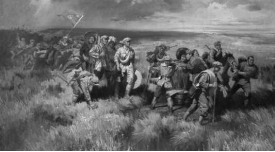
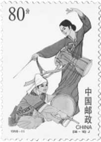

# 2023年浙江省公务员录用考试《行测》题（A类）（网友回忆版）

> 常识判断 · 18 题 · 浙江 2023

## 第 1 题　qid 5430249 · 法律常识

根据《中华人民共和国公务员法》，下列说法不正确的是：

- **A**. 公务员就职时应当依照法律规定公开进行宪法宣誓
- **B**. 被依法列为失信联合惩戒对象的人员，不得录用为公务员
- **C**. 对公务员涉嫌职务违法和职务犯罪的，应当依法移送检察机关处理　✅
- **D**. 国家实行公务员职务与职级并行制度，公务员职级在厅局级以下设置

**答案**：C

**官方解析**

本题考查法律常识。
A项正确，根据《中华人民共和国公务员法》第九条规定：“公务员就职时应当依照法律规定公开进行宪法宣誓。”
B项正确，根据《中华人民共和国公务员法》第二十六条规定：“下列人员不得录用为公务员：（一）因犯罪受过刑事处罚的；（二）被开除中国共产党党籍的；（三）被开除公职的；（四）被依法列为失信联合惩戒对象的；（五）有法律规定不得录用为公务员的其他情形的。”
C项错误，根据《中华人民共和国公务员法》第五十七条第三款规定：“对公务员涉嫌职务违法和职务犯罪的，应当依法移送监察机关处理。”
D项正确，根据《中华人民共和国公务员法》第十七条规定：“国家实行公务员职务与职级并行制度，根据公务员职位类别和职责设置公务员领导职务、职级序列。”第十九条第一款规定：“公务员职级在厅局级以下设置。”
本题为选非题，故正确答案为C。

---

## 第 2 题　qid 5430250 · 法律常识

根据《中华人民共和国个人信息保护法》，下列说法不正确的是：

- **A**. 个人发现其个人信息不准确或者不完整的，有权请求个人信息处理者更正、补充
- **B**. 处理个人信息应当具有明确、合理的目的，并应当与处理目的直接相关，采取对个人权益影响最小的方式
- **C**. 个人信息是以电子或者其他方式记录的与已识别或者可识别的自然人有关的各种信息，不包括匿名化处理后的信息
- **D**. 基于个人同意处理个人信息的，个人有权撤回其同意。个人撤回同意，撤回前基于个人同意已进行的个人信息处理活动无效　✅

**答案**：D

**官方解析**

本题考查法律常识。
A项正确，根据《中华人民共和国个人信息保护法》第四十六条第一款规定：“个人发现其个人信息不准确或者不完整的，有权请求个人信息处理者更正、补充。”
B项正确，根据《中华人民共和国个人信息保护法》第六条第一款规定：“处理个人信息应当具有明确、合理的目的，并应当与处理目的直接相关，采取对个人权益影响最小的方式。”
C项正确，根据《中华人民共和国个人信息保护法》第四条第一款规定：“个人信息是以电子或者其他方式记录的与已识别或者可识别的自然人有关的各种信息，不包括匿名化处理后的信息。”
D项错误，根据《中华人民共和国个人信息保护法》第十五条规定：“基于个人同意处理个人信息的，个人有权撤回其同意。个人信息处理者应当提供便捷的撤回同意的方式。个人撤回同意，不影响撤回前基于个人同意已进行的个人信息处理活动的效力。”由此可见，撤回前基于个人同意已进行的个人信息处理活动依然有效。
本题为选非题，故正确答案为D。

---

## 第 3 题　qid 5430286 · 法律常识

根据《中华人民共和国社会保险法》，下列说法不正确的是：

- **A**. 治疗工伤期间的工资福利由用人单位支付
- **B**. 生育保险费由用人单位和职工个人按比例共同缴纳　✅
- **C**. 城镇居民基本医疗保险实行个人缴费和政府补贴相结合
- **D**. 失业人员领取失业保险金的期限与失业保险费的累计缴费时间有关

**答案**：B

**官方解析**

本题考查法律常识。
A项正确，根据《中华人民共和国社会保险法》第三十九条第一项规定：“因工伤发生的下列费用，按照国家规定由用人单位支付：（一）治疗工伤期间的工资福利。”
B项错误，根据《中华人民共和国社会保险法》第五十三条规定：“职工应当参加生育保险，由用人单位按照国家规定缴纳生育保险费，职工不缴纳生育保险费。”
C项正确，根据《中华人民共和国社会保险法》第二十五条第一、二款规定：“国家建立和完善城镇居民基本医疗保险制度。城镇居民基本医疗保险实行个人缴费和政府补贴相结合。”
D项正确，根据《中华人民共和国社会保险法》第四十六条规定：“失业人员失业前用人单位和本人累计缴费满一年不足五年的，领取失业保险金的期限最长为十二个月；累计缴费满五年不足十年的，领取失业保险金的期限最长为十八个月；累计缴费十年以上的，领取失业保险金的期限最长为二十四个月。重新就业后，再次失业的，缴费时间重新计算，领取失业保险金的期限与前次失业应当领取而尚未领取的失业保险金的期限合并计算，最长不超过二十四个月。”
本题为选非题，故正确答案为B。

---

## 第 4 题　qid 5430289 · 法律常识

根据《中华人民共和国行政许可法》，下列说法不正确的是：

- **A**. 行政机关实施行政许可，不得收取任何费用　✅
- **B**. 行政许可申请可以通过电子数据交换和电子邮件等方式提出
- **C**. 被许可人出借行政许可证件的，行政机关应当依法给予行政处罚；构成犯罪的，依法追究刑事责任
- **D**. 当申请人的申请事项不属于本行政机关职权范围的，应当即时作出不予受理的决定，并告知申请人向有关行政机关申请

**答案**：A

**官方解析**

本题考查法律常识。
A项错误，根据《行政许可法》第五十九条规定：“行政机关实施行政许可，依照法律、行政法规收取费用的，应当按照公布的法定项目和标准收费；所收取的费用必须全部上缴国库，任何机关或者个人不得以任何形式截留、挪用、私分或者变相私分。财政部门不得以任何形式向行政机关返还或者变相返还实施行政许可所收取的费用。”
B项正确，根据《行政许可法》第二十九条第三款规定：“行政许可申请可以通过信函、电报、电传、传真、电子数据交换和电子邮件等方式提出。”
C项正确，根据《行政许可法》第八十条第一项规定：“被许可人有下列行为之一的，行政机关应当依法给予行政处罚；构成犯罪的，依法追究刑事责任：（一）涂改、倒卖、出租、出借行政许可证件，或者以其他形式非法转让行政许可的。”
D项正确，根据《行政许可法》第三十二条第一款第二项规定：“行政机关对申请人提出的行政许可申请，应当根据下列情况分别作出处理：（二）申请事项依法不属于本行政机关职权范围的，应当即时作出不予受理的决定，并告知申请人向有关行政机关申请。”
本题为选非题，故正确答案为A。

---

## 第 5 题　qid 5430297 · 人文常识

下列4幅图是红军长征宣传图，按照发生时间先后排序正确的是：

①

②

③

④

- **A**. ①②④③
- **B**. ④③①②　✅
- **C**. ②④③①
- **D**. ④①③②

**答案**：B

**官方解析**

本题考查毛中特。
图①为爬雪山的情景，1935年6月，中央红军在川康边地区翻越了终年积雪、气候变化无常的大雪山——夹金山，也是红军翻越的第一座大雪山。
图②为过草地的情景，1935年8月21日，红军开始过草地。行军队左右两路，平行前进。右路军由毛泽东、周恩来、徐向前等率领，自四川毛儿盖出发，进入松潘草地。经过7天的艰苦努力，右路军到达草地尽头的班佑地区。左翼为林彪的红一方面军，先行；继后是中央领导机关、红军大学学生等。右翼为徐向前、陈昌浩率领的红三十军和红四军。彭德怀率红三军团垫后，走左翼行军路线。
图③为飞夺泸定桥的情景，飞夺泸定桥发生于1935年5月29日。中央红军部队在四川省中西部强渡大渡河成功，沿大渡河东岸北上，主力由安顺场沿大渡河西岸北上，红四团战士在天下大雨的情况下，在崎岖陡峭的山路上跑步前进，一昼夜奔袭竟达240里，终于在5月29日凌晨6时按时到达泸定桥西岸。第2连连长和22名突击队员沿着枪林弹雨和火墙密布的铁索踩着铁链夺下桥头，并与东岸部队合围占领了泸定桥。
图④为强渡大渡河的情景，强渡大渡河是指1935年5月24日-25日，中国工农红军在四川省越西县（今属四川省石棉县）安顺场渡过大渡河的战斗，也是长征途中的一次著名战斗。
综上所述，按照时间先后排序为④③①②。
故正确答案为B。

---

## 第 6 题　qid 5430300 · 人文常识

下列最能体现古人可持续发展思想的是：

- **A**. 天何言哉？四时行焉，百物生焉，天何言哉？
- **B**. 虾蟆得其志，快乐无以加。地既蕃其生，使之族类多
- **C**. 不违农时，谷不可胜食也；数罟不入洿池，鱼鳖不可胜食也　✅
- **D**. 毋坏屋，毋填井，毋伐树木，毋动六畜。有不如令者，死无赦

**答案**：C

**官方解析**

本题考查人文常识。
A项错误，该句出自《论语·阳货》，意思是天何尝说过话呢？四季照常运行，百物照样生长，天说了什么话呢？这是孔子向学生阐释一切规律、法则皆无言而自化，端赖自己观察发现的道理。
B项错误，该句出自唐代白居易的《虾蟆（和张十六）》，意思是虾蟆得到雨水润泽无比快乐。大地不仅使它们繁衍生息，还让它们族类众多。
C项正确，该句出自先秦孟子弟子录的《寡人之于国也》，意思是不耽误农业生产的季节，粮食就会吃不完。密网不下到池塘里，鱼鳖之类的水产就会吃不完。体现了古人可持续发展的思想。
D项错误，该句出自西周的《伐崇令》，意思是不得毁坏房屋，不得填埋水井，不得砍伐树木，不得伤害家畜。如果有人敢不遵从禁令，一律处死，且不得说情赦免。体现了古人的法律。
故正确答案为C。

---

## 第 7 题　qid 5430335 · 人文常识

下列关于中国古典园林的说法，不正确的是：

- **A**. 中国古典园林在明末开始出现　✅
- **B**. 凿池引水在古典园林中较为常见
- **C**. 榭在古典园林建筑中多为临水建筑
- **D**. 漏景的构景手法主要是通过透漏空隙来呈现景物

**答案**：A

**官方解析**

本题考查人文常识。
A项错误，中国古典园林艺术是指以江南私家园林和北方皇家园林为代表的中国山水园林形式。根据历史文献和现存古代园林遗址的考察，中国古典园林的发展大致可以分成三个时期：先秦秦汉，此时期或可称为“自然时期”，是从“囿”到“苑”的发展时期；唐宋时期是中国古典园林的形成时期；明清时期是中国古典园林的全盛时期。
B项正确，不论哪一种类型的园林，水是最富有生气的因素，无水不活。因此，园林一定要凿池引水。古代园林的理水方法，一般有掩、隔、破三种。掩就是以建筑和绿化，将曲折的池岸加以掩映。隔是或筑堤横断于水面，或有隔水浮廊可渡，或架曲折的石板小桥，或涉水点以步石。破是在水面很小时，可用乱石为岸，配以细竹野藤，朱鱼翠藻。
C项正确，榭，其本意指土台上的木构建筑。明清园林中的榭则是指水边或花边的小建筑。建筑在水池边的可称水榭，建筑在花坛边的可称花榭。常见的榭多为临水而建，面水而设美人靠，可让人凭栏观景。建筑的基部大多一半挑出水面，下面用柱墩架起，与干栏式建筑相似。这种建筑型制与阁的含义相近，故又称为水阁。
D项正确，漏景是中国园林传统造景手法之一，是从框景发展而来的成景类型。漏景是透过虚隔物看到的景象，虚隔物可以是花窗、隔扇、漏窗、漏明墙、栅栏或疏朗的树干。景物的透漏易于勾起游人寻幽探景的兴致与愿望，而透漏的景致本身又有一种似实而虚、似虚而实的模糊美。
本题为选非题，故正确答案为A。

---

## 第 8 题　qid 5430336 · 法律常识

下列与我国税务有关的说法，不正确的是：

- **A**. 个人所得税一般使用全额累进税率计算　✅
- **B**. 一般纳税人的增值税应纳税额=销项税额-进项税额
- **C**. 按消费地征税，不会影响进口商品和本国商品的比价，因而对自由贸易不产生扭曲效应
- **D**. 出口退税是指在国际贸易业务中，对我国报关出口的货物退还在国内各生产环节和流转环节按税法规定缴纳的增值税和消费税

**答案**：A

**官方解析**

本题考查经济常识。
A项错误，个人所得税的税率采用的是超额累进税率，是将纳税对象按数额的大小分为若干等级，对每一个等级规定相应的税率，税率依次提高，分别计算税额，将计算结果相加后得出应纳税额。而全额累进税率是累进税率的一种，即征税对象的全部数额都按其相应等级的累进税率计算征收。
B项正确，一般纳税人增值税应纳税额等于当期销项税额减去当期进项税额。其中销项税额是指纳税人提供应税服务按照销售额和增值税税率计算的增值税额。进项税额是指纳税人购进货物或者接受加工修理修配劳务和应税服务，支付或者负担的增值税税额。
C项正确，按照征税的不同环节，对商品流转过程征收的间接税，可以分为产地税和消费地税。产地税是在生产地对商品销售所征收的间接税。消费地税是在消费地对商品销售所征收的间接税。按消费地征税，不会影响进口商品和本国商品的比价，因而对自由贸易不产生扭曲效应。
D项正确，出口退税是指在国际贸易业务中，对我国报关出口的货物退还在国内各生产环节和流转环节按税法规定缴纳的增值税和消费税，即出口环节免税且退还以前纳税环节的已纳税款。
本题为选非题，故正确答案为A。

---

## 第 9 题　qid 5430338 · 科技常识

中国航天是浪漫的科技事业，相关的命名体现了中国航天人的浪漫情怀。下列命名与中国航天器或工程的对应关系，不正确的是：

- **A**. 鹊桥——中继通信卫星
- **B**. 鸿雁——全球定位卫星系统　✅
- **C**. 萤火一号——火星探测器
- **D**. 悟空——暗物质粒子探测卫星

**答案**：B

**官方解析**

本题考查科技常识。
A项正确，“鹊桥”是嫦娥四号月球探测器的中继卫星，是中国首颗、也是世界首颗地球轨道外专用中继通信卫星，于2018年5月21日在西昌卫星发射中心由长征四号丙运载火箭发射升空。
B项错误，2018年12月29日，“鸿雁”星座首发星在我国酒泉卫星发射中心由长征二号丁运载火箭发射成功并进入预定轨道，卫星的成功发射标志着“鸿雁”星座的建设全面启动。“鸿雁”星座由数百颗低轨卫星和全球数据业务处理中心组成，建成后将开展面向全球的智能终端通信、物联网、移动广播、导航增强、航空航海监视、宽带互联网接入等服务。全球定位卫星系统又称全球卫星导航系统，包括中国的北斗卫星导航系统（BDS）、美国的全球定位系统（GPS）、俄罗斯的格洛纳斯卫星导航系统（GLONASS）和欧盟的伽利略卫星导航系统（GALILEO）。
C项正确，“萤火一号”是中国火星探测计划中的第一颗火星探测器，主要是对火星的空间磁场、电离层和粒子分布变化规律以及火星大气离子逃逸率进行科学探测。此外，还将探测火星地形地貌、沙尘暴以及火星赤道附近的重力场。2011年11月8日与俄罗斯的采样返回探测器一起发射升空，由于俄方探测器变轨失败，导致“萤火一号”发射失败。
D项正确，“悟空”暗物质粒子探测卫星是中国科学院空间科学战略性先导科技专项中首批立项研制的4颗科学实验卫星之一，是世界上观测能段范围最宽、能量分辨率最优的暗物质粒子探测卫星。2015年12月17日，我国在酒泉卫星发射中心用长征二号丁运载火箭成功将暗物质粒子探测卫星“悟空”发射升空。
本题为选非题，故正确答案为B。

---

## 第 10 题　qid 5430340 · 人文常识

下列与古代典籍有关的说法，正确的是：

- **A**. 传统的“四书五经”中包括《尔雅》
- **B**. “二十四史”中包括《史记》和《清史稿》
- **C**. 《战国策》和《资治通鉴》都是编年体史书
- **D**. 古人所说的“笺”和“疏”都有注释的意思　✅

**答案**：D

**官方解析**

本题考查人文常识。
A项错误，“四书五经”是中国传统文学作品“四书”与“五经”的合称。“四书”指《大学》《中庸》《论语》《孟子》。“五经”指《诗经》《尚书》《礼记》《周易》《春秋》。
B项错误，“二十四史”是中国古代各朝撰写的二十四部史书的总称。即《史记》《汉书》《后汉书》《三国志》《晋书》《宋书》《南齐书》《梁书》《陈书》《魏书》《北齐书》《周书》《隋书》《南史》《北史》《旧唐书》《新唐书》《旧五代史》《新五代史》《宋史》《辽史》《金史》《元史》《明史》。
C项错误，《战国策》为国别体史书，内容以战国时期，策士的游说活动为中心，同时反映了战国时期的一些历史特点和社会风貌，是研究战国历史的重要典籍。《资治通鉴》是由北宋史学家司马光主编的一部多卷本编年体史书，共294卷。
D项正确，“笺”本指狭条形小竹片，也可以指中国古代写给帝王的书信，后指注释古书，以显明作者之意。“疏”本意指清除阻塞，使畅通。引申为分散，又引申指稀，再引申指关系远。还指对古书的旧注作进一步解释。
故正确答案为D。

---

## 第 11 题　qid 5430251 · 人文常识

下列关于中国古代文化的说法，不正确的是：

- **A**. 红山文化是我国北方新石器时代文化之一
- **B**. 良渚文化的陶器以泥质红陶和夹砂黑陶为主　✅
- **C**. 仰韶文化早期和中期处于母系氏族社会的繁荣阶段
- **D**. 龙山文化晚期进入军事民主制时期，出现了阶级分化

**答案**：B

**官方解析**

本题考查人文常识。
A项正确，红山文化，新石器时代的一种文化，距今五千年左右，因1935年发现于内蒙古自治区赤峰市红山而得名。红山文化分布范围在东北西部的热河地区，北起内蒙古中南部地区，南至河北北部，东达辽宁西部，辽河流域的西拉木伦河和老哈河、大凌河上游。
B项错误，良渚文化是我国长江下游太湖流域一支重要的古文化，因1936年首先发现于余杭市良渚镇而得名，距今约5300-4000年。良渚文化大体可分为早、晚两期。早期以钱山漾、张陵山等遗址为代表。陶器以灰陶为主，也有少量的黑皮陶；晚期以良渚、雀幕桥等遗址为代表。陶器以泥质黑皮陶较为常见，并有薄胎黑陶。
C项正确，仰韶文化，是指黄河中游地区一种重要的新石器时代彩陶文化，其持续时间大约在公元前5000年至前3000年。仰韶文化展示了中国母系氏族制度繁荣至衰落时期的社会结构和文化成就，早期和中期处于母系氏族社会的繁荣阶段，晚期进入父系氏族公社时期。
D项正确，龙山文化是新石器时代晚期的文化，因1928年首次发现于山东章丘龙山镇的城子崖遗址而得名，年代约为公元前2600年-前1900年。龙山文化早期处于父系氏族公社时期。晚期进入军事民主制时期，出现了阶级分化、贫富悬殊等现象。
本题为选非题，故正确答案为B。

---

## 第 12 题　qid 5430252 · 人文常识

下列诗句与端午节有关的是：

- **A**. 竞渡深悲千载冤，忠魂一去讵能还　✅
- **B**. 但将酩酊酬佳节，不用登临恨落晖
- **C**. 千门万户曈曈日，总把新桃换旧符
- **D**. 烟霄微月澹长空，银汉秋期万古同

**答案**：A

**官方解析**

本题考查人文常识。
A项正确，“竞渡深悲千载冤，忠魂一去讵能还”出自北宋张耒的《和端午》，意思是“龙舟争渡为的是深切悲念屈原的千载冤魂，忠烈的魂魄一去岂能回还？”端午节为农历五月初五日，相传古代爱国诗人屈原在这天投江自杀，后人为了纪念他，把这天当做节日，有吃粽子、划龙舟等风俗。从“竞渡”“忠魂”可以看出诗句对应的是端午节。
B项错误，“但将酩酊酬佳节，不用登临恨落晖”出自唐代杜牧的《九日齐山登高》，意思是“只应纵情痛饮酬答重阳佳节，不必怀忧登临叹恨落日余晖”。重阳节有登高的习俗，而诗句中有“登临”一词，可知其对应的节日为重阳节。
C项错误，“千门万户曈曈日，总把新桃换旧符”出自宋代王安石的《元日》，意思是“初升的太阳照耀着千家万户，他们都忙着把旧的桃符取下，换上新的桃符”。诗句中的“新桃”“旧符”均为桃符，是古代一种风俗，农历正月初一时人们用桃木板写上神荼、郁垒两位神灵的名字，悬挂在门旁，用来压邪，可知其对应的节日是春节。
D项错误，“烟霄微月澹长空，银汉秋期万古同”出自唐代白居易的《七夕》，意思是“抬头仰望明月长空，感慨漫漫历史长河中七夕与秋天都是一样的”，对应的节日是七夕节。
故正确答案为A。

---

## 第 13 题　qid 5430267 · 人文常识

下列邮票图案与少数民族的对应关系，不正确的是：

- **A**. 
朝鲜族

- **B**. 
傣族

- **C**. 
回族

- **D**. 
苗族

　✅

**答案**：D

**官方解析**

本题考查人文常识。
A项正确，从服饰来看，传统的朝鲜族女装，其特点是袄短裙长，袄袖呈圆弧形肥大，左右衣襟以两根长长的结带在右胸前打一个蝴蝶结，与图片吻合。且图片中女子所奏乐器为长鼓，又称杖鼓、两杖鼓，是朝鲜族混合击膜鸣乐器；演奏时将鼓横挂胸前，或放在木架上，左手拍鼓，右手执竹片敲击。
B项正确，从服饰来看，傣族男子多用白布或青布包头，着无领对襟或大襟小袖短衫，下着长管裤，女子传统着窄袖短衣和筒裙，与图片吻合。且图片中的乐器形似一只精美的高脚酒杯，为傣族象脚鼓。
C项正确，从服饰来看，回族的特色主要体现在头饰上，回族男子多戴白色或黑色、棕色的无沿小圆帽，妇女多戴盖头，与图片吻合。
D项错误，图片所对应的民族应为彝族。从服饰来看，彝族女子一般上身穿镶边或绣花的大襟右衽上衣，戴黑色包头、耳环，领口别有银排花，男子多穿黑色窄袖且镶有花边的右开襟上衣，下着多褶宽脚长裤，与图片吻合。且图片中男子所持乐器音箱呈满圆形，琴脖短小，为彝族月琴。
本题为选非题，故正确答案为D。

---

## 第 14 题　qid 5430270 · 科技常识

下列与光有关的说法，不正确的是：

- **A**. 光波可以像绳索样，沿着一定的方向振动
- **B**. 可见光中波长最长的红光波长大于红外线的波长　✅
- **C**. 白光是一种自然光，由红橙黄绿蓝靛紫即七色光组成
- **D**. 利用荧光、激光等发光原理的现代节能灯不能被称为白炽灯

**答案**：B

**官方解析**

本题考查科技常识。
A项正确，光波是横波，和绳波、水波类似，振动方向就是在和光传播的方向垂直的平面上。
B项错误，可见光是电磁波谱中人眼可以感知的部分，波长在780-400纳米之间。在可见光中，红光的波长最长，紫光的波长最短。红外线又称红外辐射，波长介于可见光和微波之间，波长范围为0.76-1000微米。因此红外线波长大于红光波长。
C项正确，1666年，牛顿用三棱镜研究日光，得出结论：白光是由不同颜色（即不同波长）的光混合而成的，可以通过三棱镜折射出红橙黄绿蓝靛紫7种颜色的光。
D项正确，白炽灯是将灯丝通电加热到白炽状态，利用热辐射发出可见光的电光源。节能灯是灯管内部的气体通电后发出荧光，热量不大，并且光是有频率的。
本题为选非题，故正确答案为B。

---

## 第 15 题　qid 5430290 · 科技常识

下列与农业有关的说法不正确的是：

- **A**. 石灰、硫磺是常见的无机农药的有效成分
- **B**. 矿物油农药的作用主要是物理性阻塞害虫气门，影响其呼吸
- **C**. 无公害农业允许使用少量化学农药，强调以预防为主，以生物防治为主
- **D**. 现代农业绿色防控中杀虫灯是利用了害虫成虫对黄色或蓝色敏感，具有强烈趋性的特征　✅

**答案**：D

**官方解析**

本题考查科技常识。
A项正确，无机农药指由天然矿物原料加工、配制而成的农药，又称为矿物性农药。有效成分一般是无机的化学物质或各种盐类，常见的有石灰、硫磺、砷酸钙、磷化铝、硫酸铜等。
B项正确，矿物油农药主要指由矿物油类加入乳化剂或肥皂加热调制而成的杀虫剂，如石油乳剂、柴油乳剂等，其作用主要是物理性阻塞害虫气门，影响其呼吸。
C项正确，无公害农产品的农业生产过程控制主要是农用化学物质使用限量的控制及替代过程。重点生产环节是病虫害防治和肥料施用。病虫害防治要以不用或少用化学农药为原则，强调以预防为主，以生物防治为主。
D项错误，杀虫灯是根据昆虫具有趋光性的特点，利用昆虫敏感的特定光谱范围的诱虫光源，诱集昆虫并能有效杀灭昆虫，降低病虫指数，防治虫害和虫媒病害的专用装置。色板（黄、蓝板）诱杀技术是利用某些害虫成虫对黄、蓝色具有强烈趋性的特性，对害虫进行物理诱杀的技术。
本题为选非题，故正确答案为D。

---

## 第 16 题　qid 5430292 · 人文常识

下列实验与其贡献的对应关系，不正确的是：

- **A**. 马德堡半球实验——证明了大气压的存在
- **B**. 孟德尔的豌豆杂交实验——发现了遗传规律
- **C**. 傅科钟摆实验——验证了万有引力定律的正确性　✅
- **D**. 牛顿的棱镜分解太阳光实验——发现太阳光是一种复色光

**答案**：C

**官方解析**

本题考查科技常识。
A项正确，马德堡半球，亦作马格德堡半球，是1654年时，当时的马德堡市长奥托·冯·格里克于神圣罗马帝国的雷根斯堡（今德国雷根斯堡）进行的一项科学实验。马德堡半球实验证明了大气压强是存在的，并且十分强大。实验中，将两个半球内的空气抽掉，使球内的空气粒子的数量减少、下降。球外的大气便把两个半球紧压在一起，因此就不容易分开了。抽掉的空气越多，半球所受大气压力越大，两个半球越不容易分开。
B项正确，孟德尔豌豆杂交实验，是把一种开紫花的豌豆种和一种开白花的豌豆种结合在一起，第一次结出来的豌豆开紫花，第二次紫白相间，第三次全白。1865年孟德尔通过此实验发现了遗传规律。
C项错误，1851年，法国科学家傅科在公众面前展示了一个科学发现。他用一根长220英尺（约67米）的钢丝将一个62磅（约28千克）重的铁球，悬挂在大教堂的屋顶棚下面。铁球下端装有一只铁笔，铁笔记录铁球摆动时所画出的轨迹。观众发现钟摆在摆动中画出的轨迹会逐渐偏移，并发现轨迹在发生着旋转，因此惊讶不已。傅科的演示说明房屋的缓慢移动，是因为地球围绕着地轴在自转，并推断在南极时，轨迹是逆时针旋转，转动一周的周期是24小时。此实验简单明确地证明了地球在自转。英国科学家卡文迪许于1789年用他发明的扭秤，验证了牛顿的万有引力定律的正确性，并测出了引力常量。
D项正确，1666年，牛顿在棱镜分解太阳光实验中，把一面三棱镜放在阳光下，透过三棱镜，光在墙上被分解为不同颜色，后来我们称作为光谱。通过实验，其证实了太阳光是一种复色光。
本题为选非题，故正确答案为C。

---

## 第 17 题　qid 5430294 · 人文常识

下列关于大气现象的说法，不正确的是：

- **A**. 寒潮、雷电等天气现象发生在平流层　✅
- **B**. 雨后大气一般灰尘较小，不易形成霾
- **C**. 在相同高度上，气旋中心的气压比四周低
- **D**. 霾因其散射波长较长的光较多，故常呈现黄色或橙灰色

**答案**：A

**官方解析**

本题考查科技常识。
A项错误，对流层最主要的特征是存在着强烈的空气对流运动现象，风、雨、雪、雷电和寒潮等天气现象都发生在这里。平流层是地球大气层里上热下冷的一层，大气不对流，以平流运动为主，目前大型客机大多飞行于此层。
B项正确，霾，也称灰霾（烟霞），是指原因不明的因大量烟、尘等微粒悬浮而形成的浑浊现象。其形成有三方面因素：一是水平方向静风现象的增多；二是垂直方向的逆温现象；三是悬浮颗粒物的增加。雨后大气灰尘较小，悬浮颗粒物较小，因此不容易形成霾。
C项正确，气旋是指北（南）半球，大气中水平气流呈逆（顺）时针旋转的大型涡旋。在相同高度上，气旋中心的气压比四周低，又称低压。
D项正确，霾的核心物质是空气中悬浮的灰尘颗粒，气象学上称为气溶胶颗粒。由于灰尘、硫酸、硝酸等粒子组成的霾，其散射波长较长的光比较多，因而霾看起来呈黄色或橙灰色。
本题为选非题，故正确答案为A。

---

## 第 18 题　qid 5430295 · 科技常识

下列关于生活常识的说法，不正确的是：

- **A**. 涂抹润肤乳增加身体湿度可减少静电产生
- **B**. 用过的砧板上常有肉眼看不到的黄曲霉菌
- **C**. 正在发育期的青少年适当补锌可减少腿部抽筋　✅
- **D**. 手剥完桔子后摸膨胀气球，很有可能导致气球爆炸

**答案**：C

**官方解析**

本题考查科技常识。
A项正确，由于不同原子的原子核对电子的束缚能力不同，物体相互靠近时，电子就会在物体之间发生转移，从而导致电荷在物质系统之间的不均匀分布，打破原本的平衡状态。所谓静电，其实就是这些发生转移、在某一物体上积累下来的电荷，而由这些电荷引发的诸多现象，如头发炸毛、电脑屏幕粘上灰尘等，就是静电现象。静电现象在气候干燥时比较常见，因为空气相对湿度降低，摩擦带来的电荷很容易积累起来。而涂抹润肤乳增加身体湿度可减少静电产生。
B项正确，黄曲霉毒素属于真菌毒素，由某些黄曲霉菌和寄生曲霉菌所产生，是霉菌毒素中毒性最大、对人类健康危害最为突出的一类致癌物。砧板本身也并不会长黄曲霉菌，但如果砧板没有及时清洗干净，上面残留的食物残渣和水分就会成为微生物良好的培养基。
C项错误，正在身体发育时期的青少年，如果机体摄入的钙质不足，容易导致腿部的肌肉发生痉挛，引起抽筋，适当补充钙质，多吃含钙量高的食物可以改善，而非补锌。
D项正确，柑橘类水果的果皮中含有芳香烃类化合物，这种物质对橡胶的溶解性很强，能瞬间溶解橡胶。而当气球被吹满，内部充满大量气体时，它本身承受着很大的压强，如果有一处被腐蚀变薄或破裂，会让内部压强不均，从而发生爆炸。因此，手剥完桔子后摸膨胀气球，很有可能导致气球爆炸。
本题为选非题，故正确答案为C。

---
