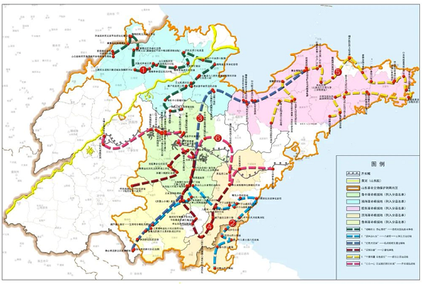

# 2024年山东省公务员录用考试《行测》试题（网友回忆版）

> 常识判断 · 16 题 · 山东 2024

## 第 1 题　qid 5908620 · 人文常识

铸牢中华民族共同体意识、推进新时代党的民族工作高质量发展，是全国各族人民的共同任务。关于铸牢中华民族共同体意识，下列表述正确的是：
①引导各族人民牢固树立休戚与共、荣辱与共、生死与共、命运与共的共同体理念
②坚持各民族自信和独立，为铸牢中华民族共同体意识奠定坚实物质和文化基础
③促进各民族广泛交往交流交融，以中华民族大团结促进中国式现代化
④着眼建设中华民族现代文明，不断构筑中华民族共有精神家园

- **A**. ①②④
- **B**. ①③④　✅
- **C**. ②③④
- **D**. ①②③

**答案**：B

**官方解析**

本题考查政治常识。
2023年10月27日，中共中央政治局就铸牢中华民族共同体意识进行第九次集体学习。中共中央总书记习近平主持集体学习。
①正确，习近平总书记强调，铸牢中华民族共同体意识，就是要引导各族人民牢固树立休戚与共、荣辱与共、生死与共、命运与共的共同体理念。
②错误，④正确，习近平总书记强调，要着眼建设中华民族现代文明，不断构筑中华民族共有精神家园。必须顺应中华民族从历史走向未来、从传统走向现代、从多元凝聚为一体的发展大趋势，深刻理解把握中华文明的突出特性，在新的历史起点上不断构筑中华民族共有精神家园，为铸牢中华民族共同体意识奠定坚实的精神和文化基础。故②中“坚持各民族自信和独立，为铸牢中华民族共同体意识奠定坚实物质和文化基础”的说法错误。
③正确，习近平总书记指出，要促进各民族广泛交往交流交融，以中华民族大团结促进中国式现代化。强国建设、民族复兴的进程，必然是各民族广泛交往交流交融的过程，必然是各民族共同团结奋斗、共同繁荣发展的过程。
故表述正确的是①③④。
故正确答案为B。

---

## 第 2 题　qid 5908643 · 地理国情

2023年11月，山东省政府新闻办召开发布会介绍，山东将深入开展机关运转提速提效、政企沟通提速提效、数字政府建设提速提效“三大行动”，不断增强群众和企业获得感。关于“三大行动”的具体举措，下列说法错误的是：

- **A**. 简化会议议程，严格把控会议时间，会议一般不超过90分钟
- **B**. 开通企业家直通省长公开号码96178，多渠道收集企业诉求
- **C**. 在“爱山东”政务服务平台设立“企业家诉求专区”
- **D**. 将全省各级各部门500多类码融合成“齐鲁码”　✅

**答案**：D

**官方解析**

本题考查政治常识。
2023年11月，山东将深入开展机关运转提速提效、政企沟通提速提效、数字政府建设提速提效“三大行动”，强力推动“高效办成一件事”纵深推进、落细落实，不断增强群众和企业获得感。
A项正确，本次发布会指出，进一步精简会议，除因法律法规规定、上级部署，省委、省政府工作要求以及发生重大突发事件等确需召开会议外，一般不安排以省政府名义召开全省性会议。简化会议议程，严格把控会议时间，会议一般不超过90分钟。
B、C两项正确，本次发布会指出，省政府领导将每月至少主持召开1次政企沟通交流会，开展1次走进企业家会客厅活动······发挥好“省长信箱”作用，在“爱山东”政务服务平台设立“企业家诉求专区”，开通企业家直通省长公开号码96178，多渠道收集企业诉求。
D项错误，本次发布会指出，集中力量建设“鲁通码”，将全省各级各部门500多类码融合成一码，一码关联多证，群众持“一码”就可在政务办事、医疗健康、交通出行等6大类场景中免证办事。
本题为选非题，故正确答案为D。

---

## 第 3 题　qid 5908655 · 地理国情

为传承红色基因，赋能革命老区振兴，山东面向社会发布了6条革命文物保护利用片区红色主题遗产线路（见下图）。下列与之相关的说法错误的是：

- **A**. 通过线路1，八路军一一五师主力进入山东，与日军在大青山激拼杀，换取了转危为安的空前胜利　✅
- **B**. 通过线路3，胶东抗日根据地将招远黄金送至延安，为中共敌后抗战胜利提供了物质支撑
- **C**. 沿着线路5，可以走进胶东育儿所旧址，从胶东乳娘的故事中感受鱼水情深
- **D**. 沿着线路6，可以参观齐长城锦阳关和马鞍山抗战旧址，重温古人智慧与先辈抗战精神

**答案**：A

**官方解析**

本题考查人文常识。
2023年7月1日，在国家文物局全程指导支持下，2023年山东省红色文化主题月启动暨山东革命文物保护利用片区红色主题遗产线路发布活动在烟台海阳举行，活动发布了6条山东革命文物保护利用片区红色主题遗产线路。
A项错误，线路1是“战略后方 丹心渤海”——渤海老区抗敌斗争线，这里诞生了家喻户晓的大刀记，无数志士仁人为了“保卫黄河”奔赴前线奋勇杀敌，奏响了中华民族救亡图存的时代强音。
B项正确，线路3是“红色大动脉”——抗战秘密交通运输线，具体线路从烟台市招远金矿近代采掘基址群起，到济宁市微山铁道游击队队部旧址止。抗战时期山东抗日根据地的胶东军民历经千难万险,将13万两黄金成功运送到延安，为中共敌后抗战胜利提供了物质支撑。
C项正确，线路5是“千里海疆 红色胶东”——胶东抗日运动线，具体线路从青岛市高家民兵联防遗址起，经过胶东育儿所旧址等，到地雷战纪念馆止。在这里马石山十勇士、胶东乳娘的故事代代相传。
D项正确，线路6是“万众一心 筑成我们新的长城”——齐长城抗战线，具体线路从济南市大峰山革命旧址起，经过齐长城锦阳关和淄博市马鞍山抗战旧址等，到青岛市中共青岛工委旧址止。
本题为选非题，故正确答案为A。

---

## 第 4 题　qid 5908662 · 地理国情

在山东3500多公里的海岸线上，诞生了诸多编号为“1”的大国重器。关于这些闪耀着创新之光的“山东造”，下列对应正确的是：
①“耕海1号”——中国首个自营1500米超深水大气田
②“国信1号”——全球首艘10万吨级智慧渔业大型养殖工船
③“蓝鲸1号”——全球最大、钻井深度最深的半潜式海上钻井平台
④“深蓝1号”——中国首座自主研制的大型全潜式深海智能渔业养殖装备

- **A**. ①②③
- **B**. ①②④
- **C**. ②③④　✅
- **D**. ①③④

**答案**：C

**官方解析**

本题考查科技常识。
①错误，“耕海1号”海洋牧场综合体平台位于山东省烟台市渔人码头以东海域，将渔业养殖、海上旅游、科技研发等功能相结合，以科技创新提升渔业养殖效率，实现海洋渔业转型升级。2021年6月25日，我国自营勘探开发的首个1500米超深水大气田“深海一号”在海南岛东南陵水海域正式投产，标志着中国海洋石油勘探开发能力全面进入“超深水时代”。
②正确，“国信1号”是全球首艘10万吨级智慧渔业大型养殖工船，2022年1月25日，在中国船舶集团青岛北海船厂顺利实现出坞下水。“国信1号”在产业发展和技术创新应用上的前瞻性、引领性和示范性，对拓展我国深远海养殖空间、带动渔业产业升级转化具有非常重要的现实意义。
③蓝鲸1号”是一个钻井平台，净重超过43000吨、37层楼高，由中国自主制造，是世界最大、钻井深度最深的半潜式海上钻井平台，适用于全球任何深海作业。
④正确，“深蓝1号”是中国首座自主研制的大型全潜式深海智能渔业养殖装备，是中船重工武船集团为山东日照市万泽丰渔业有限公司建造的首座“深海渔场”。“深蓝1号”用于日照市以东130海里的黄海冷水团进行三文鱼养殖生产。
故对应正确的是②③④。
故正确答案为C。

---

## 第 5 题　qid 5908673 · 人文常识

下列先烈们的家书，按时间先后排序正确的是：
①“儿今日竭力驱满，尽国家之责任者，亦即所谓保卫身家也”
②“为了全祖国家中人等过着幸福日子，男有决心在战斗中坚持为人民服务，不立功不下战场”
③“抛头颅、洒热血，明翰早已视等闲。各取所需终有日，革命事业代代传”
④“狼毒野心之列强！无故侵占我国土！二十一条之否认被拒绝，而租地期满，又故意不肯交还！······热血男儿何堪睹此”

- **A**. ④①②③
- **B**. ④③①②
- **C**. ①③②④
- **D**. ①④③②　✅

**答案**：D

**官方解析**

本题考查人文常识。
①“儿今日竭力驱满，尽国家之责任者，亦即所谓保卫身家也”出自黄花岗起义中牺牲的方声洞烈士在起义前夕写给父亲的绝笔书。黄花岗起义，是革命党人1911年4月在广州举行的起义，又称广州起义、广州三·二九起义。
②1952年4月29日，黄继光写给母亲邓芳芝一封家信，信中写出了自己的初心：“男现在为了祖国人民，需要站在光荣战斗最前面，为了全祖国家中人等过着幸福日子，男有决心在战斗中坚持为人民服务，不立功不下战场。”
③大革命失败后，共产党员夏明翰在汉口被捕，1928年3月，夏明翰在监狱里给妻子写信诀别：“抛头颅、洒热血，明翰早已视等闲。各取所需终有日，革命事业代代传。红珠留着相思念，赤云孤苦望成全。坚持革命继吾志，誓将真理传人寰！”
④“狼毒野心之列强！无故侵占我国土！二十一条之否认被拒绝，而租地期满，又故意不肯交还！······热血男儿何堪睹此？”出自1922年6月3日聂荣臻在比利时留学时写给父母的家书。
故按时间先后排序为①④③②。
故正确答案为D。

---

## 第 6 题　qid 5908622 · 经济常识

我国财政预算“四本账”包括一般公共预算、政府性基金预算、国有资本经营预算和社会保险基金预算。关于“四本账”，下列表述错误的是：

- **A**. 一般公共预算即安排用于保障和改善民生等方面的收支预算
- **B**. 政府性基金预算包含铁路建设基金、土地出让收入、专项债等
- **C**. 国有资本经营预算应当按照收支平衡的原则编制，不列赤字
- **D**. 社会保险基金预算可以调出资金到其他预算中　✅

**答案**：D

**官方解析**

本题考查经济常识。
A项正确，一般公共预算，是安排用于保障和改善民生，推动经济社会发展，维护国家安全，维持国家机构正常运转等方面的收支预算。
B项正确，政府性基金预算，是依照法律、行政法规的规定，在一定期限内向特定对象征收、收取或者以其他方式筹集的资金，专项用于特定公共事业发展的收支预算。铁路建设基金、民航发展基金、土地出让收入和专项债纳入在该本预算里。
C项正确，国有资本经营预算，是对国有资本收益作出支出安排的收支预算。《中央国有资本经营预算管理暂行办法》第三条规定：“中央国有资本经营预算保持完整独立，并与一般公共预算相衔接，应当按照收支平衡的原则编制，以收定支，不列赤字。”
D项错误，社会保险基金预算，是对社会保险缴款一般公共预算安排和其他方式筹集的资金，专项用于社会保险的收支预算。该笔预算专款专用，只进不出。
本题为选非题，故正确答案为D。

---

## 第 7 题　qid 5908628 · 法律常识

根据《公务员法》及有关规定，下列做法错误的是：

- **A**. 某市招商局在招录法律顾问职位的公务员时，向省级机关申请对其组织法律职业资格考试　✅
- **B**. 某市城管局在录用执法类公务员时，对拟录用人员进行了心理素质、体能测评
- **C**. 某市生态环境局公务员由专业技术类岗位转任该局行政管理岗位，先对其进行免职
- **D**. 某市交通局行政执法类公务员在试用期满考核合格后，将其定级为四级主办

**答案**：A

**官方解析**

本题考查法律常识。
A项错误，根据《中华人民共和国公务员法》第二十五条第二款规定：“国家对行政机关中初次从事行政处罚决定审核、行政复议、行政裁决、法律顾问的公务员实行统一法律职业资格考试制度，由国务院司法行政部门商有关部门组织实施。”题中，应由国务院司法行政部门商有关部门组织实施，而非由招录机关向省级机关申请组织。
B项正确，根据《行政执法类公务员管理规定》第二十一条第三款规定：“根据职位特点和工作需要，经省级以上公务员主管部门批准，可以对有关心理素质、体能等进行测评。”
C项正确，根据《专业技术类公务员管理规定》第二十条规定：“专业技术类公务员转任其他职位类别公务员或者专业技术任职资格被取消的，应当予以免职。”
D项正确，根据《行政执法类公务员管理规定》第二十条规定：“试用期满考核合格的新录用行政执法类公务员，应当按照规定在一级主办以下职级层次任职定级。”第十条第三款规定：“行政执法类公务员职级序列分为十一个层次。通用职级名称由高至低依次为：督办、一级高级主办、二级高级主办、三级高级主办、四级高级主办、一级主办、二级主办、三级主办、四级主办、一级行政执法员、二级行政执法员。”题中，将该行政执法类公务员定级为四级主办符合规定。
本题为选非题，故正确答案为A。

---

## 第 8 题　qid 5908631 · 人文常识

2023年10月，中共中央印发《全国干部教育培训规划（2023-2027年）》。根据该规划，下列表述错误的是：

- **A**. 以坚定理想信念宗旨为根本，以增强推进中国式现代化建设本领为重点
- **B**. 推进县级党校统一建设，逐步推进县级党校办学体制改革和办学模式的创新　✅
- **C**. 加强年轻干部政治训练，实施年轻干部理想信念强化计划
- **D**. 有计划地选调地方、部门、国有企事业单位主要负责同志到党校、干部学院参加专题培训

**答案**：B

**官方解析**

本题考查政治常识。
A项正确，《全国干部教育培训规划（2023-2027年）》“一、总体要求”中指出：“······把深入学习贯彻习近平新时代中国特色社会主义思想作为主题主线，以坚定理想信念宗旨为根本，以提高政治能力为关键，以增强推进中国式现代化建设本领为重点······”
B项错误，《全国干部教育培训规划（2023-2027年）》“五、推进培训资源建设，夯实培训保障基础”中指出：“深化和巩固县级党校（行政学校）分类建设成效，逐步实现应建尽建，因地制宜推进县级党校（行政学校）办学体制改革和办学模式创新。由市级党校（行政学院）牵头建立市、县两级优质师资共建共享机制。推进乡镇（街道）党校规范化建设，强化县级党校（行政学院）对乡镇（街道）党校的业务指导。”
C项正确，《全国干部教育培训规划（2023-2027年）》“三、围绕深刻领悟‘两个确立’的决定性意义、做到‘两个维护’，强化政治训练”中指出：“（三）加强年轻干部政治训练。强化习近平新时代中国特色社会主义思想学习教育，突出政治忠诚教育、理想信念教育、纪律规矩教育，加强优良传统作风和责任感使命感教育，强化斗争意识，综合运用理论讲授、政策解读、案例教学、现场体验等方式开展系统培训······实施年轻干部理想信念强化计划。”
D项正确，《全国干部教育培训规划（2023-2027年）》“三、围绕深刻领悟‘两个确立’的决定性意义、做到‘两个维护’，强化政治训练”中指出：“（二）突出‘关键少数’政治训练。坚持把政治训练贯穿干部成长全周期，使干部的政治素养、政治能力与担负的领导职责相匹配。强化‘一把手’政治培训，有计划地选调地方、部门、国有企事业单位主要负责同志到党校（行政学院）、干部学院参加专题培训。实施‘一把手’政治能力提升计划。”
本题为选非题，故正确答案为B。

---

## 第 9 题　qid 5908598 · 法律常识

2023年7月，国家互联网信息办公室等七部门联合发布《生成式人工智能服务管理暂行办法》。根据该办法，下列表述错误的是：

- **A**. 鼓励采用安全可信的芯片、软件、工具、算力和数据资源
- **B**. 提供者应当无条件受理查阅、更正和删除个人信息的请求　✅
- **C**. 国家对生成式人工智能服务实行包容审慎和分类分级监管
- **D**. 鼓励生成式人工智能技术在各行业、各领域的创新应用

**答案**：B

**官方解析**

本题考查政治常识。
《生成式人工智能服务管理暂行办法》以下简称《暂行办法》。
A项正确，《暂行办法》第六条第二款规定：“推动生成式人工智能基础设施和公共训练数据资源平台建设。促进算力资源协同共享，提升算力资源利用效能。推动公共数据分类分级有序开放，扩展高质量的公共训练数据资源。鼓励采用安全可信的芯片、软件、工具、算力和数据资源。”
B项错误，《暂行办法》第十一条第二款规定：“提供者应当依法及时受理和处理个人关于查阅、复制、更正、补充、删除其个人信息等的请求。”
C项正确，《暂行办法》第三条规定：“国家坚持发展和安全并重、促进创新和依法治理相结合的原则，采取有效措施鼓励生成式人工智能创新发展，对生成式人工智能服务实行包容审慎和分类分级监管。”
D项正确，《暂行办法》第五条第一款规定：“鼓励生成式人工智能技术在各行业、各领域的创新应用，生成积极健康、向上向善的优质内容，探索优化应用场景，构建应用生态体系。”
本题为选非题，故正确答案为B。

---

## 第 10 题　qid 5908608 · 科技常识

智能导航系统，AI机器人，数字火炬手······“智能”融入第19届杭州亚运会的方方面面，彰显出本届亚运异彩纷呈的独特魅力。这表明：

- **A**. 人工智能是人的意识能动性的一种特殊表现　✅
- **B**. 人工智能向人类思维的逼近只是模仿性趋近
- **C**. 科技进步催生了人工智能自我意识的产生
- **D**. 人工智能取代或超越人类智能将在曲折中实现

**答案**：A

**官方解析**

本题考查政治常识。
A项正确，意识能动性指人的意识能动地反映物质又通过实践反作用于物质。人工智能是人的意识能动性的一种特殊表现，是人的本质力量的对象化、现实化。人工智能的出现表明，人类意识已经发展到能够把意识活动部分地从人脑中分离出来，物化为机器的物理运动从而延伸意识器官功能的新阶段。
B项错误，人类的自然语言是思维的物质外壳和意识的现实形式，而人工智能难以完全具备理解自然语言真实意义的能力，因此，人工智能向人类思维的逼近只是模仿性趋近。但是材料并未表明这一点。
C项错误，意识是人脑对大脑内外表象的觉察，是人类所独有的。人工智能只是对人类的理性智能的模拟和扩展，不具备情感、信念、意志等人类意识形式，因此人工智能不会产生自我意识。
D项错误，人工智能超越人类智能，或者说在某些程度上比人类更有能力，比如下棋、做决策等，已经成为了现实。但是事实证明，人类的能力和潜能，会由于工具的发展而不断地被开发出来，人因为有了智能机器将会变得越来越聪明。题干并未表明人工智能能否取代或超越人类智能。
故正确答案为A。

---

## 第 11 题　qid 5908609 · 科技常识

关于我国水电建设，下列说法正确的是：

- **A**. 刘家峡水电站是中国第一座自行设计、自制设备和自行施工的大型水力发电站
- **B**. 小浪底水利枢纽被誉为“万里长江第一坝”，是长江干流上第一座大型水电工程
- **C**. 白鹤滩水电站全部机组投产发电，标志着我国建成世界最大的清洁能源走廊　✅
- **D**. 新安江水电站位于甘肃省境内黄河干流，是我国第一座百万千瓦级大型水电站

**答案**：C

**官方解析**

本题考查科技常识。
A、D两项错误，新安江水电站位于浙江省杭州市建德县原铜官镇附近，在钱塘江水系干流上游新安江，是中国第一座自己勘测、设计、施工和制造设备的大型水电站，反映了20世纪50年代中国水电建设的水平。刘家峡水电站是中国首座百万千瓦级水电站，位于甘肃省永靖县境内的黄河干流。
B项错误，葛洲坝水利枢纽被誉为“万里长江第一坝”，位于中国湖北省宜昌市境内的长江三峡末端河段上，距离长江三峡出口南津关下游2.3公里。它是长江上第一座大型水电站，也是世界上最大的低水头大流量、径流式水电站。小浪底水利枢纽位于河南省洛阳市孟津区与济源市之间，是黄河中游最后一段峡谷的出口，是黄河干流三门峡以下唯一能取得较大库容的控制性工程。
C项正确，白鹤滩水电站电站位于四川省宁南县和云南省巧家县交界的金沙江河道上，是实施“西电东送”的国家重大工程，是当今世界在建规模最大、技术难度最高的水电工程，全面建成投产后将成为仅次于三峡工程的世界第二大水电站。2022年12月20日白鹤滩水电站全部机组投产发电，标志着我国在长江上全面建成世界最大清洁能源走廊。
故正确答案为C。

---

## 第 12 题　qid 5908614 · 人文常识

关于新兴体育项目，下列说法错误的是：

- **A**. 航空运动项目包括热气球、滑翔、轻型飞机、航空模型等
- **B**. 2024年巴黎奥运会将首次把攀岩列入正式比赛项目　✅
- **C**. 作为水上极限运动的冲浪以海浪为动力，以冲浪板为支撑
- **D**. 飞盘比赛允许不设置裁判，出现争议动作时可由双方协商解决

**答案**：B

**官方解析**

本题考查科技常识。
A项正确，航空运动是利用飞行器或其他器械在空中进行的体育运动。国际上普遍开展的航空运动项目有轻型飞机运动、航空模型运动、跳伞运动、滑翔运动和热气球运动等。
B项错误，攀岩是一项在天然岩壁或人工岩壁上进行的向上攀爬的运动项目，通常被归类为极限运动。2016年，国际奥委会确认攀岩成为2020东京奥运会正式比赛项目。
C项正确，冲浪运动是运动员站立在冲浪板上，或利用腹板、跪板、充气的橡皮垫、划艇、皮艇等驾驭海浪的一项水上极限运动。冲浪起源于夏威夷，是以海浪为动力，以冲浪板为支撑，与海浪共同前进的极限运动。
D项正确，团队飞盘比赛与其他竞技项目最大的不同，在于比赛没有裁判。出现分歧后，需要两方队员通过互相沟通来解决争议。这种对规则自我约束的“飞盘精神”，是团队飞盘的内在核心，也是这项运动的魅力所在。
本题为选非题，故正确答案为B。

---

## 第 13 题　qid 5908573 · 科技常识

关于我国境内现存珍稀动物，下列说法错误的是：

- **A**. 亚洲象是典型的群居动物，主要分布在云南
- **B**. 大熊猫的受威胁等级已由“濒危”降为“易危”
- **C**. 朱鹮被誉为“东方宝石”，其繁殖期在冬季　✅
- **D**. 藏羚羊的主要栖息地位于青藏高原的羌塘草原

**答案**：C

**官方解析**

本题考查地理国情。
A项正确，亚洲象是亚洲大陆最大的陆生哺乳动物，典型的群居动物，有较为复杂的社群结构。亚洲象在我国主要分布于云南省西双版纳、普洱和临沧3个州市。
B项正确，按照世界自然保护联盟（IUCN）濒危物种红色名录对物种濒危等级划分，由高到低划分为9类：灭绝、野外灭绝、极危、濒危、易危、近危、无危、数据缺乏和未评估。其中极危、濒危和易危物种，又被统称为受威胁物种。在2016年9月，世界自然保护联盟就曾宣布，中国的大熊猫已经不再处于世界濒危动物之列，由“濒危”变为“易危”。
C项错误，朱鹮被誉为“东方宝石”，它也被人们称为爱情鸟、吉祥鸟、和平鸟。春季是朱鹮的繁殖季节，这时成年的雄鸟和雌鸟结成配偶，离开越冬时组成的群体，分散在栓皮栎树等高大的乔木树上筑巢、产卵。
D项正确，藏羚羊是中国国家一级保护动物，主要分布在以羌塘草原为中心的青藏高原地区，栖息地海拔3700米至5500米。
本题为选非题，故正确答案为C。

---

## 第 14 题　qid 5908579 · 人文常识

下列成语典故所涉及的人物，按照时间先后排序正确的是：
①画龙点睛 ②矫若游龙 ③胸有成竹 ④吴带当风

- **A**. ②①④③　✅
- **B**. ①③④②
- **C**. ②③①④
- **D**. ①②③④

**答案**：A

**官方解析**

本题考查人文常识。
①“画龙点睛”是指南北朝时期，梁朝画家张僧繇画龙之后再点上眼睛，龙便飞走了，形容其作画的神妙，后多比喻写文章或讲话时，在关键处用几句话点明实质，使内容更加生动有力。
②“矫若游龙”出自《晋书·王羲之传》，该书评价东晋时期书法家王羲之：“尤善隶书，为古今之冠，论者称其笔势，以为飘若浮云，矫若惊龙。”因此，这一成语常用于形容书法笔势刚健，或舞姿婀娜。
③“胸有成竹”出自宋代苏轼的《文与可画筼筜谷偃竹记》，指画竹前竹子的完美形象已在胸中，比喻处理事情之前已有完整的谋划打算。
④“吴带当风”出自《图画见闻志》，意思是唐代画家吴道子善画佛像，笔势圆转，所画衣带如被风吹拂，后人以之称美其高超画技与飘逸的风格。
故上述成语所涉及的人物按照时间先后排序正确的是②①④③。
故正确答案为A。

---

## 第 15 题　qid 5908583 · 人文常识

被誉为“晚清中兴四大名臣”的左宗棠、张之洞、李鸿章和曾国藩，留下了许多影响深远的名言警句。下列选项对应正确的是：

- **A**. 左宗棠——海纳百川，有容乃大；壁立千仞，无欲则刚
- **B**. 张之洞——中学为内学，西学为外学；中学治身心，西学应世事　✅
- **C**. 李鸿章——我劝天公重抖擞，不拘一格降人才
- **D**. 曾国藩——古之立大事者，不惟有超世之才，亦必有坚忍不拔之志

**答案**：B

**官方解析**

本题考查人文常识。
A项错误，“海纳百川，有容乃大；壁立千仞，无欲则刚”为清末政治家林则徐任两广总督时在总督府衙题书的堂联，意思是大海因为有宽广的度量才容纳了成百上千条河流；高山因为没有勾心斗角的凡世杂欲才如此的挺拔。
B项正确，“中学为内学，西学为外学；中学治身心，西学应世事”出自张之洞创作的作品《劝学篇》，该书于1898年刊行，是阐述“中体西用”、宣传洋务思想的代表作。
C项错误，“我劝天公重抖擞，不拘一格降人才”出自清代龚自珍的《己亥杂诗·其一百二十五》，意思是我希望皇帝重新振作精神，不要局限于一种规格或方式去选用治国的人才。
D项错误，“古之立大事者，不惟有超世之才，亦必有坚忍不拔之志”出自宋代苏轼的《晁错论》，意思是自古以来凡是做大事业的人，不仅有出类拔萃的才能，也一定有坚韧不拔的意志。
故正确答案为B。

---

## 第 16 题　qid 5908586 · 科技常识

关于人体营养知识，下列说法错误的是：

- **A**. 人体内能量的储存形式主要是脂肪，但脂肪在体内异常堆积可能会引发一些慢性疾病
- **B**. 缺铁性贫血可能导致儿童出现发育迟缓、注意力不集中、认知能力障碍等症状
- **C**. 维生素A缺乏可能导致夜盲症，患者可多食用动物肝脏、鸡蛋、牛奶等
- **D**. 维生素D缺乏可能导致皮肤麻木、牙龈出血等症状，患者可多食用蔬菜、水果等　✅

**答案**：D

**官方解析**

本题考查科技常识。
A项正确，一切生命活动都需要能量，但能量摄入过剩会在体内贮存起来。人体内能量的储存形式主要就是脂肪，但脂肪在体内的异常堆积，会导致肥胖和机体不必要的负担，并可成为心血管疾病、某些癌症、糖尿病等慢性疾病的危险因素。
B项正确，缺铁性贫血跟体内长时间缺乏铁元素有关，会影响幼儿的生长发育，导致身体发育迟缓、身材瘦小，同时伴有注意力不集中、烦躁不安，还可能会出现精神不振、免疫力低下、认知能力障碍等症状。
C项正确，维生素A有促进生长、繁殖，维持骨骼、上皮组织、视力和粘膜上皮正常分泌等多种生理功能，缺乏时表现为生长迟缓、暗适应能力减退而形成夜盲症。含维生素A多的食物有禽、畜的肝脏、鸡蛋的蛋黄、牛奶等，患者可多食用。
D项错误，维生素D的作用主要是促进肠道对钙、磷的吸收和在骨骼中沉积，维持骨骼的正常生长与发育。缺乏维生素D时，儿童易患佝偻病，成人易患骨质软化症。维生素D缺乏与皮肤麻木、牙龈出血等症状并无直接关联。
本题为选非题，故正确答案为D。

---
