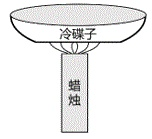
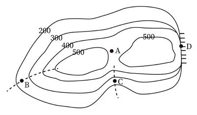
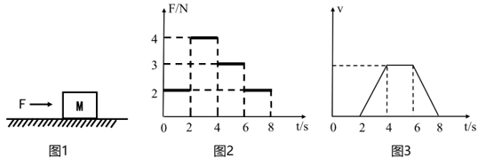
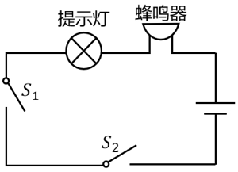
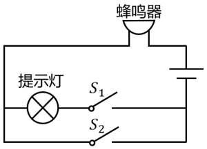
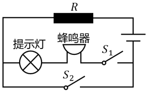
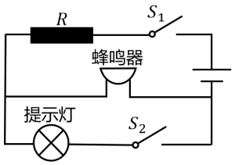

# 2024年广东省公务员录用考试《行测》题（网友回忆版）

> 常识判断 · 15 题 · 广东 2024

## 第 1 题　qid 10204429 · 人文常识

2024年3月5日，第十四届全国人民代表大会第二次会议在北京人民大会堂开幕。

- （选项）[]

**答案**：A

**官方解析**

本题考查政治常识。
2024年3月5日，第十四届全国人民代表大会第二次会议在北京人民大会堂开幕。党和国家领导人习近平、李强、王沪宁、蔡奇、丁薛祥、李希、韩正等出席大会。
故表述正确。

---

## 第 2 题　qid 16593302 · 人文常识

对中华民族形成起决定作用的是对中华民族共同体的认同。

- （选项）[]

**答案**：A

**官方解析**

本题考查政治常识。
求是杂志中题为《画好强国建设、民族复兴的最大同心圆》的文章指出：“民族团结是我国各族人民的生命线，中华民族共同体意识是民族团结之本······事实充分说明，对中华民族形成起决定作用的是对中华民族共同体的认同，而不是种族、血缘、地域、宗教等因素。”
故表述正确。

---

## 第 3 题　qid 16593307 · 地理国情

广东省是全国光、热和水资源相对匮乏的地区。

- （选项）[]

**答案**：B

**官方解析**

本题考查地理国情。
广东省属于东亚季风区，从北向南分别为中亚热带、南亚热带和热带气候，是全国光、热和水资源较丰富的地区，且雨热同季，降水主要集中在4-9月。
故表述错误。

---

## 第 4 题　qid 16593303 · 人文常识

要挖掘中华优秀传统文化的思想观念、人文精神、道德规范，把艺术创造力和中华文化价值融合起来，把中华美学精神和当代审美追求结合起来，激活中华文化生命力，下列选项最能体现这一理念的是（    ）。

- **A**. 立文之道，惟字与义
- **B**. 得道者多助，失道者寡助
- **C**. 收百世之阙文，采千载之遗韵　✅
- **D**. 观古今于须臾，抚四海于一瞬

**答案**：C

**官方解析**

本题考查人文历史。
A项错误，“立文之道，惟字与义”出自《文心雕龙·指瑕》，作者为南朝文学理论家刘勰。意思是文章的写作方法，不外用字和立义两个方面。刘勰认为，好的文章是形式和内容相辅相成、文质统一的完美艺术，但是形式必须服从于内容，使道理能够清楚地表达出来，他反对奇言怪语的使用而造成的意旨模糊不清、笼统含混。不符合题意。
B项错误，“得道者多助，失道者寡助”出自《孟子·公孙丑下》，作者为战国思想家孟子。意思是能施行“仁政”的君王，帮助支持他的人就多；不能施行“仁政”的君主，支持帮助他的人就少。不符合题意。
C项正确，“收百世之阙文，采千载之遗韵”出自《文赋》，作者为晋代文学家陆机。意思是文学创作要探究千百年来古人还未表达清楚的意旨，采取未曾使用过的文辞。这并不是要弃绝传统、凭空虚造，而是说明文学创作既要继承传统，也要在此基础上推陈出新，学古不泥古、破法不悖法，从而形成自己的风格和特点，迈向更加广阔的创作天地。符合题意。
D项错误，“观古今于须臾，抚四海于一瞬”出自《文赋》，作者为晋代文学家陆机。意思是片刻之间浏览古今，一瞬间周游世界。在论及艺术构思时，陆机一方面主张“谢朝华于已披，启夕秀于未振”，即务去陈言，开启未述之旨，谢去已用之意；另一方面，陆机又强调“观古今于须臾，抚四海于一瞬”，即作家要体察万物，转瞬之间将古今四海所有之物罗致笔端。不符合题意。
故正确答案为C。

---

## 第 5 题　qid 16593304 · 人文常识

1930年，毛泽东同志在文章中强调调查研究是一切工作的第一步，提出了“没有调查，没有发言权”的著名论断。这一论断出自他的（    ）。

- **A**. 《星星之火，可以燎原》
- **B**. 《反对本本主义》　✅
- **C**. 《中国革命和中国共产党》
- **D**. 《论十大关系》

**答案**：B

**官方解析**

本题考查政治常识。
A项错误，1930年，毛泽东撰写了《星星之火，可以燎原》，文中进一步阐述了农村包围城市，武装夺取政权的革命道路，标志着毛泽东思想基本形成。
B项正确，《反对本本主义》是毛泽东于1930年5月为反对当时中国工农红军中的教条主义思想而写的关于调查研究问题的重要著作，原名《调查工作》，提出“没有调查，没有发言权”的重要论断。这是毛泽东最早的一篇马克思主义哲学著作。
C项错误，《中国革命和中国共产党》是毛泽东于1939年12月所写的关于中国社会矛盾和革命对象、任务、动力及性质的政治著作。文中提出的新民主主义革命理论，与《〈共产党人〉发刊词》《新民主主义论》一起，是新民主主义理论的代表作。
D项错误，1956年4月25日，毛泽东在中央政治局扩大会议上作了《论十大关系》的讲话，初步总结了中国社会主义建设的经验，提出了探索适合中国国情的社会主义建设道路的任务。
故正确答案为B。

---

## 第 6 题　qid 16593306 · 地理国情

2024年2月，广东召开全省高质量发展大会，会议强调，推进产业科技创新，发展新质生产力是广东的战略之举、长远之策。以下有关广东高质量发展要求的表述，不准确的是（    ）。

- **A**. 要坚持以开放促改革、促创新
- **B**. 要持续营造有利于创新的政策和制度环境
- **C**. 要全力支持高校做创新的主角，推动创新资源向高校集聚　✅
- **D**. 要依托市场优势吸聚创新资源，运用市场机制兑现创新价值

**答案**：C

**官方解析**

本题考查政治常识。
2024年2月18日，广东省委、省政府召开全省高质量发展大会，广东省委书记黄坤明发表重要讲话。
A项正确，广东省委书记黄坤明指出：“要坚持以开放促改革、促创新，在更广阔的空间布局产业科技创新，在开放合作中提升科技自立自强能力。”
B项正确，广东省委书记黄坤明指出：“要持续营造有利于创新的政策和制度环境，实施包容审慎监管，加强知识产权保护，让每一个创新行为都得到市场尊重，让每一份创新成果都能够形成市场价值。”
C项错误，广东省委书记黄坤明指出：“要全力支持企业做创新的主角，推动创新资源向优质企业集聚，政产学研协同发力，攻克‘卡脖子’技术，锻造‘撒手锏’技术，研发更多‘根技术’，让企业把腰杆子挺起来。质量就是生命，效率就是生命。”
D项正确，广东省委书记黄坤明指出：“要根据市场需求凝练科研问题，依托市场优势吸聚创新资源，运用市场机制兑现创新价值，让市场力量激发出更加澎湃的创新动能。”
本题为选非题，故正确答案为C。

---

## 第 7 题　qid 10204424 · 人文常识

矛盾是反映事物内部或者事物之间对立统一关系的哲学范畴。矛盾的同一性是指矛盾着的对立面相互依存、相互贯通的性质和趋势。关于矛盾的同一性，以下表述正确的有（    ）。

- **A**. 在矛盾双方中，一方的发展以另一方的发展为条件　✅
- **B**. 矛盾双方相互吸取有利于自身的因素，在相互作用中各自得到发展　✅
- **C**. 事物的发展方向、趋势不是随意的，而是有规律地向自己的对立面转化　✅
- **D**. 矛盾双方的统一是一种矛盾统一体向另一种矛盾统一体过渡的决定性力量

**答案**：ABC

**官方解析**

本题考查政治常识。
矛盾的同一性是指矛盾双方相互依存、相互贯通的性质和趋势。它有两个方面的含义：一是矛盾着的对立面相互依存，互为存在的前提，并共处于一个统一体中，二是矛盾着的对立面之间相互贯通，在一定条件下相互转化。
A项正确，矛盾双方相互依存，一方的存在以另一方的存在为条件，这是任何矛盾得以存在的前提。同样，对立一方的发展也以另一方的某种发展为条件，因为矛盾双方力量的变化过程是在相互依存的矛盾统一体中实现的。
B项正确，矛盾双方相互吸取有利于自身的因素，在相互作用、相互促进中各自得到发展。这不仅对于那些对立面之间不存在根本利害冲突的矛盾是一种普遍现象，而且对于那些对立面之间存在根本利害冲突的矛盾，情形也是如此。
C项正确，矛盾双方的相互贯通规定事物发展的基本趋势。发展是一物转化为他物，但不是转化为别的东西，而是转化为自己的他物，是向自己的对立面的转化。
D项错误，矛盾的斗争性在事物发展中的作用表现在：第一，矛盾双方的斗争促进矛盾双方力量的变化，造成双方力量发展的不平衡，为对立面的转化、事物的质变创造条件；第二，矛盾双方的斗争是一种矛盾统一体向另一种矛盾统一体过渡的决定性力量。
故正确答案为ABC。

---

## 第 8 题　qid 16593299 · 人文常识

在面对重重困难艰辛探索适合中国国情的社会主义建设道路过程中，涌现出大量先进典型和英雄模范人物，抒写了无数改天换地的壮丽诗篇，形成跨越时空、历久弥新的时代精神。下列词句关联人物的主要事迹，发生于社会主义建设时期的有（    ）。

- **A**. “清澈的爱，只为中国”
- **B**. “干惊天动地事，做隐姓埋名人”　✅
- **C**. “生也沙丘，死也沙丘，父老生死系”　✅
- **D**. “以青春之我，创建青春之家庭，青春之国家，青春之民族”

**答案**：BC

**官方解析**

本题考查毛中特。
中国共产党百年历史，可以划分为四个历史时期：从1921年7月中国共产党建立至1949年10月中华人民共和国成立，是新民主主义革命时期；从1949年10月至1978年12月党的十一届三中全会召开，是社会主义革命和建设时期；从1978年12月至2012年11月党的十八大召开，是改革开放和社会主义现代化建设新时期；从2012年11月至今是中国特色社会主义新时代。
A项错误，“清澈的爱，只为中国”是18岁的戍边烈士陈祥榕留下的战斗口号。2020年6月在边防斗争中，陈祥榕英勇战斗，直至壮烈牺牲。此事迹发生于中国特色社会主义新时代。
B项正确，20世纪50年代中期至70年代，中国共产党带领中国人民突破了西方国家技术封锁，自主创新，独立掌握了核技术和空间技术，取得了“两弹一星”工程的伟大成功，实现了新中国国防科技事业的一次伟大飞跃，奠定了国防基石，在艰苦创业过程中，孕育形成了伟大的“两弹一星”精神。“两弹一星”精神是中国共产党领导全国人民在社会主义革命和建设时期创造的红色精神。“干惊天动地事，做隐姓埋名人”是许多参加“两弹一星”工程工作人员的真实写照。
C项正确，“生也沙丘，死也沙丘，父老生死系”是1990年7月，时任福州市委书记的习近平同志读了《人民呼唤焦裕禄》一文，有感于焦裕禄精神，填写了《念奴娇·追思焦裕禄》一词的内容。焦裕禄为了改变兰考人民贫穷落后的面貌，拖着患病的身体带领全县人民封沙、治水、改地，1964年5月14日，他因劳累过度病逝。此事迹发生于社会主义建设时期。
D项错误，“以青春之我，创建青春之家庭，青春之国家，青春之民族”是李大钊在《新青年》第二卷第一号上发表的《青春》一文的内容，表达改变国家、社会的决心，展现了慷慨悲壮的气魄。李大钊是中国共产党的创始人之一。此事迹发生于新民主主义革命时期。
故正确答案为BC。

---

## 第 9 题　qid 16593300 · 人文常识

马克思主义道德观认为，人类社会的实际情况是“物质生活的生产方式制约着整个社会生活、政治生活和精神生活的过程。”关于道德起源问题，以下认识正确的有（    ）。

- **A**. 劳动是道德起源的首要前提　✅
- **B**. 道德起源于人与生俱来的善性
- **C**. 社会关系是道德赖以产生的客观条件　✅
- **D**. 人的自我意识是道德产生的主观条件　✅

**答案**：ACD

**官方解析**

本题考查政治常识。
A项正确，劳动是道德起源的首要前提。道德是人类社会的特有现象，动物的本能行为中不存在真正的道德。劳动将人与动物区分开来，创造了人、社会和社会关系，也创造了道德。劳动创造了道德主体。劳动在创造人的同时也形成了人与人的关系，原始的劳动分工与协作，使相互依赖、相互扶持自觉不自觉地成为当时最自然、最朴实的道德生活状态。
B项错误，马克思主义科学地揭示了道德的起源，认为道德是产生于人类的历史发展和人们的社会实践中。马克思、恩格斯在《德意志意识形态》一文中指出：“思想、观念、意识的生产最初是直接与人们的物质活动、与人们的物质交往、与现实生活的语言交织在一起······表现在某一民族的政治、法律、道德、宗教、形而上学等的语言中的，精神生产也是这样。”
C项正确，社会关系的形成是道德赖以产生的客观条件。道德是社会关系的产物，只有形成了人与人、人与社会之间的相互关系，才会产生道德。道德恰恰是适应社会关系调节的需要而产生的。
D项正确，人的自我意识是道德产生的主观条件，没有自我意识的人所做出的行为，无法对其做道德判断。意识是道德产生的思想认识前提。人只有在社会实践中，充分意识到自我作为社会成员与其他动物的根本区别，意识到自我在社会中的角色与地位，意识到自我与他人或集体不同的利益关系，并由此产生调节利益矛盾的迫切要求时，道德才得以产生。
故正确答案为ACD。

---

## 第 10 题　qid 16593301 · 法律常识

根据《中华人民共和国爱国主义教育法》，以下属于爱国主义教育主要内容的有（    ）。

- **A**. 马克思列宁主义、毛泽东思想、邓小平理论、“三个代表”重要思想、科学发展观、习近平新时代中国特色社会主义思想　✅
- **B**. 国旗、国歌、国徽等国家象征和标志　✅
- **C**. 祖国的壮美河山和历史文化遗产　✅
- **D**. 宪法和法律，国家统一和民族团结、国家安全和国防等方面的意识和观念　✅

**答案**：ABCD

**官方解析**

本题考查法律常识。
A、B、C、D四项均正确，根据《中华人民共和国爱国主义教育法》第六条规定：“爱国主义教育的主要内容是：（一）马克思列宁主义、毛泽东思想、邓小平理论、‘三个代表’重要思想、科学发展观、习近平新时代中国特色社会主义思想；（二）中国共产党史、新中国史、改革开放史、社会主义发展史、中华民族发展史；（三）中国特色社会主义制度，中国共产党带领人民团结奋斗的重大成就、历史经验和生动实践；（四）中华优秀传统文化、革命文化、社会主义先进文化；（五）国旗、国歌、国徽等国家象征和标志；（六）祖国的壮美河山和历史文化遗产；（七）宪法和法律，国家统一和民族团结、国家安全和国防等方面的意识和观念；（八）英雄烈士和先进模范人物的事迹及体现的民族精神、时代精神；（九）其他富有爱国主义精神的内容。”
故正确答案为ABCD。

---

## 第 11 题　qid 16593288 · 科技常识

有一种传统的制墨工艺：把冷碟子放在蜡烛火焰的上方，蜡烛燃烧一段时间后，冷碟子底部会有黑色物质生成，黑色物质经过进一步加工可以变成墨，则以下说法有误的是（    ）。

- **A**. 所使用的蜡烛由该黑色物质和其他材料混合制成　✅
- **B**. 该黑色物质具有还原性
- **C**. 冷碟子会影响蜡烛燃烧过程中氧气的补充，导致蜡烛不完全燃烧
- **D**. 冷碟子能冷却底部的黑色物质，使其无法燃烧

**答案**：A

**官方解析**

蜡烛的主要成分是石蜡，石蜡包含碳元素和氢元素。若蜡烛充分燃烧，其燃烧的产物为二氧化碳和水；若蜡烛燃烧不充分，则会生成炭黑。墨的主要成分是炭黑，结合题意可知，冷碟子底部生成的黑色物质为炭黑。
A项：蜡烛中除了含有石蜡之外，还含有白油、硬脂酸、聚乙烯、香精等其他物质，具体添加何种物质，要视生产什么种类的蜡烛而定，但是蜡烛中不包含炭黑，冷碟子底部的炭黑是蜡烛发生不完全燃烧（化学反应）生成的新物质，不是蜡烛中原有的成分，错误；
B项：炭黑的主要成分是碳单质，碳单质具有还原性，因此炭黑也具有还原性，正确；
C项：冷碟子置于蜡烛的上方，而碟子底部主要与蜡烛的内焰接触，内焰被外焰包裹，与外焰相比，内焰能够接触到的氧气更少，氧气越少燃烧越不充分，最终导致蜡烛不完全燃烧，正确；
D项：燃烧需满足三个条件，有可燃物、达到可燃物的着火点、氧气，这三个条件缺一不可。冷碟子温度较低，生成的炭黑（固体）遇到冷碟子会降温，导致无法达到炭黑的着火点，因此炭黑无法燃烧，正确。
本题为选非题，故正确答案为A。

---

## 第 12 题　qid 16593291 · 科技常识

根据某地等高线地形图，下列说法最不可能属实的是（    ）。

- **A**. 图中A处是海拔400米以上露营的最佳选择地
- **B**. 图中B处发展耕作业比发展林业更合适　✅
- **C**. 图中C处可能发育河流
- **D**. 图中D处适合攀岩活动

**答案**：B

**官方解析**

A项：根据等高线地形图“同线等高、同图等距”的特点可知，A处的海拔高于400米，低于500米。因为A处位于等高线地形图中两座山峰之间的空白部分，所以A处是鞍部地形。鞍部通常平坦而开阔，为露营提供了良好的条件，因此A处是海拔400米以上露营的最佳选择地，正确；
B项：B处等高线向低处凸出，因此是山脊地形。山脊地形陡峭，水土容易流失，发展林业有利于水土保持，因此山脊适合发展林业。耕作业不适合在山地、丘陵和崎岖的高原发展，而适合在地势平坦、土层深厚、土壤肥沃的平原地区发展，因此B处发展林业比发展耕作业更合适，错误；
C项：C处等高线向高处凸出，是山谷地形。山谷地势较低，雨后容易积水，可能会发育成河流，正确；
D项：D处等高线重合，是陡崖地形，攀岩的对象主要是天然岩壁或人工岩壁，因此D处适合攀岩活动，正确。
本题为选非题，故正确答案为B。

---

## 第 13 题　qid 16593287 · 科技常识

如图1所示，物体M在力F的作用下开始移动，其F-t图像、v-t图像如图2、图3所示，则下列说法正确的是（    ）。

- **A**. 在0-2s，力F对物体做正功
- **B**. 在4-6s，物体所受的摩擦力不做功
- **C**. 在4-6s，物体所受的合外力大于零
- **D**. 物体所受的摩擦力在2-4s做的功与在6-8s做的功相等　✅

**答案**：D

**官方解析**

A项：当力F的方向与物体位移的方向相同时，力F对物体做正功；当力F的方向与物体位移的方向相反时，力F对物体做负功；当物体在力F的作用下没有移动时，力F对物体不做功。由图3可知，物体M在0-2s内的速度始终为零，即物体始终处于静止状态，因此0-2s内力F对物体M不做功，错误；

B、C两项：由图3可知，物体M在4-6s内的速度不变，即物体M在4-6s内做匀速直线运动，处于受力平衡的状态，物体M所受的合外力为零。对物体M进行受力分析，竖直方向上，物体M受到竖直向下的重力和地面对其竖直向上的支持力，这两个力互相平衡，水平方向上，物体受到水平向右的外力F，要使物体在水平方向上也受力平衡，则物体一定受到地面对其水平向左的摩擦力，而物体向右运动，即摩擦力方向与物体运动的方向相反，因此摩擦力对物体做负功，均错误；

D项：功的大小。由图3可知，物体M在2-4s与6-8s内的速度均大于零，可知物体受到的摩擦力均为滑动摩擦力，根据滑动摩擦力公式，由接触面的粗糙程度决定，保持不变，而为物体对地面的压力，物体在水平地面上运动，则等于其自身重力，也保持不变，因此物体在2-4s与6-8s受到的滑动摩擦力保持不变。在v-t图像中，图线与横轴围成的面积代表物体的位移，由图3可知物体在2-4s与6-8s内的位移相同（两个三角形同底等高，所以面积大小相等），摩擦力和位移均相同，因此物体所受的摩擦力在2-4s做的功与在6-8s做的功相等，正确。

故正确答案为D。

---

## 第 14 题　qid 16593295 · 科技常识

某汽车设置了灯光关闭提醒系统。当汽车熄火后，开关闭合。此时，若灯光未关闭，则开关断开，仪表台的提示灯亮起，蜂鸣器发出警示声；若灯光关闭，则开关闭合，仪表台的提示灯熄灭，蜂鸣器停止警示声。则下列选项最有可能正确反映该系统电路图的是（    ）。

- **A**. 

- **B**. 

- **C**. 

　✅
- **D**. 

**答案**：C

**官方解析**

根据题意，开关的断开与闭合，取决于灯光是否关闭。若灯光未关闭，则开关断开；若灯光关闭，则开关闭合。

A项：提示灯与蜂鸣器串联，当汽车熄火后，开关闭合。此时，若灯光未关闭，则开关断开，提示灯熄灭，与题意不符，错误；

B项：提示灯与蜂鸣器串联，当汽车熄火后，开关闭合。此时，若灯光关闭，则开关闭合，提示灯被短路，蜂鸣器发出警示声，与题意不符，错误；

C项：提示灯与蜂鸣器串联，当汽车熄火后，开关闭合。此时，若灯光未关闭，则开关断开，提示灯亮起，蜂鸣器发出警示声；若灯光关闭，则开关闭合，提示灯和蜂鸣器均被短路，则提示灯熄灭，蜂鸣器停止警示声，与题意相符，正确；

D项：提示灯与蜂鸣器并联，当汽车熄火后，开关闭合。此时，若灯光未关闭，则开关断开，提示灯熄灭，与题意不符，错误。

故正确答案为C。

---

## 第 15 题　qid 16593297 · 科技常识

胰岛素是一种蛋白质，可以用于治疗糖尿病。以下有关胰岛素的说法，正确的是（    ）。

- **A**. 胰岛素能够抑制血糖分解
- **B**. 人体中的胰岛素由肝脏分泌
- **C**. 一般通过口服胰岛素治疗糖尿病
- **D**. 血液中的胰岛素浓度过高会导致低血糖　✅

**答案**：D

**官方解析**

胰岛素由胰腺内的胰岛细胞分泌，其主要功能是调节葡萄糖的吸收、利用和转化，促进血液中的葡萄糖转化为糖原，从而有效降低血糖浓度，而非抑制血糖分解，A、B两项均错误；胰岛素是一种蛋白质激素，口服后会被消化道中的蛋白酶水解而失去活性，可以通过皮下注射的方式使其直接进入血液循环，从而降低血糖水平，有效治疗糖尿病，C项错误；如果血液中的胰岛素浓度过高，可能会导致血液中的葡萄糖被大量合成为糖原，使得血糖水平降低，导致低血糖，D项正确。
故正确答案为D。

---
