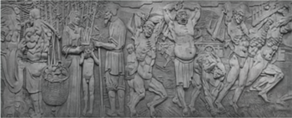

# 2024年海南省公务员录用考试《行测》题（网友回忆版）

> 常识判断 · 15 题 · 海南 2024

## 第 1 题　qid 10204509 · 人文常识

中华文明源远流长，云娱乐中华民族的宝贵精神品格，*********，创造形成了引领中国社会发展进步的社会主义道德体系。下列古语符合社会主义道德体系建设要求的是：
①见侮而不斗，辱也
②百尺之室，以突隙之烟焚
③躬自厚而薄责于人，则远怨矣
④黑发不知勤学早，白首方悔读书迟

- **A**. ①②
- **B**. ①③　✅
- **C**. ②③
- **D**. ③④

**答案**：B

**官方解析**

略。

---

## 第 2 题　qid 10204483 · 人文常识

下图是中国国家博物馆西大厅的巨型浮雕，与之相关说法错误的是：

- **A**. “锲而不舍，金石可镂”是浮雕故事主人公的名言　✅
- **B**. 毛泽东在七大闭幕词中提到了浮雕中的故事
- **C**. 浮雕是以徐悲鸿同名国画为原本创作而成的
- **D**. 浮雕所展现的故事记载在《列子·汤问》中

**答案**：A

**官方解析**

本题考查人文常识。
图片为中国国家博物馆西大厅的巨型花岗岩浮雕“愚公移山”。
A项错误，“锲而不舍，金石可镂”出自《荀子·劝学》，是儒家代表人物荀子的名言。意思是只要坚持不停地用刀刻，就算是金属玉石也可以雕出花饰。
B项正确，1945年6月11日，在党的七大闭幕式上，毛泽东引用了愚公移山的故事：“现在也有两座压在中国人民头上的大山，一座叫做帝国主义，一座叫做封建主义。中国共产党早就下了决心，要挖掉这两座山。我们一定要坚持下去，一定要不断地工作，我们也会感动上帝的。这个上帝不是别人，就是全中国的人民大众。”
C项正确，“愚公移山”浮雕以徐悲鸿客居印度时所作的国画《愚公移山》为原本，由雕塑家曾成钢主持创作，长36米，高12米，面积略大于一个标准的篮球场。
D项正确，“愚公移山”是《列子·汤问》中一个神话传说：愚公因太行、王屋二山阻碍其出入，带领子孙想把山铲平。有人因此取笑他，他说：“虽我之死，有子存焉；子又生孙，孙又生子；子又有子，子又有孙；子子孙孙无穷匮也，而山不加增，何苦而不平？”他的言行感动了上天，两座山被搬走了。
本题为选非题，故正确答案为A。

---

## 第 3 题　qid 16593152 · 经济常识

货币不仅是固定充当一般等价物的特殊商品，更是人类文明发展史中各个阶段的里程碑，下列语句中关于货币的发展按时间先后排序正确的是：
①氓之蚩蚩，抱布贸丝
②青钱白璧买无端，丈夫快意方为欢
③农工商交易之路通，而龟贝金钱，刀布之币兴焉
④蜀川老觉家潼川，怀中交子是铁钱

- **A**. ①④②③
- **B**. ②④①③
- **C**. ③②①④
- **D**. ①③②④　✅

**答案**：D

**官方解析**

本题考查经济常识。
货币的发展经历了偶然的物物交换，扩大的物物交换，以一般等价物为媒介的交换，以金属货币为媒介的物物交换这四个阶段。
①出自先秦《诗经·卫风·氓》，意思是憨厚的农家小伙子，怀抱布匹来换丝。偶然的物物交换发生在原始社会末期，是在部落双方都有剩余产品这种极其偶然的情况下发生的。“抱布贸丝”则反映了在当时随着生产力和社会分工的发展，物物交换的范围扩大且次数频繁，即扩大的物物交换。
②出自唐代李贺的《相劝酒》，意思是纵有青钱白璧无数，买不到光阴半寸，身为伟岸丈夫，要的是快意欢颜。青钱即青铜钱，白璧是平圆形而中有孔的白玉，这里代指的就是流通的金属货币。
③出自《史记·平准书》，意思是龟贝金钱刀布的货币的流通会促进农工商交易之路通畅。龟是龟甲，贝是贝壳，金在商周时期主要指的是青铜，钱指铁铲，刀则指的是兵器，而布则是布匹。体现了以一般等价物为媒介的物物交换。
④出自宋代释慧空的《送僧三首·其一》，交子是宋代发行的一种纸币，可以兑现，便于流通，也是世界上最早的纸币。纸币产生于一般等价物固定在金银上之后，是代替金属货币执行流通手段的价值符号。
故正确排序为①③②④。
故正确答案为D。

---

## 第 4 题　qid 16593165 · 法律常识

下列关于自首的判断说法正确的是：

- **A**. 甲和乙共同实施盗窃犯罪，后甲因为内心害怕，主动到公安机关交代，并独自承担了全部罪行，甲构成自首
- **B**. 甲和乙共同实施诈骗犯罪，后甲因酒驾被公安机关讯问时，主动交代乙曾经实施的故意杀人行为，甲构成自首
- **C**. 王某交通肇事逃逸，其父知道后将其扭送至公安机关，王某主动交代了其肇事逃逸行为，王某构成自首　✅
- **D**. 甲公司非法集资且规模很大，该公司总经理李某因为害怕，瞒着其他高管偷偷到公安机关交代了相关情况，李某作为单位犯罪的直接责任人不能单独成立自首

**答案**：C

**官方解析**

本题考查法律常识。
根据《中华人民共和国刑法》第六十七条规定：“犯罪以后自动投案，如实供述自己的罪行的，是自首。对于自首的犯罪分子，可以从轻或者减轻处罚。其中，犯罪较轻的，可以免除处罚。被采取强制措施的犯罪嫌疑人、被告人和正在服刑的罪犯，如实供述司法机关还未掌握的本人其他罪行的，以自首论。犯罪嫌疑人虽不具有前两款规定的自首情节，但是如实供述自己罪行的，可以从轻处罚；因其如实供述自己罪行，避免特别严重后果发生的，可以减轻处罚。”
A项错误，根据《最高人民法院关于处理自首和立功具体应用法律若干问题的解释》第一条规定：“······共同犯罪案件中的犯罪嫌疑人，除如实供述自己的罪行，还应当供述所知的同案犯，主犯则应当供述所知其他同案犯的共同犯罪事实，才能认定为自首······”题中，甲独自承担了全部罪行，并未如实供述同案犯，不构成自首。
B项错误，根据《最高人民法院关于处理自首和立功具体应用法律若干问题的解释》第五条规定：“根据刑法第六十八条第一款的规定，犯罪分子到案后有检举、揭发他人犯罪行为，包括共同犯罪案件中的犯罪分子揭发同案犯共同犯罪以外的其他犯罪，经查证属实；提供侦破其他案件的重要线索，经查证属实；阻止他人犯罪活动；协助司法机关抓捕其他犯罪嫌疑人（包括同案犯）；具有其他有利于国家和社会的突出表现的，应当认定为有立功表现。”题中，甲主动交代乙的其他罪行，构成立功，不构成自首。
C项正确，根据《最高人民法院关于处理自首和立功具体应用法律若干问题的解释》第一条规定：“······并非出于犯罪嫌疑人主动，而是经亲友规劝、陪同投案的；公安机关通知犯罪嫌疑人的亲友，或者亲友主动报案后，将犯罪嫌疑人送去投案的，也应当视为自动投案······”题中，王某虽被扭送至公安机关，但主动交代罪行，构成自首。
D项错误，根据《中华人民共和国刑法》第三十一条规定：“单位犯罪的，对单位判处罚金，并对其直接负责的主管人员和其他直接责任人员判处刑罚。本法分则和其他法律另有规定的，依照规定。”《办理走私刑事案件适用法律若干问题的意见》第二十一条规定：“关于单位走私犯罪案件自首的认定问题在办理单位走私犯罪案件中，对单位集体决定自首的，或者单位直接负责的主管人员自首的，应当认定单位自首。认定单位自首后，如实交代主要犯罪事实的单位负责的其他主管人员和其他直接责任人员，可视为自首，但对拒不交代主要犯罪事实或逃避法律追究的人员，不以自首论。”因此，司法实践中认可单位自首的情形。题中，李某作为单位直接负责人，虽然瞒着其他高管单独到公安机关交代相关情况，但仍构成单位自首。
故正确答案为C。

---

## 第 5 题　qid 16593148 · 地理国情

下列关于我国科技成就说法正确的是：
①“三峡氢舟1号”——助推我国首次在南海海域成功开采可燃冰
②“可持续发展科学卫星1号”——专门服务联合国2030年可持续发展议程的科学卫星
③“蓝鲸1号”——我国首艘氢燃料电池动力示范船
④“耕海1号”——将渔业养殖、海上旅游、科技研发等功能相结合的海洋牧场综合体

- **A**. ①③
- **B**. ②③
- **C**. ①④
- **D**. ②④　✅

**答案**：D

**官方解析**

本题考查科技常识。
①③错误，“三峡氢舟1”号由三峡集团长江电力等单位共同研发建造，是国内首艘入级中国船级社氢燃料电池动力船。我国首艘氢燃料电池动力示范船“三峡氢舟1”号于2023年10月11日在长江三峡起始点湖北宜昌首航。这标志着氢燃料电池技术在我国内河船舶应用实现零的突破。2017年5月18日，在距离祖国大陆300多公里的我国南海北部神狐海域“蓝鲸一号”海上钻井平台，国土资源部部长、党组书记、国家土地总督察姜大明宣布，我国进行的首次可燃冰（天然气水合物）试采实现连续稳定产气，取得天然气水合物试开采的历史性突破，首次可燃冰试采宣告成功。
②正确，2021年11月5日，我国在太原卫星发射中心成功发射可持续发展科学卫星1号（SDGSAT-1）。SDGSAT-1是全球首颗专门服务联合国2030年可持续发展议程的科学卫星，也是中国科学院首颗地球科学卫星。
④正确，“耕海1号”是由山东海洋集团投资建造的全国首座综合性、示范性、集成性的智能化大型现代生态海洋牧场综合体平台，犹如一朵海上花绽放在烟台美丽的“四十里湾”海域。项目采用一、三产业深度融合的运营模式，在国内首次将渔业养殖、智慧渔业、休闲渔业、科技研发、科普教育等功能集成在统一平台，是装备型省级海洋牧场示范项目，装备型海洋牧场建设“山东标准”的唯一试点项目。
综上，②④正确。
故正确答案为D。

---

## 第 6 题　qid 10204467 · 人文常识

唐太宗的《起居注》一直流传至今，以下情景不可能出现的是：

- **A**. 与大臣一同品鉴李白的诗歌　✅
- **B**. 与房玄龄等大臣商议旱灾救助方案
- **C**. 接见西域使者，被少数民族尊为“天可汗”
- **D**. 宗庙祭祀，向其父唐高祖李渊上香祷告

**答案**：A

**官方解析**

本题考查人文常识。
起居注，是中国古代记录帝王的言行录，该史书体例由东汉明德皇后开创。唐太宗李世民（599年—649年）是唐朝的第二位皇帝，在位期间被称为“贞观之治”。
A项错误，李白（701年—762年），盛唐时期著名诗人，字太白，号青莲居士，被誉为“诗仙”，代表作有《望庐山瀑布》《行路难》《蜀道难》等。故选项所述情景不可能出现。
B项正确，房玄龄（579年—648年），名乔，字玄龄，凌烟阁二十四功臣之一，与杜如晦合称为“房谋杜断”。房玄龄是李世民得力的谋士之一，参与玄武门之变，与杜如晦等五人并功第一。李世民即位后，房玄龄为中书令，负责综理朝政长达二十年。故选项所述情景可能出现。
C项正确，“天可汗”是唐代西北各族君长对唐太宗的尊称，也是表示对唐太宗的拥戴。“可汗”本是突厥、回纥、柔然等民族最高统治者的称号，“天可汗”就等于是给予各民族共同拥戴的最高统治者的尊称。贞观四年唐王朝击败东突厥以后，唐太宗接受诸蕃君长所奉“天可汗”称号。故选项所述情景可能出现。
D项正确，李渊是唐朝的开国皇帝，是唐太宗李世民的父亲。贞观九年，李渊病逝，谥号太武皇帝，庙号高祖，葬于献陵。故选项所述情景可能出现。
本题为选非题，故正确答案为A。

---

## 第 7 题　qid 16593230 · 人文常识

下列文句与蕴含的哲理对应正确的是：

- **A**. 竭泽而渔，岂不获得，而明年无鱼——事物是不断发展的
- **B**. 井蛙不可以语于海，夏虫不可以语于冰——尊重客观规律
- **C**. 吾生也有涯，而知也无涯。以有涯随无涯，殆已——勤学善记
- **D**. 兵无常势，水无常形，能因敌变化而取胜者，谓之神——学会审时度势　✅

**答案**：D

**官方解析**

本题考查政治常识。
A项错误，“竭泽而渔，岂不获得，而明年无鱼”出自《吕氏春秋·览·孝行览》，把池水抽干去捕鱼，哪能捉不到呢，只是第二年就没鱼了。比喻取之不留余地，只图眼前利益，不作长远打算。没有用发展的眼光看问题，而是用孤立、静止的思维思考问题，属于形而上学的观点。
B项错误，“井蛙不可以语于海，夏虫不可以语于冰”出自《庄子·外篇·秋水》，意思是对井里的蛙不可与它谈论关于海的事情，对夏天生死的虫子不可与它谈论关于冰雪的事情。这是因为井蛙的眼界受空间限制，夏虫的眼界受到时令的制约，体现了认识来源于实践的哲学原理。
C项错误，“吾生也有涯，而知也无涯。以有涯随无涯，殆已”出自《庄子·内篇·养生主》，意思是我的生命是有限的，而知识是无限的。用有限的生命去追求无限的知识，真是累人啊！体现了认识是在实践基础上不断向前发展的。人们在实践中追求和发展真理是一个永无止 境的过程。
D项正确，“兵无常势，水无常形，能因敌变化而取胜者，谓之神”出自《孙子兵法·虚实篇》，意思是用兵作战没有固定不变的方法态势，如同水流没有固定的形状，能够依据敌情的变化而取胜，可称得上用兵如神了。体现了一切事物都是不断运动、变化、发展的，要用发展的眼光看问题，学会审时度势。
故正确答案为D。
注：本题存在瑕疵，D项不是哲理的表述，但前后所反映的哲理一致。

---

## 第 8 题　qid 16593228 · 人文常识

关于我国历史上的科技著作，下列说法错误的是？

- **A**. 《天工开物》——中国17世纪的工艺百科全书
- **B**. 《坤舆万国全图》——中国最早的彩绘世界地图
- **C**. 《水经注》——介绍了欧洲先进的水利技术和工具　✅
- **D**. 《徐霞客游记》——世界最早关于石灰岩地貌研究的文献

**答案**：C

**官方解析**

本题考查人文常识。
A项正确，《天工开物》初刊于1637年（明崇祯十年），作者是明朝科学家宋应星。这是世界上第一部关于农业和手工业生产的综合性著作，外国学者称它为“中国17世纪的工艺百科全书”。
B项正确，《坤舆万国全图》是明朝万历年间利玛窦和李之藻合作绘制的世界地图，是中国最早的彩绘世界地图，推动了中国地理学的发展和中西方文化交流，是中国乃至世界地图发展史上的珍品。
C项错误，《水经注》是古代中国地理名著，作者是北魏晚期的郦道元。《水经注》以《水经》为纲，详细记载了中国一千多条大小河流及有关的历史遗迹、人物掌故、神话传说等，是中国古代最全面、最系统的综合性地理著作。不涉及欧洲先进的水利技术和工具。
D项正确，《徐霞客游记》是明代地理学家徐霞客创作的一部散文游记，主要按日记述作者1613年至1639年间旅行观察所得，对地理、水文、地质、植物等现象，均做了详细记录。其书中对石灰溶蚀地貌的观察和记述，早于欧洲约两个世纪，是世界最早关于石灰岩地貌研究的文献。
本题为选非题，故正确答案为C。

---

## 第 9 题　qid 16593153 · 人文常识

下列情景在历史上最有可能发生的是：

- **A**. 西汉末年，某将军与谋士在探讨夷陵之战的胜败之因
- **B**. 唐朝初期，市面上流通带有“开元通宝”的字样的钱币　✅
- **C**. 魏晋时期，某官员家中收藏了褚遂良的众多书法作品
- **D**. 宋朝时期，农民在耕作时参考《王祯农书》里的内容

**答案**：B

**官方解析**

本题考查人文常识。
A项错误，夷陵之战，是三国时期蜀汉昭烈帝刘备对东吴发动的大规模战役，以蜀汉战败为结束。此战是中国古代战争史上一次著名的积极防御的成功战例，也是三国“三大战役”的最后一场。故在西汉末年，不可能有将军与谋士探讨夷陵之战的胜败之因。
 B项正确，唐高祖时期，为整治混乱的币制，废隋钱，效仿西汉五铢的严格规范，开铸“开元通宝”，取代社会上遗存的五铢。故唐朝初期，可能在市面上流通带有“开元通宝”的字样的钱币。
C项错误，褚遂良，字登善，唐朝宰相、政治家、书法家，弘文馆学士褚亮之子。其与欧阳询、虞世南、薛稷并称“初唐四大家”，传世墨迹有《孟法师碑》《雁塔圣教序》等。魏晋时期是指东汉瓦解后，三国到两晋的时期。故魏晋时期，不可能有官员家中收藏了褚遂良的众多书法作品。
 D项错误，《王祯农书》作者为王祯，成书于元朝，此书分为《农桑通诀》《百谷谱》和《农器图谱》三大部分。此书兼论中国北方农业技术和中国南方农业技术，在中国古代农学遗产中占有重要地位。故宋朝时期，不可能有农民在耕作时参考《王祯农书》。 
故正确答案为B。

---

## 第 10 题　qid 10204501 · 人文常识

下列世界文化遗产及所在地对应错误的是：

- **A**. 平遥古城——山西；鼓浪屿——福建
- **B**. 龙门石窟——河南；云冈石窟——陕西　✅
- **C**. 布达拉宫——西藏；良渚古城遗址——浙江
- **D**. 武当山古建筑群——湖北；西递村——安徽

**答案**：B

**官方解析**

本题考查地理国情。
A项正确，平遥古城位于山西省晋中市，始建于西周宣王时期（前827年—前782年），于明代洪武三年（1370年）重建、扩修城池，是现今中国境内保存最为完整的一座古代县城；1997年12月3日，平遥古城与周边的双林寺、镇国寺共同被联合国教科文组织确定为世界文化遗产，列入《世界遗产名录》。鼓浪屿位于福建省厦门市，岛西南有一海蚀岩洞受浪潮冲击，声如擂鼓，自明朝雅化为今名称“鼓浪屿”；2017年7月8日，“鼓浪屿：历史国际社区”被列入世界遗产名录。
B项错误，龙门石窟位于河南省洛阳市，是世界上造像最多、规模最大的石刻艺术宝库，被联合国教科文组织评为“中国石刻艺术的最高峰”，中国著名石窟之一，现为世界文化遗产。云冈石窟位于山西省大同市，原名灵岩寺、石佛寺，是中国第一个皇家授权开凿的石窟；2001年，云冈石窟被联合国教科文组织列入世界文化遗产名录。
C项正确，布达拉宫位于西藏自治区首府拉萨市，是一座宫堡式建筑群，主体建筑为白宫和红宫两部分；1994年，布达拉宫被列入世界遗产名录。良渚古城遗址位于浙江省杭州市余杭区，由良渚古城核心区、水利系统、祭坛墓地和外围郊区等部分组成；2019年7月6日，良渚古城遗址获准列入世界遗产名录。
D项正确，武当山古建筑群位于湖北省丹江口市境内，敕建于唐贞观年间，明代达到鼎盛；1994年，武当山古建筑群被列入世界文化遗产名录。西递村位于安徽省黟县西递镇，地处黄山南麓、黟县盆地南侧，始建于北宋皇佑年间，发展于明朝景泰中叶，鼎盛于清代初期；2000年，以西递村为代表的皖南古村落被联合国教科文组织列入世界文化遗产名录。
本题为选非题，故正确答案为B。

---

## 第 11 题　qid 16593150 · 人文常识

下列关于我国之“最”说法错误的是：

- **A**. 东北平原是我国最大平原，北部为松嫩平原，南部为辽河平原
- **B**. 三沙市成立于2012年，隶属海南省，是我国位置最南的地级市
- **C**. 台湾岛位于东海南部，是我国第一大岛，有“东海瀛洲”之称　✅
- **D**. 新疆维吾尔自治区是我国陆地面积最大、交界邻国最多的省级行政区

**答案**：C

**官方解析**

本题考查地理常识。
A项正确，东北平原，是中国三大平原之一，也是中国最大的平原，位于中国东北部，由三江平原、松嫩平原、辽河平原组成，地跨黑龙江、吉林、辽宁和内蒙古四个省区。根据东北平原不同的区域特征，可分为三个亚区平原，即东北角的三江平原、北部的松嫩平原和南部的辽河平原。
B项正确，三沙市于2012年7月24日正式揭牌成立，是中国位置最南、面积最大、陆地面积最小及人口最少的地级市。三沙市为海南省辖地级市，地处中国南海中南部，海南省南部，辖西沙群岛、中沙群岛、南沙群岛的岛礁及其海域，陆地面积20多平方千米，陆海面积约200万平方千米。
C项错误，台湾岛是我国第一大岛，战略要地，位于东海南部，西依台湾海峡。面积约3.588万平方公里，占到整个台湾省面积的99%，南北跨度近400公里，东西跨度约145公里，有长达1150多公里的海岸线。崇明岛，是长江三角洲东端长江口处的冲积岛屿，也是中国第三大岛屿、中国最大的河口冲积岛、中国最大的沙岛，其成陆历史有1300多年，被誉为“长江门户、东海瀛洲”。
D项正确，新疆维吾尔自治区位于中国西北地区，面积166.49万平方千米，是中国陆地面积最大的省级行政区，约占中国国土总面积的六分之一。新疆维吾尔自治区地处亚欧大陆腹地，陆地边境线5600多千米，周边与俄罗斯、哈萨克斯坦、吉尔吉斯斯坦、塔吉克斯坦、巴基斯坦、蒙古、印度、阿富汗八国接壤，是我国国境线最长、交界邻国最多的省级行政区。
本题为选非题，故正确答案为C。

---

## 第 12 题　qid 16593156 · 科技常识

下列古籍中描述的现象与所体现的物理原理对应正确的是（    ）。

- **A**. 《论衡》中提到摩擦过的琥珀能吸引像草芥一样的轻小物体——分子引力
- **B**. 《考工记》中提到马拉车时，虽然马不再施力了，车仍能向前移动一段距离——惯性　✅
- **C**. 《墨子》中提到天平一端加重物，另一端必得加重物，两者必须相等才能平衡——力的相互作用
- **D**. 《异苑》中提到有户人家的铜盆经常发出声音，后来发现是与宫中撞钟相应，用锉刀锉了铜盆后，声音就消失了——多普勒效应

**答案**：B

**官方解析**

本题考查科技常识。
A项错误，中国学者王充在《论衡》一书写下“顿牟掇芥”，意为摩擦过的琥珀能吸引轻小草芥。摩擦后的琥珀得到了带负电的电子，它能吸引轻小草芥说明带电体具有吸引轻小物体的性质，体现了摩擦起电效应，和分子引力无关。
B项正确，《考工记》中记载“马力既竭，辀（指车轮）犹能一取焉”，意思是没有了马的拉力以后，马车车轮仍然能往前行驶一段距离。马车原来是前进的，当马的拉力消失后，因为马车具有惯性，仍然要保持原来的前进状态，因此马车还可以继续向前移动一段距离。
C项错误，《墨经》中记载：“衡，加重于其一旁，必捶，权重相若也。”这句话的意思是：天平衡量的一臂加重物时，另一臂则要加砝码，且两者必须等重，天平才能平衡。这句话解释的是杠杆的原理，和力的相互作用无关。
D项错误，《异苑》中记载一个人来向张华请教，说他家有一个洗澡用的大铜盆，每日早晚总会嗡嗡作响，就像有人在敲打一般。张华答：这只铜盆和洛阳宫中大钟的音调相谐，宫中每天早晚都要撞钟，所以使铜澡盆有声相应。张华还告诉他只要把铜盆锉掉一点，使其变轻，便不会再作响。这体现了共鸣原理，和多普勒效应无关。多普勒效应是由于波源与观测者相对运动而出现的观测者测得的波频率与波源频率不同的现象。
故正确答案为B。

---

## 第 13 题　qid 10204491 · 科技常识

下列关于游乐项目所蕴含物理原理的说法错误的是：

- **A**. 过山车快速下降时，人感觉自己要飘起来了，是因为人的重力减小了　✅
- **B**. 沙滩车的轮子往往做得特别宽大，是为了减小轮子对沙地的压强，防止下陷
- **C**. 蹦极运动中，腿部绑弹性绳，是为了增加绳对人的作用时间，减小绳对人的作用力
- **D**. 跷跷板游戏中，人越靠近支点越不容易压动跷跷板，是人对板作用力的力臂减小的缘故

**答案**：A

**官方解析**

本题考查科技常识。

A项错误，过山车快速下降时，加速度向下，此时人体属于失重状态，因此感觉自己飘起来了，失重是物体对支持物的压力小于物体所受重力的现象。物体由于地球的吸引而受到的力叫重力，方向总是竖直向下，乘坐过山车时人的重力不变。

B项正确，根据压强公式，当沙滩车对地面的压力一定时，增大受力面积可以减少压强，从而防止下陷，便于在沙滩上行驶。

C项正确，蹦极运动中，腿部绑弹性绳，是因为弹性绳拉长吸收能量，运动能量转化为弹性绳的弹力能量；弹性绳缩短释放能量，弹性绳的弹力能量转化为运动能量，弹性绳通过吸收和释放能量，使参与者在跳跃后能够反弹回升。由此增加绳对人的作用时间，减小绳对人的作用力，更好地保护蹦极的人。

D项正确，根据杠杆原理（动力×动力臂=阻力×阻力臂），人对跷跷板的压力是动力和阻力，人到跷跷板的固定点的距离是力臂；当动力和阻力一定时，人越靠近支点，人对板作用力的力臂越小，越不容易压动跷跷板；人越远离支点，人对板作用力的力臂越大，越容易压动跷跷板。

本题为选非题，故正确答案为A。

---

## 第 14 题　qid 16593154 · 科技常识

下列诗词中包含的生物学现象说法错误的是（    ）。

- **A**. 野火烧不尽，春风吹又生——草原生态系统具有稳定性
- **B**. 群雁辞归鹄南翔，念君客游思断肠——候鸟通过迁徙适应气候变化
- **C**. 停车坐爱枫林晚，霜叶红于二月花——植物开花受温度和光照影响　✅
- **D**. 落红不是无情物，化作春泥更护花——微生物的分解作用及物质的循环

**答案**：C

**官方解析**

本题考查科技常识。
A项正确，“野火烧不尽，春风吹又生”出自唐代诗人白居易的《赋得古原草送别》。诗句的意思是：野火不能烧尽野草，春天一到野草会长出来。生态系统稳定性即为生态系统所具有的保持或恢复自身结构和功能相对稳定的能力。这句诗通过描述野火燃烧和春风吹拂后植被再生的情景，体现了草原生态系统在面对破坏时的恢复和重生能力，展现了其具有一定的稳定性。
B项正确，“群雁辞归鹄南翔，念君客游思断肠”出自魏晋时期诗人曹丕的《燕歌行二首·其一》。诗句的意思是：燕群辞归，天鹅南飞。思念出外远游的良人啊，我肝肠寸断。这句诗描写了候鸟离开北方迁徙到南方的场景。候鸟是指栖息地和繁殖地之间在不同季节之间往返的鸟类，它们通常会根据气候和资源的变化而进行周期性的迁徙，以适应气候变化，寻找适宜的生存条件。
C项错误，“停车坐爱枫林晚，霜叶红于二月花”出自唐朝诗人杜牧的《山行》。诗句的意思是：停下车来，是因为喜爱这深秋的枫林晚景，那经霜的枫叶竟比二月的鲜花还要火红。夏天的枫叶是绿色的，这是因为枫叶中含有大量的叶绿素。叶绿素对绿光的吸收少、反射多导致叶片呈现绿色；当秋天到来天气温度变低，叶绿素被降解，叶片就会呈现出花青素的颜色。花青素又称红色素，位于叶片细胞的液泡内，使叶片呈现红色。所以该句诗主要体现了温度对色素的影响。
D项正确，“落红不是无情物，化作春泥更护花”出自清代龚自珍的《己亥杂诗·其五》。诗句的意思是：从枝头上掉下来的落花不是无情之物，即使化作春泥，也甘愿化作养料，滋养美丽的花朵生长。这是由于在自然界中，土壤中的微生物可以分解落叶、枯枝、落花等有机物质，将这些有机物质转化为土壤中的无机盐等物质，使土壤更加肥沃，为植物提供养分。通过分解者的分解，这些有机物质回归到环境中并被再次利用，促进了自然界的物质循环。
本题为选非题，故正确答案为C。

---

## 第 15 题　qid 10204482 · 科技常识

下列有关生活常识说法错误的是：

- **A**. 白糖水分含量少、糖分高，不耐储存　✅
- **B**. 食醋的pH值比较低，可以抑制微生物的生长
- **C**. 美白牙膏通常采用过氧化钙等过氧化物漂白牙齿
- **D**. 削了皮的苹果变色是一种化学反应，会影响苹果的口感

**答案**：A

**官方解析**

本题考查科技常识。
A项错误，白糖的化学性质稳定，水分少、糖分高，不利于微生物繁殖，很耐储存。
B项正确，食醋的pH值比较低，可以明显抑制微生物生长，防止杂菌污染，能达到长期保存的效果。
C项正确，美白牙膏通常采用过氧化钙等过氧化物漂白牙齿，过氧化钙遇水才能分解出能够最终发挥效用的过氧化氢。
D项正确，削了皮的苹果发生酶促褐变反应后表面会变成褐色，影响苹果的外观和口感，表层的部分营养成分有所降低。酶促褐变反应是在有氧的条件下，酚酶催化酚类物质形成醌及其聚合物，该反应是化学反应。
本题为选非题，故正确答案为A。

---
