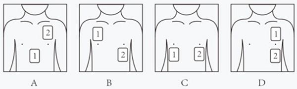
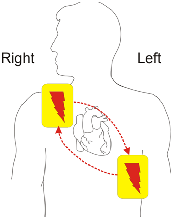

# 2024年深圳市考公务员录用考试《行测》试题（网友回忆版）

> 常识判断 · 19 题 · 深圳市考 2024

## 第 1 题　qid 12536546 · 经济常识

在最近一次特别提款权（SDR）定值审查中，国际货币基金组织正式将人民币在SDR货币篮子中的权重上调至12.28%，升幅1.36个百分点。SDR是一种国际储备资产，人民币权重上调将有助于提升人民币资产的国际吸引力，提振市场对人民币的信心。SDR货币篮子中其余“入篮”货币不包括（    ）。

- **A**. 欧元
- **B**. 日元
- **C**. 澳元　✅
- **D**. 英镑

**答案**：C

**官方解析**

本题考查经济常识。
A、B、D三项正确，C项错误。2022年5月，国际货币基金组织（IMF）执董会完成了5年一次的特别提款权（SDR）定值审查。这是2016年人民币成为SDR篮子货币以来的首次审查。执董会一致决定，维持现有SDR篮子货币构成不变，即仍由美元、欧元、人民币、日元和英镑构成，并将人民币权重由10.92%上调至12.28%，将美元权重由41.73%上调至43.38%，同时将欧元、日元和英镑权重分别由30.93%、8.33%和8.09%下调至29.31%、7.59%和7.44%，人民币权重仍保持第三位。新的SDR货币篮子在2022年8月1日正式生效，并于2027年开展下一次SDR定值审查。
本题为选非题，故正确答案为C。

---

## 第 2 题　qid 12536520 · 人文常识

甲市乙区生态环境局拟同时向甲市生态环境局与乙区政府发文，报告辖区 2023年度生态环境质量状况，关于公文拟制与办理，下列说法正确的是（    ）。

- **A**. 因行文内容相同，可形成一份报告主送甲市生态环境局与乙区政府两个机关
- **B**. 分别形成报告并分开主送甲市生态环境局与乙区政府　✅
- **C**. 可根据需要，将向乙区政府行文的报告抄送乙区生态环境局的派出机构
- **D**. 可根据需要，将向甲市生态环境局行文的报告抄送乙区生态环境局的派出机构

**答案**：B

**官方解析**

本题考查公文写作与处理。
B项正确，A、C、D三项错误，根据《党政机关公文处理工作条例》第十五条规定：“向上级机关行文，应当遵循以下规则：（一）原则上主送一个上级机关，根据需要同时抄送相关上级机关和同级机关，不抄送下级机关。”题中，乙区生态环境局作为乙区人民政府的工作部门，实行以甲市生态环境局为主的双重管理体制，因此要分别形成报告并分开主送甲市生态环境局与乙区人民政府。而乙区生态环境局的派出机构属于乙区生态环境局的下级机关，因此不得将报告抄送至该机构。
故正确答案为B。

---

## 第 3 题　qid 12536523 · 人文常识

游乐园里的过山车充满惊险刺激，它通常以机械牵引或弹射的方式起步，逐步爬升至轨道最高点，随后快速下降至轨道底部。关于过山车的速降过程，下列说法错误的是（    ）。

- **A**. 过山车突然开始下降时，乘客产生失重的感觉
- **B**. 过山车尾部车厢通过最高点时的速度比头部车厢快
- **C**. 过山车下降时，其势能快速减小，动能快速增大
- **D**. 根据能量守恒定律，过山车的机械能保持不变　✅

**答案**：D

**官方解析**

本题考查科技常识。
A项正确，失重是物体对支持物的压力（或对悬挂物的拉力）小于物体所受重力的现象。当过山车加速向下运动时，所受的竖直方向的力是向上的支持力和向下的重力，此时因为具有向下的加速度，所以支持力小于所受重力，会有失重的感觉。
B项正确，过山车尾部车厢通过最高点时的速度比过山车头部车厢要快，这是由于过山车中部的重心最高时，重力势能最大，而当尾部到达最高点时，重心位置已经不在最高位置，已经有一部分重力势能转化为动能了。
C项正确，D项错误，势能是物体（或系统）由于位置或位形而具有的能；动能是物体由于做机械运动而具有的能。过山车在最高点开始下降的过程中高度不断降低，势能不断减小，势能转化为动能，下降过程中速度不断增大。但是，在整个过山车运动的过程中涉及到空气阻力和摩擦阻力等，因此整个过程的机械能会因为转化为了内能而减小。
本题为选非题，故正确答案为D。

---

## 第 4 题　qid 12536530 · 法律常识

某日，未取得驾驶证的甲驾驶私家车回家，途中见路人乙向其挥手，随即停车，乙询问可否无偿搭乘甲的顺风车，甲同意，在后续行驶过程中，甲因接打电话未及时发现侧方来车，情急之下紧急制动，虽成功避免相撞，但急刹致乙受伤，下列说法正确的是（    ）。

- **A**. 因乙无偿搭乘，甲不承担责任
- **B**. 甲应当承担侵权责任　✅
- **C**. 因甲出于善意，其承担的法律责任应酌情减轻
- **D**. 因乙未询问甲是否取得驾驶证，乙自行承担责任

**答案**：B

**官方解析**

本题考查法律常识。
A、C、D三项错误，B项正确，根据《中华人民共和国民法典》第一千二百一十七条规定：“非营运机动车发生交通事故造成无偿搭乘人损害，属于该机动车一方责任的，应当减轻其赔偿责任，但是机动车使用人有故意或者重大过失的除外。”题中，甲无证驾驶非营运机动车，且在行车中接打电话，虽乙属于无偿搭乘，但甲构成重大过失，应承担侵权责任。
故正确答案为B。

---

## 第 5 题　qid 12536569 · 科技常识

以下岩石与其分类和特点，对应不正确的是（    ）。

- **A**. 大理岩——变质岩，适用于建筑装饰材料
- **B**. 玄武岩——岩浆岩，常存有动植物化石　✅
- **C**. 页岩——沉积岩，蕴藏油气资源
- **D**. 石灰岩——沉积岩，常构成喀斯特地貌

**答案**：B

**官方解析**

本题考查地理国情。
A项正确，大理岩是由变质作用所形成的岩石，是由地壳中先形成的岩浆岩或沉积岩，在环境条件改变的影响下，矿物成分、化学成分以及结构构造发生变化而形成的，常用来做建筑装饰材料。
B项错误，岩浆岩又称火成岩，是由岩浆喷出地表或侵入地壳冷却凝固所形成的岩石，有明显的矿物晶体颗粒或气孔，约占地壳总体积的65%，总质量的95%。玄武岩是由火山喷发出的岩浆冷却后凝固而成的一种致密状或泡沫状结构的岩石，它在地质学的岩石分类中，属于岩浆岩。但是岩浆岩里基本没有动植物化石。
C、D两项正确，沉积岩是在地壳发展演化过程中，在地表或接近地表的常温常压条件下，任何先成岩遭受风化剥蚀作用的破坏产物，以及生物作用与火山作用的产物在原地或经过外力的搬运所形成的沉积层，又经成岩作用而成的岩石。在地球地表，有70%的岩石是沉积岩，但如果从地球表面到16公里深的整个岩石圈算，沉积岩只占5%。沉积岩主要包括石灰岩、砂岩、页岩等。沉积岩中所含有的矿产（油气资源等），占全部世界矿产蕴藏量的80%。喀斯特地貌是地下水与地表水对可溶性岩石溶蚀与沉淀，侵蚀与沉积，以及重力崩塌、坍塌、堆积等作用形成的地貌。其中沉积岩中的石灰岩就是典型的可溶性岩石。
本题为选非题，故正确答案为B。

---

## 第 6 题　qid 12536571 · 人文常识

2023年是共建“一带一路”倡议提出10周年，10年来，共建“一带一路”成为深受欢迎的国际公共产品和最大规模的国际合作平台。下列“一带一路”项目与其合作国家对应有误的是（    ）。

- **A**. 雅万高铁项目——印度尼西亚
- **B**. 卡拉奇核电项目——巴基斯坦
- **C**. 中老铁路项目——老挝
- **D**. 中马友谊大桥项目——马来西亚　✅

**答案**：D

**官方解析**

本题考查政治常识。
A项正确，雅万高铁项目是一条连接印度尼西亚雅加达和万隆的高速铁路，合作国家为印度尼西亚。2023年10月2日，雅万高速铁路正式商业化运营。
B项正确，卡拉奇核电项目位于巴基斯坦第一大城市卡拉奇，合作国家为巴基斯坦。2021年5月20日，“华龙一号”海外首堆工程——卡拉奇核电站2号机组正式投入商业运行；2023年2月2日，卡拉奇核电站3号机组落成。
C项正确，中老铁路项目是中国和老挝两国互利合作的旗舰项目，是高质量共建“一带一路”的标志性工程，于2021年正式通车。
D项错误，中马友谊大桥是马尔代夫首座现代化桥梁，是世界首座在远洋深海无遮掩环境及珊瑚礁地质上建造的跨海大桥，与马来西亚无关。2018年8月30日，中马友谊大桥正式开通。
本题为选非题，故正确答案为D。

---

## 第 7 题　qid 10718182 · 经济常识

“休克疗法”是一种应对经济危机、实现经济稳定的政策组合，主要措施是实行贸易自由化，推行国有企业私有化，执行紧缩的金融和财政政策，压缩政府开支、取消能源补贴、全面放开价格，但在短期内可能会使社会经济生活产生巨大震荡甚至出现“休克状态”，某国持续面临严峻的财政赤字和居高难下的通货膨胀，该国新任总统推行“休克疗法”，下列现象，该国短期内将出现（    ）个。
①货币急剧贬值、物价飞涨
②多国愿意与该国互换货币
③取消儿童福利及救济资金
④政府购入及投资大幅减少

- **A**. 1
- **B**. 2
- **C**. 3　✅
- **D**. 4

**答案**：C

**官方解析**

本题考查经济常识。
①正确，②错误，“休克疗法”试图通过货币贬值实现汇率稳定，短期内物价飞涨，甚至可能导致社会不稳定，出现多国抛售该国货币而不是愿意与其互换货币。
③④正确，“休克疗法”通常包含严格的财政紧缩政策，这意味着减少政府开支，减少政府购入及投资和取消各种政府转移支付，如福利和救济金。
正确的有①③④，共3个。
故正确答案为C。

---

## 第 8 题　qid 10718172 · 人文常识

政府的社会职能是指政府在管理社会公共事务，提供社会服务和社会保障等方面的功能，下列行为不属于政府社会职能的是（    ）。

- **A**. 开展老年人居家适老化改造
- **B**. 建设无烟示范社区
- **C**. 实施汽车国六排放标准
- **D**. 提高个人所得税专项附加扣除标准　✅

**答案**：D

**官方解析**

本题考查管理常识。
A、B、C三项正确，政府的基本职能有政治职能、经济职能、文化职能和社会职能。政府的社会职能主要有：社会服务职能；社会保障职能；环境保护职能；人口控制职能。题中，开展老年人居家适老化改造属于社会服务职能；建设无烟示范社区和实施汽车国六排放标准属于环境保护职能。
D项错误，政府的经济职能主要有：计划指导职能；培育和完善市场机制职能；宏观调控职能；服务职能；检查监督职能。题中，提高个人所得税专项附加扣除标准属于积极的财政政策，这属于宏观调控职能。
本题为选非题，故正确答案为D。

---

## 第 9 题　qid 12536539 · 人文常识

立春，为二十四节气之首。立，有“开始”之意；春，代表着温暖、生长，立春节气的公历日期原本固定，但受闰月的影响，农历日期变动相对较大。下列立春相关农谚中，与即将到来的农历甲辰年立春最为贴切的是（    ）。

- **A**. 立春雨水二月间，顶凌压麦种大蒜
- **B**. 春打五九尾，家家啃猪腿
- **C**. 两春夹一冬，十个牛栏九个空
- **D**. 寡年无春腊月寒，来年六月天不闲　✅

**答案**：D

**官方解析**

本题考查人文常识。
A项错误，“立春雨水二月间，顶凌压麦种大蒜”这句农谚说明大蒜能够在早春二月露地培植和繁育，对于气候比较寒冷的北方地区来说，大蒜在早春二月至三月期间播种最为适宜；过早的温度条件不利于大蒜萌芽，而且北方冬季的寒冷程度容易将大蒜幼苗冻死。这里的二月指公历二月。农历2024甲辰年没有立春。
B项错误，“春打五九尾，家家啃猪腿”意思是如果立春到来的时间在五九末尾上，那么这一年就会是一个好年景，家家都会过上好日子。数九是从冬至节气开始，每九天为一个单位，2023年数九从公历2023年12月22日开始，五九为公历2024年1月27日到2024年2月4日，而公历2024年立春在2月4日，在五九末尾。但按农历2024甲辰年来说，没有立春这个节气。
C项错误，“两春夹一冬，十个牛栏九个空”意思是在农历的一年中有两次立春，即年初和年末各出现一次，那么冬季将会特别寒冷，这种寒冷的气候也可能对牲畜（如耕牛）产生不良影响，可能会出现大量的耕牛死亡的情况，以至于"十个牛栏九个空"。2023年是农历癸卯年，时间从公历2023年1月22日（正月初一）开始，一直持续到2024年2月9日（大年三十），公历2023年的立春是2023年2月4日，公历2024年的立春是在2024年2月4日，这两个立春节气都是在农历2023年范围内，即“两春夹一冬”。
D项正确，“寡年无春腊月寒，来年六月天不闲”意思是在无春年的腊月天气一般非常寒冷，到了来年农历六月份的时候雨水会比较多。公历2024年的立春为2024年2月4日，属于农历的2023年，这导致了农历2024年没有立春，即“寡年无春”。
故正确答案为D。

---

## 第 10 题　qid 12536550 · 人文常识

近年来，心源性猝死事件频发，为保障人民群众生命安全，深圳市持续推进公共场所配置自动体外除颤器（AED）项目、AED覆盖率已达全国第一。救助者正确使用AED可为抢救心脏骤停患者争取“黄金四分钟”。下列选项中，AED的两张电极片（数字1、2标示）所贴位置正确的是（    ）。

- **A**. A
- **B**. B　✅
- **C**. C
- **D**. D

**答案**：B

**官方解析**

本题考查科技常识。

B项正确，A、C、D三项错误，自动体外除颤器（AED）又称自动体外电击器、自动电击器、自动除颤器、心脏除颤器及傻瓜电击器等，是一种便携式的医疗设备，它可以诊断特定的心律失常，并且给予电击除颤，是可被非专业人员使用的用于抢救心脏骤停患者的医疗设备。给患者贴电极片时，应在患者胸部适当的位置上，紧密地贴上电极片。通常而言，两块电极片分别贴在右胸上部和左胸左乳头外侧，如下图所示。

故正确答案为B。

---

## 第 11 题　qid 12536553 · 人文常识

关于党政机关公文的发文机关标志，下列说法错误的是（    ）。

- **A**. 既可由发文机关名称加“文件”二字组成，也可单独用发文机关名称
- **B**. 属于公文版头的要素之一
- **C**. 有特定发文机关标志的普发性公文，必须加盖印章　✅
- **D**. 居中排布，推荐使用红色小标宋体字

**答案**：C

**官方解析**

本题考查公文写作与处理。
A、B、D三项正确，《党政机关公文格式》在“7.2 版头”中的“7.2.4 发文机关标志”部分规定：“由发文机关全称或者规范化简称加‘文件’二字组成，也可以使用发文机关全称或者规范化简称。发文机关标志居中排布，上边缘至版心上边缘为35mm，推荐使用小标宋体字，颜色为红色，以醒目、美观、庄重为原则。”
C项错误，《党政机关公文处理工作条例》在“第三章 公文格式”部分的第九条中规定：“（十三）印章。公文中有发文机关署名的，应当加盖发文机关印章，并与署名机关相符。有特定发文机关标志的普发性公文和电报可以不加盖印章。”
本题为选非题，故正确答案为C。

---

## 第 12 题　qid 12536531 · 人文常识

我国民间俗语说：“宅中现四喜，家中出贵人”，“四喜”即堂前飞燕、喜鹊来朝、枯木逢春、壁虎进宅。这种说法的盲目性在于否定了联系的（    ）。

- **A**. 客观性　✅
- **B**. 普遍性
- **C**. 多样性
- **D**. 系统性

**答案**：A

**官方解析**

本题考查政治常识。
A项正确，联系的客观性是指联系是事物本身所固有的，不以人的意志为转移的。将飞燕、喜鹊、枯木和壁虎等事物的出现当做贵人出现的象征是一种主观臆造的关系，违背了联系的客观性。
B项错误，联系的普遍性是指事物或现象之间以及事物内部要素之间相互连结、相互依赖、相互影响、相互作用、相互转化等相互关系。题干未体现。
C项错误，联系的多样性是指世界上的事物是多种多样的，事物之间的联系也是多种多样的。题干未体现。
D项错误，联系的系统性是指事物的相互作用形成系统，系统是普遍联系中的系统，是联系的一种存在形态。题干未体现。
故正确答案为A。

---

## 第 13 题　qid 12536537 · 人文常识

深圳是一座人与自然和谐共生的城市，这片土地养育着多种以深圳地名命名的区域性物种，其中不包括（    ）。

- **A**. 仙湖苏铁
- **B**. 七娘山安蚁甲
- **C**. 南沙黑脸琵鹭　✅
- **D**. 梧桐山突眼翅虫

**答案**：C

**官方解析**

本题考查地理国情。
A项正确，仙湖苏铁是苏铁科苏铁属的植物，系深圳仙湖植物园王定跃先生发现并命名的一个新种，分布在广西、广东及湖南的交界地区。
B、D两项正确，国家野外科学观测研究站新发现4种昆虫新物种，都是以深圳命名，分别为深圳四齿隐翅虫、七娘山安蚁甲、深圳突眼隐翅虫、深圳盘螱隐翅虫。七娘山位于广东省深圳市大鹏新区南澳镇新大村，是大鹏半岛南岛的主要山峰。深圳突眼隐翅虫发现于深圳梧桐山，位于广东省深圳市罗湖区。
C项错误，黑脸琵鹭是国家一级保护动物，广东海丰鸟类省级自然保护区于2004年3月2日首次发现黑脸琵鹭，作为全球重要的候鸟迁徙中转站和越冬歇息地，南沙湿地现成为黑脸琵鹭的重要歇息地之一。
本题为选非题，故正确答案为C。

---

## 第 14 题　qid 12536518 · 法律常识

下列行为体现了依法行政的程序正当原则的是（    ）。

- **A**. 履行行政职责时所采取的措施和手段必要、适当
- **B**. 平等对待行政管理相对人，不偏私、不歧视
- **C**. 行使行政裁量权时符合法律目的，排除不相关因素的干扰
- **D**. 依法保障行政管理相对人的知情权、参与权和救济权　✅

**答案**：D

**官方解析**

本题考查法律常识。
A、B、C三项错误，合理行政原则，是指行政主体不仅应当在法律、法规、规章规定的范围内实施行政行为，而且要求行政行为要客观、适度，符合公平、正义等法律理性。包括公平公正对待、考虑相关因素和比例原则三个内容。其中，比例原则指行政机关所选择的具体措施和手段应当为法律所必需，结果和手段之间存在着正当性，A项体现了比例原则。B项体现了公平公正对待原则，C项体现了考虑相关因素原则。
D项正确，程序正当原则包括行政公开、公众参与和回避。选项中，保障知情权、参与权和救济权体现了程序正当原则。
故正确答案为D。

---

## 第 15 题　qid 12536525 · 人文常识

下列文言文中的“固”与“固若金汤”的“固”同义的是（    ）。

- **A**. 人固有一死，或重于泰山，或轻于鸿毛
- **B**. 至于颠覆，理固宜然
- **C**. 汝心之固，固不可彻
- **D**. 荆州与国邻接，江山险固　✅

**答案**：D

**官方解析**

本题考查人文常识。
固若金汤有关典故最早出自于东汉·班固《汉书·蒯通传》：“边城之地，必将婴城固守，皆为金城汤池，不可攻也。”原义是金属造的城，滚水形成的护城河；比喻防守严密，无懈可击。其中“固”指坚固。
A项错误，“人固有一死，或重于泰山，或轻于鸿毛”出自西汉司马迁《报任安书》，意思是人生本来就有一死，但有的人死得比泰山还重，有的人死得却比鸿毛还轻。其中“固”指原本、本来。
B项错误，“至于颠覆，理固宜然”出自北宋苏洵《六国论》，意思是以至于到了覆灭的地步，道理本来就是这样子的。其中“固”指原本、本来。
C项错误，“汝心之固，固不可彻”出自先秦《列子·愚公移山》，意思是你的思想真顽固，顽固得没法开窍。其中“固”指顽固。
D项正确，“荆州与国邻接，江山险固”出自北宋司马光《赤壁之战》，意思是荆州与我们邻接，山川险要、坚固。其中“固”指坚固。
故正确答案为D。

---

## 第 16 题　qid 12536516 · 科技常识

2023年10月26日，神舟十七号载人飞船点火升空，将3名航天员送往“天宫”空间站，此次任务是我国载人航天工程进入空间站应用与发展阶段的第2次载人飞行任务。与历次“太空出差”相比，神舟十七号的新任务是（    ）。

- **A**. 首次进行空间站舱外试验性维修作业　✅
- **B**. 首次进行空间站与地面实时视频通讯
- **C**. 首次在轨进入科学实验舱
- **D**. 首次实现6名航天员在轨飞行

**答案**：A

**官方解析**

本题考查科技常识。
A项正确，2023年10月25日上午9时，神舟十七号载人飞行任务新闻发布会在酒泉卫星发射中心召开，中国载人航天工程新闻发言人、载人航天工程办公室工作人员介绍了本次任务的相关情况。概括起来主要有以下任务：1.完成与神舟十六号乘组在轨轮换，驻留约6个月；2.持续评估空间站组合体功能性能；3.本次飞行任务首次进行空间站舱外试验性维修作业。
B项错误，2021年6月17日，神舟十二号带领航天员聂海胜、刘伯明、汤洪波成功升空。航天员在空间站核心舱安装无线WiFi设备，完成后与地面网络连成一体，航天员可以和地面人员进行顺畅沟通和视频通话。这是首次进行空间站与地面实时视频通讯。
C项错误，神舟十四号航天员乘组于2022年7月25日10时03分成功开启问天实验舱舱门，顺利进入问天实验舱。这是中国航天员首次在轨进入科学实验舱。
D项错误，2022年11月30日，神舟十五号航天员顺利入驻中国空间站，与神舟十四号航天员“会师”太空。这是载人航天首次实现6名航天员同时在轨飞行的“新突破”。
故正确答案为A。

---

## 第 17 题　qid 12536519 · 法律常识

《深圳经济特区消费者权益保护条例》于2024年1月1日起正式实施。该条例针对消费领域的一些突出问题，制定了有针对性的规范性制度和措施，以更好保护消费者的合法权益。下列选项中的行为，违反新条例规定的是（    ）。

- **A**. 年过七旬的老李头参加某健康讲座时，在推荐的小程序上当场购买了8000元的远红外降压保健品，签收产品3天后他幡然醒悟，提交了无理由退货申请
- **B**. 某视频平台试用会员规则中写明“试用会员期满前五日未取消即视为自动续费为正式会员”　✅
- **C**. 为刺激玩偶盲盒销售，某盲盒商家在包装盒正面用醒目文字标明“限定隐藏款爆率1：18，二十抽不出即送！”
- **D**. 某连锁健身房一分店因资金困难停业，其在停业前一个月挂出店堂告示，并短信通知所有会员

**答案**：B

**官方解析**

本题考查法律常识。
A项正确，根据《深圳经济特区消费者权益保护条例》第二十一条第一款规定：“经营者采用网络、电视、电话、邮购等方式销售商品的，消费者有权自收到商品之日起七日内退货，且无需说明理由。”选项中，老李头通过网络购买签收产品3天后提交无理由退货申请符合规定。
B项错误，根据《深圳经济特区消费者权益保护条例》第二十五条规定：“网络交易经营者采取自动展期、自动续费等方式提供服务的，应当征得消费者同意，不得默认勾选、强制捆绑开通，并履行下列义务：······（三）在自动展期、自动续费等日期前五日，以电话、短信、即时通讯工具、电子邮件、消息推送等有效途径将服务内容、扣费金额等事项告知消费者；······”选项中，该平台应通过有效途径告知消费者自动续费，不符合规定。
C项正确，根据《深圳经济特区消费者权益保护条例》第三十五条第一款规定：“经营者采取随机抽取的方式向消费者提供特定范围内商品或者服务的，应当按照有关规定以显著方式公示抽取规则、商品或者服务分布、提供数量、抽取概率等信息。”选项中，商家标明了隐藏款概率符合规定。
D项正确，根据《深圳经济特区消费者权益保护条例》第三十八条规定：“经营者以预收款方式提供商品或者服务的，应当在终止经营、歇业或者变更直接提供商品或者服务的经营场所之日前十五日发布告示，并以电话、短信、即时通讯工具、电子邮件等有效途径告知消费者。”选项中，该分店提前一个月挂出告示并通过短信通知符合规定。
本题为选非题，故正确答案为B。

---

## 第 18 题　qid 12536522 · 法律常识

某市委组织部选调市财政局重要岗位领导干部杨某，参加省行政学院为期28天的脱产培训。根据修订的《干部教育培训工作条例》。下列说法错误的是（    ）。

- **A**. 杨某必须服从组织调训
- **B**. 培训期间，杨某享受在岗同等待遇
- **C**. 杨某在培训期间累计请假时间不得超过4天
- **D**. 由市委组织部和市财政局共同实施培训考核　✅

**答案**：D

**官方解析**

本题考查政治常识。

A项正确，根据《干部教育培训工作条例》第二十三条：“脱产培训以组织调训为主。干部教育培训主管部门负责制定调训计划、选调干部参加培训，对重要岗位的干部可以实行点名调训。干部所在单位按照计划完成调训任务。干部必须服从组织调训。”

B项正确，C项正确，根据《干部教育培训工作条例》第十五条：“干部在参加组织选派的脱产培训期间，一般应当享受在岗同等待遇，一般不承担所在单位的日常工作、出国（境）考察等任务。因特殊情况确需请假的，必须严格履行手续，累计请假时间原则上不得超过总学时的，超过的应予退学。”杨某的脱产培训为期28天，累计请假时间不得超过4天。

D项错误，根据《干部教育培训工作条例》第五十条第一款：“干部教育培训考核应当区分不同教育培训方式分别实施。脱产培训的考核，由主办单位和干部教育培训机构实施；网络培训的考核，由主办单位和干部所在单位实施。”杨某为脱产培训，其考核应该由市委组织部和省行政学院实施。

本题为选非题，故正确答案为D。

---

## 第 19 题　qid 12536524 · 法律常识

下列选项中的行为，不属于法律上的不作为的是（    ）。

- **A**. 某女久病在床，痛苦不堪，服毒自杀，其丈夫甲见其服毒、冷眼相看，并未送医救治，后该女毒发身亡
- **B**. 乙看见儿子小乙（10周岁）正掐住邻居小孩（5 周岁）的脖子打闹，因忙于炒菜，并未理会。乙炒完菜，发现邻居小孩已窒息身亡
- **C**. 丙受朋友之托帮忙照管名贵植物一盆，正值梅雨连绵，数日不见阳光，丙未使用植物生长灯，该名贵植物枯萎而死　✅
- **D**. 某人在网络社交平台丁上遭他人辱骂诽谤，其要求丁平台删除辱骂信息并封禁相关账号，丁平台不予理睬

**答案**：C

**官方解析**

本题考查法律常识。
法律上的不作为是指行为人负有实施某种积极行为的特定的法律义务，并且能够实行而不实行的行为。就我国目前来说，可将不作为之作为义务分为以下四种情形：1.法律明文规定的作为义务；2.职务或者业务要求的作为义务，指一定的主体由于担任某项职务或者从事某种职业而依法要求履行的一定作为义务；3.法律行为产生的作为义务。法律行为是指在法律上能够设立一定的权利和义务的行为；4.先行行为引起的作为义务，是指由于行为人先前实施的行为使某种合法权益处于遭受严重损害的危险状态，该行为人有了积极行动阻止损害结果发生的义务。
A项正确，根据《中华人民共和国民法典》第一千零五十九条第一款规定：“夫妻有相互扶养的义务。”这种扶养义务包括在生活上互相照应等，当一方生命面临危险时，另一方有救助的责任。因此，甲对其妻子负有法律明文规定的救助义务。但甲见其服毒仍冷眼相看，并未送医救治，最终导致妻子毒发身亡，属于法律上的不作为。
B项正确，根据《中华人民共和国民法典》第二十七条第一款规定：“父母是未成年子女的监护人。”第一千一百八十八条第一款规定：“无民事行为能力人、限制民事行为能力人造成他人损害的，由监护人承担侵权责任。监护人尽到监护职责的，可以减轻其侵权责任。”乙作为小乙的父母，对小乙具有法律明文规定的作为义务，即具有监护职责，但其见小乙掐住邻居年仅5周岁的小孩，能够予以制止但因忙于炒菜而未予以理会，导致邻居小孩因被掐而窒息身亡，属于法律上的不作为。
C项错误，丙作为朋友，帮忙照看名贵植物，未负有法律明文规定的作为义务，也没有职务或业务要求的作为义务，更未设立一定的权利和义务，也没有发生产生损害结果的先行行为，名贵植物枯萎亦是因为梅雨连绵这个非正常的外界因素，并不属于具有义务、能够实行而不实行的情形，不属于法律上的不作为。
D项正确，根据《中华人民共和国民法典》第一千一百九十五条第一、二款规定：“网络用户利用网络服务实施侵权行为的，权利人有权通知网络服务提供者采取删除、屏蔽、断开链接等必要措施。通知应当包括构成侵权的初步证据及权利人的真实身份信息。网络服务提供者接到通知后，应当及时将该通知转送相关网络用户，并根据构成侵权的初步证据和服务类型采取必要措施；未及时采取必要措施的，对损害的扩大部分与该网络用户承担连带责任。”某人在丁平台上遭他人辱骂诽谤，其有权通知丁平台采取删除等必要措施的权利，丁平台作为网络服务提供者在接到通知后，负有法律明文规定的采取必要措施的法定义务，在能够予以制止的情况下仍不予理睬，属于法律上的不作为。
本题为选非题，故正确答案为C。

---
