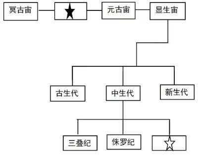

# 2024年湖南省公务员录用考试《行测》题（网友回忆版）

> 常识判断 · 10 题 · 湖南 2024

## 第 1 题　qid 16593152 · 经济常识

货币不仅是固定充当一般等价物的特殊商品，更是人类文明发展史中各个阶段的里程碑，下列语句中关于货币的发展按时间先后排序正确的是：
①氓之蚩蚩，抱布贸丝
②青钱白璧买无端，丈夫快意方为欢
③农工商交易之路通，而龟贝金钱，刀布之币兴焉
④蜀川老觉家潼川，怀中交子是铁钱

- **A**. ①④②③
- **B**. ②④①③
- **C**. ③②①④
- **D**. ①③②④　✅

**答案**：D

**官方解析**

本题考查经济常识。
货币的发展经历了偶然的物物交换，扩大的物物交换，以一般等价物为媒介的交换，以金属货币为媒介的物物交换这四个阶段。
①出自先秦《诗经·卫风·氓》，意思是憨厚的农家小伙子，怀抱布匹来换丝。偶然的物物交换发生在原始社会末期，是在部落双方都有剩余产品这种极其偶然的情况下发生的。“抱布贸丝”则反映了在当时随着生产力和社会分工的发展，物物交换的范围扩大且次数频繁，即扩大的物物交换。
②出自唐代李贺的《相劝酒》，意思是纵有青钱白璧无数，买不到光阴半寸，身为伟岸丈夫，要的是快意欢颜。青钱即青铜钱，白璧是平圆形而中有孔的白玉，这里代指的就是流通的金属货币。
③出自《史记·平准书》，意思是龟贝金钱刀布的货币的流通会促进农工商交易之路通畅。龟是龟甲，贝是贝壳，金在商周时期主要指的是青铜，钱指铁铲，刀则指的是兵器，而布则是布匹。体现了以一般等价物为媒介的物物交换。
④出自宋代释慧空的《送僧三首·其一》，交子是宋代发行的一种纸币，可以兑现，便于流通，也是世界上最早的纸币。纸币产生于一般等价物固定在金银上之后，是代替金属货币执行流通手段的价值符号。
故正确排序为①③②④。
故正确答案为D。

---

## 第 2 题　qid 16593165 · 法律常识

下列关于自首的判断说法正确的是：

- **A**. 甲和乙共同实施盗窃犯罪，后甲因为内心害怕，主动到公安机关交代，并独自承担了全部罪行，甲构成自首
- **B**. 甲和乙共同实施诈骗犯罪，后甲因酒驾被公安机关讯问时，主动交代乙曾经实施的故意杀人行为，甲构成自首
- **C**. 王某交通肇事逃逸，其父知道后将其扭送至公安机关，王某主动交代了其肇事逃逸行为，王某构成自首　✅
- **D**. 甲公司非法集资且规模很大，该公司总经理李某因为害怕，瞒着其他高管偷偷到公安机关交代了相关情况，李某作为单位犯罪的直接责任人不能单独成立自首

**答案**：C

**官方解析**

本题考查法律常识。
根据《中华人民共和国刑法》第六十七条规定：“犯罪以后自动投案，如实供述自己的罪行的，是自首。对于自首的犯罪分子，可以从轻或者减轻处罚。其中，犯罪较轻的，可以免除处罚。被采取强制措施的犯罪嫌疑人、被告人和正在服刑的罪犯，如实供述司法机关还未掌握的本人其他罪行的，以自首论。犯罪嫌疑人虽不具有前两款规定的自首情节，但是如实供述自己罪行的，可以从轻处罚；因其如实供述自己罪行，避免特别严重后果发生的，可以减轻处罚。”
A项错误，根据《最高人民法院关于处理自首和立功具体应用法律若干问题的解释》第一条规定：“······共同犯罪案件中的犯罪嫌疑人，除如实供述自己的罪行，还应当供述所知的同案犯，主犯则应当供述所知其他同案犯的共同犯罪事实，才能认定为自首······”题中，甲独自承担了全部罪行，并未如实供述同案犯，不构成自首。
B项错误，根据《最高人民法院关于处理自首和立功具体应用法律若干问题的解释》第五条规定：“根据刑法第六十八条第一款的规定，犯罪分子到案后有检举、揭发他人犯罪行为，包括共同犯罪案件中的犯罪分子揭发同案犯共同犯罪以外的其他犯罪，经查证属实；提供侦破其他案件的重要线索，经查证属实；阻止他人犯罪活动；协助司法机关抓捕其他犯罪嫌疑人（包括同案犯）；具有其他有利于国家和社会的突出表现的，应当认定为有立功表现。”题中，甲主动交代乙的其他罪行，构成立功，不构成自首。
C项正确，根据《最高人民法院关于处理自首和立功具体应用法律若干问题的解释》第一条规定：“······并非出于犯罪嫌疑人主动，而是经亲友规劝、陪同投案的；公安机关通知犯罪嫌疑人的亲友，或者亲友主动报案后，将犯罪嫌疑人送去投案的，也应当视为自动投案······”题中，王某虽被扭送至公安机关，但主动交代罪行，构成自首。
D项错误，根据《中华人民共和国刑法》第三十一条规定：“单位犯罪的，对单位判处罚金，并对其直接负责的主管人员和其他直接责任人员判处刑罚。本法分则和其他法律另有规定的，依照规定。”《办理走私刑事案件适用法律若干问题的意见》第二十一条规定：“关于单位走私犯罪案件自首的认定问题在办理单位走私犯罪案件中，对单位集体决定自首的，或者单位直接负责的主管人员自首的，应当认定单位自首。认定单位自首后，如实交代主要犯罪事实的单位负责的其他主管人员和其他直接责任人员，可视为自首，但对拒不交代主要犯罪事实或逃避法律追究的人员，不以自首论。”因此，司法实践中认可单位自首的情形。题中，李某作为单位直接负责人，虽然瞒着其他高管单独到公安机关交代相关情况，但仍构成单位自首。
故正确答案为C。

---

## 第 3 题　qid 10204495 · 人文常识

胡女士在甲公司APP上看到乙酒店某型客房贵宾优惠价为2889元后付款，次日却发现该房型当晚的实际挂牌价仅1377元。胡女士认为其作为贵宾客户却支付了高于实际价格的费用，遂将甲公司起诉至法院。关于此案，下列说法错误的是：

- **A**. 甲公司存在价格欺诈行为，胡女士有权退一赔三
- **B**. 甲公司向胡女士承诺贵宾优惠价，但未践行承诺，侵害了胡女士的公平交易权
- **C**. 甲公司的行为导致胡女士遭受了不必要的经济损失，侵害了胡女士的财产安全权　✅
- **D**. 甲公司APP作为中介平台，其未如实标注该房型的真实价格，侵害了胡女士的知情权

**答案**：C

**官方解析**

本题考查法律常识。
A项正确，根据《中华人民共和国消费者权益保护法》第五十五条第一款规定：“经营者提供商品或者服务有欺诈行为的，应当按照消费者的要求增加赔偿其受到的损失，增加赔偿的金额为消费者购买商品的价款或者接受服务的费用的三倍；增加赔偿的金额不足五百元的，为五百元。法律另有规定的，依照其规定。”《明码标价和禁止价格欺诈规定》第十九条第四项规定：“经营者不得实施下列价格欺诈行为：（四）销售商品或者提供服务时，使用欺骗性、误导性的语言、文字、数字、图片或者视频等标示价格以及其他价格信息；”因此，甲公司存在价格欺诈行为，胡女士有权退一赔三。
B项正确，根据《中华人民共和国消费者权益保护法》第十条规定：“消费者享有公平交易的权利。消费者在购买商品或者接受服务时，有权获得质量保障、价格合理、计量正确等公平交易条件，有权拒绝经营者的强制交易行为。”甲公司该房型的价格并不合理，侵害了胡女士的公平交易权。
C项错误，根据《中华人民共和国消费者权益保护法》第七条规定：“消费者在购买、使用商品和接受服务时享有人身、财产安全不受损害的权利。消费者有权要求经营者提供的商品和服务，符合保障人身、财产安全的要求。”甲公司的行为并未侵害胡女士的财产安全权。
D项正确，根据《中华人民共和国消费者权益保护法》第八条规定：“消费者享有知悉其购买、使用的商品或者接受的服务的真实情况的权利。消费者有权根据商品或者服务的不同情况，要求经营者提供商品的价格、产地、生产者、用途、性能、规格、等级、主要成份、生产日期、有效期限、检验合格证明、使用方法说明书、售后服务，或者服务的内容、规格、费用等有关情况。”因此，甲公司APP作为中介平台，未如实标注该房型的真实价格，侵害了胡女士的知情权。
本题为选非题，故正确答案为C。

---

## 第 4 题　qid 16593153 · 人文常识

下列情景在历史上最有可能发生的是：

- **A**. 西汉末年，某将军与谋士在探讨夷陵之战的胜败之因
- **B**. 唐朝初期，市面上流通带有“开元通宝”的字样的钱币　✅
- **C**. 魏晋时期，某官员家中收藏了褚遂良的众多书法作品
- **D**. 宋朝时期，农民在耕作时参考《王祯农书》里的内容

**答案**：B

**官方解析**

本题考查人文常识。
A项错误，夷陵之战，是三国时期蜀汉昭烈帝刘备对东吴发动的大规模战役，以蜀汉战败为结束。此战是中国古代战争史上一次著名的积极防御的成功战例，也是三国“三大战役”的最后一场。故在西汉末年，不可能有将军与谋士探讨夷陵之战的胜败之因。
 B项正确，唐高祖时期，为整治混乱的币制，废隋钱，效仿西汉五铢的严格规范，开铸“开元通宝”，取代社会上遗存的五铢。故唐朝初期，可能在市面上流通带有“开元通宝”的字样的钱币。
C项错误，褚遂良，字登善，唐朝宰相、政治家、书法家，弘文馆学士褚亮之子。其与欧阳询、虞世南、薛稷并称“初唐四大家”，传世墨迹有《孟法师碑》《雁塔圣教序》等。魏晋时期是指东汉瓦解后，三国到两晋的时期。故魏晋时期，不可能有官员家中收藏了褚遂良的众多书法作品。
 D项错误，《王祯农书》作者为王祯，成书于元朝，此书分为《农桑通诀》《百谷谱》和《农器图谱》三大部分。此书兼论中国北方农业技术和中国南方农业技术，在中国古代农学遗产中占有重要地位。故宋朝时期，不可能有农民在耕作时参考《王祯农书》。 
故正确答案为B。

---

## 第 5 题　qid 16593154 · 科技常识

下列诗词中包含的生物学现象说法错误的是（    ）。

- **A**. 野火烧不尽，春风吹又生——草原生态系统具有稳定性
- **B**. 群雁辞归鹄南翔，念君客游思断肠——候鸟通过迁徙适应气候变化
- **C**. 停车坐爱枫林晚，霜叶红于二月花——植物开花受温度和光照影响　✅
- **D**. 落红不是无情物，化作春泥更护花——微生物的分解作用及物质的循环

**答案**：C

**官方解析**

本题考查科技常识。
A项正确，“野火烧不尽，春风吹又生”出自唐代诗人白居易的《赋得古原草送别》。诗句的意思是：野火不能烧尽野草，春天一到野草会长出来。生态系统稳定性即为生态系统所具有的保持或恢复自身结构和功能相对稳定的能力。这句诗通过描述野火燃烧和春风吹拂后植被再生的情景，体现了草原生态系统在面对破坏时的恢复和重生能力，展现了其具有一定的稳定性。
B项正确，“群雁辞归鹄南翔，念君客游思断肠”出自魏晋时期诗人曹丕的《燕歌行二首·其一》。诗句的意思是：燕群辞归，天鹅南飞。思念出外远游的良人啊，我肝肠寸断。这句诗描写了候鸟离开北方迁徙到南方的场景。候鸟是指栖息地和繁殖地之间在不同季节之间往返的鸟类，它们通常会根据气候和资源的变化而进行周期性的迁徙，以适应气候变化，寻找适宜的生存条件。
C项错误，“停车坐爱枫林晚，霜叶红于二月花”出自唐朝诗人杜牧的《山行》。诗句的意思是：停下车来，是因为喜爱这深秋的枫林晚景，那经霜的枫叶竟比二月的鲜花还要火红。夏天的枫叶是绿色的，这是因为枫叶中含有大量的叶绿素。叶绿素对绿光的吸收少、反射多导致叶片呈现绿色；当秋天到来天气温度变低，叶绿素被降解，叶片就会呈现出花青素的颜色。花青素又称红色素，位于叶片细胞的液泡内，使叶片呈现红色。所以该句诗主要体现了温度对色素的影响。
D项正确，“落红不是无情物，化作春泥更护花”出自清代龚自珍的《己亥杂诗·其五》。诗句的意思是：从枝头上掉下来的落花不是无情之物，即使化作春泥，也甘愿化作养料，滋养美丽的花朵生长。这是由于在自然界中，土壤中的微生物可以分解落叶、枯枝、落花等有机物质，将这些有机物质转化为土壤中的无机盐等物质，使土壤更加肥沃，为植物提供养分。通过分解者的分解，这些有机物质回归到环境中并被再次利用，促进了自然界的物质循环。
本题为选非题，故正确答案为C。

---

## 第 6 题　qid 10204641 · 科技常识

地质学家和古生物学家根据地层自然形成的先后顺序，将地层分为4宙14代12纪。关于下图说法错误的是（    ）。

- **A**. ★处被命名为“太古宙”
- **B**. ☆处被命名为“白垩纪”
- **C**. 新生代被子植物高度繁盛
- **D**. 元古宙只有细菌和蓝藻存在　✅

**答案**：D

**官方解析**

本题考查地理国情。
A、B两项正确，地质学家和古生物学家根据地层自然形成的先后顺序，将地层分为4宙14代12纪，早期的冥古宙、太古宙和元古宙（元古宙在中国含有1个震旦纪）；以后显生宙的古生代、中生代和新生代。古生代分为寒武纪、奥陶纪、志留纪、泥盆纪、石炭纪和二叠纪，共6个纪；中生代分为三叠纪、侏罗纪和白垩纪，共3个纪；新生代分为古近纪、新近纪和第四纪，共3个纪。第四纪是新生代最新的一个纪，包括更新世和全新世。
C项正确，新生代是地球历史上最新的一个地质时代。新生代以哺乳动物和被子植物的高度繁盛为特征，由于生物界逐渐呈现了现代的面貌，故名新生代，即现代生物的时代。
D项错误，元古代时期出现了大量蓝藻和细菌，这些生物是地球上最原始的生命形式，都是原始单细胞生物。而元古宙晚期有无脊椎动物出现，所以元古宙不仅仅只有细菌和蓝藻的存在。
本题为选非题，故正确答案为D。

---

## 第 7 题　qid 10204467 · 人文常识

唐太宗的《起居注》一直流传至今，以下情景不可能出现的是：

- **A**. 与大臣一同品鉴李白的诗歌　✅
- **B**. 与房玄龄等大臣商议旱灾救助方案
- **C**. 接见西域使者，被少数民族尊为“天可汗”
- **D**. 宗庙祭祀，向其父唐高祖李渊上香祷告

**答案**：A

**官方解析**

本题考查人文常识。
起居注，是中国古代记录帝王的言行录，该史书体例由东汉明德皇后开创。唐太宗李世民（599年—649年）是唐朝的第二位皇帝，在位期间被称为“贞观之治”。
A项错误，李白（701年—762年），盛唐时期著名诗人，字太白，号青莲居士，被誉为“诗仙”，代表作有《望庐山瀑布》《行路难》《蜀道难》等。故选项所述情景不可能出现。
B项正确，房玄龄（579年—648年），名乔，字玄龄，凌烟阁二十四功臣之一，与杜如晦合称为“房谋杜断”。房玄龄是李世民得力的谋士之一，参与玄武门之变，与杜如晦等五人并功第一。李世民即位后，房玄龄为中书令，负责综理朝政长达二十年。故选项所述情景可能出现。
C项正确，“天可汗”是唐代西北各族君长对唐太宗的尊称，也是表示对唐太宗的拥戴。“可汗”本是突厥、回纥、柔然等民族最高统治者的称号，“天可汗”就等于是给予各民族共同拥戴的最高统治者的尊称。贞观四年唐王朝击败东突厥以后，唐太宗接受诸蕃君长所奉“天可汗”称号。故选项所述情景可能出现。
D项正确，李渊是唐朝的开国皇帝，是唐太宗李世民的父亲。贞观九年，李渊病逝，谥号太武皇帝，庙号高祖，葬于献陵。故选项所述情景可能出现。
本题为选非题，故正确答案为A。

---

## 第 8 题　qid 16593156 · 科技常识

下列古籍中描述的现象与所体现的物理原理对应正确的是（    ）。

- **A**. 《论衡》中提到摩擦过的琥珀能吸引像草芥一样的轻小物体——分子引力
- **B**. 《考工记》中提到马拉车时，虽然马不再施力了，车仍能向前移动一段距离——惯性　✅
- **C**. 《墨子》中提到天平一端加重物，另一端必得加重物，两者必须相等才能平衡——力的相互作用
- **D**. 《异苑》中提到有户人家的铜盆经常发出声音，后来发现是与宫中撞钟相应，用锉刀锉了铜盆后，声音就消失了——多普勒效应

**答案**：B

**官方解析**

本题考查科技常识。
A项错误，中国学者王充在《论衡》一书写下“顿牟掇芥”，意为摩擦过的琥珀能吸引轻小草芥。摩擦后的琥珀得到了带负电的电子，它能吸引轻小草芥说明带电体具有吸引轻小物体的性质，体现了摩擦起电效应，和分子引力无关。
B项正确，《考工记》中记载“马力既竭，辀（指车轮）犹能一取焉”，意思是没有了马的拉力以后，马车车轮仍然能往前行驶一段距离。马车原来是前进的，当马的拉力消失后，因为马车具有惯性，仍然要保持原来的前进状态，因此马车还可以继续向前移动一段距离。
C项错误，《墨经》中记载：“衡，加重于其一旁，必捶，权重相若也。”这句话的意思是：天平衡量的一臂加重物时，另一臂则要加砝码，且两者必须等重，天平才能平衡。这句话解释的是杠杆的原理，和力的相互作用无关。
D项错误，《异苑》中记载一个人来向张华请教，说他家有一个洗澡用的大铜盆，每日早晚总会嗡嗡作响，就像有人在敲打一般。张华答：这只铜盆和洛阳宫中大钟的音调相谐，宫中每天早晚都要撞钟，所以使铜澡盆有声相应。张华还告诉他只要把铜盆锉掉一点，使其变轻，便不会再作响。这体现了共鸣原理，和多普勒效应无关。多普勒效应是由于波源与观测者相对运动而出现的观测者测得的波频率与波源频率不同的现象。
故正确答案为B。

---

## 第 9 题　qid 10204491 · 科技常识

下列关于游乐项目所蕴含物理原理的说法错误的是：

- **A**. 过山车快速下降时，人感觉自己要飘起来了，是因为人的重力减小了　✅
- **B**. 沙滩车的轮子往往做得特别宽大，是为了减小轮子对沙地的压强，防止下陷
- **C**. 蹦极运动中，腿部绑弹性绳，是为了增加绳对人的作用时间，减小绳对人的作用力
- **D**. 跷跷板游戏中，人越靠近支点越不容易压动跷跷板，是人对板作用力的力臂减小的缘故

**答案**：A

**官方解析**

本题考查科技常识。

A项错误，过山车快速下降时，加速度向下，此时人体属于失重状态，因此感觉自己飘起来了，失重是物体对支持物的压力小于物体所受重力的现象。物体由于地球的吸引而受到的力叫重力，方向总是竖直向下，乘坐过山车时人的重力不变。

B项正确，根据压强公式，当沙滩车对地面的压力一定时，增大受力面积可以减少压强，从而防止下陷，便于在沙滩上行驶。

C项正确，蹦极运动中，腿部绑弹性绳，是因为弹性绳拉长吸收能量，运动能量转化为弹性绳的弹力能量；弹性绳缩短释放能量，弹性绳的弹力能量转化为运动能量，弹性绳通过吸收和释放能量，使参与者在跳跃后能够反弹回升。由此增加绳对人的作用时间，减小绳对人的作用力，更好地保护蹦极的人。

D项正确，根据杠杆原理（动力×动力臂=阻力×阻力臂），人对跷跷板的压力是动力和阻力，人到跷跷板的固定点的距离是力臂；当动力和阻力一定时，人越靠近支点，人对板作用力的力臂越小，越不容易压动跷跷板；人越远离支点，人对板作用力的力臂越大，越容易压动跷跷板。

本题为选非题，故正确答案为A。

---

## 第 10 题　qid 10204482 · 科技常识

下列有关生活常识说法错误的是：

- **A**. 白糖水分含量少、糖分高，不耐储存　✅
- **B**. 食醋的pH值比较低，可以抑制微生物的生长
- **C**. 美白牙膏通常采用过氧化钙等过氧化物漂白牙齿
- **D**. 削了皮的苹果变色是一种化学反应，会影响苹果的口感

**答案**：A

**官方解析**

本题考查科技常识。
A项错误，白糖的化学性质稳定，水分少、糖分高，不利于微生物繁殖，很耐储存。
B项正确，食醋的pH值比较低，可以明显抑制微生物生长，防止杂菌污染，能达到长期保存的效果。
C项正确，美白牙膏通常采用过氧化钙等过氧化物漂白牙齿，过氧化钙遇水才能分解出能够最终发挥效用的过氧化氢。
D项正确，削了皮的苹果发生酶促褐变反应后表面会变成褐色，影响苹果的外观和口感，表层的部分营养成分有所降低。酶促褐变反应是在有氧的条件下，酚酶催化酚类物质形成醌及其聚合物，该反应是化学反应。
本题为选非题，故正确答案为A。

---
