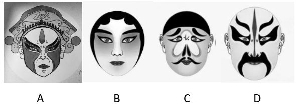

# 2025年内蒙古公务员录用考试《行测》题（网友回忆版）

> 常识判断 · 15 题 · 内蒙古 2025

## 第 1 题　qid 13504577 · 人文常识

我国语言文字博大精深，源远流长，是中华文化的重要载体。关于我国语言文字，下列说法不正确的是：

- **A**. 我国共有分属汉藏、阿尔泰、南亚、南岛、印欧五大语系的包括汉语在内130余种语言
- **B**. 周代“雅言”、秦代“书同文”、汉代“通语”、宋元“正音”、明清“官话”体现的是我国通用语言文字传统
- **C**. 我国各民族在历史上曾经创造过众多文字种类，大多数民族语言都有与之相适应的文字，这些文字具有通用性　✅
- **D**. 甲骨文已成功申报“世界记忆名录”，这是中华语言文明走向国际社会的实证

**答案**：C

**官方解析**

本题考查人文常识。
A项正确，中国民族语言，按语言谱系分类法，大体上分别属于汉藏、阿尔泰、南亚、南岛、印欧五大语系。其中，汉语属于汉藏语系，而其他少数民族语言则分属不同的语系。据统计，中国境内共有130多种语言。
B项正确，中国历史上一直有通用语言文字的传统，这些通用语言在不同时期有不同的名称：周代“雅言”、秦代“书同文”、汉代“通语”、宋元“正音”、明清“官话”。这些不同历史时期的通用语言文字，反映了我国在语言规范化、标准化方面的不断努力和传承，体现了中华民族对语言文字统一和规范的重视，反映了我国通用语言文字的传统。
C项错误，我国各民族在历史上确实创造过多种文字，但并不是大多数民族语言都有与之相适应的文字，而且这些文字并不都具有通用性。许多少数民族语言在历史上并没有发展出独立的文字系统，或者其文字系统并未广泛使用。同时，不同民族的文字系统之间并不具有通用性，它们各自服务于特定的语言和文化群体。
D项正确，2017年11月24日，甲骨文成功入选《世界记忆名录》，成为了世界文化交流与传承的重要桥梁。甲骨文作为我国目前已知最早的成体系的文字形式，承载着殷商时期大量的政治、经济、文化等信息。它成功入选，无疑是中华语言文明走向国际社会，被世界认可和重视的有力实证。
本题为选非题，故正确答案为C。

---

## 第 2 题　qid 13504688 · 法律常识

证据是引导诉讼走向的决定性因素，人民法院根据证据认定案件事实，依法作出裁判。关于证据，下列说法不正确的是：

- **A**. 证据必须经过查证属实，才能作为定案的根据
- **B**. 案件当事人以视听资料作为证据的，应当提供存储该视听资料的原始载体
- **C**. 电子数据的制作者制作的与原件一致的副本可以视为电子数据的原件并作为证据
- **D**. 证人所作的陈述必须是亲身经历的，从其他人、其他地方间接得知的不能作为证据　✅

**答案**：D

**官方解析**

本题考查法律常识。
A项正确，根据《中华人民共和国民事诉讼法》第六十六条第二款规定：“证据必须查证属实，才能作为认定事实的根据。”
B项正确，根据《最高人民法院关于民事诉讼证据的若干规定》第十五条第一款规定：“当事人以视听资料作为证据的，应当提供存储该视听资料的原始载体。”
C项正确，根据《最高人民法院关于民事诉讼证据的若干规定》第十五条第二款规定：“当事人以电子数据作为证据的，应当提供原件。电子数据的制作者制作的与原件一致的副本，或者直接来源于电子数据的打印件或其他可以显示、识别的输出介质，视为电子数据的原件。”
D项错误，根据《中华人民共和国民事诉讼法》第七十五条第一款规定：“凡是知道案件情况的单位和个人，都有义务出庭作证。有关单位的负责人应当支持证人作证。”因此，证人陈述的是其知道的案件情况，该情况既可以是其亲身经历的，也可以是从其他人、其他地方间接得知的。
本题为选非题，故正确答案为D。

---

## 第 3 题　qid 13504573 · 人文常识

近年来，“元宇宙”已成为全球科技关注的焦点，正在为产业带来新变革，昭示着数字化未来的无限可能性。从哲学上看，下列关于“元宇宙”的说法不正确的是：

- **A**. 元宇宙是人的实践活动的产物
- **B**. 元宇宙是对物质世界的摹写和反映
- **C**. 元宇宙归根到底是现实世界的一种延伸和拓展
- **D**. 元宇宙本质上是从物质世界中独立出来的精神世界　✅

**答案**：D

**官方解析**

本题考查马克思主义。
A项正确，元宇宙是人类通过技术手段创造出来的虚拟空间，它是人类实践活动的产物。人们运用各种技术，如虚拟现实、增强现实、区块链等，来构建元宇宙，体现了人类的实践活动对其产生的作用。
B项正确，元宇宙中的各种元素、场景、规则等，都是对现实物质世界的摹写和反映。它可能会对现实世界的某些方面进行夸张、变形或重新组合，但本质上是基于现实世界的。
C项正确，元宇宙是利用数字技术将现实世界进行数字化拓展和延伸的虚拟空间，它在一定程度上反映了现实世界的特征和需求，是现实世界在数字领域的一种延伸和拓展。
D项错误，元宇宙并不是从物质世界中独立出来的精神世界。虽然它具有虚拟性，但它是建立在物质基础之上的，依赖于计算机硬件、网络基础设施等物质条件，并且其内容也是对物质世界的反映，不能脱离物质世界而独立存在。
本题为选非题，故正确答案为D。

---

## 第 4 题　qid 13504559 · 人文常识

关于中国古代公文制度，下列说法不正确的是：

- **A**. 押署制度是一种公文用印制度
- **B**. 贴黄制度是一种公文改错制度
- **C**. 票拟制度是一种公文分级保密制度　✅
- **D**. 驿传制度是一种接待往来官员和负责公文传递事务的制度

**答案**：C

**官方解析**

本题考查人文常识。
A项正确，押署制度是一种公文签署认证制度，官员在文书末尾签名或画押（如“画诺”“画可”），确认责任归属，与用印（如官印、骑缝章）共同构成公文合法性凭证。其核心是官员通过签署姓名或个性化符号确认公文责任，如宋代的花押制度要求官员签署公文时需“签押+官印”并用。
B项正确，贴黄是唐朝首创的一种公文纠错制度，武则天时期规定奏章有误需以黄纸贴补修改（“诏敕有误，贴黄改之”）；宋代发展为摘要制度，官员在奏疏前贴黄纸写内容梗概，方便皇帝快速阅览。
C项错误，票拟是明朝内阁代皇帝草拟批复意见的一种制度，内阁大臣在奏章上贴小票（“票签”）写处理建议，供皇帝裁定（如“准”“依议”），属于公文的处理流程，与公文的分级保密无关。
D项正确，驿传制度是中国古代专门接待往来官员和负责政府文书传递事务的组织制度以及为此而征发的徭役制度，始自先秦，历经秦汉隋唐宋元明清（如汉代“三十里一驿”），直至清末新式邮政建立才逐渐废止。
本题为选非题，故正确答案为C。

---

## 第 5 题　qid 12882017 · 人文常识

翻开中华民族5000多年的厚重历史，总的来看，凡属盛世都是法治相对健全的时期。对此，下列相关说法不正确的是（    ）。

- **A**. 战国时商鞅“立木建信”，强调“法必明、令必行”，使秦国强大起来
- **B**. 汉武帝时期形成汉律六十篇，在两汉沿用了近400年
- **C**. 唐太宗以奉法为治国之重，一部《贞观律》为“贞观之治”奠定了基石
- **D**. 明太祖朱元璋与百姓“约法三章”，为其一统天下发挥了重要作用　✅

**答案**：D

**官方解析**

本题考查人文常识。
D项错误，A、B、C三项正确，2018年8月24日习近平总书记在中央全面依法治国委员会第一次会议上的讲话中指出：“历史和现实都告诉我们，法治兴则国兴，法治强则国强。从我国古代看，凡属盛世都是法制相对健全的时期。春秋战国时期，法家主张‘以法而治’，偏在雍州的秦国践而行之，商鞅‘立木建信’，强调‘法必明、令必行’，使秦国迅速跻身强国之列，最终促成了秦始皇统一六国。汉高祖刘邦同关中百姓‘约法三章’，为其一统天下发挥了重要作用。汉武帝时形成的汉律60篇，两汉沿用近400年。唐太宗以奉法为治国之重，一部《贞观律》成就了‘贞观之治’；在《贞观律》基础上修订而成的《唐律疏议》，为大唐盛世奠定了法律基石。”
本题为选非题，故正确答案为D。

---

## 第 6 题　qid 13504571 · 人文常识

礼是中国文化最内在的要素之一，也是中华文明最醒目的表征之一。关于礼，下列说法不正确的是：

- **A**. “周监于二代，郁郁乎文哉！吾从周”是孔子对周朝礼制丰富而又有文采的赞赏
- **B**. “五礼”是指吉、凶、军、宾、嘉五种礼制，其中嘉礼是指邦国间朝觐聘享之礼　✅
- **C**. “冠礼”与“笄礼”分别指男子和女子的成年礼，古代“笄礼”多于上巳节举行
- **D**. “经国家，定社稷，序民人，利后嗣者也”是指礼对整合社会与建立秩序的重要作用

**答案**：B

**官方解析**

本题考查人文常识。
A项正确，“周监于二代，郁郁乎文哉！吾从周”出自《论语・八佾》，意思是孔子说：周朝的礼仪制度是以夏商两代为根据制定的，多么丰富多彩呀，我主张周朝的。
B项错误，“五礼”是指吉、凶、军、宾、嘉五种礼制，祭祀之事为吉礼，丧葬之事为凶礼，军旅之事为军礼，宾客之事为宾礼，冠婚之事为嘉礼。邦国间朝觐聘享之礼属于宾礼而不是嘉礼。
C项正确，“冠礼”是加冠之礼，即男子成人礼，按照古礼的规定，男子在二十岁时行“冠礼”。“笄礼”是女子的成人礼，女子在十五岁到二十岁之间行“笄礼”，农历三月三是上巳节，又叫女儿节，一般“笄礼”在这个日子举行。
D项正确，“经国家，定社稷，序民人，利后嗣者也”出自《左传・隐公・隐公十一年》，意思是礼制，是可以治理国家，稳定政权，安抚百姓，并有利于后世子孙的。体现了礼对整合社会与建立秩序的重要作用。
本题为选非题，故正确答案为B。

---

## 第 7 题　qid 13504579 · 科技常识

随着科技的发展，人类探索世界的脚步逐步迈向太空。在太空中，航天员的身体要经受多重考验。对此，下列说法不正确的是：

- **A**. 航天员在航天飞行中会出现骨质疏松
- **B**. 航天员在进入太空的初期会迷失方向
- **C**. 航天员在太空中身体下肢会出现肿胀　✅
- **D**. 男女航天员飞行中会有生理心理差异

**答案**：C

**官方解析**

本题考查科技常识。
A项正确，在太空失重状态下，人体骨骼不再承受地球重力带来的力学刺激。而这种力学刺激对于维持骨骼的正常代谢和骨量至关重要。缺乏重力刺激后，成骨细胞的活性会受到抑制，其生成新骨的能力下降；同时，破骨细胞的活性相对增强，会加速骨组织的吸收和破坏，导致骨量逐渐丢失，进而引发骨质疏松。
B项正确，太空环境与地球环境差异巨大，航天员在进入太空初期，视觉、前庭系统等接收的信息与在地球上习惯的信息不同，容易出现空间定向障碍，迷失方向。
C项错误，在太空失重环境下，人体血液会重新分布，更多地流向头部和上身，表现为脸变胖，巩膜、鼻和口腔黏膜充血，眼窝浮肿，头和颈部静脉扩张，腿围径变小等。而不是下肢出现肿胀，反而可能会因血液供应相对减少而变细。
D项正确，男女航天员由于生理结构不同，在太空飞行中可能会面临不同的生理挑战，如女性航天员可能会面临月经周期变化等问题。同时，男女航天员在心理方面也存在差异，对太空飞行的心理反应和应对方式也会有所不同。
本题为选非题，故正确答案为C。

---

## 第 8 题　qid 12882021 · 人文常识

在中国传统建筑中，“门当”指的是大门外的石墩或石鼓，“户对”则是指大门上方门楣上的门簪。下列关于门当户对的说法错误的是（    ）。

- **A**. 户对的数量都是双数
- **B**. 有门当的宅院必有户对　✅
- **C**. 户对数量越多象征着主人的身份等级越尊贵
- **D**. 文官宅院用方形门当，武官宅院用圆形门当

**答案**：B

**官方解析**

本题考查人文常识。
A项正确，户对的数量与宅主身份相关，但形制必为偶数，既体现对称美与礼制规范，也符合中国传统文化中“双数为吉”的寓意。
B项错误，门当和户对在中国传统建筑中是相辅相成的元素，理论上有门当的宅院一般都有户对，但现实中有门当没有户对的情况也存在。不同地区和习俗都可能影响建筑中这两种元素的配置。
C项正确，户对数量是古代建筑中“以物显秩”的核心标志，户对数量越多，主人身份越尊贵，其等级规则与封建社会官僚体系严密对应。
D项正确，门当的形制与官职的对应关系一般是，文官使用方形门当（象征砚台或印章）；武官使用圆形门当（象征战鼓或车轮，代表武权）。但随着历史的变迁，社会风俗也在发生演变，后世也有许多不遵循这等讲究的情况。
注：本题存在瑕疵，我国地大物博，风俗民情多样，多有例外情况存在。综合来看，B项说法更不严谨，粉笔倾向于该项错误。
本题为选非题，故正确答案为B。

---

## 第 9 题　qid 13504583 · 人文常识

2024年7月27日，联合国教科文组织第46届世界遗产大会通过决议，将“北京中轴线——中国理想都城秩序的杰作”成功列入《世界遗产名录》。关于北京中轴线，下列表述不正确的是：

- **A**. 属于文化遗产中的建筑群类型
- **B**. 是世界上现存最长的城市中轴线
- **C**. 是“以中为尊”文化传统的生动实践
- **D**. 包含了宋、元、明、清及近现代城市演变的历史积淀　✅

**答案**：D

**官方解析**

本题考查人文常识。
A项正确，北京中轴线属于文化遗产中的建筑群类型。它由一系列古建筑和相关设施组成，包括永定门、正阳门及箭楼等，这些建筑共同构成了一个庞大而有序的建筑群，体现了中国古代城市规划和建筑艺术的高超水平。
B项正确，北京中轴线是世界上现存最长的城市中轴线。它南起永定门，北至钟鼓楼，全长约7.8公里，贯穿了北京老城的核心区域，展现了中国古代城市规划中对中轴线对称布局的极致追求。
C项正确，北京中轴线是“以中为尊”文化传统的生动实践。在中国传统文化中，“中”具有特殊的地位和象征意义，代表着正统、尊贵和中心。北京中轴线将城市的重要建筑沿中轴线对称分布，体现了对“中”的尊崇，彰显了皇权的至高无上和国家的核心地位。
D项错误，北京中轴线主要包含了元、明、清及近现代城市演变的历史积淀，不涉及宋代。北京中轴线的规划和建设始于元代，当时忽必烈定都大都，按照“前朝后市，左祖右社”的原则规划城市，奠定了中轴线的基本格局。明清时期，在元代的基础上进一步完善和发展，形成了如今所见的规模和风貌。
本题为选非题，故正确答案为D。

---

## 第 10 题　qid 13504610 · 科技常识

中华优秀传统文化蕴含着丰富的人与自然和谐共生理念。下列古语没有体现人与自然和谐共生理念的是：

- **A**. 天地与我并生，而万物与我为一
- **B**. 天地之大德曰生，生生之谓易　✅
- **C**. 草木荣华滋硕之时，则斧斤不入山林，不夭其生，不绝其长也
- **D**. 竭泽而渔，岂不获得？而明年无鱼；焚薮而田，岂不获得？而明年无兽

**答案**：B

**官方解析**

本题考查人文常识。
A项正确，“天地与我并生，而万物与我为一”出自《庄子・齐物论》，意思是天地与我同生，万物与我是一体的，强调了人与自然的和谐统一，体现出人与自然和谐共生理念。
B项错误，“天地之大德曰生，生生之谓易”出自《周易・系辞下》，意思是天地最大的品德是孕育生命，生生不息就是变化的道理，主要强调了天地生育万物的品德和变化的规律，没有直接体现人与自然和谐共生的理念。
C项正确，“草木荣华滋硕之时，则斧斤不入山林，不夭其生，不绝其长也”出自《荀子・王制》，意思是在草木生长茂盛的时候，不允许进入山林砍伐，不使它们过早死亡，不截断它们的生长，体现了对自然万物生长规律的尊重，蕴含了人与自然和谐共生的理念。
D项正确，“竭泽而渔，岂不获得？而明年无鱼；焚薮而田，岂不获得？而明年无兽”出自《吕氏春秋・义赏》，意思是排干湖水来捕鱼，怎么会捕不到呢？但是第二年就没有鱼了；烧毁树林来打猎，怎么会打不到呢？但是第二年就没有野兽了，强调了过度开发利用自然资源的危害，从反面体现了人与自然应和谐共生的理念。
本题为选非题，故正确答案为B。

---

## 第 11 题　qid 13504606 · 科技常识

中华文明探源工程应用了大量自然科学新技术与新方法，从而取得一系列重大成果。下列领域研究与所应用的新技术新方法对应不正确的是：

- **A**. 研究当时不同地区人们的主食种类以及不同阶层的蛋白质摄入量——古DNA技术　✅
- **B**. 确认良渚古城外围的庞大水利系统及其防洪灌溉功能——遥感和GIS地理信息系统
- **C**. 研究陶器和原始瓷器的烧制工艺技术——硅酸盐技术
- **D**. 研究商周时期青铜器矿料来源——铅同位素分析方法

**答案**：A

**官方解析**

本题考查科技常识。
A项错误，研究当时不同地区人们的主食种类以及不同阶层的蛋白质摄入量，主要是通过人骨中包含的碳、氮同位素进行分析。通过分析人骨中的碳、氮同位素，可以了解古人食物中不同来源蛋白质的比例，进而推断出主食种类以及不同阶层的蛋白质摄入量。古DNA技术主要用于研究古代人类的血缘关系、遗传特征、种群迁徙等方面。
B项正确，遥感和GIS地理信息系统可以通过卫星图像、航空摄影等技术，获取大面积的地形、地貌、水系等信息，并进行分析和处理。在确认良渚古城外围的庞大水利系统及其防洪灌溉功能时，利用遥感和GIS技术能够清晰地看到水坝、河道等水利设施的分布和形态，分析其规模、结构和功能，了解其在防洪、灌溉、水运等方面的作用。
C项正确，陶器和原始瓷器的主要成分是硅酸盐，硅酸盐技术可以通过对陶器和原始瓷器的成分、结构、烧制温度、烧制工艺等方面进行研究，了解古代的制陶和制瓷技术。
D项正确，青铜是红铜与锡、铅等化学元素混合而成的合金。铅同位素分析方法是研究商周时期青铜器矿料来源的重要方法之一。不同地区的铅矿具有不同的铅同位素，通过对青铜器中铅同位素的分析，可以与已知产地的铅矿进行对比，从而推断出青铜器的矿料来源。
本题为选非题，故正确答案为A。

---

## 第 12 题　qid 13504557 · 人文常识

不同的户外运动，应选择不同颜色的运动服。对此，下列相关说法正确的是：

- **A**. 在夏季户外骑行中，白色、黄色可更好地防止紫外线辐射皮肤
- **B**. 在冬季滑雪运动中，黑色、紫色更能给穿着者温暖的视觉感受
- **C**. 在室外泳池游泳中，橙色、红色更能提高自己在水中的可见度　✅
- **D**. 在原始丛林探险中，绿色、黄色更能使团队成员及时发现自己

**答案**：C

**官方解析**

本题考查科技常识。
A项错误，在夏季户外骑行中，虽然白色给人凉爽的体感，且对紫外线有较高反射率，可反射部分紫外线，但它对紫外线的吸收率极低，夏季骑行常用的轻薄运动面料织密度不足，未被反射的紫外线易穿透到达皮肤，日常防晒效果并不佳；黄色也不属于防晒性能好的颜色。一般来说，同面料、同厚度、同织密度的同规格深色系服装，可吸收绝大多数紫外线，大幅减少到达皮肤的紫外线，防晒性能相对更好，如黑色、藏青色、红色、深绿色、紫色等。如果是专业防紫外线面料，颜色对防晒功能的影响则不大。
B项错误，在冬季滑雪运动中，鲜艳的颜色如红色、橙色、荧光黄等更能给穿着者温暖的视觉感受，同时也能提高自己的可见性，在高速滑行时提醒别人避让，防止发生碰撞，在危险发生时有利于救援人员发现受伤人员，及时施救。而黑色和紫色属于深色系，它们不如鲜艳颜色在雪地上那么醒目，不能给穿着者温暖的视觉感受，也不能很好地起到警示和便于救援的作用。
C项正确，在室外泳池游泳中，橙色、红色等鲜艳的颜色属于荧光色系或与荧光色相近，荧光色系的泳衣在水中的可见度较高，能够让游泳者在水中更加醒目，便于家长或救生员观察，保障游泳者的安全。这是因为这些颜色与水的颜色对比度强烈，容易被人眼察觉。
D项错误，在原始丛林探险中，绿色容易与丛林中的植被颜色混淆，不利于团队成员及时发现自己。而黄色属于鲜艳的颜色，在丛林环境中比较醒目，更有利于团队成员相互识别。一般来说，在原始丛林探险时，为了便于识别和安全，应选择与丛林环境对比度高的颜色，如橙色、红色等鲜艳的颜色。
故正确答案为C。

---

## 第 13 题　qid 13504608 · 人文常识

在中华传统文化中，以声音为介质的文化被称为“有声文化”。关于中华传统有声文化，下列说法正确的是：

- **A**. 中国传统乐器最早以“八音”来分类，“八音”指八声音律
- **B**. 宫商角徵羽是中国古乐五种基本音阶，传统戏剧中通常使用　✅
- **C**. 秦汉时期伴随《诗经》的吟诵和吟唱，曲谱开始出现并流行
- **D**. 诗词格律以平仄和押韵作为声音形式，平声包括上声和入声

**答案**：B

**官方解析**

本题考查人文常识。
A项错误，中国传统乐器最早以“八音”来分类，根据乐器的不同制作材料，分成金、石、丝、竹、匏、土、革、木八类，而不是八声音律。
B项正确，宫商角徵羽这五音是中国古乐的基本音阶，类似现在简谱中的1、2、3、5、6。在古代，宫商角徵羽被广泛应用于宫廷音乐、祭祀音乐、戏曲音乐等方面。‌
C项错误，《诗经》是中国古代诗歌开端，收集了西周初年至春秋中叶的诗歌，主要是通过口传心授的方式传承和传播。秦汉时期尚未出现能够准确记录音乐旋律和节奏的曲谱，中国工尺谱是世界上最早的乐谱之一，唐代（7世纪）已经基本成形。
D项错误，诗词格律以平仄、押韵、对仗作为声音形式。平仄是诗词中用字的声调，在古代汉语中，声调分为平、上、去、入四声，其中平声为平，上、去、入三声为仄。
故正确答案为B。

---

## 第 14 题　qid 13504623 · 人文常识

脸谱是我国古典戏曲独特的表现手法之一，其作用在于以色彩和线条来突出净、丑、生、旦所扮演的各种人物的特点。下列图片中的脸谱，属于“净”的是：

- **A**. A
- **B**. B
- **C**. C
- **D**. D　✅

**答案**：D

**官方解析**

本题考查人文常识。
不同行当的脸谱，情况不一。“生”、“旦”面部妆容简单，略施脂粉，叫“俊扮”“素面”“洁面”。而“净行”与“丑行”面部绘画比较复杂，特别是“净”，都是重施油彩，图案复杂，因此称“花脸”。戏曲中的脸谱，主要指净的面部绘画。而“丑”，因其扮演喜剧角色，故在鼻梁上抹一小块白粉，俗称“小花脸”。
A、B两项错误，脸谱线条、面部妆容简单，略施脂粉，更符合“生”角、“旦”角脸谱形象。
C项错误，脸谱相对简约，且鼻梁上白粉明显，更符合“丑”角脸谱形象。
D项正确，脸谱色彩浓重，图案夸张，更符合“净”角脸谱形象。
故正确答案为D。

---

## 第 15 题　qid 13504602 · 人文常识

下列生产建设中需要的玻璃与其材料类型要求对应正确的是：

- **A**. 平面广告保护屏——防眩玻璃　✅
- **B**. 建筑用玻璃幕墙——光伏玻璃
- **C**. 液晶电视显示屏——节能玻璃
- **D**. 光电器件的盖板——防火玻璃

**答案**：A

**官方解析**

本题考查科技常识。
A项正确，平面广告保护屏常置于户外或高亮度环境中，易受强光反射影响。防眩玻璃通过表面处理减少反光，提升内容可视性，适合广告屏的需求。
B项错误，普通建筑玻璃幕墙主要使用钢化玻璃、夹层玻璃等，以满足采光、隔热、隔音、安全等不同要求。光伏玻璃用于幕墙时属于特殊应用，需结合太阳能发电功能。
C项错误，液晶电视显示屏主要是利用液晶玻璃的特性来实现图像显示，如轻薄、节能、色彩丰富、视角宽广等。节能玻璃一般是指在玻璃表面镀膜或采用特殊的结构，以减少热量传递和反射光线的玻璃，常用于建筑门窗等领域，以降低建筑物的能耗，与此用途无关。
D项错误，光电器件的盖板通常需要具备高强度、高透光率、韧性好、抗划伤等性能，以保护光电器件内部的精密电子元器件，一般会使用强化玻璃等材料。防火玻璃主要用于对防火性能有要求的场所，如建筑物的防火分区、防火墙、防火门等。
故正确答案为A。

---
