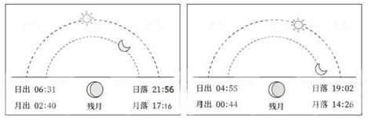

# 2025年国家公务员录用考试《行测》题（行政执法卷网友回忆版）

> 常识判断 · 15 题 · 国考 2025

## 第 1 题　qid 19283805 · 法律常识

下列与我国的立法权相关的说法正确的是：

- **A**. 强制隔离戒毒、冻结存款的行政强制措施只能由法律予以设定　✅
- **B**. 全国人民代表大会可授权国务院根据实际需要制定法律
- **C**. 法律解释权属于全国人大常委会、最高人民法院及最高人民检察院
- **D**. 行政法规由国务院及其组成部门、直属机构、办事机构予以制定发布

**答案**：A

**官方解析**

本题考查法律常识。
A项正确，根据《中华人民共和国行政强制法》第九条规定：“行政强制措施的种类：（一）限制公民人身自由；（二）查封场所、设施或者财物；（三）扣押财物；（四）冻结存款、汇款；（五）其他行政强制措施。”第十条规定：“行政强制措施由法律设定。尚未制定法律，且属于国务院行政管理职权事项的，行政法规可以设定除本法第九条第一项、第四项和应当由法律规定的行政强制措施以外的其他行政强制措施。尚未制定法律、行政法规，且属于地方性事务的，地方性法规可以设定本法第九条第二项、第三项的行政强制措施。法律、法规以外的其他规范性文件不得设定行政强制措施。”因此，限制公民人身自由（强制隔离戒毒）与冻结存款、汇款的行政强制措施只能由法律予以设定。
B项错误，根据《中华人民共和国立法法》第十条第三款规定：“全国人民代表大会可以授权全国人民代表大会常务委员会制定相关法律。”第十二条规定：“本法第十一条规定的事项尚未制定法律的，全国人民代表大会及其常务委员会有权作出决定，授权国务院可以根据实际需要，对其中的部分事项先制定行政法规，但是有关犯罪和刑罚、对公民政治权利的剥夺和限制人身自由的强制措施和处罚、司法制度等事项除外。”因此，全国人民代表大会可授权全国人民代表大会常务委员会制定相关法律，可授权国务院根据实际需要先制定行政法规，而非法律。
C项错误，根据《中华人民共和国立法法》第四十八条第一款规定：“法律解释权属于全国人民代表大会常务委员会。”第一百一十九条第一款规定“最高人民法院、最高人民检察院作出的属于审判、检察工作中具体应用法律的解释，应当主要针对具体的法律条文，并符合立法的目的、原则和原意。遇有本法第四十八条第二款规定情况的，应当向全国人民代表大会常务委员会提出法律解释的要求或者提出制定、修改有关法律的议案。”因此，法律解释权属于全国人民代表大会常务委员会，最高人民法院、最高人民检察院只可以作出属于审判、检察工作中具体应用法律的解释。
D项错误，根据《中华人民共和国立法法》第七十二条第一款规定：“国务院根据宪法和法律，制定行政法规。”第九十一条第一款规定：“国务院各部、委员会、中国人民银行、审计署和具有行政管理职能的直属机构以及法律规定的机构，可以根据法律和国务院的行政法规、决定、命令，在本部门的权限范围内，制定规章。”因此，国务院制定的是行政法规，国务院组成部门、直属机构制定的是规章。
故正确答案为A。

---

## 第 2 题　qid 19283809 · 法律常识

根据《中华人民共和国食品安全法》，下列情形符合法律规定的是：

- **A**. 某食品生产企业自行检验产品后，不再委托专业机构进行检验　✅
- **B**. 某乳制品生产企业以分装方式生产婴幼儿配方乳粉
- **C**. 某食品安全监督管理部门向食品生产经营者收取检验费
- **D**. 某个体工商户仅销售预包装食品，未报食品安全监督管理部门备案

**答案**：A

**官方解析**

本题考查法律常识。
A项正确，根据《中华人民共和国食品安全法》第八十九条第一款规定：“食品生产企业可以自行对所生产的食品进行检验，也可以委托符合本法规定的食品检验机构进行检验。”因此，某食品生产企业自行检验产品后，可以不再委托专业机构进行检验。
B项错误，根据《中华人民共和国食品安全法》第八十一条第五款规定：“不得以分装方式生产婴幼儿配方乳粉，同一企业不得用同一配方生产不同品牌的婴幼儿配方乳粉。”因此，某乳制品生产企业不得以分装方式生产婴幼儿配方乳粉。
C项错误，根据《中华人民共和国食品安全法》第八十七条规定：“县级以上人民政府食品安全监督管理部门应当对食品进行定期或者不定期的抽样检验，并依据有关规定公布检验结果，不得免检。进行抽样检验，应当购买抽取的样品，委托符合本法规定的食品检验机构进行检验，并支付相关费用；不得向食品生产经营者收取检验费和其他费用。”因此，某食品安全监督管理部门不得向食品生产经营者收取检验费。
D项错误，根据《中华人民共和国食品安全法》第三十五条第一款规定：“国家对食品生产经营实行许可制度。从事食品生产、食品销售、餐饮服务，应当依法取得许可。但是，销售食用农产品和仅销售预包装食品的，不需要取得许可。仅销售预包装食品的，应当报所在地县级以上地方人民政府食品安全监督管理部门备案。”因此，某个体工商户仅销售预包装食品，应报所在地县级以上地方人民政府食品安全监督管理部门备案。
故正确答案为A。

---

## 第 3 题　qid 19283807 · 法律常识

2024年5月，甲驾驶重型半挂车行驶至某县辖区内被交警临检。该县公安局交警大队认定甲存在驾驶故意污损机动车号牌的机动车在道路行驶的行为，遂当场作出罚款200元、记9分的处罚决定。甲认为其不存在故意污损号牌的行为，对处罚决定不服。下列说法正确的是（    ）。

- **A**. 甲可以不经行政复议，直接向人民法院提起行政诉讼
- **B**. 甲若申请行政复议，复议机关为该县公安局
- **C**. 甲若申请行政复议，不适用简易程序审理
- **D**. 甲若申请行政复议，该案可适用调解　✅

**答案**：D

**官方解析**

本题考查法律常识。
A项错误，根据《中华人民共和国行政复议法》第二十三条第一款第一项规定：“有下列情形之一的，申请人应当先向行政复议机关申请行政复议，对行政复议决定不服的，可以再依法向人民法院提起行政诉讼：（一）对当场作出的行政处罚决定不服；”题中，县公安局交警大队是当场对甲作出罚款200元、记9分的处罚决定，甲对此不服应当先向行政复议机关申请行政复议，对行政复议决定不服的，可以再依法向人民法院提起行政诉讼，不得直接向人民法院提起行政诉讼。
B项错误，根据《中华人民共和国行政复议法》第二十四条第一款第一项规定：“县级以上地方各级人民政府管辖下列行政复议案件：（一）对本级人民政府工作部门作出的行政行为不服的；”题中，甲对行政处罚决定不服，则县公安局为被申请人，复议机关为县政府，而不是县公安局。
C项错误，根据《中华人民共和国行政复议法》第五十三条第一款第一项规定：“行政复议机关审理下列行政复议案件，认为事实清楚、权利义务关系明确、争议不大的，可以适用简易程序：（一）被申请行政复议的行政行为是当场作出；”题中，县公安局交警大队是当场对甲作出罚款200元、记9分的处罚决定，依法可以适用简易程序审理。
D项正确，根据《中华人民共和国行政复议法》第五条第一款：“行政复议机关办理行政复议案件，可以进行调解。”因此，甲若申请行政复议，该案可适用调解。
故正确答案为D。

---

## 第 4 题　qid 19283836 · 法律常识

虚假诉讼、作伪证是我国重点打击的破坏司法秩序的行为。下列说法错误的是：

- **A**. 甲伪造合同向法院起诉，意图获得非法利益，甲可能被罚款、拘留或被追究刑事责任
- **B**. 甲指使乙在一民事案件中作伪证，甲的行为构成妨害作证罪
- **C**. 甲欠乙2万元，因欠条遗失，乙补写欠条并模仿甲的签名后向法院起诉，乙的行为构成虚假诉讼罪　✅
- **D**. 甲为鉴定人，在某刑事案件中故意作虚假鉴定，意图陷害他人，甲的行为构成伪证罪

**答案**：C

**官方解析**

本题考查法律常识。
A项正确，根据《中华人民共和国民事诉讼法》第一百一十四条第一款第一项规定：“诉讼参与人或者其他人有下列行为之一的，人民法院可以根据情节轻重予以罚款、拘留；构成犯罪的，依法追究刑事责任：（一）伪造、毁灭重要证据，妨碍人民法院审理案件的；”选项中，甲伪造合同向法院起诉，属于伪造、毁灭重要证据，妨碍人民法院审理案件的行为，甲可能被罚款、拘留或被追究刑事责任。
B项正确，根据《中华人民共和国刑法》第三百零七条第一款关于妨害作证罪规定：“以暴力、威胁、贿买等方法阻止证人作证或者指使他人作伪证的，处三年以下有期徒刑或者拘役；情节严重的，处三年以上七年以下有期徒刑。”选项中，甲指使乙在案件中作伪证，属于妨害作证的情形。因此，甲的行为构成妨害作证罪。
C项错误，根据《中华人民共和国刑法》第三百零七条之一第一款关于虚假诉讼罪规定：“以捏造的事实提起民事诉讼，妨害司法秩序或者严重侵害他人合法权益的，处三年以下有期徒刑、拘役或者管制，并处或者单处罚金；情节严重的，处三年以上七年以下有期徒刑，并处罚金。”选项中，甲确实欠乙2万元，虽然后期乙补写欠条并模仿甲的签名，但是乙并不存在捏造事实的情形。因此，乙的行为并不构成虚假诉讼罪。
D项正确，根据《中华人民共和国刑法》第三百零五条关于伪证罪规定：“在刑事诉讼中，证人、鉴定人、记录人、翻译人对与案件有重要关系的情节，故意作虚假证明、鉴定、记录、翻译，意图陷害他人或者隐匿罪证的，处三年以下有期徒刑或者拘役；情节严重的，处三年以上七年以下有期徒刑。”选项中，甲为鉴定人，在案件中故意作虚假鉴定，属于作伪证的情形。因此，甲的行为构成伪证罪。
本题为选非题，故正确答案为C。

---

## 第 5 题　qid 19283835 · 法律常识

关于所有权的取得，下列说法正确的是：

- **A**. 甲在公园捡到一条金项链，经多方寻找失主未果，此时甲获得项链的所有权
- **B**. 乙以市价购买了一辆自行车，后发现该车是卖家借来的，乙仍可获得该车的所有权　✅
- **C**. 丙继承了一处房产，但尚未办理变更登记，丙此时还未获得该房产的所有权
- **D**. 丁从村集体处承包了一块田地用于农作物种植，丁同时取得这块田地的所有权

**答案**：B

**官方解析**

本题考查法律常识。
A项错误，根据《中华人民共和国民法典》第三百一十四条规定：“拾得遗失物，应当返还权利人。拾得人应当及时通知权利人领取，或者送交公安等有关部门。”因此，甲应当及时通知权利人领取，或者送交公安等有关部门，甲并不可以获得项链的所有权。
B项正确，根据《中华人民共和国民法典》第三百一十一条第一款规定：“无处分权人将不动产或者动产转让给受让人的，所有权人有权追回；除法律另有规定外，符合下列情形的，受让人取得该不动产或者动产的所有权：（一）受让人受让该不动产或者动产时是善意；（二）以合理的价格转让；（三）转让的不动产或者动产依照法律规定应当登记的已经登记，不需要登记的已经交付给受让人。”因此，乙以市价购买了一辆自行车，后发现该车是卖家借来的，乙可以善意取得该车的所有权。
C项错误，根据《中华人民共和国民法典》第一千一百二十一条规定：“继承从被继承人死亡时开始。”第二百三十条规定：“因继承取得物权的，自继承开始时发生效力。”因此，丙对于该房屋所有权的取得，自继承开始即被继承人死亡时发生效力。
D项错误，根据《中华人民共和国民法典》第三百二十四条规定：“国家所有或者国家所有由集体使用以及法律规定属于集体所有的自然资源，组织、个人依法可以占有、使用和收益。”因此，丁对该田地可以依法享有占有、使用和收益的权利，并不享有所有权。
故正确答案为B。

---

## 第 6 题　qid 19283860 · 法律常识

《中华人民共和国消费者权益保护法实施条例》自2024年7月1日起施行。下列说法或做法符合相关法律法规的是：

- **A**. 甲公司在消费者订购云服务前将自动续费条款放置于显著位置，消费者同意订购并勾选自动续费，甲公司可在该服务到期时自动扣费
- **B**. 乙加油站为消费者提供免费洗车服务时造成车身划痕，该加油站无需承担赔偿责任
- **C**. 丙在某直播平台上直播卖服装，称自己的服装为尾货和瑕疵品，要求大家谨慎购买，该商品不适用七天无理由退货
- **D**. 丁健身馆与消费者签订书面合同，约定提供为期半年的健身私教课程服务并收取3000元预付款　✅

**答案**：D

**官方解析**

本题考查法律常识。
A项错误，根据《中华人民共和国消费者权益保护法实施条例》第十条第二款规定：“经营者采取自动展期、自动续费等方式提供服务的，应当在消费者接受服务前和自动展期、自动续费等日期前，以显著方式提请消费者注意。”因此，甲公司的自动扣费业务，不仅应当在消费者接受服务前以显著方式提请消费者注意，还应当在自动续费日期前，以显著方式提请消费者注意。
B项错误，根据《中华人民共和国消费者权益保护法实施条例》第七条第二款规定：“经营者向消费者提供商品或者服务（包括以奖励、赠送、试用等形式向消费者免费提供商品或者服务），应当保证商品或者服务符合保障人身、财产安全的要求······”因此，乙加油站虽然为消费者提供的是免费洗车服务，但仍应当保证商品或者服务符合保障人身、财产安全的要求。
C项错误，根据《中华人民共和国消费者权益保护法实施条例》第十九条第一、二款规定：“经营者通过网络、电视、电话、邮购等方式销售商品的，应当遵守消费者权益保护法第二十五条规定，不得擅自扩大不适用无理由退货的商品范围。经营者应当以显著方式对不适用无理由退货的商品进行标注，提示消费者在购买时进行确认，不得将不适用无理由退货作为消费者默认同意的选项。未经消费者确认，经营者不得拒绝无理由退货。”根据《中华人民共和国消费者权益保护法》第二十五条第一、二款规定：“经营者采用网络、电视、电话、邮购等方式销售商品，消费者有权自收到商品之日起七日内退货，且无需说明理由，但下列商品除外：（一）消费者定作的；（二）鲜活易腐的；（三）在线下载或者消费者拆封的音像制品、计算机软件等数字化商品；（四）交付的报纸、期刊。除前款所列商品外，其他根据商品性质并经消费者在购买时确认不宜退货的商品，不适用无理由退货。”因此，在消费者权益保护法第二十五条明确规定不适用无理由退货的商品范围以外的商品，未经消费者确认，经营者不得拒绝无理由退货。
D项正确，根据《中华人民共和国消费者权益保护法实施条例》第二十二条第一款规定：“经营者以收取预付款方式提供商品或者服务的，应当与消费者订立书面合同，约定商品或者服务的具体内容、价款或者费用、预付款退还方式、违约责任等事项。”因此，丁健身馆与消费者约定提供为期半年的健身私教课程服务并收取3000元预付款，可以通过订立书面合同的方式约定。
故正确答案为D。

---

## 第 7 题　qid 19283802 · 法律常识

下列情形中，甲的主张最可能得到人民法院支持的是：

- **A**. 甲竞买人在现场拍卖中拍得一件艺术品，甲主张合同自拍卖师落槌时成立　✅
- **B**. 甲乙企业签订的合作备忘录仅表达了双方深度合作的意向，甲主张预约合同成立
- **C**. 甲游戏平台在采用格式条款订立合同时，仅以设置勾选的方式提示用户，甲主张已履行提示义务
- **D**. 甲与乙的房产买卖合同存在可撤销的情形，但已办理产权变更登记手续，甲以此为由主张合同有效

**答案**：A

**官方解析**

本题考查法律常识。
A项正确，根据《最高人民法院关于适用&lt;中华人民共和国民法典&gt;合同编通则若干问题的解释》第四条第二款规定：“采取现场拍卖、网络拍卖等公开竞价方式订立合同，当事人请求确认合同自拍卖师落槌、电子交易系统确认成交时成立的，人民法院应予支持。合同成立后，当事人拒绝签订成交确认书的，人民法院应当依据拍卖公告、竞买人的报价等确定合同内容。”选项中，拍卖师落槌该合同即成立。
B项错误，根据《最高人民法院关于适用&lt;中华人民共和国民法典&gt;合同编通则若干问题的解释》第六条第二款规定：“当事人通过签订意向书或者备忘录等方式，仅表达交易的意向，未约定在将来一定期限内订立合同，或者虽然有约定但是难以确定将来所要订立合同的主体、标的等内容，一方主张预约合同成立的，人民法院不予支持。”选项中，甲乙企业签订的合作备忘录仅表达了双方深度合作的意向，不构成预约合同。
C项错误，根据《最高人民法院关于适用&lt;中华人民共和国民法典&gt;合同编通则若干问题的解释》第十条第三款规定：“提供格式条款的一方对其已经尽到提示义务或者说明义务承担举证责任。对于通过互联网等信息网络订立的电子合同，提供格式条款的一方仅以采取了设置勾选、弹窗等方式为由主张其已经履行提示义务或者说明义务的，人民法院不予支持，但是其举证符合前两款规定的除外。”本条前两款是关于履行提示义务或者说明义务的要求。选项中，甲仅以设置勾选的方式提示用户并未尽到提示义务。
D项错误，根据《最高人民法院关于适用&lt;中华人民共和国民法典&gt;合同编通则若干问题的解释》第十三条规定：“合同存在无效或者可撤销的情形，当事人以该合同已在有关行政管理部门办理备案、已经批准机关批准或者已依据该合同办理财产权利的变更登记、移转登记等为由主张合同有效的，人民法院不予支持。”选项中，以办理产权变更登记手续为由，不能主张合同有效。
故正确答案为A。

---

## 第 8 题　qid 19283806 · 经济常识

下列人物所说的话与经济有关，其中说法正确的是：

- **A**. 社区居民：我的定期储蓄存款被统计在货币供应量M1中
- **B**. 外资企业CEO：我公司的产值持续增长，为中国GDP提升做出了贡献　✅
- **C**. 留美学生：人民币汇率降低，我的学费也降低了
- **D**. 纳税商户：相比于增值税，营业税的好处是避免重复征税

**答案**：B

**官方解析**

本题考查经济常识。
A项错误，中国货币供应量的层次划分为：M0=流通中现金；M1=M0+单位活期存款；M2=M1+单位定期存款+个人存款+其他存款。社区居民的定期储蓄存款属于个人存款，通常被计入M2。
B项正确，GDP（国内生产总值）是指一个国家和地区所有常住单位在一定时期内生产活动的全部最终成果。外资企业在中国的生产活动产生的价值会计入中国的GDP。
C项错误，人民币汇率降低，意味着人民币贬值，美元相对升值。对于在美国留学的学生来说，这通常会导致他们需要支付更多的人民币来兑换美元以支付学费，而不是降低。
D项错误，营业税是一种流转税，是在商品销售或劳务提供过程中，针对流转额（如销售额、营业额等）征收的税款。而增值税是对商品和服务在流转过程中产生的增值额进行征税。增值税的一个重要特点就是可以避免重复征税，因为它只对每个环节的增值部分征税。
故正确答案为B。

---

## 第 9 题　qid 19283888 · 地理国情

下图为夏季某天我国两个城市的日月升落时间示意图，下列与之相关的说法正确的是：

- **A**. 左图城市比右图城市纬度高　✅
- **B**. 这一天是农历的二十左右
- **C**. 左图城市比右图城市位置更靠东
- **D**. 两地的人所看到的月相是不同的

**答案**：A

**官方解析**

本题考查地理国情。
A项正确，夏季，太阳直射点在北回归线和赤道之间移动，北半球每天被太阳照到的时间长，照不到的时间短，所以夏季北半球昼长夜短。而且在夏季，北半球纬度越高，昼越长，夜越短。左图城市的白天时间为15个小时又25分钟，右图城市的白天时间为14个小时又7分钟，因此，左图城市比右图城市纬度高。
B项错误，月亮在公转过程中，它和太阳、地球三者的相对位置不断发生变化，被太阳光照亮的部分，形成周期性圆缺盈亏的各种形状，称为月相。月相变化可粗略概括为：新月（朔月）-上娥眉月-上弦月-满月（望月）-下弦月-下娥眉月（残月）-新月（朔月），如此往复循环。图中的月相为残月（下娥眉月），故这一天是农历的二十七左右。
C项错误，地球自西向东自转，所以越靠东，越早看到日出。左图城市的日出时间为06：31，右图城市的日出时间为04：55，右图城市更早看到日出。因此，右图城市比左图城市位置更靠东。
D项错误，两个城市的月相都是残月（下娥眉月）。虽然月出和月落的时间不同，但这是由于两地经度不同导致的时间差异，而不是月相本身不同。
故正确答案为A。

---

## 第 10 题　qid 19283884 · 科技常识

下列情境中的两个物理量成正比例的是：
①通过某一电阻器的电流与其两端的电压
②物体所受浮力与其体积
③弹性限度内弹簧的伸长量与其所受拉力
④汽车行驶时的加速度与速度

- **A**. ①②
- **B**. ②④
- **C**. ③④
- **D**. ①③　✅

**答案**：D

**官方解析**

本题考查科技常识。

①正确，根据欧姆定律，电阻器中的电流I与其两端的电压U之间的关系是，其中R是电阻器的电阻，是一个常数。因此，当电压U增加时，电流I也会增加，且增加的比例是固定的（即）。所以，通过某一电阻器的电流与其两端的电压成正比例。

②错误，物体所受浮力与其体积V之间的关系并不总是成正比例的。根据阿基米德原理，浮力等于物体排开的液体所受的重力，即，其中是液体的密度，g是重力加速度，是物体排开的液体的体积。如果物体完全浸入液体中，那么等于物体的体积V，此时浮力与物体的体积成正比。但是，如果物体只是部分浸入液体中，那么就小于物体的体积V，此时浮力与物体的体积就不成正比。因此，不能简单地说物体所受浮力与其体积成正比例。

③正确，在弹性限度内，弹簧的伸长量x与其所受拉力F之间的关系符合胡克定律，即F=kx，其中k是弹簧的劲度系数，是一个常数。因此，当拉力F增加时，弹簧的伸长量x也会增加，且增加的比例是固定的（即）。所以，弹性限度内弹簧的伸长量与其所受拉力成正比例。

④错误，汽车行驶时的加速度a与速度v之间并没有固定的比例关系。加速度是速度变化率与时间的比值，即。加速度的大小取决于速度的变化率，而不是速度本身。因此，汽车行驶时的加速度与速度不成正比例。

综上，①③符合题意。

故正确答案为D。

---

## 第 11 题　qid 19283833 · 人文常识

下列与纤维材料有关的说法错误的是：

- **A**. 玻璃纤维性脆，耐磨性较差
- **B**. 碳纤维抗张强度好且没有导电性　✅
- **C**. 竹炭纤维能吸湿和清除异味
- **D**. 大豆蛋白纤维细腻，适用于内衣制造

**答案**：B

**官方解析**

本题考查科技常识。
A项正确，玻璃纤维的特点是拉伸强度高，但质地较脆，易折断。在受到摩擦等外力作用时，其耐磨性表现相对较差，比较容易出现磨损等情况。
B项错误，碳纤维具有诸多优良性能，比如它的抗张强度非常好，能够承受较大的拉力等外力作用。同时，碳纤维具有导电性，可以作为一种功能性材料应用在一些需要导电特性的领域，如电子等领域。
C项正确，竹炭纤维是一种新型的环保纤维，纤维内部有很多微孔结构，这种结构使得它具备比较强的吸湿能力，能够吸收环境中的水分；而且微孔还可以吸附异味分子，从而起到清除异味的效果。
D项正确，大豆蛋白纤维是一种再生植物蛋白纤维，它的手感细腻、柔软，穿着舒适性高，同时具有良好的吸湿性、透气性和亲肤性，非常适合用于内衣等贴身衣物的制造。
本题为选非题，故正确答案为B。

---

## 第 12 题　qid 19283803 · 科技常识

如果要写一部《地球史诗》，下列描述与地质年代对应不当的是：

- **A**. 虽然这时的大陆荒凉一片，但大海的子民空前繁盛，藻类欣欣向荣，三叶虫风头最劲，生命是这个时代永恒的主题——寒武纪
- **B**. 新生的纪元始于大灭绝之后，哺乳动物继恐龙成为新主，被子植物极度繁盛，裸子植物只有松柏长青——志留纪　✅
- **C**. 鱼类是这个时代的代言人，裸蕨在大地上站稳了脚根，成片的森林改写了历史，登陆的两栖类颠覆了乾坤——泥盆纪
- **D**. 森林以裸子植物为名养育了恐龙，鸟类首次翱翔于天空，恐龙最终征服了世界——侏罗纪

**答案**：B

**官方解析**

本题考查地理国情。
A项正确，寒武纪是古生代的第一个纪，约开始于5.4亿年前，结束于4.85亿年前。在这个时期里，陆地下沉，北半球大部被海水淹没。寒武纪常被称为“三叶虫的时代”，这是因为寒武纪岩石中保存有比其他类群丰富的矿化的三叶虫硬壳。植物中红藻、绿藻等开始繁盛。
B项错误，志留纪是古生代的第三个纪，约开始于4.43亿年前，结束于4.19亿年前。在这个时期里，地壳相当稳定，但末期有强烈的造山运动。生物群中腕足类和珊瑚繁荣，三叶虫和笔石仍繁盛，无颌类发育，到晚期出现原始鱼类，末期出现原始陆生植物裸蕨。新生代是显生宙的第三个代，分为古近纪、新近纪和第四纪。在这个时期地壳有强烈的造山运动，中生代的爬行动物绝迹，哺乳动物繁盛，生物达到高度发展阶段，和现代接近，后期有人类出现。
C项正确，泥盆纪是古生代的第四个纪，约开始于4.19亿年前，结束于3.59亿年前。这个时期的初期各处海水退去，积聚后层沉积物。后期海水又淹没陆地并形成含大量有机物质的沉积物。在泥盆纪里蕨类植物繁盛，昆虫和两栖类兴起。脊椎动物进入飞跃发展时期，鱼形动物数量和种类增多，现代鱼类——硬骨鱼开始发展。泥盆纪常被称为“鱼类时代”。
D项正确，侏罗纪是中生代的第二个纪，约开始于2.01亿年前，结束于1.45亿年前。在这个时期里，有造山运动和剧烈的火山活动。这一时期恐龙成为陆地的统治者，爬行动物非常发达，翼龙类和鸟类出现，哺乳动物开始发展。植物中苏铁、银杏最繁盛。
本题为选非题，故正确答案为B。

---

## 第 13 题　qid 19283812 · 人文常识

下列与体育比赛有关的说法错误的是：

- **A**. 跳水运动的难度系数涉及动作姿势和翻腾转体周数等方面
- **B**. 篮球比赛中罚球时允许球员双脚离地
- **C**. 足球比赛的常规时间长度为90分钟
- **D**. 举重运动中判定试举成功需要三名裁判均亮白灯　✅

**答案**：D

**官方解析**

本题考查科技常识。
A项正确，跳水运动的难度系数是由国际泳联（FINA）根据动作的复杂程度、执行难度以及创新性等因素综合评定得出的一个数值，具体因素包括动作的转体次数、翻腾次数和姿势难度等。
B项正确，根据篮球规则，罚球需在罚球线后方的半圆内完成。不限制投篮方式，但球必须由篮筐上方投入或触及篮筐。当裁判员将球置于可处理时，球员应在5秒钟内将球投出。在球触及篮筐之前，罚球人不得触及罚球线或进入限制区域（罚球半圆以外的区域）。罚球时不可以做假动作。由此可知，罚球时并未规定球员双脚是否可以离地，故认定是否离地都可以。‌
C项正确，‌足球比赛的常规时间长度为90分钟‌，分为上下两个半场，每个半场的时间为45分钟。如果在90分钟内比赛双方打成平局，且需要决出胜负，则会进行30分钟的加时赛。‌
D项错误，举重比赛的裁判系统需要3个白灯、3个红灯和1个蜂鸣器。比赛临场裁判员3名，裁判员手里各控制1个白灯和1个红灯。裁决时，3个白灯为成功；3个红灯为失败。如2白1红或2红1白，那就要少数服从多数，前者仍为成功，后者仍为失败。
本题为选非题，故正确答案为D。

---

## 第 14 题　qid 19283804 · 人文常识

下列诗句都涉及天体，其中说法错误的是：

- **A**. “卧看牵牛织女星”所涉及的天体不属于太阳系
- **B**. “每依北斗望京华”中的天体不包括北极星
- **C**. “启明星在树梢头”中的行星公转轨道半径较地球更大　✅
- **D**. “岁星渐高辰星光”中的“岁星”属于气态巨行星

**答案**：C

**官方解析**

本题考查地理国情。

A项正确，太阳系包括太阳、8个行星、近500个卫星和至少120万个小行星，还有一些矮行星和彗星。牛郎星，又名河鼓二、“天鹰座”，是恒星光谱A型中的主序星，不属于太阳系。织女星，或者称为织女一或天琴座，是天琴座中最明亮的恒星，也不属于太阳系。

B项正确，北斗七星，是夜空中的七颗亮星，它们组成的图形像是古代舀酒的斗，故命名为北斗七星。北斗七星从斗身最前端开始，到斗柄的末尾，按顺序依次命名为大熊座、大熊座、大熊座、大熊座、大熊座、大熊座、大熊座。北极星现在一般指“勾陈一”（小熊座）。北斗七星不包括北极星。

C项错误，金星在中国古代被称为太白金星，清晨在东方天空出现则被称为“启明星”，晚间在西方天空出现被称为“长庚星”或“昏星”。金星是太阳系的八大行星之一，是从太阳向外的第二颗行星，公转轨道半径比地球小。

D项正确，中国古代称木星为岁星。木星是太阳系中距离太阳第五近的行星，也是太阳系中体积最大的行星。木星是一颗气态巨行星，质量是太阳的千分之一，但却是太阳系中其他七大行星质量总和的2.5倍。

本题为选非题，故正确答案为C。

---

## 第 15 题　qid 19283813 · 科技常识

关于温室栽培，下列说法错误的是：

- **A**. 夜间降低温室内的温度，可以减少农作物营养物质的消耗
- **B**. 相比普通塑料温室大棚，玻璃温室可以让阳光更容易进入
- **C**. 紫外线灯是一种大棚中经常使用且效果较好的植物补光灯　✅
- **D**. 在作物栽培过程中通入适量的二氧化碳可以提高作物产量

**答案**：C

**官方解析**

本题考查科技常识。
A项正确，夜间降低温室内的温度，可以减少农作物的呼吸作用，温度越低，农作物的呼吸作用越弱，有机物的消耗也就越少，可以提高农作物的产量。
B项正确，温室是采光建筑，因而透光率是评价温室透光性能的一项最基本指标。透光率是指透进温室内的光照量与室外光照量的百分比。一般来说，连栋塑料温室的透光率在50%-60%，玻璃温室的透光率在60%-70%，日光温室的透光率可达到70%以上。
C项错误，植物灯模拟植物需要太阳光进行光合作用的原理，对植物进行补光或者完全代替太阳光。目前主流的植物补光灯包含LED灯和高压钠灯。在温室大棚种植补光中，这两种产品都有较为广泛的应用。紫外线灯具有较好的杀菌作用，主要用于杀菌消毒，并不在大棚中经常使用。
D项正确，二氧化碳是植物进行光合作用的主要原料之一。在光照条件下，植物通过吸收二氧化碳和水，利用叶绿素将太阳能转化为化学能，进而合成有机物质并释放出氧气。因此，增加二氧化碳的浓度可以促进作物进行光合作用，提高光合作用的效率，从而加快作物的生长速度和提高作物产量。
本题为选非题，故正确答案为C。

---
