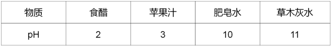
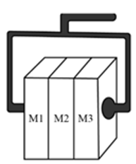
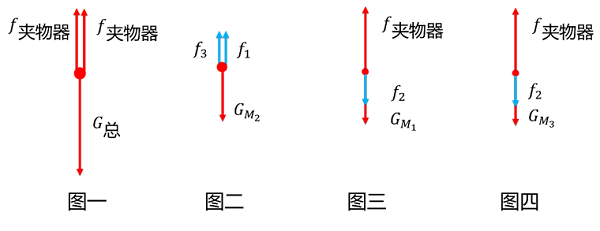
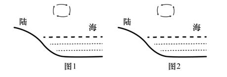
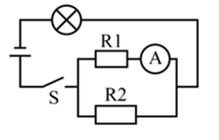

# 2025年广东省公务员录用考试《行测》题（网友回忆版）

> 常识判断 · 10 题 · 广东 2025

## 第 1 题　qid 12881952 · 人文常识

2024年，中国科技以奋进姿态奏响创新强音，向着科技强国目标迈出更加坚实的步伐。以下有关2024年中国科技成就的表述有误的是（    ）。

- **A**. 深海载人潜水器“梦想”号标志我国深海探测关键技术取得重大突破　✅
- **B**. 深中通道联通陆海，为粤港澳大湾区协同发展按下“快捷键”
- **C**. 南极秦岭站建成并投入使用，开启新时代极地科考新征程
- **D**. 嫦娥六号在人类历史上首次实现了月球背面采样返回

**答案**：A

**官方解析**

本题考查科技常识。
A项错误，“梦想”号是中国自主设计建造的首艘超深水大洋科考钻探船，于2024年11月17日在广州正式入列，标志我国深海探测关键技术取得重大突破。2020年11月10日，“奋斗者”号在马里亚纳海沟成功坐底，创造了10909米的中国载人深潜新纪录，标志着我国在大深度载人深潜领域达到世界领先水平。
B项正确，深中通道是连接深圳与中山的跨海超级工程，于2024年6月正式通车。其设计集桥梁、隧道、人工岛于一体，大幅缩短粤港澳大湾区城市群通行时间，是区域协同发展的核心基建，为粤港澳大湾区协同发展按下“快捷键”。
C项正确，中国第五个南极科考站“秦岭站”，于2024年2月建成投入使用。该站填补了南极太平洋扇区科考空白，支持冰川、海洋、生态等研究，开启了新时代极地科考新征程。
D项正确，2024年6月25日，嫦娥六号返回器着陆于内蒙古四子王旗预定区域，标志着探月工程嫦娥六号任务取得圆满成功，在人类历史上首次实现了月球背面采样返回。
本题为选非题，故正确答案为A。

---

## 第 2 题　qid 12881951 · 人文常识

党的二十届三中全会提出，鼓励和规范发展天使投资、风险投资、私募股权投资，更好发挥政府投资基金作用，发展耐心资本，耐心资本是一种专注于（    ）的资本形式。

- **A**. 中短期投资
- **B**. 长期投资　✅
- **C**. 中期投资
- **D**. 短期投资

**答案**：B

**官方解析**

本题考查经济常识。
B项正确，A、C、D三项错误，耐心资本是金融领域专业术语，指一种专注于长期投资的资本形式，不以追求短期收益为首要目标，而更重视长期回报的项目或投资活动，通常不受市场短期波动干扰，是对资本回报有较长期限展望且对风险有较高承受力的资本。
故正确答案为B。

---

## 第 3 题　qid 12881954 · 人文常识

党的二十届三中全会提出，健全保障耕地用于种植基本农作物管理体系，基本农作物是指为了满足人们基本生产生活需要而大面积栽培的农作物，以下不属于国家层面的基本农作物的是（    ）。

- **A**. 粮食
- **B**. 油料
- **C**. 蔬菜
- **D**. 苗木　✅

**答案**：D

**官方解析**

本题考查科技常识。
A、B、C三项正确，基本农作物是指为了满足人们基本生产生活需要而大面积栽培的农作物。在国家层面，基本农作物主要包括粮食、油料、棉花、糖料、蔬菜、饲草饲料等基础性、战略性农作物品种。具体到各地区，根据资源禀赋、气候条件、种植制度、区位条件等因素，基本农作物还包括具备种植历史、产业优势以及生产生活必备的区域性品种。由于基本农作物直接关系生存安全、国家安全，需要在耕地资源利用上予以优先保障。
D项错误，苗木并不属于国家明确规定的基本农作物品种，苗木主要用于园林绿化、植树造林等方面，与满足人们基本生产生活需要的基本农作物在功能和用途上存在明显区别。
本题为选非题，故正确答案为D。

---

## 第 4 题　qid 12881955 · 法律常识

国家建立基本养老保险、基本医疗保险、工伤保险、失业保险、生育保险等社会保险制度，保障公民在年老、疾病、工伤、失业、生育等情况下依法从国家和社会获得物质帮助的权利，根据《中华人民共和国社会保险法》，由用人单位缴纳保险费，职工不缴纳保险费用的是（    ）。

- **A**. 工伤保险和生育保险　✅
- **B**. 失业保险
- **C**. 基本养老保险
- **D**. 基本医疗保险

**答案**：A

**官方解析**

本题考查法律常识。
A项正确，根据《中华人民共和国社会保险法》第三十三条：“职工应当参加工伤保险，由用人单位缴纳工伤保险费，职工不缴纳工伤保险费。”第五十三条：“职工应当参加生育保险，由用人单位按照国家规定缴纳生育保险费，职工不缴纳生育保险费。”
B项错误，根据《中华人民共和国社会保险法》第四十四条：“职工应当参加失业保险，由用人单位和职工按照国家规定共同缴纳失业保险费。”
C项错误，根据《中华人民共和国社会保险法》第十条第一款：“职工应当参加基本养老保险，由用人单位和职工共同缴纳基本养老保险费。”
D项错误，根据《中华人民共和国社会保险法》第二十三条：“职工应当参加职工基本医疗保险，由用人单位和职工按照国家规定共同缴纳基本医疗保险费。”
故正确答案为A。

---

## 第 5 题　qid 12881957 · 地理国情

2025年2月召开的广东省高质量发展大会指出，自改革开放以来，广东从“三来一补”起步，从相对落后的农业省发展到牵动全球的世界工厂，再到（    ），产业体系的迭代升级，带来生产力的不断跃迁，支撑广东取得举世瞩目的发展成就。

- **A**. 国家重要先进制造业高地和新兴产业重要策源地
- **B**. 国家重要先进制造业高地和发展新质生产力的主阵地
- **C**. 引领全球的智造基地和新兴产业重要策源地　✅
- **D**. 引领全球的智造基地和发展新质生产力的主阵地

**答案**：C

**官方解析**

本题考查常识。
C项正确，A、B、D三项错误，2025年2月，广东省委书记黄坤明同志在广东省高质量发展大会上的讲话上指出：“改革开放以来，广东从‘三来一补’起步，从相对落后的农业省发展到牵动全球的世界工厂，再到引领全球的智造基地和新兴产业重要策源地，产业体系的迭代升级，带来生产力的不断跃迁，支撑广东取得举世瞩目的发展成就。把握大势、抓住机遇，在开放合作中发展壮大，在转型升级中持续蝶变，是广东产业发展的真实写照、成功经验。”
故正确答案为C。

---

## 第 6 题　qid 12881970 · 科技常识

下表为一些常见溶液的酸碱度，根据表中的信息，以下说法不恰当的是（    ）。

- **A**. 草木灰水能改良酸性土壤
- **B**. 食醋能中和皮蛋中的碱性物质
- **C**. 肥皂水能中和蚂蚁叮咬皮肤时分泌的蚁酸
- **D**. 胃酸过多的人适宜多喝苹果汁　✅

**答案**：D

**官方解析**

常温下，当溶液的pH小于7时，说明该溶液为酸性溶液；当溶液的pH等于7时，说明该溶液为中性溶液；当溶液的pH大于7时，说明该溶液为碱性溶液。根据表中的信息可知，食醋的pH等于2，为酸性溶液；苹果汁的pH等于3，为酸性溶液；肥皂水的pH等于10，为碱性溶液；草木灰水的pH等于11，为碱性溶液。
A项：草木灰是碱性溶液，该溶液能中和酸性土壤中的酸性物质，从而改善土壤，正确；
B项：食醋是酸性溶液，该溶液能中和皮蛋中的碱性物质，正确；
C项：肥皂水是碱性溶液，该溶液能中和蚂蚁叮咬皮肤时分泌的蚁酸，正确；
D项：胃酸过多是指胃液中盐酸过多，需要碱性溶液中和胃液中的盐酸，而苹果汁是酸性溶液，错误。
本题为选非题，故正确答案为D。

---

## 第 7 题　qid 12881980 · 科技常识

如图所示，通过夹物器匀速夹起表面粗糙的木块M1、M2、M3，木块M1、M2、M3始终保持相对静止，关于M1、M2、M3的受力情况，下列说法不正确的是（    ）。

- **A**. 木块M2受到的摩擦力的方向竖直向上
- **B**. 木块M1、M3受到的摩擦力数量相等
- **C**. 木块M1、M2、M3都受到两个方向相同的摩擦力　✅
- **D**. 木块M2作用于M1、M3的摩擦力方向与重力方向相同

**答案**：C

**官方解析**

由于三个木块均匀速向上运动，且保持相对静止，故三个木块均受力平衡。先将三个木块看成整体，进行受力分析，再隔离分析木块 、、的受力情况。

整体的受力情况如图一所示，在竖直方向上，整体受到向下的重力和夹物器两侧对整体向上的摩擦力的作用。                   

木块的受力情况如图二所示，在竖直方向上，受到自身向下的重力的作用，为了保持受力平衡状态，木块还受到木块、对其向上的摩擦力、的作用。

木块、的受力情况如图三、图四所示，在竖直方向上，均受到夹物器对它们向上的摩擦力和它们自身向下的重力的作用，根据牛顿第三定律可知，木块、还受到木块对它们向下的摩擦力的作用。

A项：由以上分析可知，木块受到木块、对其的摩擦力方向均竖直向上，正确；

B项：由以上分析可知，木块、均受到2个摩擦力的作用，正确；

C项：由以上分析可知，木块、受到的两个摩擦力方向均相反，木块受到的两个摩擦力方向相同，错误；

D项：由以上分析可知，木块对木块、的摩擦力方向均向下，与重力方向相同，正确。

本题为选非题，故正确答案为C。

---

## 第 8 题　qid 12881973 · 科技常识

图示为海陆风示意图，昼夜交替过程中海洋与陆地间的气温差，造成了近地面大气的密度和气压差，推动气流由高压（低温）区域向低压（高温）区域运动，从而形成了海陆风，下列关于海陆风的说法正确的是（    ）。

- **A**. 日间海面上气温低于陆地，而夜间则高于陆地　✅
- **B**. 日间，近地面气流由陆地向海面移动
- **C**. 海面上的昼夜温差较陆地大
- **D**. 图1是夜间海陆风示意图

**答案**：A

**官方解析**

根据题意可知，气流由高压（低温）区域向低压（高温）区域运动，从而形成了海陆风；由于陆地的比热容小，海水的比热容大，所以吸收相同热量后，陆地升温快，海水升温慢，反之释放相同热量后，陆地降温快，海水降温慢，因此在日间，陆地和海面吸收相同热量后，陆地温度高于海面温度，继而陆地形成低压（高温）区域，海面形成高压（低温）区域，近地面气流由海面向陆地移动，如图1所示，B、D两项均错误；反之在夜间，陆地和海面释放相同热量后，陆地温度低于海面温度，继而陆地形成高压（低温）区域，海面形成低压（高温）区域，近地面气流由陆地向海洋移动，如图2所示，A项正确；根据以上分析可知，由于海水的比热容较陆地大，所以海面上的昼夜温差较陆地小，C项错误。
故正确答案为A。

---

## 第 9 题　qid 12881979 · 科技常识

如图所示，是热敏电阻，其电阻值随温度升高而减小，已知电源电压不变，闭合开关S后，随着温度升高，下列说法不正确的是（    ）。

- **A**. 
通过电阻的电流变小

- **B**. 
电流表的读数增大

- **C**. 
灯泡亮度增大

- **D**. 
电路总电阻变大
　✅

**答案**：D

**官方解析**

分析电路可知，与并联后和灯泡串联，电流表测的是通过的电流。由题干可知，当温度升高时，的阻值减小。

根据并联电阻的特点，减小，不变，则减小。根据串联分压的规律可知，电源电压不变，减小，则并联部分分到的电压也减小，所以灯泡分到的电压增大，根据可知，灯泡的电阻不变，电压增大，则电功率增大，即灯泡亮度增大，C项正确；

根据电路总电阻，且不变、减小，可知减小，即电路总电阻变小，D项错误；

并联部分分到的电压等于各支路两端的电压，由上述分析可知，减小，则电阻分到的电压减小，根据欧姆定律，的阻值不变，减小，则通过电阻的电流变小，A项正确；

根据欧姆定律，电源电压不变，总电阻减小，则总电流增大。总电流等于各支路的电流之和，即，由A项分析可知，变小，则通过的电流增大，即电流表的读数增大，B项正确。

本题为选非题，故正确答案为D。

---

## 第 10 题　qid 12881972 · 科技常识

在日常生活中，人们总是难以避免与细菌接触，以下有关细菌的说法错误的是（    ）。

- **A**. 我国甲类传染病中的鼠疫是由细菌引发的
- **B**. 有的细菌可用于食品生产、废水处理或生物分解
- **C**. 细菌是微生物也是细胞，可以自行分裂繁殖
- **D**. 杀灭细菌，只能依靠人体自身免疫力　✅

**答案**：D

**官方解析**

A项：鼠疫是由鼠疫耶尔森菌引起的甲类传染病，鼠疫耶尔森菌是一种细菌，正确；
B项：细菌能够通过发酵、分解等代谢活动参与物质转化。比如乳酸菌能进行乳酸发酵生成乳酸，用于制作酸奶，而一些好氧细菌在有氧条件下能把废水中的机物分解成二氧化碳和水等，从而净化污水。此外还有腐生细菌，作为生态系统中的分解者，能将动植物的遗体分解成二氧化碳、水和无机盐，促进生态系统的物质循环，正确；
C项：细菌是微生物，具有细胞结构，主要通过二分裂的方式自行分裂繁殖，正确；
D项：杀灭细菌的方法有很多，除了依靠人体自身免疫力外，还可以通过物理方法（如高温、紫外线照射等）、化学方法（如使用消毒剂等）和生物方法（如使用抗生素等）来实现，错误。
本题为选非题，故正确答案为D。

---
