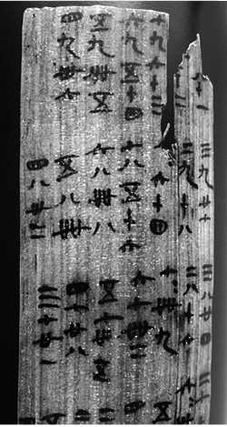

# 2025年江苏省公务员录用考试《行测》题（B类）（网友回忆版）

> 常识判断 · 9 题 · 江苏 2025

## 第 1 题　qid 11226402 · 人文常识

我国要推进国有经济布局优化和结构调整，推动国有资本和国有企业做强做优做大，增强核心功能，提升核心竞争力。国有企业的核心功能不包括：

- **A**. 维护国家安全
- **B**. 引领科技创新
- **C**. 服务国计民生
- **D**. 促进城乡融合　✅

**答案**：D

**官方解析**

本题考查理论与政策。
2023年12月25日至26日，国务院国资委召开中央企业负责人会议，全面贯彻落实党的二十大精神和中央经济工作会议精神，总结2023年国资央企工作，研究部署2024年重点任务。会议强调，要深化落实习近平总书记关于国有企业改革发展和党的建设的重要论述，落实党中央、国务院领导同志部署要求，坚持和加强党对国资央企的全面领导，围绕增强核心功能、提高核心竞争力，深入实施国有企业改革深化提升行动，着力提高中央企业创新能力和价值创造能力，推动国有资本“三个集中”，加快建设现代化产业体系、实现高质量发展，更好发挥科技创新、产业控制、安全支撑作用，为持续推动经济实现质的有效提升和量的合理增长，以中国式现代化全面推进强国建设、民族复兴伟业作出新贡献。国务院国资委党委成员出席会议。
A项正确，国有企业是保障国家经济安全和国防安全的重要力量。它们在关键领域和行业保持一定的控制力，以确保国家的经济安全和稳定。
B项正确，国有企业在很多重大科技创新领域发挥着引领作用。例如在航空航天、高铁、5G通信等领域，并突破了一系列关键核心技术，推动了我国科技水平的提升。
C项正确，国有企业广泛分布在能源、交通、金融、公用事业等关系国计民生的重要行业和关键领域，为国民经济的平稳运行和人民生活的正常进行提供了有力支撑。
D项错误，促进城乡融合主要是通过一系列政策举措及多方面力量协同作用，推动城乡之间在经济、社会、文化等各个方面的融合发展，并不是国有企业的核心功能。
本题为选非题，故正确答案为D。

---

## 第 2 题　qid 13319212 · 人文常识

2024年2月，经推荐遴选，中央组织部、中央宣传部确定20名“最美公务员”，他们从乡村振兴一线到驻外前线，从乡镇街道到产业园区，在强国建设、民族复兴新征程上作表率，他们坚定拥护“两个确立”，坚持做到“两个维护”，在重大任务、重大斗争中担苦担难担重担险，在日常工作中恪尽职守，善作善成，以实际行动彰显出新时代人民公仆本色。这一新时代人民公仆本色所体现的公务员职业道德是：

- **A**. 信仰坚定，担当作为，竭诚为民，无私奉献　✅
- **B**. 爱国敬业，遵纪守法，创业创新，服务社会
- **C**. 胸怀祖国，追求真理，淡泊名利，勇攀高峰
- **D**. 执着专注，精益求精，一丝不苟，追求卓越

**答案**：A

**官方解析**

本题考查毛中特。
A项正确，信仰坚定要求公务员坚定对马克思主义的信仰，坚定对社会主义和共产主义的信念，坚持中国共产党的领导，最美公务员“坚定拥护‘两个确立’，坚持做到‘两个维护’”即体现了这一点；担当作为要求公务员兢兢业业做好本职工作，同时坚持原则、敢于担当、认真负责，面对矛盾敢于迎难而上，面对危机敢于挺身而出，最美公务员“在重大任务、重大斗争中担苦担难担重担险，在日常工作中恪尽职守，善作善成”即体现了这一点；竭诚为民，无私奉献要求公务员坚持以人为本、执政为民，全心全意为人民服务，永做人民公仆，最美公务员们大多来自基层“从乡村振兴一线到驻外前线，从乡镇街道到产业园区”，身处与民生联系最紧密、对民情民意最了解的基层一线，他们自觉将为人民服务的理念融入到工作实践中，“以实际行动彰显出新时代人民公仆本色”即体现了这一点。
B项错误，“爱国敬业，遵纪守法，创业创新，服务社会”属于企业家精神的内容。
C项错误，“胸怀祖国，追求真理，淡泊名利，勇攀高峰”属于科学家精神的内容。
D项错误，“执着专注，精益求精，一丝不苟，追求卓越”属于工匠精神的内容。
故正确答案为A。

---

## 第 3 题　qid 11226411 · 人文常识

下图为敦煌地区出土的汉代竹简残片，下列对其记载内容判断正确的是：

①竹简上记载的内容到现在仍在广泛使用

②竹简记载了当时河流水位的季节变化情况

③竹简上的内容表明我国很早开始使用十进制计数法

④竹简上的内容可能在汉代通过“丝绸之路”传播到西方

- **A**. ①③　✅
- **B**. ①④
- **C**. ②③
- **D**. ②④

**答案**：A

**官方解析**

本题考查人文常识。
①正确，从图片中可以看出，竹简上记载的是九九乘法口诀。九九乘法表是数学中的乘法口诀，别名有九九歌，产生年代是春秋战国，出自《算法大成》，到现在仍在广泛使用。
②错误，图片中竹简上明确记载的是九九乘法口诀，并没有任何关于当时河流水位季节变化情况的相关信息，所以不能得出竹简记载了当时河流水位的季节变化情况这一结论。
③正确，竹简上的九九乘法口诀使用了从一到九的数字，这表明我国已经熟练地使用十进制计数法。十进制计数法是一种以10为基数的计数方法，至迟在商代时，中国已采用了十进位值制。
④错误，虽然“丝绸之路”在汉代已经开通，促进了东西方的文化交流，但目前并没有确凿的证据表明九九乘法口诀在汉代通过“丝绸之路”传播到了西方。据记载，九九乘法口诀13世纪才传入西方。
故①③判断正确。
故正确答案为A。

---

## 第 4 题　qid 11226404 · 科技常识

我国科学家攻克石墨高温纯化关键技术，成功开发出超高纯石墨产品，标志着我国超高纯石墨产品达到国际领先水平。下列关于石墨的说法正确的是：

- **A**. 是由碳元素组成的有色金属矿物
- **B**. 在自然界分布广泛，不存在人造石墨
- **C**. 属于战略性物资，我国禁止出口石墨产品
- **D**. 在工业生产中应用广泛，被誉为“工业黑金”　✅

**答案**：D

**官方解析**

本题考查科技常识。
A项错误，石墨又名黑铅，是碳的一种同素异形体，不透明且触感油腻，颜色由铁黑到钢铁灰不等，形状可呈晶体状、薄片状、鳞状、条纹状、层状体。石墨是一种非金属矿物，并不是有色金属矿物。
B项错误，石墨是一种天然形成的矿物，它常见于火成岩、变质岩中的矿床或伴生矿物中，也可以在沉积岩中发现。石墨既存在于自然界中，也可以通过人工制备得到。天然石墨的生产成本相对较高，而人工合成的石墨可以达到更高的质量和纯度要求。
C项错误，石墨是多个国家的战略性矿产资源，其在新能源、航天航空、核能、军工等战略性新兴产业中具有重要应用。中国作为全球最大的石墨生产国和出口国，长期以来，坚定履行防扩散等国际义务，根据维护国家安全和利益需要，依法对特定石墨物项实施出口管制，对部分石墨物项实施临时管制。故“禁止出口石墨产品”说法错误。
D项正确，石墨由于其特殊的结构，具有耐高温性、抗热震性、导电性、润滑性、化学稳定性以及可塑性等众多特性，广泛应用于冶金、机械、电子、军工、国防、航天航空等领域，被称为“工业黑金”。
故正确答案为D。

---

## 第 5 题　qid 11226403 · 人文常识

公正司法是维护社会公平正义的最后一道防线，规范司法权力的运行，建设公正高效权威的社会主义司法制度，才能让人民群众在每一个案件中感受公平正义。下列说法与公正司法精神相契合的是：

- **A**. 人民法院独立行使审判权，不受任何机关或组织的制约
- **B**. 在案件事实无法查清的情况下，人民法院不应作出终局裁判
- **C**. 在司法活动中，应重视发挥司法政策的导向作用和解释功能　✅
- **D**. 审判过程一律公开，人民法院应以人民看得见的方式裁判案件

**答案**：C

**官方解析**

本题考查法律常识。
A项错误，根据《中华人民共和国宪法》第一百三十一条和《中华人民共和国人民法院组织法》第四条规定：“人民法院依照法律规定独立行使审判权，不受行政机关、社会团体和个人的干涉。”因此，人民法院独立行使审判权，并不是不受任何机关或组织的制约，表述过于绝对，与公正司法精神不相契合。
B项错误，根据《中华人民共和国民事诉讼法》第六十七条规定：“当事人对自己提出的主张，有责任提供证据。当事人及其诉讼代理人因客观原因不能自行收集的证据，或者人民法院认为审理案件需要的证据，人民法院应当调查收集。人民法院应当按照法定程序，全面地、客观地审查核实证据。”《最高人民法院关于民事诉讼证据的若干规定》第八十五条第一款规定：“人民法院应当以证据能够证明的案件事实为根据依法作出裁判。”《中华人民共和国刑事诉讼法》第二百条第三项规定：“（三）证据不足，不能认定被告人有罪的，应当作出证据不足、指控的犯罪不能成立的无罪判决。”《中华人民共和国行政诉讼法》第三十四条第一款规定：“被告对作出的行政行为负有举证责任，应当提供作出该行政行为的证据和所依据的规范性文件。”由此说明，在案件事实无法查清的情况下，人民法院审理民事案件时应依据证据能够证明的案件事实作出裁判，审理刑事案件时应依法作出无罪判决。因此，审理行政案件时应依据证据能够证明的案件事实作出终局裁判，而不是不应作出终局裁判，表述不符合法律规定，与公正司法精神不相契合。
C项正确，根据《关于统一法律适用加强类案检索的指导意见》要求：“检索到的类案为指导性案例的，人民法院应当参照作出裁判；检索到其他类案的，人民法院可以作为作出裁判的参考。”由此说明，司法政策通过明确裁判标准，解决了法律适用中的模糊性问题，体现了司法政策的导向作用。此外，司法政策还可以通过解释法律条文，弥补法律规定的不足，例如《关于适用〈关于民事诉讼证据的若干规定〉中有关举证时限规定的通知》，对举证时限作了释明与补充，体现了司法政策的解释功能。因此，在司法活动中，应重视发挥司法政策的导向作用和解释功能，有助于实现司法公正和统一，与公正司法精神相契合。
D项错误，根据《中华人民共和国民事诉讼法》第一百三十七条规定：“人民法院审理民事案件，除涉及国家秘密、个人隐私或者法律另有规定的以外，应当公开进行。离婚案件，涉及商业秘密的案件，当事人申请不公开审理的，可以不公开审理。”《中华人民共和国刑事诉讼法》第十一条规定：“人民法院审判案件，除本法另有规定的以外，一律公开进行。被告人有权获得辩护，人民法院有义务保证被告人获得辩护。”《中华人民共和国行政诉讼法》第五十四条规定：“人民法院公开审理行政案件，但涉及国家秘密、个人隐私和法律另有规定的除外。涉及商业秘密的案件，当事人申请不公开审理的，可以不公开审理。”因此，人民法院审判过程不是一律公开，表述过于绝对，与公正司法精神不相契合。
故正确答案为C。

---

## 第 6 题　qid 13319223 · 法律常识

M公司在网络购物平台销售一款智能门锁，宣称该门锁具有“生成临时密码”功能，韩某购买安装该款门锁后，发现并不具备所宣称的功能，该公司回复说需要额外付费升级系统后才能安装该功能。对此，下列说法不正确的是：

- **A**. M公司对产品的不实宣传构成欺诈
- **B**. M公司与韩某之间的买卖合同无效　✅
- **C**. 韩某有权向M公司主张惩罚性赔偿
- **D**. 韩某有权请求M公司承担违约责任

**答案**：B

**官方解析**

本题考查法律常识。
A项正确，一方当事人故意告知对方虚假情况，或者故意隐瞒真实情况，诱使对方当事人作出错误意思表示的，可以认定为欺诈行为。题中，M公司宣称其销售的门锁具有“生成临时密码”功能，但韩某购买安装后发现并不具备所宣称的功能，因此，M公司对产品的不实宣传构成欺诈。
B项错误，根据《中华人民共和国民法典》第一百四十八条规定：“一方以欺诈手段，使对方在违背真实意思的情况下实施的民事法律行为，受欺诈方有权请求人民法院或者仲裁机构予以撤销。”因此，M公司与韩某之间的买卖合同并不是无效的，而是可撤销的。
C项正确，根据《中华人民共和国消费者权益保护法》第五十五条第一款规定：“经营者提供商品或者服务有欺诈行为的，应当按照消费者的要求增加赔偿其受到的损失，增加赔偿的金额为消费者购买商品的价款或者接受服务的费用的三倍；增加赔偿的金额不足五百元的，为五百元。法律另有规定的，依照其规定。”因此，韩某有权向M公司主张惩罚性赔偿。
D项正确，根据《中华人民共和国民法典》第一百八十六条规定：“因当事人一方的违约行为，损害对方人身权益、财产权益的，受损害方有权选择请求其承担违约责任或者侵权责任。”违约行为，是指当事人一方不履行合同义务或履行合同义务不符合约定条件的行为。题中，韩某购买安装的M公司销售的智能门锁，并不具备约定的“生成临时密码”功能，M公司的行为构成违约，因此，韩某有权请求M公司承担违约责任。
本题为选非题，故正确答案为B。

---

## 第 7 题　qid 11226409 · 法律常识

秦某驾车在F市某丁字路口右转行驶30米后，道路左侧和地上出现“禁止驶入”的交通标志和标线。秦某进退两难，遂驶入了禁行路段。F市交巡警支队作出处罚决定，认定秦某驾车在该路段逆向行驶违法，予以200元罚款、记3分的处理。秦某不服，向F市公安局提起行政复议。下列关于本案的说法正确的是：

- **A**. 该交通标志标线设置符合比例原则中的适当性要求
- **B**. 秦某不可以将该路段其他车辆的违章信息申请公开
- **C**. F市交巡警支队实施行政处罚遵循的是无过错原则
- **D**. 秦某可举证证明自己机动车逆向行驶没有主观过错　✅

**答案**：D

**官方解析**

本题考查法律常识。
A项错误，根据《城市道路交通标志和标线设置规范》4.3.1规定：“交通标志应设置在车辆行进方向上易于看到的地方，并宜设置在车辆前进方向的右侧或车行道上方。当路段单向车道数大于4条、道路交通量大、大车比例高时，宜分别在车辆前进方向左、右两侧设置相同的交通标志。”因此，F市交巡警支队将案涉禁行标志设置在道路的左侧，符合规范，但交通标志标线设置除了应当符合相关规范外，还应当考虑相关通行设计的合理性等因素。秦某驾车行至该丁字路口时，路口前方或其他相应位置并未设置“禁止右转”等相关提示标志。此种情况下，一般人的反应是此处可以右转，既然可以右转，右转后的道路一般情况下均可以通行。本案F市交巡警支队虽然将禁行标志设置在禁行道路的起点，但没有在起点位置之前的适当位置设置相应的提示标志，致使机动车驾驶人驶入顺行路段后，容易越过禁行道路，造成违章。因此，该处的交通标志标线设置存在不合理之处，不符合比例原则中的适当性要求。
B项错误，根据《中华人民共和国政府信息公开条例》第十三条规定：“除本条例规定的行政机关主动公开的政府信息外，公民、法人或者其他组织还可以根据自身生产、生活、科研等特殊需要，向国务院部门、地方各级人民政府及县级以上地方人民政府部门申请获取相关政府信息。”第二条规定：“本条例所称政府信息，是指行政机关在履行行政管理职能过程中制作或者获取的，以一定形式记录、保存的信息。”因此，秦某可以将该路段其他车辆的违章信息申请公开。
C项错误，D项正确，根据《中华人民共和国行政处罚法》第三十三条第二款规定：“当事人有证据足以证明没有主观过错的，不予行政处罚。法律、行政法规另有规定的，从其规定。”因此，当事人无过错的，行政机关不得进行处罚，F市交巡警支队实施行政处罚没有遵循无过错原则，秦某可举证证明自己机动车逆向行驶没有主观过错。
故正确答案为D。

---

## 第 8 题　qid 11226416 · 法律常识

某县自然资源和规划局向县政府请示回收某地块的土地使用权。县政府批复同意后，县自然资源和规划局并未制作回收决定书，也未通知该地块的使用权人，而是直接将回收事项交由县土地储备中心付诸实施。韩某合法的房屋位于该地块内，对回收土地使用权的决定不服，遂提起行政诉讼。对此，下列说法不正确的是：

- **A**. 县政府的批复属于内部行政行为，并没有对韩某的权益产生影响
- **B**. 县自然资源和规划局虽未制作回收决定书，但回收土地的决定已生效
- **C**. 县自然资源和规划局直接将县政府批复付诸实施的行为具有可诉性
- **D**. 韩某提起行政诉讼应列的被告是县政府而不是县自然资源和规划局　✅

**答案**：D

**官方解析**

本题考查法律常识。
A、C两项正确，根据《中华人民共和国行政诉讼法》第十二条第一款第四项规定：“人民法院受理公民、法人或者其他组织提起的下列诉讼：（四）对行政机关作出的关于确认土地、矿藏、水流、森林、山岭、草原、荒地、滩涂、海域等自然资源的所有权或者使用权的决定不服的。”内部行政行为是指行政主体在内部行政组织管理过程中所作的只对行政组织内部产生法律效力的行政行为。这种行为通常基于行政隶属关系，只影响行政组织内部的事务。然而，当内部行政行为对外部相对人的权利义务产生实际影响并被付诸实施，出现“内部行政行为外部化”的情形时，则具有可诉性。题干中，县政府的批复本身属于内部行政行为，不具有处分性，并没有对韩某的权益产生直接影响。然而，后期县自然资源和规划局直接将县政府批复付诸实施的行为对韩某的土地使用权益产生了影响，具有可诉性。
B项正确，公定力是指行政行为一经成立，不论是否合法，即具有被推定为合法而要求所有机关、组织、个人予以尊重的一种法律效力。公定力是一种推定或假定的法律效力。行政行为在因为违法而被有关机关撒销或变更以前，被推定为合法的，要求公众予以尊重。因此，县自然资源和规划局回收该地块的土地使用权虽未严格依照法定程序，但行政行为具有公定力，一经成立，则对相对人产生效力，需要所有机关、组织、个人予以尊重。
D项错误，根据《最高人民法院关于适用〈中华人民共和国行政诉讼法〉的解释》第十九条规定：“当事人不服经上级行政机关批准的行政行为，向人民法院提起诉讼的，以在对外发生法律效力的文书上署名的机关为被告。”《中华人民共和国行政诉讼法》第二十六条第一款：“公民、法人或者其他组织直接向人民法院提起诉讼的，作出行政行为的行政机关是被告。”题干中，并未表明谁是在对外发生法律效力的文书上署名的机关，然而题干中表明是由县自然资源和规划局直接将回收事项交由县土地储备中心付诸实施，可见该行政行为的作出机关为县自然资源和规划局，因此本案被告应为县自然资源和规划局。
本题为选非题，故正确答案为D。

---

## 第 9 题　qid 11226405 · 人文常识

某炒货店的食品经营许可证即将到期，向所在县的市场监督管理局申请延续经营许可，县市场监督管理局经审核确认，炒货店经营许可的案件与原发证条件相比无本质变化，但周边的居民反映炒货店开业以来，人流量大，有噪声污染和用电安全隐患。对此，县市场监督管理局的合法处理方式应是：

- **A**. 可对炒货店提出的延续申请作出暂停许可
- **B**. 按照原标准对炒货店的延续申请进行审查
- **C**. 按照初次许可申请要件重新审核延续申请
- **D**. 将相邻关系因素作为延续申请的考量因素　✅

**答案**：D

**官方解析**

本题考查法律常识。
A项错误，根据《中华人民共和国行政许可法》第五十条第二款规定：“行政机关应当根据被许可人的申请，在该行政许可有效期届满前作出是否准予延续的决定；逾期未作决定的，视为准予延续。”对于被许可人的延续申请，行政机关的决定只有是否准予，暂停许可”不属于行政许可延续的法定处理方式。
B项正确，D项错误，根据《食品经营许可和备案管理办法》第三十四条第三款规定：“申请变更或者延续食品经营许可时，申请人声明经营条件未发生变化、经营项目减项或者未发生变化的，市场监督管理部门可以不进行现场核查，对申请材料齐全、符合法定形式的，当场作出准予变更或者延续食品经营许可决定。”可见，延续申请的审查范围仅限经营条件、经营项目与行政许可直接相关的条件，噪声污染、用电安全隐患并非本案中与食品安全直接相关的条件，行政机关无需将相邻关系因素作为延续申请的考量因素。
C项错误，根据《食品经营许可和备案管理办法》第三十三条规定：“食品经营者申请延续食品经营许可的，应当提交食品经营许可延续申请书，以及与延续食品经营许可事项有关的其他材料。食品经营者取得纸质食品经营许可证正本、副本的，应当同时提交。”行政许可延续与初次许可的法律性质、审查强度、材料要求存在法定差异，二者不能等同。延续申请无需按照初次许可申请要件重新审核。
故正确答案为B。

---
