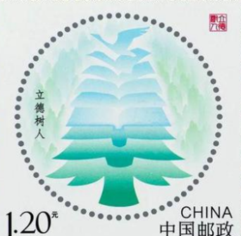

# 2025年江苏省公务员录用考试《行测》题（C类）（网友回忆版）

> 常识判断 · 9 题 · 江苏 2025

## 第 1 题　qid 11226406 · 人文常识

巩固和完善农村基本经营制度是党的农村政策的基石，是促进乡村全面振兴、加快建设农业强国的制度基础。关于巩固和完善农业农村基本经营制度的要求，下列表述正确的是：
①坚持稳定土地承包关系
②坚持家庭经营基础性地位
③坚持土地集中连片流转
④坚持农村土地农民集体所有

- **A**. ①②③
- **B**. ①②④　✅
- **C**. ①③④
- **D**. ②③④

**答案**：B

**官方解析**

本题考查理论与政策。
①②④正确，《关于完善农村土地所有权承包权经营权分置办法的意见》在“二、总体要求”部分“（二）基本原则”中指出：“守住政策底线。坚持和完善农村基本经营制度，坚持农村土地集体所有，坚持家庭经营基础性地位，坚持稳定土地承包关系，不能把农村土地集体所有制改垮了，不能把耕地改少了，不能把粮食生产能力改弱了，不能把农民利益损害了。”
③错误，《农村土地经营权流转管理办法》在“第一章 总则”部分指出：“第四条 土地经营权流转应当因地制宜、循序渐进，把握好流转、集中、规模经营的度，流转规模应当与城镇化进程和农村劳动力转移规模相适应，与农业科技进步和生产手段改进程度相适应，与农业社会化服务水平提高相适应，鼓励各地建立多种形式的土地经营权流转风险防范和保障机制。”因此，要引导农村土地经营权有序流转，而非坚持土地集中连片流转。
故①②④表述正确。
故正确答案为B。

---

## 第 2 题　qid 11226408 · 法律常识

根据《农村集体经济组织法》，非农村集体经济组织成员长期在农村集体经济组织工作，对集体做出贡献的，经农村集体经济组织成员大会全体成员四分之三以上同意，可以享有的权利是：
①参与分配集体收益
②可以取得宅基地使用权
③享受农村集体经济组织提供的服务和福利
④集体土地被征收征用时参与分配土地补偿费等

- **A**. ①②
- **B**. ①③　✅
- **C**. ②④
- **D**. ③④

**答案**：B

**官方解析**

本题考查法律常识。
①③正确，②④错误，根据《农村集体经济组织法》第十五条规定：“非农村集体经济组织成员长期在农村集体经济组织工作，对集体做出贡献的，经农村集体经济组织成员大会全体成员四分之三以上同意，可以享有本法第十三条第七项、第九项、第十项规定的权利。”第十三条规定：“农村集体经济组织成员享有下列权利：（一）依照法律法规和农村集体经济组织章程选举和被选举为成员代表、理事会成员、监事会成员或者监事；（二）依照法律法规和农村集体经济组织章程参加成员大会、成员代表大会，参与表决决定农村集体经济组织重大事项和重要事务；（三）查阅、复制农村集体经济组织财务会计报告、会议记录等资料，了解有关情况；（四）监督农村集体经济组织的生产经营管理活动和集体收益的分配、使用，并提出意见和建议；（五）依法承包农村集体经济组织发包的农村土地；（六）依法申请取得宅基地使用权；（七）参与分配集体收益；（八）集体土地被征收征用时参与分配土地补偿费等；（九）享受农村集体经济组织提供的服务和福利；（十）法律法规和农村集体经济组织章程规定的其他权利。”
故正确答案为B。

---

## 第 3 题　qid 11226413 · 人文常识

“全面深化改革是一场深刻的社会革命，是一项复杂的系统工程，必须以科学的方法论为指导方能行稳致远。”这句话与下列古语所蕴含的理念相契合的是：

- **A**. 事必有法，然后可成　✅
- **B**. 于安思危，于治忧乱
- **C**. 备豫不虞，为国常道
- **D**. 取之有度，用之有节

**答案**：A

**官方解析**

本题考查马克思主义。
“全面深化改革是一场深刻的社会革命，是一项复杂的系统工程，必须以科学的方法论为指导方能行稳致远。”强调了科学方法的重要性。
A项正确，“事必有法，然后可成”意思是任何事情都有方法，只有找到合适的方法，才能成功。强调了科学方法的重要性，蕴含的理念与题干一致。
B项错误，“于安思危，于治忧乱”意思是即使居于安乐的环境里，也要想到可能出现的危险；即使处在稳定的境况中，也要忧虑可能发生的动乱。‌强调的是矛盾的同一性，即矛盾双方相互依存、相互转化。蕴含的理念与题干不一致。
C项错误，“备豫不虞，为国常道”意思是事先防备意外之事，是治理国家的常道。强调了防患于未然的重要性，蕴含的理念与题干不一致。
D项错误，“取之有度，用之有节”意思是在获取资源时要有限度，在使用时要节制。强调了质量互变原理中“度”的重要性观点，蕴含的理念与题干不一致。
故正确答案为A。

---

## 第 4 题　qid 11226414 · 人文常识

下面图片是我国为纪念某一特定节日而发行的纪念邮票，据此可判断该节日是：

- **A**. 青年节
- **B**. 教师节　✅
- **C**. 植树节
- **D**. 重阳节

**答案**：B

**官方解析**

本题考查人文常识。
A项错误，青年节是5月4日，邮票中没有任何与青年节相关的元素，如五四青年节相关的历史事件、标志等。
B项正确，第一张邮票写着“9月10日教师节”；第二张邮票左侧有“立德树人”的文字，“立德树人”是教育的根本任务；第三张邮票左侧有“教师节·师恩难忘”的文字。都表明这些邮票是为纪念教师节发行的。
C项错误，植树节是3月12日，邮票中没有种植树木、树苗等与植树节直接相关的元素。
D项错误，重阳节是农历9月9日，有登高祈福、拜神祭祖、晒秋、赏菊、饮宴祈寿等习俗，邮票中没有相关的元素。
故正确答案为B。

---

## 第 5 题　qid 11226417 · 人文常识

七巧板是一种古老的中国传统智力玩具，由一个正方形切割成的大小、形状各异的七块板组成。它们可以拼成许多图形，其原理在我国现代社区治理中多有体现。下列我国社区治理实践与七巧板的原理相契合的是：

- **A**. 网格化管理　✅
- **B**. 社区服务外包
- **C**. 河湖长制
- **D**. 首问责任制

**答案**：A

**官方解析**

本题考查管理常识。
A项正确，网格化，就是将城区行政性地划分为一个个的“网格”，使这些网格成为政府管理基层社会的单元。网格化管理依托统一的城市管理以及数字化平台，将城市管理辖区按照一定的标准划分成为单元网格。通过加强对单元网格的部件和事件巡查，建立一种监督和处置互相分离的形式。
B项错误，社区公共服务外包是一种新型的政府提供社区公共服务的模式。它将社区公共服务的提供和生产的概念区分开来，较好地兼顾了服务提供的效率和公平，而专业的社工、非营利组织和营利性组织进入社区服务领域，大大改善了社区的服务环境，满足社区人群对公共服务日益提升的多元化需求。
C项错误，河湖长制即河长制、湖长制的统称，是由各级党政负责同志担任河湖长，负责组织领导相应河湖治理和保护的一项生态文明建设制度创新。通过构建责任明确、协调有序、监管严格、保护有力的河湖管理保护机制，为维护河湖健康生命、实现河湖功能永续利用提供制度保障。
D项错误，首问责任制是针对群众对机关内设机构职责分工和办事程序不了解、不熟悉的实际问题，而采取的一项便民工作制度。该制度规定群众来访时，机关在岗被询问的工作人员即为首问责任人。要求首问责任人对群众提出的问题或要求，无论是否是自己职责（权）范围内的事，都要给群众一个满意的答复。
故正确答案为A。

---

## 第 6 题　qid 13319234 · 科技常识

当人们乘坐列车进藏时，会在青藏铁路旁发现一个特别的景象，路基两旁时不时会闪过一排排金属管，这些金属管插入地底，露出地面的部分高达两米（如图所示）。关于这些金属管的作用，下列说法正确的是：

- **A**. 收集传导气象信息
- **B**. 实时监控路基安全
- **C**. 阻挡动物横穿铁路
- **D**. 保护冻土层的结构　✅

**答案**：D

**官方解析**

本题考查地理国情。
D项正确，A、B、C三项错误，青藏高原由于海拔高气温低，冻土层分布广泛。随着温度的变化，土体会产生多次冻融和冻胀，这样的过程容易造成土层结构破坏、地基承载力降低、边坡失稳等问题。为了减少温度上升冻土融化下沉造成的路基下沉，需要在路基沿线架设热棒。热棒是一种高约4米、内部中空、外部有散热片的金属柱子，其根部有很多空心管通入路基之中，当路基受热有水汽出现，这些水汽就会顺着空心管道上升至热棒中。高原地区的气温低、风力大，寒冷的风吹过热棒的散热片后，把热量带走，水汽就此也降温凝结。故这些金属管的作用为保护冻土层的结构。
故正确答案为D。

---

## 第 7 题　qid 11226412 · 人文常识

某地遭遇特大暴雨灾害，地处深山的M社区断水断电断网，成为一座孤岛，洪水冲毁附近铁路，千名乘客滞留车厢。紧急关头，社区党支部孟书记带领党员和居民安置转运近千名滞留乘客，解决他们的吃、住等问题，保障了他们的生命财产安全，为后续救援赢得了宝贵时间。关于孟书记事迹所体现的职业道德，下列表述最贴切的是：

- **A**. 秉公用权，公私分明，努力维护和促进社会公平正义
- **B**. 依法履职，严格按照法定的权限、程序和方式执行公务
- **C**. 精通业务知识，勤勉敬业、求真务实，兢兢业业做好本职工作
- **D**. 敢于担当、无私奉献，面对困难奋勇而上，面对危机挺身而出　✅

**答案**：D

**官方解析**

本题考查毛中特。
A项错误，“秉公用权，公私分明，努力维护和促进社会公平正义”主要侧重于在权力使用过程中不偏不倚，处理公共事务时公正无私，维护社会公平正义。而题干中孟书记的事迹重点在于他面对特大暴雨灾害这种紧急困难情况时的应对举措，并没有突出权力使用以及公平正义相关方面。
B项错误，“依法履职，严格按照法定的权限、程序和方式执行公务”强调的是在执行公务时遵循法律规定的权限和程序。但题干主要围绕孟书记带领大家积极应对灾害，保障滞留乘客生命财产安全展开，并没有涉及到依法依规按程序执行公务的内容。
C项错误，“精通业务知识，勤勉敬业、求真务实，兢兢业业做好本职工作”着重体现的是对业务知识的掌握以及工作态度方面。题干重点突出的是孟书记在面临特大暴雨灾害这种危机情况时的担当和奉献精神，并非强调业务知识和日常工作态度。
D项正确，“敢于担当、无私奉献，面对困难奋勇而上，面对危机挺身而出”很好地契合了孟书记在社区遭遇特大暴雨灾害、乘客滞留的危机时刻，带领党员和居民积极安置转运滞留乘客，解决各种问题，保障生命财产安全的行为，充分体现了孟书记在困难和危机面前敢于承担责任、无私奉献的精神品质。
故正确答案为D。

---

## 第 8 题　qid 11226418 · 人文常识

张某与李某同住一个小区，双方发生借款纠纷，张某起诉到法院，法院判决李某应偿还借款，但李某未履行生效判决。为此，张某在小区业主群向李某讨债，并在小区公告栏、电梯间等处张贴判决书。李某认为张某侵犯了其个人权益。对此，下列说法正确的是：

- **A**. 张某正当行使权利，其讨债行为不构成侵权
- **B**. 张某向李某公开讨债，侵犯了李某的名誉权
- **C**. 张某公开张贴判决书，侵犯了李某的隐私权　✅
- **D**. 张某应当申请法院强制执行，无权自行讨债

**答案**：C

**官方解析**

本题考查法律常识。
A项错误，C项正确，根据《中华人民共和国民法典》第一千零三十二条规定：“自然人享有隐私权。任何组织或者个人不得以刺探、侵扰、泄露、公开等方式侵害他人的隐私权。隐私是自然人的私人生活安宁和不愿为他人知晓的私密空间、私密活动、私密信息。”题中，张某未经许可，将带有李某个人信息的判决书公布到小区，侵犯了李某的隐私权。
B项错误，根据《中华人民共和国民法典》第一千零二十四条规定：“民事主体享有名誉权。任何组织或者个人不得以侮辱、诽谤等方式侵害他人的名誉权。名誉是对民事主体的品德、声望、才能、信用等的社会评价。”题中，张某未经许可，将带有李某个人信息的判决书公布到小区，并未以侮辱、诽谤等方式侵害李某的名誉权。
D项错误，根据《中华人民共和国民事诉讼法》第二百四十七条规定：“发生法律效力的民事判决、裁定，当事人必须履行。一方拒绝履行的，对方当事人可以向人民法院申请执行，也可以由审判员移送执行员执行。调解书和其他应当由人民法院执行的法律文书，当事人必须履行。一方拒绝履行的，对方当事人可以向人民法院申请执行。”因此，张某可以申请法院强制执行，但是也有权自行讨债。
故正确答案为C。

---

## 第 9 题　qid 11226419 · 法律常识

燕某、郑某是某小区业主委员会的主任和委员，同时也是业主微信群的群主和管理员。业主徐某在业主群中发言，质疑业主委员会不依法办事，并与多位业主发生争执，郑某将其移出群。徐某向燕某投诉，要求重新入群，燕某拒绝并将其拉黑。徐某认为其人格受到贬损，欲将燕某、郑某起诉至法院，对此，下列说法正确的是：

- **A**. 郑某作为管理员不拥有平台赋予的“踢人”权力
- **B**. 燕某作为群主将业主徐某拉黑，侵害了其人格权
- **C**. 入群、退群、移出群等行为不属于民事诉讼受案范围　✅
- **D**. 业主微信群的群主、管理员没有自主选择群成员的权力

**答案**：C

**官方解析**

本题考查法律常识。
A、D两项错误，根据《互联网群组信息服务管理规定》第九条第一款规定：“互联网群组建立者、管理者应当履行群组管理责任，依据法律法规、用户协议和平台公约，规范群组网络行为和信息发布，构建文明有序的网络群体空间。”题中，业主微信群的群主、管理员有权依照规定履行包括将群成员移出群组、自主选择群成员在内的群组管理职责。
B项错误，根据《中华人民共和国民法典》第九百九十条规定：“人格权是民事主体享有的生命权、身体权、健康权、姓名权、名称权、肖像权、名誉权、荣誉权、隐私权等权利。除前款规定的人格权外，自然人享有基于人身自由、人格尊严产生的其他人格权益。”题中，并未表明燕某发表过对徐某侮辱、诽谤的内容，燕某作为群主将业主徐某拉黑不构成对其人格权的侵犯。
C项正确，根据《中华人民共和国民事诉讼法》第三条规定：“人民法院受理公民之间、法人之间、其他组织之间以及他们相互之间因财产关系和人身关系提起的民事诉讼，适用本法的规定。”入群、退群、移出群等行为不涉及公民之间的人身和财产关系，不产生民事法律关系，因此不属于民事诉讼受案范围。
故正确答案为C。

---
