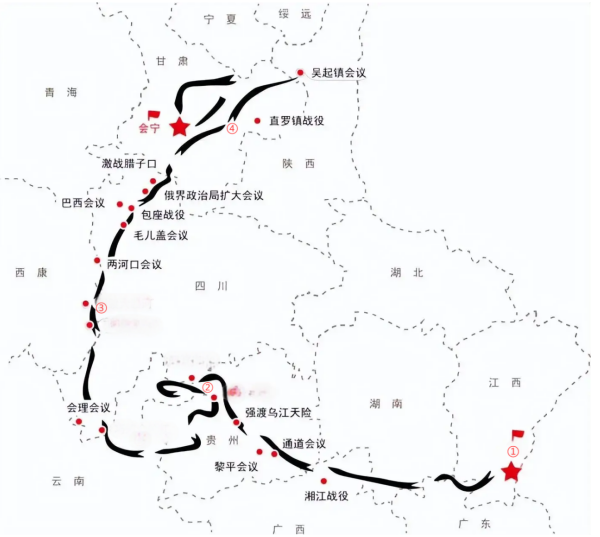

# 2025年浙江省公务员录用考试《行测》题（C类）（网友回忆版）

> 常识判断 · 9 题 · 浙江 2025

## 第 1 题　qid 10297292 · 人文常识

2024年是红军长征出发90周年。某博物馆在“重走长征路”展厅展出了如下路线图。下列与图中地点有关的表述，不正确的是：

- **A**. 地点①是红军长征的主要出发地，也是中国共产党创建的第一个全国性红色政权的所在地
- **B**. 在地点②召开的会议，集中解决了党内所面临的最迫切的组织问题和军事问题，在极端危急的历史关头挽救了党和红军，是中国共产党历史上一个生死攸关的转折点
- **C**. 在地点③附近，红军依次经历了“强渡大渡河”“巧渡金沙江”“飞夺泸定桥”　✅
- **D**. 毛泽东在地点④写下“今日长缨在手，何时缚住苍龙”，抒发了将革命进行到底的壮志豪情

**答案**：C

**官方解析**

本题考查毛中特。
A项正确，地点①为江西瑞金。1931年11月7日，中华苏维埃共和国临时中央政府在江西瑞金召开的中华苏维埃第一次全国代表大会上宣告成立。瑞金是中国共产党创建的第一个全国性红色政权的所在地。1934年10月10日，中央红军开始实行战略转移，中共中央、中革军委机关由瑞金出发，向集结地域开进。瑞金是红军长征的主要出发地之一。
B项正确，地点②为贵州遵义。1935年1月15日至17日，中共中央政治局在遵义召开中共中央政治局扩大会议。这次会议解决了当时党内最迫切的组织问题和军事问题，结束了“左”倾教条主义错误在中央的统治，确立了毛泽东在中共中央和红军的领导地位。这次会议，在极端危急的历史关头，挽救了党，挽救了红军，挽救了中国革命。
C项错误，地点③为四川泸定县附近。1935年5月3日至9日，中央红军长征从云南省皎平渡巧渡金沙江。1935年5月24日至25日，中国工农红军在四川省越西县（今属四川省石棉县）安顺场渡过大渡河。1935年5月29日，红军先遣部队——一军团二师四团飞速赶到泸定，占领西桥头，经过激烈战斗，终于夺取了泸定桥。红军依次经历的正确顺序应为“巧渡金沙江”“强渡大渡河”“飞夺泸定桥”。
D项正确，地点④为六盘山。“今日长缨在手，何时缚住苍龙”出自毛泽东的《清平乐·六盘山》，这首词是毛泽东翻越六盘山时的咏怀之作，抒发了彻底打垮国民党和日本帝国主义者的坚强决心，发誓将革命进行到底的壮志豪情。
本题为选非题，故正确答案为C。

---

## 第 2 题　qid 10297296 · 人文常识

2024年10月10日，故宫博物院成立99周年。下列与故宫有关的说法，不正确的是：

- **A**. 故宫的前身是明清皇宫紫禁城，由明太祖朱元璋决定开建　✅
- **B**. 2024年，北京中轴线被列入《世界遗产名录》，故宫就位于该中轴线上
- **C**. 故宫博物院馆藏文物丰富，是中华文明源远流长的见证，其中有《清明上河图》《平复帖》等
- **D**. 近年来，故宫博物院用文创“唤醒”文物，研发万余种文创产品，如雍正御批折扇、《千里江山图》装饰面、《五牛图》铜牛等

**答案**：A

**官方解析**

本题考查人文常识。
A项错误，1925年10月10日，故宫博物院成立，其前身是明清两朝皇宫紫禁城，由明成祖朱棣决定并建成。永乐四年（1406年），朱棣为了巩固北部边疆，决定营建北京宫殿，第二年即派员筹办物料。永乐十五年（1417年）开始大规模兴建，永乐十八年（1420年）十二月底建成。次年正式把京师从南京迁到北京。
B项正确，2024年7月27日，在印度新德里召开的联合国教科文组织第46届世界遗产大会通过决议，将“北京中轴线——中国理想都城秩序的杰作”列入《世界遗产名录》。北京中轴线纵贯北京老城南北，始建于13世纪，形成于16世纪，此后经不断演进发展，形成今天全长7.8公里、世界上最长的城市轴线，沿线15个遗产构成要素自北向南，依次是：钟鼓楼、万宁桥、景山、故宫、太庙、社稷坛、端门、天安门、外金水桥、天安门广场及建筑群、正阳门、天坛、先农坛、中轴线南段道路遗存、永定门。所以，故宫就位于该中轴线上。
C项正确，故宫博物院馆藏文物体系完备、涵盖古今，是中华文明源远流长的见证。现有藏品总量已达180余万件（套），以明清宫廷文物类藏品、古建类藏品、图书类藏品为主。其中绘画作品有北宋张择端的《清明上河图》，描绘的是清明时节北宋都城汴京（今河南开封）东角子门内外和汴河两岸的繁华热闹景象；书法有晋代陆机的《平复帖》，它用秃笔写于麻纸之上，笔意婉转，风格平淡质朴，其字体为草隶书。
D项正确，故宫博物院用文创“唤醒”文物，研发万余种文创产品，如雍正御批折扇、《千里江山图》装饰画、《五牛图》铜牛等。《千里江山图》是北宋王希孟创作的绢本设色画，《五牛图》是唐朝韩滉创作的黄麻纸本设色画。均现藏于北京故宫博物院。
本题为选非题，故正确答案为A。

---

## 第 3 题　qid 10297300 · 法律常识

下列符合《民法典》的是：

- **A**. 甲向乙借款十万元，并约定该借款合同不受诉讼时效限制
- **B**. 甲与三个儿子口头协商一致，约定甲丧失民事行为能力时，由其二儿子履行监护职责
- **C**. 甲和怀孕的妻子乙在游玩途中发生交通事故，甲不幸离世，乙腹中的胎儿可以继承甲的遗产　✅
- **D**. 甲租赁乙的房屋进行经营，租赁期限届满，甲与乙的远房亲戚丙均想租赁该房屋，甲有优先承租该房屋的权利

**答案**：C

**官方解析**

本题考查法律常识。
A项错误，根据《民法典》第一百九十七条第一款规定：“诉讼时效的期间、计算方法以及中止、中断的事由由法律规定，当事人约定无效。”选项中，当事人约定该借款合同不受诉讼时效限制，因此，该约定无效。
B项错误，根据《民法典》第三十三条规定：“具有完全民事行为能力的成年人，可以与其近亲属、其他愿意担任监护人的个人或者组织事先协商，以书面形式确定自己的监护人，在自己丧失或者部分丧失民事行为能力时，由该监护人履行监护职责。”选项中，甲可以与儿子协商确定自己的监护人，但是应当采用书面形式。
C项正确，根据《民法典》第一千一百二十七条第一款规定：“遗产按照下列顺序继承：（一）第一顺序：配偶、子女、父母；（二）第二顺序：兄弟姐妹、祖父母、外祖父母。”根据《民法典》第十六条规定：“涉及遗产继承、接受赠与等胎儿利益保护的，胎儿视为具有民事权利能力。但是，胎儿娩出时为死体的，其民事权利能力自始不存在。”选项中，甲不幸离世，应当为乙腹中的胎儿保留相应的继承份额。
D项错误，根据《民法典》第七百三十四条第二款规定：“租赁期限届满，房屋承租人享有以同等条件优先承租的权利。”选项中，甲作为承租人，必须在同等条件下，才享有优先承租该房屋的权利。
故正确答案为C。

---

## 第 4 题　qid 10297303 · 人文常识

中华人民共和国是全国各族人民共同缔造的统一的多民族国家。下列有关表述不正确的是：

- **A**. “多元一体”是中华民族的显著特征
- **B**. 民族自治地方的自治机关是自治区、自治州、自治县的人民代表大会和人民政府
- **C**. 民族自治地方的少数民族干部具有优先任用权，自治区主席、自治州州长、自治县县长除外　✅
- **D**. 加强对青少年的历史文化教育，全面推广普及国家通用语言文字，全面推行使用国家统编教材，把中华民族共同体意识从小就植入孩子们的心灵

**答案**：C

**官方解析**

本题考查法律常识。
A项正确，2022年7月，习近平总书记前往新疆调研时指出：“我国是统一的多民族国家，中华民族多元一体是我国的一个显著特征。”因此，“多元一体”是中华民族的显著特征。
B项正确，根据《中华人民共和国宪法》第一百一十二条规定：“民族自治地方的自治机关是自治区、自治州、自治县的人民代表大会和人民政府。”
C项错误，根据《中华人民共和国宪法》第一百一十四条规定：“自治区主席、自治州州长、自治县县长由实行区域自治的民族的公民担任。”
D项正确，2024年9月，习近平总书记在全国民族团结进步表彰大会上指出：“加强对青少年的历史文化教育，全面推广普及国家通用语言文字，全面推行使用国家统编教材，把中华民族共同体意识从小就植入孩子们的心灵。”
本题为选非题，故正确答案为C。

---

## 第 5 题　qid 10297271 · 经济常识

2024年10月21日，中国人民银行授权全国银行间同业拆借中心公布，1年期贷款市场报价利率（LPR）为3.10%，5年期以上LPR为3.60%，二者均比上月下调25个基点。下列有关说法不正确的是：

- **A**. LPR下调有助于增加居民的储蓄收益，提高居民收入水平　✅
- **B**. LPR下调有助于减轻居民的房贷压力，增强居民购房意愿
- **C**. LPR下调有助于降低企业的融资成本，鼓励创新创业活动
- **D**. LPR下调有助于扩大企业的投资规模，创造更多就业机会

**答案**：A

**官方解析**

本题考查经济常识。
贷款市场报价利率（Loan Prime Rate, LPR）是由具有代表性的报价行，根据本行对最优质客户的贷款利率，以公开市场操作利率（主要指中期借贷便利利率）加点形成的方式报价，由中国人民银行授权全国银行间同业拆借中心计算并公布的基础性的贷款参考利率，各金融机构应主要参考LPR进行贷款定价。 现行的LPR包括1年期和5年期以上两个品种。
A项错误，贷款市场报价利率（LPR）下调25个基点，银行面临着较低的放贷成本，这将对银行的存款利率产生一定的影响。随着贷款利率下降，银行为了维持盈利能力和吸引储户，很可能会相应降低存款利率。因此对于居民来说，这意味着储蓄所能获得的收益可能会减少，而非增加。
B项正确，贷款市场报价利率（LPR）下调，降低房贷利率意味着居民在购房时能够节省更多的利息支出，居民购房的贷款成本将明显降低，因此可以减轻居民的房贷压力，增强居民的购买意愿。
C项正确，LPR下调意味着企业贷款的基准利率降低，这对于企业来说，特别是资金需求量大的企业，可以节省一笔可观的资金，有助于增加企业的利润空间，提升企业的盈利能力和竞争力。较低的LPR使得企业融资成本降低，投资项目的预期收益相对提高。这会刺激企业更愿意进行新的投资项目，鼓励企业的创新创业活动。
D项正确，LPR下调，贷款利率下降，企业成本降低，更有动力去扩大自身的投资规模，进而实现规模的扩张，规模的扩大会使得岗位需求增加，进而创造更多的就业机会。这种扩张有助于企业整合资源、提高生产效率、降低单位成本，从而在市场竞争中占据更有利的地位，实现规模经济效应。
本题为选非题，故正确答案为A。

---

## 第 6 题　qid 10297280 · 科技常识

2024年10月30日，神舟十九号载人飞船发射任务取得圆满成功，3名航天员顺利进驻中国空间站，与神舟十八号3名航天员会师。下列与神十八、神十九有关的表述，不正确的是：

- **A**. 神十九飞行任务是中国空间站应用与发展阶段第4次载人飞行任务，飞船装载体积较神十八提升了20%
- **B**. 神十九飞行乘组中有两位“90后”航天员，至此，“70后”“80后”“90后”齐聚“天宫”，载人航天精神薪火相传
- **C**. 自神十八起，飞船的主电源储能电池由锂离子电池更改为镉镍电池，其能量密度更高、稳定性更强，自身质量也更小　✅
- **D**. 神舟载人飞船是我国自行研制的用于天地往返运输人员和物资的载人航天器，达到或优于国际第三代载人飞船技术，具有完全自主知识产权及鲜明的中国特色

**答案**：C

**官方解析**

本题考查科技常识。
A项正确，神舟十九号载人飞行任务是我国载人航天工程进入空间站应用与发展阶段的第4次载人飞行任务，是工程立项实施以来的第33次发射任务，也是长征系列运载火箭的第543次飞行。神舟飞船研制团队通过轨道舱产品和布局优化，进一步提升了神舟十九号载人飞船上行载荷运输能力，使得装载空间较神舟十八号载人飞船提升了20%。
B项正确，执行神舟十九号载人飞行任务的航天员乘组由“70后”蔡旭哲、“90后”宋令东、王浩泽组成。执行神舟十八号载人飞行任务的航天员乘组，由同为“80后”的叶光富、李聪、李广苏组成。至此，“70后”“80后”“90后”航天员齐聚“天宫”，完成中国航天史上第5次“太空会师”。
C项错误，自神舟十八号飞船起，飞船的主电源储能电池由镉镍电池更改为锂离子电池。该产品已成功用于空间站、货运飞船等航天器，安全性可靠性得到了广泛验证，其能量密度更高、循环寿命更长、稳定性更强，自身质量也更小。
D项正确，神舟载人飞船是我国自行研制的用于天地往返运输人员和物资的载人航天器，达到或优于国际第三代载人飞船技术，具有完全自主知识产权及鲜明的中国特色。飞船可一船多用，既可留轨观测又可作为交会对接飞行器，满足天地往返的需求。
本题为选非题，故正确答案为C。

---

## 第 7 题　qid 10297288 · 地理国情

良渚遗址、河姆渡遗址都是浙江境内重要的新石器时代文化遗址。下列与它们有关的表述，不正确的是：

- **A**. 良渚遗址的发现时间早于河姆渡遗址
- **B**. 杭州第19届亚运会火种在河姆渡遗址公园采集　✅
- **C**. 良渚文化的发现，打破了华夏文明的黄河起源一元论
- **D**. 河姆渡文化的社会经济以稻作农业为主，兼营畜牧、采集和渔猎

**答案**：B

**官方解析**

本题考查人文常识。
A项正确，良渚遗址发现于民国二十五年（1936年），遗址群中发现有分布密集的村落、墓地、祭坛等各种遗存，出土物中以大量精美的玉礼器最具特色。河姆渡遗址发现于1973年夏，同年，浙江省文管会、浙江省博物馆对河姆渡遗址进行了首次大规模发掘。良渚遗址的发现时间早于河姆渡遗址。
B项错误，2023年6月15日上午，杭州第19届亚运会火种在杭州良渚古城遗址公园大莫角山成功采集。
C项正确，良渚文化年代距今约5300一4300年，持续发展约1000年，属于新石器时代晚期的考古学文化。良渚文化的发现，打破了华夏文明的黄河起源一元论，并成为中华5000余年文明史的有力实证。
D项正确，河姆渡遗址发现的人工栽培稻谷，证明早在7000年前中国长江中下游就有稻作农业。河姆渡先民以稻作农业为主，兼营渔猎、采集、家畜饲养的经济特点，有效地保障了人们的食物来源。
本题为选非题，故正确答案为B。

---

## 第 8 题　qid 10297290 · 人文常识

下列诗句与“千门开锁万灯明，正月中旬动帝京”涉及的传统节日相同的是：

- **A**. 插萸登鹫岭，把菊坐蜂台
- **B**. 一轮秋影转金波，飞镜又重磨
- **C**. 鼓声三下红旗开，两龙跃出浮水来
- **D**. 灯火钱塘三五夜，明月如霜，照见人如画　✅

**答案**：D

**官方解析**

本题考查人文常识。
题干中“千门开锁万灯明，正月中旬动帝京”出自唐代张祜的《正月十五夜灯》。意思是元宵佳节，千家万户走出家门，街上亮起无数花灯，好像整个京都都震动了。诗句中“正月中旬”可看出描述的是唐代元宵节的盛况。
A项错误，“插萸登鹫岭，把菊坐蜂台”出自唐代樊忱的《奉和九月九日登慈恩寺浮图应制》。意思是在重阳节佩戴茱萸，登上鹫岭（一种山峰的名称）。坐在蜂台上，手捧菊花，享受着独处的乐趣。插茱萸、拿着菊花，是重阳节的习俗。
B项错误，“一轮秋影转金波，飞镜又重磨”出自南宋辛弃疾的《太常引·建康中秋夜为吕叔潜赋》。意思是一轮秋月洒下万里金波，就像刚磨亮的铜镜又飞上了天际。此句描述的是中秋节。
C项错误，“鼓声三下红旗开，两龙跃出浮水来”出自唐代张建封的《竞渡歌》。描述的是赛龙舟的活动。意思是鼓声响起后红旗展开，参赛的两艘龙舟像跃出的巨龙，在水中翻腾跳跃。赛龙舟是中国端午节的重要文化习俗活动之一，此句描述的是端午节。
D项正确，“灯火钱塘三五夜，明月如霜，照见人如画”出自北宋苏轼的《蝶恋花·密州上元》。意思是元宵节夜晚，钱塘（今杭州）城中的灯火辉煌，月色明亮如霜，月光下的人熙熙攘攘，像一幅美丽的画卷。此句描述的是元宵节。
故正确答案为D。

---

## 第 9 题　qid 10297291 · 人文常识

下列与日常生活有关的说法，正确的是：

- **A**. 被蚊虫叮咬后，热敷肿胀部位有利于快速消肿止痒
- **B**. 酒精能溶解辣椒素，切菜“辣”到手时，可以用酒精擦拭来解“辣”　✅
- **C**. 煤气泄漏时，应切断所有电器开关，如果房间里开着灯，应第一时间关掉
- **D**. 运动会加速血液循环，血管收缩扩张的幅度加大，血管壁压力增大，因此高血压的人应该少运动

**答案**：B

**官方解析**

本题考查科技常识。
A项错误，蚊子咬后红肿、疼痛不可以用热水敷，被蚊子咬后出现局部红肿是由于蚊子叮咬皮肤后释放的唾液所造成的变态反应。蚊子咬后红肿、疼痛时应进行冷敷，有助于减轻肿胀、缓解疼痛，同时收缩毛细血管，减少局部充血。如果用热水敷，不但不能缓解症状，还会造成更严重的反应。
B项正确，酒精能够溶解辣椒素‌。辣椒中的主要成分是辣椒素，这是一种脂溶性物质，不溶于水，易溶于乙酸乙酯、甲醇、乙醇等。因此酒精可以有效地溶解辣椒素，从而缓解手部因辣椒引起的灼痛感‌。
C项错误，煤气泄漏后应维持室内所有电器开关的现状，禁止开关灯、油烟机、排风扇等任何电器，因为这些动作都有可能产生静电或者火花，燃气一旦接触到火花就可能出现爆炸。所以“应第一时间关掉”的表述错误。
D项错误，适量运动有助于扩张毛细血管，可以加速血液循环，血管收缩扩张的幅度会加大，增加血管壁弹性，从而达到降低血压的目的。适量运动可明显降低高血压患者的血压，而并非少运动。
故正确答案为B。

---
