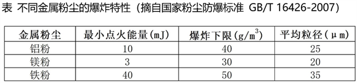
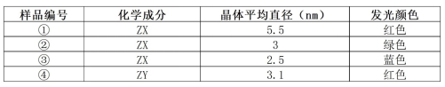

# 2026年上海市公务员录用考试《行测》题（网友回忆版）

> 常识判断 · 20 题 · 上海 2026

## 第 1 题　qid 19452558 · 科技常识

2025年是《巴黎协定》达成10周年，也是提交新一轮国家自主贡献的重要节点，全球气候治理进入关键阶段，国家主席习近平宣布中国新一轮国家自主贡献，其中包括（    ）。

- **A**. 新能源汽车成为新销售车辆主流，全国碳排放权交易市场覆盖所有行业
- **B**. 中国力争2030年前实现碳中和，努力争取2060年二氧化碳排放达到峰值
- **C**. 化石能源消费占能源消费总量的比重达30%以上
- **D**. 到2035年，中国全经济范围温室气体净排放量比峰值下降7%-10%　✅

**答案**：D

**官方解析**

本题考查新思想。
A、C两项错误，D项正确，2025年9月24日，习近平总书记在联合国气候变化峰会上的致辞中宣布中国新一轮国家自主贡献：到2035年，中国全经济范围温室气体净排放量比峰值下降7%-10%，力争做得更好。非化石能源消费占能源消费总量的比重达到30%以上，风电和太阳能发电总装机容量达到2020年的6倍以上、力争达到36亿千瓦，森林蓄积量达到240亿立方米以上，新能源汽车成为新销售车辆的主流，全国碳排放权交易市场覆盖主要高排放行业，气候适应型社会基本建成。故A项“所有行业”表述错误，应为“主要高排放行业”，C项“化石能源”表述错误，应为“非化石能源”。
B项错误，中国的“双碳”目标是力争2030年前二氧化碳排放达到峰值，努力争取2060年前实现碳中和。
故正确答案为D。

---

## 第 2 题　qid 19452585 · 科技常识

2025年3月，中国科学院脑科科学与智能技术卓越创新中心联合复旦大学附属华山医院与相关企业开展了侵入式脑机接口的前瞻性临床实验，受试者可以借助脑机接口系统下象棋、玩赛车游戏，达到了跟普通人控制电脑触摸板相近的水平，这标志着我国在侵入式脑机接口技术上成为继美国之后，全球第二个进入临床实验阶段的国家。在下列选项中，属于脑机接口技术关键环节的是（    ）。

- **A**. 实时在线解码　✅
- **B**. 脑功能成像技术
- **C**. 高精度导航系统
- **D**. 语言合成系统

**答案**：A

**官方解析**

本题考查科技常识。

脑机接口的核心是实现大脑神经信号与外部设备的双向/单向转换，核心链路为：神经信号采集信号处理与解码外部设备控制/反馈。关键环节必须直接服务于“大脑信号与设备的交互”。

A项正确，神经信号采集后是混杂的电生理数据，实时在线解码是将这些原始数据快速转化为可被外部设备识别的控制指令（如下棋的落子指令、赛车的转向指令）的核心步骤。没有该环节，采集的信号无法转化为有效操作，是脑机接口技术的关键环节。

B项错误，脑功能成像（如fMRI、PET等）多用于脑功能区域定位的基础研究，其成像速度慢、设备体积大，无法满足脑机接口实时控制的需求，并非脑机接口技术的关键环节。

C项错误，高精度导航多用于外科手术定位（如植入式电极的精准植入），属于手术辅助技术，而非脑机接口技术的关键环节。

D项错误，语言合成系统是外部反馈/输出设备的一种（如将神经信号转化为语音），仅用于特定场景的结果呈现，并非脑机接口技术的关键环节。

故正确答案为A。

---

## 第 3 题　qid 17056429 · 科技常识

烈日炎炎的夏天，除了空调是解暑利器外，无叶片电风扇也成为不少家庭的选择，风力大、噪音小又安全。无叶片电风扇通过底座吸入空气，并从圆环缝隙高速喷出，形成气流。下列关于该风扇工作原理的物理描述，错误的是（    ）。

- **A**. 空气从圆环缝隙喷出时，流速增大导致压强减小，周围空气被“吸入”形成气流
- **B**. 底座电机驱动空气流动时，电能主要转化为空气的动能
- **C**. 风扇运行时圆环边缘无叶片，因此不存在空气摩擦产生的热量　✅
- **D**. 喷出的气流与周围空气混合，导致整体气流速度逐渐减小

**答案**：C

**官方解析**

无叶片电风扇利用的是喷气式飞机引擎及汽车涡轮增压中的技术，其工作原理是利用基座中的电力马达将空气通过吸风孔吸入基座内部，经由气旋加速器加速后，高速气流通过底部环形喷嘴的缝隙喷出。由于康达效应（气流在流经弯曲表面时，会倾向于跟随这个表面的形状流动，而不是继续直线前进），喷出的高速气流在环形表面的引导下，贴着圆环内侧表面快速流动，最终从圆环缝隙中高速喷出，由于其流速大于周边空气，因此根据伯努利原理，其压强比周围空气小，在压强差的驱动下，周围流速慢的空气被压向圆环区域后与高速气流一起运动，使气流量变大（风量变大），最终通过出风口吹出。
A项：由上述分析可知，空气从圆环缝隙喷出时流速快、压强小，而圆环缝隙周围的空气流速慢、压强大，会产生一个指向圆环缝隙的压强差，从而导致周围的空气被“吸入”形成气流，正确；
B项：由上述分析可知，底座电机（电力马达）驱动空气流动的目的是使空气的流速变大，因此电能主要转化为空气的动能，正确；
C项：在高速气流中，由于流体内部不同速度层之间存在相对运动，会产生粘性力，即摩擦力。由上述分析可知，喷出的高速气流与周围空气的流速不一致，且高速气流带动周围空气一起运动，因此二者之间存在摩擦力，由于摩擦会产生热量，故存在空气摩擦产生的热量，错误；
D项：由C项分析可知，喷出的高速气流与周围空气混合后，由于二者之间流速不一致，存在摩擦力，导致气体的动能减小，故整体气流速度逐渐减小，正确。
本题为选非题，故正确答案为C。

---

## 第 4 题　qid 17056438 · 科技常识

小明打算去体验滑雪，要购买滑雪手套。由于现在都是用触屏手机，手机屏幕分布着微弱电场，他在购买手套时选购了一款“智能触屏手套”，可在佩戴时流畅操作手机。该手套的指尖通常使用金属纤维制成，作为媒介连接手指和手机屏幕，下列关于触屏手机和触屏手套说法正确的是（    ）。

- **A**. 手套指尖部分被雪水浸湿，不会影响触屏性能
- **B**. 低温的环境会降低手套的触屏效率
- **C**. 手和屏幕之间组成微小的变压器
- **D**. 手在触屏时会干扰其表面电场分布　✅

**答案**：D

**官方解析**

电容屏手机的工作原理为：屏幕表面的导电层会形成均匀的静电场，每个触控点对应一个微小的电容（储存电荷的单元），手指未触碰屏幕时，整个屏幕处于电容平衡的状态。手指触摸屏幕时，原本的静电场被破坏，触摸点的电容值发生改变，屏幕芯片检测出电容变化的区域，从而精准定位触控位置，进而响应操作（如点击、滑动等）。
“智能触屏手套”的指尖由金属纤维制成，金属纤维是导体，手指也是导体，故金属纤维能够起到代替手指的作用。
A项：雪水是导体，当它浸湿手套指尖的金属纤维后，金属纤维的导电性能可能发生改变，还可能引入多余的电荷对静电场造成干扰，从而影响触屏性能，错误；
B项：结合题意可知，佩戴“智能触屏手套”时可流畅操作手机，该手套在滑雪场使用，而滑雪场的温度相对较低，因此低温的环境不会降低手套的触屏效率，错误；
C项：手和屏幕之间组成微小的电容器，并非变压器，错误；
D项：电容屏手机的工作原理就是“手（导体）接触屏幕时干扰屏幕表面的静电场分布”，正确。
故正确答案为D。

---

## 第 5 题　qid 17056432 · 科技常识

近期流行“撕拉照片”晒图热潮，这类照片（如宝丽来相纸）使用多层复合胶片材料制成，其中有感光层和显影层，拍摄时光线照射在胶片上，激发感光颗粒（如卤化银）发生化学反应，记录图像。随后胶片从相机中被拉出，同时胶片中隐藏的显影液被挤出，与潜影发生显影反应，最终成像。该类胶片通常在多层涂布结构中加入染料、保护层等材料，成像过程可能伴随热量变化，照片撕开时，还需克服层间分子间作用力。在这一系列过程中，下列关于其原理的说法，错误的是（    ）。

- **A**. 胶片曝光时，光信号使卤化银颗粒发生光化学反应，体现光的能量性
- **B**. 拉出胶片时，显影液扩散过程中，由于分子热运动强会主动吸收热量并导致环境降温　✅
- **C**. 成像过程中，胶片温度升高可能是化学反应的放热导致
- **D**. 可见光透过胶片时发生折射，使图像呈现不同色彩

**答案**：B

**官方解析**

A项：胶片曝光时，卤化银在光照条件下发生分解反应，该反应需要光能作为能量来源，因此光信号使卤化银颗粒发生光化学反应，体现光的能量性，正确；
B项：分子热运动的剧烈程度反映物体温度的高低，若物体的分子热运动强，说明其温度高，则更有可能对外释放能量，让周围环境升温，错误；
C项：成像过程中显影液与潜影发生显影反应，显影反应是化学反应，可能放热，因此胶片温度升高可能是该化学反应的放热导致的，正确；
D项：当光从一种介质斜射入另一种介质时，光就会发生折射，胶片属于透明介质，可见光斜射入胶片时会发生折射。由于可见光是复色光，由红、橙、黄、绿、蓝、靛、紫七种颜色的光组成，不同颜色光在介质中的折射率不同，因此当可见光透过胶片时发生折射时，不同颜色光的偏折程度会不同，使图像呈现不同色彩，正确。
本题为选非题，故正确答案为B。

---

## 第 6 题　qid 17056437 · 科技常识

在新能源汽车技术展中，一家厂商展示了其新型锂电池，宣称能在15分钟内充入80%的电量。研究人员在实验中对该电池的快速充电过程进行了分析，发现以下现象：快充时电池温度升高幅度较小，说明能量损耗不大；扫描电子显微镜观察表示，锂离子在电解溶液中的分布较均匀；改变充电电流密度后，锂离子在电解液中的运动速度变化显著，充电时间也随之改变，基于以上实验观察，可以合理推断该电池快速充电性能的核心优势最可能得益于下列物理因素（    ）。

- **A**. 电池外壳具有优异的热绝缘性能，有效抑制能量损耗
- **B**. 锂离子能在电解液中迅速迁移，提高电荷传输效率　✅
- **C**. 正负极材料颜色不变，显示其稳定性良好
- **D**. 电池结构可有效屏蔽电磁辐射，避免外部干扰

**答案**：B

**官方解析**

A项：题干仅说明快充时电池温度升高幅度小是因为能量损耗小，但未提及电池外壳的热绝缘性能相关内容，无法作为推断依据，错误；
B项：根据题干信息“改变充电电流密度后，锂离子在电解液中的运动速度变化显著，充电时间也随之改变”可知，锂离子在电解液中的迁移速度会决定电荷传输效率，迁移越快，充电完成得就越快，正确；
C项：题干中未提及正负极材料颜色相关内容，属于无关信息，无法作为推断依据，错误；
D项：题干中未提及电池结构和屏蔽电磁辐射、避免外部干扰的相关内容，属于无关信息，无法作为推断依据，错误。
故正确答案为B。

---

## 第 7 题　qid 17056430 · 科技常识

聚丙烯（PP）是制造医用外科口罩的核心材料，为了实现最佳防护效果和佩戴体验，口罩通常由多层不同功能的改性PP材料复合而成，以下是三种经过特殊改性的聚丙烯无纺布材料：
材料A：添加了广谱抗菌剂，能持续抑制微生物增殖，经特殊处理，对液态水有较强排斥性
材料B：由超细纤维（直径约1-5微米）构成疏松网状结构，对微米、亚微米级颗粒具有极高拦截效率
材料C：混入柔性聚合物，显著提升拉伸回弹性，对水蒸气有良好透过性
现在需要将这些材料组合起来，制造一种高性能口罩，从外到内的正确组合方式是（    ）。

- **A**. 材料C材料A材料B
- **B**. 材料A材料B材料C　✅
- **C**. 材料B材料C材料A
- **D**. 材料B材料A材料C

**答案**：B

**官方解析**

医用外科口罩是医务人员的基本防护用品，可以阻隔血液、体液、飞溅物以及大部分细菌和病毒，能防止医务人员被感染，同时也可以防止医务人员呼气中携带的微生物直接排出。
因此口罩最外层为阻隔血液、飞沫等液体物质的感染，应选择具有抗菌性能，且对液态水具有较强排斥性的材料A；中间层要同时阻隔外界微生物的进入和呼出气体中微生物的直接排出，应选择具有极高拦截效率的材料B；最内层要与面部皮肤贴合且保持呼吸的通畅，应选择拉伸回弹性能良好且水蒸气透过性良好的材料C。
综上所述，从外到内的正确组合方式是：材料A材料B材料C。
故正确答案为B。

---

## 第 8 题　qid 12868072 · 科技常识

某化工厂储存并加工金属粉末，曾发生过一次粉尘爆炸事故。为了预防再次发生事故，技术人员对车间环境进行了检测，检测结果显示车间空气中主要为铝粉，平均浓度为，平均粒径为，相对湿度为25%。

已知条件：

①生产设备外壳与地面绝缘，操作中测得静电电压可达5kV。设备接地可有效消除静电积聚，使静电能量降低至1mJ以下。

②湿度每增加10%，可使金属粉尘的最小点火能量提高约20%。

③粉尘粒径越小，表面积越大，越易被点燃，且爆炸强度可能更高。

根据检测结果，结合上表和已知条件信息制定了改进措施，其中最合理的是<u>        </u>。

- **A**. 
将相对湿度提高到55%以上，并增加接地导线消除静电积聚
　✅
- **B**. 
将平均粒径调整到

- **C**. 
增加通风换气，使空气中铝粉浓度降低到左右

- **D**. 
车间下一段时间安排加工铁粉

**答案**：A

**官方解析**

A项：将相对湿度从25%提高到55%以上，相对湿度提高了30个百分点以上，根据已知条件②可知，可使金属粉尘的最小点火能量提高60%以上，根据表格内容可知，铝粉的最小点火能量为10mJ，那么相对湿度提升后，铝粉的最小点火能量不低于16mJ。根据已知条件①可知，设备接地后可有效消除静电积聚，使静电能量降低至1mJ以下，此时静电能量远小于铝粉的最小点火能量，可以有效防止爆炸事故发生，正确；

B项：将平均粒径从调整到，根据已知条件③可知，铝粉更难被点燃，且爆炸强度可能更低，但是此时铝粉的平均浓度为，高于铝粉的爆炸下限，且静电积聚未消除，仍有爆炸的可能，因此无法有效防止爆炸事故发生，错误；

C项：铝粉的爆炸下限为，将铝粉的浓度从降低到左右，铝粉的浓度仍在爆炸下限附近，且静电积聚未消除，仍有爆炸的可能，因此无法有效防止爆炸事故发生，错误；

D项：车间下一时段安排加工铁粉，可以避免空气中铝粉浓度的进一步增加，但是原有的铝粉仍然存在，相关的静电积聚等引爆因素也仍然存在，未解决原铝粉加工的爆炸风险问题，错误。

故正确答案为A。

---

## 第 9 题　qid 17056442 · 科技常识

点击化学获取2022年诺贝尔化学奖，点击化学以高效、精准的分子拼接为核心特点，其典型反应通常具有这些特征：无需苛刻的高温高压；多数无需金属催化剂或仅需简单催化剂；产物结构专一，副产物少且无害，反应过程中不会产生无关气体干扰体系。下列描述案例中，不符合点击化学反应特征的是（    ）。

- **A**. 
在细胞成像研究中，将相关原料放在水/乙醇混合液中，加入/抗坏血酸体系后，可专一生成用于体外成像的探针

- **B**. 
给活细胞表面标记时，直接将相关原料混合，无需金属催化，且反应不产生气体，能顺利完成标记

- **C**. 
在小鼠的体内预靶向成像中，探针可快速捕获抗体，该反应无需金属参与，且常释放，可用于体内快速配对
　✅
- **D**. 
材料化学中相关原材料通过反应偶联，高效生成环，用于材料表面功能化

**答案**：C

**官方解析**

由题干可知，点击化学以高效、精准的分子拼接为核心特点，具有无需苛刻的高温高压；多数无需金属催化或仅需简单催化剂；产物结构专一，副产物少且无害，反应过程中不会产生无关气体干扰体系等特征。

A项：“相关原料在水/乙醇混合液中反应”“加入/抗坏血酸体系”“专一生成用于体外成像的探针”分别符合点击化学“无需苛刻的高温高压”“仅需简单催化剂”“产物结构专一”的特征，正确；

B项：“直接将相关原料混合”“无需金属催化”“反应不产生气体”分别符合点击化学“无需苛刻的高温高压”“无需金属催化”“反应过程中不会产生无关气体干扰体系”的特征，正确；

C项：“反应无需金属参与”符合点击化学“无需金属催化”的特征，但“常释放”（反应时释放，可能产生气泡干扰成像，导致成像失败等）与点击化学“反应过程中不会产生无关气体干扰体系”的特征不符，错误；

D项：“相关原材料通过反应偶联，高效生成环，用于材料表面功能化”符合点击化学“高效、精准的分子拼接为核心特点”的特征，正确。

本题为选非题，故正确答案为C。

---

## 第 10 题　qid 12868074 · 科技常识

某研究团队致力于开发新一代显示技术。他们发现，一些半导体纳米晶体（又称“量子点”）在特定条件下可以发光。其颜色与晶体尺寸有关。这一现象可类比于乐器，弦越短，发出的音调越高（频率高，波长短）。在量子点中，晶体尺寸越小，电子活动受限越强，发光能量越高。该团队用两种在元素周期表中位于同主族的元素X和Y，分别与元素Z化合，制备了两种化学成分不同，但结构相似的量子点（ZX和ZY），并测量了他们在不同尺寸下的发光颜色。部分数据如下表：

基于以上信息，下列为实现“精确显示黄光”这一目标的最合理的技术路径<u>        </u>。

- **A**. 选择化学成分为ZX的量子点，将其晶体尺寸控制在3.0-5.5nm之间　✅
- **B**. 选择化学成分为ZY的量子点，将其晶体尺寸增大至5.0nm
- **C**. 将样品②和样品①的粉末均匀混合使用
- **D**. 改用与X，Y相同主族且原子序数更小的元素W来合成量子点ZW

**答案**：A

**官方解析**

A项：根据表格内容可知，化学成分为ZX的量子点，晶体尺寸为5.5nm时，发红光，晶体尺寸为3nm时，发绿光。根据题意，在量子点中，晶体尺寸越小，发光能量越高，又因为七色光的频率和能量从低到高顺序为红、橙、黄、绿、蓝、靛、紫，所以ZX量子点的晶体尺寸从5.5nm减小到3nm的过程中，发光颜色会从红色变为橙色，再变为黄色，最终变为绿色。因此将ZX量子点的晶体尺寸控制在3.0-5.5nm之间合适的值，就可以精准获得黄光，正确；
B项：根据表格内容可知，化学成分为ZY的量子点，晶体尺寸为3.1nm时，发红光。由于晶体尺寸越大，发光能量越低，即光的频率越低，而黄光的频率比红光高，因此ZY量子点的晶体尺寸增大至5.0nm无法让其发出黄光，错误；
C项：将样品①和样品②的粉末均匀混合使用，两种粉末会分别发出绿光和红光，此时显示的光为绿光和红光组成的复色光，虽然通过红绿光混合比例的调整，在人眼视觉上该光的颜色可以接近黄光，但是该光本质上并不是黄光，因此无法实现精确显示黄光，错误；
D项：改用原子序数更小的元素W合成的量子点ZW，由于晶体尺寸未知，发光的颜色无法确定，因此无法保证精确显示黄光，错误。
故正确答案为A。

---

## 第 11 题　qid 17056436 · 科技常识

红外热像仪是军事储备与反侦察的关键设备。它利用所有物体均会发射红外线（黑体辐射）这一特性，通过探测物体自身辐射的红外线实现成像为夜间作战和复杂环境下的侦察提供了巨大便利，成为战场上的“黑夜之眼”，然而，随着红外热像仪的广泛应用，反侦察手段也层出不穷，以下关于红外热像仪与反侦察手段的物理原理，错误的是（    ）。

- **A**. 红外热像仪的成像原理，基于所有物体均会发射红外线（黑体辐射）
- **B**. 人体体温稳定，因此，其发射的红外线，强度始终不变　✅
- **C**. 利用高温物体（如燃烧的火堆）干扰红外探测，是因为其红外线辐射强于人体
- **D**. 穿着特殊材料（如铝箔）制成的伪装服，可通过其反射红外线，降低自身辐射强度

**答案**：B

**官方解析**

A项：所有温度高于绝对零度（）的物体都会持续向外辐射红外线，温度越高，辐射的红外线强度越强，红外热像仪通过探测这些红外线来生成图像，正确；

B项：人体正常体温一般为~，并且体温受年龄、活动、昼夜节律等因素影响，不是一个固定的值，并且物体自身辐射强度不仅与温度有关，还与‌辐射电磁波的波长（或频率）、物体表面颜色和结构等因素都相关，因此所辐射出的红外线强度并非始终不变，错误；

C项：火堆温度远高于人体，其红外线辐射强度远强于人体，强辐射信号可掩盖人体较弱的信号，从而干扰红外探测，正确；

D项：红外热像仪依赖目标与背景在红外波段的辐射差异成像。人体一般比周围环境温度更高，释放的红外线更强，所以在画面上更亮、更显眼，容易被识别，而铝箔表面光滑、对红外线具有高反射率的特性，使得铝箔制成的伪装服能够阻挡人体向外的红外线辐射，使人体与背景的辐射差异显著降低，图像对比度下降，从而实现红外伪装，正确。

本题为选非题，故正确答案为B。

---

## 第 12 题　qid 17056434 · 科技常识

在藏族庆典活动里，藏民常用手工打造的铜碗盛水，敲击盛水铜碗，会发出独特的声响，铜碗中的水流晃动时，声音又会发生奇妙的变化。这一现象背后蕴藏着丰富的声学知识，以下原理解释正确的是（    ）。

- **A**. 声音的变化是因为水晃动改变了铜碗的材料密度
- **B**. 水的存在增大了铜碗振动系统的质量导致振动频率降低，音调变低　✅
- **C**. 声音的变化，是由于水的晃动产生次声波干扰听觉
- **D**. 铜碗表面的雕花纹路改变了声音在空气中的传播速度

**答案**：B

**官方解析**

A项：密度是物质的固有属性，铜碗以铜为主要制作材料，铜碗的密度不会因为水的晃动而发生改变，错误；

B项：音调由振动频率决定，振动频率越低，音调越低。敲击空碗时，只有铜碗振动发声，敲击盛水铜碗时，是铜碗和水一起振动发声，此时整体的质量变大，导致振动变慢，即振动频率变低，音调变低，正确；

C项：人耳只能听到振动频率在20Hz~20000Hz之间的声音（称为可闻声波），振动频率低于20Hz的声波称为次声波，水晃动产生的是可闻声波，并非次声波，并且即使产生了次声波，由于人耳无法感知，也不会干扰听觉，错误；

D项：声音的传播速度与介质的种类和温度有关，与铜碗表面的雕花纹路无关，常温下（通常指时）声音在空气中的传播速度为340m/s，错误。

故正确答案为B。

---

## 第 13 题　qid 12868073 · 科技常识

在一场元宇宙技术展示中，参观者戴上某公司研发的新型VR手套后，便能感受物体“虚拟模块”的重量和移动时的阻力感。技术人员解释，该手套使用了“量子力反馈”系统，其中关键组件之一为高灵敏度电磁模块，实验观察还发现：当使用者试图迅速移动虚拟重物时，手套施加的反向力明显增强；拆除电磁模块后，用户几乎感受不到阻力和重量变化；不同虚拟物体设置下，阻力感随“虚拟质量”变化同步调整。基于以上现象和反馈机制，以下        项推论最合理地解释该VR手套实现“虚拟重量”模拟的原理。

- **A**. 电磁模块通过控制手套温度，改变皮肤感知以模拟重量感
- **B**. 电磁系统动态调整阻力，对抗手部运动以模拟物理负载　✅
- **C**. 系统通过颜色刺激诱导大脑产生触觉错觉
- **D**. 高频电流直接作用于神经系统以传递真实的重量信号

**答案**：B

**官方解析**

A项：题干未提及“温度”相关的实验条件或现象，重量、阻力的模拟与温度变化无逻辑关联，错误；
B项：根据题干信息“拆除电磁模块后，用户几乎感受不到阻力和重量变化”可知，电磁模块是模拟虚拟重量的核心组件，系统会根据虚拟物体“质量”、手部运动速度动态调整反向阻力，从而对抗手部动作，以此模拟出真实搬东西时的物理负载感，正确；
C项：VR手套模拟的是摸东西时的重量感和阻力感，属于触觉体验。题干全程未提及“颜色”相关的实验条件或现象，重量、阻力的模拟与颜色刺激并无逻辑关联，错误；
D项：题干明确指出核心组件是高灵敏度电磁模块，作用机制是通过“反向力”实现阻力模拟，而非“高频电流直接作用于神经系统”，且“传递真实的重量信号”表述错误，虚拟重量并非真实物理信号，错误。
故正确答案为B。

---

## 第 14 题　qid 12868132 · 科技常识

小张和小李两人使用同一台生物电阻抗(BIA)体脂秤测量身体成分。已知人体水分主要以含无机盐的溶液形式存在，而脂肪组织含水极少，电阻率低，BIA技术原理是通过测量人体总电阻来反推脂肪比例。某日，小张刚结束1小时高强度运动并补充了足量水分，测得体脂率22%。已知两人实际体脂率接近（约18%）。结合所学知识，以下对测量结果差异的解释最合理的是            。

- **A**. 小张补充水分后，体内作为导体的电解质溶液总量增加，总电阻降低　✅
- **B**. 小李因脱水，体液中电解质浓度显著升高，故导电能力增强，电阻降低
- **C**. 小李因脱水，破坏了脂肪的脂键结构，释放出离子
- **D**. 测量时微电流能量较高，破坏了脂肪的脂键结构，释放出离子

**答案**：A

**官方解析**

生物电阻抗法（BIA）是利用人体组织对电流的阻抗差异进行体成分检测的技术。人体内的水分主要以电解质溶液形式存在，电解质溶液是良好的导体，因此人体内电解质溶液总量越多，人体的电阻率越低，而脂肪组织含水极少，电解质溶液含量也极低，因此脂肪组织的电阻率高。体脂秤就是通过测量人体总电阻来推算体脂率，人体的总电阻越高，体脂秤推测出的体脂率越高，人体的总电阻越低，体脂秤推测出的体脂率越低。
小张在高强度运动后补充了足量水分，这导致体内导电性良好的电解质溶液总量增加，因此体内的总电阻会降低。由于小张的总电阻降低，理想情况下，通过体脂秤测量小张的体脂率会偏低，但题干中小张测得体脂率反而偏高，应为体脂秤算法或测量模型带来的误差。
A项：小张补充水分后，体内导电性良好的电解质溶液总量增加，因此体内的总电阻会降低，正确；
B项：小李脱水时，体内电解质浓度会升高，但是电解质溶液总量减少，体内导电能力仍会减弱，即总电阻升高，错误；
C项：脱水只是人体水分丢失，不会破坏脂肪的化学键，更不会释放离子，错误；
D项：体脂秤使用的是微弱安全电流，能量极低，无法破坏脂肪的化学键，错误。
综上，只有A项表述无误，B、C、D三项皆存在错误。
故正确答案为A。

---

## 第 15 题　qid 19452589 · 科技常识

人类自古就有对理想社会的向往，下列思想家与他们对理想社会的构想匹配正确的是（    ）。

- **A**. 孔子：小国寡民
- **B**. 墨子：天下有道
- **C**. 柏拉图：新和谐公社
- **D**. 莫尔：乌托邦　✅

**答案**：D

**官方解析**

本题考查人文常识。
A项错误，孔子提出了“天下大同”的社会理想，这一构想在《礼记·礼运》中系统阐述，核心是“大道之行也，天下为公”，强调选贤与能、讲信修睦，实现社会和谐、人人各得其所。“小国寡民”是老子在《道德经》中提出的理想社会形态，核心是国家规模小、人口少，人们自给自足、安居乐业，无需复杂的制度和交流。
B项错误，墨子的理想社会核心是“兼爱”“非攻”“尚贤”“尚同”，主张人人平等相爱、反对战争、任用贤能、上下思想统一。“天下有道”出自《论语·季氏篇》，是孔子提出的政治理念，主张以周天子为核心的礼制秩序。
C项错误，柏拉图的理想社会构想是“理想国”，主张由“哲学王”统治，社会分为统治者、护卫者、生产者三个阶层，各安其位、各司其职。“新和谐公社”是19世纪空想社会主义者欧文建立的理想社会实验社区，试图通过集体劳动、共享成果实现平等和谐。
D项正确，托马斯·莫尔是文艺复兴时期的空想社会主义者，他在著作《乌托邦》中描绘了一个没有私有制、人人劳动、按需分配的理想社会，“乌托邦”也成为了理想社会的代名词。
故正确答案为D。

---

## 第 16 题　qid 19452592 · 科技常识

上海市以“一网通办、一网统管”为统领，建设全市统一的政务云、政务网、政务平台，联通近900个市、区、街道三级业务系统，实现“平台互联互通，数据共用共享”的“办事环节最简、材料最少、时限最短、费用最小、便利度最优、满意度最高”的“六最”营商环境。此举对政府治理的积极意义是（    ）。
①彰显了政府治理的精确度
②打通地域与流程壁垒，推动政务服务提质升级
③推动政务数据开放共享，实现了决策科学化
④强化政府市场监管职能，扩大行政处罚权限
⑤构建数字化服务体系，提升政务服务效率

- **A**. ①②③⑤　✅
- **B**. ②④⑤
- **C**. ②③④⑤
- **D**. ①②⑤

**答案**：A

**官方解析**

本题考查管理常识。
①正确，“一网通办、一网统管”通过统一的政务云、政务平台和数据共享，能够精准匹配企业和群众的办事需求，减少冗余环节，让政府治理从“粗放式”转向“精细化”，彰显治理精确度。
②正确，联通市、区、街道三级近900个业务系统，打破了层级、地域和部门之间的信息孤岛，原本跨区域、跨部门的复杂事项可以线上协同办理，直接推动政务服务的质量和效率升级。
③正确，政务数据的共用共享能够为政府提供全面、实时的民生和经济运行数据，帮助政府更准确地研判问题、制定政策，避免决策的盲目性，实现决策科学化。
④错误，题干核心是政务服务的数字化、便民化改革，聚焦“一网通办”的营商环境优化，并未涉及市场监管职能强化，更没有“扩大行政处罚权限”的内容。行政处罚权限由法律法规明确规定，政府改革不能随意扩大。
⑤正确，统一的政务平台和数据共享机制，构建起了数字化的政务服务体系，实现“办事环节最简、时限最短”等目标，直接提升了政务服务的效率，降低了企业和群众的办事成本。
综上，①②③⑤表述正确。
故正确答案为A。

---

## 第 17 题　qid 19452593 · 科技常识

近年来，在我国现代化产业体系建设与经济高质量发展过程中，“内卷式”竞争已经成为一个值得关注的问题。2024年中央政治局召开会议，分析研究经济形势和经济工作，首次提出“要强化行业自律，防止‘内卷式’恶性竞争”。2024年12月，中央经济工作会议进一步指出，要“综合整治‘内卷式’竞争，规范地方政府和企业行为”。这种“内卷式”竞争加剧了行业内部的资源消耗，成为当前经济发展中的一大痛点。这表明（    ）。

- **A**. “内卷”是市场经济的必然结果，行业竞争必然阻碍经济发展
- **B**. 推动高质量发展需要强化政府配置资源，加强对经济的宏观调控
- **C**. 行业竞争不利于企业创新，国民经济发展无需关注行业竞争状况
- **D**. 行业竞争存在自发性等弊端，经济发展需要转变发展方式　✅

**答案**：D

**官方解析**

本题考查经济常识。
A项错误，“内卷式”竞争并非市场经济的必然结果，正常的市场竞争能够激发企业活力、推动技术进步，会促进经济发展；只有无序、低效的“内卷式”竞争才会加剧资源消耗，成为经济发展痛点。
B项错误，社会主义市场经济体制强调市场在资源配置中起决定性作用，更好发挥政府作用。题干中“综合整治‘内卷式’竞争”是政府履行宏观调控职能的体现，但并非“强化政府配置资源”，这一表述违背了市场经济的核心原则。
C项错误，合理的行业竞争是企业创新的重要动力，能够倒逼企业提升技术水平和产品质量。“国民经济发展无需关注行业竞争状况”的说法完全错误，经济发展恰恰需要规范竞争秩序，引导竞争走向良性轨道。
D项正确，“内卷式”竞争的出现，本质上反映了市场竞争存在自发性弊端，部分市场主体为了短期利益盲目同质化竞争、过度消耗资源，而非通过创新实现差异化发展。题干强调整治这类竞争，正是为了推动经济发展方式从粗放式、同质化向高质量、差异化转变。
故正确答案为D。

---

## 第 18 题　qid 19452598 · 科技常识

古人说：“法非从天下，非从地出，发于人间，合乎人心而已。”“法不察民之情而立之，则不成。”马克思说：“只有当法律是人民意志的自觉表现，因而是同人民的意志一起产生并由人民的意志所创立的时候，才会有确实的把握。”这说明（    ）。

- **A**. 宪法的作用在于维护广大人民群众的根本利益
- **B**. 宪法的生命在于实施，宪法的权威也在于实施
- **C**. 宪法的根基在于人民发自内心的拥护　✅
- **D**. 宪法的宣传教育在于落实普法责任制

**答案**：C

**官方解析**

本题考查法律常识。
“法非从天下，非从地出，发于人间，合乎人心而已”出自战国时期法家代表人物慎到所著的《慎子・逸文》，意为法并非源于天或地的自然生成，而是产生于人类社会，且必须符合民众的意愿与利益。“法不察民之情而立之，则不成”出自战国时期商鞅及其后学所著的《商君书・壹言》，意为法律若不体察民众的实际情况与意愿就贸然制定，必然难以施行并取得成效。马克思的论述进一步指出，法律是人民意志的自觉表现。因此，题干三句话共同强调法律源于人民意志、合乎人民需求，法律的制定与实施必须立足民心、反映民意，核心即法律的生命力必须根植于人民的认同与拥护。
A项错误，强调宪法的作用，并非题干强调的宪法（法律）的本源和民意基础。
B项错误，侧重于宪法实施的重要性，并非题干强调的法与人民的联系。
C项正确，强调宪法的根基在于人民发自内心的拥护，人民的内心拥护是宪法得以存在、实施的根本根基，与题干强调的“民意是法律之本”的核心一致。
D项错误，强调宪法的宣传教育是落实普法责任制的手段，与题干无关。
故正确答案为C。

---

## 第 19 题　qid 19452595 · 科技常识

近年来，青海海南州在荒漠化土地上发展清洁能源，建设大量光伏板利用太阳能资源，同时创新发展“板下经济”，在光伏板下发展畜牧业，探索出“牧光互补”模式，为青海高原乃至世界同类地区提供了可持续发展的有益借鉴。上述材料启示我们（    ）。

- **A**. 自然界的存在和发展是客观的，具有物质性
- **B**. 要把握事物的固有联系，建立新的联系　✅
- **C**. 科技进步使物质世界变化依赖于人的意识
- **D**. 人们能够在一定程度上改变并利用自然规律

**答案**：B

**官方解析**

本题考查马克思主义。
A项错误，物质是不依赖于人类的意识而存在，并能为人类的意识所反映的客观实在。自然界具有物质性，其存在发展是客观的。题干重点不是强调自然界本身的客观性，而是强调人如何利用客观条件建立新联系，故该选项与题干启示不符。
B项正确，联系是指事物之间以及事物内部诸要素之间的相互影响、相互作用和相互制约。联系的客观性是指事物之间的相互联系是事物本身所固有的，是不以人的意志为转移的，不能用主观臆造的联系代替客观的、真实的联系。但人可以把握事物的固有联系，根据事物的固有属性建立新的具体联系。海南州抓住荒漠化土地、太阳能、畜牧业的固有条件，创新“牧光互补”模式，正是这一原理的典型应用。
C项错误，物质决定意识，意识是客观存在在人脑中的映象。科技进步只是人认识和改造世界的手段，不会使物质世界的变化依赖于人的意识，故该选项违背唯物主义基本原理。
D项错误，规律具有客观性，规律是运动着的事物本身所固有的，是不以任何人的意志为转移的。人们不能任意地创造或消灭规律，也不能任意地改变规律，故该选项“改变自然规律”的表述错误。
故正确答案为B。

---

## 第 20 题　qid 19452594 · 科技常识

“十四五”期间，我国算力产业发展迅速，基础设施规模和水平位居全球前列，智能算力规模达788EFLOPS（每秒百亿亿次浮点运算，FP16半精度），千兆400G端口数量增至14060个，存力总规模超过1680EB。2025年智能算力规模增速预计超40%，半导体算力芯片进入国家体系，AI大模型、自动驾驶等领域应用依托算力发展迅速落地，半导体算力芯片成为核心热点主题，产业生态不断完善，吸引大量资本投入与企业布局。这表明（    ）。
①创新能推动产业结构优化，助力经济高质量发展
②科技创新是引领发展的第一动力
③国家通过产业政策促进产业结构优化升级
④新产业的发展能够带动上下游产业及相关产业的发展

- **A**. ①②③
- **B**. ①②④　✅
- **C**. ①③④
- **D**. ②③④

**答案**：B

**官方解析**

本题考查新思想。
①正确，题干中提到“算力产业发展迅速”“智能算力规模达788EFLOPS”“AI大模型、自动驾驶等领域应用依托算力发展迅速落地”。算力是技术创新的产物，它的应用落地直接推动了AI、自动驾驶等新兴产业的发展，这些产业属于高端产业结构。因此，这体现了创新（算力技术）推动了产业结构优化和高质量发展。
②正确，题干的核心主题是“算力”这一高科技领域的发展。算力是“数字经济的核心要素”，其快速发展（特别是半导体算力芯片、大模型）带动了整个产业链。这充分说明了科技创新在当前经济发展中的核心驱动作用。
③错误，题干仅呈现产业发展成果和市场反应，无任何国家产业政策干预的相关表述，该观点在题干中无依据。
④正确，题干指出“算力产业生态不断完善，吸引大量资本投入与企业布局”。算力作为“新产业”，其发展直接带动了上游的芯片、服务器制造，以及下游的AI应用、自动驾驶等领域的繁荣，形成了完整的产业链生态，带动了上下游企业及相关产业的发展。
故①②④表述正确。
故正确答案为B。

---
