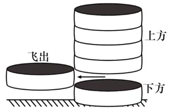
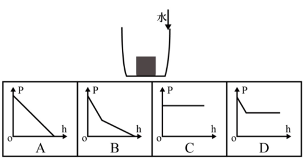
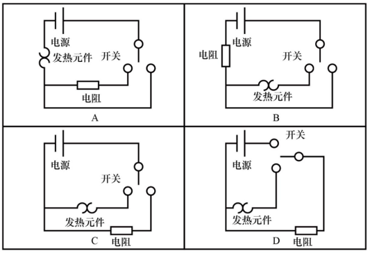
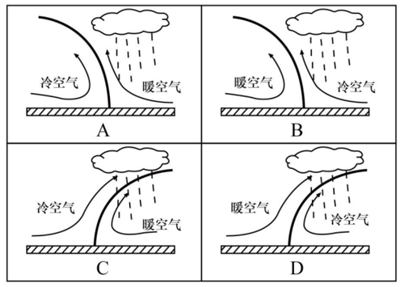
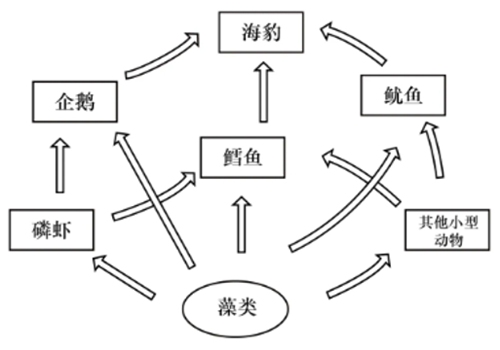

# 2026年广东省公务员录用考试《行测》题（网友回忆版）

> 常识判断 · 10 题 · 广东 2026

## 第 1 题　qid 12019712 · 人文常识

科学制定和接续实施五年规划，是我们党治国理政一条重要经验。下列有关五年规划（计划）的表述，正确的是（    ）。

- **A**. 2024年是“十四五”规划收官之年
- **B**. 1949年起，我国实施第一个五年计划
- **C**. 从“十三五”开始，“五年计划”更名为“五年规划”
- **D**. 一以贯之的主题是把我国建设成为社会主义现代化国家　✅

**答案**：D

**官方解析**

本题考查人文常识。
A项错误，“十四五”规划是我国在2021年至2025年期间的国民经济和社会发展战略，故2025年是“十四五”规划的收官之年。
B、C两项错误，五年规划，全称为中华人民共和国国民经济和社会发展五年规划纲要，是中国国民经济计划的重要部分，属长期计划。中国从1953年开始制定实施第一个“五年计划”。从“十一五”起，“五年计划”改为“五年规划”。故B项中“1949年”表述有误，应为“1953年”；C项中“十三五”表述有误，应为“十一五”。
D项正确，2020年10月29日，习近平总书记在党的十九届五中全会第二次全体会议上的讲话中指出：“从第一个五年计划到第十四个五年规划，一以贯之的主题是把我国建设成为社会主义现代化国家。”
故正确答案为D。

---

## 第 2 题　qid 12019715 · 人文常识

“十四五”时期，我国经济社会发展取得了非凡成就。下列有关“十四五”时期我国取得的成就，说法不准确的是（    ）。

- **A**. 建成了全球数量最多的5G基站
- **B**. 成为全球“增绿”最多最快的国家
- **C**. 拥有世界上规模最大的高等收入群体　✅
- **D**. 制造业增加值连续15年稳居世界第一

**答案**：C

**官方解析**

本题考查科技常识。
2025年7月9日，国务院新闻办公室举行“高质量完成‘十四五’规划”系列主题新闻发布会。
A、D两项正确，C项错误，国家发展改革委主任郑栅洁在发布会上表示，中国还是全球第一制造业大国、第一货物贸易大国、第一外汇储备大国、第一能源生产大国、第一人力资源大国，拥有世界上规模最大的中等收入群体、社会保障体系，建成了全球数量最多的5G基站······我国连续15年稳坐全球制造业“头把交椅”，200多种主要工业品产量世界第一，中国不能造的越来越少、能造的越来越好。故选项“拥有世界上规模最大的高等收入群体”说法错误，应是“拥有世界上规模最大的中等收入群体”
B项正确，国家发展改革委主任郑栅洁在发布会上表示，绿水青山就是金山银山理念深入人心，绿色已经成为当代中国的鲜明底色，这五年的成效集中体现在增绿、治污、用能、循环四个方面。“增绿”全球最多，森林覆盖率提高到25%以上，新增森林面积相当于1个陕西省的面积，贡献了全球新增绿化面积的四分之一。
本题为选非题，故正确答案为C。

---

## 第 3 题　qid 12019716 · 人文常识

近年来，港珠澳大桥、深中通道等粤港澳大湾区跨江跨海通道相继开通，推动形成大湾区“路相连、人相通、心相融”的融合面貌。关于粤港澳大湾区跨江跨海通道，以下说法有误的是（    ）。

- **A**. 黄茅海大桥是珠江口首座跨江大桥　✅
- **B**. 港珠澳大桥是连接粤港澳三地的超大型跨海交通工程
- **C**. 虎门大桥是中国自行设计建造的第一座特大型悬索桥
- **D**. 深中通道是集“桥、岛、隧、水下互通”为一体的跨海集群工程

**答案**：A

**官方解析**

本题考查地理国情。
A项错误，C项正确，珠江口首座跨江大桥是虎门大桥，而非黄茅海大桥。黄茅海大桥是连接珠海与江门的跨海通道，于2024年通车，是大湾区西部重要交通枢纽。虎门大桥是中国自主设计建造的首座特大型大跨度钢箱梁悬索桥，全长15.6公里，主航道跨径888米，于1997年6月9日通车。
B项正确，港珠澳大桥是连接中国香港、广东珠海和中国澳门的一项横跨珠江口伶仃洋海域的超大型跨海交通工程。港珠澳大桥东起香港国际机场附近的香港口岸人工岛，向西横跨南海伶仃洋水域接珠海和澳门人工岛，止于珠海洪湾立交。桥隧全长55千米，其中主桥29.6千米、香港口岸至珠澳口岸41.6千米。
D项正确，深中通道集桥梁、人工岛、海底隧道、水下互通（“桥、岛、隧、水下互通”）于一体，是目前世界上技术难度最高的跨海集群工程之一，首次在超宽、超深、强台风海域建设的沉管隧道，攻克“深海无作业面对接”等技术难题。2024年6月30日全线通车。
本题为选非题，故正确答案为A。

---

## 第 4 题　qid 12019718 · 法律常识

根据《中华人民共和国国歌法》，中华人民共和国国歌是中华人民共和国的象征和标志。一切公民和组织都应当尊重国歌，维护国歌的尊严。下列场合对国歌的使用，违反我国国歌法的是（    ）。

- **A**. 某小学每周举行升国旗仪式时奏唱国歌
- **B**. 某省级重大综合体育赛事开幕式奏唱国歌
- **C**. 某市中心广场将国歌用作公共场所的背景音乐　✅
- **D**. 某市级机关举行先进工作者表彰仪式时奏唱国歌

**答案**：C

**官方解析**

本题考查法律常识。
A项正确，根据《中华人民共和国国歌法》第四条第四项规定：“在下列场合，应当奏唱国歌：（四）升国旗仪式；”因此，某小学每周举行升国旗仪式时奏唱国歌符合我国国歌法。
B项正确，根据《中华人民共和国国歌法》第四条第八项规定：“在下列场合，应当奏唱国歌：（八）重大体育赛事；”因此，某省级重大综合体育赛事开幕式奏唱国歌符合我国国歌法。
C项错误，根据《中华人民共和国国歌法》第八条规定：“国歌不得用于或者变相用于商标、商业广告，不得在私人丧事活动等不适宜的场合使用，不得作为公共场所的背景音乐等。”因此，某市中心广场将国歌用作公共场所的背景音乐违反我国国歌法。
D项正确，根据《中华人民共和国国歌法》第四条第五项规定：“在下列场合，应当奏唱国歌：（五）各级机关举行或者组织的重大庆典、表彰、纪念仪式等；”因此，某市级机关举行先进工作者表彰仪式时奏唱国歌符合我国国歌法。
本题为选非题，故正确答案为C。

---

## 第 5 题　qid 12019717 · 科技常识

党的二十届四中全会通过的《中共中央关于制定国民经济和社会发展第十五个五年规划的建议》提出“培育壮大新兴产业和未来产业”。以下不属于新兴产业的是（    ）。

- **A**. 船舶　✅
- **B**. 新材料
- **C**. 低空经济
- **D**. 航空航天

**答案**：A

**官方解析**

本题考查经济常识。
A项错误，新兴产业是以重大技术突破和重大发展需求为基础，对经济社会全局和长远发展具有引领带动作用，知识技术密集、物质资源消耗少、成长潜力大、综合效益好的先进产业。船舶业以制造加工为主，属于传统制造业。
B、C、D三项正确，2025年10月23日，二十届四中全会通过的《中共中央关于制定国民经济和社会发展第十五个五年规划的建议》中“三、建设现代化产业体系，巩固壮大实体经济根基”部分指出：“（8）培育壮大新兴产业和未来产业。着力打造新兴支柱产业······加快新能源、新材料、航空航天、低空经济等战略性新兴产业集群发展。完善产业生态，实施新技术新产品新场景大规模应用示范行动，加快新兴产业规模化发展。”
本题为选非题，故正确答案为A。

---

## 第 6 题　qid 12019720 · 科技常识

如图所示，几颗棋子叠放在一起，其中一颗突然被水平方向的外力击打，飞了出去。忽略空气阻力，则以下判断正确的有（    ）项。

①棋子飞出的一瞬间，上方棋子所受合外力为0；

②下方棋子所受的合外力始终为0；

③棋子飞出的一瞬间，上方最下面的棋子受到了向下的压力；

④在落地前，飞出去的棋子在水平方向上的速度恒定。

- **A**. 1
- **B**. 2　✅
- **C**. 3
- **D**. 4

**答案**：B

**官方解析**

①：对上方棋子整体进行受力分析可知，其受到竖直向下的重力，由于中部棋子飞出故上方整体不受支持力，所以其合外力不为0，错误；

②：由于下方棋子始终处于静止状态，故其所受合外力始终为0，正确；

③：根据①的分析可知，棋子飞出的一瞬间，上方棋子整体仅受重力作用，即将做自由落体运动，此时上方各棋子均只受重力，彼此之间没有压力或支持力的作用，故上方最下面的棋子不受向下的压力，错误；

④：飞出去的棋子在落地前，具有水平方向的初速度，且只受重力作用，故做平抛运动，将其速度分解后可知，其水平方向做匀速直线运动，速度恒定，正确。

综上所述，判断正确的有②④，共2项。

故正确答案为B。

---

## 第 7 题　qid 12019719 · 科技常识

如图所示，实心铜方块放置在容器底部，沿容器内壁往容器内加入水，直至杯中完全装满水。下列选项中，最有可能正确反映方块对容器底部压力（p）随水深（h）变化情况的是（    ）。

- **A**. A
- **B**. B
- **C**. C
- **D**. D　✅

**答案**：D

**官方解析**

由于铜的密度比水大，根据物体浮沉条件的特点可知，实心铜方块在装满水的容器中稳定时会处于沉底的状态，因此在加入水的过程中，原本静止在容器底部的方块会始终保持静止状态，不会浮起来。对方块进行受力分析，其受到竖直向下的重力G，容器底部对其竖直向上的支持力，水对其竖直向上的浮力，由于方块静止，则其处于受力平衡状态，即。

在水未完全浸没方块之前，方块排开水的体积逐渐变大，根据浮力公式：可知，其受到的浮力逐渐变大，而其受到重力G不变，根据可知，方块受到的支持力逐渐变小，根据相互作用力大小相等的特点可知，方块对容器底部的压力逐渐变小。

在水完全浸没方块之后，方块排开水的体积不变，根据浮力公式：可知，其受到的浮力不变，其受到重力G也不变，根据可知，方块受到的支持力不变，根据相互作用力大小相等的特点可知，方块对容器底部的压力不变。

综上可知，方块对容器底部的压力先减小后不变，D项正确，A、B、C三项均错误。

故正确答案为D。

---

## 第 8 题　qid 12019722 · 科技常识

某款电热毯有3个档位，由一个开关控制。其中，0档为关机，1档为低功率加热，2档为高功率加热，则以下选项最可能是该款电热毯电路示意图的是（    ）。

- **A**. A　✅
- **B**. B
- **C**. C
- **D**. D

**答案**：A

**官方解析**

家庭电路中电压U恒定，根据电功率公式可知，电阻越大，功率越小；电阻越小，功率越大。电热毯有3个档位，0档为关机，即电路断开，无电流；1档为低功率加热，即总电阻大，功率小；2档为高功率加热，即总电阻小，功率大。

A项：开关保持不动时，电路断开，无电流，为0档关机；开关接左边时，发热元件与电阻串联，根据总电阻越串越大可知，此时总电阻大，功率小，为1档低功率加热；开关接右边时，只有发热元件工作，电阻不接入电路，此时总电阻小，功率大，为2档高功率加热。符合“0档关机、1档低功率、2档高功率”的要求，正确；

B项：开关保持不动时，电路断开，无电流，为0档关机；开关接左边时，发热元件与电阻串联，根据总电阻越串越大可知，此时总电阻大，功率小，为1档低功率加热；开关接右边时，只有电阻工作，发热元件不接入电路，但电热毯的发热元件是核心发热部件，此情况不符合“发热”需求，错误；

C项：开关保持不动时，电路断开，无电流，为0档关机；开关接左边时，只有发热元件工作，电阻不接入电路，此时总电阻小，功率大，为2档高功率加热；开关接右边时，只有电阻工作，发热元件不接入电路，但电热毯的发热元件是核心发热部件，此情况不符合“发热”需求，错误；

D项：开关保持不动时，电路断开，无电流，为0档关机；开关接上边时，只有电阻工作，发热元件不接入电路，但电热毯的发热元件是核心发热部件，此情况不符合“发热”需求，错误。

故正确答案为A。

---

## 第 9 题　qid 12019721 · 科技常识

锋面雨的形成与夏季风的暖湿气流和冬季风干冷气流相遇有关，是冷暖空气交汇形成的降雨现象，主要在每年的4到5月影响我国华南地区。下列示意图最有可能正确反映锋面雨形成原理的是（    ）。

- **A**. A
- **B**. B
- **C**. C
- **D**. D　✅

**答案**：D

**官方解析**

锋面雨的形成原理：暖湿气流（夏季风）和干冷气流（冬季风）相遇时，暖湿气流被迫沿锋面（冷暖气流的交界面）缓慢上升，冷却液化形成雨滴。
由于冷空气密度大，暖空气密度小，当两者相遇时，冷空气位于锋面的下方，暖空气位于锋面的上方，B、C两项错误；锋面雨的形成地点是冷暖气团交汇的“锋面”区域，A项错误，D项正确。
故正确答案为D。

---

## 第 10 题　qid 12019723 · 科技常识

下图为海洋生态系统中部分生物之间的捕食关系，则以下有关说法正确的是（    ）。

- **A**. 磷虾大量减少会对该系统产生毁灭性的影响
- **B**. 该食物网中包括了生产者、消费者以及分解者
- **C**. 图中最短的食物链有3个营养级　✅
- **D**. 该食物网共涉及6条食物链

**答案**：C

**官方解析**

由图可知，该食物网中的食物链有“藻类企鹅海豹”、“藻类磷虾企鹅海豹”、“藻类鳕鱼海豹”、“藻类磷虾鳕鱼海豹”、“藻类鱿鱼海豹”、“藻类其他小型动物鱿鱼海豹”、“藻类其他小型动物鳕鱼海豹”，共计7条食物链。

A项：生态系统具有自我调节能力，这是生态系统稳定性的基础，通常来说，生态系统中的生物多样性越丰富，其形成的食物链和食物网越复杂，该生态系统的自我调节能力和稳定性越强，越不容易被破坏。由上述分析可知，该食物网有7条食物链，且生物丰富多样，若磷虾大量减少，则只会影响“藻类磷虾企鹅海豹”和“藻类磷虾鳕鱼海豹”2条食物链，仍有5条食物链可以正常运行，即该生态系统的自我调节能力和稳定性较强，不容易被破坏，因此磷虾大量减少不会对该系统产生毁灭性的影响，错误；

B项：食物网由食物链组成，而食物链只包括生产者和消费者，不包括分解者，错误；

C项：由上述分析可知，图中最短的食物链为“藻类企鹅海豹”、“藻类鳕鱼海豹”和“藻类鱿鱼海豹”，均只有3个营养级，正确；

D项：由上述分析可知，该食物网共涉及7条食物链，错误。

故正确答案为C。

---
