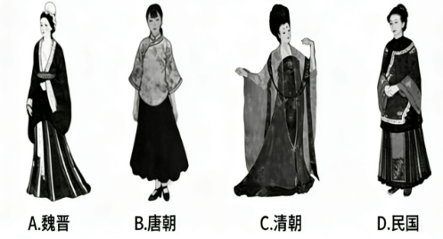
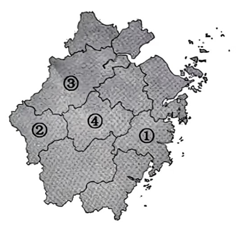

# 2026年浙江省公务员录用考试《行测》题（A类）（网友回忆版）

> 常识判断 · 9 题 · 浙江 2026

## 第 1 题　qid 18643859 · 地理国情

2025年是中国人民抗日战争暨世界反法西斯战争胜利80周年。下列有关表述，正确的有几项？
①抗日战争是中国近代以来抗击外敌入侵第一次取得完全胜利的民族解放战争，为拯救人类文明、保卫世界和平作出了重大贡献
②中华民族是不畏强暴、自立自强的伟大民族，中国人民解放军始终是党和人民完全可以信赖的英雄部队
③抗日战争时期，我国涌现出大量优秀文艺作品，其中包括田汉作词、聂耳作曲的《黄河大合唱》
④1945年9月2日，日本签署投降书，宣告日本无条件投降，并切实履行《波茨坦公告》，无条件将日本侵占的中国领土，包括台湾、澎湖列岛等归还中国

- **A**. 1
- **B**. 2
- **C**. 3　✅
- **D**. 4

**答案**：C

**官方解析**

本题考查毛中特。
①正确，2020年9月3日，习近平总书记在纪念中国人民抗日战争暨世界反法西斯战争胜利75周年座谈会上讲话指出：“这（中国人民抗日战争）是近代以来中国人民反抗外敌入侵持续时间最长、规模最大、牺牲最多的民族解放斗争，也是第一次取得完全胜利的民族解放斗争。”2025年9月3日，习近平总书记在纪念中国人民抗日战争暨世界反法西斯战争胜利80周年大会上的讲话中指出：“中国人民抗日战争是世界反法西斯战争的重要组成部分，中国人民以巨大的民族牺牲，为拯救人类文明、保卫世界和平作出了重大贡献。”
②正确，2025年9月3日，习近平总书记在纪念中国人民抗日战争暨世界反法西斯战争胜利80周年大会上的讲话中指出：“中华民族是不畏强暴、自立自强的伟大民族。当年，面对正义与邪恶、光明与黑暗、进步与反动的生死较量，中国人民同仇敌忾、奋起反抗，为国家生存而战，为民族复兴而战，为人类正义而战······中国人民解放军始终是党和人民完全可以信赖的英雄部队。全军将士要忠实履行神圣职责，加快建设世界一流军队，坚决维护国家主权、统一、领土完整，为实现中华民族伟大复兴提供战略支撑，为世界和平与发展作出更大贡献！”
③错误，《黄河大合唱》由诗人光未然（张光年）和作曲家冼星海于1939年在延安创作，以黄河为背景，展现了中华民族抗日救亡的壮丽画卷。由田汉作词，聂耳作曲的是《义勇军进行曲》，诞生于1935年。
④正确，1945年9月2日，日本签署《日本投降书》，投降书全文共八条，宣告日本无条件投降，并切实履行《波茨坦公告》之条款，无条件将日本侵占的中国领土，包括台湾、澎湖列岛等归还中国。
综上，①②④表述正确，共3项。
故正确答案为C。

---

## 第 2 题　qid 18643869 · 法律常识

2025年6月27日，《反不正当竞争法》由第十四届全国人民代表大会常务委员会第十六次会议修订通过，自2025年10月15日起施行。下列未涉嫌不正当竞争行为的是：

- **A**. 某工厂为吸引采购商购买其产品，向采购商负责人支付佣金
- **B**. 某购物平台为吸引人气，强制要求入驻商家以低于成本的价格销售商品
- **C**. 某网店擅自将其他公司未注册的驰名商标设置为自家商品的搜索关键词
- **D**. 某公司经理王某冒充保洁进入竞争对手公司纵火，使其遭受巨额财产损失　✅

**答案**：D

**官方解析**

本题考查法律常识。
A项错误，根据《中华人民共和国反不正当竞争法》第八条第三款规定：“经营者在交易活动中，可以以明示方式向交易相对方支付折扣，或者向中间人支付佣金。经营者向交易相对方支付折扣、向中间人支付佣金的，应当如实入账。接受折扣、佣金的经营者也应当如实入账。”因此，某工厂为吸引采购商购买其产品，向采购商负责人支付佣金，涉嫌不正当竞争行为。
B项错误，根据《中华人民共和国反不正当竞争法》第十四条规定：“平台经营者不得强制或者变相强制平台内经营者按照其定价规则，以低于成本的价格销售商品，扰乱市场竞争秩序。”因此，某购物平台为吸引人气，强制要求入驻商家以低于成本的价格销售商品，涉嫌不正当竞争行为。
C项错误，根据《中华人民共和国反不正当竞争法》第七条第二款规定：“擅自将他人注册商标、未注册的驰名商标作为企业名称中的字号使用，或者将他人商品名称、企业名称（包括简称、字号等）、注册商标、未注册的驰名商标等设置为搜索关键词，引人误认为是他人商品或者与他人存在特定联系的，属于前款规定的混淆行为。”因此，某网店擅自将其他公司未注册的驰名商标设置为自家商品的搜索关键词，涉嫌不正当竞争行为。
D项正确，根据《中华人民共和国反不正当竞争法》第二条第一、二款规定：“经营者在生产经营活动中，应当遵循自愿、平等、公平、诚信的原则，遵守法律和商业道德，公平参与市场竞争。本法所称的不正当竞争行为，是指经营者在生产经营活动中，违反本法规定，扰乱市场竞争秩序，损害其他经营者或者消费者的合法权益的行为。”不正当竞争行为是经营者在生产经营中违反公平、诚信原则和商业道德，以虚假宣传、商业贿赂等手段扰乱市场竞争秩序的行为，而王某纵火是故意损害他人财物的行为，不属于法律规定的不正当竞争行为。
故正确答案为D。
备注：本题A项，某工厂为吸引采购商购买其产品，向采购商负责人支付佣金，是否构成不正当竞争行为，还需要考虑支付佣金时是否将该佣金如实入账。若佣金如实入账，则不构成不正当竞争行为；如佣金未如实入账，则构成不正当竞争行为。由于A项并未表明是否如实入账这一情节，所以A项存在瑕疵。同时本题D项不存在争议，为正确项。因此，本题择优只能选D项。

---

## 第 3 题　qid 12019796 · 人文常识

中国历史上不同时期，衣着服饰各具特色。下列服饰与其相对应时期正确的是（    ）。

- **A**. 魏晋　✅
- **B**. 唐朝
- **C**. 清朝
- **D**. 民国

**答案**：A

**官方解析**

本题考查人文常识。
A项正确，图中女子服装上衣衣身宽松、袖子宽大，下装长裙曳地，符合魏晋时期“宽衣博带、褒衣大袖”的服饰特征。魏晋时期社会动荡、玄学盛行，士族阶层追求“越名教而任自然”的精神，反映在服饰上就是摒弃繁琐束缚，转向宽舒、飘逸的风格。
B项错误，图中女子修身短袄搭配黑色百褶裙，脚穿低跟皮鞋，是民国时期典型的女性学生装，又称 “文明新装”，是民国初年新文化运动影响下形成的代表性服饰。故唐朝对应错误，应为民国。
C项错误，图中女子着装是典型的唐朝襦裙装。上衣领口开敞，体现唐代服饰的开放风气；下装为高腰（或齐胸）长裙，裙摆宽大，面料带有精致纹样，符合唐代服饰“崇尚华丽”的审美。故清朝对应错误，应为唐朝。
D项错误，图中女子着装是清朝汉族女性的典型服饰袄裙装。上衣采用高立领、右衽的设计，领口、衣襟、袖口处有多层精致的镶边（“滚边”）装饰；下装搭配马面裙，裙面带有刺绣纹样，既显华丽又符合清代服饰 “崇尚繁复装饰” 的审美；整体风格端庄规整。故民国对应错误，应为清朝。
故正确答案为A。

---

## 第 4 题　qid 18643858 · 人文常识

高校毕业生毕业时要进行档案转递，下列档案转递方式不当的是：

- **A**. 小赵到某国有企业工作，档案由学校转递到其就业单位
- **B**. 小钱离校暂未就业，根据本人意愿，档案由原学校代为保管
- **C**. 小孙自主创业，档案转递到其创业地公共就业人才服务机构
- **D**. 小李到某民营企业就业，档案由其本人转递到就业地公共就业人才服务机构　✅

**答案**：D

**官方解析**

本题考查法律常识。
A项正确，《关于做好取消普通高等学校毕业生就业报到证有关衔接工作的通知》在“四、做好档案转递衔接”部分指出：“······高校要及时将高校毕业生登记表、成绩单等重要材料归入学生档案，按规定有序转递，个人不能自带和保管。到机关、国有企事业单位就业或定向招生就业的，转递至就业单位或定向单位······”因此，小赵到国有企业工作，其档案应由学校转递至就业单位。
B项正确，《关于做好取消普通高等学校毕业生就业报到证有关衔接工作的通知》在“四、做好档案转递衔接”部分指出：“······暂未就业的，可根据本人意愿转递至户籍地公共就业人才服务机构，或按规定在高校保留两年······”因此，小钱离校暂未就业，可根据本人意愿，档案由原学校代为保管。
C项正确，《关于做好取消普通高等学校毕业生就业报到证有关衔接工作的通知》在“四、做好档案转递衔接”部分指出：“······到非公单位就业、灵活就业及自主创业的，转递至就业创业地或户籍地公共就业人才服务机构，其中转递至就业创业地的，应提供相关就业创业信息······”因此，小孙自主创业，档案应转递到其就业创业地或户籍地公共就业人才服务机构。
D项错误，《关于做好取消普通高等学校毕业生就业报到证有关衔接工作的通知》在“四、做好档案转递衔接”部分指出：“······高校要及时将高校毕业生登记表、成绩单等重要材料归入学生档案，按规定有序转递，个人不能自带和保管······”因此，小李到某民营企业就业，档案不能由其本人自带保管转递。
本题为选非题，故正确答案为D。

---

## 第 5 题　qid 18643865 · 人文常识

2025年9月23日，我国迎来第八个中国农民丰收节。某电视台播出了《这边“丰”景正好——各地中国农民丰收节活动现场见闻》。下列情景不可能出现的是：

- **A**. 在安徽宁国，农民用无人机运送山核桃；在河北迁西，农民用无人机运输板栗
- **B**. 在辽宁营口，渔民转动船只，带动水体旋转，把深水处的海蜇旋到浅水处，便于捕捞
- **C**. 在黑龙江抚远，农民将蔓越莓田注满水，然后用打果机使果实脱落浮在水面上，再进行采收，以提高采收率
- **D**. 在浙江嘉兴，农民采用毯秧机械化插秧技术进行插秧，通过插秧机将培育好的带土毯状秧苗切块，完成分秧与插秧　✅

**答案**：D

**官方解析**

本题考查地理国情。
A项正确，宁国山核桃是安徽省宁国市特产，国家地理标志产品，每年白露时节‌开始统一采摘。迁西板栗先后被评为中国驰名商标、首批河北省十佳区域公用品牌、河北省地理标志产品，采摘时间主要集中在‌每年9月初至10月中下旬。故中国农民丰收节时，该项情景可能出现。
B项正确，辽宁营口市是我国海蜇的主产区，素有海蜇之乡的美誉，每年的7月到10月是当地海蜇的收获季。故中国农民丰收节时，该项情景可能出现。
C项正确，黑龙江省佳木斯市抚远市有亚洲最大的蔓越莓规模化种植基地——红海蔓越莓基地。蔓越莓的采收时间是9月-11月，此时，田间注满水，打果机机械臂高速运转，将枝蔓上的蔓越莓打落。由于蔓越莓果实内部空心的独特结构，脱落的果实瞬间浮上水面，再进行采收。故中国农民丰收节时，该项情景可能出现。
D项错误，在浙江嘉兴，水稻插秧的时间主要集中在‌每年的6月份。嘉兴地区广泛推广机械插秧作业，机械插秧是以双膜育秧或软盘育秧技术培育带土毯状秧苗，通过插秧机对秧苗切块完成分秧与插秧的水稻种植技术。故中国农民丰收节时，该项情景不可能出现。
本题选非题，故正确答案为D。

---

## 第 6 题　qid 18643866 · 人文常识

下列诗句提及的著名关隘，不在长城上的是：

- **A**. 居庸关上子规啼，饮马流泉落日低
- **B**. 羌笛何须怨杨柳，春风不度玉门关
- **C**. 峰峦如聚，波涛如怒，山河表里潼关路　✅
- **D**. 山一程，水一程，身向榆关那畔行，夜深千帐灯

**答案**：C

**官方解析**

本题考查人文常识。
A项正确，“居庸关上子规啼，饮马流泉落日低”出自清代朱彝尊的《出居庸关》。居庸关是北京长城沿线上的著名古关城，“天下九塞”之一。关城所在的峡谷，属太行余脉军都山地，西山夹峙，下有巨涧，悬崖峭壁，地形极为险要。
B项正确，“羌笛何须怨杨柳，春风不度玉门关”出自唐代王之涣的《凉州词》。玉门关位于敦煌，汉时修筑酒泉至玉门间的长城，玉门关随之设立。玉门关为汉代重要的屯兵之地，是重要的军事关隘和丝路交通要道。
C项错误，“峰峦如聚，波涛如怒，山河表里潼关路”出自元代张养浩的《山坡羊·潼关怀古》。潼关位于陕西省渭南市潼关县北，北临黄河，南踞山腰，为关中东大门，是连接西北、华北、中原的咽喉要道，其地理位置具有战略意义。但潼关不属于长城防御体系。
D项正确，“山一程，水一程，身向榆关那畔行，夜深千帐灯”出自清代纳兰性德的《长相思》。山海关古称榆关，也作渝关，位于河北省东北部，是明长城的重要关口。山海关位于连接东北与华北的咽喉要道，素有“两京锁钥无双地，万里长城第一关”之称。
本题为选非题，故正确答案为C。

---

## 第 7 题　qid 18643868 · 人文常识

2025年9月7日午夜至8日凌晨，我国迎来了全国可见的月全食天象，形成了暗红色的“血月”。下列关于“血月”成因解释最准确的是：

- **A**. 太阳光穿过地球大气时，红光折射率大，可以折射到月球上
- **B**. 月亮本身就会发出暗红色的淡光，平时被更强烈的太阳光照射才呈现白色
- **C**. 太阳光穿过地球大气时，长波长的红光折射到月球上，短波长的光被散射了　✅
- **D**. 太阳光穿过地球大气时，红光折射到月球上，其余颜色的光在出地球大气时发生了全反射

**答案**：C

**官方解析**

本题考查科技常识。
A项错误，红光能抵达月球，根本原因在于其波长较长，不易被大气分子散射（瑞利散射效应弱），因而能穿透大气，而非因其“折射率大”。在可见光范围内，紫光的折射率最大，而红光的折射率最小。
B项错误，月球自身并不发光，其所有可见光亮均来自对太阳光的反射。所谓“血月”的红光，源自被地球大气筛选并折射后的太阳光。
C项正确，月全食发生时，月球进入地球的本影区，太阳光无法直接照射到月球表面。射向月球的阳光需穿过地球边缘大气层。在此过程中，短波长的光（如蓝、紫光）被大气强烈散射而分散；长波长的红光则因散射弱而得以穿透大气，并发生折射，最终照射到月球表面，使其呈现暗红色。
D项错误，其余颜色的光未能抵达月球，主要原因是大气散射，而非“全反射”。全反射需满足光从光密介质进入光疏介质且入射角大于临界角，阳光进出地球大气的路径不符合该条件。
故正确答案为C。

---

## 第 8 题　qid 18643867 · 科技常识

配料：小麦粉、生活饮用水、植物油、食用盐、白砂糖、香辛料、谷氨酸钠、单硬脂酸甘油酯、5&#39;-呈味核苷酸二钠、阿斯巴甜、三氯蔗糖、特丁基对苯二酚、纽甜、红曲红、山梨酸钾、食用香精。
以上是某食品的配料表，下列有关表述，正确的是：

- **A**. 三氯蔗糖不属于糖类，糖尿病人可适量摄入　✅
- **B**. 红曲红是一种人工合成色素，具有良好的着色性
- **C**. 山梨酸钾与福尔马林的防腐机理相同，可替换使用
- **D**. 谷氨酸钠俗名味精，是常见的增味剂，不属于食品添加剂

**答案**：A

**官方解析**

本题考查科技常识。
A项正确，三氯蔗糖又称为三氯半乳蔗糖、蔗糖素，是以天然蔗糖为原料，经科学方法研制而成的一种蔗糖衍生物，是人工合成的非糖类甜味剂，甜度高且不参与血糖代谢，糖尿病人可适量摄入。
B项错误，红曲红是由红曲霉菌发酵产生的天然色素，并非人工合成，它安全性较高，且具有良好的着色性，常被用于肉制品、豆制品等食品的调色。
C项错误，山梨酸钾是食品级防腐剂，通过抑制微生物的酶活性和代谢过程发挥防腐作用，安全性高；福尔马林是35%-40%的甲醛水溶液，具有强毒性和致癌性，严禁用于食品防腐，二者防腐机理和安全性完全不同，绝对不可替换使用。
D项错误，谷氨酸钠俗名味精，是典型的增味剂，而增味剂属于食品添加剂的类别之一，用于提升食品的鲜味。因此谷氨酸钠属于食品添加剂。
故正确答案为A。

---

## 第 9 题　qid 18643876 · 地理国情

下图是浙江省地图。下列标号的地市与相关表述，对应不正确的是（    ）。

- **A**. ①特产丰富，著名的有仙居杨梅、黄岩蜜桔、三门青蟹等
- **B**. ②毗邻皖、赣、闽三省，是孔子晚年的居住地和第二故乡，有“南孔圣地”的美誉　✅
- **C**. “2025中国民营企业500强”榜单中，③有38家企业上榜，连续23年位居全国城市第一
- **D**. “世界超市”义乌位于④，在一次次改革中创造了“莫名其妙”“无中生有”“点石成金”等发展经验

**答案**：B

**官方解析**

本题考查地理国情。
根据浙江省地理位置可知：①为台州市、②为衢州市、③为杭州市、④为金华市。
A项正确，“仙居杨梅、黄岩蜜桔、三门青蟹”三种均为台州市特产。其中仙居杨梅是台州市仙居县特产，是全国农产品地理标志，仙居县有“中国杨梅第一县”“中国杨梅之乡”等美誉，产业规模和品质均居全国前列；黄岩蜜桔是台州市黄岩区特产，为著名柑橘品种，以皮薄肉嫩、甜酸适口的特质闻名；三门青蟹是台州市三门县特产，因三门湾独特的咸淡水交汇环境，肉质饱满、膏肥黄满。
B项错误，衢州市位于浙江省西部，毗邻安徽省、江西省、福建省，是浙闽赣皖四省边际交通枢纽。衢州市有万年文化史和四千多年的建城史，素有“东南阙里、南孔圣地”的美誉，是孔子后裔的世居地和第二故乡，孔氏南宗家庙是全国仅有的两座孔氏家庙之一。故“孔子晚年居住地”是山东曲阜，衢州是孔氏后裔的世居地与第二故乡。
C项正确，2025年8月28日，全国工商联发布了2025中国民营企业500强榜单，浙江以107家上榜企业数量位居全国首位。其中，杭州上榜企业38家，连续23年位列全国城市第一。
D项正确，义乌市是金华市代管的县级市，是金华-义乌都市区的核心城市之一，有“世界超市”的全球知名美誉。其发展模式被官方和学界广泛总结为：“莫名其妙”“无中生有”“点石成金”。其中“无中生有”指义乌原本无传统工业基础，却从小生意起步，培育出全球最大的小商品批发市场；“莫名其妙”指义乌发展速度之快、模式之独特超出传统发展逻辑的预期；“点石成金”指将普通小商品通过规模化、品牌化运作，做成百亿级产业，实现价值倍增。
本题为选非题，故正确答案为B。

---
