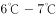

# 2017年河南省选调生选拔考试《行测》试卷（网友回忆版）

> 言语理解与表达 · 30 题 · 河南 2017

## 第 1 题　qid 2049406 · 逻辑填空

雾霾问题是个棘手难题，但再棘手也得解决，而且难题破解还得摁下“快进键”。虽然从客观规律上看，治霾难                ，可就紧迫性而言，治霾还必须得                ，抓住那些核心症结对症施治。
依次填入画横线部分最恰当的一项是：

- **A**. 一劳永逸  釜底抽薪
- **B**. 一马当先  根治病灶
- **C**. 一蹴而就  只争朝夕　✅
- **D**. 一步登天  刻不容缓

**答案**：C

**官方解析**

第一空，根据前文“雾霾问题是个棘手难题”“摁下‘快进键’”，可知雾霾难以解决，但还要加快进行，故横线处成语表达“容易”“轻松”“快速”的意思，A项“一劳永逸”指形容一次把事情做好，以后就不用再做，C项“一蹴而就”比喻事情轻而易举，一下子就成功，均符合文意，保留。B项“一马当先”形容领先，也比喻工作走在群众前面，积极带头，与文意不符，排除；D项“一步登天”指比喻一下子达到极高的境界，横线处表达容易、轻松之意，而非“达到很高境界”，语意不符，排除。
第二空，根据“紧迫性”可知，横线处要体现时间上的紧迫性，C项“只争朝夕”指比喻抓紧时间，力争在最短的时间内达到目的，符合文意，当选。A项“釜底抽薪”比喻从根本上解决问题，体现不出“时间上的紧迫”之意，排除。
故正确答案为C。
【文段出处】《为雾霾天“自责”：问题再难且直面》

---

## 第 2 题　qid 2050736 · 逻辑填空

玛格丽特·米切尔的畅销书既不是纸浆也不是高等艺术，这部作品足够获得普利策奖，但即使是普通的读者也能感受到它那种感伤的情节不能够和伟大的文学作品              。像《飘》这种        了艺术、商业、量产化的书籍，“通俗”是它最好的定义词。
依次填入画横线部分最恰当的一项是：

- **A**. 比肩同行  汇集
- **B**. 相提并论  融合　✅
- **C**. 不分轩轾  杂糅
- **D**. 等量齐观  荟萃

**答案**：B

**官方解析**

第一空，根据“不是高等艺术”及“不能够和伟大的文学作品”可知，横线处所填成语表示米切尔的畅销书与“高等”“伟大的文学作品”有一定的差距，B项“相提并论”指把不同的人或不同的事放在一起谈论或看待，D项“等量齐观”指把有差别的事物同等看待，均符合文意。A项“比肩同行”指在生活中共同进退，同甘共苦，常用于形容人，与“作品”搭配不当，排除；C项“不分轩轾”比喻对待二者的态度或看法差不多，一般不用于否定句式中，排除。
第二空，横线处所填词语表示《飘》同时具备“艺术、商业、量产化”的特点，B项“融合”指融成一体，符合文意，当选。D项“荟萃”指杰出的人物或精美的东西会集，褒义词，而文段仅仅为客观的、中性的陈述，排除。
故正确答案为B。
【文段出处】《为何好莱坞&lt;乱世佳人&gt;一度辉煌》

---

## 第 3 题　qid 2049446 · 逻辑填空

对于社会性动物人类来说，社交的重要性                ，而社交活动中必不可少的技能就是要认清别人的脸。不幸得脸盲症的话，真是会                。
依次填入画横线部分最恰当的一项是：

- **A**. 昭然若揭  见笑于人
- **B**. 毋庸赘述  贻笑大方
- **C**. 不言而喻  窘态百出　✅
- **D**. 显而易见  羞愧难当

**答案**：C

**官方解析**

第一空，根据“社会性动物”可知，社交的重要性是很明显的，B项“毋庸赘述”指用不着多说，C项“不言而喻”指不用说话就能明白，D项“显而易见”指形容事情或道理很明显，极容易看清楚，均符合文意，保留。A项“昭然若揭”形容真相全部暴露，一切都明明白白，含贬义，与文段感情色彩不符，且常搭配罪恶真相，与文段中“重要性”搭配不当，排除。
第二空，根据“必不可少的技能就是要认清别人的脸”可知，横线处所填成语表示“脸盲症”人群在社交活动中会遭遇各种尴尬、难堪，C项“窘态百出”指尴尬无语、郁闷的状态，与文意相符，当选。B项“贻笑大方”指让内行人笑话，辨识人脸一事并无内行外行之分，排除；D项“羞愧难当”指感到十分羞愧内疚，置于文段处语义过重，与文意不符，排除。
故正确答案为C。
【文段出处】《人长大了，识别人脸的大脑区域也在变大》

---

## 第 4 题　qid 2049456 · 逻辑填空

“自由想象力崇拜”的背后，是“顿悟崇拜”。这种思想认为一般人终日被自己的知识所        ，而一旦跳出就能取得重大突破。费曼说，相对论流行以后，很多哲学家跳出来说：“坐标系是相对的，这难道不是最自然的哲学要求吗？这个我们早就知道了！”可是如果你告诉他们光速在所有坐标系下不变，他们就会                。
依次填入画横线部分最恰当的一项是：

- **A**. 羁绊  怅然若失
- **B**. 束缚  目瞪口呆　✅
- **C**. 钳制  呆若木鸡
- **D**. 禁锢  追悔莫及

**答案**：B

**官方解析**

第一空，根据“一旦跳出就能取得重大突破”可知，横线处所填词语表示一般人被自己的知识所约束，C项“钳制”指用强力限制或以兵力和火力拖住敌人，通常强调外力限制，与文段中“自己的知识”搭配不当，排除。“羁绊”“束缚”“禁锢”用在此处均可，保留。
第二空，根据转折关联词“可是”可知，横线处所填成语与“早就知道了”语义相反，表示哲学家惊讶的样子，B项“目瞪口呆”形容因吃惊或害怕而发愣的样子，当选。A项“怅然若失”指形容心情失落的样子，D项“追悔莫及”表示后悔也来不及了，文段并非强调哲学家失落、后悔，与文意不相符，均排除。
故正确答案为B。
【文段出处】《最高级的想象力是不自由的》

---

## 第 5 题　qid 2049468 · 逻辑填空

当年的美丽楼兰，这个绿洲上的王国，丝绸之路的要塞，总是驼铃叮当，人迹熙攘，多么地令人眼热而起兵戎呢。周边的游牧民族厮杀终年不歇，北方的匈奴汹汹如潮肆意南侵，连大汉王朝也皇皇挺兵饮马于此。说话间，                的谋略，                的交响，绿野上驰骋的一世之雄，而今安在哉？
依次填入画横线部分最恰当的一项是：

- **A**. 纵横捭阖  金戈铁马　✅
- **B**. 经天纬地  秣马厉兵
- **C**. 汪洋恣肆  戎马倥偬
- **D**. 尔虞我诈  万马奔腾

**答案**：A

**官方解析**

第一空，“起兵戎”“南侵”“皇皇挺兵饮马于此”都体现文段为打仗的语境。故横线处应体现打仗语境且搭配“谋略”。B项“经天纬地”指以天为经,以地为纬，比喻人的才智极大。多表述为“经天纬地之人”“经天纬地之才”，确与“谋略”搭配不恰当，且不符合打仗的语境，故排除。C项“汪洋恣肆”形容文章、言论、书法等气势豪放，潇洒自如，与“谋略”搭配不当，且未体现打仗的语境，排除。A项“纵横捭阖”指用辞令测探、打动别人，形容在政治和外交上运用联合或分化的手段，符合语境且搭配谋略，保留；D项“尔虞我诈”表示彼此互相欺骗，能够体现打仗的语境，保留。
第二空，要符合打仗语境，且搭配“交响”，A项“金戈铁马”形容战士持枪驰马的雄姿，与“交响”搭配恰当，符合语境，当选。D项“万马奔腾”指形容群众性的活动声势浩大或场面热烈，与文意无关，排除。
故正确答案为A。

---

## 第 6 题　qid 2051242 · 逻辑填空

虽然没有法律强制力做支撑的道德是虚妄的，但是法律在面对道德问题时，也总是会显得             ，这种力不从心的根本原因还是由于法律的外在属性与道德的内在属性之间的矛盾，社会秩序的大厦是法理与道德共同支撑的，如果道德不立，人心善变，法律终会             。
依次填入画横线部分最恰当的一项是：

- **A**. 相形见绌  回天乏力
- **B**. 爱莫能助  孤立无援
- **C**. 左支右绌  独木难支　✅
- **D**. 捉襟见肘  力所不逮

**答案**：C

**官方解析**

第一空，根据代词“这种”可知，横线处词语要体现“力不从心”之意，且与“显得”搭配，说明法律在面对道德问题的时候，想解决解决不了，能力不足，力量不够。C项“左支右绌”和D项“捉襟见肘”均指力量不够，应付不过来，符合文意，保留。A项“相形见绌”指跟同类相比，显出不足，与“力不从心”无关，排除；B项“爱莫能助”指心中关切同情，却没有力量帮助，文中“法律面对道德问题”并不是要帮助，而是解决不了，意思不符，且与“显得”搭配不当，排除。
第二空，“社会秩序的大厦是法理与道德共同支撑的”，说明法律和道德共同支撑社会秩序，没有道德，法律就会孤立无援，C项“独木难支”比喻单个力量单薄，维持不住全局，符合文意，表意形象，当选。D项“力所不逮”指力量达不到，不能体现“法律与道德”的密切关系，排除。
故正确答案为C。
【文段出处】《扶不扶，法律不能规范道德》

---

## 第 7 题　qid 2049312 · 逻辑填空

30岁时，纳什突然出现了许多古怪的举动……最终，他因为幻听被确诊为严重的精神分裂症，后来是接二连三的诊治与复发。1962年，当他被认为是           的菲尔兹奖获得者时，他的精神状况却使他与奖项            。
依次填入画横线部分最恰当的一项是：

- **A**. 无可辩驳  饮恨败北
- **B**. 实至名归  擦肩而过
- **C**. 名正言顺  抱憾终身
- **D**. 理所当然  失之交臂　✅

**答案**：D

**官方解析**

第一空，表示当时的人对于纳什是否会获得菲尔兹奖的看法，A项“无可辩驳”指没有理由或根据来否定对方的意见，形容事实确凿，理由充足；C项“名正言顺”指做某事名义正当，道理也说得通；D项“理所当然”指按道理应当这样。三项置于文段处均符合文意，保留。B项“实至名归”是指有了真正的学识、本事就自然有了声誉，用于已经获得奖项的语境，根据后文转折可知其并未获奖，排除。
第二空，根据转折词“却”可知，所填词语表示纳什错失了这一奖项，D项“失之交臂”形容错过，符合文意，且形象生动。A项“饮恨败北”是含恨失败；C项“抱憾终身”指心存遗憾，主语常常是人，文段表示“他与奖项”的关系，用在此处搭配不当，排除。
故正确答案为D。
【文段出处】《约翰·纳什的一生：在得失博弈中获得均衡》

---

## 第 8 题　qid 2049308 · 逻辑填空

纵观现代化历程，中国改革一直是在争论中推进的，之所以能够顺利推进并取得举世瞩目的成就，就是因为主流意识形态具有强大的        力量，总是能够超越左与右，促使社会形成新的共识。而主流意识形态有这样强大的力量，恰恰是从不同社会思潮中汲取智慧，而不是              的“任性”。
依次填入画横线部分最恰当的一项是：

- **A**. 吸收  泥古不化
- **B**. 平衡  剑走偏锋
- **C**. 整合  刚愎自用　✅
- **D**. 柔化  恃才放旷

**答案**：C

**官方解析**

本题可从第二空入手，根据“是······而不是······”反义并列关联词可知，所填成语表示不汲取别人的智慧，且修饰“任性”，C项“刚愎自用”是指完全固执己见不听取别人的意见，与前文对应恰当，符合语境。A项“泥古不化”比喻拘泥于古代的成规或说法，不知根据具体情况，加以变通，文中并非是古人的说法，而是固执己见，排除；B项“剑走偏锋”是指寻找新的、不同以往的办法来解决问题，以求出奇制胜，侧重方法奇特而非“任性”，排除；D项“恃才放旷”是指倚仗自己的才能而对行为不加约束，文中并非强调倚仗才能，排除。基本锁定C项。
第一空代入验证，“整合”与“超越左与右，促使社会形成新的共识”对应准确，契合文意。
故正确答案为C。
【文段出处】《思潮是飘荡在社会中的幽灵》

---

## 第 9 题　qid 2050722 · 逻辑填空

母亲一生始终未离开武陵山区，我也随着她和父亲在武陵山水间         。当我从武陵边镇来到乌江边的县城，被大家称为来自小河的人；当我从乌江来到长江边的涪陵区，仍被称为小河的边民。后来我明白，到了沿海，你来自内地；到了海外，你来自大陆，一个人一生就是载着家乡山水的           。
依次填入画横线部分最恰当的一项是：

- **A**. 迁徙  漂泊
- **B**. 游走  流浪
- **C**. 流连  远足
- **D**. 辗转  漂流　✅

**答案**：D

**官方解析**

第一空，根据文段“从武陵边镇来到乌江边的县城”“从乌江来到长江边的涪陵区”可知，作者在武陵山区经过很多地方，D项“辗转”指经过很多地方，填入文段语义合适，保留。A项“迁徙”指从一个地区迁移到另一个地区，通常规模较大，如动物迁徙、人口迁徙等，与文意不符，排除；B项“游走”指短暂地在一个地区游玩行走，而文段中并非强调作者在这些地区游玩，与文意不符，排除；C项“流连”指依恋而舍不得离去，无法体现出经过了很多地方，排除。
第二空，代入验证，D项“漂流”指漂泊，行踪无定，填入文段语义恰当，当选。
故正确答案为D。

---

## 第 10 题　qid 2049470 · 逻辑填空

全面的发展和自由却并不意味着毫无底线——尤其是一些媒体对西方工业化流水线生产的娱乐节目亦步亦趋，其作品之低俗令人愤怒。此时此刻，我们的监管部门更需              ，谨防不法分子借恶搞之名        传统价值。
依次填入画横线部分最恰当的一项是：

- **A**. 严阵以待  颠覆　✅
- **B**. 全民皆兵  蚕食
- **C**. 严防死守  侵蚀
- **D**. 全线狙击  污蔑

**答案**：A

**官方解析**

第一空，根据“其作品之低俗令人愤怒”及“谨防不法分子借恶搞之名        传统价值”可知，横线处所填成语应体现监管部门要做好防范与准备。A项“严阵以待”指严密部署、高度戒备，常用于形容对潜在威胁保持警惕并积极准备应对，C项“严防死守”指非常严格地防护并坚定地守住，均符合文意，保留。B项“全民皆兵”指将全体具备战斗能力的人民进行武装，形成随时可抗击外敌入侵的军事体系，与“监管部门”搭配不当，排除。D项“
全线狙击”多用于军事对抗场景，隐含冲突已发生，与“谨防”所体现的预防性立场不一致，排除。
第二空，根据“令人愤怒”“更需”“谨防”可知，文段的语义程度较重，A项“颠覆”指从根本上倾覆推翻，C项“侵蚀”指逐渐侵害使变坏，强调渐进的过程，“颠覆”比“侵蚀”程度更重，与文段对应更为恰当，A项当选。
故正确答案为A。
【文段出处】《评论：经典作品岂容恶搞》

---

## 第 11 题　qid 2049474 · 逻辑填空

“旧时茅店社林边，路转溪桥忽见”——月光、蝉鸣、蛙声与稻香，都是夏夜田间的        景物，遭遇罢官的辛弃疾在此一住十几年，心性渐渐         ，词句变得安详平实。
依次填入画横线部分最恰当的一项是：

- **A**. 寻常  淡然　✅
- **B**. 平凡  索然
- **C**. 平常  安然
- **D**. 常见  了然

**答案**：A

**官方解析**

本题可从第二空入手，所填词语应与“心性”搭配，且与“安详平实” 对应。A项“淡然”形容心情平静，不在意，搭配恰当，符合语境，保留； B项“索然”形容乏味，没有兴趣，感情色彩偏消极，与文意不符，且与“心性”搭配不当，排除；C项“安然”形容没有顾虑，很放心，文段并非强调没有顾虑，且“安然”与 “心性”搭配不当，排除； D项“了然”指清楚明白，与文意不符，且与“心性”搭配不当，排除。 
第一空，代入验证，A项“寻常”与“景物”搭配恰当，契合文意，当选。 
故正确答案为A。

---

## 第 12 题　qid 2050724 · 逻辑填空

远眺试飞机场，天地混为一体，这就是“彩虹”无人机       的起点，更是放飞梦想的舞台。每一名科研人员，都会在试飞成功后，站在这里静静凝视，让热情       平静，平静的背后是一份更高的期许。
依次填入画横线部分最恰当的一项是：

- **A**. 高飞  荣归
- **B**. 遨游  回复
- **C**. 腾空  恢复
- **D**. 翱翔  回归　✅

**答案**：D

**官方解析**

本题可从第二空入手，根据横线前的“静静凝视”可知，横线处所填词语表示由“热情”后退到“平静”的状态。D项“回归”能够表示倒退、后退的意思，符合语境，保留。A项“荣归”指载誉而归，B项“回复”表示答复，通常用于回答别人的问题或要求，均与“热情”搭配不当，排除。C项“恢复”指使变成原来的样子，文段并未提及初始状态就是“平静”，排除。
第一空，代入验证。D项“翱翔”指在空中飞行，填入文段语义合适且搭配恰当，当选。
故正确答案为D。
【文段出处】《“彩虹”无人机在国际市场步步腾飞 希望进一步打开国内市场》

---

## 第 13 题　qid 2050734 · 逻辑填空

这也许有些             ，男性和女性都把自己和对方看作平等的人，才是正常的、自然的态度。但文学本来有异于科学。文学家写的是活生生的人，是活的感受和感发，它们是否合乎科学，不是一眼看得出来的。有时看似       ，恰好包含着合乎科学的内容。
依次填入画横线部分最恰当的一项是：

- **A**. 矫枉过正  偏颇　✅
- **B**. 荒诞不经  偏私
- **C**. 过犹不及  偏激
- **D**. 无理取闹  偏执

**答案**：A

**官方解析**

本题可从第二空入手，横线处形容文学家写作的内容，根据“看似”可知，横线处所填词语与“合乎科学”语义相反，表示不够科学和合理，即存在偏差，A项“偏颇”指不公正，偏袒，填入文段语义合适，保留；C项“偏激”、D项“偏执”均形容人的性格，无法形容作品中的内容，用在此处搭配不当，排除；B项“偏私”指偏袒徇私，与“无私”相对，文段并非强调徇私，而是不够科学、存在偏差，排除。
第一空，代入验证，“矫枉过正”比喻纠正错误超过了应有的限度，根据后文“才是正常的”可知，横线处表达不太正常、有些过头的情况，A项填入文段和后文对应恰当，当选。
故正确答案为A。

---

## 第 14 题　qid 2049472 · 逻辑填空

阿兹特克文明的帝国都城——特诺奇蒂特兰，在给人以神秘感的同时，也透出一丝淡淡的忧伤。神话传说与真实故事的         ，光辉帝国史与悲惨殖民史的         ，令人在心驰神往的同时，感慨时过境迁、沧海桑田……
依次填入画横线部分最恰当的一项是：

- **A**. 纠缠  消散
- **B**. 交织  更迭　✅
- **C**. 重叠  嬗变
- **D**. 合契  幻灭

**答案**：B

**官方解析**

第一空，横线处应体现“神话传说与真实故事”的关系，B项“交织”意为错综复杂地合为一体，符合文意，保留。A项“纠缠”指相互缠绕、搅扰，感情色彩偏消极，排除；C项“重叠”指同样的东西层层堆叠，互相覆盖，侧重内容的重复、重合，D项“合契”指相符合、相一致，侧重完全契合、没有差异，而神话传说与真实故事不可能完全一样，排除C、D两项。
验证第二空，B项“更迭”指交换、交替，能体现出帝国从辉煌到被殖民的历史阶段的更替、转换，且与后文“时过境迁、沧海桑田”形成对应，符合文意，当选。
故正确答案为B。
【文段出处】北方网《阿兹特克文明的兴衰》

---

## 第 15 题　qid 2049428 · 逻辑填空

大连人直面历史，表现出了应有的        ，采取了极为        的做法，他们没有“砸碎一个旧世界，建立一个新世界”，而是完好地保留了那些欧式建筑、广场和绿地。
依次填入画横线部分最恰当的一项是：

- **A**. 气度  睿智
- **B**. 理智  开明　✅
- **C**. 魄力  大胆
- **D**. 胸襟  另类

**答案**：B

**官方解析**

本题可从第二空入手，后文是对横线处的解释说明，根据后文“没有砸碎旧世界”和“完好保留欧式建筑、广场、绿地”，体现出大连人在面对历史时“不守旧”、“包容”的做法，对应B项“开明”。A项“睿智”指聪颖明智，C项“大胆”指不畏惧困难，二者均体现不出“包容”的含义，排除；D项“另类”偏消极，和文段积极的感情色彩不符，排除。
第一空，代入验证，“理智”对应后文“没有砸碎旧世界”，语义相符。
故正确答案为B。
【文段出处】《大连，再不浪漫就老了》

---

## 第 16 题　qid 2049482 · 片段阅读

喀拉拉的自然美景无与伦比，人情练达、古风犹存的民风也颇令当地人引以为傲。这里的人民友善而充满活力，受教育率在全印度位居第一。虽然整个印度的妇女识字率只有，但是喀拉拉邦的所有居民，包括女性，识字率已高达，印度其他地区常见的重男轻女现象在喀拉拉邦很难寻到踪迹。“民众科学运动”的科学家们自豪地说：“在喀拉拉，没有人不读报，没有人不谈政治，没有人不唱歌。”

这段文字主要讲述了喀拉拉地区：

- **A**. 人文环境和自然风光一样优越　✅
- **B**. 人们热爱读书、讨论政治和唱歌，崇尚精神文明
- **C**. 人文环境的独特之处在于既具有复古的淳朴，又具有现代的开放
- **D**. 女性较高的社会地位和受教育水平是喀拉拉邦民风淳朴友善的重要原因

**答案**：A

**官方解析**

文段开篇指出“喀拉拉”这一地区自然风景优美，而此地“民风”也让当地人引以为傲。接着后文对于“民风”具体展开论述，论述民风“友善”“不重男轻女”“爱唱歌”等等。故文段为总分结构，旨在说明喀拉拉民风让人骄傲，对应A项。
B项，对应尾句科学家们的话，非重点，且“崇尚精神文明”文段并未提及，排除；
C项，“复古的淳朴”、“现代的开放”文段并未提及，无中生有，排除；
D项，“女性地位较高”文段并未体现，且文段中“民风友善”和“受教育率”之间为并列关系，并非因果关系，选项表述与文意不符，排除。
故正确答案为A。
【文段出处】《最好的时光在路上》

---

## 第 17 题　qid 2049424 · 片段阅读

2016年是全球气候充满极端状况的一年。大气中的二氧化碳平均浓度已经超过400ppm（1ppm为百万分之一）警示线，甲烷浓度也飙升破纪录。气候变化的长期指标上升至新水平。南极和北极地区的海冰面积缩减严重，打破了最低纪录。俄罗斯、北极地区气温比长期平均温度高，格陵兰冰川开始融化的时间提前，且速度更快，北极地区正以全球平均值两倍的速度变暖。

与这段文字意思相符的一项是：

- **A**. 2016年全球气候变化最为极端
- **B**. 2016年大气中的二氧化碳含量创新高
- **C**. 2016年南北极的海冰面积创出新低　✅
- **D**. 2016年俄罗斯地区气温比格陵兰地区高

**答案**：C

**官方解析**

C项“2016年南北极的海冰面积创出新低”对应文段“南极和北极地区的海冰面积缩减严重，打破了最低记录。”表述正确，当选。

A项中的“最为极端”表述绝对，文段并无体现，排除。B项表述错误，文段讲述“大气中的二氧化碳平均浓度已经超过400ppm”不能得出“二氧化碳含量创新高”，排除。D项表述错误，俄罗斯、北极地区气温比长期平均温度高，不能得出“2016年俄罗斯地区气温比格陵兰地区高”，排除。

故正确答案为C。

【文段出处】《2016将成为史上最热年》

---

## 第 18 题　qid 2049478 · 片段阅读

文字概率相对于数字概率具有模糊性、非概率运算性和语义特性等特征。数字概率是一种更精确的风险表达方式，在风险沟通时人们对其能比较客观地传递、解释和利用。文字概率和数字概率在进化历史上出现时间不同，隶属的发展领域（语言和数学）也不同，所以其特征上的差异可能不止于以上所述。例如文字概率的非概率运算性表明，人们传达或接受文字概率表征的信息时不会按照概率规则进行审慎地运算，文字概率更多地引发直觉式思考，数字概率更多地引发分析式思考。
对这段文字概括最恰当的一项是：

- **A**. 文字概率与数字概率分属不同领域
- **B**. 数字概率其实优于文字概率
- **C**. 文字概率与数字概率不同　✅
- **D**. 数字概率与文字概率的思考方式不同

**答案**：C

**官方解析**

文段开篇介绍了文字概率和数字概率的特征，说明文字概率是模糊的，而数字概率更精确，表明两者特征的不同。接着说明文字概率和数字概率的出现时间不同、发展领域不同，随后通过“所以”得出结论，说明其特征上的差异可能还有更多，并举例详细说明。故文段意在表明文字概率和数字概率的特征是不同的，对应选项为C项。
A项中的“分属不同领域”、D项中的“思考方式”均为文字概率与数字概率之间差异的一个方面，无法完全概括文意，排除。
B项，文段仅仅是对比两者间的差异，而并未说明两者的好与坏，故“优于”表述无中生有，排除。
故正确答案为C。
【文段出处】《用文字概率衡量不确定性：特征和问题》

---

## 第 19 题　qid 2050750 · 片段阅读

凡是到达了的地方，都属于昨天。哪怕那山再青，那水再秀，那风再温柔。太深的流连便成了一种羁绊，绊住的不仅仅有双脚，还有未来。没见过大山的巍峨，真是遗憾；见了大山的巍峨没见过大海的浩瀚，仍然是遗憾；见了大海的浩瀚没见过大漠的广袤，依旧遗憾；见了大漠的广袤没见过森林的神秘，还是遗憾。
这段文字作者意在说明：

- **A**. 风光无限，在昨日更在明天
- **B**. 昨天已然过去，可怀念不可流连
- **C**. 只有不断出发，未来的精彩才会继续　✅
- **D**. 最美的风景，不是终点，而是在路上的自己

**答案**：C

**官方解析**

文段开篇通过“凡是到达了的地方，都属于昨天”，说明昨天不那么重要。后文提出问题“太深的流连会成为一种羁绊，不仅仅牵绊双脚还有羁绊未来”。随后通过并列的分述分析了“流连过去会产生遗憾”。本题为“提出问题—分析问题”的结构，故解决问题的对策是重点，即“只有不断出发，未来的精彩才会继续”，对应C项。
A项，强调美好的风景在哪，而文段重在强调对策，即不断向前出发，故非重点，排除；
B项，仅指出“不能流连过去”，表述不明确，未提到应重视“未来”，排除；
D项，强调“自己”，而文段强调“未来”，偏离中心，排除。
故正确答案为C。
【文段出处】《我喜欢出发》

---

## 第 20 题　qid 2050720 · 语句表达

①近地表气温递减率（NLR）是将气温由站点向网络进行插值过程中的重要参数，是影响气温空间分布的重要因素
②研究发现MODIS的夜间地表温度LST与站点观测的气温有很好的一致性，而且有较高的空间分辨率便于计算NLR，适用于分布式水文模型的模拟
③在高寒地区，气温影响积雪融化、冰川消融、冻土转化以及陆气之间的水分和能量交换等过程，使得该区域水文过程对气温非常敏感
④通常可以采用观测站点数据来获取NLR，而在观测站点较为缺乏的青藏高原等高海拔地区，可以采用遥感卫星数据（如MODIS的地表温度LST）来进行推算
⑤因此，获取准确的气温空间分布对于寒区水文模拟至关重要
将以上5个句子重新排序，语序正确的是：

- **A**. ①③④⑤②
- **B**. ③⑤①④②　✅
- **C**. ②①④③⑤
- **D**. ④②①③⑤

**答案**：B

**官方解析**

首先根据选项判断首句，①句介绍NLR的概念及其重要性，②指出较高的空间分辨率便于计算NLR，③指出水文过程与气温的关系，④介绍获取NLR的方式，分析内容可知，①是对“NLR”下定义引出话题，②④是对“NLR”的具体表述，故①在②④之前，排除C、D两项。对比A、B两项，区别在于③、⑤是否捆绑，根据文意可知，③、⑤均讲述寒区水文与气温的关系，故话题一致，需捆绑，对应B项。
故正确答案为B。
【文段出处】《青藏高原所基于卫星遥感估算的近地表气温递减率改进积雪过程的模拟》

---

## 第 21 题　qid 2049412 · 片段阅读

转变发展理念，切实增强协调发展的自觉性和坚定性。我们党提出协调这一发展理念，旨在补齐发展短板，解决发展不平衡问题。尽管我国经济社会发展取得巨大成就，但也出现了发展不平衡、不协调、不可持续问题，迫切需要转变发展理念，特别是增强发展的整体性、协调性。在当前全面建成小康社会的决胜时期，我们必须转变观念，把思想和行动统一到新发展理念上来，正确处理发展中的重大关系，在协调发展中拓宽发展空间，在补齐短板中增强发展后劲，在增强国家硬实力的同时提升国家软实力，使物质文明和精神文明协调发展，同步提升。
这段文字意在强调我们要：

- **A**. 转变发展理念，解决发展不平衡问题　✅
- **B**. 推动物质文明与精神文明协调发展
- **C**. 增强协调发展的自觉性与坚定性
- **D**. 转变发展理念，提升国家软实力

**答案**：A

**官方解析**

文段开篇指出“我们党提出协调这一发展理念”是要解决“发展不平衡问题”，随后通过“但”进行转折，仍然强调我国存在不平衡、不协调、不可持续的问题，接着通过“迫切需要”提出对策，即“转变观念”，后文围绕这一核心主张展开，通过处理重大关系、补齐短板等具体举措，并论述意义效果，故文段重点是对策，整体围绕“转变发展理念”这一关键举措以及“解决发展不平衡问题”这一核心目标展开，对应A项。
B项，“物质文明与精神文明”对应意义效果部分内容，非文段重点，排除。
C项，“增强协调发展的自觉性与坚定性”为开头话题引入部分内容，非文段重点，排除。
D项，根据文段“在增强硬实力的同时提升软实力”可知，“软实力”表述片面，排除。
故正确答案为A。
【文段出处】《推动物质文明和精神文明协调发展》

---

## 第 22 题　qid 2049400 · 片段阅读

土星的光环系统就是目前我们所拥有的最接近45.5亿年前诞生地球和其他行星的尘埃、碎石盘的东西。这个原行星盘成形于一团由超低温气体和尘埃组成的星云在自身引力作用下的坍缩。随着这个转动的星云逐渐收缩，它就成了一个围绕新生太阳的盘，一旦太阳吹散了这些气体，盘中作轨道运动的碎石就和土星的光环系统极为相似。
这段文字主要介绍了土星光环的：

- **A**. 形状
- **B**. 运行
- **C**. 构成
- **D**. 形成　✅

**答案**：D

**官方解析**

文段开篇引出“土星光环”这一核心话题，并指出它与诞生地球和其他行星的尘埃、碎石盘的东西最为接近，接着具体讲述这一原行星盘的形成过程，尾句再次强调盘中作轨道运动的碎石就和土星的光环系统极为相似，可知，文段通过对于原行星盘的介绍，揭示了土星光环的形成过程，对应D项。
如果实在读不懂，可以发现，文段中多次出现“成形”、“成了”等词语，亦可对应D项“形成”。
A项：“形状”非文段重点，文段主要强调土星光环系统的形成，排除；
B项：“运行”在原文中没有提及，为无中生有的表述，排除；
C项：“构成”对应文段“由超低温气体和尘埃组成”，强调的是“星云”的构成，而非“土星光环”的构成，偷换概念，排除。
故正确答案为D。
【文段出处】《土星的奇怪“螺旋桨”》

---

## 第 23 题　qid 2049416 · 片段阅读

长时间保持同一个姿势，容易导致下肢血液回流不畅，形成血栓。静脉血栓是血栓把血管堵塞，造成血液无法流通，从而引起肢体肿胀、疼痛，以及浅静脉扩张、曲张等临床表现。静脉血回流到心脏后，会进入肺部来完成氧气的交换。深静脉血栓在血管的一端与血管壁仅有轻度粘连，血栓另一端则自由地漂浮在血管壁内。热敷、按摩和挤压下肢，容易使血栓脱落，随血流流经心脏，最后“卡”在肺动脉里面，导致肺动脉的血流受阻，进而引发咳嗽、胸闷等症状，甚至导致窒息死亡，即肺栓塞。
对这段文字理解错误的是：

- **A**. 用热敷、按摩的方法来缓解静脉血栓是错误的
- **B**. 深静脉血栓比浅静脉扩张更加危险　✅
- **C**. 预防静脉血栓，需要人们运动起来
- **D**. 具有堵塞性是血栓的“原罪”

**答案**：B

**官方解析**

A项，根据尾句“热敷、按摩和挤压下肢，容易使血栓脱落······”可知，表述正确；
B项，无中生有，文段未将“深静脉血栓”与“浅静脉扩张”进行对比，表述错误；
C项，根据首句“长时间保持同一个姿势，容易导致下肢血液回流不畅，形成血栓”，可知表述正确；
D项，根据“静脉血栓是血栓把血管堵塞”，可知“堵塞性是血栓的‘原罪’”表述正确。
本题为选非题，故正确答案为B。
【文段出处】生命时报《小腿肿胀乱揉很危险》

---

## 第 24 题　qid 2049490 · 语句表达

医生诊疗费用的低下与药品加成的过高，共同形成了以药养医的现状。它保证了公共医院在数据上的收支平衡，却导致了“大处方”“新特贵药”“过度医疗”等现象的出现，让医生和患者都容易成为扭结的医疗制度及以其为轴的社会冲突的代偿者。前一段时间，患者魏则西的去世和医生陈仲伟的遇害先后引起舆论大潮，两件新闻被附会了各种情绪，最终                    。其所展现出的，正是医患双输局面长久酝酿出的情绪瞬间决堤的效果。
填入画横线部分最恰当的一项是：

- **A**. 导致医患关系的紧张和对立局面
- **B**. 形成了喧闹的群体舆论冲突事件
- **C**. 异化成为群体对群体的谴责和喊话　✅
- **D**. 造成了医患之间矛盾的形成与扩散

**答案**：C

**官方解析**

横线在文段中间，需要分析上下文。文段首句指出当前存在以药养医的现状，接着论述以药养医引发的问题，即既损伤了医生的利益，也损伤了患者的利益。尾句中的“其”代指横线处，指出是医患长期矛盾导致情绪爆发的结果。C项“群体对群体”指的是医生与患者群体，“谴责和喊话”对应“情绪爆发”，“异化”一词现用来形容事情发展偏离了其原来的样子，故C项与前后文衔接恰当，且符合整个文段的语体风格，当选。
A项，“医患关系的紧张和对立”不能体现“情绪瞬间爆发”这层含义，与后文对应不当，排除；
B项，“群体舆论冲突事件”不能体现文段“医生和患者”这两种不同身份的人，且“喧闹的”一词相较于C项的用语显得过于随意，与文段的语体风格不符，排除；
D项，医患矛盾的“形成”并非两件新闻造成的，排除。
故正确答案为C。
【文段出处】《在医疗改革中彰显“人的尺度”》

---

## 第 25 题　qid 2049320 · 语句表达

迁都是件大事，有“牵一发动千钧”的效果。不仅迁都国家的政治经济格局将随着新都的诞生而发生改变，其他国家也将依照新都的情况而改变与这个国家的联络方式，比如驻该国的使馆要迁到新都啦，随着该国的政治经济和人口分布的改变，对该国的经济政策也要变化啦等等。因此，迁都实际上牵扯到许多人的现实利益，                    ，由于众口难调，实施起来就格外困难。
填入画横线部分最恰当的一项是：

- **A**. 会有连锁反应
- **B**. 堪比世界难题
- **C**. 是个系统工程　✅
- **D**. 易致恶性循环

**答案**：C

**官方解析**

横线部分为尾句中的一个分句，需与其他分句共同构成对文段内容的总结。文段开头讲述迁都有“牵一发动千钧”的效果，然后进行解释说明，并以使馆迁都为例进行论证。“因此”引导结论，根据横线前“迁都实际上牵扯到许多人的现实利益”和横线后“实施困难”，可知横线表达迁都很复杂的意思，B项“堪比世界难题”程度过重，排除；D项“易致恶性循环”无中生有，文段没有提及，排除。
对比A、C两项，A项“连锁反应”侧重于一环扣一环的改变，文段只是表达迁都带来其他方面的改变，而没有类似于“迁都使政治经济改变，政治经济又导致其他方面改变”的意思，故“连锁反应”表述错误。而C项“系统工程”既可以表达前文“牵一发动千钧”的语意，又与“复杂”“实施困难”等对应准确，当选。
故正确答案为C。
【文段出处】《中国国家地理：世界大迁都》

---

## 第 26 题　qid 2049370 · 片段阅读

个人认为，电动汽车的部件品种应该由企业选择，市场来裁判。电池、电机、电控等部件的品种都很多，都应该由企业根据总体设计和市场进行选择，没有必要由标准来越俎代庖。欧、美、日法规当中低速电动车标准里面都没有限定电池，未排斥铅酸电池，而装有铅酸电池的中国品牌低速电动车畅销国外。因此，中国的低速电动车标准不应该限制铅酸电池。
文中“越俎代庖”的“庖”指的是：

- **A**. 装有铅酸电池的中国品牌低速电动车畅销国外的事实
- **B**. 欧、美、日法规里的中低速电动车标准
- **C**. 市场以及企业的总体设计　✅
- **D**. 国内对低速电动车的限定

**答案**：C

**官方解析**

词语理解题，先理解“越俎代庖”这一成语的意思，即比喻超出自己的业务范围去处理别人所管的事，“庖”字的意思就是别人应该处理的事情。明确之后，定位原文，重点关注“越俎代庖”前后句，根据前句可知，作者的观点是部件都应该根据设计和市场来选择，不应该由标准即国内对于电动车的限制来代替，“庖”是指本应该作为参考的“企业和市场”的选择，对应C项。
A项，仅是阐述事实，而并非标准所替代的某个行为，不符合文意，排除；
B项，为国外法规内设置的标准，文段阐述的是由标准代替市场与企业的选择，而非标准本身，排除；
D项“国内对低速电动车的限定”，未提到企业和市场的选择，排除。
故正确答案为C。
【文段出处】《院士谈电动汽车：限定品种不利新电池发展》

---

## 第 27 题　qid 2049306 · 片段阅读

“治人者必先自治，责人者必先自责”，纪委是党风廉政建设的重要参与者和反腐败工作的组织协调者，纪检监察干部是党的纪律的执行者和捍卫者，手中掌握着监督执纪权力，更是时刻都面临着腐蚀与反腐蚀的考验。如若在作风和纪律问题上偏离一尺，党风廉政建设离党中央的要求就会偏离一丈。因此，要做好纪检监察工作，纪检监察干部首先就要加强自律、服从他律。
接下来最可能讲的是：

- **A**. 如何加强党风廉政建设
- **B**. 如何做好纪检监察工作
- **C**. 如何做好纪检干部队伍建设　✅
- **D**. 如何加强纪委工作作风建设

**答案**：C

**官方解析**

文段开篇提出纪委与纪检监察干部是廉政反腐的重要组成部分，时刻面临着考验。尾句通过“因此”引导结论，指出要做好纪检监察工作，重点在于纪检监察干部，后文应保持话题的一致，应继续围绕“纪检监察干部”来展开，详细论述如何建设好纪检监察干部的队伍，对应C项。
A、B、D三项：A项“党风廉政建设”、B项“纪检监察工作”、D项“纪委工作作风”均与文段最后论述的核心话题“纪检监察干部”不一致，排除。
故正确答案为C。
【文段出处】《如何真正发挥好纪委的作用？》

---

## 第 28 题　qid 2049398 · 片段阅读

常识告诉我们，越是高雅的艺术，越是经得起历史检验的经典，一开始接触都有点欣赏不了，要学会欣赏，得靠熏陶。从不懂到懂，从不会欣赏到学会欣赏，从无意识地懂得知识与道理，到有意识地进学堂接受传道授业，正是文明的台阶。审美的过程说到底，就是一个从审不懂到审得懂的过程。读书亦是如此，常识还告诉我们，读懂读透一本难懂的好书，特别是读进去一部经典作品，胜读很多本一般的书。传统的中国教育讲究记诵之学，读私塾要“念背打”。现在看来，除了“打”可以商榷之外，念书、背书的好处之多就不必多说了。
从以上文字可以推出作者的意图是：

- **A**. 说明读书在精不在多
- **B**. 劝导大家看点看不懂的东西　✅
- **C**. 指出文化修养的提升需要经典作品的熏陶
- **D**. 肯定中国传统教育的“念背”之法

**答案**：B

**官方解析**

文段开篇指出高雅的艺术，经得起检验的经典一开始欣赏不了，然后指出要靠熏陶，从不懂到懂很正常，并进一步论述，也就是说对于不懂的艺术慢慢弄懂很正常，接着说明读书亦是如此，前后表达并列，然后指出难懂的好书价值很大，好处很多，即搞懂难懂的书好处多多，所以文段是并列结构，前面指出不懂到懂很正常，后面指出搞懂不懂的好处多多，故作者对于难懂的不懂的东西倾向于要面对，慢慢搞懂，对应B项。
A项“在精”和C项“经典作品”偏离文段核心话题，排除；D项对应解释说明部分，非重点，排除。
故正确答案为B。
【文段出处】《人民日报悦读：看点看不懂的东西》

---

## 第 29 题　qid 2049310 · 片段阅读

假若没有来自于碰撞的热储备，“地球发电机”就根本不会启动，地球也就不会拥有一个保护着地球生命的磁场了。太阳辐射会毫不留情地剥离大气层并冲击地球表面，地球不可避免地会遭遇和现在火星相同的命运。由此看来，我们这个适于居住的世界就好像是由一些互不相干的现象构建起来的，包括月亮的诞生、磁场的形成、板块构造和水的存在等等。假若没有那次碰撞，地球就没有足够的热能在地核中驱动热的对流运动，地球磁场也不会形成；假若没有水，地壳就可能太浓稠从而不会分解成构造板块。看看金星吧！它没有板块构造，没有水，没有磁场。
最适合做这段文字标题的一项是：

- **A**. 地球，宇宙的孤例
- **B**. 地球，碰撞的奇迹　✅
- **C**. 地球，必然的偶遇
- **D**. 地球，偶然的侥幸

**答案**：B

**官方解析**

文段首先通过反面论证指出没有碰撞的热储备就会产生许多不好的结果，引出文段的核心话题“碰撞”，接着通过“由此看来”进行分析，最后再次强调如果没有碰撞、没有水，地球就不会像现在这样适宜居住，并将地球与金星进行了对比，强调由于碰撞地球具备了适宜的条件。因此整个文段都在强调“碰撞”的重要性，对应B项。
A项“孤例”强调唯一性，文段并未提及地球是宇宙中的唯一，且没有体现出碰撞对于地球的作用，排除；C项“必然的偶遇”与D项“偶然的侥幸”表述均不明确，未提及碰撞，排除。
故正确答案为B。
【文段出处】《探索神秘的地下世界》

---

## 第 30 题　qid 2049388 · 片段阅读

传统经验医学正遭遇“不确定性”技术瓶颈，造成医疗资源浪费和医疗效果不尽如人意。相比传统诊疗手段，精准医学具有精准性和便捷性，一方面通过基因测序可以找出疾病相关的突变基因，从而迅速确定对症药物，减少弯路，提高疗效，同时还能够在患者遗传背景的基础上降低药物副作用；另一方面，精准医学检测所需的组织样本较少，可以减少诊断过程中对患者身体的损伤。可以预见，精准医学技术的出现，将显著改善疾病，尤其是癌症患者的诊疗体验和诊疗效果。
根据以上文字，对精准医学理解正确的是：

- **A**. 能减少药物使用，提高医疗效果，增强医疗的确定性
- **B**. 具有精准性和便捷性，因此拥有传统经验医学无可比拟的优越性
- **C**. 减少对患者的损伤和降低副作用，是其改善诊疗体验和效果的关键
- **D**. 可减少医源性损害，降低医疗资源耗费，获得优化的病患治疗效益　✅

**答案**：D

**官方解析**

文段开篇首先通过传统医学引出本文的核心话题精准医学，接着通过与传统医疗手段的对比突出精准医学的优势，并由“一方面······另一方面······”的并列结构进行具体列举，即一方面可以提高疗效，降低药品副作用，另一方面可以减少诊断过程对患者的身体损伤，尾句进一步强调精准医学的意义。
文段强调精准医学能够迅速确定对症药物，提高疗效，降低无谓的医疗资源消耗，减少诊断过程中对患者身体的损伤，显著改善病患治疗效果，D项概括最为精准全面。
A项，精准医学能够“迅速确定对症药物，减少弯路，提高疗效”，并不等于能够减少药物使用，曲解文意，排除；
B项“无可比拟”表述绝对，由原文可知，传统经验医学只是遭遇不确定性的技术瓶颈，排除；
C项“是其改善诊疗体验和效果的关键”文段未提及，无中生有，排除。
故正确答案为D。
【文段出处】《詹启敏：精准医学是未来社会发展的制高点》

---
