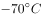

# 2018年北京市公务员录用考试《行测》题（网友回忆版）

> 言语理解与表达 · 35 题 · 北京 2018

## 材料 1

①开发区建设是我国改革开放的成功实践，对（甲）体制改革、（乙）投资环境、（丙）产业集聚、（丁）开放型经济发挥了不可替代的作用，开发区已成为推动我国工业化、城镇化快速发展和对外开放的重要平台。当前，全球经济和产业格局正在发生深刻变化，我国经济发展进入新常态，面对新形势，必须进一步发挥开发区作为改革开放排头兵的作用，形成新的集聚效应和增长动力，引领经济结构优化调整和发展方式转变。为深入贯彻落实《中共中央 国务院关于构建开放型经济新体制的若干意见》，经国务院同意，现提出以下意见。

②全面贯彻党的十八大和十八届三中、四中、五中、六中全会精神，（Ⅰ）深入贯彻习近平总书记系列重要讲话精神和治国理政新理念新思想新战略，认真落实党中央、国务院决策部署，（Ⅱ）牢固树立创新、协调、绿色、开放、共享的发展理念，加强对各类开发区的统筹规划，加快开发区转型升级，促进开发区体制机制创新，完善开发区管理制度和政策体系，（Ⅲ）进一步增强开发区功能优势，（Ⅳ）把各类开发区建设成为新型工业化发展的引领区、高水平营商环境的示范区、大众创业万众创新的集聚区、开放型经济和体制创新的先行区，推进供给侧结构性改革，形成经济增长的新动力。

③坚持改革创新。强化开发区精简高效的管理特色，创新开发区运营模式，以改革创新激发新时期开发区发展的动力和活力。坚持规划引领。完善开发区空间布局和数量规模，形成布局合理、错位发展、功能协调的全国开发区发展格局，切实提高经济发展质量和效益。坚持集聚集约。完善公共设施和服务体系，引导工业项目向开发区集中，促进产业集聚、资源集约、绿色发展，切实发挥开发区规模经济效应。坚持发展导向。构建促进开发区发展的长效机制，以规范促发展，正确把握发展和规范的关系，不断探索开发区发展新路径、新经验。

### 第 1 题　qid 2136994 · 逻辑填空

依次填入材料①中甲、乙、丙、丁四处，最恰当的一组词语是：

- **A**. 促进  改善  引导  发展　✅
- **B**. 引导  发展  改善  促进
- **C**. 引导  改善  促进  发展
- **D**. 促进  发展  引导  改善

**答案**：A

**官方解析**

先看第二空，搭配“环境”，“改善”与“环境”搭配恰当，指的是让环境变得更好，“发展”与“环境”搭配不当，排除B、D两项。
再看第三空，与“产业集聚”搭配，根据后文“必须进一步发挥开发区作为改革开放排头兵的作用，形成新的集聚效应和增长动力”可知，此处表示开发区建设形成了新的产业集聚效应，对比A、C两项，A项“引导”指带领，使跟随，可以与“新的集聚效应”形成对应，符合语境，保留；C项“促进”是在产业集聚已经存在的基础上进一步推动，不能指“新的集聚效应”，排除。
验证第一、四空，A项“促进体制改革”，“发展开放型经济”均符合搭配，当选。
故正确答案为A。
【文段出处】《国务院办公厅关于促进开发区改革和创新发展的若干意见》

---

### 第 2 题　qid 2137000 · 片段阅读

“紧紧围绕统筹推进‘五位一体’总体布局和协调推进‘四个全面’战略布局，”该句放入文中材料②中哪一处最合适？

- **A**. Ⅰ
- **B**. Ⅱ　✅
- **C**. Ⅲ
- **D**. Ⅳ

**答案**：B

**官方解析**

给定语句为“紧紧围绕统筹推进‘五位一体’总体布局和协调推进‘四个全面’战略布局”，即重点讨论总体布局、战略布局的话题。接下来分析四个空缺位置前后的文段，发现II之前指出要“深入贯彻······新思想新战略，认真落实······决策部署”，先有思想、再有决策部署。而“五位一体”、“四个全面”即为决策部署的具体表现。II之后内容全部围绕“开发区”建设展开，表述更加具体，是对战略部署的具体解释说明，故该句应位于II处，B项当选。
I之前论述的是“贯彻精神”，之后论述的是“贯彻······新思想新战略”，故与“战略布局”联系不够紧密，A项排除；III、IV前后都详细阐述了如何进行“开发区”的建设，与给定语句话题不一致，C、D两项均排除。
故正确答案为B。
【文段出处】《国务院办公厅关于促进开发区改革和创新发展的若干意见》

---

### 第 3 题　qid 2137002 · 片段阅读

材料③主要谈的是开发区建设的：

- **A**. 基本原则　✅
- **B**. 发展目标
- **C**. 经验教训
- **D**. 实施步骤

**答案**：A

**官方解析**

定位第三段。文段分四部分，包括“坚持改革创新”、“坚持规划引领”、“坚持集聚集约”、“坚持发展导向”，并对每个方面进行了具体阐述。这四个方面属于开发区建设需要坚持的原则，A项当选。
B项“发展目标”、C项“经验教训”、D项“实施步骤”均为无中生有的表述，第三段没有涉及，排除。
故正确答案为A。
【文段出处】《国务院办公厅关于促进开发区改革和创新发展的若干意见》

---

### 第 4 题　qid 2137010 · 片段阅读

根据材料，开发区在改革开放中的角色最接近于：

- **A**. 螺丝钉
- **B**. 桥头堡
- **C**. 火车头　✅
- **D**. 发动机

**答案**：C

**官方解析**

根据第一段所述，“必须进一步发挥开发区作为改革开放排头兵的作用”，可知开发区相当于“排头兵”，指动作要领最规范的战士，喻指带头的人或最优秀者，C项“火车头”与之意思相近，当选。
A项“螺丝钉”比喻平凡而不可缺少的人或物，“开发区”在改革开放中的角色并不平凡，排除；B项“桥头堡”指为扼守和保护重要桥梁、渡口，在其附近地区构筑的碉堡、地堡或阵地，“开发区”的作用并非扼守和保护，排除；D项“发动机”指把热能、电能等变为机械能的机器，用来带动其他机械工作，“开发区”的作用并非提供动力，排除。
故正确答案为C。
【文段出处】《国务院办公厅关于促进开发区改革和创新发展的若干意见》

---

### 第 5 题　qid 2137014 · 片段阅读

下列选项中，发文字号符合公文格式标准的是：

- **A**. 〔2017〕国办发7号
- **B**. 国办发[2017]第7号
- **C**. 国办发〔2017〕7号　✅
- **D**. （2017）国办发第7号

**答案**：C

**官方解析**

发文字号应当包括机关代字、年份、序号，格式为“发文机关代字+年份+序号”。年份、序号用阿拉伯数码标识；年份应标全称，用六角括号“〔〕”括入；序号不编虚位（即1不编为001），不加“第”字，对应选项为C；A项编写顺序有误，B、D两项中存在“第”字，且B项非六角括号，排除。
故正确答案为C。
【文段出处】《国务院办公厅关于促进开发区改革和创新发展的若干意见》

---

## 材料 2

        数字图像修复技术中的文物虚拟修复技术就是对一些文物数字图像中所缺失、损坏的部分，应用现有的图像信息，根据一定的修复原则进行还原修复的技术。其主要目的是使修复后的数字图像无限接近原视图。

        在文物保护领域中，受到很多历史因素或其他客观因素的影响，出土的文物和存放时间长的文图表面会有很多的缺失破损情况，如裂缝、咬色、生锈、霉变等，这使得文物信息大量缺失，对文物欣赏及研究有很大影响。在以往的文物修复过程中，一般是修复工作者通过对文物补色、刷洗等方法进行简单修复；即使在当今的文物修复中，依然主要由具有想象力的修复专家在文物本体上进行处理。这种处理一旦形成便很难更改，稍有大意，存留下来的文明将不复存在，因此风险性极高。同时，不同的文物专家通常对文物修复会有不同的主张，分歧意见难以统一。

        为更好地解决<u><b>上述问题</b></u>，可以利用计算机虚拟修复技术，对需要修复的文物及数字图像进行仔细评估，充分运用统计学理论及微积分方程建立预测模型，再用图像已知区域信息对缺失区域进行评估，这样便可更好地对数字图像进行虚拟修复，更加方便快速地提出修复方案，大大缩短文物修复的工作周期，有效预防手工修复过程中对文物的二次伤害，同时避免人工修复中主观因素的影响，最大限度地修复文物的缺失信息，使文物重现原貌。

        在文物虚拟修复实验中，对任何情况的信息缺失的修复，均需遵循文物保护“修复如初”的基本原则。如现存于西安碑林博物馆中唐昭陵六骏中的“清骓”石雕，就采用了基于变分PDE的修复模型进行了原型修复，对图像中的裂痕进行了严密合理的计算估计，并根据所得周围像素的数值对裂隙处的像素进行了填算，从而在一定程度上填补了缝隙中缺失的相关信息，使修复效果较为连续自然。

        另外，在文物修复过程中，如果通过已知信息不能对文物缺失部分进行判断，并且查阅不到相关资料证明其缺失情况，则不能按照人的主观意愿对文物进行修复。在文物虚拟修复时，一定要给计算机发出相应指令，对图像进行对照分析，标记出图像中可以进行虚拟修复的位置，对不能判断的部分则不能进行标记，否则计算机就会进行错误的修复。

### 第 6 题　qid 2136942 · 片段阅读

第3段中所说的“上述问题”包括：
①修复专家短缺
②传统修复方法风险大
③修复专家各执己见
④修复工作要求专家经验丰富
⑤要求文物有较好的修复基础

- **A**. ①②
- **B**. ②③　✅
- **C**. ③④
- **D**. ④⑤

**答案**：B

**官方解析**

由“上述问题”可知指代的内容为上文，根据上文具体阐述文物修复遇到的问题，故“上述问题”可总结为两点，即一方面利用传统方法修复文物风险性极高，一旦形成便很难更改，另一方面不同的文物专家通常对文物修复有不同的主张，分歧意见难以统一，对应选项为B。①、④和⑤文段并未涉及，无中生有，故A项中的①无中生有，C项中的④无中生有，D项中的④⑤均为无中生有，均排除。
故正确答案为B。
【文段出处】《数字图像修复技术在文物保护中的应用》

---

### 第 7 题　qid 2136944 · 片段阅读

“清骓”石雕的例子，意在说明数字图像修复技术：

- **A**. 具有独特优势
- **B**. 可能存在的问题
- **C**. 应遵循的原则　✅
- **D**. 如何填补缺失信息

**答案**：C

**官方解析**

根据文章第四段，该文段为总分结构，开头提出观点“对任何情况的信息缺失的修复，均需遵循文物保护‘修复如初’的基本原则”，之后通过“清骓”石雕的例子论证说明，故可知该例子论证的观点为“任何修复方式都要遵循修复原则”，对应C项。
A、B两项，文段并未涉及，无中生有，排除；
D项，为例子本身，并非例子所说明的内容，排除。
故正确答案为C。
【文段出处】《数字图像修复技术在文物保护中的应用》

---

### 第 8 题　qid 2136946 · 片段阅读

根据文意，可以推知：

- **A**. 数字虚拟技术有助于避免文物在出土时受损
- **B**. 计算机无法自动识别出文物无法修复的部分　✅
- **C**. 只有具有鉴赏和研究价值的出土文物值得修复
- **D**. 数字图像修复技术已在文物中占主导地位

**答案**：B

**官方解析**

根据提问方式可知该题为细节判断。
A项，根据文章第一自然段可知，数字虚拟技术是对文物已损坏的部分进行修复的，使其修复后的图像无限接近于原图，而并非是“避免文物在出土时受损”，表述错误，排除。
B项，根据文章最后一段最后一句话可知，在文物修复时，需要人给计算机发出指令，对可以修复的部分进行标记，而对无法修复的部分，计算机则不能判断从而不能进行标记，故“计算机无法自动识别出文物无法修复的部分”表述正确，当选；
C项，文段并没有论述什么标准的文物值得修复，无中生有，排除；
D项，根据文段第二段“即使在当今的文物修复中，依然主要由具有想象力的修复专家在文物本体上进行处理”，而并非是“数字图像修复技术占主导地位”，表述错误，排除。
故正确答案为B。
【文段出处】《数字图像修复技术在文物保护中的应用》

---

### 第 9 题　qid 2136950 · 片段阅读

下列选项中，最适合作为本文关键词的是：

- **A**. 数字图像  修复技术  文物保护　✅
- **B**. 出土文物  文物修复  人工智能
- **C**. 数字技术  虚拟修复  文物鉴赏
- **D**. 文物保护  考古研究  技术革命

**答案**：A

**官方解析**

“关键词”即为文段的核心话题。文段第一段引出话题，说明文物虚拟修复技术是为了还原数字图像的修复技术，目的是使其无限接近原图。第二段论述了文物保护领域中的现状与出现的难题。后三段强调虚拟修复技术能够解决文物保护中的一些问题以及虚拟修复技术的优势特点。故文段就是谈论在文物保护领域，虚拟修复技术对修复数字图像起到的重要作用，关键词即为，文物保护、修复技术、数字图像。对应选项，只有A项正确。
B项“出土文物”“人工智能”范围扩大，文段针对的是“数字图像”和“虚拟修复技术”展开论述，排除；
C项“数字技术”范围扩大，“文物鉴赏”不是文章重点，排除；
D项“考古研究”“技术革命”均无中生有，排除。
故正确答案为A。
【文段出处】《数字图像修复技术在文物保护中的应用》

---

### 第 10 题　qid 2136952 · 片段阅读

本文主要强调了：

- **A**. 传统文物修复技术已经没落
- **B**. 我国文物保护的现状不容乐观
- **C**. 数字图像修复技术在文物保护领域大有作为　✅
- **D**. 计算机虚拟技术在文物保护领域不可替代

**答案**：C

**官方解析**

文章首句引出论述的主题词，即“数字图像修复技术”，后文围绕这个核心话题进行展开论述，在文物保护领域，虚拟修复技术对文物数字图像修复具有一系列优势以及重要意义。把握文章主题词，对应C项正确，当选。
A项“传统文物修复技术已经没落”表述错误，文段阐述的是“即使在当今的文物修复中，依然主要由具有想象力的修复专家在文物本体上进行处理”，即传统文物修复技术依然占主导地位，排除；
B项未出现“数字图像修复技术”主题词且“我国文物保护的现状不容乐观”无中生有，排除；
D项未出现“数字图像修复技术”主题词且文段涉及的是“计算机虚拟修复技术”，而“计算机虚拟技术”概念扩大，排除。
故正确答案为C。
【文段出处】《数字图像修复技术在文物保护中的应用》

---

## 材料 3

        格陵兰年平均气温在以下，最低可达，冰雪覆盖面积占整个岛屿的，这么寒冷的一个地方，实在与它绿意盎然的名字不相符（“格陵兰”意为“绿色土地”）。随着气候变暖，格陵兰的冰川逐渐融化，冰融水沿着冰川裂隙向下流动，形成深坑，就像一口口锅，称为冰川锅穴。这些锅穴大小不一，大的可达10米宽，上百米深，一直延伸到冰川底部，甚至形成冰川洞，可能导致整个冰川崩塌。

        格陵兰无疑是地球变暖的“前线”。冰川对气候变化非常敏感，格陵兰可以作为地球上的一个气候指示器。北极的冰川储存着气候的信息，通过冰芯我们可以测定冰川的年龄及其形成过程，还可以得到相应历史年代的气温和降水资料。冰雪中含有三种不同的氧同位素，因此，如果在格陵兰的冰帽上打钻，测量冰芯中的每个冰层的氧比例，就可以得知格陵兰每一年夏季和冬季的气温变化。

        “从现有的可靠测量来看，格陵兰岛正快速消融。”丹麦自然历史博物馆研究员安德斯·波克这么认为。2011年，他在哥本哈根北极研究所的档案中找到一些老旧飞行日志，其中有关于北极附近冰川的观察记录。几乎同一时间，丹麦国家调查局在清理地下室时发现一批旧图片，这些图片是极地探险家克努兹·拉斯穆森1933年到格陵兰进行第七次极地探险的记录。波克和同事将图像数字化，并用软件对比格陵兰岛东南部海岸线，查看其中的不同之处。波克说，20世纪30年代冰川融化得比现在快，20世纪中叶出现了一个短暂的冷却期，这期间形成了新的冰层，但在2000年又开始加速融化。

        “20世纪90年代，格陵兰岛的冰川差不多能达到平衡状态（即降雪和融化、冰裂相等），但现在的总质量亏损超过3000亿吨/年。如果按照每人一年使用4万升水来计算，这是地球上人们一年的用水量。按现在的趋势看，这个数字还在上升。”波克认为，“从最新研究来看，海洋在冰川的消融中起着关键作用，暖流一经过已经破裂的冰川，大面积的融化就会发生，这和气温升高共同导致冰川融化。”

        格陵兰气候变化几乎决定着当地以捕猎为生的土著的去留。岛上主要的陆地哺乳动物有北极熊、麝牛、驯鹿、北极狐、雪兔、貂和旅鼠，附近水域中主要有海豹和鲸，它们过去是岛上因纽特人的主要食物来源。到了20世纪初期，海水温度上升使海豹几乎在格陵兰南部绝迹，后来气候转冷，大群海豹才又现身。而现在，因为浮冰融化，依赖浮冰捕食海豹的标志性动物——北极熊的生存也出现危机。

### 第 11 题　qid 2136986 · 片段阅读

下列判断与文意相符的是

- **A**. 格陵兰岛的实际情况与其名称含义不符　✅
- **B**. 20世纪以来格陵兰冰川一直在加速消融
- **C**. 20多年前格陵兰冰川远未达到平衡状态
- **D**. 冰川锅穴的存在是冰川崩溃的根本原因

**答案**：A

**官方解析**

根据文章第一段，“格陵兰年平均气温在以下，最低可达，冰雪覆盖面积占整个岛屿的，这么寒冷的一个地方，实在与它绿意盎然的名字不相符（‘格陵兰’意为‘绿色土地’）”可知，A项表述正确，当选。

根据第三段，“波克说······但在2000年又开始加速融化”可知，应为21世纪加速融化，B项表述错误，排除；

根据第四段“20世纪90年代，格陵兰岛的冰川差不多能达到平衡状态”可知，C项“远未达到”表述错误，排除；

根据第一段“······称为冰川锅穴。这些锅穴······可能导致整个冰川崩塌”可知，D项“根本原因”表述过于绝对且无中生有，排除。

故正确答案为A。

【文段出处】《格陵兰：消融中的孤单岛屿》

---

### 第 12 题　qid 2137004 · 片段阅读

关于“格陵兰作为气候指示器”，下列说法正确的是：

- **A**. 
测量格陵兰冰川可预测未来气候变化趋势

- **B**. 
格陵兰的冰帽中储存着最详尽的气候资料

- **C**. 
测量每个冰层的氧比例可分析气候变化
　✅
- **D**. 
观察冰川中的融洞可以获得丰富的降水资料

**答案**：C

**官方解析**

根据提问方式，可定位原文第二段。

根据“······测量冰芯中的每个冰层的氧比例，就可以得知格陵兰每一年夏季和冬季的气温变化”可知，C项表述正确，当选。

根据“通过冰芯我们可以测定冰川的年龄及其形成过程，还可以得到相应历史年代的气温和降水资料”可知，A项“未来气候变化”表述错误，排除；

根据“如果在格陵兰的冰帽上打钻······就可以得知格陵兰每一年夏季和冬季的气温变化”可知，“最详尽”表述过于绝对，排除；

D项“融洞”文段未提及，为无中生有选项，排除。

故正确答案为C。

【文段出处】《格陵兰：消融中的孤单岛屿》

---

### 第 13 题　qid 2137012 · 片段阅读

根据文意，文章接下来最可能要呈现的是：

- **A**. 如何阻止冰川日益消融的趋势
- **B**. 极地环境下动物们的生存状况　✅
- **C**. 分析全球变暖的最主要原因
- **D**. 因纽特人的起源和生活方式

**答案**：B

**官方解析**

本题为接语选择题。篇章前三自然段围绕“格陵兰的冰川逐渐融化”展开，第四段说明格陵兰岛冰川消融的现状以及原因；篇章尾段指出格陵兰冰川融化对动物的影响，尾句指出“而现在，因为浮冰融化，依赖浮冰捕食海豹的标志性动物——北极熊的生存也出现危机”，故下文应具体介绍极地动物们生存情况，对应B项。
A项“冰川消融”、C项“全球变暖”、D项“因纽特人”均与“极地动物”话题不一致，排除。
故正确答案为B。

---

### 第 14 题　qid 2137016 · 片段阅读

关于安德斯·波克，下列说法正确的是：

- **A**. 认为洋流是冰川消融的关键因素　✅
- **B**. 实地考察过格陵兰东南部海岸线
- **C**. 进行过七次极地探险
- **D**. 在地下室发现了一些飞行日志

**答案**：A

**官方解析**

A项，根据第四段最后一句可知，表述正确，当选。B项，根据第三段“波克和同事将图像数字化，并用软件对比格陵兰岛东南部海岸线”可知，波克并未进行实地考察，表述错误，排除；C项，根据第三段“这些图片是极地探险家克努兹·拉斯穆森1933年到格陵兰进行第七次极地探险的记录”可知，进行过七次极地探险的是“克努兹”而不是波克，表述错误，排除；D项，根据第三段“他在哥本哈根北极研究所的档案中找到一些老旧飞行日志”可知，文段并非提到地下室，表述错误，排除。
故正确答案为A。
【文段出处】《格陵兰：消融中的孤单岛屿》

---

### 第 15 题　qid 2137020 · 片段阅读

下列最适合作为文章标题的是：

- **A**. 格陵兰气候变迁史
- **B**. 极地生态环境管窥
- **C**. 正在消融的格陵兰　✅
- **D**. 正逐渐变暖的地球

**答案**：C

**官方解析**

篇章第一段介绍了格陵兰的自然情况，并提出“格陵兰的冰川逐渐融化”这一观点；第二段说明格陵兰的特点是其可以作为地球上的一个气候指示器；第三段通过“波克”的观点，再次强调“格陵兰岛正快速消融”；第四段说明格陵兰岛的冰川消融的现状以及原因；篇章尾段说明格陵兰冰川融化对人和其他生物的影响。五个自然段均以“格陵兰”为关键词语，全篇围绕“格陵兰冰川逐渐融化”展开论述。C项既体现了“格陵兰”这一说明对象，又表达出“消融”这一特点，作为文章标题最恰当。A项“气候变迁”表述不明确，文段强调的是“正在消融”，排除。B项“极地生态”、D项“地球”均范围扩大，文段谈论的主题词为“格陵兰”，均排除。
故正确答案为C。
【文段出处】《格陵兰：消融中的孤单岛屿》

---

## 材料 4

        历史的变局，往往隐藏于一些被史书一笔带过的细节中。

        弓箭是人类最早发明的工具之一，它利用竹、木、牛角和兽筋的弹性，将箭矢投射到远处，以杀伤野兽和敌人。但只有经过多年严格训练才能百步穿杨，洞穿重甲则需要过人的臂力。中国人在春秋时开始大规模使用弩。弩利用机械，将拉弦和射击分解为各自独立的动作，于是使用者可以脚踏弩臂上弦，以腰力补充臂力的不足，之后精确瞄准。这种武器的广泛使用，使得秦汉两朝的农耕民族军队可以击败长于骑射的匈奴，迫使他们西迁，改变了欧洲历史；也使宋代在缺乏骑兵的劣势中，与北方游牧民族抗衡数百年，发展出辉煌的文明。

         <u>      </u><u>          </u><u>    </u>。在史前时代，独木舟和木筏就已经帮助人类迁徙到大洋洲。在那之后，船使河流和海洋成为人类运输的快速通道。一辆八匹马拉的马车可以装载四吨货物。而八个人驾驶的船可以运二百吨货。船运给河流和海洋的沿岸带来了繁荣，人在水运的枢纽处聚集，形成城市，而城市甚至王朝也因此依赖于航运。中国南方的粮食通过河流只能运到开封，北宋不得不在这个危险的地域定都，最后付出惨重代价；南宋的泉州因为海运贸易而繁荣发达，也恰恰是泉州的失陷，让蒙古人获得了南宋的船队，南宋失去最后的抵抗机会；在元明清三个南北统一的朝代，又是航运使得南方粮食源源不断供应北方的都城，保持中央对地方的控制。

        与弩的发明一样，中国的造船和航海技术曾经领先世界，但最终在西方的技术大跃进时代走向衰落。在公元2世纪就能造出十丈楼船的民族，到18世纪只能建造被西方人嘲笑的小船。技术衰落无疑是文明衰落最明显的表征。让中国人一直感到不甘甚至悲愤的一个问题是，为什么中国在历史上曾经有过辉煌的创造，却最终输掉了竞争？美国学者贾雷德·戴蒙德给出了他的见解：“因为欧洲是如此吵闹不已打来打去的一盘散沙。”欧洲的吵闹，让轻视技术发展的国家不断被打败、淘汰；而追求步调一致的中国呢？乾隆十二年，清廷下了一条禁令，禁止福建的工匠建造一种“桅高篷大，利于走风”的新船，因为它速度太快，不利于水师稽查管理。船运维持了中国的大一统，也恰恰是大一统，使得中国的船运和国运走向衰败。

### 第 16 题　qid 2136960 · 片段阅读

弓箭和弩的根本区别在于：

- **A**. 主要的使用场合
- **B**. 原材料的主要来源
- **C**. 射程的远近
- **D**. 是否利用机械　✅

**答案**：D

**官方解析**

定位第二段，“弓箭”的原理是“利用竹、木、牛角和兽筋的弹性”，而“弩”的原理是“利用机械”，因此，弓箭和弩的根本区别在于原理上的区别，即是否利用机械，对应D项。A项“主要的使用场合”、B项“原材料的主要来源”、C项“射程的远近”均非两者的根本区别，均排除。
故正确答案为D。
【文段出处】《小细节里的大变局》

---

### 第 17 题　qid 2136962 · 片段阅读

根据本文，作者强调北宋选开封为首都主要因为当时该地：

- **A**. 气候温暖宜人
- **B**. 经济基础雄厚
- **C**. 方便获得粮食补给　✅
- **D**. 是海运贸易的起点

**答案**：C

**官方解析**

根据第三段“南方的粮食通过河流只能运到开封，北宋不得不在这个危险的地域定都”可知，北宋选择开封为首都是因为南方的粮食可以通过河流运到这里，对应C项。
A项“气候温暖宜人”、B项“经济基础雄厚”无中生有，文段没有提及，两者均排除；D项虽然提到海运，但是“起点”无中生有，文段没有提及，排除。
故正确答案为C。
【文段出处】《小细节里的大变局》

---

### 第 18 题　qid 2136966 · 语句表达

填入第3段画横线部分最恰当的一句是：

- **A**. 古代世界航运也曾有过漫长而又辉煌的历史
- **B**. 船对历史的影响，也远远超出一般人的想象　✅
- **C**. 与弓相比，船对于中国历史的影响显而易见
- **D**. 如果没有船，中国历史可能不是现在的样子

**答案**：B

**官方解析**

横线出现在文段首句，需要对后文内容进行总结概括。文段指出“在史前时代，独木舟和木筏帮助人类迁徙到大洋洲”，在那之后，船使河流和海洋成为人类运输的快速通道，通过时间的对比，强调船的重要性，随后指出航运给河流和海洋的沿岸带来了繁荣，而城市甚至王朝也因此依赖于航运，并以北宋、南宋、元明清为例进行进一步解释说明，所以文段强调的是船的重要性，强调其给历史带来的影响，对应B项。
A项“古代世界航运”和C项“与弓相比”无中生有，文段没有提及，均排除；D项与后文内容不衔接，如果选择D项，后文应该论述没有船时中国的样子，排除。
故正确答案为B。
【文段出处】《小细节里的大变局》

---

### 第 19 题　qid 2136968 · 片段阅读

贾雷德·戴蒙德认为，18世纪中国航海技术落后的原因是当时：

- **A**. 中国海洋运输不占有统治地位
- **B**. 中国闭关锁国排斥他国技术
- **C**. 中国人缺乏冒险与探索的精神
- **D**. 中国的大一统导致缺乏竞争　✅

**答案**：D

**官方解析**

根据第四段“美国学者贾雷德·戴蒙德给出了他的见解：‘因为欧洲是如此吵闹不已打来打去的一盘散沙’”“欧洲的吵闹，让轻视技术发展的国家不断被打败、淘汰”和“船运维持了中国的大一统，也恰恰是大一统，使得中国的船运和国运走向衰败”可知，在学者贾雷德·戴蒙德看来，中国技术衰败是因为大一统，故而不像欧洲那样吵闹不已从而淘汰轻视技术的国家，对应D项。
A项“不占有统治地位”、B项“排斥他国技术”和C项“缺乏冒险与探索的精神”无中生有，文段没有提及，均排除。
故正确答案为D。
【文段出处】《小细节里的大变局》

---

### 第 20 题　qid 2136972 · 片段阅读

最适合作为本文标题的是：

- **A**. 小细节里的大变局　✅
- **B**. 中国历史的是与非
- **C**. 冷兵器时代的对决
- **D**. 被重写的世界历史

**答案**：A

**官方解析**

文段开篇指出历史的变局往往隐藏于细节中，然后分别从“弓箭”“弩”“船”三个角度，阐述它们对历史格局带来的影响，所以整篇文段是总分结构，重在强调细节会对历史变局产生的影响，对应A项。
B项“是与非”无中生有，且若反推文段应该是并列结构，排除；C项“对决”对应解释说明的内容，非重点，文段重在以兵器、船只为代表的细节对于中国历史变局的影响，排除；D项“被重写”无中生有，且没有体现出“细节”对变局的影响，排除。
故正确答案为A。
【文段出处】《小细节里的大变局》

---

## 材料 5

        我们生活在一个复杂的世界，因此不得不努力将其简化。我们把周围的人归类为朋友或敌人，将他们的动机分成善意或恶意，并将事件的复杂根源归结为直接的原因。这些捷径帮助我们游弋于社会存在的复杂性之中，协助我们对自己和他人的行为后果进行预测，从而促进决策。但这种“思维模型”是一种简化策略，必然会出错。我们可以借助这种策略应对日常的挑战，但是由于它遗漏了很多细节，当我们处于已有的经验分类和解释都不太适用的环境时，简化策略就会<u>              </u>。

        然而，没有这些捷径，我们将会迷失或者瘫痪。我们既缺乏心智能力，也没有足够的知识去破译所有社会存在中因果关系的完整网络，所以我们的日常行为和反应必须基于不完整的、偶尔误导性的思维模型。

        社会科学所能提供的最好“产品”实际上和这种思维模型也没有多大差别。社会科学家（特别是经济学家）使用简单的概念框架（即他们口中的“模型”）来分析世界，其优势在于能展现清晰的因果链条，从而使一个特定的预测可以明确构建在一个特定的假设之上。好的社会科学，会把我们未经检验的直觉转化成一个满是箭头的“地图”，有时候它会让我们看到，当那些直觉延伸到其逻辑结论时，结果可能出人意表。

        全国通用型的理论框架，比如经济学家喜欢使用的阿罗-德布鲁（Arrow-Debreu）一般均衡模型，是如此宏观而包罗万象，以致根本无法用于任何现实世界的解释或者预测。通常来说，有用的社会科学模型都是不含变量的简化模型。它们舍弃了许多细节而聚焦在某一特定背景下最为关联的方面，应用经济学家的数学模型就是最典型的例子。不管是否以固定模式存在，社会科学家就是靠把某项事件不断简化来谋生的。

        不过，虽然简化对于解释一项事务来说必不可少，但它也可能会是一个陷阱。你很可能会固守一个模型，却未能意识到变化了的情境需要另一个完全不同的模型。

### 第 21 题　qid 2136948 · 片段阅读

文章第1段意在说明：

- **A**. 人应该不断更新模型来认识复杂的世界
- **B**. 人对于复杂世界的解释通常是模型化的
- **C**. 思维如何帮助我们获得最优的生存策略
- **D**. 人为什么总是会在复杂的世界中犯错误　✅

**答案**：D

**官方解析**

文段开篇指出人们在复杂的世界里，必须要简化应对，后举出“朋友”和“敌人”的例子阐述了简化处理的好处。后通过转折词“但”指出这种思维方式也必然会出错。后文进行具体原因解释。故文段重点强调了简化思维会使人们在复杂的世界里犯错，对应D项，D项既体现结论，又通过“为什么”概括原因，故表述最为全面，当选。
A项，“不断更新”无中生有，排除；B项，没有体现出文段的结论“必然会出错”，与D项相比偏离文段的重点，且表述不全面，排除；C项“思维的帮助”对应转折之前的内容，非重点，且“最优的生存策略”表述过于绝对，排除。
故正确答案为D。
【文段出处】《世界为什么需要更多的狐狸学者》

---

### 第 22 题　qid 2136954 · 片段阅读

文章第1段画线部分应填入的词语是：

- **A**. 相得益彰
- **B**. 事半功倍
- **C**. 适得其反　✅
- **D**. 爱莫能助

**答案**：C

**官方解析**

根据转折词“但”可知，前后语义相反。前文指出简化策略可以有助于人们应对日常的挑战，那么横线处应体现出简化策略会产生相反的作用。C项“适得其反”指恰恰得到与预期相反的结果，符合语境，当选。
A项“相得益彰”指两个人或两件事物互相配合，双方的能力和作用更能显示出来，B项“事半功倍”指只用一半的功夫，而收到加倍的功效，均表示效果好，与文意相悖，排除；D项“爱莫能助”形容心里非常愿意帮助，但限于力量或条件的限制却没有办法做到，一般主语为人，与“简化策略”搭配不当，排除。
故正确答案为C。
【文段出处】《世界为什么需要更多的狐狸学者》

---

### 第 23 题　qid 2136956 · 片段阅读

根据文意，“思维模型”会出错不是因为：

- **A**. 以千差万别的个人经验为基础
- **B**. 所应对的情境是复杂多变的
- **C**. 舍弃了一些细节和变量
- **D**. 据以得出的结论简单而直接　✅

**答案**：D

**官方解析**

A项，根据第一段“我们处于已有的经验分类和解释都不太适用的环境时”可知，思维模型以个人经验为基础，表述正确，排除；B项，根据第一段“我们生活在一个复杂的世界”“事件的复杂根源”“社会存在的复杂性”可知，情境是复杂多变的，表述正确，排除；C项，根据第一段“它遗漏了很多细节”可知，思维模型舍弃了一些细节，表述正确，排除；D项“结论简单而直接”仅是思维模型的特征，并非出错的原因，表述错误，当选。
本题为选非题，故正确答案为D。
【文段出处】《世界为什么需要更多的狐狸学者》

---

### 第 24 题　qid 2136958 · 片段阅读

关于社会科学家的“思维模型”，下列描述正确的是：

- **A**. 因全面复杂而具有充分的解释力
- **B**. 出于专业建构，不会出现愚蠢的错误
- **C**. 具有前瞻性，不依赖人的直觉判断
- **D**. 与一般人的思维模型一样依据简化策略　✅

**答案**：D

**官方解析**

D项，根据第三段“社会科学所能提供的最好‘产品’实际上和这种思维模型也没有多大差别”以及第四段“社会科学家就是靠把某项事件不断简化来谋生的”可知，表述正确，当选。A项，根据第四段“如此宏观而包罗万象，以致根本无法用于任何现实世界的解释或者预测”可知，“具有充分的解释力”表述错误，排除；B项，根据最后一段“虽然简化对于解释一项事务来说必不可少，但它也可能会是一个陷阱”“你很可能会固守一个模型，却未能意识到变化了的情境需要另一个完全不同的模型”可知，“不会出现愚蠢的错误”表述错误，排除；C项，根据第三段“会把我们未经检验的直觉转化成一个满是箭头的‘地图’”可知，“不依赖人的直觉判断”表述错误，排除。
故正确答案为D。
【文段出处】《世界为什么需要更多的狐狸学者》

---

### 第 25 题　qid 2136964 · 片段阅读

下列成语中，最能反映本文所谈“思维模型”运用中局限性的是：

- **A**. 纸上谈兵　✅
- **B**. 揠苗助长
- **C**. 掩耳盗铃
- **D**. 因噎废食

**答案**：A

**官方解析**

根据文章可知，“思维模型”是一种简化模型，我们容易掉入陷阱，故文章中“思维模型”的局限是追求简化的特征，而不能帮我们解决生活中的所有问题，A项“纸上谈兵”指空谈理论不联系实际情况，不能解决实际问题，符合文意，当选。
B项“揠苗助长”比喻不管事物的发展规律，强求速成，反而把事情弄糟，文段并未提及违背事物的发展规律，排除；C项“掩耳盗铃”指以为自己听不见别人也会听不见，自己欺骗自己，文章中提到没有意识到会陷入另一个陷阱，并非是自己欺骗自己，排除；D项“因噎废食”比喻做事由于出了点小毛病或怕出问题就索性不去干，与文意无关，文段并未提及害怕出问题就不去做，排除。
故正确答案为A。
【文段出处】《世界为什么需要更多的狐狸学者》

---

## 材料 6

        从发展经济学的视角观察，发达地区与落后地区之间、占有稀缺资源的先富人群与普罗大众之间，在相当一个时期内，出现经济上的两极分化，这是现代化过程中一种自然客观现象。经济上发达地区越来越发达，落后地区、底层阶层则越来越贫穷，这在经济学上称为“极化效应”。当国民经济发展到一定阶段时，通过国家税收调节，通过一系列再分配的制度变革，并在经济发展的自然逻辑作用下，如投资由沿海与城市等发展中心地区向中西部边缘地区弥散扩展，经济发展的成果将越来越多地从中心向边缘延伸，这就是所谓的“涓滴效应”。

        著名的美国发展经济学家赫希曼认为，经济发展总是不平衡的，他提出了“极化—涓滴效应”学说，来解释经济发展从发达地区向不发达地区的延伸过程。出于解释上的方便，他把经济相对发达区域简称为“北方”，欠发达区域简称为“南方”。他认为，由于北方即先进地区的经济增长对劳动力需求上升，特别是对技术性劳动力的需求增加较快，同时，北方的劳动力收入水平高于南方。这样，就导致南方即后进地区的劳动力，在就业机会和高收入的诱导下向北方迁移，从而削弱了南方的经济发展能力，导致其经济发展恶化。

        在发展的前期阶段，北方的增长对南方会产生不利影响，形成北方强者越来越强，南方弱者越来越弱的现象，赫希曼称之为“极化效应”。随着时间推移，北方吸收南方劳动力的同时，在一定程度上可以缓解南方的就业压力，有利于南方解决失业问题。在互补情况下，北方向南方购买商品、增加投资，会给南方带来发展的机会，刺激南方的经济增长。特别是，北方的先进技术、管理方式、思想观念、价值观念和行为方式等经济和社会方面的进步因素向南方的涓滴，将对南方的经济和社会进步产生多方面的推动作用。

        在区域经济发展中，涓滴效应最终战胜极化效应。从长期来看，北方的发展本身将会带动南方的经济增长。而且，国家要实现政治稳定，经济发展平衡是至关重要的条件，这就促使政府将更积极地加强北方对南方的涓滴效应。在政府的积极参与下，南方的经济发展会进一步获得动力，同时，南方的发展也会反过来促进北方的经济继续增长。北方与南方可以获得双赢的现代化成果。

### 第 26 题　qid 2136976 · 片段阅读

关于极化效应，下列说法正确的是：

- **A**. 将会进一步引起社会资源分配不公的现象
- **B**. 在经济发展的现代化过程中是难以避免的　✅
- **C**. 其产生的根本原因是稀缺资源的分配不均
- **D**. 一旦发生将严重制约发达地区经济的发展

**答案**：B

**官方解析**

根据第一段“从发展经济学的视角观察，发达地区与落后地区之间、占有稀缺资源的先富人群与普罗大众之间，在相当一个时期内，出现经济上的两极分化，这是现代化过程中一种自然客观现象”可知，极化效应是现代化过程中的一种自然客观现象，B项“现代化过程中是难以避免的”表述正确，当选。

A项，“资源分配”无中生有，文段仅提到资源的占有，并未提及“分配”，排除；
C项，根据第一段“这是现代化过程中一种自然客观现象”可知，“极化效应”是自然发生，并未提及“稀缺资源的分配不均”是其发生的根本原因，无中生有，排除；
D项，根据第一段“经济上发达地区越来越发达”可知，“严重制约”与文段意思相悖，排除。
故正确答案为B。
【文段出处】《沉默大多数的改革共识》

---

### 第 27 题　qid 2136982 · 片段阅读

根据文章内容，“涓滴效应”的出现主要依赖：

- **A**. 政府资金的支持
- **B**. 劳动力素质的提高
- **C**. 市场的优胜劣汰
- **D**. 国家的财政政策　✅

**答案**：D

**官方解析**

根据第一段“通过国家税收调节，通过一系列再分配的制度变革，并在经济发展的自然逻辑作用下，······这就是所谓的‘涓滴效应’”可知，“涓滴效应”依赖国家的税收制度、再分配制度变革，对应D项，当选。
A项，“政府资金的支持”意为政府直接投入资金，根据文意可知，“涓滴效应”是通过政府的政策引导经济发展的方向，并不是直接投入资金，表述错误，排除；
B项，“劳动力素质的提高”文段并未提及，无中生有，排除；
C项，第一段提到，“在经济发展的自然逻辑作用下”，但并不等同于“市场优胜劣汰”，表述有误，排除。
故正确答案为D。
【文段出处】《沉默大多数的改革共识》

---

### 第 28 题　qid 2136990 · 片段阅读

美国发展经济学家赫希曼将其所说的“南方地区”的经济恶化归因于：

- **A**. 劳动力流失　✅
- **B**. 劳动岗位缺乏
- **C**. 工资收入水平低
- **D**. 社会保障水平低

**答案**：A

**官方解析**

对应第二段，根据“由于北方······对劳动力需求上升······就导致南方即后进地区的劳动力，在就业机会和高收入的诱导下向北方迁移，从而削弱了南方的经济发展能力，导致其经济发展恶化”可知，南方地区经济恶化的主要原因是劳动力从南方向北方迁移，对应A项。
B、C两项，第二段中提到“劳动力在就业机会和高收入的诱导下向北方迁移”，“劳动岗位缺乏”“工资收入水平低”分别对应其中之一，表述片面，且造成南方经济恶化的根本原因是劳动力的北迁，均排除；
D项，“社会保障”文段没有提及，无中生有，排除。
故正确答案为A。
【文段出处】《沉默大多数的改革共识》

---

### 第 29 题　qid 2136996 · 片段阅读

第3段意在说明：

- **A**. 涓滴效应的发展阶段
- **B**. 极化效应的不利影响
- **C**. 涓滴效应的实现过程　✅
- **D**. 涓滴效应与极化效应的异同

**答案**：C

**官方解析**

根据篇章第3段可知，文段首先介绍了极化效应，即在发展的前期，北方会越来越强，南方会越来越弱，接着通过阐述北方可以缓解南方就业压力、可以给南方带来发展机会等，说明随着时间的推移，北方会对南方产生经济促进作用，即详细阐述了涓滴效应是如何产生的，对应C项。
A项，“发展阶段”非重点，文段重在阐述随着时间推移，涓滴效应是如何发挥作用的，排除；
B项，“极化效应的不利影响”属于发展前期的内容，文段重在强调经济发展一段时间以后，涓滴效应发挥出作用，故非文段论述重点，排除；
D项，文段只是详细阐述了两种效应本身，并未对这两种效应进行比较，故“异同”无中生有，排除。
故正确答案为C。
【文段出处】《沉默大多数的改革共识》

---

### 第 30 题　qid 2137008 · 片段阅读

赫希曼的“极化—涓滴效应”致力于解释：

- **A**. 经济发展平衡化的过程　✅
- **B**. 政府在经济发展中的职能
- **C**. 区域经济发展的必然阶段
- **D**. 劳动力区域间流动的动力

**答案**：A

**官方解析**

根据第二段“著名的美国发展经济学家赫希曼认为，经济发展总是不平衡的，他提出了‘极化—涓滴效应’学说，来解释经济发展从发达地区向不发达地区的延伸过程”可知，“极化—涓滴效应”致力于解释经济发展从发达地区向不发达地区的延伸过程，即随着发展，经济最终在两个地区间逐步趋于平衡的过程，对应A项。
B项，根据篇章最后一段可知，为达到经济发展平衡的条件，政府会更积极的加强涓滴效应，最终实现南北方双赢，故“政府”对“极化—涓滴效应”起推动作用，而非其解释的内容，排除；
C项，“必然阶段”表述过于绝对，且“阶段”即为经济发展从不平衡到趋向平衡的过程，不如A项表述明确，排除；
D项，“劳动力在区域间流动”出现在第二段，为南方经济发展恶化的原因，即为“极化效应”，故未涉及“涓滴效应”，排除。
故正确答案为A。
【文段出处】《沉默大多数的改革共识》

---

### 第 31 题　qid 2137022 · 片段阅读

设计高度约为1007米的王国塔将于2018年落成，该塔将成为世界最高建筑。事实上，王国塔最初的设计高度是1500米，自降近500米的原因是什么呢？主因就是风。工程师威廉·勒迈苏尔指出，当地面上人们感觉清风拂面时，500米高处其实已是狂风呼啸。1978年，纽约刚刚立起278.9米高的花旗集团中心大楼，正出自勒迈苏尔之手。一位建筑系学生向他提了一个问题：楼这么高，有没有可能被风吹倒呢？勒迈苏尔惊出一身冷汗，突然意识到，自己在设计时只考虑了垂直风向，45度风向的影响被抛之脑后！工作人员只得在半夜偷偷加班，焊上了防风支撑板，并且将这个秘密保守了20年。
这段文字意在说明

- **A**. 建筑高度受制于风　✅
- **B**. 勒迈苏尔的无心之过
- **C**. 世界最高建筑将超一千米
- **D**. 花旗集团中心大楼的独特之处

**答案**：A

**官方解析**

文段开篇以“未来世界最高建筑王国塔”为例，并通过“事实上”转折提出，王国塔由于“风”的原因，设计高度由1500米降至1007米，并引用工程师“威廉·勒迈苏尔”的表述解释“风”如何影响“建筑高度”；接下来，又以“纽约花旗集团中心大楼”为例，介绍了设计“高楼”只考虑“垂直风向，忽略45度风向影响”的补救过程。故文段通过两个案例，共同强调“风”对建筑物高度的影响，对应A项。
B项“无心之过”表述不明确，文段强调的是“风”对建筑物高度的影响，排除；
C项“世界最高建筑”仅对应文段第一个案例，D项“花旗集团中心大楼”仅对应文段第二个案例，均表述片面，排除。
故正确答案为A。
【文段出处】《为何人们不造1500m高楼》

---

### 第 32 题　qid 2137024 · 片段阅读

为了生存，植物必须对周边“视觉”环境的动态了如指掌。为此它们需要知道光的方向、强度、持续时间和颜色。毫无疑问，植物可以察觉人类可见的和不可见的电磁波。我们只能感知波长范围较窄的一段电磁波，植物却能感知到波长更短或更长的电磁波。不过，尽管植物能“看”到的光谱的波长范围要比我们能看到的宽广得多，它们却“看”不到图像。植物没有神经系统，不能把光信号转化为图像，但是能够转化成调控生长的种种指示。植物没有眼睛，正如我们没有叶子。但是植物和我们都能察觉到光。
下列说法与文意相符的是

- **A**. 植物能看到人类可见或不可见的图像
- **B**. 植物通过把调控生长的指示转化为光信号来感知环境
- **C**. 植物利用神经系统感知波长
- **D**. 植物和人类一样有“视觉”　✅

**答案**：D

**官方解析**

D项，通过加引号“视觉”，与文段尾句“我们和植物都能察觉到光”相契合，与文意相符，为正确选项，当选。
A项，根据文段“尽管植物能‘看’到······，它们却‘看’不到图像”可知，“植物能看见图像”表述错误，排除；
B项，根据文段“植物没有神经系统，不能把光信号转化为图像，但是能够转化成调控生长的种种指示”可知，植物能把光信号转化成调控生长的种种指示，故“把调控生长指示转化为光信号”属逻辑颠倒，排除；
C项，根据“植物没有神经系统”可知，“植物利用神经系统感知波长”表述错误，排除。
故正确答案为D。
【文段出处】《植物知道生命的答案》

---

### 第 33 题　qid 2137026 · 片段阅读

“士”是古代“四民”之首，但是不同时期指称范围并不一致。在周朝的经典著作中，“士”是用来描述效力于“王”的贵族。“士”最广为接受的定义是“有官职的人”，公元前6世纪之前，官员都是贵族出身。由于出身没落贵族、仕途坎坷、以教育为职业的孔子就是“士”，这个词的意义逐渐延伸到包括文人在内，指称“知识贵族”，而不再只强调贵族出身。到了清代，“士”被宽泛地用于描述地方精英的领袖人物，他们受过教育，拥有财富和影响力，却未必是拥有官位的“绅”。
这段文字意在说明

- **A**. “士”所指称范围的演变过程　✅
- **B**. “士”在古代社会中的崇高地位
- **C**. 孔子对“士”这个词含义的影响
- **D**. 作为“士”的贵族阶层的衰落趋势

**答案**：A

**官方解析**

文段开篇通过下定义的方式引出“士”这一话题，紧接着通过转折关联词“但”提出观点，即“‘士’在不同时期所指称范围并不一致”。接下来按历史时间顺序依次介绍“士”指称的演变：先介绍“周朝”时期，“士”指称“贵族”；又介绍“孔子时期”，“士”的指称范围逐渐延伸到包括文人在内的“知识贵族”；最后介绍“清代”，“士”指称“地方精英的领袖人物”。故A项“‘士’的指称演变过程”可概括全文，契合观点，当选。
B项主要围绕“士”进行论述，而文段主要围绕“‘士’的指称范围”论述，故属于概念扩大，排除；
C项“孔子”仅为证明“‘士’指称延伸至包括‘知识贵族’”这一演变的例子，非重点，排除；
D项，文段仅体现了“士”的指称范围随着时间的变化，而“贵族阶层的衰落趋势”却无从体现，属于无中生有，排除。
故正确答案为A。

---

### 第 34 题　qid 2137028 · 片段阅读

最近几年，人们对近代物理学的兴趣不断增长，对“新”物理学的报道不断涌现。现在许多人都知道有数亿的星系，每一个星系又含有数亿的星体。我们知道世界可以通过亚核粒子来理解，其中的多数只存活几亿分之一秒。是的，近代物理的世界真是千奇百怪。带有希腊字母名称的粒子随着量子的音乐狂舞，毫不遵守经典物理的决定论。但最终读者会带着失望的心情走开，虽然这些事实确实很新奇，但它们也确实枯燥烦人。
作者接下来最有可能会

- **A**. 强调科学工作的艰难
- **B**. 介绍一部生动的科普著作　✅
- **C**. 澄清读者对物理学的误解
- **D**. 展示新奇的物理成果

**答案**：B

**官方解析**

本题为接语选择题，故需在阅读整个文段内容的基础上重点关注尾句。文段前半部分介绍了人们对近代物理学的兴趣增长，通过近代物理学人们获取了一些新的认识，尾句通过转折关联词“但”，引出“读者”与“物理学事实”之间的关系，即因为“事实枯燥无味”所以读者走开了，故接下来最可能讲的便是如何提升物理学事实的趣味性以便让读者喜欢，对应B项“介绍一部生动的科普著作”。
A项陈述的话题为“科学工作”，而文段尾句的话题为“读者、科学事实”，话题不一致，排除。C项“读者对物理学的误解”文段中并没有提及，“确实枯燥烦人”并非一种误解，与前文无法衔接，排除。D项“新奇的物理成果”对应文段首句中的“对‘新’物理学的报道不断涌现”，为前文已经论述过的内容，排除。
故正确答案为B。
【文段出处】《可怕的对称—现代物理学中美的探索》

---

### 第 35 题　qid 2137030 · 片段阅读

文化时尚总是从一种文明传到另一种文明，一种文明中的革新常被其他文明所采纳。然而，它们往往只是一些缺乏重要文化后果的技术或昙花一现的时尚，并不会改变文明接受者的基本文化。西方世界曾经出现渴慕来自中国或印度文化的各种物品的热潮；而在19世纪的中国和印度，来自西方的通俗文化和消费品流行起来，似乎代表着西方文明的胜利。然而，这种“流行”恰恰使西方文化变得无足轻重。西方文明的本质是“大宪章”而不是“巨无霸”，非西方人可能接受后者，但这对于他们接受前者来说没有任何意义。
对这段文字的观点概括最准确的是：

- **A**. 人们常出于猎奇心理而接受来自异域的东西
- **B**. 不同文化之间很难实现本质上的交流与影响
- **C**. 西方和非西方世界在文明的本质上存在差异
- **D**. 时尚的传播不会根本改变接受者的基本文化　✅

**答案**：D

**官方解析**

文段开篇介绍了文化时尚会在不同文明中传递，第二句话通过转折关联词“然而”强调这些文化时尚的传递并不会改变文明接受者的基本文化。后文通过西方世界以及中国和印度的例子进一步证明时尚的传递并没有改变彼此的基本文化。故文段的中心句为第二句，强调时尚的传递不会改变文明接受者的基本文化，对应D项。
A项，“猎奇心理”在文段中并未提及，属于无中生有，排除。
B项，“很难实现本质上的交流与影响”对应的是文段的尾句，属于举例论证的非重点内容，排除。
C项，“在文明的本质上存在差异”对应的是文段的尾句，属于举例论证内容，非重点，排除。
故正确答案为D。
【文段出处】图书《文明的冲突》

---
