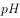

# 2019年420联考《行测》题（吉林甲级）（网友回忆版）

> 言语理解与表达 · 35 题 · 吉林 2019

## 材料 1

<b>阅读下面的短文，回答</b><b>51-55</b><b>题</b>

        无论是火爆一时的综艺节目《国家宝藏》，还是深受年轻观众喜欢的纪录片《我在故宫修文物》，抑或是“故宫淘宝”上那些妙趣横生的文创产品、故宫微博上那些“萌萌哒”的“段子”······进入网络时代，故宫仿佛开始了“逆生长”，不断以新的方式，走进公众尤其是年轻人的生活。

        习近平总书记指出，“一个博物院就是一所大学校”。古建筑群、院藏文物和专家学者的智力资源，是故宫博物院独具特色的资源。如何让这些资源实现创造性转化、创新性发展？故宫给出的答案中，排在第一位的是“公众”。再珍稀的文物，也是为人而保存；再高深的学问，也是为人而研究。“要让文物说话，让历史说话，让文化说话”，其最终的落脚点，都是千千万万的今人与后人。

        正是抱持着这样的目的，故宫把目光更多地投向年轻一代。从“故宫萌物”系列文创产品，到人见人爱的“故宫猫保安”，再到各种令人<u>      </u>的《上新了·故宫》，紧扣年轻人的笑点、兴趣点，故宫告别了<u>      </u>的形象，在撩拨时代心弦的过程中一点点走近年轻人，血脉筋骨也为之舒活。

        年龄的“跨界”填平文化的代沟，更多的跨界催生无数意外的惊喜。正在打造中的“数字故宫”，不仅注重博物馆与社会的融合，更把多学科的跨界融合、传统技艺和现代科技的跨界融合当作追求，塑造博物馆的新形态。一旦这些“完美碰撞”擦出火花，故宫就“活”了起来、“火”了起来，产生1+1远大于2的效果。我们欣然看到，这种“故宫模式”近年来已经影响和带动了一大批国内文博机构，甚至在年轻一代中引发了报考故宫博物院以及大专院校文博专业的热潮······

        2020年是故宫600岁生日，“把一个壮美的故宫完整地交给下一个600年”，是故宫孜孜以求的目标。我们“交给下一个600年”的是一堆冰冷的文物，还是一个涌动着鲜活生命力的文化存在？对于所有从事传统文化保护传承工作的人来说，这是值得思考的重大问题。

### 第 1 题　qid 2376832 · 片段阅读

对第1段文字的主要观点概括最准确的是：

- **A**. 数字技术为故宫文化的传播打开了新局面
- **B**. 故宫以新颖的方法和形式融入了大众生活　✅
- **C**. 年轻人是故宫文创产品的最主要消费群体
- **D**. 传统文化的时尚化表达有多种多样的形式

**答案**：B

**官方解析**

文段首先通过“无论是······还是······抑或是······”列举出多种与故宫有关的新兴事物，省略号之前均为举例内容。尾句指出进入网络时代，故宫通过新的方式走进大众、走进年轻人，故文段重在强调故宫通过新的方式走进了公众，对应B项。
A项，“数字技术”属于文段话题的缩小，文段指的是“网络时代”，且“新局面”表述不明确，文段尾句明确指出走进公众，排除；
C项，“故宫文创产品”偏离文段核心话题，文段尾句围绕“故宫”这一话题展开，且“最主要消费群体”文段并未提及，无中生有，排除；
D项，偏离文段核心话题，文段围绕“故宫”这一话题展开，且文段重在说明故宫走进公众，选项中并未提及，排除。
故正确答案为B。
【文段出处】《故宫缘何变得如此年轻？》

---

### 第 2 题　qid 2376835 · 片段阅读

第2段旨在说明：

- **A**. 应该让故宫所内蕴的丰富资源惠及大众　✅
- **B**. 如何让故宫文物古为今用是一个新课题
- **C**. 传统文化资源的挖掘功在当代利在千秋
- **D**. 一座故宫就是一所拥有特色资源的大学

**答案**：A

**官方解析**

第二段首先引用习总书记的话，随后引出“故宫的资源”这一话题，接下来通过提出如何实现转化和发展的问题，之后给出答案，即“排在第一位的是‘公众’。”，即强调公众的重要性，最后通过并列结构进行加强论证。故文段的重点是强调故宫的资源要让公众受惠，对应A项。
B、C、D三项，均未提及“公众”这一主题词，偏离中心，排除。
故正确答案为A。
【文段出处】人民日报《故宫缘何变得如此年轻？》

---

### 第 3 题　qid 2376836 · 逻辑填空

填入第3段划横线部分最恰当的一组是：

- **A**. 欲罢不能  老成持重
- **B**. 忍俊不禁  正襟危坐　✅
- **C**. 赞不绝口  一本正经
- **D**. 目不暇接  不苟言笑

**答案**：B

**官方解析**

本题从第二空入手，根据后文“一点点走近年轻人，血脉筋骨也为之舒活”可知，文段将故宫拟人化，前后形成对比，说明故宫以前只是端坐着，没有走近年轻人和舒活筋骨，B项“正襟危坐”指整一整衣服，端正地坐着，与后文构成形象对应，符合文意，保留。A项“老成持重”指办事老练稳重，C项“一本正经”形容态度庄重严肃、郑重其事，D项“不苟言笑”指不随便说笑，亦形容态度庄重严肃，均无法与后文的“一点点走近年轻人，血脉筋骨也为之舒活”形成对应，排除。
第一空，代入验证，B项“忍俊不禁”指忍不住要发笑，与后文“紧扣年轻人的笑点”对应恰当，符合语境，当选。
故正确答案为B。
【文段出处】《故宫缘何变得如此年轻？》

---

### 第 4 题　qid 2376838 · 片段阅读

对第4段中的“故宫模式”，理解最准确的一项是：

- **A**. “1+1＞2”
- **B**. 数字故宫
- **C**. 文化卖萌
- **D**. 跨界融合　✅

**答案**：D

**官方解析**

此题为词句理解题，首先定位原文，找到“故宫模式”。根据“这种‘故宫模式’”可知，重点关注“故宫模式”之前的内容。根据“不仅注重博物馆与社会的融合，要把多学科的跨界融合、传统技艺和现代科技的跨界融合当作追求，······一旦这些‘完美碰撞’擦出火花，故宫就‘活’了起来、‘火’了起来，产生11远大于2的效果”可知，前文重点强调的是“跨界融合”，对应D项。

A项“112”和B项“数字故宫”均是“跨界融合”带来的结果，并非一种模式，排除；C项“文化卖萌”无中生有，排除。

故正确答案为D。

---

### 第 5 题　qid 2376840 · 片段阅读

最适合做这篇短文标题的是：

- **A**. 网络时代让“老年”故宫“返老还童”　✅
- **B**. 传统文化保护：是使命，也是课题
- **C**. 故宫的鲜活生命力从何而来
- **D**. 今日故宫，“跨界”的“网红”

**答案**：A

**官方解析**

文章首先提出，进入网络时代，故宫开始了“逆生长”，走进了年轻人的生活。后面接着指出故宫把目光投向了年轻一代，一点一点走进年轻人，开始打造“数字故宫”，在年轻一代当中引发了数字热潮。最后一段思考怎么把一个完整的故宫交给下一个600年，让故宫永葆生命力。所以整个文段都在论述利用网络时代让故宫保持年轻，对应A项。
B项，“传统文化保护”把“故宫”范围扩大，排除；
C项，“从何而来”表述不明确，文段体现的是网络时代，排除；
D项，“跨界”对应文段第四段，并不是对整个文段的概括，表述片面，排除。
故正确答案为A。
【文段出处】《人民日报：故宫缘何变得如此年轻？ 》

---

### 第 6 题　qid 2376616 · 逻辑填空

韩愈云：“千里马常有，而伯乐不常有。”这里说的伯乐，就是千里马的“贵人”，如果没有伯乐出现，千里马也会淹没于芸芸众“马”之中虚耗宝贵年华。古往今来，很多功成名就者都是在关键时刻遇上            的“贵人”，加之自身的实力和努力没有辜负“贵人”所赐予的机遇，终得以            。

填入划横线部分最恰当的一组是：

- **A**. 火眼金睛  脱颖而出
- **B**. 慧眼识珠  有所作为　✅
- **C**. 独具慧眼  崭露头角
- **D**. 明察秋毫  出人头地

**答案**：B

**官方解析**

第一空，由前文“如果没有伯乐出现，千里马也会淹没于芸芸众‘马’之中虚耗宝贵年华”可知，横线处表达“贵人”能够在众多马之中找出千里马，体现其眼光敏锐之意。B项“慧眼识珠”指具有独到眼光，高明的见解，C项“独具慧眼”指能看到别人看不到的东西，形容眼光敏锐，见解高超，B、C两项均符合文意，保留。A项“火眼金睛”形容人的眼光锐利，能够识别真伪，与文意不符，排除；D项“明察秋毫”原形容人目光敏锐，任何细小的事物都能看得很清楚，现多形容人能洞察事理，与文意不符，排除。
第二空，由前文“功成名就者”可知，横线处表达其最终取得了成功，B项“有所作为”指可以做事情，并能取得较大的成绩，符合文意，当选。C项“崭露头角”比喻突出地显露出才能和本领，无法体现成功之意，排除。
故正确答案为B。
【文段出处】《你生命中的那些“贵人”》

---

### 第 7 题　qid 2376628 · 逻辑填空

以家为         的家族文化传承，把家风、家教、家规、家德注入每代传承人心中，融入到企业文化中，形成部分老字号维系生存的         。
填入划横线部分最恰当的一项是：

- **A**. 桥梁  动力
- **B**. 媒介  根底
- **C**. 源头  基础
- **D**. 依托  根脉　✅

**答案**：D

**官方解析**

第一空，横线处要体现“家”对于“家族文化传承”很重要，通过后文“把家风、家教、家规、家德注入每代传承人心中”可知，需要依靠“家”才能传承家族文化，D项“依托”指依靠凭借，符合文意，保留。C项“源头”指水发源处，比喻事物的本源，可理解为家族文化来源于家，也可保留。A项“桥梁”、B项“媒介”指建立双方联系的途径，体现不出“家”对于“家族文化”起到的作用，均排除。
第二空，横线处体现出“家族文化传承”把“家”的很多信条注入每代传承人心中，维系老字号的生存，D项“根脉”与C项“基础”语意均符合，但D项“根脉”更加形象、生动，对比优选。
故正确答案为D。
【文段出处】人民日报《忠厚如何传家“酒”》

---

### 第 8 题　qid 2376812 · 逻辑填空

填入划横线部分最恰当的一组是
关于培养创新人才，教育部最近提出的“新工科”教育非常重要。“新工科”最新公布的指标是“十、百、万”，即“十个专业方向，百种教材，一万名教师”。这是一次创新之举，不但要带来更多知识，更要搭建一个知识拓展的        ，要培养造就一批多样化、创新型的工程科技人才，为我国产业发展提供            。

- **A**. 空间  人才队伍
- **B**. 平台  智力支持　✅
- **C**. 天地  人才保障
- **D**. 舞台  智力保障

**答案**：B

**官方解析**

第一空，填入横线部分与“搭建”搭配，指搭造建立，B、D两项搭配恰当，A项“空间”往往搭配“拓展”、“开辟”，C项“天地”往往搭配“打开”、“闯出”，和“搭建”搭配不当，排除A、C两项。
第二空，填入横线词语，根据一空搭建平台、舞台，即表达人才对产业发展起到支撑作用，B项“智力支持”“支持”侧重强调支撑，支柱，可以和前文形成对应，符合文意，当选，D项“智力保障”，“保障”侧重强调必要条件，不符合文意，排除。
故正确答案为B。
【文段出处】《创新要落在实干上》

---

### 第 9 题　qid 2376658 · 逻辑填空

“爱的匮乏限制了我们对人生的想象力。”我们常常说，因为我们缺爱，所以没有安全感。也许是我们            了，是因为我们拿不出爱，我们才会有庞大的不安全感。你自己不愿意先拿出来，对世界的        才是无爱的。

填入划横线部分最恰当的一项是：

- **A**. 舍本逐末  回应
- **B**. 本末倒置  投射　✅
- **C**. 吹毛求疵  认识
- **D**. 舍近求远  映射

**答案**：B

**官方解析**

第一空，根据文意可知，针对“缺少安全感的原因”，横线后认为“不愿意先付出爱”是其原因，横线前认为“缺爱”，即无人给予关爱是其原因，前后原因刚好相反。A项“舍本逐末”比喻做事不抓住主要的问题，而专顾细枝末节。现多用于指轻重主次颠倒，不会明辨轻重缓急，B项“本末倒置”比喻把主要的和次要的、本质和非本质的关系弄颠倒了，均符合文意，保留。C项“吹毛求疵”比喻故意挑剔别人的缺点，寻找差错，D项“舍近求远”形容做事走弯路，均与文意不符，排除。
第二空，根据文意可知，横线处应体现我们对世界的一种主动的行为。B项“投射”指发射，投掷，是一种主动的行为，符合文意，当选。A项“回应”指回答，答应，通常为被动，与文意不符，排除。
故正确答案为B。
【文段出处】《想跟你过一辈子，但爱你很累》

---

### 第 10 题　qid 2376813 · 逻辑填空

填入画横线部分最恰当的一项是
啥是佩奇？这只其貌不扬的粉红小猪，本身就是家庭亲情的象征。父母、姐弟，简简单单、快快乐乐地生活在一起。这个“舶来品”的故事，        了中国老百姓“老婆孩子热炕头”的淳朴理想，也符合孩子们对童年、父母、家庭日常的真实感受。这是最基本的人伦感情，也是全世界通用的语言。

- **A**. 迎合
- **B**. 暗合　✅
- **C**. 符合
- **D**. 吻合

**答案**：B

**官方解析**

依据前文提示，“舶来”即外来，空中所填的词需要体现“外来故事”和“国内淳朴理想”的关系，且由“也符合······”可知，横线处应与“符合”意思相近。即体现“不同地域、不同文化、不同人物之间，却有着相同的意蕴和情感”之意，强调“佩奇”与“中国淳朴理想”两者间相符的偶然性。B项，“暗合”指没有经过商讨而意思恰巧相合，符合文意，当选。
A项，“迎合”指故意使自己的言语或举动适合别人的心意，文段未体现“佩奇”主动适应老百姓的理想，与文意不符，排除；
C项，“也”连接前后为并列关系，与后文“符合”重复，不符合日常用语习惯，表述过于单一，且未体现“偶然性”之意，排除；
D项，“吻合”指完全符合，侧重“一模一样”，程度太重，且未体现“偶然性”之意，排除。
故正确答案为B。
【文段出处】《&lt;啥是佩奇&gt;一夜爆红说明什么？》

---

### 第 11 题　qid 2376623 · 语句表达

作为网络时代表达情感的一种方式，表情包已经融入网友们的交流之中，各种表情包层出不穷，                    ，好不热闹。

填入划横线部分最恰当的一项是：

- **A**. 青出于蓝胜于蓝
- **B**. 这山望着那山高
- **C**. 前有轱辘后有辙
- **D**. 你方唱罢我登场　✅

**答案**：D

**官方解析**

依据前文，横线处与前文语义相近。“层出不穷”意指接连不断地出现，尚未穷尽。D项“你方唱罢我登场”意为你刚唱完，我就登上场来，体现出接连不断的意思，能够与“层出不穷”构成并列，当选。
A项“青出于蓝胜于蓝”指人经过学习之后可以得到提高,常指学生超过老师；B项“这山望着那山高”比喻对自己目前的工作或环境不满意,老认为别的工作、别的环境更好；C项“前有轱辘后有辙” 前边有车行过，后边就有车辙，比喻前人取得了经验教训，后人就有了可以遵循的榜样。均无法与“层出不穷”构成并列，排除。
故正确答案为D。
【文段出处】《文物表情包制作 娱而不能愚》

---

### 第 12 题　qid 2376815 · 逻辑填空

填入划横线部分最恰当的一组是
阿耐的《都挺好》延续其《欢乐颂》的都市情感、代际相处、职场生存等热点话题，将《欢乐颂》中安迪的智慧与樊胜美的身世集于女主角苏明玉一身。不仅令都市女性            ，也成功将原本站在不同角色背后的读者的注意力归拢起来。网络文学多以皇帝娘娘、天外飞仙为主角，可谓玄幻、穿越竞放，阿耐的这些作品就显得有些        。

- **A**. 触景生情  特别　✅
- **B**. 心照不宣  孤立
- **C**. 抚今追昔  低调
- **D**. 心有灵犀  朴素

**答案**：A

**官方解析**

本题可从第二空入手，横线处要体现将网络文学和阿耐的作品进行对比，阿耐作品的特点。前文提到，网络文学多为玄幻、穿越主题，而阿耐的作品主要讨论都市情感等写实的主题，故横线处表示阿耐作品的风格和网络文学的风格是不一样的，A项“特别”指不普通，与众不同，符合文意，保留。B项“孤立”指孤独无助；C项“低调”指谦虚谨慎的态度，不张扬；D项“朴素”指俭朴，不奢侈，均与文段语境不符，排除。
第一空代入验证，A项“触景生情”指受到眼前景物的触动，引起联想，产生某种感情，体现出女性在看到《都挺好》这部热剧时受到了触动，且与横线后文“将原本站在不同角色背后的读者的注意力归拢起来”形成对应，符合文意，当选。
故正确答案为A。
【文段出处】《接地气 有底气——评评阿耐的网络文学创作》

---

### 第 13 题　qid 2376618 · 逻辑填空

最初版本的个税APP启用以后，人们对租户必须填写房东信息产生质疑，担心此举会导致房东多缴一笔出租税，因而房东通过涨房租来对冲损失，客观上造成了房东和租户的零和博弈，这显然不是减税政策的本意。新版个税APP，正是意在回应舆论关于国家减税降负诚意的质疑。就实际效果来说，新版个税APP一经公布，公众就掀起一片力挺之声，安抚效应可谓            。

填入划横线部分最恰当的一项是：

- **A**. 显而易见
- **B**. 卓有成效
- **C**. 立竿见影　✅
- **D**. 一蹴而就

**答案**：C

**官方解析**

文段首先指出在最初个税APP启用以后出现了问题，不符合减税政策的本义。接着文段指出新版个税APP发布后，减轻了公众的质疑，通过“新版个税APP一经公布，公众就掀起一片力挺之声”，表明横线所填成语表示新版个税APP的安抚效应是立即就产生，立刻就有了效果，C项“立竿见影”比喻立刻见到功效，常与“效应”搭配，符合文意，为正确答案。
A项，“显而易见”形容事情或道理很明显，很容易看清楚，多用于说话、写文章等，不能体现出立刻就产生效果，排除；B项，“卓有成效”形容有突出的成绩和效果，通常与工作、做事情等搭配，与“效应”搭配不当，排除；D项，“一蹴而就”形容事情很容易办成，与文意不符，排除。
故正确答案为C。
【文段出处】《个税App不再收集房东信息，稳定普惠减税预期》

---

### 第 14 题　qid 2376661 · 语句表达

一家国际媒体曾经说过，中国奇迹的出现，源于中国有世界上“最勤奋的人”。当别人      时，中国人心中满是“发展才是硬道理”；当一些发达国家的人只想着休闲，中国人心中却在默念“      ”。几十年来，千千万万普通人以梦为马，用奋斗定义人生价值，在奔跑中抵达远方，早已      为中国人民的一种精神气质。
填入划横线部分最恰当的一项是：

- **A**. 坐在台上看大戏  艰苦奋斗  固化
- **B**. 做一天和尚撞一天钟  夜以继日  凝练
- **C**. 坐等天上掉馅饼  只争朝夕  内化　✅
- **D**. 不知哪块云彩下雨  砥砺前行  定型

**答案**：C

**官方解析**

第一空，根据文意可知，横线处应与“发展才是硬道理”表意相反，体现出不发展，不勤奋之意，B项，“做一天和尚撞一天钟”比喻遇事敷衍，得过且过，C项，“坐等天上掉馅饼”指什么都不做，等待着好处到来，B、C两项均可体现出不发展，不勤奋之意，保留；A项，“坐在台上看大戏”指看热闹，D项，“不知哪块云彩能下雨”强调事物难以预料，均体现不出不发展，不勤奋之意，排除。
第二空，所填成语搭配“默念”且与“休闲”表意相反，B项，“夜以继日”形容加紧工作或学习的状态，C项，“只争朝夕”比喻抓紧时间，力争在最短的时间内达到目的，均符合文意，保留。
第三空，横线处搭配“精神气质”且前文均在强调“中国人心中”，C项，“内化”为“一种精神气质”搭配恰当，符合文意，当选；B项，“凝练”指言简意赅，与文意不符，排除。
故正确答案为C。
【文段出处】《做努力奔跑的追梦人》

---

### 第 15 题　qid 2376659 · 逻辑填空

给科研人员减负，更需要从基层做起。很多好政策之所以落地效果大打折扣，就是因为卡在了“最后一公里”。科研院所等单位是抓落实的最后环节，要进一步解放思想，      政策，      政策，      主体责任，      管理。
填入划横线部分最恰当的一项是：

- **A**. 理解  利用  发挥  强化
- **B**. 学习  运用  强化  优化
- **C**. 吃透  用好  担起  优化　✅
- **D**. 分析  用好  明确  强化

**答案**：C

**官方解析**

第一空，搭配“政策”，根据前文“落地效果大打折扣”、“抓落实的最后环节”可知，横线处应体现对于落实政策的作用，C项“吃透”指了解透彻，填入文段表达在透彻了解了政策之后，更有助于落实政策，语义恰当，保留。A项“理解”、B项“学习”、D项“分析”，均无法体现充分了解政策之意，故不及C项契合文意，排除A、B、D三项。
第二、三、四空，代入验证，“用好政策”、“担起主体责任”、“优化管理”均搭配合适，语义恰当，当选。
故正确答案为C。
【文段出处】《为科研人员减负要综合施策》

---

### 第 16 题　qid 2376816 · 片段阅读

李克强总理勉励同学们说，①.国家不仅需要高端科研人才，也非常需要高技能人才，你们有真正的技术，就业门路就广，收入也会较高。②.希望大家注重培养专业精神、职业精神、工匠精神，这是成为人才很重要的素质。③.他叮嘱随行部门负责人，培养人才不能只在教室，也不能只在车间田野。④.要深化教育体制改革，支持企业和社会力量兴办职业教育，用高素质人力资源推动高质量发展。
“职业教育是教育和社会实际相结合的有效载体。”这句话是从上段文字中抽离出来的，它在文中最合适的位置是

- **A**. ①
- **B**. ②
- **C**. ③
- **D**. ④　✅

**答案**：D

**官方解析**

填入语句需要和上下文话题衔接恰当，填入语句围绕“职业教育”来展开，强调教育与社会实际相结合，文段④的位置前文指出“培养人才不能只在教室，也不能只在车间田野”，可知强调培养人才要结合使用多种方法，所填语句与前文衔接恰当。后文提及“支持企业和社会力量兴办职业教育”，与所填语句话题一致，D项当选。
A项、B项、C项，前后均未提及“职业教育”，故与所填语句话题不一致，排除。
故正确答案为D。
【文段出处】《李克强：更大激发市场主体活力 着力破解发展和民生难题》

---

### 第 17 题　qid 2376647 · 语句表达

下列各句中诗文引用不恰当的一项是

- **A**. 理想信念坚定了，目标自然就崇高了，就能“不畏浮云遮望眼”，就能“心底无私天地宽”，就能“风雨不动安如山”
- **B**. “长江后浪推前浪”，前车之鉴应当时刻牢记；“一篙松劲退千寻”，信念之基不容须臾动摇　✅
- **C**. “志不立，天下无可成之事”，如果理想信念立不起来，那么思想上就会软弱怯懦、逡巡摇摆，行动上就会畏风畏雨、望秋先零
- **D**. “君子务本，本立而道生”，只有理想信念这个“本”坚固了，党性才会纯正，政治才会坚定，才能心无旁骛、一往无前地拼搏奋斗

**答案**：B

**官方解析**

A项，“不畏浮云遮望眼”指高瞻远瞩的人，不怕被浮云遮蔽住眼睛；“心底无私天地宽”强调无私；“风雨不动安如山”强调面对困难的情况岿然不动。根据“理想信念坚定了，目标自然也就崇高了”，可知，文段强调坚定理想信念、树立崇高目标的重要性，后文诗句均可体现出坚定理想信念、树立崇高目标的意义，起到论证作用，故诗文引用恰当，排除；
B项，“长江后浪推前浪”比喻新人胜旧人，和“前车之鉴”比喻把前人或以前的失败作为借鉴的语意无关，故诗文引用不恰当，当选；
C项，“志不立，天下无可成之事”强调志向，目标，理想的重要性，后文“如果理想信念立不起来，······行动上就会畏风畏雨、望秋先零”强调没有理想信念目标的后果，对前文起到论证作用，故诗文引用恰当，排除；
D项，“君子务本，本立而道生”强调做人要注重根本，后文“‘本’坚固了，党性才会纯正······一往无前地拼搏奋斗”也是在强调根本的重要性，故诗文引用恰当，排除。
本题为选非题，故正确答案为B。

---

### 第 18 题　qid 2376817 · 片段阅读

想减肥，可能真不用那么折腾。美国杜克大学心理学研究小组对105名志愿者进行分组实验，结果显示：在3个月中，每天用手机程序记下摄入的每样食物的那些超重者，平均体重降低了2.4公斤，只比接受了复杂营养学干预并坚持健身的对照组少减400克。
依据文意，下列判断正确的一项是

- **A**. 杜克大学的实验证明，人们想胖就能胖，想瘦也能瘦
- **B**. 用手机程序达成减肥目的，发挥了积极心理暗示作用
- **C**. 仅仅用手机程序记下每天食谱的减肥法也能发挥作用　✅
- **D**. 营养学干预和坚持健身是最科学和最有效的减肥方法

**答案**：C

**官方解析**

文段首句提出想减肥不用那么折腾，接着论述了一项实验研究结果，即每天用手机程序记录下摄入的食物，也可以达到减肥的效果，并且减肥的重量只比营养学干预和坚持健身的稍微差一点，故文段重在强调用手机程序记录下每天摄入的食物也可以达到减肥的效果，C项“仅仅用手机程序记下······也能发挥作用”符合文意，当选。
A项，文段中的实验论述通过一个行为达到减肥的效果，即用手机程序记录下每天摄入的食物，而非仅仅主观上“想瘦也能瘦”，且文段主要论述“减肥”，未提及“想胖就能胖”，排除；
B项，“积极心理暗示作用”文段未提及，无中生有，排除；
D项，“最”文段未提及，无中生有，排除。
故正确答案为C。

---

### 第 19 题　qid 2376650 · 片段阅读

以下各句划线的部分，在修辞上与其他不同的一项是

- **A**. 
生活在碎片时代，不能<u>像碎片一样生活</u>

- **B**. 
亚马逊新版电子书阅读器浸入两米深的清水后仍可使用。现在有了能应付浴室和沙滩的<u>“口袋里的书店”</u>，书虫们还会忠实于他们潮湿的平装书吗

- **C**. 
<u>“磨刀不误砍柴工”</u>，花在度假上的时间，会从高效的工作那里补回来
　✅
- **D**. 
当善良的人被欺骗，除了愤怒外，还会下意识地开启防御机制，自带<u>“防护网”</u>

**答案**：C

**官方解析**

A项，“像碎片一样生活”，把人比喻成碎片，用的是比喻的修辞手法；B项，“口袋里的书店”，把亚马逊新版电子阅读器比喻成“口袋里的书店”，用的是比喻的修辞手法；C项，“磨刀不误砍柴工”，是引用俗语，用的是引用的修辞手法；D项，“防护网”，把防护机制比喻成网，用的是比喻的修辞手法。ABD三项均为比喻的修辞手法，锁定C项。
本题为选非题，故正确答案为C。

---

### 第 20 题　qid 2376818 · 片段阅读

明星数据造假早已不是新鲜事，明星为了维持热度，获得更多商业价值，不惜买流量撑场面。流量明星依靠传播数据造假，看似能够营造出“炙手可热”“流量小生”的幻象，或许在一段时间内会收获一定的名利，但终究如“梦幻泡影”。这种短视行为不仅不利于自身成长，还会不断透支自己的信誉，最终被观众和时代抛弃。
根据文段，最符合作者观点的是

- **A**. 明星依靠数据造假，暂时收获名利，却最终输掉事业　✅
- **B**. 数据造假是明星为了维持自己的商业价值，情有可原
- **C**. 明星利用传播数据造假，间接促进了影视产业的繁荣
- **D**. 陶醉在名利泡影之中的明星，忽略了自身能力的提高

**答案**：A

**官方解析**

文段先指出明星数据造假早已不是新鲜事，并简要介绍了什么是明星数据造假。随后分析明星数据可能会营造出受欢迎的假象，或者短时间内收获名利，但终究是泡影，最后通过“这种短视行为”总结前文，得出结论，强调数据造假带来的不良影响，故文段重在强调明星数据造假虽然短时间内看似有好处，但长久来看有极大弊端，对应A项。
B项对应转折之前的内容，非重点，且“情有可原”无中生有，排除；
C项“促进影视产业的繁荣”无中生有，排除；
D项“忽略了自身能力的提高”是产生影响的一方面，表述片面，排除。
故正确答案为A。
【文段出处】《流量造假只会透支信誉》

---

### 第 21 题　qid 2376819 · 片段阅读

某平台“蚂蚁森林”的出现，一定程度上满足了社会对于植树尽责形式创新的需要。它采取的是社会认养模式，由企业捐资，地方专业单位造林，公益机构管理，实质上是实现了义务植树的专业化。只要有植树造林的意愿，不管身在何方，每个人都可以在平台上实现自己的植树责任。这对于普及社会的义务植树意识，降低参与门槛，无疑大有裨益。
这段文字主要谈论的是

- **A**. 某平台推出“蚂蚁森林”这一项目的根本目的
- **B**. 社会公益活动如何有效地利用移动互联网平台
- **C**. “蚂蚁森林”对植树尽责形式的创新及其意义　✅
- **D**. 大众义务植树尽责形式的多元化和专业化趋势

**答案**：C

**官方解析**

文段首先指出“蚂蚁森林”满足了社会对植树尽责形式创新的需要，然后具体解释说明“蚂蚁森林”是如何创新的，强调了“蚂蚁森林”创新的特点，然后，尾句强调了“蚂蚁森林”的意义，即可以“普及义务植树意识、降低参与门槛”。文段为并列结构，故文段意在强调“蚂蚁森林”创新的特点和意义，对应C项。
A项，“根本目的”表述为无中生有，排除；
B项，缺少“蚂蚁森林”“植树”等关键词，偏离文段重点，排除；
D项，缺少“蚂蚁森林”相关的关键词，偏离文段重点，排除。
故正确答案为C。
【文段出处】《“互联网+全民义务植树”是数字中国的新成果》

---

### 第 22 题　qid 2376821 · 片段阅读

“朽木不可雕也。”生活中，常用这句话形容一个人不堪造就、无药可救。朽木当真毫无价值？朋友是一位根雕师，那些被人们用来烧火做饭的树根、年代久远的枯木，经他一番精心加工，重放异彩，变成了一件件精美绝伦的艺术品。看来，      。
填入划线处最恰当一项的是

- **A**. 枯株朽木也是宝
- **B**. 腐朽，也可化为神奇
- **C**. 玉不琢不成器，木不雕不成材
- **D**. “朽木”未必不可雕　✅

**答案**：D

**官方解析**

横线出现在结尾，且由结论词“看来”引导，故横线处起到总结前文的作用。
文段开篇引用“朽木不可雕也”，并指明这句话用于形容一个人无法改造，随后提出疑问，即朽木是否毫无价值，最后通过根雕师的故事表明了通过精心加工，朽木能够变成精美绝伦的艺术品。故文段重点强调 “朽木”可以通过雕刻加工展现价值，对应D项。
A项“枯株朽木也是宝”，并没有体现雕刻加工的作用，排除；
B项“腐朽，也可化为神奇”，并未提及核心话题“朽木”，排除；
C项“玉不琢不成器”在文段没有体现，无中生有，排除。
故正确答案为D。
【文段出处】《朽木也可雕》

---

### 第 23 题　qid 2376667 · 片段阅读

中国人1000多年前就发明了世界上最早的机械时钟装置水运浑天仪，每刻击鼓，每辰撞钟，比国外的自鸣钟早出现600多年。然而，这套复杂的计时系统没过多久便被束之高阁。无视创新，让曾经辉煌的中国科学技术发展近乎停滞。
这段文字意在强调

- **A**. 中国科学技术的历史是很悠久的
- **B**. 中国的自鸣钟居于世界领先水平
- **C**. 不重视创新使中国科技趋于落后　✅
- **D**. 推陈出新才是科技发展的原动力

**答案**：C

**官方解析**

文段开篇通过列举水运浑天仪的例子说明当时我国科学技术处于领先地位。接下来通过转折词“然而”强调了不重视创新，中国科学技术发展就会停滞、落后，对应C项。
A项，“历史悠久”、B项，“自鸣钟”对应转折前的内容，非重点，排除；
D项，未提及文段核心话题“中国”，偏离文段中心，且“原动力”指产生动力的力，引申为本因、根源，属于无中生有，排除。
故正确答案为C。
【文段出处】人民日报人民论坛《开年闲话“时间观”》

---

### 第 24 题　qid 2376822 · 片段阅读

近年，书法教育呈现出一种新生态。微博、微信等移动新媒体APP的大众化运用，凭借其便捷、高速、批量的传播优势，在书法界迅速拓展为书法教学网络平台，也聚集了大量且不断倍增的书法爱好者，书法教育的扁平化和“泛化”情势骤然摆在大家面前。
下列观点，能从文中推出的一项是

- **A**. 书法网络化教学的负面效应将不断倍增
- **B**. 传统的书法教学方式面临被淘汰的可能
- **C**. 移动新媒体工具使书法教育更加大众化　✅
- **D**. 书法教学APP经营的目的不在“教育”

**答案**：C

**官方解析**

A项，根据“在书法界迅速拓展为书法教学网络平台，也聚集了大量且不断倍增的书法爱好者”可知，移动新媒体APP平台对于书法教育来说是起到积极作用的，故“负面效应将不断倍增”与文意相悖，排除；
B项，“传统的书法教学方式面临被淘汰”，文段没有提及，无中生有，排除；
C项，根据“聚集了大量且不断倍增的书法爱好者，书法教育的扁平化和‘泛化’情势骤然摆在大家面前”可知，前文所述的移动新媒体工具使书法教育受众更多，即更加大众化，表述正确，当选；
D项，“书法教学APP”、“经营的目的”文段均没有提及，无中生有，排除。
故正确答案为C。
【文段出处】《网络书法教学：用好APP》

---

### 第 25 题　qid 2376646 · 片段阅读

在中国古典园林的发展过程中，唐代是一个十分重要的时期。关于古人的居住理想，白居易在《池上篇》中有过描绘——“十亩之宅，五亩之园。有水一池，有竹千竿。”从白居易笔下的描述中，不但能看到中式的栖居美学，通过“宅园一体”的居游观，也能体会到唐朝人对待自然的态度。
在作者看来，唐朝人对待自然的态度是

- **A**. 亲近自然　✅
- **B**. 敬畏自然
- **C**. 改造自然
- **D**. 主宰自然

**答案**：A

**官方解析**

文段首先提出唐代是中国古典园林的发展过程中的一个重要时期，接下来举出唐代白居易《池上篇》的例子说明古人的居住理想，最后对唐朝人对待自然的态度进行总结，是“‘宅园一体’的居游观”，即在自然中有居住也有游玩，人与自然是“你中有我，我中有你”，是一体的，对应A项。
B项“敬畏”指敬重、畏惧，与文段强调的“宅园一体”无关，排除；C项“改造”指改变，D项“主宰”指掌握、支配，均侧重强调人对自然的改造，与文意不符，排除。
故正确答案为A。
【文段出处】《书中自有“理想居所”》

---

### 第 26 题　qid 2376648 · 片段阅读

人的体质没有酸碱之分，“酸碱体质”本身就是一个伪理论。人体时刻都在进行新陈代谢，其中很多反应对酸碱度十分敏感，但人体有一套有效的调节系统，使值保持基本稳定，只会在一个很小的范围内波动。也就是说，食用任何食物几乎都不会改变人体的值，就算是喝醋也不会让人体酸性变得很强。至于“酸性体质生女，碱性体质生男”，更是无稽之谈。

这段文字重在说明

- **A**. “酸碱体质”论靠什么忽悠大众
- **B**. 为什么说“酸碱体质”论不可信　✅
- **C**. 人体自带调节酸碱度的功能
- **D**. 没有必要区分体质的酸碱性

**答案**：B

**官方解析**

文段首句提出观点，即“酸碱体质”本身是个伪理论，后文对这一观点进行解释说明，人体时刻都在进行新陈代谢，人体的值也是基本稳定的，不会有大的波动，后文通过“也就是说”进一步说明，食物不会改变人体的值，并且反驳了酸碱体质影响胎儿性别的说法，因此人体是没有酸碱体质之分的。文段为“”的结构，重在说明为什么“酸碱体质”是个伪理论，对应B项。

A项，“靠什么忽悠大众”无中生有，文段并未提及“酸碱体质”依靠什么忽悠大众，排除； 

C项，“自带调节酸碱度的功能”对应后文解释说明的部分，为分述句内容，非重点，排除；

D项，选项偏离文段核心话题，文段并非强调“是否需要区分体质”，而是重在强调“酸碱体质”的理论的错误，排除。

故正确答案为B。

【文段出处】《2018十大“科学”流言求真榜：酸碱体质居首》

---

### 第 27 题　qid 2376645 · 片段阅读

咖啡中含有的丙烯酰胺被列为2A类致癌物，但2A类致癌物在动物实验中具有明确致癌作用，人群研究结果未有定论，只是具有潜在风险。据《食品与化学毒物学》期刊的文章介绍，当人体每日每千克体重摄入2.6微克至16微克丙烯酰胺时，就会有罹患癌症的风险。按此计算，一个体重55公斤的人，每日丙烯酰胺耐受量为143微克。一杯160毫升咖啡，平均丙烯酰胺含量为0.45微克，每天至少要喝318杯才可能产生致癌风险。
下列表述最符合文意的一项是

- **A**. 2A类致癌物对动物的威胁比对人更大
- **B**. 人越瘦其耐受致癌物的能力也会越强
- **C**. 需加大丙烯酰胺致癌机制研究的力度
- **D**. 抛开日摄入量谈咖啡致癌是不科学的　✅

**答案**：D

**官方解析**

A项，根据文段“2A类致癌物在动物实验中具有明确致癌作用，人群研究结果未有定论”可知，2A类致癌物对人体的危险尚不确定，因此选项“2A类致癌物对动物威胁比人更大”表述有误，排除；
B项，文段并未将人类的胖和瘦与耐受致癌物的能力做比较，因此选项无中生有，排除；
C项，根据文段“2A类致癌物在动物实验中具有明确致癌作用，人群研究结果未有定论，只是具有潜在风险”可知，研究不确定的是2A类致癌物，并非“丙烯酰胺”，因此选项强调加大“丙烯酰胺研究力度”表述有误，排除；
D项，文段通过数据指出，人类喝咖啡达到一定数量才可能有致癌风险，因此选项“抛开摄入量谈咖啡致癌不科学”表述正确，当选。
故正确答案为D。
【文段出处】中国老年报《2018年“科学”流言求真榜发布》

---

### 第 28 题　qid 2376641 · 片段阅读

微信一开始就嵌入了传媒属性，无论是社交用户还是媒体内容用户，都很青睐微信。不过，微博与微信之间还是存在着显著差异，比如前者强调公开，后者侧重私密；前者突出内容制造，后者倾向内容传播；前者重心在社交，后者重心在媒体。于是，避免与微信正面交锋并谋求错位发展，构成了微博的战略主动脉。
这段文字意在说明微博的

- **A**. 销售渠道
- **B**. 发展策略　✅
- **C**. 市场效应
- **D**. 应用前景

**答案**：B

**官方解析**

文段开篇引出“微信”这一话题进行论述，接着通过“不过”进行转折，引出“微博”这一话题，着重论述微博和微信有差异。接下来进行举例论证，最后通过“于是”得出结论，论述微博为了不和微信正面交锋，从而形成了如今的一个发展方向，即重在说明微博的发展策略。对应B项。
A、C、D三项，“销售渠道”、“市场效应”、“应用前景”，无中生有，排除。
故正确答案为B。
【文段出处】《微博为什么那样能搏》

---

### 第 29 题　qid 2376823 · 语句表达

①随着上世纪八九十年代打工潮的涌动，春运在中国社会生活中的“存在感”越来越强。
②1981年3月，“铁路春运”一词首次出现在《人民日报》新闻标题中。
③但“春运的脚步”与“发展的车轮”始终协同前进。
④相信不少人都曾有这样的经历：通宵排队买票，肩扛大包小袋，上车差点挤成“照片”，下车感觉脱了层皮······
⑤虽然依旧不乏“槽点”，但人们的诉求已经悄然从“走得了”升级到“走得好”。
⑥当下，不管是购票途径，还是乘车体验、旅途时间、路径选择，都已经比从前有了长足进步。
将以上6个句子重新排列，语序正确的是

- **A**. ②①④③⑥⑤　✅
- **B**. ①④⑥②⑤③
- **C**. ②⑥④③①⑤
- **D**. ①⑤④③②⑥

**答案**：A

**官方解析**

首先对比选项，确定首句。①句说“春运在中国社会生活中的‘存在感’越来越强”，介绍了“春运”的后续发展情况。②句提到“铁路春运”一词首次出现。按照逻辑顺序，应该先首次出现“春运”，再来介绍“春运”的后续发展情况，故②句应在①句前，排除B、D两项。
对比A、C两项，②句后面分别为①、⑥两句，②①都在论述八九十年代春运的情况，⑥句论述当下春运的情况，根据时间先后顺序，应论述完八九十年代春运，再论述当下的春运，故②①相连，C项排除。
故正确答案为A。
【文段出处】《是什么支撑起“最大规模人类迁徙”》

---

### 第 30 题　qid 2376663 · 片段阅读

“刷脸”都可以办什么？在一些酒店，忘记携带身份证件的顾客，输入身份证号，刷脸识别成功后就可以办理入住；在大型会议展览，几秒钟即可完成刷脸并签到入场；在部分银行，使用自动取款机进行刷脸识别，无需带卡，按程序输入密码便可办理存取业务······此外，通过人脸识别技术的推广，“刷脸政务”也正在各地广泛应用。
这段文字重在说明

- **A**. “刷脸”技术具有无限广阔的应用前景
- **B**. “刷脸”技术是一项划时代的科技创新
- **C**. “刷脸”技术在服务领域得到广泛应用　✅
- **D**. “刷脸”技术使政府公共服务更加便民

**答案**：C

**官方解析**

文段开头引出刷脸这个话题，然后指出刷脸可以帮助人们在酒店办入住，可以帮助快速签到入场，可以办理存取业务，接着通过“此外”为标志，表示并列，说明“刷脸政务”也得到了广泛的应用。故文段是分号和此外连接的并列结构，需我们全面概括，即刷脸技术在多个领域得到应用，为人民提供服务和便利，对应C项。
A项，“无限广阔应用前景”范围扩大，且表述绝对，排除；
B项，“划时代的科技创新”非重点，文段体现的是刷脸的应用，排除；
D项，“政府公共服务”对应到文段最后一句话“刷脸政务”，表述片面，排除。
故正确答案为C。
【文段出处】《刷脸政务：高效便民办政事》

---

### 第 31 题　qid 2376824 · 片段阅读

“办公室里三代人，70后存钱，80后投资，90后负债，而90后的父母在替孩子还贷。”这句话，道出了以90后乃至00后为主的部分年轻人超前消费、负债消费的典型现象。年纪轻轻，却早早背上了债务负担成为“负翁”。有媒体调查发现，越来越低的借钱门槛、过度消费的刻意诱导等，对涉世未深的年轻人负债消费推波助澜。
作者接下来最可能谈论的是：

- **A**. 应该如何看待年轻人的透支消费　✅
- **B**. 子女买房、父母还贷的啃老现象
- **C**. 媒体对健康生活方式的引导作用
- **D**. 中国单身人群的消费行为大调查

**答案**：A

**官方解析**

根据提问方式可知，本题为接语选择题。文段首句阐述年轻人超前消费负债等现象，尾句论述媒体发现，越来越低的借钱门槛、过度消费等等会对年轻人的负债消费产生影响，故后文也应围绕“年轻人负债消费”这一核心话题展开，对应A项，透支消费为负债消费的同义替换。
B项“啃老现象”、C项“健康生活方式”、D项“单身人群的消费行为”均未提及年轻人过度消费这一核心话题，排除。
故正确答案为A。
【文段出处】《过度消费引发互联网一代年轻“负翁”频现》

---

### 第 32 题　qid 2376825 · 片段阅读

权威检测机构的检测结果显示，节能灯的紫外线辐射的总能量只占节能灯释放总能量的，即15瓦节能灯的紫外线功率仅为0.09瓦，而且节能灯里的长波紫外线不会穿透人体的真皮层。一般来说，只要符合标准的合格节能灯，都能把紫外线辐射量控制在安全范围内。此外，一只节能灯中只有几毫克汞，而且被封在灯里面，只有在一个很小的密闭环境下，几百只灯同时碎掉，汞全被一个人吸入才有可能对人造成伤害。但这种事件发生的概率几乎为零。

对文段的主要观点概括最准确的一项是：

- **A**. 正常情况下的节能灯不会对人体造成伤害　✅
- **B**. 人体的真皮层对紫外线具有自我隔离能力
- **C**. 权威机构关于节能灯安全的检测结论可信
- **D**. 使用我国生产的节能灯不必担心安全问题

**答案**：A

**官方解析**

文段首先通过列举权威检测机构检测结果中节能灯紫外线辐射的能量，强调“能把紫外线辐射量控制在安全范围内”；接下来通过表示并列关系的关联词“此外”，论述汞含量少，对人造成危害的概率十分小。故整个文段为并列关系，进行全面概括，即通过紫外线安全可控和汞伤人几乎不存在可能性来论述节能灯对人体比较安全，对应A项。
B项，“人体真皮层的隔离能力”对应“此外”之前内容，表述片面，排除；
C项，“权威机构的检测结论”对应“此外”之前内容，表述片面，排除；
D项，“我国生产的节能灯”文段并未提及，无中生有，排除。
故正确答案为A。
【文段出处】人民网《节能灯致癌还有毒？》

---

### 第 33 题　qid 2376826 · 片段阅读

近日，以“中科院之声”抖音引领的“科抖”爆红，这些以传播知识、普及科学为主的小视频，累计发布量超过300万，累计播放量已超过3388亿次；西安交大二院的一位医生弹唱“心电图之歌”，将急救知识唱给更多人，视频上传后，短时间内点击量超过26万次；北京林业大学的师生，利用新媒体技术传播植物知识，努力让公众读懂每一抹绿色······正是这些科普力量，架起了一座座连接公众与知识的桥梁，催生了科普的春天。
这段文字主要蕴含的道理是：

- **A**. 打铁还需自身硬
- **B**. 是金子总会发光
- **C**. 功夫不负有心人
- **D**. 众人拾柴火焰高　✅

**答案**：D

**官方解析**

文段首先通过两个分号表示的并列关系，论述中科院之声、西安交大、北京林业大学的科普视频爆红，公众点击量大的现状。随后通过程度词“正是”进行强调，引出文段重点，指代词“这些”即指代前文提到的一系列科普力量，强调正是有了这么多科普力量共同努力，公众才对科普有了更深的理解，科普工作才会发展得更好，D项“众人拾柴火焰高”比喻人多力量大，符合文意，当选。
A项，强调的是做事情的时候自身要有实力，但没有体现出由此带来的结果，即公众对科普知识有了更深的理解，偏离文段中心，排除；
B项，意为有才华的人不会被埋没，文段当中没有提及埋没人才，与文意无关，排除；
C项，强调的是努力付出的重要性，而文段强调的是大家的共同努力促成了好的结果，偏离文段中心，排除。
故正确答案为D。
【文段出处】人民网《走出实验室，科普圈新粉》

---

### 第 34 题　qid 2376649 · 片段阅读

古代有位李姓博州太守为官极其廉洁。一天，他在烛光下办公，有人送来家书。他当即灭掉公家蜡烛，点起自家蜡烛。“公烛之下，不展家书”，成为公私分明、严于律己的生动写照。现实中，有的人常在公私之间安装“旋转门”，公私不分。克己奉公，严以修身、俭以养德，光明正大、堂堂正正，这才是人间正道。
在这段文字中，安装“旋转门”所反映的问题实质是

- **A**. 界限模糊　✅
- **B**. 标准不一
- **C**. 职能错位
- **D**. 权责不明

**答案**：A

**官方解析**

文段首先通过“李姓博州太守”的事例引出公私分明的话题，强调其公事和私事的界限分的十分清楚。紧接着引出“现实中，有的人常在公私之间安装‘旋转门’，公私不分”，由此可知，“旋转门”使公私不分，也就是通过“旋转门”模糊了公与私之间的界限。故安装“旋转门”所反映的问题实质就是一些人模糊了公事和私事的界限，对应A项。
B项，“标准不一”指对待不同的事情有不同的标准，文段并未提及“标准”，无中生有，排除；
C项，“职能错位”指政府内部发生的职能混乱现象，即你干我的事，我越你的权，而文段并未提及，无中生有，排除；
D项，“权责不明”指权力和职责不明确，而文段反映的问题是公事和私事的界限分不清，并未提及“权责”，无中生有，排除。
故正确答案为A。
【文段出处】人民日报《把“立政德”放在最前面》

---

### 第 35 题　qid 2376828 · 片段阅读

中国书法的发达及其理念，使中国画离开逼真再现也离开了色彩。借助书法，中国画家虽然不曾努力发展透视、解剖以及光彩等科学方法，却可以再现他们心中的印象，以及内在的力量与热情。更为重要的是，中国绘画几乎摆脱了色彩的斑驳世界，以墨痕轻装简从，在白色的纸面或绢帛上表现心灵与精神的无限奥妙、幽深、简淡、玄远。
下列说法与原文不相符的是：

- **A**. 中国画的色彩单调但意境深远
- **B**. 线条简单束缚了中国画的创作　✅
- **C**. 书法让中国画的画法独树一帜
- **D**. 中国画追求写意但不重视写实

**答案**：B

**官方解析**

A项，根据“中国绘画几乎摆脱了色彩的斑驳世界，以墨痕轻装简从，在白色的纸面或绢帛上表现心灵与精神的无限奥妙、幽深、简淡、玄远”可知，表述正确，排除；
B项，“线条简单”文段并未提及，无中生有，当选。
C项，根据“中国书法的发达及其理念，使中国画离开逼真再现也离开了色彩”可知，表述正确，排除；
D项，根据“中国书法的发达及其理念，使中国画离开逼真再现也离开了色彩”及“在白色的纸面或绢帛上表现心灵与精神的无限奥妙、幽深、简淡、玄远”可知，表述正确，排除。
本题为选非题，故正确答案为B。
【文段出处】《“墨”的艺术》

---
