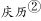
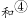
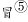

# 2019年上海市公务员录用考试《行测》题（B类）（网友回忆版）

> 言语理解与表达 · 25 题 · 上海 2019

## 材料 1

        与自然主义相对峙的是理想主义。在理想派看，自然并不全美，美与丑相对，有比较后有美丑，美自身也有高下等差，艺术对于自然，应该披沙拣金，取长弃短。理想主义比自然主义较胜一筹，因为它虽不否认艺术模仿自然，却以为这种模仿并不是呆板的抄袭，须经过一番理想化。理想化有两种意义。一种是指凭着想象和情感，将自然事物重新加以组织、整理和融会贯通使所得的艺术作品自成一种完整的有机体，其中部分与全体有普遍的必然的关联。因此，艺术作品虽自然（Natural）而却又不是生糙的自然（Nature），它表现出艺术家的理想性格和创造力。就这个意义说，理想主义是对的，凡是艺术都带几分理想性，因为都带有几分创造性和表现性。这种见解发源于亚里斯多德。他在《诗学》里说诗比历史更是“哲学的”（意思是说更真），因为历史只记载已然的个别的事物，诗则须表现必然的普遍的真理，前者是模仿殊相，后者是模仿共相。用近代语言来翻译，他的意思是说历史只记载自然界繁复错乱的现象，诗和艺术则更进一层把自然现象后面的原理，用具体的形式表现出来。

        后人误解亚里斯多德所说的“共相”（Universals），以为“共相”就是“类型”（Type），于是理想主义的另一种意义就起来了，所谓“理想”（Idea）就是“类型”，类型就是最富于代表性的事物，“代表性”就是全类事物的共同性。依这一说，艺术所应该模仿的不是自然中任何事物而是类型。比如说画马，不能只着眼某一匹马，须把一切马的特征画出，使人看到所画的马便觉得一切的马都恰是这样。同理，艺术所表现的人物，都不应只能适合于某一时某一地，要使人随时随地都觉得它近情近理。如果“天下老鸦一般黑”，你画老鸦就一定把它画成黑的；纵然你偶然遇到白的或灰的老鸦，也千万不要理会它，因为那不是“类型”。这种理想主义在各种艺术的古典时代最流行。比如希腊造型艺术表现人物大半都经过两重理想化。第一，它选择模型，就着重本来已合理想的人物，男子通常都是力士，女子通常都是美人。第二，在表现本来已合理想的形体时，希腊艺术家又加上一重理想化，把普遍的精要的提出，个别的琐细的丢开。他们的女神和力士大半都有一个共同的模样（即类型）。个性是古典艺术所不甚重视的。文艺复兴时代意大利画家受希腊影响甚深，所以他们所表现的男子也大半魁梧奇伟，女子也大半明媚窈窕。十七世纪以后，在希腊时代出于艺术家本能的，在假古典派作家便变成一种很鲜明的主义。在诗的方面如布瓦洛（Boileau）和蒲柏（Pope），在画的方面如雷诺阿（Reynolds）和安格尔（Ingres），在雕刻方面为温克尔曼（Winckelmann），都主张艺术忽略个性而侧重类型。

        理想派的艺术在以往占过很久的势力，不过从浪漫主义和写实主义代兴以后，它就逐渐消沉了。近代艺术所着重的不是类型而是个性。在近代学者看来，类型是科学和哲学对于具体事物加以抽象化的结果，实际上并不存在。艺术的使命在创造具体的形象，具体的形象都要有很明显的个性。一个模样可以套上一切人物时，就不能很精妥地适用于任何个别人物。许多人物的共同性，在古典派认为精要，在近代人看，则不免粗浅、平凡、陈腐。鼻子是直的，眼睛是横的，这是古典派所谓“类型”。但是画家图容肖像，如果只把直鼻横眼一件平凡的事实表现出来，就不免千篇一律。画家的能事不在能把鼻子画得直，眼睛画得横，而在能表现每个直鼻子横眼睛所以异于其他直鼻子横眼睛的。莎士比亚的夏洛克（Shylock），莫里哀的阿尔巴贡（Harpagon），巴尔扎克的葛朗台（Grandet），以及吴敬梓的严贡生都是守财奴，却各有各的本色特性，所以都很新鲜生动。如果艺术只模仿类型，则从莎士比亚创造夏洛克之后，一切文学家可以搁笔，不用再写守财奴了。

        粗浅、平凡和陈腐都是艺术所切忌的。诗人维尼（Alfred de Vigny）在《牧羊人的屋》里说：爱好你所永世不能见到两回的。象征派诗人魏尔兰（Verlaine）也说：不要颜色！只要毫厘之差的阴影！

        这些劝告在近代人心里已留下很深的印痕。在文艺趣味方面，人类心灵喜欢到精深微妙的境界去探险，从前人的“类型”和普遍性已经不能引人入胜了。

### 第 1 题　qid 2295342 · 片段阅读

根据本文可以推知，下列选项中符合作者对“自然主义”阐释的一项是                    。

- **A**. 自然主义认为艺术应当忠实地模仿自然　✅
- **B**. 自然主义认为自然都是美的，但美有高下之分
- **C**. 自然主义侧重表现，而非再现
- **D**. 自然主义表现个性，而非共性

**答案**：A

**官方解析**

首先根据文段“与自然主义相对峙的是理想主义”可知，“理想主义”和“自然主义”观点大不相同，甚至相反。
A项，根据文段“理想主义比自然主义较胜一筹，因为它虽不否认艺术模仿自然，却以为这种模仿并不是呆板的抄袭”可知，自然主义认为艺术应当模仿自然，并且是呆板的抄袭，即是忠实的模仿，正确，当选。
B项，根据文段“在理想派看，自然并不全美，美与丑相对，有比较后有美丑，美自身也有高下等差”，所以“美有高下之分”是“理想主义”的观点，不可能是对“自然主义”的阐释，错误，排除。
C项，文段并没有提到“自然主义侧重表现，而非再现”，无中生有，排除。
D项，根据文段“类型就是最富于代表性的事物，‘代表性’就是全类事物的共同性”，“近代艺术所着重的不是类型而是个性”可知，“表现个性，而非共性”是“近代艺术”的特点，而不是“自然主义”的特点，排除。
故正确答案为A。

---

### 第 2 题　qid 2295346 · 片段阅读

根据文意，下面关于“共相”和“类型”的说法，不恰当的一项是                    。

- **A**. 共相是自然现象背后的原理，类型是富于代表性的事物
- **B**. 类型和个性相对，类型是对具体事物的抽象
- **C**. 共相和殊相相对，共相是必然的和普遍的
- **D**. 古典艺术不重视类型，而重视共相　✅

**答案**：D

**官方解析**

D项，根据文章第二段“个性是古典艺术所不甚重视的”可知，古典艺术并不是不重视类型，并且在各种艺术的古典时代，后人误解了亚里士多德所说的“共相”，以为“共相”就是“类型”，而这恰恰是古典艺术所重视的，表述错误，当选。
A项，前半句，根据文章第一段“这种见解发源于亚里斯多德”可知，亚里士多德对“共相”的理解为“诗则须表现必然的普遍的真理······诗和艺术则更进一层把自然现象后面的原理，用具体的形式表现出来”，即共相表现了自然现象背后的原理；后半句，根据文章第二段“类型就是最富于代表性的事物，‘代表性’就是全类事物的共同性”可知，表述正确，排除；
B项，根据文章第三段“类型是科学和哲学对于具体事物加以抽象化的结果，实际上并不存在”可知，表述正确，排除；
C项，根据文章第一段“因为历史只记载已然的个别的事物，诗则须表现必然的普遍的真理，前者是模仿殊相，后者是模仿共相”可知，“共相和殊相”是普遍与个别上相对，表述正确，排除。
本题为选非题，故正确答案为D。
【文段出处】《论朱光潜对约翰·罗斯金美学观的批评》

---

### 第 3 题　qid 2295349 · 片段阅读

下面关于理想主义的说法，不符合文意的一项是                  。

- **A**. 理想主义和自然主义是完全相悖的　✅
- **B**. 理想主义可以指在艺术创作中将主观的想象与情感融入外部现实
- **C**. 理想主义可以指在艺术创作中不表现具体的事物而表现类型
- **D**. 理想主义的艺术因为不重视个性和细节，在近代人看来粗浅、陈腐

**答案**：A

**官方解析**

A项，根据文章第一段“理想主义比自然主义较胜一筹，因为它虽不否认艺术模仿自然，却以为这种模仿并不是呆板的抄袭，须经过一番理想化”可知，理想主义和自然主义并非完全相悖， 表述过于绝对，当选。
B项，根据文章第一段“理想化有两种意义。一种是指凭着想象和情感，将自然事物重新加以组织、整理和融会贯通使所得的艺术作品自成一种完整的有机体”可知，理想主义可以指在艺术创作中将主观的想象与情感融入外部现实，表述正确，排除；
C项，根据文章第二段“于是理想主义的另一种意义就起来了，所谓‘理想’（Idea）就是‘类型’，类型就是最富于代表性的事物，‘代表性’就是全类事物的共同性。依这一说，艺术所应该模仿的不是自然中任何事物而是类型”可知，理想主义的艺术注重表现“类型”，表述正确，排除；
D项，根据文章第三段“一个模样可以套上一切人物时，就不能很精妥地适用于任何个别人物。许多人物的共同性，在古典派认为精要，在近代人看，则不免粗浅、平凡、陈腐”可知，理想主义的艺术在近代人看来粗浅、平凡、陈腐，表述正确，排除。
本题为选非题，故正确答案为A。
【文段出处】《论朱光潜对约翰·罗斯金美学观的批评》

---

### 第 4 题　qid 2295350 · 片段阅读

下列名人言谈中，符合近代以来艺术主张的一项是               。

- **A**. “我从来没有看见过一座希腊女神的雕像，有一个血色鲜丽的英国姑娘的一半美。”　✅
- **B**. “小说的精神是复杂性。每部小说都在告诉读者：事情要比你想象的复杂。”
- **C**. “你须去临摹，像一个傻子去临摹，像一个恭顺的奴隶去临摹你眼睛所看见的。”
- **D**. “一部小说犹如一面在大街上走的镜子。”

**答案**：A

**官方解析**

首先定位文段，找到关于近代艺术主张的内容，文中第三段开始介绍近代艺术，“近代艺术所着重的不是类型而是个性”“一个模样可以套上一切人物时，就不能很精妥地适用于任何个别人物。许多人物的共同性，在古典派认为精要，在近代人看，则不免粗浅、平凡、陈腐”，即近代艺术强调的是个性，对应选项，只有A项体现了个性化，通过模式化的雕像和个体鲜活的英国姑娘对比，突出了个性美，当选。
B项，“每部小说都在告诉读者：事情要比你想象的复杂”强调的是小说的复杂性，与个性化无关，且“每部小说”体现的是共性，排除；
C项，“像一个恭顺的奴隶去临摹你眼睛所看见的”强调的是临摹的忠实性，无法体现个性，排除；
D项，“一部小说犹如一面在大街上走的镜子”形容这部小说的内容真实，具体地反映了社会的现象和场景，无法体现个性，排除。
故正确答案为A。
【文段出处】《论朱光潜对约翰·罗斯金美学观的批评》

---

## 材料 2

板印书籍，唐人尚未盛为之。自始印五经，已后典籍皆为板本。中，有布衣毕昇，又为活板。其法：用胶泥刻字，薄如，每字为一印，火烧令坚。先设一铁板，其上以松脂、蜡纸灰之类之。欲印，则以一铁置铁板上，乃密布字印，满铁范为一板，持就火炀之，药稍镕，则以一平板按其面，则字平如。若止印三二本，未为简易；若印数十百千本，则极为神速。常作二铁板，一板印刷，一板已自布字，此印者才毕，则第二板已具，更互用之，瞬息可就。每一字皆有数印，如“之”“也”等字，每字有二十余印，以备一板内有重复者。不用，则以纸贴之，每韵为一贴，木格贮之。有奇字素无备者，旋刻之，以草火烧，瞬息可成。不以木为之者，文理有疏密，沾水则高下不平，兼与药相粘，不可取；不若土，用讫再火令药镕，以手拂之，其印自落，殊不沾污。昇死，其印为余群从所得，至今保藏。

①冯瀛王：冯道（882～954年），五代时瀛州景城（今河北沧州西北）人，后唐、后晋时历任宰相，后汉时任太师，后周时又任太师、中书令，死后追封为瀛王。

②庆历：宋仁宗赵祯年号。

③钱唇：铜钱的边。

④和：混合。

⑤冒：覆盖。

⑥范：模子。

⑦砥：细的磨刀石。

⑧燔（fán）：烧。

### 第 5 题　qid 2295412 · 片段阅读

下列说法中不符合文意的一项是              。

- **A**. 活板印刷操作非常简易　✅
- **B**. 宋代以前，我国还有其他印刷术
- **C**. 活板印刷的发明者是一个普通的平民
- **D**. 毕昇所制的字印在他死后仍保藏得很好

**答案**：A

**官方解析**

A项，文段中“其法，用胶泥刻字，薄如钱唇，每字为一印，火烧令坚。先设一铁板，其上以松脂、腊和纸灰之类冒之，欲印则以一铁范置铁板上，乃密布字印。满铁范为一板，持就火炀之，药稍镕，则以一平板按其面，则字平如砥 ”均是介绍活板印刷的操作流程，且强调了“若止印三二本，未为简易”，如果只印刷两三本，不能算是简易，故“非常简易”无从体现，表述不合文意，当选；
B项，根据文段“板印书籍，唐人尚未盛为之”和“庆历中，有布衣毕昇又为活板”可知，唐代就有雕版印刷书籍，只是没有大规模做，“庆历”即宋仁宗时期，毕昇又发明了活板，故宋代以前是有其他印刷术存在的，符合文意，排除；
C项，根据文段“庆历中，有布衣毕昇又为活板”可知，“布衣”即为普通百姓，表述正确，排除；
D项，根据文段尾句“昇死，其印为予群从所得，至今保藏”，毕昇死后的字印为沈括的堂兄弟及子侄们所得，到现在还保藏得很好，表述正确，排除。
本题为选非题，故正确答案为A。
【文段出处】《梦溪笔谈》

---

### 第 6 题　qid 2295413 · 片段阅读

下列关于活板印刷的说法中，正确的一项是                。

- **A**. 活板印刷术在唐代使用得很少，从五代开始才用于印刷经文典籍
- **B**. 活板印刷是用一个铁制的模具作为底板，里面可以根据需要嵌入木刻的字印
- **C**. 字印平常不用的时候，就贴上纸，按照音序收纳在木格中
- **D**. 铁模具和字印之间要敷一层松脂、蜡、纸灰等混合制成的药剂，利用火烧令药剂熔化，可控制字印的黏合与脱落　✅

**答案**：D

**官方解析**

根据提问可知本题为细节判断题。
A项，对应文段“板印书籍，唐人尚未盛为之。五代时始印五经”可知，该句论述的主体为雕版印刷术，而非活版印刷术，偷换概念，排除；
B项，对应文段“欲印，则以一铁范置铁板上，乃密布字印，满铁范为一板”“火烧令坚先设一铁板，其上以松脂、蜡和纸灰之类冒之”可知，活版印刷用铁制的模具作为底板，但是活字模不是木制而是胶制的，该项表述错误，排除；
C项，对应文段“不用，则以纸帖之，每韵为一帖，木格贮之”可知，字印的储存是按照韵部分类，而非按照音序，排除；
D项，对应文段“火烧令坚先设一铁板，其上以松脂、蜡和纸灰之类冒之”“不若燔土，用讫再火令药熔，以手拂之，其印自落”可知，活字印刷术是先设置一块铁板，它的上面用松脂、蜡混合着纸灰这一类东西覆盖好，不用的时候，用火烤让药物熔化，之后字印即可掉落，故该项表述正确，当选。
故正确答案为D。
【文段出处】《板印书籍》

---

### 第 7 题　qid 2295417 · 片段阅读

关于以下四个句子中的助词“者”的用法，下列说法正确的一项是              。
①此印者才毕，则第二板已具。
②每字有二十余印，以备一板内有重复者。
③有奇字素无备者，旋刻之。
④不以木为之者，文理有疏密。

- **A**. ①和②中的用法不同
- **B**. ①和③中的用法相同
- **C**. ②和④中的用法不同
- **D**. 四个“者”的用法各不相同　✅

**答案**：D

**官方解析**

①句的意思为这块印刷才完，第二块板已准备好了，“者”置于“此印”之后表示停顿。
②句的意思为每个字都有二十多个字印模，用来准备同一版内有重复的字，“者”相当于“······的字”。
③句的意思为遇到平时没有准备的生僻字，随即刻制，“者”是后置定语的标志。
④句的意思为不用木料制作字模的原因，是因为木料的纹理有疏密，“者”的意思是“······的（原因）”，用在因果复句的前一分句句末，把结果或现象提示出来，后一分句申述原因或理由。
四句话的用法各不相同，故正确答案为D。
【文段出处】《活板》

---

### 第 8 题　qid 2295420 · 片段阅读

本文想要表达的主题是              。

- **A**. 活板印刷是中国的四大发明之一
- **B**. 活板印刷推动了文化的传播和文明的进程
- **C**. 活板印刷与雕版印刷的工艺差异
- **D**. 活板印刷的操作方法及其高效的原因　✅

**答案**：D

**官方解析**

根据篇章可知，篇章首先介绍雕版印刷出现的时间，引出印刷的话题。接着文段详细对庆历年间毕昇发明的活字版印刷展开说明，介绍了活字印刷用字模和铁板进行印刷的方法，并说明字模采用胶泥烧制，制作效率非常高，而且能够同时用两块铁板进行印刷，印制大量书籍非常快。故篇章意在强调活字印刷的方式和其高效的原因，对应选项为D。
A项，“四大文明”文段没有相关表述，无中生有，排除；
B项，“推动文化的传播和文明的进程”表述无中生有，排除；
C项，文段未介绍雕版印刷的工艺，故“活板印刷与雕版印刷的工艺差异”表述无中生有，排除。
故正确答案为D。
【文段出处】《梦溪笔谈》

---

### 第 9 题　qid 2295265 · 逻辑填空

鸦片战争之前，清廷年度财政盈余超过500万两，到鸦片战争后的1847年，财政        为380万两，到甲午战争前的1893年，这一数字达到760万两。这些数据说明，在两次鸦片战争都失败同时又面临日本的威胁的情况下，清廷不仅不把未来的收入透支来加速发展国力，反倒一心放在“        ”上，只想往国库多存钱。

- **A**. 结余  节流　✅
- **B**. 节余  截流
- **C**. 节余  节流
- **D**. 结余  截流

**答案**：A

**官方解析**

第一空，由文段可知，此处应该填入一个名词。根据“鸦片战争之前，清廷年度财政盈余超过500万两，到鸦片战争后的1847年，财政······为380万两”可知，鸦片战争后清廷的财政由超过500万两减少到380万两。A、D两项“结余”作名词时指结算后余下的钱、物，符合文意，保留。B、C两项“节余”作名词时指因节约而剩下的钱或东西，此处并无节约之意，不符合文意，排除。
第二空，由“清廷不仅不把未来的收入透支来加速发展国力”“只想往国库多存钱”可知，清廷在面临危机时，不仅没有通过透支未来的收入来发展国力，反而严格控制财政支出，只想往国库多存点钱，即节约用钱。A项“节流”指节省开支，符合文意，当选。D项“截流”指在水道中截断水流，以提高水位或改变水流的方向，与文意不符，排除。
故正确答案为A。
【文段出处】《中国近二十几年持续增长的启示（上）》

---

### 第 10 题　qid 2295267 · 片段阅读

地看，春节节日内涵是在漫长时间浸润中形成的。作为传统农耕文明的        ，“年”的最初含义指的是农业的时间标尺，一年就是谷物的一个生长周期。汉武帝时期制定《太初历》，将以十月为岁首改为以孟春为岁首，正月初一过春节的习俗由此逐渐形成。在长达两千年的时间里，春节文化形成了以祭奠祖先、除旧布新、迎禧接福、祈求丰年为主要内容的礼俗和规制。所谓的“年味”，其实就蕴藏在这些过年的        感中。

- **A**. 历史  结晶  仪式　✅
- **B**. 简要  产物  神圣
- **C**. 客观  标识  喜悦
- **D**. 通俗  记载  礼仪

**答案**：A

**官方解析**

本题可从第二空入手。由文意可知，春节是传统农耕文明的产物或特征，A项，“结晶”比喻珍贵的成果；B项，“产物”指在某种条件下产生的事物或结果；C项，“标识”指标志，均符合文意；D项，“记载”指把事情写下来，不符合文意，排除。
第三空，横线前的“这些”指代前文的“祭奠祖先、除旧布新、迎禧接福、祈求丰年为主要内容的礼俗和规制”，A项的“仪式”指典礼秩序形式，符合文意，保留；B项，“神圣”形容崇高、尊贵，庄严而不可亵渎，在文段中并未体现，且“神圣”置于此处，语义过重，排除；C项，“喜悦”指高兴，愉快，与前文无法形成对应，排除。
第一空，代入验证，“历史”与后文“漫长时间”构成对应，符合文意，当选。
故正确答案为A。
【文段出处】《审视“年味”里的文化命题》

---

### 第 11 题　qid 2295270 · 逻辑填空

当年刘邦入咸阳，“缓刑弛禁，以慰其望”，采取的是“有所不为”。后刘备入蜀，诸葛亮则“威之以法”“限之以爵”，采取的是“有所为”。“为”与“不为”                ，都深得人心，实现大治，原因就在于                ：秦朝苛政，百姓苦不堪言，不为而治，顺应人民的意愿；而蜀中刘璋长期暗弱，豪强专权自恣，必须严刑峻法。
依次填入画横线部分最恰当的一项是：

- **A**. 异曲同工  度德量力
- **B**. 殊途同归  审时度势　✅
- **C**. 背道而驰  实事求是
- **D**. 见仁见智  量力而行

**答案**：B

**官方解析**

第一空，根据文意可知，“为”与“不为”是刘邦与刘备采取的两种不同做法，且根据“深得人心、实现大治”可知，这两种做法都是好的，为积极感情色彩。A项“异曲同工”比喻一件事情的做法不同而都巧妙地达到目的，B项“殊途同归”比喻采取不同的方法而得到相同的结果，均符合文意，保留；C项“背道而驰”强调行动与正确的方向和原则相反，为消极感情色彩，与文段不符，排除；D项“见仁见智”指对同一个问题，不同的人从不同的立场或角度有不同的看法，侧重强调对事物的看法不同，而文段重在指出两人的做法不一样，且为中性词，与文意不符，排除。
第二空，冒号表解释说明，故“秦朝苛政······严刑峻法”是对横线处的解释说明，强调根据不同的情况而采取了不同的治理方法，B项“审时度势”指观察分析时势，估计情况的变化，侧重于对时势的估量，符合文意，当选；A项“度德量力”指衡量自己的德行是否能够服人，估计自己的能力是否能够胜任，横线处强调的是刘邦对时势的分析，而非对自身的分析，与文意不符，排除。
故正确答案为B。
【文段出处】《“为”与“不为”的辩证法》

---

### 第 12 题　qid 2295271 · 逻辑填空

专业研究要讲全面，系统掌握某一门专业或某方面的知识，不能“碎片化”，但对非专业读者、非专门教育、学术普及来说，又        “碎片化”？实际上，面对人类已经积累的浩瀚的知识海洋，每个人能够汲取的无非是一滴一勺，对自己专业以外的知识只能是若干碎片。只要保证这是真正的碎片，而不是垃圾，        明白这只是一个整体中的极小部分        不能代表整体，就能做到                ，闪光的碎片同样能体现整体的精妙。

- **A**. 怎能  而且  并且  勤能补拙
- **B**. 何妨  并且  因而  开卷有益　✅
- **C**. 可以  尚且  因此  积微成著
- **D**. 不妨  不仅  而且  铢积寸累

**答案**：B

**官方解析**

第一空，“但”表转折，故横线前后语义相反，转折前强调“不能碎片化”，则转折后应强调可以碎片化。B项“何妨”表示反问，用反问的语气表示不妨，符合文意，保留；A项“怎能”填入横线处表示不能碎片化，和转折前的意思相同，不符合文意，排除；C项“可以”填入文段，加上问号之后，带有否定的意味，表示不能碎片化，与文意不符，排除；D项“不妨”语义尚可，但无须加问号，排除。
第二、三、四空，代入验证，“明白这只是一个整体中的极小部分因而不能代表整体”表述正确，且“开卷有益”表示读书必有所得，对应“闪光的碎片同样能体现整体的精妙”，B项当选。
故正确答案为B。
【文段出处】《学术普及，何妨“碎片化”？》

---

### 第 13 题　qid 2295275 · 逻辑填空

打动我们的，除了信中流淌的那些        而充满情怀的表达，还有写信这种方式。说它        ，是因它在社交媒介如此发达、信息传播如此迅捷的时代显得格外传统。说它        ，是因它需要坐下来细细体味、静静琢磨，一个字一个字地推敲，走进人的心灵深处去对话交流。

- **A**. 真实  老旧  死板
- **B**. 真诚  老旧  死板
- **C**. 真实  古老  笨拙
- **D**. 真诚  古老  笨拙　✅

**答案**：D

**官方解析**

第一空，分析文意可知，横线后“而”即“而且”，表并列，横线处应与“充满情怀”语义相近。“充满情怀”表示充满某种感情，是一种感情的表达。“真实”表示跟客观事实相符合，“真诚”表示真实诚恳，“真诚”比“真实”多了“诚恳”的含义，更能体现出情感的表达，更符合文意，故排除A、C两项。
第二空，“是因它在······格外传统”对横线处进行原因解释，根据后文可知在信息时代，写信是很传统的方式。从文段“充满情怀”“细细体味”“走近人的心灵深处”等表述可知，作者对写信持积极态度。B项“老旧”表示陈旧、过时的，含贬义，与文段感情色彩不符，排除；D项“古老”表示经历了久远年代的，可体现“格外传统”的含义，符合文意，当选。
第三空，代入验证，D项“笨拙”表示不伶俐，填入文段表示信不能非常便捷、非常直接地传递信息，需要人们细细体味、琢磨，与文段对应恰当，当选。
故正确答案为D。
【文段出处】《媒体评几封信刷屏朋友圈：不能失去写信这种笨拙而温柔的能力》

---

### 第 14 题　qid 2295278 · 片段阅读

下列说法中，含义和其他几项不一致的是                          。

- **A**. 世界是运动的，这是一个完完全全的事实，世界的一切形式都是暂时的。
- **B**. 就像没有无物质的运动一样，也没有无运动的物质。
- **C**. 绝对静止是一个抽象概念，根本不存在于自然中，而运动则是一种与长度、宽度和高度同样实在的性质。
- **D**. 既然自然是一个巨大的整体，在它之外什么也不能存在，那么自然只能从它本身得到运动。　✅

**答案**：D

**官方解析**

A项“世界是运动的······世界的一切形式都是暂时的”、B项“没有无运动的物质”、C项“绝对静止······根本不存在于自然中”均表示运动是绝对的。D项“自然只能从它本身得到运动”否认了自然之外的运动，指出“运动”来源于自然界，强调“运动”的来源，与其他三项含义不同，当选。
本题为选非题，故正确答案为D。

---

### 第 15 题　qid 2295281 · 语句表达

下列句子中，有语病的是                          。

- **A**. 中国农业对外开放的大门不会关上，如果中美贸易摩擦不断升级，美国的竞争对手将占据美国在中国失去的市场份额。
- **B**. 新疆地广人稀，面积166万平方公里，是中国陆地面积最大的省级行政区。
- **C**. 八十挂零的耄耋老翁，还能在网球场上跑动，还能跳起拦网，这多少还是能引起很多人的好奇和点赞的！　✅
- **D**. 有一晚风大雨大，早上出门只见地下厚厚一层落叶被晨光照得一片金黄，抬头看树上的叶子也是一片金黄，宛如一幅巨大的立体油画。

**答案**：C

**官方解析**

C项中“八十挂零的耄耋老翁”语义重复，“耄耋”指八九十岁，与“八十挂零”存在语义重复，故为病句，当选。其余三项均没有语病，排除。
本题为选非题，故正确答案为C。

---

### 第 16 题　qid 2295288 · 语句表达

下列排序中，正确的一项是               。
①由于赵佶的大力扶持，画院成就斐然、硕果累累。
②除了自身酷爱书画之外，赵佶对画院的发展也是不遗余力。
③中国绘画史上的绝顶之作——张择端的《清明上河图》、王希孟的《千里江山图》都创作于这一时期。
④说赵佶是画院的“名誉院长”，一点也不过分。
⑤一方面提高画家的地位，另一方面大力加强画院的建设，创办“画学”，为画院培养了大量后备人才。

- **A**. ②⑤①③④　✅
- **B**. ③④②⑤①
- **C**. ②⑤③①④
- **D**. ②④⑤①③

**答案**：A

**官方解析**

对比选项，确定首句。②句指出赵佶对画院的发展不遗余力，③句中出现指代词“这一时期”，指代不明确，不适合作为首句，排除B项。
继续寻找其他线索，②句后面所接句子分别为④句和⑤句，②句提出赵佶大力发展画院，⑤句从两个方面具体介绍赵佶为发展画院所做的努力，是对②句的具体解释说明，④句提到赵佶是画院的“名誉院长”，相较而言，②⑤两句衔接更为紧密，排除D项。
对比A、C两项，区别在于①③顺序。①句指出画院在扶持下成就斐然、硕果累累，③句列举《清明上河图》《千里江山图》等绝顶之作，是对①句的举例论证，按照行文逻辑顺序，应先总述成就，再举例说明，故①句在③句之前，排除C项。
故正确答案为A。
【文段出处】《繁华如梦：两宋时期的国家画院》

---

### 第 17 题　qid 2295294 · 语句表达

下列句子中划线词语含义与其他三句不同的是      。

- **A**. 
这社会，人际关系越来越复杂，<u>谁知道</u>自己哪天要求到谁呢？

- **B**. 
有人说水儿去南方打工了，也有人说她出国了，<u>谁知道</u>呢？总之，我心里真的对她很怀念。

- **C**. 
“那么，<u>谁知道</u>我是干什么的？”他笑着问，然后一屁股坐在前排中间的一个课桌上，自嘲地说：“一个政客，是不是？”
　✅
- **D**. 
他已经一个月不见踪影了，对此司空见惯的老婆说：“<u>谁知道</u>又跑哪儿疯去了？我才不想管呢！”

**答案**：C

**官方解析**

A、B、D三项中的“谁知道”在句中的意思是“我不知道”；而C项中的“谁知道”表示询问，意思是“哪一个人知道”，与其它三项语义不同，当选。
本题为选非题，故正确答案为C。

---

### 第 18 题　qid 2295299 · 语句表达

下面这段话中，没有语病的句子是      。
①情绪智力理论认为，情绪智力对人成功的决定作用主要表现在，能自我安慰、摆脱焦虑、灰暗或不安，很快走出生命的低潮、重新出发。②人能否对自己的情绪加以有效控制，有一个重要前提，就是要对情绪有一个清醒的自我意识，也就是说要能够敏锐地领悟到自己的情绪反应。③一个人情绪水平的高低，主要表现为对自己的消极情绪进行有效管理。④人控制自己情绪的水平决定了他发挥自己智力能力的效度。

- **A**. ①②
- **B**. ①④　✅
- **C**. ②③
- **D**. ③④

**答案**：B

**官方解析**

②句存在一面对两面的错误，“能否”表示两个方面，“要对情绪有一个清醒的自我意识”仅对应“能”这一个方面；③句存在一面对两面的错误，“高低”表示两个方面，“对自己的消极情绪进行有效管理”仅对应“高”这一个方面。故②③两句均有语病，没有语病的是①④两句。
故正确答案为B。
【文段出处】《情绪智力及其培养》

---

### 第 19 题　qid 2295303 · 片段阅读

乾隆帝曾颁布谕旨，专论书生气：
朕阅督抚参奏属员及题请改教本章，每有“书生不能胜任”及“书气未除”等语。夫读书所以致用，凡修己治人之道，事君居官之理，备载于书······人不知书，则······生心害政，有不可救药者。若州县官果足以当“书生”二字······行宽和惠爱之政，任一邑，则一邑受其福；莅一郡，则一郡蒙其休。朕惟恐人不足当书生之称，安得以书生相戒乎！朕自幼读书宫中，讲诵二十年，未尝少辍，实一书生也。王大臣为朕所倚任，朝夕左右者亦皆书生也。若指属员之迂谬疏庸者为书生，以相诟病，则未知此，正伊不知书所致，而书岂任其咎哉！
这一段谕旨，乾隆帝意在           。

- **A**. 说明读书明理对行政、处事的意义
- **B**. 说明不读书的危害
- **C**. 指出以“书生气”相诟病者，正在其不知书　✅
- **D**. 希望官员能知书爱民

**答案**：C

**官方解析**

文段首句指出乾隆帝所写内容讨论的话题为“书生气”，紧接着具体说明乾隆帝在批阅奏章时，总会出现以书生气相诟病的言论，乾隆帝针对此言论分别阐述了读书明理对于处事行政的意义，以及不读书的害处，并说明若州县官为“书生”所能起到的积极意义。后文乾隆帝从自身出发，强调讥讽书生迂腐、嘲笑书呆子气的观念是因为其不知书，文段围绕“书生气”这一话题展开，意在说明“书生气”并非坏事，以“书生气”相诟病的人，正因为他们不懂读书，对应C项。
A、B两项，均偏离文段论述核心话题“书生气”，且所涉及内容为解释说明，意在引出以“书生气”相诟病的人不知书的观点，非重点，排除；
D项，“希望官员能知书爱民”无中生有，文段并未提及，且偏离文段核心话题“书生气”，排除。
故正确答案为C。
【文段出处】《新刊 | 卜键：朕亦一书生——从乾隆帝登基之初的一份上谕谈起》

---

### 第 20 题　qid 2295308 · 片段阅读

当读到基因与行为之间的关系时，很多人相信基因的决定性力量——是你的DNA告诉你身体里的每个细胞做什么事情。但事实上，基因从来不单独起作用，而是必须在与环境的互动中才能起到作用。没有任何一种物种像人类这样处于多样化的环境中，这也说明了没有一种物种能像人类这样跳出基因决定论的限制。所以，智商并没有限制我们能力的极限，相反，它是我们的起点。只不过有些人的起点确实比其他人更高而已。
关于基因与人的能力，以下说法不恰当的是        。

- **A**. 基因无法单独决定一个人的行为
- **B**. 基因无法单独决定一个人的能力
- **C**. 基因无法单独决定一个人的极限
- **D**. 基因无法单独决定一个人的起点　✅

**答案**：D

**官方解析**

A项，根据“当读到基因与行为之间的关系时······但事实上，基因从来不单独起作用，而是必须在与环境的互动中才能起到作用”可知，基因无法单独决定一个人的行为，表述正确，排除；
B项，根据“所以，智商并没有限制我们能力的极限，相反，它是我们的起点”中的因果关系可知，智商即基因的一种体现，智商不能限制我们能力的极限，故基因也无法单独决定一个人能力的大小，表述正确，排除；
C项，根据“所以，智商并没有限制我们能力的极限，相反，它是我们的起点”可知，基因无法单独决定一个人的极限，表述正确，排除；
D项，根据“所以，智商并没有限制我们能力的极限，相反，它是我们的起点。只不过有些人的起点确实比其他人更高而已”可知，基因是我们的起点，是与生俱来的，故基因是可以单独决定一个人的起点的，表述错误，当选。
本题为选非题，故正确答案为D。
【文段出处】《超常儿童之谜》

---

### 第 21 题　qid 2295314 · 语句表达

近年来，新崛起的中西部城市武汉、郑州、成都、西安等都加入到“新一线”城市的争夺中。在信息鸿沟被逐渐“抹平”，高铁也拉近了城市间距离时，“准一线”和“二线”城市看到了“换道超车”的机会，而人才是其间的关键。从武汉2017年初提出“百万人才留汉计划”，到成都发布“人才新政12条”等，都足见揽人心切。眼下中国城市间发展的差距越拉越大，人才在中国经济版图上的分布呈现出马太效应，一旦错失这拨儿人才，未来10年很难再有翻盘的机会。而中国经济经历了40余年高速发展，如今到达了一个拐点——人口红利正在消失，老龄化问题严重，同时，新的历史时期因有大批接受过高等教育的人才而逐渐形成“新的人口红利”，故中国经济已在向高质量发展转变，粗放式的发展已难以为继。这样，人才与创新就成为经济发展的重要驱动力。“抢人才大战”实质是中国经济转型升级的紧迫性和内驱力所致。因此，                。
填入文中横线处最恰当的一项是                。

- **A**. 这将重新塑造中国未来的经济版图
- **B**. 人才是城市未来发展的引擎　✅
- **C**. 要抓紧实施人才计划
- **D**. 人力资本比物质资源更加重要

**答案**：B

**官方解析**

横线在结尾，且由结论引导词“因此”可判断，横线为全文的总结概括。文段开篇通过“近年来”引出背景，介绍城市的快速发展，紧接着说明在城市发展中如果想弯道超车，人才是其间的关键，之后以“武汉”“成都”为例说明城市均注重人才的招揽。后文首先引出问题，介绍中国城市发展差距越拉越大，人才分布并不均匀，而目前人口红利正在消失，老龄化问题较严重，最后提出对策，即人才成为城市经济发展的驱动力，故文段重在说明人才对城市发展的重要性，对应B项。
A项，文段围绕“人才”与“城市”之间的话题展开，选项偏离文段话题，排除；
C项，“要实施人才计划”与文段所述内容相悖，文中已说明“武汉”“成都”等地已经实施人才计划，排除；
D项，“比物质资源更加重要”无中生有，文段并未就两者进行比较，排除。
故正确答案为B。
【文段出处】《“抢”人才重塑中国经济版图 二线城市成最大获益者》

---

### 第 22 题　qid 2295318 · 片段阅读

世界第一大烟草公司曾经在1999年的时候拿出7500万美元做公益，但事后却花了1亿美元宣传这件事。对于公司来说，这笔公益捐款就是变相的广告而已。也许有人会说，人家毕竟捐出了真金白银，宣传一下怎么了？问题在于，以广告为目的的慈善要的是出名，捐款的实际效益是没人关心的。事实证明这样的捐赠往往适得其反，给社会带来伤害。
上文第三句“也许有人会说，人家毕竟捐出了真金白银，宣传一下怎么了？”在文中起到的主要作用是                      。

- **A**. 造成转折，反驳前文的观点
- **B**. 提出假设，引出全新的问题
- **C**. 主动让步，在提出反方观点后再进行解释和反驳　✅
- **D**. 层层递进，帮助强化前文观点

**答案**：C

**官方解析**

文段开篇介绍世界第一大烟草公司拿出7500万美元做公益，却花了1亿美元宣传的事件，紧接着指出这笔捐款就是变相广告，随后引出他人观点，即人家毕竟捐出了真金白银，似乎宣传一下理所当然，最后指出这个观点的错误，说明这样的捐款会适得其反，带来伤害。文中引用他人观点的作用在于首先通过他人的话说明药草公司的做法在部分人看来，是理所当然的，而后再对其进行反驳，对应C项。
A项，“反驳前文的观点”与文意相悖，作者并非要反驳前文的观点，而是陈述部分人的想法，进而对这些观点进行反驳，最后的意图依然为认为药草公司的行为不妥，排除；
B项，“引出全新的问题”无中生有，文段一直在围绕烟草公司的做法是否得当展开，并未引出其他的问题，排除；
D项，“层层递进，帮助强化前文观点”表述错误，就语意来看，引用的他人观点是与前文相反的，故并非层层递进，且作者先引用部分人的狭隘观点，后文再对其进行反驳，并非应用这句话强化前文观点，排除。
故正确答案为C。
【文段出处】《富人的药方》

---

### 第 23 题　qid 2295323 · 片段阅读

对我来说，只有这样的人才是真正的哲学家——他能同世界上所有的人和睦相处；他爱那些不赞同他的思维方式的人。应该以高尚的热情指出人类理智的谬误，但不应带有仇恨。要告诉人，他错了，并且说明他为什么错了；但不要刺伤他的心，不要叫他是疯子。
这段话主要揭示的哲学家品格有：

- **A**. 睿智、友善和宽容　✅
- **B**. 敏锐、深刻和睿智
- **C**. 热情、坚守和友善
- **D**. 深刻、含蓄和思辨

**答案**：A

**官方解析**

由“他能同世界上所有的人和睦相处”可知哲学家应是友善的；由“他爱那些不赞同他的思维方式的人”可知哲学家应是宽容的；由“应该以高尚的热情指出人类理智的谬误，但不应带有仇恨”可知哲学家应是睿智的，故哲学家应该具备的品质是友善、宽容、睿智，对应A项。
B项，“敏锐”指反应灵敏，头脑灵活，目光尖锐；“深刻”指达到事情或问题的本质，文段均没有提及，排除。
C项，文段虽提及哲学家的“热情”，但“坚守”指坚决守卫，文段并未提及，排除。
D项，“思辨”指思考辨析的思考方式，虽然能对应“他爱那些不赞同他思维方式的人”，但“含蓄”指表达的委婉，耐人寻味，文段并未提及，排除。
故正确答案为A。
【文段出处】《尼采文集》

---

### 第 24 题　qid 2295327 · 片段阅读

各人的生命中都有一段历史，观察他以往的行动的性质，便可以近似于猜测地预断他此后的变化，那变化的萌芽虽然尚未显露，却已经潜伏在它的胚胎之中。
这段话的意思可以概括为                    。

- **A**. 观其言、察其行，方识其人
- **B**. 见微以知萌，见端以知末　✅
- **C**. 未来不迎，当时不杂，过往不恋
- **D**. 成事不说，遂事不谏，既往不咎

**答案**：B

**官方解析**

文段首先指出可根据各人的历史，猜测地预断他此后的变化，接着以“虽然······却”进一步对此观点进行了论证。B项“见微以知萌，见端以知末”指从细微的征兆中察觉事物的萌芽，从初始的端倪推知最终的结果，与文意相符，当选。
A项“观其言、察其行，方识其人”侧重于通过言行全面认识一个人，落脚点在“识人”，与文意不符，排除；
C项“将来不迎，当下不杂，过往不念”强调不执着于过去与未来、专注当下的处世态度，与文意无关，排除；
D项“成事不说，遂事不谏，既往不咎”指对既定事实保持务实态度（成事不说），对无法改变结果的决策停止规劝（遂事不谏），对过往错误采取宽容立场（既往不咎），与文意无关，排除。
故正确答案为B。
【文段出处】《忏悔录》

---

### 第 25 题　qid 2295330 · 片段阅读

2009年，斯德哥尔摩皇家技术学院认为狗最初被驯化是在距今1.6万年前的中国南方地区。2016年，中国科学院昆明动物研究所认为狗是在约3.3万年前开始在东亚的南部地区逐渐被人类所驯化的，并在距今1.5万年后向中东、非洲和欧洲等地迁徙扩散。中国动物考古学家袁博士认为：中国最早的狗骨骼化石出土于河北徐水南庄头遗址，时间为距今1万年前，其主要证据是骨骼形态和测量数据与狼差异明显，而与狗相似。
上面所述三项研究达成的共识是                       。

- **A**. 中国南方地区是狗的起源中心
- **B**. 东亚是狗的驯化起源中心之一　✅
- **C**. 追溯狗的起源应立足于考古学证据
- **D**. 中国境内狗的起源时间晚于中东等地

**答案**：B

**官方解析**

文段的第一项研究指出“狗最初被驯化是在距今1.6万年前的中国南方地区”。而中国属于东亚的一部分，因此可以得知“东亚是狗最初被驯化的地方”。第二项研究指出“狗是在约3.3万年前开始在东亚的南部地区逐渐被人类所驯化的”，因此可以得知“东亚是狗开始驯化的地方”。第三项研究指出“中国最早的狗骨骼化石出土于河北徐水南庄头遗址”，所以也可以得知“东亚是狗最早的驯化地方”，综合三项研究，提取共性即“东亚是狗的驯化起源中心”，对应B项。
A项，只针对第一项研究并非共性且缺少核心词“驯化”，排除。
C项，只针对第一项研究且“应立足于考古学证据”无中生有，排除。
D项，根据文段“狗最初被驯化是在距今1.6万年前的中国南方地区”和“并在距今1.5万年后向中东、非洲和欧洲等地迁徙扩散”可知，中国境内狗的起源时间早于中东等地，表述错误，排除。
故正确答案为B。
【文段出处】《从“效犬马之劳”谈起 》

---
