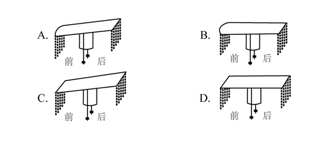

# 2020年国家公务员录用考试《行测》题（副省级网友回忆版）

> 言语理解与表达 · 40 题 · 国考 2020

## 材料 1

①1928年，洛阳金村的古墓里出土了数千件战国时期文物，其中有一面镜子，上面雕镂着一个披甲执剑、头上戴冠的武官。有趣的是，冠两侧都插着羽毛，专家认为那是一种名为“鹖”的鸟的尾羽，这种冠就叫“鹖冠”。“鹖冠”是战国到汉代时武官所戴之冠。鹖鸟生性好斗，至死不却，因此武官佩戴鹖冠，以此昭示英勇气概。

②武官戴“鹖冠”，文官的冠则叫“进贤冠”，代表文官有举荐贤能的义务。那么“进贤冠”又有怎样的装饰呢？山东沂南汉墓出土的画像石上有一个画面：两位身穿袍服的文官，头戴“进贤冠”，耳旁像簪花一样插着一支笔，这种装饰叫作“簪笔”。“簪笔”是汉代的一种制度，文官上朝奏事时，要在奏牍上书写，写完之后笔没处放，就插在耳边，久而久之就成了服制的定规。“簪笔”制度一直沿用到北朝，只不过换了一种形式，名称也由“簪笔”变成“垂笔”。

③在古代男子的冠中，最尊贵的是“冕”。“冕”是帝王、诸侯和卿大夫所戴的一种礼冠，专门用于重大祭祀，也叫做“冕冠”。“冕冠”每个部分的形制都有特殊意义，比如其顶盖叫作“冕板”，一般为长条形，前圆后方，后端又比前端高出三厘米左右，这是象征戴冠者的匍匐形态，表示对天地宇宙的尊崇；“冕板”的前后两端分别垂挂数串玉珠，叫做“旒”，一旒就是一串珠玉，旒的多少视身份而定，帝王专用十二旒，其余按等级递减为九旒、七旒和五旒。在“冕板”的两侧还垂有两根丝带，下端分别系着一枚丸状玉石，名曰“充耳”。“旒”与“充耳”的设计也有用意：“旒”用来“障视”，“充耳”用来“止听”，这是提醒人们在庄严神圣的祭祀场合，不看不正之物，不听不正之语，成语“视而不见”和“充耳不闻”即由此而来。

④冠冕形制如此复杂，却还不是极限。北周有位皇帝退位后当起了太上皇，为了将自己与现任皇帝区分开来，规定太上皇的冕用二十四串垂旒。但是旒数多了，走起路来更得小心翼翼、缓步而行，其实这也正是戴冠冕的用意之一，就是要让人端正行走。身形一端正，人就显得有气派，这就是所谓“冠冕堂皇”。

⑤当然，“冠冕”不仅仅是为了“堂皇”。《礼记·冠义》中说“冠者，礼之始也”，这是古人重视冠冕的主要原因。“礼”是古代社会的典章制度和道德规范，用于定亲疏、决嫌疑、别同异、明是非，是古代帝王稳定社会的手段。礼有如此宏大的意义，作为“礼之始”的冠当然意义非凡。所以在古代，冠不是随便什么人都能戴的，古书上说“二十成人，士冠，庶人巾”，可见在当时，只有贵族子弟才能戴冠，平民百姓还没有这个资格。古代贵族男子到了二十岁，就要举行隆重的加冠典礼，以示成年，而后才能被赋予贵族子弟的各种权利和义务。冠礼极其复杂，单是加冠仪式就要举行三次，每次戴的冠都不一样，依次是缁布冠、皮弁和爵弁。这三种冠分别用于平日起居、打猎征战和祭祀活动，也分别象征着“士”的日常、战争和宗教生活。

⑥冠的象征含义既然如此之多，那么可想而知，冠是不能乱戴的，乱戴就意味着不尊礼。《左传》曾记载过一桩“失礼”之事：卫国国君请两个大臣来朝中喝酒，两个大臣早早就穿着朝服在朝中等候，国君却忘记此事，跑到园子里打猎去了，两个大臣只好到园中见他。国君听闻，戴着打猎的皮弁就出来了，惹得两位大臣十分愤怒。由此可见，依据场合戴冠才是合乎礼制的，即使君王也不能无礼。所以孔子说“君子正其衣冠”，其意不仅在于要衣冠周正，还在于要符合礼仪。正因如此，孔子的弟子子路在即将战死的时候，也要将自己被打落的冠系好，所谓“君子死，冠不免”。在死亡面前，子路还要结缨正冠，这在现代人看来未免太过迂腐，但这正是当时所崇尚的君子品格，也说明服饰制度对经国治世有着非常重要的作用。这么一想，“冠冕”确实要“堂皇”。

### 第 1 题　qid 2448580 · 片段阅读

下面这段文字最适合放在文中哪一位置？
由此可见，一种服饰的出现与流行有各种各样的缘由，但是纵观中国服饰史，就会发现这些缘由中最重要的还是政治因素。通过“冠”的形制，我们可以更好地理解这一点。

- **A**. ①和②中间
- **B**. ②和③中间　✅
- **C**. ③和④中间
- **D**. ④和⑤中间

**答案**：B

**官方解析**

给出文字开头出现“由此可见”，引出服饰出现流行缘由的这一结论，故前文应具体表述导致服饰出现的原因，尾句由“通过&#39;冠&#39;的形制，我们可以更好地理解这一点”可知，后文应具体论述“&#39;冠&#39;的形制”，对应文段，第②段具体表述了政治的规定导致了“进贤冠”服饰的出现，第③段具体阐述了“冠冕的形制”，题干文段在②③段间可起到承上启下的作用，衔接恰当，B项当选。
①段通过“鹖冠”进行话题引入，④段由“冠冕形制的复杂，却还不是极限”可知，此段承接③段仍在论述冠冕的形制，⑤段在论述重视冠冕的原因，均与题干话题衔接不当，排除A、C、D三项。
故正确答案为B。
【文段出处】《冠冕何以堂皇》

---

### 第 2 题　qid 2448581 · 片段阅读

以下关于“鹖冠”和“进贤冠”的说法与原文相符的是：

- **A**. “鹖冠”最早出现在汉代古墓出土的文物中
- **B**. “鹖冠”因其两侧插着鹖鸟尾羽装饰而得名　✅
- **C**. “进贤冠”产生于魏晋南北朝时期
- **D**. “进贤冠”专门用于重大祭祀活动

**答案**：B

**官方解析**

A项，对应第①段“&#39;鹖冠&#39;是战国到汉代时武官所戴之冠”可知，最早应出现在战国，时间表述不正确，排除；
B项，对应第①段“有趣的是，冠两侧都插着羽毛，······这种冠就叫&#39;鹖冠&#39;”可知，该项表述正确，当选；
C项，对应第②段“‘簪笔’制度一直沿用到北朝”可知，簪笔为进贤冠上的一种形式，故可推测进贤冠应在北朝之前出现，该项时间表述不正确，排除；
D项，文段未提及“‘进贤冠’专门用于重大祭祀活动”，无中生有，排除。
故正确答案为B。
【文段出处】《冠冕何以堂皇》

---

### 第 3 题　qid 2448582 · 片段阅读

根据第③段，下图所画“冕”的形制与原文描述相符的是：

- **A**. A　✅
- **B**. B
- **C**. C
- **D**. D

**答案**：A

**官方解析**

定位原文第③段，根据文段“一般为长条形，前圆后方”可知，C、D两项错误，C项与D项均为“前方后方”的形状，与文段所描述形状不符，排除；根据文段“后端又比前端高出三厘米左右”可知A项正确，B项所绘形状为前后端属于同一水平面，与文段所描述形状不符，排除。
故正确答案为A。
【文段出处】《冠冕何以堂皇》

---

### 第 4 题　qid 2448583 · 片段阅读

根据原文，下列说法符合古代礼制的是：

- **A**. 庶人阶级的男子在二十岁时要举行隆重的冠礼
- **B**. 诸侯国君不必像大臣一样严格遵守服饰礼制
- **C**. 天子在祭祀时必须戴着有二十四串垂旒的冕冠
- **D**. 贵族男子在日常生活中所戴之冠为“缁布冠”　✅

**答案**：D

**官方解析**

A项，根据原文第⑤段“古代贵族男子到了二十岁，就要举行隆重的加冠典礼”，可知，并非是“庶人阶级”，选项表述错误，排除；
B项，根据原文第⑥段“依据场合戴冠才是合乎礼制的，即使君王也不能无礼”，可知，诸侯国君也必须遵守服饰礼制，选项表述错误，排除；
C项，根据原文第④段“北周有位皇帝退位后当起了太上皇，为了将自己与现任皇帝区分开来，规定太上皇的冕用二十四串垂旒”可知，“有二十四串垂旒的冕冠”为“太上皇”所佩戴，并非“天子”，排除；
D项，根据原文第⑤段“···依次是缁布冠、皮弁和爵弁。这三种冠分别用于平日起居、打猎征战和祭祀活动”，可知，贵族男子在日常生活中所戴冠为“缁布冠”，表述正确，当选。
故正确答案为D。
【文段出处】《冠冕何以堂皇》

---

### 第 5 题　qid 2448584 · 片段阅读

最适合做这段文字标题的是：

- **A**. 古人是如何戴冠的
- **B**. 服饰制度与治国之道
- **C**. 冠冕的演变史
- **D**. “冠冕”何以“堂皇”　✅

**答案**：D

**官方解析**

这是一道标题填入题，需要分析整个文段。首先第一段指出武官戴的是“鹖冠”，第二段指出文官所戴的“进贤冠”及其具体装饰的样子，第三段指出在古代男子的冠中，最尊贵的是“冕”，“冕”是帝王、诸侯和卿大夫所戴的一种礼冠，并且具体介绍了“冕”的样子，第四段通过转折词“却”引出古代的冠冕形制虽然复杂，却不是极限，后面通过“北周皇帝”的例子来说明，接着第五段指出“冠冕”跟“礼”也有关，并指出在古代“冠冕”戴的人和环境也是有区别的，第六段指出依据场合戴冠才是合乎礼制的，并且尾句通过指代词“这”总结前文，得出结论，强调“冠冕”确实要“堂皇”，也就是要注意礼仪。故对应D项。
A项，“如何戴冠”无中生有，文段并没有介绍古人怎么样戴冠，排除；
B项，“服饰制度”范围扩大，文段只强调“冠冕”，排除；
C项，“演变史”无中生有，排除。
故正确答案为D。
【文段出处】《冠冕何以堂皇》

---

## 材料 2

        近日，特拉维夫大学宣布该学校实验室3D打印出了一颗“心脏”，该心脏不仅具有外形，还有细胞、血管和其他支撑结构，甚至可以像心脏一样收缩，但长度只有2.5厘米。该实验团队负责人说：“与过去相比，这项研究成果的突破点在于，这不仅是一个外观打印的心脏，而且是世界上第一个利用患者自己的细胞和生物材料3D打印出的三维血管化的工程心脏，也就是具有血管组织的三维人造心脏。”而在此之前，科学家只成功打印出没有血管的简单组织。

        负责人补充道：“打印心脏的原料是从病人身上提取而来，我们从网膜组织中提取细胞，对其进行编辑，使之成为干细胞，再将其转化为心肌细胞和内皮细胞。另外，提取非细胞组织，转变为一种‘个人特有的凝胶’来充当打印‘墨水’，这些由糖和蛋白质构成的材料能够用于3D打印复杂的组织模型。随后利用组织工程学的原理，在支架中填充细胞，以此让细胞得以更好地再生。”他说，该实验中使用的“打印原料”和“黏合胶水”来源于患者自身，对于成功构建组织和器官至关重要，这意味着由此打印出的心脏移植进本人身体后不会产生排异反应。而目前心脏移植术后的死亡率居高不下，主要与排异反应有关。

        如此看来，若特拉维夫大学的技术手段能在未来的人体试验阶段被证明有效，并在一定程度上解决排异问题，那确实将会是一个很大的突破。

        心脏体积大、细胞种类繁多，全体心肌细胞需要几乎同时收缩，才具有功能。心脏的跳动是因为心肌细胞都被紧密地连在一起，细胞产生的电信号使大批心肌细胞共同收缩。而且为使两个心房和两个心室协同收缩，心脏本身还有一套特殊的传导系统。虽然在体外生产几千万个心肌细胞并不困难，但是即便心脏被3D打印出来了，能不能跳是一回事，到底怎么跳则是另一回事。以临床病症为例，心室纤颤就是因为心肌细胞不能同步跳动。一旦跳动不同步，心脏就会瞬间失去泵血功能，导致病人死亡。

        特拉维夫大学此次打印出的心脏，还未能使大批细胞同步跳动并产生足够的力量。该负责人对此次实验的一些遗憾也并不讳言，“受限于我们3D打印机精度的问题，目前还不能打印出心脏上的所有血管，而且该心脏也不具有泵血功能”。3D打印出的这颗心脏，距离应用于动物实验，也长路漫漫。

        那么，为何特拉维夫大学团队打印出的心脏不能整齐地跳动？3D打印一个心脏到底难在哪里？答案与地球重力有关。“3D打印的黏附力不足以支撑心脏或肾脏这种大器官，地球重力会造成细胞间的撕裂，”哈佛大学一位研究员说，“生物3D打印的核心问题就是要解决生物材料和重力对3D打印细胞的影响。”

        生物3D打印小型器官模型是可行的，一旦打印真实尺寸的器官模型，由于细胞间的支撑力和黏合力有限，可能出现两个后果：一是下层细胞因受到上层细胞越来越大的压力而垮塌；一是即便没有垮塌，在转移过程中，上层细胞也会因无法承受下层细胞的重量而产生撕裂。

        总而言之，由于重力的存在，3D打印心脏的细胞间缺乏紧密联系，这会影响心脏的跳动，该心脏也就无法具有正常的泵血功能。但是，即便重力问题解决了，心脏可以整齐跳动了，3D打印心脏仍有难题未能克服——只有血液源源不断供给，打印的器官或组织才能长时间存活。如何建立血管网络，还没有明确的答案，<u>                    </u>。心脏本身需要全身血液的10%左右来供养，一旦离开血液，所有器官都只能在4℃低温的状态下“熬着”。如果打印细胞需要37℃体温，几乎没有时间完成打印，因为先打上的细胞在打印还没完成时就会因缺氧而死去。这一切都还有待进一步研究。

### 第 6 题　qid 2448566 · 语句表达

填入文中画横线部分最恰当的一项是：

- **A**. 现在要解决的瓶颈之一是如何为生长中的组织提供氧气和营养
- **B**. 而在打印心脏时，“墨水”里的心肌细胞呈现球状且互不接触
- **C**. 而血循环问题几乎是3D打印实体器官的死穴　✅
- **D**. 但生物3D打印已经是科幻小说中常见的情节

**答案**：C

**官方解析**

文段首先提到重力是影响3D打印心脏的方面，随后通过转折词“但是”指出即便重力问题解决，3D打印心脏仍有其他问题，即要源源不断的血液供给。紧接着提到如何建立血管网络还没有明确答案。之后又提到心脏是需要全身血液的10%左右来供养，离开血液所有器官都只能在4℃低温的状态下“熬着”。故横线前后都是围绕给心脏供给血液来讲的，横线与前后文话题一致，对应C项。
A项，“生长中的组织提供氧气和营养”，无中生有，排除；
B项，“墨水”，无中生有，排除；
D项，“科幻小说”，无中生有，排除；
故正确答案为C。
【文段出处】《3D打印一颗心脏，到底有多难？》

---

### 第 7 题　qid 2448567 · 片段阅读

关于这颗3D打印心脏，下列说法错误的是：

- **A**. “黏合胶水”由编辑成的干细胞转化而来　✅
- **B**. 具有血管组织
- **C**. 理论上不会产生排异反应
- **D**. 心肌细胞和内皮细胞来源于患者

**答案**：A

**官方解析**

A项，根据第二段“另外，提取非细胞组织，转变为一种‘个人特有的凝胶’来充当打印‘墨水’”可知，“黏合胶水”只是来源于人体，但是提取于非细胞组织，而并非干细胞组织，与文意不符，当选；
B项，根据第一段“该心脏不仅具有外形，还有细胞、血管和其他支撑结构”以及“也就是具有血管组织的三维人造心脏”可知，它的确具有血管组织，表述正确，排除；
C项，根据第二段“这意味着由此打印出的心脏移植进本人身体后不会产生排异反应”可知，表述正确，排除；
D项，根据第二段“打印心脏的原料是从病人身上提取而来······使之成为干细胞，再将其转化为心肌细胞和内皮细胞”可知，表述正确，排除；
本题为选非题，故正确答案为A。
【文段出处】《3D打印一颗心脏，到底有多难？》

---

### 第 8 题　qid 2448568 · 片段阅读

下列哪项不属于3D打印心脏未来需要着力解决的问题？

- **A**. 心肌细胞的共同收缩
- **B**. 支架填充细胞的获取　✅
- **C**. 打印器官的长期存活
- **D**. 正常泵血功能的实现

**答案**：B

**官方解析**

A项，根据第四段“全体心肌细胞需要几乎同时收缩，才具有功能。心脏的跳动是因为心肌细胞都被紧密地连在一起······但是即便心脏被3D打印出来了，能不能跳是一回事”可知，3D打印心脏后仍需实现心肌细胞同时收缩，选项表述正确，排除；
B项，根据第二段“提取非细胞组织······随后利用组织工程学的原理，在支架中填充细胞，以此让细胞得以更好地再生”可知，支架填充细胞的获取目前已经解决，不属于未来3D打印心脏需解决的问题，当选；
C项，根据第八段“3D打印心脏仍有难题未能克服——只有血液源源不断供给，打印的器官或组织才能长时间存活”可知，未来仍需解决打印器官的长期存活问题，选项表述正确，排除；
D项，根据第八段“由于重力的存在，3D打印心脏的细胞间缺乏紧密联系，这会影响心脏的跳动，该心脏也就无法具有正常的泵血功能”可知，未来仍需解决泵血功能，选项表述正确，排除。
本题为选非题，故正确答案为B。
【文段出处】《3D打印一颗心脏，到底有多难》

---

### 第 9 题　qid 2448569 · 片段阅读

根据文章，下列说法正确的是：

- **A**. 目前的3D打印心脏可以跳动　✅
- **B**. 心肌细胞难以在人体之外量产
- **C**. 3D打印技术无法打印小型器官模型
- **D**. 3D打印心脏已开始应用于动物实验

**答案**：A

**官方解析**

A项，根据第六段“那么，为何特拉维夫大学团队打印出的心脏不能整齐地跳动？”可知，该疑问表明目前的这颗3D打印心脏是可以跳动的，仅是不能整齐地跳动，故选项表述正确，当选；
B项，根据第四段“体外生产几千万个心肌细胞并不困难”可知，心肌细胞可在人体之外量产，而非“难以量产”，选项表述错误，排除；
C项，根据第七段“生物3D打印小型器官模型是可行的”可知，3D打印技术可以打印小型器官模型，而非“无法打印”，选项与文意相悖，排除；
D项，根据第五段“3D打印出的这颗心脏，距离应用于动物实验，也长路漫漫”可知，3D打印心脏还没有应用于动物实验，选项表述错误，排除。
故正确答案为A。
【文段出处】《3D打印一颗心脏，到底有多难？》

---

### 第 10 题　qid 2448570 · 片段阅读

文中提到的生物3D打印技术如果最终成熟，能为患有下列哪种疾病的病人带来福音？

- **A**. 白化病
- **B**. 尿毒症　✅
- **C**. 登革热
- **D**. 红绿色盲

**答案**：B

**官方解析**

依据第6段“3D打印的黏附力不足以支撑心脏或肾脏这种大器官，地球重力会造成细胞间的撕裂”可知，如果3D打印技术成熟就能够产生出“心脏、肾脏”这类的大器官，同时依据第3段“若特拉维夫大学的技术手段能在未来的人体试验阶段被证明有效，并在一定程度上解决排异问题”可知3D打印技术生产出的器官能够解决排异问题。
B项“尿毒症”治疗需进行肾移植手术，而3D打印技术能生产出解决排异问题的肾脏，故对于尿毒症患者有福音，当选。
A项“白化病”是皮肤及附属器官黑色素缺乏或合成障碍所导致的遗传性白斑病，不涉及器官移植，排除。
C项“登革热”是经蚊媒传播引起的急性虫媒传染病，不涉及器官移植，排除；
D项“红绿色盲”是伴X染色体隐性遗传病，不涉及器官移植，排除。
故正确答案为B。
【文段出处】《3D打印一颗心脏，到底有多难？》

---

### 第 11 题　qid 2448410 · 逻辑填空

中国正处于经济结构转型升级和世界新一轮技术革命的交汇时期，创新驱动高质量发展渐成共识。没有管理创新、市场创新的商业创新模式                ，有真实需求场景的教育、医疗健康、信息消费、消费升级等模式创新领域，将会迸发出新的投资机会。
填入画横线部分最恰当的一项是：

- **A**. 举步维艰
- **B**. 日薄西山
- **C**. 难以为继　✅
- **D**. 岌岌可危

**答案**：C

**官方解析**

由“没有······，有······将会迸发出新的投资机会”可知，前后语句构成反义关系，横线处所填词语与“将会迸发出新的投资机会”表意相反，且搭配“商业创新模式”。C项“难以为继”指难于继续下去，与“将会迸发出新的投资机会”意思相反，且搭配“商业创新模式”恰当，当选。
A项“举步维艰”比喻办事情每向前进行一步都十分不容易，一般用于有主观能动性的人或事物，不能搭配“商业创新模式”，排除。
B项“日薄西山”比喻人到老年或腐朽的事物衰败接近灭亡，一般用于老人或腐朽的事物，不能用于形容“商业创新模式”，排除。
D项“岌岌可危”形容非常危险，快要倾覆或灭亡，程度过重，根据前文“渐成共识”及后文“将会迸发出”可知，横线处尚未到达“岌岌可危”的程度，排除。
故正确答案为C。
【文段出处】《未来投资的八个视角》

---

### 第 12 题　qid 2448418 · 逻辑填空

传统饱和打击战术的核心，是从不同方向、不同层次向同一目标发射超出其防御上限的导弹，以数量优势形成绝对力量优势，压迫及摧毁其防御体系，对敌重要目标进行毁灭性打击。该战术需要庞大的火力投射平台和充足的武器弹药作支撑，这让世界上大多数国家                。
填入画横线部分最恰当的一项是：

- **A**. 望而却步　✅
- **B**. 无可奈何
- **C**. 束手无策
- **D**. 裹足不前

**答案**：A

**官方解析**

文段阐述了传统饱和打击战术具体的作战模式，接着通过“这”指代前文，横线处强调世界上大多数国家都因为该战术所需要的庞大支撑而没有能力使用， A项“望而却步”，指远远望见了就吓得直后退，不敢前行，符合文意，当选。
B项“无可奈何”指感到没有办法、只有这样，文段并非强调大多数国家对这一战术没有办法，而是没有强大的支撑去使用这一战术，排除；
C项“束手无策”泛指对遇到的麻烦没有办法解决，一筹莫展的情况，文段并非是阐述遇到麻烦，而是能力有限无法去使用传统饱和打击战术，选项程度过重，排除；
D项“裹足不前”形容有所顾虑而止步不敢向前，文段强调大多数国家没有能力使用传统饱和打击战术，而非是对这一战术有所顾虑，排除。
故正确答案为A。
【文段出处】《全新概念！无人机“蜂群”作战》

---

### 第 13 题　qid 2448561 · 逻辑填空

伴随衰老，人的记忆力会发生明显衰退。最近，《自然》子刊《自然·神经科学》杂志给出了潜在的解决方案。他们的方法看起来无比        ：电击大脑。这当然不是“网瘾中心”那种野蛮的电击方式，而是一项有着出色设计的        实验，揭示了脑电波变化与衰老所引起的记忆衰退之间的重要关系。
依次填入画横线部分最恰当的一项是：

- **A**. 粗暴  严谨　✅
- **B**. 直接  安全
- **C**. 危险  神奇
- **D**. 简单  有趣

**答案**：A

**官方解析**

第一空，根据“电击大脑”可知，横线处形容《自然》子刊《自然·神经科学》杂志给出的解决方案应是十分地粗暴、危险，保留A、C两项。B项“直接”侧重接续，强调中间没有经过任何环节，不能和“电击大脑”的做法形成对应，排除。D“简单”，根据后文“不是...野蛮的方式”可知，第一空为不好的，排除D。
第二空，“不是······而是······”表反义并列，横线处应与“野蛮”语义相反，“野蛮”指使用暴力、不讲理，故横线处应表示文明、儒雅的意思，对应A项“严谨”，形容态度严肃、谨慎、细致、周全。C项“神奇”指神妙奇特，无法和“野蛮”形成反义并列，且“揭示了脑电波变化与衰老所引起的记忆衰退之间的重要关系”也不能体现这是一个有趣的实验或者是神奇的实验，均与文意无关，排除。
故正确答案为A。
【文段出处】《电击半小时，就能让记忆力回到20岁？》

---

### 第 14 题　qid 2448562 · 逻辑填空

在历史研究中，实证主义强调        ，认为史学家是反映历史的镜子，其职责仅限于对史料进行严格考证、挑选和排列，让史料自身去制造历史，而自己则要            ，这种观点忽视了史学家的主观能动性，过于绝对和冷漠，在后续的发展中受到很大质疑。
依次填入画横线部分最恰当的一项是：

- **A**. 公正性  秉笔直书
- **B**. 独立性  冷眼旁观
- **C**. 真实性  不动声色
- **D**. 客观性  置身事外　✅

**答案**：D

**官方解析**

第一空，根据“认为史学家是反映历史的镜子······挑选和排列”可知，横线处应表示史学家应反映历史原本的样子。C项“真实性”指与客观事实相符；D项“客观性”指不以人的意志为转移，均符合文意，保留。A项“公正性”指公平正直、没有偏私，是一种价值判断，而“镜子”的意思是还原最初的样子，而非对其内容进行评价，排除；B项“独立性”指的是不依附、不隶属，与文意无关，排除。
第二空，根据“让史料自身去制造历史”、“忽视了史学家的主观能动性”可知，横线处表示史学家自身不要去干预史料，对应D项“置身事外”，指把自己放在事情之外，毫不关心。C项“不动声色”形容不说话、不流露感情、神态镇静，文段强调忽略主观能动性，追求客观，选项与文意无关，排除。
故正确答案为D。

---

### 第 15 题　qid 2448441 · 逻辑填空

“万物各得其和以生，各得其养以成。”这方面有很多鲜活生动的事例。始建于战国时期的都江堰，距今已有2000多年历史，就是根据岷江的洪涝规律和成都平原悬江的地势特点，                建设的大型生态水利工程，不仅造福当时，而且                。
依次填入画横线部分最恰当的一项是：

- **A**. 顺势而为  利在千秋
- **B**. 因势利导  泽被后世　✅
- **C**. 物尽其用  历久弥新
- **D**. 因地制宜  经久不衰

**答案**：B

**官方解析**

第一空，由“就是根据岷江的洪涝规律和成都平原悬江的地势特点”可知，都江堰主要依据洪涝规律和地势特点建造而成。B项“因势利导”指顺着事物的发展趋势加以引导，D项“因地制宜”指根据不同地区的具体情况规定适宜的办法，均符合文意，保留。A项“顺势而为”指做事要顺应潮流，不要逆势而为，“洪涝规律和地势特点”与“潮流”无关，排除；C项“物尽其用”指充分利用资源，侧重强调“不浪费”，与文意无关，排除。
第二空，根据“不仅造福当时”可知，横线处意在表达对后人的影响也很大。B项“泽被后世”指恩惠遍及后世的人民，符合文意，当选。D项“经久不衰”指持续很长时间也不衰减，与文意不符，排除。
故正确答案为B。
【文段出处】《推动我国生态文明建设迈上新台阶》

---

### 第 16 题　qid 2448494 · 逻辑填空

渔业资源恢复是一个复杂而缓慢的过程，需要               的努力，如坚决减少捕捞力量、科学发展增殖渔业和加强栖息地保护与修复等。        生态系统水平的适应性对策，强化资源管理与养护，依然是下一步渔业资源恢复的重点工作。
依次填入画横线部分最恰当的一项是：

- **A**. 锲而不舍  探索　✅
- **B**. 坚韧不拔  制定
- **C**. 坚持不懈  借鉴
- **D**. 有条不紊  研究

**答案**：A

**官方解析**

第一空，横线处搭配“努力”，由“复杂而缓慢的过程”可知，横线处词语表意为要不断坚持。A项“锲而不舍”比喻有恒心有毅力，C项“坚持不懈”指坚持到底、一点不松懈，均符合文意，保留；B项“坚韧不拔”形容意志坚定顽强，与文意不符，排除；D项“有条不紊”形容做事、说话有条有理，与“努力”搭配不当，排除。
第二空，由文意可知，横线处词语搭配“对策”。A项“探索”着重指为解决疑难问题而多方面寻求答案，符合文意，当选；C项“借鉴”指跟别人的或另外的事相对照，以便从中学习或吸取经验教训，文中没有提及向其他学习之意，排除。
故正确答案为A。
【文段出处】《新时代渔业绿色发展的方向与路径》

---

### 第 17 题　qid 2448476 · 逻辑填空

现在很多人对快速发展的食品科技比较陌生，对食品从农田到餐桌的全过程知之甚少，因此对错误信息的辨识能力、对谣言的抵御能力十分有限。那些                的谣言不仅影响消费信心，也给行业、产业带来直接的危害。强化食品安全科普传播                ，也迫在眉睫，这已经成为全行业和全社会的共识。
依次填入画横线部分最恰当的一项是：

- **A**. 虚张声势  至关重要
- **B**. 铺天盖地  首当其冲
- **C**. 口耳相传  任重道远
- **D**. 耸人听闻  势在必行　✅

**答案**：D

**官方解析**

第一空，形容“谣言”。B项“铺天盖地”形容来势猛，声势大，到处都是，形容谣言传播范围广，D项“耸人听闻”指使人听了感到震惊，可用于形容谣言，二项均符合文意，保留。A项“虚张声势”形容假装出强大的气势，指假造声势，借以吓人，谣言的特点并没有“假装出强大的气势”，排除；C项“口耳相传”指文化一代一代传下去，侧重一代代的传承，不用来形容谣言，排除。
第二空，空缺处用来形容“强化食品安全科普传播”很有必要，很迫切。D项“势在必行”指从事情发展的趋势看，必须采取行动，符合文意，当选。B项“首当其冲”比喻最先受到攻击或遇到灾难，不符合语境，排除。
故正确答案为D。
【文段出处】《数字时代食品科学传播要主动》

---

### 第 18 题　qid 2448557 · 逻辑填空

古城区发展到一定阶段，适度地提升改造是必要的，但如果是通过“拆真”来为“建假”腾出地方，这样的开发改造必然是      。其实，提升改造与对老建筑的保护本来可以      ，恰当地修缮，不但可以让历史建筑重新焕发活力，也能够提升城区的整体质量，达到提升改造的目的。
依次填入画横线部分最恰当的一项是：

- **A**. 顾此失彼  齐头并进
- **B**. 暴殄天物  双管齐下
- **C**. 得不偿失  并行不悖　✅
- **D**. 舍本逐末  并驾齐驱

**答案**：C

**官方解析**

第一空，根据“通过‘拆真’来为‘建假’腾出地方”可知，这样的开发改造是错误的。C项“得不偿失”指得到的利益抵偿不了受到的损失，D项“舍本逐末”指抛弃事物的主要部分追求次要的部分，两项均符合文意，保留。A项“顾此失彼”指顾这个丢了那个，形容照顾不过来，与文意不符，排除；B项“暴殄天物”指任意糟蹋东西，不知道爱惜，用于形容“开发改造”程度过重，排除。
第二空，形容“提升改造”和“对老建筑的保护”，根据后文内容可知，二者可以同时进行并不冲突。C项“并行不悖”指同时进行而不互相违背，填入文段体现两者共存不矛盾的关系，符合文意，当选。D项“并驾齐驱”比喻齐头并进、不分先后，也比喻地位或程度相等、不分高下，侧重于强调彼此地位相当，不用区分先后顺序，多用于形容彼此的力量或才能不分高下，文段并非表示改造和保护两者地位高低问题，而是强调两者可以共存、不互相违背，填入文段不如C项更加贴切，排除。
故正确答案为C。
【文段出处】《保留还是拆除历史建筑应审慎》

---

### 第 19 题　qid 2448506 · 逻辑填空

五四运动表现出来的爱国主义精神，与以往的爱国主义相比较，具有历史进步性和鲜明时代性。这种爱国主义不是盲目排外，而是为了维护国家独立和民族尊严；不是            ，而是与民主和科学精神紧密联系，追求发展进步；不是            ，而是付诸行动，以“直接行动”投入反帝运动。
依次填入画横线部分最恰当的一项是：

- **A**. 刻舟求剑  作壁上观
- **B**. 邯郸学步  闭门造车
- **C**. 固步自封  纸上谈兵　✅
- **D**. 拾人牙慧  夸夸其谈

**答案**：C

**官方解析**

第一空，“不是······而是”表反义并列，“而是”后表示追求发展进步，故横线处应表达不追求发展进步的意思。A项“刻舟求剑”一般比喻死守教条，拘泥成法，固执不变通的人，C项“固步自封”比喻守着老一套，不求进步，均可表达不求进步的意思，保留。B项“邯郸学步”比喻一味地模仿别人，不仅没学到本事，反而把原来的本事也丢了，文段未提及“模仿别人”，与文意无关，排除；D项“拾人牙慧”比喻拾取别人的一言半语当作自己的话，也比喻窃取别人的语言和文字，与文意无关，排除。
第二空，同样为“不是······而是”的反义并列句式，“而是”后指出付诸行动，故横线处表示未付诸行动的意思。C项“纸上谈兵”指在纸面上谈论打仗，比喻空谈理论，不能解决实际问题，符合文意，当选。A项“作壁上观”比喻置身事外，在旁不协助任何一方，强调不参与，与文意不符，排除。
故正确答案为C。
【文段出处】《五四精神与中国道路》

---

### 第 20 题　qid 2448472 · 逻辑填空

科学家网上科普，“高大上”的国家科研机构与轻松娱乐的网络文化场域相遇，不仅没有出现文化上的巨大冲突、碰撞，反倒形成了一种                、寓教于乐的可爱画风，受到很多年轻人的喜爱。这种意外，看似有很大的            ，实则是一种科普方式的积极探索创新，预示了打通两个文化场域的可能性。
依次填入画横线部分最恰当的一项是：

- **A**. 别出心裁  随意性
- **B**. 相映成趣  特殊性
- **C**. 亦庄亦谐  偶然性　✅
- **D**. 妙趣横生  随机性

**答案**：C

**官方解析**

第一空，与“寓教于乐”意思相近，指兼具教育性和趣味性。C项“亦庄亦谐”指讲话或文章既庄重正派，又幽默活泼，可以对应教育性和趣味性，符合文意，保留。A项“别出心裁”形容诗文、美术、建筑等的构思设想独具一格，与众不同，D项“妙趣横生”形容语言、文章、美术品等洋溢着美妙的意趣，文中空缺处的主语为前文陈述的现象，搭配不当，排除A、D两项；B项“相映成趣”指相互衬托着，显得很有趣味，很有意思，文段并非强调两者彼此相互衬托，而是两者结合在一起，与文段语境不符且与后文无法构成并列，排除；锁定C项。
第二空代入验证，C项“偶然性”指巧合，与前文的“意外”对应，符合语境，当选。
故正确答案为C。
【文段出处】《科学家网上科普受热捧  正能量满满》

---

### 第 21 题　qid 2448509 · 逻辑填空

有关部门制定银龄讲学计划，在全国招募万名优秀退休教师，下乡支援农村学校。相信白发苍苍的师者，会无私地奉献燃烧；但是要        乡村师生双双流失的困境，不能仅凭一时兴起的“输血”和情怀。唯有教育资源真正向农村        ，真正提高乡村教师的待遇和吸引力，乡村振兴才会有             的新鲜血液。
依次填入画横线部分最恰当的一项是：

- **A**. 改善  汇聚  生生不息
- **B**. 突破  集中  生机勃勃
- **C**. 扭转  倾斜  源源不断　✅
- **D**. 摆脱  开放  薪火相传

**答案**：C

**官方解析**

第一空，由“在全国招募万名优秀退休教师，下乡支援农村学校”可知，此处应体现“改变”困境之意，B、C、D三项语义均可。A项“改善”指改变原有情况，使之变得更好，通常与生活、条件等搭配，与“困境”搭配不当，排除。
第二空，填入横线词语表示农村应分配到更多的教育资源。C项“倾斜”指偏向于某一方，D项“开放”指解除封锁、禁令、限制等，均符合文意，保留。B项“集中”指把分散的人、事物、力量等聚集起来，如果教育资源都“集中”到农村，则会使城市的教育资源变得稀缺，排除。
第三空，搭配“新鲜血液”。C项“源源不断”形容接连不断，搭配恰当，且能与“血液”构成形象对应，当选。D项“薪火相传”比喻学问和技艺代代相传，与“新鲜血液”搭配不当，且文段体现的是为乡村振兴注入新的活力，而不是将“新鲜血液”传承下去，与文意不符，排除。
故正确答案为C。
【文段出处】《靠退休教师支教来改变农村教育现状？》

---

### 第 22 题　qid 2448420 · 逻辑填空

秋葵原产印度，却在中国______已久，东汉的《说文解字》称其为“黄葵”，《本草纲目》也有详细记载，称其为“侧金盏花”。秋葵曾是我较为______的蔬菜，在童年记忆里，家中餐桌上并未出现过它。近些年秋葵却______走红，长居网红零食的热门榜单，也逐渐成为寻常百姓的秋日家常菜。
依次填入画横线部分最恰当的一项是：

- **A**. 侨居  反感  意外
- **B**. 流浪  向往  瞬间
- **C**. 落户  不屑  莫名
- **D**. 扎根  陌生  迅速　✅

**答案**：D

**官方解析**

第一空，根据后文“东汉的《说文解字》称其为‘黄葵’，《本草纲目》也有详细记载”可知，横线处表达秋葵产自印度，但在中国存在的历史比较久，A项“侨居”指在外国居住，C项“落户”指在他乡安家长期居住，D项“扎根”比喻深入到人或事物中去，打下基础，均符合文意，保留。B项“流浪”指生活没有着落，到处转移，随地谋生，与文意不符，排除。
第二空，根据后文“在童年记忆里，家中餐桌上并未出现过它”可知，横线处表达我对秋葵并不熟悉之意，D项“陌生”指生疏，不熟悉，符合文意，保留。A项“反感”指反对或不满的情绪，C项“不屑”形容轻视、轻蔑，均无法体现“不熟悉”的意思，故与文意不符，排除。
第三空，代入验证，D项“迅速”与“走红”搭配得当，体现秋葵变红速度快之意，当选。
故正确答案为D。
【文段出处】《三联美食：早读丨食谱，初秋之味》

---

### 第 23 题　qid 2448435 · 逻辑填空

准确、权威的信息不及时传播，虚假、歪曲的信息就会搞乱人心；积极、正确的思想舆论不发展壮大，消极、错误的言论观点就会肆虐______。这方面，主流媒体守土有责，更要守土尽责，及时提供更多真实客观、观点鲜明的信息内容，牢牢______舆论场主动权和主导权。主流媒体要敢于引导、善于疏导，原则问题要旗帜鲜明、立场坚定，一点都不能______。
依次填入画横线部分最恰当的一项是：

- **A**. 蔓延  守护  犹豫
- **B**. 扩散  占据  退缩
- **C**. 滋生  控制  迟疑
- **D**. 泛滥  掌握  含糊　✅

**答案**：D

**官方解析**

第一空，搭配“言论观点”，根据前文“积极、正确的思想舆论不发展壮大”可知，横线处所填内容与“壮大”对应，体现出消极、错误的言语观点不断发展壮大之意，A项“蔓延”指延伸、扩展，B项“扩散”指扩大散布，D项“泛滥”指比喻坏的事物不受限制地流行，三项均可体现文意，保留。C项“滋生”指引起、产生、繁殖，多搭配不好的对象，根据文意可知横线需表达范围扩大的意思，而非产生的意思，排除。
第二空，搭配“主动权和主导权”，B项“占据”指取得或保持，D项“掌握”指充分支配或运用，均搭配恰当，保留。A项“守护”指看守保护，与“主动权和主导权”搭配不当，排除。
第三空，根据“原则问题要旗帜鲜明、立场坚定”可知，主流媒体对于原则问题的态度是明确的，故横线处强调一点也不能模糊之意，D项“含糊”与文意相符，当选；B项“退缩”指畏难不前，后退，与文意不符，排除。
故正确答案为D。
【文段出处】《加快推动媒体融合发展 构建全媒体传播格局》

---

### 第 24 题　qid 2448559 · 逻辑填空

测谎的基本原理是：欺骗的人会紧张，以致呼吸、脉搏加快和血压升高。测谎专家因而声称，只要操作、解析得当，测谎仪能够有效发现说谎者，结果是      的。反对者则认为，一个      且擅长控制情绪的人是可以对付测谎仪的。在这个过程中，不是人与机器，而是测谎者与被测者的      。
依次填入画横线部分最恰当的一项是：

- **A**. 合理  见多识广  博弈
- **B**. 可靠  有备而来  较量　✅
- **C**. 科学  不露声色  抗衡
- **D**. 准确  从容不迫  对决

**答案**：B

**官方解析**

第一空，根据“测谎仪能够有效发现说谎者”可知，测谎的结果是准确的、可以信赖的。B项“可靠”、C项“科学”、D项“准确”均符合文意，保留。A项“合理”指合乎道理或者事理，不能强调测谎结果的准确性，排除。
第二空，横线处与“擅长控制情绪”并列，共同体现应对测谎仪的前提条件。B项“有备而来”强调事先有准备，保留。D项“从容不迫”形容不慌不忙，非常镇定，与“擅长控制情绪”重复，排除。C项“不露声色”指心里的打算不在说话和脸色上显露出来，根据测谎原理可知，测谎仪并不是根据说话或脸色来测谎的，与文意不符，排除。
第三空，验证，形容“测谎者与被测者”，B项“较量”指双方比本领，比实力，与文意相符，当选。
故正确答案为B。
【文段出处】《诉讼模式如何影响审判结果》

---

### 第 25 题　qid 2448560 · 逻辑填空

千百年来，乡村承担着对村民行为的引导、规训与教育功能，让人们      、明辨是非善恶。农事活动、节日庆典、民俗习惯、村规民约等，都是维系村落价值取向和有序运行的重要      ，它们以      的形式不断强化人们的行为规范，并使之内化为人们的道德准则。
依次填入画横线部分最恰当的一项是：

- **A**. 循规蹈矩  途径  喜闻乐见
- **B**. 与人为善  方式  言传身教
- **C**. 通情达理  载体  潜移默化　✅
- **D**. 奉公守法  手段  耳濡目染

**答案**：C

**官方解析**

第一空，考查并列关系，与“明辨是非善恶”意思、感情相近。A项“循规蹈矩”指遵守规矩，不敢违反，感情偏消极，和后文不符，排除；B项 “与人为善”指善意帮助人，感情虽然相近，但是和“明辨是非善恶”含义不符，排除；C项“通情达理”指说话、做事很讲道理，符合文意，保留；D项“奉公守法”指奉行公事，遵守法令，这也是“明辨是非善恶”、通晓是非的体现，保留。
第二空，C项“载体”泛指一切能够承载其他事物的事物，D项“手段”指为达到某种目的而采取的方法和措施，都能对应前文“农事活动、节日庆典、民俗习惯、村规民约等”，符合语境。
第三空，C项“潜移默化”指人的思想或性格不知不觉受到感染、影响而发生了变化，符合“农事活动、节日庆典、民俗习惯、村规民约”的特点并对应后文“内化”，当选。D项“耳濡目染”侧重于听得多、看得多之后受到影响，文中没有相应的信息，排除。
故正确答案为C。
【文段出处】《乡村振兴中的生态文明智慧》

---

### 第 26 题　qid 2448446 · 片段阅读

民之所好好之，民之所恶恶之。环境就是民生，青山就是美丽，蓝天也是幸福。发展经济是为了民生，保护生态环境同样也是为了民生。既要创造更多的物质财富和精神财富以满足人民日益增长的美好生活需要，也要提供更多优质生态产品以满足人民日益增长的优美生态环境需要。要坚持生态惠民、生态利民、生态为民，重点解决损害群众健康的突出环境问题，加快改善生态环境质量，提供更多优质生态产品，努力实现社会公平正义，不断满足人民日益增长的优美生态环境需要。
这段文字意在：

- **A**. 阐释人与自然和谐共生的基本观念
- **B**. 呼吁人民群众参与到生态文明建设之中
- **C**. 强调良好的生态环境是民生之福祉　✅
- **D**. 揭示绿水青山就是金山银山的发展理念

**答案**：C

**官方解析**

文段开篇指出民生之所好就是良好的生态，无论是发展经济还是保护生态环境均是为了民生的需求，随后通过“既要……也要”进行解释说明。后文通过“要”给出对策，并通过程度词“重点解决”引出文段重点，强调要以“民”为中心发展生态，只有具备良好的生态环境，才能满足各个方面的民生需求，即强调“生态环境”对于“民生”的重要性，对应C项，“民生福祉”即对“不断满足人民日益增长的优美生态环境需要”的同义替换，当选。
A项，“基本观念”文段并未提及，无中生有，且未提到“民生”这一核心话题，排除；
B项，“呼吁人民群众参与到生态文明建设之中”文段并未提及，文段的重点在于良好的生态环境对于民生的重要性，并非给“人民”提出对策与做法，与文意不符，排除；
D项，未提及文段主题词“民生”，排除。
故正确答案为C。
【文段出处】《良好生态环境是最普惠的民生福祉》

---

### 第 27 题　qid 2448563 · 片段阅读

庞大的劳动力供给支撑了改革开放以来经济的快速发展，形成人口红利。不过，人口规模并不必然转化为人口红利，还需要基本的文化素质支撑。改革开放以来，我国将基础教育工作放到重要位置，制定了《中华人民共和国义务教育法》等法律法规，不断增加相关领域投入，从而保证了劳动力素质的提高。近年来，随着老龄化水平的不断提升，劳动力人口出现了规模缩减的迹象。为了在新的劳动力供给条件下实现经济可持续发展，需要实施职工素质建设工程，推动建设宏大的知识型、技术型、创新型劳动者大军，促进人口红利向人才红利的转变。
这段文字主要说的是：

- **A**. 当前形势对提高人口素质提出了新要求　✅
- **B**. 教育是当前实现经济可持续发展的关键
- **C**. 当前的经济发展需要释放人口红利
- **D**. 劳动力素质的提高需夯实基础教育

**答案**：A

**官方解析**

文段先指出庞大的劳动力形成了人口红利，随后通过转折指出人口规模转化为人口红利还需要基本的文化素质支撑。接下来进一步分析，指出改革开放以来因教育投入增多，劳动力素质提高，但近年来劳动力人口出现了缩减，因此需要“实施职工素质建设工程”，促进人口红利向人才红利转变。故文段重点在于分析近年来的形势，指出我国“需要实施职工素质建设工程”“促进人口红利向人才红利转变”，A项“新要求”概括了文段重点，当选。
B项，文段重点围绕人口红利的问题展开讨论，而非“实现经济可持续发展”，排除；
C项，文段指出在当前形势下需要“促进人口红利向人才红利的转变”，并非仅仅释放人口红利，排除；
D项，强调夯实基础教育，而基础教育已无法应对最新形势，故表述错误，排除。
故正确答案为A。
【文段出处】《40年来人口发展战略的探索与完善》

---

### 第 28 题　qid 2448451 · 片段阅读

西太平洋是全球海山系统分布最为集中的海域，人类对此处海山的认识却非常有限。西太平洋的马里亚纳海沟是板块俯冲地带，海底地质运动非常活跃，海山火山岩的物质组成及成因等是海洋地质科学家感兴趣的问题；西太平洋的暖池和北赤道流等对中国气候有重要影响，是物理海洋科学家关注的重点区域；这里还有全球海洋生物多样性最高的珊瑚礁大三角区，是开展海洋生物起源与进化研究的热点区域。因此，海洋科学家可以在此开展海山的水文物理、化学及生源要素、地形地貌和底质环境及生物生态等多学科协同探测与研究。
这段文字主要介绍了：

- **A**. 在西太平洋开展科学研究的重要价值　✅
- **B**. 人们对西太平洋海山系统的认识
- **C**. 西太平洋区域所蕴含的海洋资源
- **D**. 西太平洋对中国气候和地质的影响

**答案**：A

**官方解析**

文段首先指出“西太平洋”是海山系统分布最为集中的海域，但是人类对此处的海山认识有限。紧接着从“板块俯冲地带”、“暖池和北赤道流”、“全球海洋生物多样性”三个方面分别阐述这块地方是“海洋地质科学家”、“物理海洋科学家”、“海洋生物起源与进化”研究的热点，最后通过结论词“因此”对全文进行总结，尾句为该文段重点，强调海洋科学家可以在“西太平洋”开展“水文物理”、“化学及生源要素”等多学科协同探测与研究，对应A项，“重要价值”即对尾句进行高度概括，当选。
B项，“人们对西太平洋海山系统的认识”对应首句“人类对此处海山的认识却非常有限”，首句为引出话题，非重点，文段重点强调该区域的重要科研价值，排除；
C、D两项，“所蕴含的海洋资源”和“对中国气候的影响”，均为结论之前，且表述片面，排除。
故正确答案为A。
【文段出处】《科普：中国“科学”号为何“钟情”西太海山》

---

### 第 29 题　qid 2448458 · 片段阅读

交流互鉴是人类社会进步的标识，是文明发展的尺度。从古老的丝绸之路、茶叶之路、香料之路上经贸交往的互通有无，到新时代“一带一路”“两廊一圈”等合作建设的开展，亚洲各国为实现互通发展，战胜挑战，克服困难和艰险。文明交融促进了亚洲国家生产力的发展，打破了民族的原始闭关状态，亚洲人民借此开阔了眼界、建立了友谊、收获了富足。在相互影响、相互交流、相互融合、相互建构的文明互动中，东方文化也与西方文化包容共进，不断迈向人类进步新阶段。“光明来自东方”这句古希腊谚语正是对东西文明交融成果生动而诗意的说明。
最适合做这段文字标题的是：

- **A**. 文化交融，亚洲生产力发展的动力
- **B**. “一带一路”，文明传播的通道
- **C**. 交流互鉴，推动人类文明永续发展　✅
- **D**. 包容共进，构建东西方文明互动

**答案**：C

**官方解析**

文段首先引出观点，即“交流互鉴是人类社会进步的标识”，紧接着通过“丝绸之路、茶叶之路、香料之路”到“一带一路”“两廊一圈”的例子来论证观点，之后又通过论述“交流互鉴”带来的好处和意义进行解释说明，最后引用“光明来自东方”的谚语进一步来论证“交流互鉴”促进人类社会的发展，故文段首句是重点，强调“交流互鉴”推动人类社会的发展，对应C项。
A项，“亚洲”，对应解释说明部分，且“文化交融”表述片面，排除；
B项，“一带一路”，对应解释说明部分，非重点，排除；
D项，“包容共进”，对应解释说明部分，且文段重点强调的是“交流互鉴”而不是“包容共进”，非重点，排除。
故正确答案为C。
【文段出处】《交流互鉴，推动人类文明永续发展》

---

### 第 30 题　qid 2448463 · 片段阅读

世界正处于大发展大变革大调整时期，和平与发展仍然是时代主题。世界多极化、经济全球化、社会信息化、文化多样化深入发展，全球治理体系和国际秩序变革加速推进，各国相互联系和依存日益加深，国际力量对比更趋平衡，和平发展大势不可逆转。同时，世界面临的不稳定性不确定性突出，世界经济增长动能不足，贫富分化日益严重，地区热点问题此起彼伏，恐怖主义、网络安全、重大传染性疾病、气候变化等非传统安全威胁持续蔓延，人类面临许多共同挑战。
这段文字接下来讲的是：

- **A**. 为什么我们认为当前的世界正处于发展与激变的时代
- **B**. 中国是维护世界和平、促进世界共同发展的重要力量
- **C**. 正确认识和把握时代的主题才是各国制定政策的依据
- **D**. 各国人民应同心协力应对我们所面临的各种风险挑战　✅

**答案**：D

**官方解析**

文段首先指出世界处于大变革，“和平与发展”仍是时代主题，接着指出“世界多极化”、“社会信息化”、“文化多样化”等促使各国联系更加紧密，“和平与发展”是大势所趋，最后指出目前世界“经济增长动能不足”、“贫富分化日益严重”、“恐怖主义”等问题严重，人类面临许多共同的挑战。这是一道接语选择题，故接下来应该围绕人类如何来解决这些问题论述，对应D项。
A项，“发展与激变”属于前文提到的内容，排除；
B项，“中国”无中生有，且“和平”前文已经提到，排除；
C项，“时代的主题”对应前文提到的内容，且“各国制定政策”与文段最后论述的核心话题不一致，排除。
故正确答案为D。
【文段出处】《习近平：决胜全面建成小康社会 夺取新时代中国特色社会主义伟大胜利——在中国共产党第十九次全国代表大会上的报告》

---

### 第 31 题　qid 2448471 · 片段阅读

在战场上，人机协同被人工智能所取代，至少目前来看短时间内很难发生。人工智能能解决的问题有限，替代首先会发生在部分领域，但却依然离不开人机协同。人工智能的主要实现手段是机器学习，深度学习是实现机器学习的一种方式。尽管目前深度学习在众多领域已取得非常好的效果，但涉及战场上要求创造性、无法给出明确定义和边界、缺乏数字化知识经验的任务，机器可能就无能为力。所以今后一段时间里，机器在作战领域中更多的是起辅助作用，最终的决策依然离不开人类。
这段文字意在说明：

- **A**. 人机协同在战场上仍将扮演重要角色　✅
- **B**. 人工智能的学习能力有待进一步提高
- **C**. 战场环境对机器学习提出了更高要求
- **D**. 人工智能尚无法适应复杂的战场需求

**答案**：A

**官方解析**

文段首先引出“人机协同”短期内难以被取代的话题，后文先提出人工智能在很多领域已取得非常好的效果，转折后强调在战场上人工智能作用有限，结尾通过“所以”引导结论，“机器在作战领域中更多的是起辅助作用，最终的决策依然离不开人类”，即在作战领域仍然需要人机协同，对应A项。
B项，偏离文段核心话题，尾句论述的重点是人类和机器的合作，排除；
C项，对应尾句结论之前的内容，非重点，排除；
D项，对应尾句结论之前的内容，非重点且句式是否定句，不如A项肯定表述更加明确，排除。
故正确答案为A。
【文段出处】《人机协同将成为未来战场的主旋律》

---

### 第 32 题　qid 2448462 · 语句表达

①中国企业若想出口稀土产品，必须向行业巨头缴纳高额的专利许可费，否则产品无法出口
②稀土永磁材料领域的研发重点包括提高材料性能、扩大高端领域应用等；稀土发光材料领域的技术创新点集中在光电材料、反光材料等
③经历了被人“扼住咽喉”的切肤之痛后，我国稀土企业的创新脚步愈加快速
④然而在很长一段时间内，我国的稀土企业在国际市场处于受制于人的局面
⑤多年来，在与世界各国的“稀土大战”中，我国凭借世界第一的稀土储量，逐步在开采、分离技术领域确立了全球领先的地位
⑥目前，我国稀土领域的创新主要集中于产业链上游的稀土材料领域，多家企业重点发展具有超高性能的稀土永磁材料、稀土发光材料等
将以上6个句子重新排列，语序正确的是：

- **A**. ⑥④①③⑤②
- **B**. ⑤④①③⑥②　✅
- **C**. ⑤⑥②①④③
- **D**. ⑥②⑤④①③

**答案**：B

**官方解析**

对比选项，判断首句，⑤句介绍了我国稀土的全球领先地位，⑥句介绍了我国稀土创新的集中领域，二者不好区分先后。观察④句出现转折词“然而”，转折后强调我国稀土企业曾在国际市场受制于人，根据转折前后语义相反可知，④句前应提到我国稀土企业在国际市场上处于优势地位，对应选项，⑤句提及我国确立了全球领先地位，B、D保留；
①句指出我国企业应缴纳高额许可费，⑥句详细介绍我国稀土领域的创新点，二者均无法看出我国稀土企业在国际的地位，排除A、C两项。
对比B、D两项可知，⑤④①③与⑥②顺序不同，根据文段可知，③句提出“创新脚步愈加快速”，⑥句介绍了我国在稀土领域具体的创新表现，因此⑥句应是对③句的解释说明，故③应在⑥前，排除D项。
故正确答案为B。
【文段出处】《中国稀土缘何“以稀为贵”？》

---

### 第 33 题　qid 2448564 · 语句表达

①H7N9禽流感病毒在人与人之间不能持续有效传播，通过消化道传播的可能性更低
②一种病毒只能寄生在一种（类）动物、植物或细菌真菌中，即具有特异性
③病毒是高度专性寄生的非细胞型生物，必须在活细胞内寄生并以复制方式增殖，分为植物病毒、动物病毒和细菌病毒
④人感染H7N9禽流感病毒主要是经呼吸道传播，也可通过密切接触感染的禽类分泌物、排泄物或直接接触病毒感染
⑤也就是说，不会有哪种病毒可以同时感染动物和植物，因此禽流感病毒不会感染西瓜、香蕉、青菜等
⑥目前没有见到人因为食用西瓜等水果而感染H7N9禽流感病毒的实例，也未发现该病毒具有在人群中持续传播的能力
将以上6个句子重新排列，语序正确的是：

- **A**. ③②⑤④①⑥　✅
- **B**. ④⑥⑤③①②
- **C**. ①④⑥②⑤③
- **D**. ②⑤⑥④③①

**答案**：A

**官方解析**

观察选项看首句，从形式上看，①②④无特征，而③句给病毒下定义，更适合作为首句；从内容上看①句主要介绍H7N9禽流感病毒在人与人之间不能持续有效传播，②句介绍病毒具有特异性，③句给病毒下定义，引出“病毒”这一话题，④句介绍人感染H7N9禽流感病毒的渠道，根据逻辑关系，文段应先介绍病毒的总体情况，再介绍H7N9禽流感病毒这个例子，故①④句不适合做首句，排除B、C项；另外，根据正常逻辑，应先介绍病毒是什么，再介绍其具有哪些性质，故③句更适合做首句，排除D项，答案锁定A项。
代入验证A项，先介绍病毒的定义，分类及特异性，又指出人不会因为食用西瓜、香蕉、青菜而感染H7N9禽流感病毒，同时指出人与人之间不能持续传播该病毒，A项符合逻辑，当选。
故正确答案为A。
【文段出处】《这是6月最大的谣言！最后一条已经骗了我们十几年！》

---

### 第 34 题　qid 2448475 · 语句表达

研究发现，人格特质会对一个人能否拥有充足、良好的睡眠产生影响。例如，一个责任心水平较低的人很难自我约束，去按照既定计划完成任务。因此他们很难形成固定、良好的睡眠习惯。内向的人更难以入睡，因为他们更喜欢在独处状态下思考问题。当他们夜晚独自躺在床上，会有意识地思考问题，导致更加难以入睡。同样，研究人员也发现，习惯早起的人更有责任心，晚上不睡的夜猫子型的人更喜欢新鲜的刺激。每个人其实有着不同的适应自身的睡眠偏好，而这些睡眠习惯，______。
填入画横线部分最恰当的一句是：

- **A**. 很难在短时间内发生根本改变
- **B**. 最终必然会影响你的身心健康
- **C**. 其实也不存在绝对的评价标准
- **D**. 实际上也反映着你的人格特质　✅

**答案**：D

**官方解析**

横线在结尾，可知需基于前文得出结论，文段首先提出人格特质会影响睡眠，后文具体举例说明人格对睡眠的影响，并通过关联词“同样”引导并列，分别列举有早起习惯的人有责任心，及有晚睡习惯的人喜欢刺激，这些均是睡眠习惯反映出人的性格，尾句对前文进行总结，即不同的睡眠习惯能够反映不同的人格，对应D项。
A项，偏离文段核心话题“人格特质”，排除；
B项，文段并未提及“身心健康”，排除；
C项，文段并未提及“评价标准”，且偏离核心话题“人格特质”，排除。
故正确答案为D。
【文段出处】《你的人格是什么形状？ | 人格是决定你行为风格的基石》

---

### 第 35 题　qid 2448478 · 片段阅读

在地面装备中，锂离子电池主要应用于军用无人地面车辆、机器人、混合电动战车等。对使用油电混合驱动的地面战车来说，采用锂离子电池作为动力源不仅可以降低油耗，减少后勤负担，还可以提高战术车辆的机动力和生存能力。目前，多国军队都加大了混合电驱动战车、无人地面车辆、地面机器人的锂离子电池模块的研发力度。不过，对大型地面装备来说，锂离子电池功率偏弱是制约其进一步应用的主要因素。因此，未来还需要继续研发高比功率、低成本的锂离子电池，满足地面装备的任务需求。
根据这段文字，锂离子电池：

- **A**. 在大型装备应用方面存在不足　✅
- **B**. 在军事应用中具有广泛适用性
- **C**. 被各国作为新型电池大力发展
- **D**. 是未来战场动力源的发展方向

**答案**：A

**官方解析**

文段先引出锂离子电池的话题，后文围绕锂离子电池应用的优势和不足展开论述。最后指出未来还需要继续研发锂离子电池满足地面装备的任务需求。
A项，根据“不过，对大型地面装备来说锂离子电池功率偏弱是制约其进一步应用的主要因素”可知，锂离子电池在大型装备应用方面存在不足，选项表述正确，当选；
B项，根据“对大型地面装备来说锂离子电池功率偏弱是制约其进一步应用的主要因素”可知，锂离子电池在大型地面装备中应用有限，“广泛适用性”表述错误，排除；
C项，根据文段“多国军队都加大了······锂离子电池模块的研发力度”，可知并非“各国”，表述绝对，排除；
D项，文中并未提及“未来战场动力源的发展方向”，表述错误，排除。
故正确答案为A。
【文段出处】《锂离子电池，未来战场新型动力源》

---

### 第 36 题　qid 2448485 · 片段阅读

“风筝不断线”是吴冠中二十世纪80年代前后提出的艺术理念，在中国当代美术史上产生了重要的影响。看上去，这是关于“形式美”与“抽象美”之间内在联系的一种阐述，实则它强调的是：艺术创作再怎么创新，再怎么放飞自我，都不能远离现实生活。在吴冠中看来，抽象绘画就像放风筝，风筝是作品，是“从生活中来的素材和感受，被作者用减法、除法或别的法”抽象成的某一种艺术形式，而观众是天空。要让风筝飞上天空，艺术家手中“须有一线联系着作品与生活中的源头”。只有“风筝不断线”，艺术才有根基，才能保持与观众的交流。
下列观点符合“风筝不断线”理念的是：

- **A**. 艺术来源于生活而高于生活
- **B**. 艺术的第一目的是再现现实
- **C**. 艺术创作应当以生活为基础　✅
- **D**. 艺术离开民众就失去了土壤

**答案**：C

**官方解析**

文段开篇引出“风筝不断线”这一理念，说明其看上去是关于“形式美”与“抽象美”之间内在联系的一种阐述，紧接着通过“实则”着重强调“风筝不断线”的理念，即“艺术创作再怎么创新，再怎么放飞自我，都不能远离现实生活”，指出艺术创作应以生活为基础。后文再次以吴冠中的观点为例，进一步说明想要保持与观众的交流，需“风筝不断线”，即艺术家手中须有一线联系着作品与生活中的源头。故“风筝不断线”即指艺术创作应以生活为基础，对应C项。
A项，“风筝不断线”所指的理念并非强调“高于生活”，而是以生活为基础，选项与文意不符，排除；
B项，文段未提及“艺术的第一目的”，选项无中生有，排除；
D项，“艺术离开民众就失去了土壤”，文段强调的是以生活为基础，而非“民众”，选项与文意不符，排除。
故正确答案为C。
【文段出处】《逾1.4亿元的&lt;狮子林&gt;，那一头牵着吴冠中永不断线的乡愁》

---

### 第 37 题　qid 2448585 · 语句表达

猫虽然平时可能对主人不理不睬，却能在众多声音中识别出主人的声音，并对其投入更多情感和注意。研究发现，猫不仅敏感于主人的声音（音频信息），还敏感于主人呼唤自己的名字（字符信息）。不只是猫，目前的研究发现，猿猴、海豚、狗甚至鹦鹉，都可以识别出自己的名字。它们识别名字的方式与人类基本一致，都是在反复经历某个特殊字符伴随自己的事件之后，才建立起这个字符与自己的关系，      。
填入画横线部分最恰当的一句是：

- **A**. 这揭示了人类与动物之间的互动模式
- **B**. 名字成为与普通字符完全不同的存在
- **C**. 它们由此知道自己拥有一个专属代号
- **D**. 这实质上是一种条件反射的建立过程　✅

**答案**：D

**官方解析**

横线出现在文段末尾，多是对前文的总结。文段前面介绍了猫、猿猴等动物都能识别自己的名字，并指出它们识别自己名字的方式，是在反复经历某个特殊字符伴随自己的事件之后才建立起字符与自己的关系，故横线处语句是对这种方式的总结，即它们识别自己名字的方式是怎样建立的，对应D项“这实质上是一种条件反射的建立过程”，指的就是方式的建立过程。
A项“互动模式”表述不明确，而且和方式的建立无关，排除；
B项，是围绕“名字”这个核心话题来论述，C项，“它们”指的是动物们，而前文的话题是“它们识别名字的方式”，主题词是“方式”，B、C两项主题词和前文不一致，排除。
故正确答案为D。
【文段出处】《喵能听懂自己名字吗？可以，但没必要理你》

---

### 第 38 题　qid 2448481 · 片段阅读

食品药品安全追溯体系是依赖现代信息技术，对可能存在的食品药品安全隐患发出预警的一项制度。它之所以被一些国家广泛采用，是因为一方面能降低监管部门信息获取成本，提升监管效率；另一方面也能倒逼企业提高安全意识，主动进行风险控制。这项制度已引进我国多年，并体现在相关法律法规以及行动规划中。但在实践中，区域分割、部门分治等问题仍比较突出，没有形成高效的地方联动、部门合力，对解决食品药品安全问题缺少整体效果。
这段文字意在强调：

- **A**. 我国的食品药品安全追溯制度仍有待完善
- **B**. 完善的食品药品安全追溯体系有重要价值
- **C**. 相关部门应该加强对食品药品安全的监管
- **D**. 多方合作是解决食品药品安全问题的关键　✅

**答案**：D

**官方解析**

文段开篇介绍食品药品安全追溯体系这一制度，并分析了它被一些国家广泛采用的原因，同时说明我国已引进该制度。紧接着通过转折关联词“但”，重点指出实践中所遇的问题，即“区域分割、部门分治”、“没有形成高效的地方联动、部门合力”，故文段意在针对这一问题提出对策，即解决食品药品安全问题需要各方联动形成合力，对应D项。
A项，文段并非强调制度本身不完善而是在实行中缺乏多方合作，故对策无中生有，排除；
B项，“重要价值”对应转折之前的内容，非重点，排除；
C项，“加强监管”无中生有，且“相关部门”表述片面，排除。
故正确答案为D。
【文段出处】《食品药品追溯体系亟待全国联网》

---

### 第 39 题　qid 2448490 · 片段阅读

导航卫星位于2万公里的高空，在其所覆盖的范围内都可通过接收信号来导航。而在超出2万公里的深空，就需要全新的导航系统。天文学家提出了几种可能的导航系统，谈得最多的就是脉冲星导航。脉冲星是一类中子星，其磁极方向能产生射电或X射线辐射，当转动轴和磁极不重合，而转动轴扫过地球的时候，就会产生脉冲。其中一些脉冲星转动稳定性非常好，可以比拟于地球上最好的原子钟，所以这些脉冲星也被称为“宇宙间的原子钟”。如果可以接收到它们的信号并且知道它们的位置，便可以利用这些脉冲星进行星际航行。
这段文字接下来最可能介绍的是：

- **A**. 宇宙中类似脉冲星的其他原子钟
- **B**. 目前星际航行中面临的一些困难
- **C**. 验证脉冲星导航可行性的实验　✅
- **D**. 影响脉冲星转动稳定性的因素

**答案**：C

**官方解析**

文段开篇指出导航卫星在其覆盖范围内可通过接收信号来导航，超出覆盖范围则需要全新的导航系统，随后引出脉冲星导航的话题，并对脉冲星进行解释说明，尾句强调“如果可以接收到它们的信号并且知道它们的位置”，依据前文可知“它们”指代的是“脉冲星”，故文段最后说明“利用脉冲星导航来进行星际航行”，故把握“脉冲星导航”这一核心话题，对应C项。
A项，“原子钟”非文段最后谈论的核心话题，排除；
B项，缺少文段最后谈论的核心话题“脉冲星”，排除；
D项，“转动稳定性”为前文论述过内容，排除。
故正确答案为C。
【文段出处】《星际旅行靠什么导航》

---

### 第 40 题　qid 2448495 · 片段阅读

不论是以巴尔扎克为代表的19世纪欧洲文学，还是以鲁迅为先导的中国现代文学，多半高擎现实主义大旗开垦生活，塑造典型。新时期以来的文学创作，基本也都坚守现实主义立场，比较善于揭露、针砭生活中的负面客观真实，这是完全必要且非常宝贵的。然而，部分小说缺乏对生活中积极因素和正面形象的塑造，缺少对正面价值和情感的呼吁。其实，现实主义创作以人道主义思想为武器，不仅注重剖析社会的阴暗面，也应注重展示生活的亮点；不仅看重批判社会阴暗面的准确性和深刻性，也更看重作家对人物命运的关怀和同情。
这段文字主要批评了新时期以来文学创作中哪个方面的问题？

- **A**. 典型人物的塑造过于刻板单一
- **B**. 作家缺乏对现实生活的关注
- **C**. 缺乏对优秀文学传统的继承
- **D**. 部分小说存在消极负面的倾向　✅

**答案**：D

**官方解析**

文段开篇交代背景，中国现代文学多半是现实主义。后文先肯定了新时期以来的文学创作揭露生活中的负面现象是正确的，紧接着通过转折词“然而”强调了“部分小说缺少对正面价值和情感的呼吁”。后文对“创作要注重展示生活亮点”、“看重对人物命运的关怀和同情”从反面对前文观点进行论证。故作者批判的新时期文学问题在于“小说缺少正面价值和情感的呼吁”，对应D项。
A项“人物刻板单一”、B项“缺少对现实生活的关注”、C项“缺乏继承”无中生有，排除。
故正确答案为D。
【文段出处】《提升文学的精神高度和情义浓度》

---
