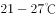

# 2021年北京市公务员录用考试《行测》题（乡镇卷）（网友回忆版）

> 言语理解与表达 · 35 题 · 北京 2021

## 材料 1

以下是略有删节的公文部分内容，阅读之后回答51—55题。

第一节　传承千年运河，滋养流动的精神家园

第41条　构建“一河两道三区”发展格局

建设大运河国家文化公园（北京段），对文物本体及环境实施严格保护和管控，打造保护第一、传承优先的样板区，规划大运河文化主题展示区，建设文化旅游深度融合发展示范区。以大运河为轴线，建设全线滨河绿道及重点游船通航河道，结合大运河沿线不同特点，打造大运河文化展示区、大运河生态景观区和疏解整治提升区，构建“一河两道三区”的大运河文化带发展格局，传承大运河文化，激活沿线发展活力，进一步擦亮世界公认的国家文化符号。

第42条　系统开展大运河文化遗产保护

<u>        </u>大运河沿线文化遗产保护清单，系统开展大运河历史文化遗址遗迹保护工作。合理保存传统文化生态，逐步疏导不符合规划要求的设施、项目，<u>        </u>做好沿线古桥、古闸、古码头、古仓库等建筑遗迹和文物的保护修缮，聚焦重要物质文化遗产，扩大文物展览开放空间。加强路县故城遗址和通州古城整体保护利用，在活态保护中留住漕运古城风貌。推进重点片区的疏解搬迁与整治提升，规划建设大运河源头遗址公园，有效恢复历史景观格局。

第43条　<u>                    </u>

聚焦北运河、通惠河、萧太后河等大运河重要水系，开展综合治理，全面改善大运河生态环境，实现沿线污水全处理，河道水体全面还清。加强老城内历史水系保护，研究制定古河道恢复和景观设计方案，串联沿线闸桥古迹，增加人文景观和配套设施，展现古桥纵横、古屋比邻、商铺连绵、水穿街巷的亲水休闲历史风貌。做好北京城市副中心大运河两岸景观整体规划，精心打理水系，贯通亲水步道，打造高品质生态景观廊道。在大运河沿线构建大尺度绿色开放空间，更好服务群众休闲游憩。

第44条　打造文化旅游魅力走廊

做好“三庙一塔”周边风貌管控，优化提升旅游配套设施和服务品质，积极创建集休闲、度假、体验于一体的北京（通州）大运河国家5A景区。整合大运河水系、城市森林、文化遗产等资源，2021年实现北运河北京段通航，远期推进与天津、河北段通航，打造大运河水上旅游精品线路。统筹大运河文化带保护利用，保护张家湾古镇、漷县古镇，精心打造昌平白浮村、朝阳高碑店村、通州皇木厂村等传承大运河历史文化的特色古村落，促进遗产保护与区域发展的协调统一。利用在北京城市副中心规划的重大公共文化设施，展示好大运河文化，讲好大运河故事。

第45条　编织协同发展文化纽带

加大与天津、河北的工作对接力度，共同加强大运河京津冀段遗产保护，加快梳理大运河历史文脉。协同开发利用区域文化资源，促进文化产业和旅游休闲产业协同发展。按照统一标准，加强大运河水环境保护，整体塑造大运河沿线风貌，带动大运河周边区域发展。用好大运河文化带京杭对话等合作机制，联合大运河沿线八省市共同推动大运河文化传播推广。

### 第 1 题　qid 2742324 · 片段阅读

本文节选自某篇公文，该公文的标题最可能是：

- **A**. 《北京市非物质文化遗产条例》
- **B**. 《中共北京市委关于新时代繁荣兴盛首都文化的意见》
- **C**. 《北京市关于做好旅游景区疫情防控和安全有序开放工作的通知》
- **D**. 《北京市推进全国文化中心建设中长期规划（2019年-2035年）》　✅

**答案**：D

**官方解析**

本文共论述了公文中第41-45条的内容。第41条主要介绍了建设大运河国家文化公园（北京段）及沿线景区；第42条主要介绍了对大运河文化遗产保护的措施；第43条主要介绍了要全面改善大运河生态环境和旅游环境的措施；第44条主要介绍了如何打造围绕大运河文化的文化旅游系列产品；第45条主要介绍了与天津、河北协力开发区域文化旅游资源的措施。概括起来，即本文主要论述了北京发展大运河及其辐射区域的旅游、文化资源的举措，对应D项。
A项，“非物质文化遗产”是非物质形态的，本文第42条明确论述了“聚焦重要物质文化遗产”，排除；
B项，“首都文化”强调的是首都，而本文论述了大运河及其辐射地区，包括天津、河北的协同发展，排除；
C项，“疫情防控和安全有序开放工作”本文未提及，无中生有，排除。
故正确答案为D。
【文段出处】《北京市推进全国文化中心建设中长期规划（2019年-2035年）》

---

### 第 2 题　qid 2742330 · 逻辑填空

依次填入文中第42条画横线处最恰当的是：

- **A**. 完善 统筹　✅
- **B**. 制定 及时
- **C**. 整理 持续
- **D**. 研究 切实

**答案**：A

**官方解析**

第一空，搭配“保护清单”。A项“完善”的意思是使完备美好，B项“制定”指制作编定，C项“整理”强调整顿，使之有条理，均可搭配，保留。D项“研究”可表述为研究制定保护清单，单独与“保护清单”搭配不当，排除。
第二空，横线处搭配多处建筑遗迹及文物的保护修缮。A项“统筹”表示统一筹划，与开展多项工作搭配恰当，当选。B项“及时”强调效率，C项“持续”指连续不断，文段未提及效率、持续性方面的话题，均排除。
故正确答案为A。
【文段出处】《北京市推进全国文化中心建设中长期规划（2019年-2035年）》

---

### 第 3 题　qid 2742331 · 语句表达

以下最适合填入文中第43条画横线处的是：

- **A**. 严格落实世界文化遗产保护要求
- **B**. 营造蓝绿交织生态文化景观　✅
- **C**. 加强大运河地区整体保护
- **D**. 发挥大运河文化辐射带动作用

**答案**：B

**官方解析**

第43条首先介绍了开展几条重要水系的综合治理，改善大运河生态环境，然后论述了打造亲水休闲旅游景观的措施，接着表示要做好大运河两岸景观的整体规划，构建绿色开放空间。概括该条内容，即论述了大运河及其沿岸的水系治理和景观环境建设规划，对应B项，“蓝”对应水系治理，“绿”对应景观建设。
A项，“世界文化遗产保护要求”文段未提及，无中生有，排除；
C项，“整体保护”对比B项，表述不明确，文段强调了对水系、生态环境方面的建设，排除；
D项，“发挥······带动作用”强调的是怎样使大运河文化对周边地区产生影响，文段未提及，排除。
故正确答案为B。
【文段出处】《北京市推进全国文化中心建设中长期规划（2019年-2035年）》

---

### 第 4 题　qid 2742337 · 片段阅读

下列哪项均为文中提到的大运河沿线所包含的景观：

- **A**. 特色古村、亲水步道、皇家园林、城市森林
- **B**. 漕运古城、景观廊道、皇家园林、矿山遗址
- **C**. 漕运古城、特色古村、亲水步道、城市森林　✅
- **D**. 特色古村、亲水步道、城市森林、矿山遗址

**答案**：C

**官方解析**

A项和B项的“皇家园林”、B项和D项的“矿山遗址”本文均未提及，排除。
C项“漕运古城”对应第42条“在活态保护中留住漕运古城风貌”，“特色古村”对应第44条“······通州皇木厂村等传承大运河历史文化的特色古村落”，“亲水步道”对应第43条“精心打理水系，贯通亲水步道”，“城市森林”对应第44条“整合大运河水系、城市森林······”，当选。
故正确答案为C。
【文段出处】《北京市推进全国文化中心建设中长期规划（2019年-2035年）》

---

### 第 5 题　qid 2742341 · 片段阅读

根据第45条，如果北京市人民政府与天津市人民政府、河北省人民政府拟共同印发一份关于加强大运河京津冀段遗产保护的文件，下列说法中不正确的是：

- **A**. 该公文应由三省市发文机关办公厅负责审核
- **B**. 该公文应由三省市发文机关的负责人会签
- **C**. 该公文应由三省市同级机关联合行文
- **D**. 该公文成文日期应为负责主要起草工作的发文机关负责人签发日期　✅

**答案**：D

**官方解析**

A项说法正确，根据《党政机关公文处理工作条例》第二十条规定，公文文稿签发前，应当由发文机关办公厅（室）进行审核，排除；
B项说法正确，联合行文需要行文各个机关的负责人会签，排除；
C项说法正确，联合行文的各机关部门必须是同级的，排除；
D项说法错误，根据《党政机关公文处理工作条例》第九条第十二项规定，联合行文时，公文的成文日期以最后一个机关负责人的签发日期为准，而不是主要负责人的，当选。
本题为选非题，故正确答案为D。
【文段出处】《北京市推进全国文化中心建设中长期规划（2019年-2035年）》

---

## 材料 2

        人体内每种细胞的表面都有一层独特的含糖外衣。细胞之间进行相互作用时，比如细菌和病毒感染人体时，必须识别糖代码并进行适当的“分子握手”。如果能够破解细胞“甜言蜜语”中的奥秘，掌握阅读和书写这种细胞语言的技巧，我们将获得一种强有力的干预细胞活动的新方法，从而控制和治疗相关疾病。然而要做到这一点并不容易，作为细胞语言的糖代码非常复杂。

        英国科学家在解释糖代码的复杂性时说，试着想象你是一种细菌，正在接近宿主细胞，在其表面上的生物分子“森林”上跳伞。你首先遇到的是由糖构成的“树枝”，它们通过蛋白质“树干”与细胞膜相连。任何想进入宿主细胞的细菌都必须<u>                    </u>。这是一个很高的要求，因为含糖“树枝”的形状太复杂了。糖代码（称为糖组）含有数十种不同的糖，这些糖在被称为聚糖的支链中融合在一起。阅读糖代码不仅仅是逐字解码，而是要认识每种糖的形状并理解它的含义。

        在自然界中负责抓取细胞表面糖的是被称为凝集素的蛋白质，其内部空腔与特定的糖紧紧贴合在一起。我们知道凝集素的发现已有100多年的历史，并且最近已经开始进行人工制造。但仅仅对不同的凝集素进行整理分类并没有提高我们对糖代码的理解。而当化学家分离出特定的糖并确定了它们的结构之后，我们才对糖代码有了进一步的了解。由于它们如此的庞大、复杂，最好的方法是利用质谱仪，将它们分解为一系列的小片段，借助算法重建母体分子。到了21世纪初，科学家已经确定了一些装饰某些类型细胞的糖。2002年，英国伦敦帝国理工学院的科学家提出了一种方法，将数百个单糖固定在一个培养皿上，然后用各种凝集素和其他分子对它们进行清洗，看看哪些分子会互相结合。这是理解糖代码的一种自动化方法。不久之后，人们尝试利用这种方法，来探究艾滋病病毒和H1N1流感病毒在感染人体的过程中，与人体细胞表面上的哪些糖类进行了结合。然而，我们对于细胞的糖代码仍然知之甚少。

        单纯阅读糖代码相对简单，但是如何书写或重写它们呢？这意味着将单个糖分子拼接成聚糖，这是一项艰苦的工作，包括要引导每种糖以正确的方式进行化学反应等。在人体内，这项工作由各种酶负责。不过，这项工作具有更加重要的意义。研究致病微生物表面的聚糖有助于开发更具针对性的疫苗。这种疫苗可使人体的免疫系统发现这些聚糖并杀死致病微生物。一些针对流感和脑膜炎的疫苗已经含有糖的成分，将来，这种方法可以有效治疗包括疟疾在内的其他疾病。

### 第 6 题　qid 2742347 · 片段阅读

文中第1段“这一点”，指的是：

- **A**. 掌握细胞的结构与机能
- **B**. 识别细胞表面的糖代码　✅
- **C**. 获取干预细胞活动的方法
- **D**. 控制和治疗相关疾病

**答案**：B

**官方解析**

定位文章第1段尾句，“这一点”指代前文。前文首先指出细胞之间相互作用时“必须识别糖代码”，之后介绍了识别糖代码的好处，即“获得······干预细胞活动的新方法，从而控制和治疗相关疾病”。故“这一点”指代“识别糖代码”，且与尾句后半部分话题一致，呼应得当，对应B项。
A项，文段并未涉及“细胞的结构与机能”，故无中生有，排除；
C项，“获取干预细胞活动的方法”与文段表述的“新方法”概念偷换，且“干预细胞活动的新方法”也指代前文“识别糖代码”，故表述不如B项明确，排除；
D项，“控制和治疗相关疾病”是“识别糖代码”带来的好处，但“这一点”应指代“识别糖代码”，故对应错误，排除。
故正确答案为B。
【文段出处】《细胞的“甜言蜜语”》

---

### 第 7 题　qid 2742348 · 语句表达

填入文中第2段画横线处最恰当的是：

- **A**. 有一个与含糖“树枝”相匹配的形状　✅
- **B**. 找到“树枝”与“树干”相恰的连接方式
- **C**. 在接近生物分子“森林”时找到合适的跳伞时机
- **D**. 首先识别蛋白质“树干”的种类、顺序等特点

**答案**：A

**官方解析**

横线位于文章第2段中间，需承上启下。横线前指出，细菌正在接近宿主细胞，在生物分子“森林”上跳伞，首先遇到的是由糖构成的“树枝”。横线后“这是一个很高的要求，因为含糖‘树枝’的形状太复杂了”。联系前后可知，横线处应围绕“树枝”谈论。A项，话题一致，且根据“含糖‘树枝’的形状太复杂了”可知，“细菌必须有一个与含糖‘树枝’相匹配的形状”要求很高，与后文呼应得当，符合文意，当选。
B项，横线处应体现“细菌”与“树枝”的关系，并非“树枝”与“树干”的关系，排除；
C项围绕“森林”谈论、D项围绕“树干”谈论，均与“树枝”话题无关，排除。
故正确答案为A。
【文段出处】《细胞的“甜言蜜语”》

---

### 第 8 题　qid 2742349 · 片段阅读

人们对糖代码的进一步了解，源于：

- **A**. 发现了凝集素蛋白质
- **B**. 成功制造出人造凝集素
- **C**. 分离出特定的糖并确定其结构　✅
- **D**. 发明自动化清洗方法

**答案**：C

**官方解析**

“对糖代码的进一步了解”出现在第3段中间位置，根据“当化学家分离出特定的糖并确定了它们的结构之后，我们才对糖代码有了进一步的了解”可知，C项为正确答案。
A、B两项，根据第3段“我们知道凝集素的发现已有100多年的历史，并且最近已经开始进行人工制造。但仅仅对不同的凝集素进行整理分类并没有提高我们对糖代码的理解”，可知，“发现了凝集素蛋白质”“成功制造出人造凝集素”并不能让人们对糖代码有进一步了解，均排除；
D项，根据第3段“2002年，英国伦敦帝国理工学院的科学家提出了一种方法······用各种凝集素和其他分子对它们进行清洗······这是理解糖代码的一种自动化方法”可知，“发明自动化清洗方法”在对糖代码的进一步了解之后，并非是促进人们对糖代码进一步了解的原因，排除。
故正确答案为C。
【文段出处】《细胞的“甜言蜜语”》

---

### 第 9 题　qid 2742350 · 片段阅读

下列说法与本文不相符的是：

- **A**. 细胞表面的糖可以用于细胞识别
- **B**. 凝集素的功能是结合细胞表面的糖
- **C**. 人体中的酶能够引导糖分子拼接成聚糖
- **D**. 聚糖合成技术已在疟疾治疗中得到应用　✅

**答案**：D

**官方解析**

A项，根据第1段“细胞之间进行相互作用时，比如细菌和病毒感染人体时，必须识别糖代码并进行适当的‘分子握手’”可知，细胞表面的糖可以用于细胞识别，表述正确，排除；

B项，根据第3段“在自然界中负责抓取细胞表面糖的是被称为凝集素的蛋白质”可知，凝集素可以结合细胞表面的糖，表述正确，排除；
C项，根据第4段“······这意味着将单个糖分子拼接成聚糖，这是一项艰苦的工作，······在人体内，这项工作由各种酶负责”可知， 人体中的酶能够引导糖分子拼接成聚糖，表述正确，排除；
D项，根据第4段“研究致病微生物表面的聚糖有助于开发更具针对性的疫苗······将来，这种方法可以有效治疗包括疟疾在内的其他疾病”可知，现在尚未在疟疾治疗中应用，故“已在疟疾治疗中得到应用”，表述有误，当选。
本题为选非题，故正确答案为D。
【文段出处】《细胞的“甜言蜜语”》

---

### 第 10 题　qid 2742351 · 片段阅读

最适合做本文题目的是：

- **A**. 庞大的细胞“森林”
- **B**. 品尝另一种“糖”
- **C**. 细胞的“甜言蜜语”　✅
- **D**. 解码细胞生命之谜

**答案**：C

**官方解析**

文章第1段，通过介绍细胞的表面都有一层独特的含糖外衣，引出细胞的“糖代码”这一话题，并指出破解细胞“甜言蜜语”中的奥秘，即破解糖代码的好处；第2段解释了阅读和理解糖代码的复杂性；第3段介绍了我们由浅入深理解糖代码的过程；第4段阐述了由“理解”到“书写或重写”糖代码即“研究致病微生物表面的聚糖”对治疗疾病的重大意义。故文章全篇围绕“细胞的糖代码”论述，C项“甜言蜜语”指代“糖代码”，应作为文章题目。
A项，细胞“森林”指代生物分子，“细胞的糖代码”仅为“树枝”，故概念扩大，排除；
B项，“另一种”表述不明确，未出现主题词“细胞的糖代码”，排除；
D项，“细胞生命”将“细胞表面的糖代码”这一概念偷换，排除。
故正确答案为C。
【文段出处】《细胞的“甜言蜜语”》

---

## 材料 3

        科技发展蕴藏着进步力量。近年来，人工智能、大数据、5G等技术与医疗行业深度融合，为健康事业插上了智能翅膀。从可穿戴设备掀起健康管理热潮，到影像辅助技术用于病灶精准识别，再到远程医疗让大山里的病人也能享受到先进的医疗服务，技术红利大大提高了医疗服务质量，也深刻改变着医疗服务模式和理念，为构建新型医疗体系提供了重要支撑。

        人工智能赋能医疗，为我们呈现了一个美好前景。同时，<u>                     </u>。比如，数据是智能医疗的基础，但目前医疗健康数据的标准化、统一化和智能化尚有待提升。我国拥有上万家医院，每年产生的医疗健康数据规模巨大，但绝大部分是非结构化的数据，成为行业创新发展的瓶颈。又如，当前人工智能产品数量可观，但质量参差不齐，从量的积累到质的飞跃，亟待攻克一些核心技术短板、培养大量复合型人才。解决这些问题，需要政府立足长远科学谋划、破除政策壁垒，优化产学研成果转化机制、激发创新的动力，也需要相关企业加大研发力度、埋头攻关。各方形成合力，才能推动智能医疗行稳致远。

        也要看到，技术进步回避不了伦理道德问题。医疗人工智能技术只有与情感、伦理等人类最基本的需求相结合，才能真正实现造福人民的初衷。必须坚持以人民为中心的发展理念，把群众在医疗服务中反映最强烈的问题，作为科技创新攻关的方向。与此同时，也要处理好医疗人工智能在主体资格、侵权责任、数据和隐私保护等方面可能出现的问题，以安全、可靠、可控的技术产品，更好服务医生、患者和医疗事业。

        实施健康中国战略，是党的十九大报告提出的重要目标。健康中国关系到每个人的切身利益，也是人民群众获得感幸福感的重要来源。作为引领新一轮科技革命和产业革命的重要驱动力，人工智能为实现“健康中国”拓展了新的空间。从这个意义上说，筑牢技术创新的基石，擦亮造福人民的底色，智能医疗时代大有可为。

### 第 11 题　qid 2742335 · 片段阅读

关于医疗人工智能的应用，文中没有提到的是：

- **A**. 远程医疗
- **B**. 可穿戴设备
- **C**. 影像辅助技术
- **D**. 养老服务机器人　✅

**答案**：D

**官方解析**

文章第一段介绍了医疗人工智能的应用，由“从可穿戴设备掀起健康管理热潮······也能享受到先进的医疗服务”可知，A项“远程医疗”、B项“可穿戴设备”、C项“影像辅助技术”文中均有所提及，排除；
D项“养老服务机器人”文中并未介绍，当选。
本题为选非题，故正确答案为D。
【文段出处】《人工智能为医疗打开更大空间》

---

### 第 12 题　qid 2742338 · 语句表达

填入文中第2段画横线部分最恰当的一句是：

- **A**. 发展的过程中也面临着一些挑战　✅
- **B**. 政府与企业间的合作还有待加强
- **C**. 在医疗人工智能核心技术上存在短板
- **D**. 人工智能和医疗的复合型人才储备不足

**答案**：A

**官方解析**

横线出现在第2段中间，需注意与上下文的衔接。横线之前提到人工智能赋能医疗呈现了美好前景，横线之后通过“比如······又如······”举例介绍目前人工智能赋能医疗存在的一些问题，因此横线处应体现出人工智能赋能医疗中存在的一些问题，对应A项。
B项，“政府与企业间的合作”对应问题之后对策的介绍，与横线后问题的介绍衔接不当，排除；
C项，“医疗人工智能核心技术”表述片面，后文还提及“培养大量复合型人才”等其他问题，排除；
D项，“复合型人才储备不足”仅侧重人才不足，表述片面，排除。
故正确答案为A。
【文段出处】《人工智能为医疗打开更大空间》

---

### 第 13 题　qid 2742339 · 片段阅读

以下哪项最符合作者的观点？

- **A**. 有感情、有意识地提供医疗服务的机器人同样应享有人权
- **B**. 群众在医疗服务中反映最强烈的问题正是科技创新的突破口　✅
- **C**. 每年规模巨大的医疗健康数据促进了医疗人工智能技术的发展
- **D**. 医疗人工智能技术的进步有助于医疗伦理道德问题的解决

**答案**：B

**官方解析**

A项，“享有人权”无中生有，文段仅提到医疗人工智能技术只有与情感、伦理等人类最基本的需求相结合，才能真正实现造福人民的初衷，排除；
B项，由第3段“把群众在医疗服务中反映最强烈的问题，作为科技创新攻关的方向”可知，该项表述正确，当选；
C项，由第2段“我国拥有上万家医院······瓶颈”可知，该项说法与文意相悖，排除；
D项，由第3段“技术进步回避不了伦理道德问题”可知，医疗人工智能技术的进步并不能帮助解决医疗伦理道德问题，表述错误，排除。
故正确答案为B。
【文段出处】《人工智能为医疗打开更大空间》

---

### 第 14 题　qid 2742353 · 片段阅读

本文与以下哪一项“实施健康中国战略”的举措有关？

- **A**. 全面建立分级诊疗制度
- **B**. 健全全民医疗保障制度
- **C**. 发展健康产业，满足人民群众多样化健康需求　✅
- **D**. 完善人口政策，促进人口均衡发展与家庭和谐幸福

**答案**：C

**官方解析**

根据“健康中国关系到每个人的切身利益，也是人民群众获得感幸福感的重要来源。作为引领新一轮科技革命和产业革命的重要驱动力，人工智能为实现‘健康中国’拓展了新的空间”可知，人工智能赋能医疗满足的是每个人的健康需求。C项“发展健康产业，满足人民群众多样化健康需求”符合文意，当选。
A项，“分级诊疗制度”指按照疾病的轻重缓急及治疗的难易程度进行分级，不同级别的医疗机构承担不同疾病的治疗，是医疗制度的介绍，与文意无关，排除；
B项，“全民医疗保障制度”指医保的全覆盖，与文意无关，排除；
D项，“完善人口政策”文章并未提及，排除。
故正确答案为C。
【文段出处】《人工智能为医疗打开更大空间》

---

### 第 15 题　qid 2742354 · 片段阅读

最适合做本文标题的是：

- **A**. 人工智能为医疗打开更大空间　✅
- **B**. 创新医疗服务大有可为
- **C**. 人工智能带来的希望与挑战
- **D**. 健康中国战略实施路径

**答案**：A

**官方解析**

文章第一段指出科技发展为构建新型医疗体系提供了重要支撑，第二段介绍人工智能赋能医疗存在的问题和解决方法，第三段指出发展医疗人工智能的一些要求，第四段介绍人工智能为实现“健康中国”拓展了新的空间，文章通篇围绕人工智能及医疗的话题展开，介绍了人工智能为医疗赋能，A项“打开更大空间”即为医疗赋能，符合文意，当选。
B项，“创新医疗服务”偏离文章核心话题，文章围绕人工智能赋能医疗的话题展开，排除；
C项，偏离文章核心话题“医疗”，排除；
D项，“健康中国战略实施路径”偏离文章核心话题，文章围绕人工智能赋能医疗的话题展开，排除。
故正确答案为A。
【文段出处】《人工智能为医疗打开更大空间》

---

## 材料 4

①历史学家曾经纠结于是否将采集狩猎时代写进历史，因为他们大多缺乏相应的研究技术，无法了解一个没有文字证据的时代。通常来说，研究采集狩猎的不是历史学家，而是考古学家、人类学家和史前历史学家。

②在缺乏文字证据的情况下，学者们常常采用三种截然不同的证据来了解这段时期的历史。第一种是远古社会留下的物质遗迹。考古学家解读人类骨骼、石器和其他历史遗迹，研究远古人类及其猎物的遗骸，或者某些物品的残留物，如石器、制作品或者食物残渣。此外，自然环境中的一些研究证据，也可以帮助学者们了解气候和环境变化。我们没有发现多少人类历史最早时期的骨骼遗迹，能够确认属于现代人类的骨骼遗迹，最早只能追溯至16万年前。尽管如此，考古学家仍能从支离破碎的骨骼遗迹中读取大量令人震惊的消息。比如，通过研究从海床和数万年前形成的冰盖中提取的花粉和果核样本，考古学家们已经成功地重构了当时的气候和环境变化模型，而且准确度越来越高。此外，半个世纪以来不断改进的年代测定技术，让我们能更加准确地推算年代，从而为整部人类历史编纂更加准确的大事年表。

③第二种用来研究早期人类历史的主要证据，来自于对现代采集狩猎部落的研究。这种研究方法必须<u>            </u>，因为现代采集狩猎者毕竟来自现代，他们的生活方式或多或少受到现代社会的影响。尽管如此，通过研究现代采集狩猎的生活方式，我们能够更多地了解古代小型采集狩猎部落的基本生活方式。这种研究可以帮助史前历史学家更好地解读为数不多的史前考古证物。

④近年来，基于现代基因差异进行对比研究的新方法，成为研究早期人类历史的第三种途径。基因研究可以测定现代族群之间的基因差异程度，帮助我们推测自己族群的历史，以及确定远古人口迁移时，不同族群分散的时间。

⑤要将这些不同类型的证据整合进一部世界历史并不简单：首先，大多数历史学家缺乏必要的专业知识和训练；其次，考古遗迹、人类学成果和基因研究会产生不同类型的信息，这些信息和大多数专业历史学家视为首要研究基础的文字记载是截然不同的。来自于采集狩猎时代的考古证据，无法像书面材料一样记载个性化的细节，但它可以揭示许多关于人类生活方式的信息。整合这些不同学科领域的真知洞见，是世界历史面临的主要挑战之一，尤其在研究采集狩猎时代时，它是我们必须直面的挑战。

### 第 16 题　qid 2742332 · 片段阅读

“尽管考古证据向大家展示的大多是人类祖先的物质生活，但时不时也会让我们瞥见他们的文化甚至精神生活。我们至今仍然无法准确解读远古人类的一些艺术作品，如法国南部和西班牙北部的洞穴壁画，但是这些令人惊叹的艺术创作的确能向我们揭示更多关于早期人类社会的情况。”
这段文字最适合放入文中的位置是：

- **A**. ①段和②段之间
- **B**. ②段和③段之间　✅
- **C**. ③段和④段之间
- **D**. ④段和⑤段之间

**答案**：B

**官方解析**

所给文段论述“考古证据”的作用，即不仅展示物质生活也展示精神生活。
文章第②段介绍考古学家通过远古社会留下的物质遗迹来了解历史，属于“考古证据”，二者话题一致，第③段介绍通过对现代采集狩猎部落的研究了解历史，不属于“考古证据”，故题干文段应放在第②段和第③段之间，B项当选。
A项，文章第②段指出学者们采用三种证据来了解采集狩猎时代的历史，并引出关于考古证据的介绍，故题干文字应位于第②段后面，排除。
文章第③段和第④段分别介绍现代采集狩猎部落的证据和基因方面的证据，均与题干文字话题不一致，排除C、D两项。
故正确答案为B。
【文段出处】《极简历史系列》

---

### 第 17 题　qid 2742342 · 片段阅读

“对牙齿的细致研究，可以告诉我们许多关于早期人类日常饮食的信息，而日常饮食又可以揭示许多关于生活的信息。同样，男女之间骨骼大小的差异，也可以帮助我们了解不少两性关系方面的信息。”对牙齿和骨骼的研究属于文中的哪种研究方法？

- **A**. 第一种　✅
- **B**. 第二种
- **C**. 第一种和第三种
- **D**. 三种都有

**答案**：A

**官方解析**

文章第②段指出“考古学家解读人类骨骼、石器和其他历史遗迹，研究远古人类及其猎物的遗骸，或者某些物品的残留物，如石器、制作品或者食物残渣”，对牙齿和骨骼的研究属于第②段的内容，故应属于第一种研究方法，A项当选。
第二种方法是研究现代采集狩猎部落，第三种方法是基于现代基因差异进行对比研究，均不包括对牙齿和骨骼的研究，排除B、C、D三项。
故正确答案为A。
【文段出处】《极简历史系列》

---

### 第 18 题　qid 2742343 · 片段阅读

最适合填入文中第③段画线处的是：

- **A**. 谨慎使用　✅
- **B**. 不断完善
- **C**. 与时俱进
- **D**. 推而广之

**答案**：A

**官方解析**

横线后“因为”对空缺处进行解释说明，指出“现代采集狩猎者毕竟来自现代，他们的生活方式或多或少受到现代社会的影响”，意思是这种研究方法存在一定的局限性、不可靠性，A项“谨慎使用”强调在使用过程中要慎重，充分考虑到其中的不确定性，符合文意。
B项，文段没有体现出要对该方法进行“完善”，排除；
C项，“与时俱进”指随时间发展不断进步，文段没有体现出方法要随时间不断进步，排除；
D项，“推而广之”强调要推广使用，而横线后重点体现该方法的局限性，与文意相悖，排除。
故正确答案为A。
【文段出处】《极简历史系列》

---

### 第 19 题　qid 2742344 · 片段阅读

以下哪项研究成果可以作为第三种证据？

- **A**. 某研究小组开发一种算法，对12种不同类型的癌症、3100多个癌症相关基因病变、数以亿计的基因进行筛选，精确地筛选出了89对合成致死基因
- **B**. 某国科学家近日在染色体3D结构以及在早期胚胎发育过程中染色体结构的重编程变化方面取得重大科学突破
- **C**. 某研究团队发表了对当代希腊人、古代迈锡尼人等群体的DNA检测结果，认为当代希腊人的绝大部分DNA继承自古迈锡尼人，而少部分基因来自外来移民　✅
- **D**. 一项研究分析了近800万个DNA位点和皮肤感知年龄的关系，发现带有MC1R基因特殊基因型的人看起来比同龄人平均年老两岁

**答案**：C

**官方解析**

重点关注第④段，第三种证据指“基于现代基因差异进行对比研究的新方法”，“可以测定现代族群之间的基因差异程度，帮助我们推测自己族群的历史，以及确定远古人口迁移时，不同族群分散的时间”。C项是通过对当代希腊人的基因进行测定，并与其他族群基因进行对比研究，推测当代希腊人的族群历史，属于第三种证据，当选。
A项，主要是通过癌症相关基因和癌症的统计学分析，筛选出合成致死基因，并非测定族群之间的基因差异度，排除；
B项，研究对象是染色体的结构和结构的重编程变化，不涉及族群基因及历史发展，排除；
D项，分析对象是基因和皮肤感知年龄，得到的结果是基因型与年龄感的关系，与族群基因和族群的历史发展无关，排除。
故正确答案为C。
【文段出处】《极简历史系列》

---

### 第 20 题　qid 2742346 · 片段阅读

这篇文章意在说明，在研究采集狩猎时代时：

- **A**. 传统历史学家的研究存在一定局限
- **B**. 整合多学科的研究成果是一大挑战　✅
- **C**. 对物质遗迹的研究相较其他方法更为可靠
- **D**. 应该加大对现代采集狩猎部落的研究力度

**答案**：B

**官方解析**

文章第①到④段详细介绍了研究采集狩猎时代的三种方法。最后一段对上文三种方法结果进行整合，为全文的重点，最后一段指出要将这些不同类型的证据整合起来并不容易，“整合这些不同学科领域的真知洞见”，尤其是研究采集狩猎时代，是必须直面的挑战。故文章意在说明，在研究采集狩猎时代时，要整合不同学科领域的研究成果是一项重大挑战，对应B项。
A项，“传统历史学家的研究”对应最后一段的“首先”之后，是证据整合困难的一个方面，表述片面，排除；
C项，“对物质遗迹的研究”只是文章所介绍的研究方法之一，不足以概括全文，排除；
D项，文章没有指出要加大对现代采集狩猎部落的研究力度，无中生有，排除。
故正确答案为B。
【文段出处】《极简历史系列》

---

### 第 21 题　qid 2742295 · 逻辑填空

语言是民族认同最重要的标志，因此，大力开展历史汉语、现代汉语研究的重要性            。
填入画横线部分最恰当的一项是：

- **A**. 有目共睹
- **B**. 不言而喻　✅
- **C**. 不置可否
- **D**. 众口一词

**答案**：B

**官方解析**

由文段“语言是民族认同最重要的标志”可知，大家对于语言重要性的认识是非常清晰的，B项“不言而喻”形容道理很浅显，不用说，大家都明白，能够体现出大家对于语言重要性的高度认同，符合文意，当选。
A项“有目共睹”指人人可以看到，极其明显，通常搭配“成效”“成就”等结果，与“重要性”搭配不当，排除；
C项“不置可否”指不表明态度，既不说对，也不说不对，文段前文已明确表示大家都是认同语言的重要性的，不符合文意，排除；
D项“众口一词”形容许多人都说同样的话，与“重要性”搭配不当，排除。
故正确答案为B。
【文段出处】《如何做好断代汉语方言史研究》

---

### 第 22 题　qid 2742300 · 逻辑填空

《中庸》不同于《大学》，后者            ，对于核心概念的相互关系有明确规定；前者相对散漫，没有交代各个部分之间的逻辑联系，留下巨大的言说空间与理论张力。
填入画横线部分最恰当的一项是：

- **A**. 纲举目张　✅
- **B**. 包罗万象
- **C**. 字字珠玑
- **D**. 条分缕析

**答案**：A

**官方解析**

由横线后“对于核心概念的相互关系有明确规定”可知，横线处需体现后者关系比较明确，且由“《中庸》不同于《大学》”可知，横线处所填成语与下文“散漫”语义相反，A项“纲举目张”意为提起渔网的总绳一撒，所有网眼就都张开了，比喻做事抓住要领，就可带动其他环节；也比喻文章条理分明。填入横线处可体现后者书中对于核心概念关系的规定是比较条理清晰、明确的，符合文意，当选。
B项“包罗万象”形容内容丰富，无所不有，C项“字字珠玑”意思是比喻说话、文章的词句十分优美，均不符合文意，排除；D项“条分缕析”意思是有条有理地细细分析，与“纲举目张”的最大区别在于，“条分缕析”仅强调有条理，而“纲举目张”中的“纲、目”与后文“核心概念”的对应更加准确，排除。
故正确答案为A。
【文段出处】《谢琰：从文体角度考察&lt;中庸&gt;升格》

---

### 第 23 题　qid 2742303 · 逻辑填空

在艺术加工时，为了制造情节冲突难免会和现实之间产生“折射”，导致        偏差，在一些情况下，只要“无关大雅”便“相安无事”。因此，我们不能过于        地要求电影等同现实。
依次填入画横线部分最恰当的一项是：

- **A**. 观点 简单
- **B**. 主题 严厉
- **C**. 线索 粗暴
- **D**. 细节 苛刻　✅

**答案**：D

**官方解析**

第一空，搭配“偏差”，且根据“为了制造情节冲突难免会和现实之间产生‘折射’”及“无关大雅”可知，此处应表示为了制造情节冲突，电影情节和现实之间会有一些偏差，且程度较轻。C项“线索”、D项“细节”均符合文意，保留。A项“观点”、B项“主题”均程度过重，排除。
第二空，根据“只要‘无关大雅’便‘相安无事’”可知，电影情节和现实之间会有偏差，但只要对主要方面没有妨害，就彼此和睦相处，故此处应体现我们对无关大雅的“偏差”，不应过严地要求，D项“苛刻”指（条件、要求等）过于严厉、刻薄，符合文意，当选。C项“粗暴”指鲁莽、暴躁，无法体现“过严地要求”，排除。
故正确答案为D。
【文段出处】《电影&lt;中国女排&gt;观后感》

---

### 第 24 题　qid 2742311 · 逻辑填空

总是盯着科学大问题，不如蹲下身子多从        之处发掘一些“小问题”。有些科学问题看似小，只要            可能会有意想不到的惊喜。
依次填入画横线部分最恰当的一项是：

- **A**. 矛盾 矢志不渝
- **B**. 空白 锲而不舍
- **C**. 细微 坚持不懈　✅
- **D**. 隐蔽 百折不挠

**答案**：C

**官方解析**

第一空，根据文意可知，此处应体现需要“蹲下身子”，才能发现小问题，C项“细微”、D项“隐蔽”均可体现需蹲下身子找小问题之意，保留。A项“矛盾”、B项“空白”，均与需“蹲下身子”无关，且与前后的“大小问题”的对比无法对应，排除。
第二空，根据文意可知，有些科学问题看似小，但也会有意想不到的惊喜。C项“坚持不懈”指坚持到底，一点不松懈，填入文段可体现出对于“小的科学问题”，只要坚持钻研也可能会有重大发现，符合文意，当选。D项“百折不挠”形容意志坚强，屡受挫折而不屈服，文段未体现出“小的科学问题”让人们屡受挫折，排除。
故正确答案为C。
【文段出处】科技杂谈《“小问题”能挖出“大智慧”》

---

### 第 25 题　qid 2742318 · 逻辑填空

公众对科普活动参与度越高，越有助于科学素质的提升；公众科学素质越高，科普事业也随之            。两者的良性循环，无疑会        出科学事业和创新驱动战略的一片沃土，培育出更多的创新人才和高素质创新大军。
依次填入画横线部分最恰当的一项是：

- **A**. 水涨船高 涵养　✅
- **B**. 日臻完善 挖掘
- **C**. 一日千里 开拓
- **D**. 方兴未艾 积蓄

**答案**：A

**官方解析**

第一空，根据并列关联词“也”和前文“越有助于科学素质的提升”可知，横线处所填成语表达科普事业随着公众科学素质的提高发展得越来越好之意。A项“水涨船高”比喻事物随着它所凭借的基础的提高而提高，符合文意，保留。B项“日臻完善”指一天天逐步达到完美的境地，与“随之”搭配不当，且文段并未提到科普事业逐步达到完美的境地，排除；C项“一日千里”形容进展极快，文段并非表示发展速度快，用在此处程度过重，排除；D项“方兴未艾”形容事物正在兴起发展，一时不会终止，横线处强调的是随着公众科学素质的提高变得更好，并非单纯强调持续发展，且与“随之”搭配不当，排除。
第二空，代入验证，A项“涵养”指蓄积并保持（水分等），与“沃土”搭配恰当，当选。
故正确答案为A。
【文段出处】《让科学素质跟上科技发展步伐》

---

### 第 26 题　qid 2742323 · 逻辑填空

如果某些领域存在法律规制缺位，或法律惩罚力度过于轻微，抑或法律规范难以深入其中、            ，有关部门可以考虑在该领域引入信用制度来解决这些难题。但是，引入社会信用制度，是一把双刃剑，必须慎重对待，明晰认定标准，防止失信行为认定的        。
依次填入画横线部分最恰当的一项是：

- **A**. 顾此失彼 盲目
- **B**. 相形见绌 随意
- **C**. 力不从心 模糊
- **D**. 力有不逮 泛化　✅

**答案**：D

**官方解析**

第一空，由顿号可知，横线处所填成语应与“难以深入其中”构成同义并列，表达法律规范不能深入某些领域，力量不足之意。C项“力不从心”指心里想做，可是能力或力量够不上，D项“力有不逮”指能力达不到，能力触及不到，均符合文意，保留。A项“顾此失彼”指顾了这个，顾不了那个，与“难以深入其中”无法形成同义并列，排除；B项“相形见绌”指跟另一人或事物比较起来显得远远不如，文段并未将“法律规范”与其他人或事物进行比较，排除。
第二空，所填词语表示认定标准不明确、不慎重对待对“失信行为认定”带来的不良后果，D项“泛化”指由具体的、个别的扩大为一般的，即把本不属于失信的行为归为失信行为，符合文意，当选。C项“模糊”指不分明、不清楚，通常用法为“认定标准模糊”，与“失信行为认定”搭配不当，排除。
故正确答案为D。
【文段出处】《公共场所不戴口罩算失信？社会信用制度要防滥用》

---

### 第 27 题　qid 2742328 · 逻辑填空

政企良性互动是优化营商环境的重要举措。市场经济是典型的“候鸟经济”，哪里环境好，企业就往哪里走。加强政企良性互动，广泛听取企业心声，充分了解企业诉求，有利于政府            、靶向发力，进一步提升营商环境优化的        性、落地率和覆盖面。
依次填入画横线部分最恰当的一项是：

- **A**. 因地制宜 主动
- **B**. 顺势而为 持续
- **C**. 对症开方 精准　✅
- **D**. 有的放矢 稳定

**答案**：C

**官方解析**

第一空，横线处成语与“靶向发力”形成并列关系，应体现政府了解企业想法后有针对性地解决问题。C项“对症开方”比喻针对事物的问题所在，采取有效的措施，D项“有的放矢”比喻说话做事有针对性，均符合文意，保留。A项“因地制宜”指根据各地的具体情况，制定适宜的办法，文段未提及不同地域，与文意不符，排除；B项“顺势而为”指做事要顺应潮流，不要逆势而行，不强调针对性，与文意不符，排除。
第二空，所填词语修饰“营商环境优化”，C项“精准”可以体现前文“对症开方”“靶向发力”的特点，符合文意，当选。D项“稳定”体现不出针对性，无法与前文构成对应关系，排除。
故正确答案为C。
【文段出处】《长沙市长撰文：党政领导干部要与企业家坦荡真诚交往》

---

### 第 28 题　qid 2742302 · 逻辑填空

人工智能可以自动识别标本，这对植物学家来说当然不是        。毕竟，大部分鉴定工作枯燥又无聊，但又            ，人工智能在这些地方帮忙，真是不能更贴心。开一个脑洞，如果科学家能把那些        又不得不做的都交给人工智能，科学产出会不会更加丰富？
依次填入画横线部分最恰当的一项是：

- **A**. 打击 举足轻重 冗长
- **B**. 威胁 至关重要 繁琐　✅
- **C**. 阻挠 迫在眉睫 机械
- **D**. 妨碍 应接不暇 浅显

**答案**：B

**官方解析**

本题可先从第二空入手，根据“鉴定工作”的特点可知，横线处所填成语应体现出鉴定工作非常重要。A项“举足轻重”指处于重要地位，一举一动都足以影响全局；B项“至关重要”表示相当重要，不可缺少，均与文意相符，保留。C项“迫在眉睫”意思是事情十分紧急，已到眼前，文段未体现出时间紧迫性，与文意不符，排除；D项“应接不暇”形容来人或事情太多，应付不过来，文段没有体现出鉴定工作多到忙不过来，与文意不符，排除。

第三空，修饰“科学家要做的一些事”，B项“繁琐”形容繁杂琐碎，符合文意且搭配恰当，保留。A项“冗长”指文章、讲话等废话多，拉得很长，含贬义，与“科学家要做的一些事”搭配不当，排除。

第一空，代入验证B项，“这对植物学家来说当然不是威胁”，指人工智能自动识别标本与植物学家鉴定并不冲突，符合文意，当选。

故正确答案为B。

【文段出处】《人工智能识别植物准确率高达》

---

### 第 29 题　qid 2742306 · 逻辑填空

有观点认为，在信息流爆炸及碎片化的当下，人物访谈节目已经不再被需要。但不能忽略的是，访谈背后是一个个        的人物，节目由此呈现对人性内里的深层次        ，社会话题也通过讨论引起发酵和反思，这正是访谈节目的        所在。
依次填入画横线部分最恰当的一项是：

- **A**. 典型 发挥 亮点
- **B**. 独特 揭露 内涵
- **C**. 鲜活 挖掘 价值　✅
- **D**. 有趣 展现 魅力

**答案**：C

**官方解析**

第一空，搭配“人物”，且由后文“引起发酵和反思”可知，横线处应体现访谈人物是真实且可引起深刻话题性的，A项“典型”、B项“独特”、C项“鲜活”均符合文意，保留；D项“有趣”指对某事或物很有兴趣，无法体现深刻的话题性，排除。
第二空，搭配“人性”，且由横线前后文意可知，横线处应体现对人性内里的深层次探究，C项“挖掘”指发掘，符合文意，保留；A项“发挥”指意思或道理充分表达出来，无法体现深层次之意，搭配不当，排除；B项“揭露”指让坏事显露出来，偏消极，与文段感情色彩不符，排除。
第三空，代入验证C项，访谈节目的“价值”对应前文“社会话题也通过讨论引起发酵和反思”，符合文意，当选。
故正确答案为C。
【文段出处】《访谈节目消亡史》

---

### 第 30 题　qid 2742309 · 逻辑填空

弦理论有一项很古怪的推测，认为宇宙中        着成百上千种几乎隐形的粒子，并且在很久之前，这些粒子曾经组成过一张横跨整个宇宙的弦网络。尽管还未做到            ，但它是目前最接近真相的“万物理论”。这些假想粒子也被称为“轴子”，假如能        它们的存在，就意味着我们生活在一个广阔的“轴子宇宙”中。
依次填入画横线部分最恰当的一项是：

- **A**. 充斥 尽善尽美 证实　✅
- **B**. 弥漫 无懈可击 辨明
- **C**. 汇聚 天衣无缝 判断
- **D**. 映现 自圆其说 验证

**答案**：A

**官方解析**

第一空，横线处与“粒子”搭配，且由“成百上千种几乎隐形的粒子······横跨整个宇宙的弦网络”可知，横线处应体现这些粒子在宇宙中很多。A项“充斥”、B项“弥漫”均指充满，符合文意，保留；C项“汇聚”指聚集，与文意不符，排除；D项“映现”指由光线照射而显现，文段中提到粒子是隐形的，并未显现，与文意不符，排除。
第二空，由转折关联词“但”可知，转折前后语义相反，“最接近真相”指较为完美、很好的意思，转折前应体现“不完美”之意，但由横线前“还未做到”可知，横线处应体现“完美”之意。A项“尽善尽美”指非常完美，没有缺陷，符合文意，保留；B项“无懈可击”指没有漏洞可以被攻击或挑剔，强调无法被攻击，文段没有体现是否要对其定义进行攻击，与文意不符，排除。
第三空，代入验证A项，“证实它们的存在”对应“就意味着······‘轴子宇宙’中”，符合文意，当选。
故正确答案为A。
【文段出处】《“宇宙弦”可能阻止了宇宙的自我毁灭》

---

### 第 31 题　qid 2742326 · 片段阅读

欧洲因为陆地面积与中国相近，所以常被作为一个整体与中国比较。事实上，欧洲城市整体更靠北，欧洲很靠南的城市马德里和北京的纬度接近。欧洲的居民生活在类似我国东北四季分明的天气里，夏季干热，待在树荫里就很凉快。同时，大西洋是一个巨大的恒温器，使得欧洲大部分地区处于温带海洋性气候，全年温差小，冬季气温，夏季，越靠近海洋气温越高，越靠近山地气温越低。

这段文字意在：

- **A**. 探讨欧洲人口分布的规律
- **B**. 纠正人们对欧洲气候的普遍误解
- **C**. 分析地理环境对欧洲气候的影响　✅
- **D**. 介绍温带海洋性气候的特征

**答案**：C

**官方解析**

文段开篇提出欧洲与中国因为陆地面积相近常常被比较。接着通过转折词“事实上”介绍了欧洲靠南的城市与北京纬度接近，欧洲的居民生活的天气与东北类似。尾句通过“同时”介绍了由于大西洋是一个恒温器，使欧洲大部分地区处于温带海洋性气候。故文段为并列结构，强调地理环境对欧洲气候的影响，对应C项。

A项，“欧洲人口分布”文段未涉及，无中生有，且缺少文段主题词“气候”，排除；

B项，“普遍误解”文段未涉及，无中生有，排除；

D项，“温带海洋性气候的特征”，只是“同时”中的内容，表述片面，且缺少主题词“欧洲”，排除。

故正确答案为C。

【文段出处】《环行星球：一年比一年热！欧洲人终于要向空调低头了？》

---

### 第 32 题　qid 2742327 · 片段阅读

心理学教授丹•麦克亚当斯曾在一次访谈中形象地描绘道，“一个人的人格，就像是被种种人生故事包覆着的气质性格”。每个人所经历的人生故事，都在其内在人格特征中留下不一样的痕迹，所以没有两个人是完全一样的。在茫茫人海，熟识你的人能够一眼就认出你，正是因为每个人的认知、情感和行为都有其特有的模式，这些特征的总和构成了一个人独特而又稳定的人格。
最适合做这段文字标题的是：

- **A**. 茫茫人海中，只有一个独特的你　✅
- **B**. 正是你的性格决定了你的命运
- **C**. 江山易改，本性难移，这是真的
- **D**. 人生故事，展现了故事中的人生

**答案**：A

**官方解析**

文段开篇通过心理学教授丹•麦克亚当斯的话引出话题“人格”。后文介绍了每个人的人生故事都在人格特征中留下痕迹，接着通过结论词“所以”引出结论，即没有两个人是完全一样的，强调人的独特性。尾句通过介绍之所以熟识你的人能够一眼认出你，是因为每个人的特征形成独特而又稳定的人格，再次论证个人具有独特性。故文段强调人的独特性，对应A项。
B项“性格决定了你的命运”、C项“本性难移”无中生有，且均未提到主题词“独特”，排除；
D项，“人生故事”为结论之前的内容，非重点，且未提到主题词“独特”，排除。
故正确答案为A。
【文段出处】《你的人格是什么形状？|人格是决定你行为风格的基石》

---

### 第 33 题　qid 2742333 · 片段阅读

天文学家到目前为止已经发现了超过1000颗系外行星，但考察其大小及其和恒星之间的距离，目前还没有发现任何一颗完全与地球相似的系外行星。“柏拉图”项目的实施将有望改变这一局面，该项目以专门搜寻那些位于宜居带的岩石行星为目标。所谓宜居带，是指围绕恒星周围距离适当的一个区域。在这一区域内，水可以液体状态存在。迄今为止，由于技术能力的限制，几乎所有用凌星法发现的小型系外行星都无法被详细考察。而“柏拉图”项目有可能探测到许多与地球相似的系外行星，并有能力对其大气层性质开展调查，寻找生命的迹象。
根据这段文字，对“柏拉图”项目的描述不正确的是：

- **A**. 有望探测到与地球相似的系外行星
- **B**. 其优势在于能进入远离恒星的区域　✅
- **C**. 可对小型系外行星进行详细特征考察
- **D**. 可对系外行星的大气层性质开展调查

**答案**：B

**官方解析**

B项，文段并未论述其优势在于能进入远离恒星的区域，无中生有，当选；
A项，由“目前还没有发现任何一颗完全与地球相似的系外行星。‘柏拉图’项目的实施将有望改变这一局面”可知，表述正确，排除；
C项，由“几乎所有用凌星法发现的小型系外行星都无法被详细考察。而‘柏拉图’项目有可能······寻找生命的迹象”可知，“柏拉图”项目可以对小型系外行星进行详细特征考察，表述正确，排除；
D项，由“并有能力对其大气层性质开展调查”可知，表述正确，排除。
本题为选非题，故正确答案为B。
【文段出处】《欧洲将发射“柏拉图”望远镜：搜寻第二地球》

---

### 第 34 题　qid 2742334 · 片段阅读

城市发展的本质是人类对自然环境占有和改造的过程，也是人类对自身赖以生存的自然生态环境的认识与适应过程。无论是过去、现在还是未来，城市的发展质量在很大程度上不仅取决于人类对城市的认知和定位，更取决于城市的规划和建设理念。随着全球城市化加速发展和城市病日益突出，探索出未来可持续发展城市模式，成为一个时代命题。
这段文字意在说明：

- **A**. 城市发展质量取决于其管理理念
- **B**. 城市发展过程中应注重环境保护
- **C**. 现代城市发展模式有待转型升级　✅
- **D**. 全球城市化凸显了城市病的危害

**答案**：C

**官方解析**

文段首先通过“是······也是······”介绍城市发展的本质，引出城市发展的话题，接着指出城市发展的质量不仅取决于人类对城市的认知和定位，更取决于城市的规划和建设理念，尾句给出对策，强调在“全球城市化加速发展和城市病日益突出”的时代背景下，要“探索出未来可持续发展城市模式”。故文段意在强调在时代背景下要探索新的城市发展模式，即现代城市发展模式需要转型升级，对应C项。
A项，非重点，且文段说的是“城市的发展质量······更取决于城市的规划和建设理念”，该项中的“管理理念”偷换概念，排除；
B项，“环境保护”无中生有，排除；
D项，“全球城市化”、“城市病”呼应尾句背景部分的内容，非重点，且两者为并列结构，而非选项的“全球城市化凸显了城市病”，排除。
故正确答案为C。
【文段出处】《公园城市：美丽中国的未来城市形态》

---

### 第 35 题　qid 2742297 · 片段阅读

从创新的角度来看，空间站的建设不仅彰显了探索未知的情怀，更重要的是占据未来数十年乃至更长时间的科技制高点。中国载人航天近30年的发展历程，不仅有空间站和航天技术自身的飞跃，还带动众多科学和工程技术领域的进步和突破，带来了航天成果造福社会和普通人的无数美好场景。正因如此，建成和运营的中国空间站将成为一个国家太空实验室，在如此独特环境下的太空科学技术实验平台上，全世界的科学家都将有机会用珍贵的太空资源致力于科学发现，运用中国的空间站造福人类。
这段文字意在说明中国空间站：

- **A**. 将带动科学领域进步进而造福人类　✅
- **B**. 致力于提升我国航天科学应用效益
- **C**. 彰显了我国航天人强烈的创新意识
- **D**. 成为我国科技事业国际合作新起点

**答案**：A

**官方解析**

文段首先从创新的角度阐述了空间站的重要意义，接着介绍了中国载人航天近30年取得的成就，尾句“正因如此”总结，指出中国空间站将助力科学家进行科学发现，进而造福人类。由此可知，文段为分总结构，尾句为文段重点，重在强调中国空间站的作用——助力科学发现，进而造福人类，对应A项。
B项，由“全世界的科学家都将有机会用珍贵的太空资源致力于科学发现”可知，中国空间站的作用不仅仅局限于“提升我国航天科学”，而是有利于全世界的科学进步，排除；
C项，呼应文段首句内容，非重点，排除；
D项，“成为······国际合作新起点”无中生有，排除。
故正确答案为A。
【文段出处】《人民日报人民时评：中国空间站彰显创新精神》

---
