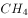
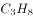
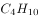

# 2021年河北省公务员录用考试《行测》题（网友回忆版）

> 言语理解与表达 · 40 题 · 河北 2021

## 第 1 题　qid 3522424 · 片段阅读

公共健身器材主要由政府采购、体育部门赠予、开发商自行购置后投放。按规定，受赠单位负责管理和日常维护并承担经费；各单位自行购置的则由各单位负责管理、维修和承担费用。规定很明确，但执行中常常出现各种盲区。首先，受赠方往往无配套资金，需要维修时也一问三不知；其次，日常使用和维护往往需要出厂厂家，然而对厂家缺少专门监管，厂家常常敷衍售后服务；最后，公共健身器材超出使用期，未明确拆除更换的责任方。公共健身器材的设置本是便民利民的好事，但好的出发点也要有完善的配套制度。健身器材建设好了，服务和管理工作也应跟上。
这段文字意在强调：

- **A**. 受赠单位疏于管理公共健身器材
- **B**. 公共健身器材不能“重建轻管”　✅
- **C**. 维护管理公共健身器材存在盲区
- **D**. 公共健身器材能让百姓切实受益

**答案**：B

**官方解析**

文段开篇引出公共健身器材这一话题，接着具体介绍不同情况下负责管理维护公共健身器材的责任主体。随后通过转折标志词“但”指出问题，即执行中出现盲区，并通过“首先”“其次”“最后”多角度分析问题。接着通过转折标志词“但”说明公共健身器材的设置缺少完善的配套制度。尾句则通过“应”提出对策，即要做好服务和管理工作，故文段意在强调对于公共健身器材要做好服务和管理工作，对应B项。
A项，“受赠单位”对应文段“首先”之后的内容，为解释说明的部分，且“疏于管理”为问题表述，非重点，排除；
C项，“存在盲区”为问题表述，非重点，排除；
D项，“让百姓切实受益”对应文段“便民利民”，为转折前内容，非重点，排除。
故正确答案为B。
【文段出处】《公共健身器材不能重建轻管》

---

## 第 2 题　qid 3522900 · 片段阅读

传统的西方法律思想史研究存在“吃偏食”的现象，即研究的范围、题材的主次、对象的脉络等受制于英语学术谱系，这种单一的考察重心限制了研究者的视角。而实际上，在非英语学术谱系中存在大量有价值的材料。这要求研究者把目光投向先前不够重视的领域，比如“一带一路”建设参与国众多，对它们的法律思想史进行研究，可以发现新的史料，找到新的研究关注点。这就要求业内学者努力译介并尽快研究英语学术谱系外的相关权威学术资料，包括专题资料和通史资料，扩展我们对世界法治现代化进程的理解。
这段文字旨在强调：

- **A**. 法律思想史研究受制于英语学术谱系
- **B**. 法律思想史研究须重视非英语学术谱系　✅
- **C**. 西方法律思想史研究存在“吃偏食”现象
- **D**. 非英语学术谱系中存在大量有价值的材料

**答案**：B

**官方解析**

文段开篇指出传统的西方法律思想史研究存在“吃偏食”的问题，接着通过转折词“实际上”指出非英语学术谱系中存在大量有价值的材料，后文通过“要求”提出对策，并通过“比如”进行举例论证，尾句通过指代词“这”总结前文，并通过“要求”提出对策，故文段为提出问题-解决问题的结构，重点为对策，即业内学者应该研究英语学术谱系外的内容，对应B项。
A项“受制于”为问题表述，且为文段话题引入部分内容，非重点，排除；
C项“西方法律思想史研究存在‘吃偏食’的现象”为文段话题引入部分内容，非重点，排除；
D项，“非英语学术谱系中存在大量有价值的材料”为对策之前的表述，非重点，排除。
故正确答案为B。
【文段出处】人民网：《拓展西方法律思想史的研究视野》

---

## 第 3 题　qid 3522550 · 片段阅读

每一个民族的文化复兴，都是从总结自己的遗产开始的。在几千年历史长河中，我国各族人民创造了丰富的历史文化财富，留下了大量文物遗存。历史文物是传统文化的重要物质载体，记录着我们历史的光辉过去，延续着我们国家和民族的精神血脉，承载着我们民族的认同感和自豪感。保护历史文物和文化遗产，是传承中华优秀传统文化、坚定文化自信的必然要求。不断加大文物保护力度，让我们的城市建筑更好地体现地域特征、民族特色和时代风貌，有助于我们传承优秀传统文化，凝聚伟大民族精神，为实现民族复兴提供正确的精神指引和强大的精神动力。
这段文字意在强调：

- **A**. 民族文化复兴的途径
- **B**. 传统文化的物质载体
- **C**. 城市规划要富有特色
- **D**. 文物保护的深远意义　✅

**答案**：D

**官方解析**

文段先介绍了民族复兴是从总结遗产开始，接着论述我国有大量的文物遗存，并强调“历史文物”对我国和民族的重要性。接着引出“保护文物”的话题，并通过“必然要求”强调保护文物和文化遗产的重要性。尾句进一步论证，论述了“加大文物保护力度”的好处，对应D项。
A项，“民族文化复兴的途径”，对应文段首句，起到引出话题的作用，非重点，且缺少文段主题词“文物保护”，排除；
B项，“传统文化的物质载体”对应文段中“历史文物是传统文化的重要物质载体”，非文段重点，且缺少文段主题词“文物保护”，排除；
C项，“城市规划”文段并未提及，无中生有，排除。
故正确答案为D。
【文段出处】人民网评：《&lt;《福州古厝》序&gt;回答了怎样的时代命题》

---

## 第 4 题　qid 3522420 · 片段阅读

捆扎蔬菜的胶带实际上是涂过粘合剂的塑料膜。虽然胶带不是食品，但由于会和食品接触，也要遵守食品安全标准。不过，在塑料膜和粘合剂的生产过程中，由于聚合不完全或溶剂挥发不完全，确实可能有少量甲醛等小分子残留。但捆扎蔬菜用的胶带在自然放置状态下很稳定，降解释放大量甲醛的可能性极小。同时，市面上用来捆绑蔬菜的不只是普通胶带，有的是由动物胶和植物胶制成的胶带，自然也不会对人体造成危害。另外，体重为60公斤的成年人，只要他每日甲醛摄入量不超过12毫克，就不会对健康产生影响。
根据这段文字，以下说法正确的是：

- **A**. 食用了胶带捆扎的蔬菜影响健康的概率小　✅
- **B**. 捆扎蔬菜的胶带自然放置时并不产生甲醛
- **C**. 植物胶制成的胶带才不会对人体造成危害
- **D**. 60公斤成年人每天只应摄入12毫克甲醛

**答案**：A

**官方解析**

根据提问方式可知，本题为细节判断题。
A项，文段从自然放置状态下稳定、制作原料和摄入量三个角度论述了捆扎蔬菜的胶带的健康安全问题，即一般对人体健康不会产生影响，表述正确，当选；
B项，根据“捆扎蔬菜用的胶带在自然放置状态下很稳定，降解释放大量甲醛的可能性极小”可知，在自然状态下胶带释放甲醛的可能性极小，但并非不产生，绝对表述，排除；
C项，根据“有的是由动物胶和植物胶制成的胶带，自然也不会对人体造成危害”可知，由动物胶、植物胶制成的胶带都不会对人体造成危害，但该项表述为“只有植物胶制成的胶带才是安全的”，与原文不符，排除；
D项，根据“另外，体重为60公斤的成年人，只要他每日甲醛摄入量不超过12毫克，就不会对健康产生影响”可知，不超过12毫克是每日甲醛摄入量的安全阈值，而非每日推荐摄入量，表述错误，排除。
故正确答案为A。
【文段出处】《长期食用胶带捆扎的蔬菜可能致癌？这个真没有》

---

## 第 5 题　qid 3522403 · 片段阅读

高校设立家政本科专业受到舆论的质疑，因为在传统观念中，大学生是“天之骄子”，保姆似乎“低人一等”，二者难以画上等号。正是这样的错误观念，导致家政行业从业人员良莠不齐，整体素质不高。其实，家政行业是考验从业者综合素质的行业，高校设立家政专业，符合市场需求。当然，目前来看，家政专业培养出来的学生很少从事家政实务，不少都是从事家政企业管理和家政教育。要想真正吸引更多优秀人才进入家政行业，就要破除职业偏见，让家政服务从业人员能够获得应有的尊严，让他们的工作能够体现应有的劳动价值，让他们有良好的发展前景。
从这段文字可以看出，作者认为家政行业吸引优秀人才的关键在于：

- **A**. 增强家政专业“含金量”
- **B**. 提高从业者的综合素质
- **C**. 尊重从业人员劳动价值
- **D**. 破除家政专业职业偏见　✅

**答案**：D

**官方解析**

文段开篇指出高校设立家政本科专业受到舆论的质疑，分析了其背后的错误观念，并指出家政行业从业人员整体素质不高这一问题，随后通过转折标志词“其实”说明高校设立家政专业，是符合市场需求的。接着再次说明目前家政实务方面缺少人才这一问题。文段结尾则通过对策标志词“要”提出对策，强调吸引优秀人才进入家政行业要破除职业偏见，并说明了对策带来的多重意义，故文段重在强调对策，即要破除家政专业职业偏见，对应D项。
A项，增强“含金量”即指提升家政专业的价值，文段并未提及，无中生有，排除；
B项，“从业者的综合素质”对应文段对策之前，为分析问题的部分，非重点，排除；
C项，“尊重从业人员劳动价值”对应文段对策带来的意义部分，非重点，排除。
故正确答案为D。
【文段出处】《“大学设家政专业”需破除职业偏见》

---

## 第 6 题　qid 3522955 · 片段阅读

常温常压下，天然气的气态轻烃有4种，甲烷、乙烷、丙烷和丁烷。轻烃的含碳数越高，每个分子里需要供给的氢的数量也越多。腐殖型有机质含氢的数量较少，无法为碳数较多的轻烃提供足够的氢。另外，随着碳数越多，轻烃的形成温度也依次升高。烃源岩在低温的时候（左右），就能够大量地生成甲烷。由于很多地方的地温达不到那么高，所以也无法形成高碳数的气态轻烃。

上述文段意在说明：

- **A**. 轻烃的含碳数越高，氢的数量也越多
- **B**. 含碳数越多，轻烃所需的温度也越高
- **C**. 在天然气中，甲烷是占比最多的成分　✅
- **D**. 在天然气中，丁烷是占比最多的成分

**答案**：C

**官方解析**

文段首先引出了“天然气的气态轻烃”这个话题，接着指出由于客观条件，碳数较多的轻烃无法获得足够的氢，故天然气中以低碳数的气态轻烃即甲烷为主，后文通过“另外”表并列，阐述轻烃随着碳数增多，形成温度也会发生变化，而多地都达不到的温度让气态轻烃无法形成高碳数的气态轻烃，只能生成甲烷。故文段通过并列结构，全面论述甲烷是天然气中占比最多的成分，对应C项。
A项“氢的数量”、B项“温度”分别对应并列的两个方面，表述片面，D项与文段表述完全相反。且A、B、D三项均未提到低碳数的气态轻烃即甲烷，主题词不符，排除。
故正确答案为C。

---

## 第 7 题　qid 3522413 · 片段阅读

机器学习的主旨是让计算机去模拟或实现人类的学习行为，是人工智能的核心。机器学习虽然可以在大数据训练中学到正确的工作方法，但它也很容易受到恶意干扰。通常攻击者是通过输入恶意数据来“欺骗”机器学习模型，导致其出现严重故障。近日，“Data61”机器学习小组研发出了一种机器学习的新算法。这种新算法通过类似疫苗接种的思路，帮助机器学习“修炼”出抗干扰能力。这是针对机器学习模型打造的防干扰训练，譬如，在图片识别领域，该算法能够对图片集合进行微小的修改或使其失真，激发出机器学习模型的抗干扰能力，并形成相关的自我抗干扰训练模型。
这段文字意在说明：

- **A**. 干扰机器识别图像的新方法
- **B**. 新算法助机器学习抵抗干扰　✅
- **C**. 机器学习是人工智能的核心
- **D**. 机器学习大数据训练的方法

**答案**：B

**官方解析**

文段开篇引出“机器学习”的话题，接着通过转折词“但”指出机器学习存在容易受到干扰的问题，随后通过学习小组的研究给出了对策，即“一种机器学习的新算法”，并对对策本身进行具体解释说明。故文段为提出问题解决问题解释说明的分总分文段，重点在于对策，即强调针对机器学习防干扰的新算法，对应B项。

A项，文段的重点在于“防干扰”的做法，不是“干扰”的方法，排除；

C项，“机器学习是人工智能的核心”对应文段开篇引出话题的部分，非重点，排除；

D项，“大数据训练”对应转折之前的内容，非重点，排除。

故正确答案为B。

【文段出处】《全新算法助机器学习抵抗干扰》

---

## 第 8 题　qid 3522416 · 片段阅读

大熊猫分布区内目前分布的4种大型食肉动物，即豺、狼、豹和雪豹，其分布区范围自20世纪中期以来均出现明显缩小，其中以豺最为严重——过去10年间，豺与狼在大熊猫分布区内均只有零星记录（豺仅被记录到4次，狼11次），在部分山系可能处于濒临消失的边缘。大型食肉动物的窘迫与大熊猫卓有成效的保护形成了明显反差，究其原因，可能主要是大型食肉动物处在食物链顶端，对栖息地面积和质量的要求远比其他动物苛刻。
根据上述文段，可以推出：

- **A**. 提供大面积、高质量的栖息地或是留住大型食肉动物的关键　✅
- **B**. 对大熊猫保护的投入广泛惠及了跟它同区域分布的其他动物
- **C**. 对大熊猫的全面保护极大地挤压了大型食肉动物的生存空间
- **D**. 维护生态系统的完整性和原真性可使大型动物得到全面保护

**答案**：A

**官方解析**

A项，根据“大型食肉动物的窘迫与大熊猫卓有成效的保护形成了明显反差，究其原因，可能主要是大型食肉动物处在食物链顶端，对栖息地面积和质量的要求远比其他动物苛刻”可知，大型食肉动物窘迫的原因在于：由于处于食物链顶端，对栖息地面积和质量的要求很高也很苛刻，故可以推出“提供大面积、高质量的栖息地或是留住大型食肉动物的关键”，当选；
B项，根据“大型食肉动物的窘迫与大熊猫卓有成效的保护形成了明显反差”可知，对大熊猫的保护并未提及惠及其他动物，无中生有，排除；
C项，原文并没有强调对大熊猫的保护会影响大型食肉动物的生存，两者没有必然联系，该项强加因果，排除；
D项，根据“大熊猫分布区内目前分布的4种大型食肉动物”及“大型食肉动物的窘迫与大熊猫卓有成效的保护形成了明显反差，究其原因，可能主要是大型食肉动物处在食物链顶端，对栖息地面积和质量的要求远比其他动物苛刻”可知，文段是围绕大型食肉动物展开论述，故“大型动物”范围扩大；且“维护生态系统的完整性和原真性”“全面保护”文段并未提及，该项无中生有，排除。
故正确答案为A。
【文段出处】《李晟研究组揭示大熊猫分布区内大型食肉动物分布与保护现状》

---

## 第 9 题　qid 3522425 · 片段阅读

与数字应用相伴而生的是“数字鸿沟”难题。老龄群体在适应数字时代上的吃力，一方面是使用技能缺乏、文化程度限制或设备不足，另一方面许多数字产品在设计中忽视了老年人需求。我们正在步入老龄化社会，在线上线下日趋融合的当下，从立法规划、政府决策到产业发展都应该着眼长远，充分保障老年人的社会需求、权利和尊严，而不能仅仅把目光停留在年轻人身上。这就需要在科技进步的同时，兼顾消除老龄群体参与社区、社会生活的种种障碍，为他们提供一个安全、便捷、多彩、温暖的社会环境。
这段文字意在强调：

- **A**. 数字化生活应该重视老龄群体的需要　✅
- **B**. 部分老龄群体适应数字时代存在困难
- **C**. 代际间的“数字鸿沟”现象如何产生
- **D**. 建设老年人友好型社会需要依靠数字技术

**答案**：A

**官方解析**

文段开篇提出在数字应用的背景下存在“数字鸿沟”这一问题，紧接着通过“一方面······另一方面······”论述老龄群体存在这一问题的具体原因，而后提出在老龄化社会的背景下，应从多个角度保障老年人的社会需求、权力和尊严，尾句通过“这”总结上文提出具体对策，应在发展科技的同时兼顾消除老龄群体的障碍，为其提供良好的社会环境。故文段重点强调在数字化生活的当下，要着重关注老龄群体的需求，对应A项。
B项，“存在困难”为问题表述，非文段重点，排除；
C项，“数字鸿沟”产生的原因对应文段开篇，非文段重点，排除；
D项，文段重在强调要关注老龄群体的需求，而非强调“数字技术"的重要性，排除。
故正确答案为A。
【文段出处】《互联网时代，助力解决老龄群体面临“数字鸿沟”难题》

---

## 第 10 题　qid 3522994 · 片段阅读

考古学家在阿拉伯半岛的阿尔马塔夫遗址中已清理出9000多件遗物，其中以上为当地的朱尔法陶，包括一件完整的朱尔法夹砂红陶罐；西亚釉陶仍为孔雀绿釉陶和熔块胎陶；中国产的瓷器有龙泉窑青瓷，景德镇窑青花瓷、白瓷、青白瓷及广东地区产酱釉粗瓷等；另有泰国产青瓷。中国产的瓷器年代以明中晚期至清代为主。此外，出土了较多的玻璃手镯，还出土了一件侈口、细颈、圆形扁腹玻璃瓶。参考中国瓷器的年份，该区至少存在一个16至17世纪葡萄牙占领时期的人类活动层。

根据上述材料可以推出：

- **A**. 阿尔马塔夫最具地方特色的陶器是朱尔法陶器
- **B**. 明初中国已与阿尔马塔夫存在频繁的官方往来
- **C**. 阿尔马塔夫是古代亚欧文化艺术交流的集散地　✅
- **D**. 葡萄牙殖民者占领时期的阿尔马塔夫繁荣发达

**答案**：C

**官方解析**

文段首句引出阿尔马塔夫遗址出土当地文物，接着列举了出土的中国产瓷器、泰国产青瓷等，尾句提出存在葡萄牙占领时期的人类活动层，可知文段重在强调阿尔马塔夫是古代亚欧文化艺术交流的集散地，对应C项。

A项，根据“阿拉伯半岛的阿尔马塔夫遗址中已清理出9000多件遗物，其中以上为当地的朱尔法陶”可知，出土最多的是当地的“朱尔法陶”，无法说明最具地方特色的陶器是朱尔法陶器，偷换概念，排除；

B项，根据“中国产的瓷器年代以明中晚期至清代为主”可知，明中晚期中国与阿尔马塔夫才存在频繁的官方往来，“明初”错误，排除；

D项，根据“该区至少存在一个16至17世纪葡萄牙占领时期的人类活动层”可知，文段只论述存在人类活动层，并未论述此时的阿尔马塔夫繁荣发达，属于无中生有，排除。

故正确答案为C。

【文段出处】《拉斯海马的陶瓷遗存与中国考古》

---

## 第 11 题　qid 3522426 · 片段阅读

退行心理是一种心理防御机制，是指人们在遭受挫折、面临困难时，以比较幼稚的态度，选择早期生活阶段的某种行为方式来应对当前情况。对于二三十岁的成年人来说，经常要面临来自各个方面的多重压力，于是在比较自由的环境中，很多人都会通过退行心理来调节情绪、释放压力，自称宝宝便是一种具体表现。事实上只要无伤大雅，这种暂时性的退行心理不仅是正常的，而且在某些情况下是极其有必要的。但如果一个人在遇到困难时，总利用退行心理去逃避现实问题或博取别人的同情，就很有可能发展成为某种心理疾病。
根据这段文字，下列说法正确的是：

- **A**. 经常自称宝宝会发展为某种心理疾病
- **B**. 时常回忆年幼时光是退行心理的表现
- **C**. 人不应沉溺于用退行心理来逃避现实　✅
- **D**. 二三十岁的成年人自称宝宝极有必要

**答案**：C

**官方解析**

A项，根据尾句“总利用退行心理去逃避现实问题或博取别人的同情，就很有可能发展成为某种心理疾病”可知，经常自称宝宝不一定会发展为某种心理疾病，表述过于绝对，排除；
B项，根据首句退行心理的定义“人们在遭受挫折、面临困难时，以比较幼稚的态度，选择早期生活阶段的某种行为方式来应对当前情况”可知，“回忆年幼时光”不一定是在“遭受挫折、面临困难”时的选择，且“回忆年幼时光”也不属于“幼稚的态度”“早期生活阶段的某种行为方式”，表述错误，排除；
C项，根据尾句“总利用退行心理去逃避现实问题或博取别人的同情，就很有可能发展成为某种心理疾病”可知，人不可过分沉溺于用退行心理逃避现实，表述正确，当选；
D项，根据文段后文介绍的退行心理的利弊影响可知，过于依赖退行心理逃避现实可能引发某种心理疾病，故“极有必要”表述错误，排除。
故正确答案为C。
【文段出处】《成年人总自称宝宝竟是种病！》

---

## 第 12 题　qid 3522417 · 片段阅读

地球上的地震发生在由板块运动产生的断层上，火星没有板块构造，但它持续的冷却和收缩过程会产生压力，当这种压力积累到足够大，就会引发火星地震。探测到火星地震是科学研究工作的一个里程碑。研究人员说，安放在火星表面的“内部结构地震实验仪”就像“贴着耳朵放了一部电话”，可以“听”到来自火星内部的震波。通过监测这些震波，研究人员了解到火星内部地震活动的强度和频度，从而分析出火星内部不同层级的深度和构成。科研人员通过对火星地震的研究，可以分析火星形成的历史，以增加人类对地球、月亮等星球起源的了解。
下列选项与这段文字意思相符的是：

- **A**. 内部结构地震实验仪探测到火星地震　✅
- **B**. 火星地震研究是科学研究的全新领域
- **C**. 人类的耳朵可以听到火星的真实地震
- **D**. 通过研究火星地震才能了解月亮起源

**答案**：A

**官方解析**

A项，根据“‘内部结构地震实验仪’就像‘贴着耳朵放了一部电话’，可以‘听’到来自火星内部的震波。通过监测这些震波，研究人员了解到火星内部地震活动的强度和频度”可知，说法正确，当选。
B项，文段中未提到火星地震研究是科学研究的全新领域，无中生有，排除。
C项，文段中只提到“内部结构地震实验仪”像“贴着耳朵放了一部电话”，未提到人类的耳朵可以听到火星的真实地震，无中生有，排除。
D项，根据“科研人员通过对火星地震的研究，可以分析火星形成的历史，以增加人类对地球、月亮等星球起源的了解”可知研究火星地震并非是了解月亮起源的唯一途径，“通过······才能······”表述绝对，排除。
故正确答案为A。
【文段出处】新华社《科普：人类首次探测到“火星地震”意味着什么》

---

## 第 13 题　qid 3522419 · 片段阅读

孔子以“有教无类”“因材施教”“教学相长”为方针，以培养“博学通才之士”为目标，对学生进行礼、乐、御、射、书、数“六艺”教育，其中，数即数学，乐和声学有关，御和力学有关，射和机械有关。《中庸》上说，“博学之，审问之，慎思之，明辨之，笃行之”，学、问、思、辨、行，完全符合认识过程和研究科学的方法，即获取信息、提出问题、思维推理、检验结果、躬身实践。在儒家崇尚务实和“经世致用”思想影响下，中国古代科技具有强烈的实用性，形成了以农、医、天、算四大学科和以“四大发明”为代表的技术发明创造。
这段文字意在说明：

- **A**. 中华古代文明具有文理交融的包容性
- **B**. 古代科技是传统儒家思想的实现途径
- **C**. 传统文化和古代科技存在必然的联系
- **D**. 传统文化对古代科技发展有积极影响　✅

**答案**：D

**官方解析**

文段开篇指出孔子的教学方针和目标都具有一定的实用性，接着描述《中庸》中的思想也与实际实践中的认识过程和研究科学息息相关，最后“在······思想影响下”指代前文提到的思想，且引出结论，强调在传统文化的影响下中国古代科技形成“四大学科”和“四大发明”等技术的发明创造，故文段重点在尾句结论，强调传统文化对古代科技发展产生的积极影响，对应D项。
A项，文段并未提及“文理交融”，属无中生有，排除；
B项，文段强调的是在儒家思想影响下形成古代科技，而非儒家思想得以实现，排除；
C项，“必然的联系”表述不明确，文段强调产生了积极影响，排除。
故正确答案为D。
【文段出处】《国学与科学》

---

## 第 14 题　qid 3523017 · 片段阅读

制造业智能时代在创造出大量新的产品和服务的同时，也衍生出例如机器人操作和维护、工业数据工程师等全新的职业方向，就业形式上出现了更多自由职业者和兼职岗位，工作内容上也更加体现专业协作。制造业智能化产生的新兴岗位巨大供需差，要求职业院校准确把握专业方向，根据制造业产业链的变化对专业链进行及时调整和更新，以实现智能化产品在性能、质量和生产效率方面质的飞跃。
上述文字意在强调的是：

- **A**. 岗位快速更迭要求专业动态调整　✅
- **B**. 技术技能人才培养目标发生变革
- **C**. 制造业智能化衍生出全新职业方向
- **D**. 职业教育为制造业智能化升级助力

**答案**：A

**官方解析**

文段围绕制造业智能时代的岗位更迭展开，首句介绍制造业智能时代衍生出许多全新职业，就业形式与内容也发生变化，接下来通过“要求”，就新兴岗位的巨大供需差提出应对措施，即职业院校需要对专业进行及时调整。文段重在尾句的对策，即面对岗位更迭变化，职业院校要对专业进行及时调整，对应A项。
B项，“人才培养目标”在文段中并未提及，无中生有，排除；
C项，“衍生出全新职业方向”为对策前的内容，非重点，排除；
D项，“职业教育为制造业智能化升级助力”并非对策表述，与文段重点形式不符，且文段尾句已交代了具体助力的对策即调整专业，相比A项，表述不明确，排除。
故正确答案为A。
【文段出处】《面对制造业智能化的机遇和挑战 职业教育准备好了吗》

---

## 第 15 题　qid 3523015 · 片段阅读

观照历史上多次出现过的媒介融合的进程结果，媒介材料的变更，绝不等于思想生活变现，正如汉字生产的主线，也绝不会因为纸张代替了简牍而出现颠覆性变化一样。事实上，简牍的汉字同纸张的汉字，并无太大差别，顶多只是字体有些不同而已。不可否认媒介变化肯定会带来表达的不同，如新近出现的网言网语，肯定是互联网语境下的表达产物。但无论媒介技术怎样发展变化，任何文明主干、任何文化血脉，都是一以贯之的。
这段文字意在强调：

- **A**. 正确认识媒介革命的特殊性与普遍性，重视传统文化的传承　✅
- **B**. 媒介革命不仅涉及媒介技术，还关乎人们的思想观念等问题
- **C**. 借鉴历史上简牍与纸张之媒介融合的经验，推动新媒介融合
- **D**. 媒介革命必定改变人们观念，助力社会进步和提升文明层次

**答案**：A

**官方解析**

文段首句指出媒介材料的变更不等于思想生活变现，通过“正如”以纸张代替简牍没有改变汉字生产的主线为例，论证了媒介材料变更不等于思想发生改变，接着通过“事实上”进一步说明了简牍和纸张没有太大差别。接下来论述媒介变化确实会带来表达的不同，最后通过转折词“但”强调无论媒介技术怎么变，都不会改变文明和文化，故文段重点在尾句，强调媒介革命会带来多种情况，不变的是文明和文化，A项是文段重点的同义替换，当选。
B项，对应到文段开篇，非重点，排除；
C项，缺乏主题词“媒介革命”，偏离文段核心话题，排除；
D项，“必定改变”与文意相悖，“助力社会进步和提升文明层次”无中生有，排除。
故正确答案为A。
【文段出处】《媒介融合之历史观照》

---

## 第 16 题　qid 3522409 · 片段阅读

有人是“早起鸟”，有人是“夜猫子”，每个人都有自己一套独特的生物钟。生物钟是体内控制日常生物节律的系统，帮助调整人体左右的基因活动，睡眠、进食、体温、血压等的“节奏编排”均与之相关。测量人体生物钟的常用方法是监测人体内褪黑素浓度的变化，不过此法要求研究对象长时间坐在暗室，每隔大约一小时采集一次血液或唾液的样本。目前，多国科研人员正尝试开发快速检测人体生物钟的新法，以期更好地了解人体，保障健康。研究人员表示，生物钟紊乱与糖尿病、心脏病、抑郁症等多种疾病相关，如能找到检测人体生物钟的简便方法，将有助于人们更好地了解并治疗这些疾病。

上述文字重在强调：

- **A**. 每个人都有一套属于自己的生物钟
- **B**. 研究生物钟可助于人们更好了解疾病
- **C**. 科研人员正探索人体生物钟检测新法　✅
- **D**. 生物钟系统有助于调整人体基因活动

**答案**：C

**官方解析**

文段开篇引出生物钟的话题，具体介绍生物钟以及生物钟的功能，指出生物钟很重要。接着通过转折词“不过”引出问题，即常用于测量生物钟的方法比较复杂不够便利，随后给出解决的对策“多国科研人员正尝试开发快速检测人体生物钟的新法”并阐述其意义。最后引用研究人员的话通过正面论证强调前文“开发快速检测人体生物钟的新法”的必要性。故文段重点在对策，即强调要找到检测人体生物钟的新法，对应C项。
A项，对应文段引出话题部分，非文段重点，排除；
B项，对应尾句解释说明部分，且为意义表述，非文段重点；同时文段尾句为“检测人体生物钟的简便方法······”选项表述为“研究生物钟”，偏离文段核心，排除；
D项，“调整人体基因活动”对应生物钟的功能，话题引入，非文段重点，排除。
故正确答案为C。
【文段出处】《科研人员探索人体生物钟检测新法》

---

## 第 17 题　qid 3522414 · 语句表达

提到一座城市，人们往往会想到具有代表性的文化地标：600岁的紫禁城见证着北京城的过往，拓荒牛雕塑标记着深圳的开拓进取······城市文化地标                    ，成为一个城市的精神和文化象征，与人们产生紧密的情感连接、文化认同。文化地标是一个地方的文化名片，在传播城市形象方面有巨大的流量效应。近年来，文化旅游市场持续升温，各类文化地标成为热门参观地、网红打卡地。
填入划横线部分最恰当的一句是：

- **A**. 大都强调人文景观与自然环境和谐共生，以形神兼备的呈现方式
- **B**. 或深植于历史文化，或投射着时代风貌，以鲜明独特的符号形象　✅
- **C**. 不是凭借炫目奇特的视觉效果，或各类时髦文化元素的简单堆砌
- **D**. 承载着无法替代的人文价值，满足着公众的审美旨趣和美好期待

**答案**：B

**官方解析**

横线出现在文段中间，需考虑与前后文的衔接。横线前文引出城市文化地标的话题，点出城市文化地标具有代表性，见证着一个地方的过去，标记着一个地方的风格，横线后指出城市文化地标是一个能让人们产生城市内情感连接、文化认同的精神、文化象征，是一个地方的名片，并举例说明当下很多城市文化地标成为名片的例子。因此横线处要承接前后文，表达城市文化地标代表了一个城市的过去及风格，且城市文化地标是一个具有城市地方特色的名片的语义，对应B项。
A项，“自然环境”无中生有，排除；
C项，“视觉效果”“各类时髦文化元素”无中生有，排除；
D项，“满足着公众的审美旨趣和美好期待”无中生有，且没有指出城市文化地标“是一个地方的文化名片”的独特象征地位，无法和后文衔接，排除。
故正确答案为B。
【文段出处】《打造有生命力的文化地标》

---

## 第 18 题　qid 3522408 · 片段阅读

当血管壁被蚊子戳破时，血液会启动凝血机制，来修补血管壁的缺口，让血液在局部区域凝固。这不利于蚊子吸血，为此蚊子进化出了可以抗凝血的蛋白，只需在吸血之前注入血管组织中，就可以阻止血液凝固。但人体内的免疫系统会释放出组胺蛋白质来抵抗这种抗凝血蛋白，而这个免疫反应就会引起蚊子叮咬部位的过敏反应，让我们感觉痒。一旦开始痒了，我们的第一反应往往就是挠，但挠痒痒的时候，手指对皮肤的挤压会加速血液流动，使局部区域的抗凝血蛋白和身体分泌的组胺蛋白向更大区域扩散，自然也就越挠越痒了。
最适合做本段文字标题的是：

- **A**. 蚊子如何突破血液凝血机制吸血
- **B**. 被蚊子叮咬了为什么会越挠越痒　✅
- **C**. 抗凝血蛋白助蚊子吸血一臂之力
- **D**. 组胺蛋白质可抗蚊子抗凝血蛋白

**答案**：B

**官方解析**

文段开篇介绍血液具备凝血机制，可让血液在局部区域凝固，并介绍蚊子为此进化出抗凝血蛋白来阻止血液凝固，接着通过转折标志词“但”强调人体的免疫反应会引起蚊子叮咬部位的过敏反应，让我们感觉痒。后文进一步解释相关原因，结尾则通过结论引导词“使”强调被蚊子叮咬部位越挠越痒这一结果，故文段重在强调被蚊子叮咬后为什么会越挠越痒，对应B项。
A项，“血液凝血机制”对应转折之前的内容，非重点，排除；
C项，“抗凝血蛋白助蚊子吸血”对应转折之前的内容，非重点，排除；
D项，“组胺蛋白质”对应文段结论之前的内容，非重点，且为具体原因之一，表述片面，排除。
故正确答案为B。
【文段出处】《蚊子叮你不是因为血型而是因为你太“活跃”》

---

## 第 19 题　qid 3522976 · 语句表达

近日，由中国、意大利、美国学者组成的研究团队，最新研发出一种三维石墨烯—碳纳米管复合网络支架。这种生物支架能很好地模拟大脑神经网络结构，未来，将可用于药物筛选或植入大脑帮助治疗脑部疾病，该碳神经支架由我国率先提出并完成材料制备。科学家                    。科研人员发现，相比在二维的培养皿中观察、培养神经细胞，三维支架更接近脑部实际环境。
将下列四个句子重新排列，填入划横线处，语序正确的是：
①把体内正常的神经干细胞移植到细小的碳纳米管中
②用石墨烯模拟大脑内部四通八达的三维框架
③从而构建出一个“互联互通”的人造神经网络
④增殖和定向分化神经元细胞

- **A**. ①②③④
- **B**. ②④①③
- **C**. ①③②④
- **D**. ②①④③　✅

**答案**：D

**官方解析**

本题是语句排序题与语句填空题的复合题型，需将句子排列整齐后放于文段横线处，横线出现在文段中间，所以还需要注意与前后文的衔接。
观察选项，判断首句。①句指出将正常的神经干细胞移植到碳纳米管中，②句论述用石墨烯模拟大脑的三维框架，根据前文可知，该框架就是指碳纳米管复合网络支架，按照逻辑顺序，应先有框架，再进行内容填充，先有了三维框架，才能将神经干细胞移植到其中，故②句应在①句前，排除A、C两项。
对比B、D两项，尾句均为③句，区别在于①句和④句的先后顺序，①句讲神经干细胞的移植，④句讲神经元细胞，按照逻辑顺序，应该先有神经干细胞，再分化为神经元细胞，故①句应在④句前，排除B项，锁定D项。
故正确答案为D。
【文段出处】《石墨烯——碳纳米管复合支架可模拟脑神经网络》

---

## 第 20 题　qid 3522959 · 语句表达

①当泰勒斯面对宇宙万物说“一切来自水，也复归于水”的时候，他不再被眼中的万事万物所迷惑，而是达到了和本原同一的境界，这种境界是一种超然物外、自由安宁的崇高境界
②在遥远的古希腊城邦中，哲学是一种生活方式，而不是单纯的理论或者学问
③他相信依靠数学可使灵魂获得净化和升华，从而摆脱轮回，进入永恒极乐的世界
④不论是前苏格拉底哲学家、古典哲学家还是后期希腊哲学家，都把哲学作为一种特立独行的生活方式
⑤毕达哥拉斯则认为数是万物的本原，数的特点就是可知而不可见
⑥如果我们要理解“什么是哲学，哲学何为”的问题，需要追根溯源，回到哲学诞生之初
将以上6个句子重新排列，语序正确的是：

- **A**. ②④⑥①③⑤
- **B**. ⑥②④①③⑤
- **C**. ②④①⑥⑤③
- **D**. ⑥②④①⑤③　✅

**答案**：D

**官方解析**

对比选项，确定首句，⑥句指出想要理解什么是哲学，需要回到哲学诞生之初，②句指出“在遥远的古希腊城邦中，哲学是······”，回答了⑥句的问题，故⑥句在②句之前，排除A、C两项。
继续观察，寻找线索，③中出现指代词“他”，根据指代词捆绑，对比选项，判断③句前接①句还是⑤句，③句指出“他相信依靠数学可使······”，前面应该论述某个人对于数学的看法，⑤句指出“毕达哥拉斯则认为数是······”，提到了某个人对于数学的看法，⑤③两句可以构成捆绑，对应D项。①句没有提到某个人对于数学的看法，①③两句无法构成捆绑，排除B项。
故正确答案为D。
【文段出处】《什么是哲学？哲学何为？》

---

## 第 21 题　qid 3523492 · 逻辑填空

早在商汤时代，浴盘上就镌刻有“苟日新，日日新，又日新”的铭词，旨在激励自己澡身而浴德，澡雪而精神，既要盥洗身体，更要涤荡心灵，保持向新求新的精神，产生            的进步。
填入划横线部分最恰当的一项是：

- **A**. 与日俱进
- **B**. 日新月异　✅
- **C**. 竿头日上
- **D**. 突飞猛进

**答案**：B

**官方解析**

根据横线前“保持向新求新的精神”可知，横线处应体现“新”的意思，且与“进步”搭配。B项“日新月异”形容每天都在更新，每月都有变化，可体现出“新”的意思，且搭配恰当，符合文意，当选。
A项“与日俱进”指随着时间一天天地进步，形容不断进步或提高。“与日俱进”侧重“提高进步”，且“与日俱进”与“进步”存在语义上的重复，搭配不当，排除；
C项“竿头日上”比喻学业进步很快，体现不出“新”的意思，排除；
D项“突飞猛进”形容进步和发展特别迅速，文段并未体现“进步和发展特别迅速”，且“突飞猛进”与“进步”重复，搭配不当，排除。
故正确答案为B。
【文段出处】《文明：文以化人 日新其德》

---

## 第 22 题　qid 3522455 · 逻辑填空

现代体育比赛不仅是各国运动员速度与力量的竞技场，也是世界各国展示形象、尖端科技与体育融合的大舞台。随着人类对挑战自身的执着追求，各竞技项目的成绩不断        人体能力的极限，要想进一步提高比赛成绩，哪怕是提高百分之一甚至千分之一，教练与运动员都要竭尽全力采用各种方式和技术去实现，科技的赋能作用也就愈发重要。
填入划横线部分最恰当的一项是：

- **A**. 刷新
- **B**. 挑战
- **C**. 考验
- **D**. 逼近　✅

**答案**：D

**官方解析**

根据“随着人类对挑战自身的执着追求”以及后文“要想进一步提高比赛成绩······都要竭尽全力······去实现”可知，横线处要体现在人类的执着追求下，竞技项目的成绩被不断地提高，越来越接近“人体能力极限”。A项“刷新”意思是刷洗之后使之变新，“刷新”成绩不一定能接近人体能力极限，与文意不符，排除；B项“挑战”一般搭配人，“人挑战极限”或“人挑战自身”等等，一般不与“成绩”搭配，排除；C项“考验”的常见搭配为“考验能力”，与“极限”搭配不当，排除；D项“逼近”意思是向前靠近，接近，能体现出成绩不断接近人体能力极限，符合文意，当选。
故正确答案为D。
【文段出处】光明日报《体育中的“黑科技”》

---

## 第 23 题　qid 3522928 · 逻辑填空

橄榄油被用于制作肥皂，最早的        资料显示是在公元前2000年，在苏美尔地区发现的黏土片，极像是        的油脂与碱、钾、钠、树脂和盐多种成分混合的产物。当时，人们用橄榄油和一种常见植物燃烧后的灰烬中的碱来制作肥皂。
依次填入划横线部分最恰当的一项是：

- **A**. 可考 沸腾　✅
- **B**. 佐证 饱和
- **C**. 公开 流动
- **D**. 可靠 液态

**答案**：A

**官方解析**

第一空，根据“最早的”“公元前2000年”“在······黏土片”可知，该资料距离我们时间久远，且有实物证据。A项“可考”指可以考证，符合文意，保留。B项“佐证”指辅助的证据，与主要证据相对，而从文段中无法得知是否为辅助的证据，排除。C项“公开”指将事情的内容暴露于所有人，文段并未体现该资料是公开还是隐瞒的状态，排除。D项“可靠”指可以信赖依靠，真实可信，根据文段“极像是······多种成分混合的产物”可知，当前的实物证据高度类似于油脂与其他物质的混合物，并不足以得出肥皂由橄榄油制成的确切结论，排除。
第二空，代入验证，横线处搭配“油脂”，沸腾的油脂搭配恰当，当选。
故正确答案为A。
【文段出处】《橄榄树 我的故乡在远方》

---

## 第 24 题　qid 3523502 · 逻辑填空

我国的大禹治水传说和西方的诺亚方舟故事为我们呈现了中西文化的美丽景观，“娴静”的中国传统文化与“跃动”的西方文化相映，东方的责任意识和西方的权力思想相辅，        我们走向中西文化差异的源头，启发我们        中西文化的特质和精髓，促使我们相互借鉴、彼此“扬弃”，绘写多彩的人类文明图画。
依次填入划横线部分最恰当的一项是：

- **A**. 引领 思考
- **B**. 指引 拷问
- **C**. 引导 思索　✅
- **D**. 指示 追寻

**答案**：C

**官方解析**

第一空，文段为相同句式表达的并列关系，故横线处所填词语应与“启发”和“促使”构成对应，体现出带领我们走向源头的含义。A项“引领”指引导、带领，B项“指引”意思是指点、引导，C项“引导”指带领、指引，均符合文意，保留；D项“指示”意思是指明显示，或安排、命令，多用于上级对下级，与文意不符，排除。
第二空，横线处所填词语与“特质和精髓”搭配，A项“思考”和C项“思索”均搭配得当，保留；B项“拷问”指拷打审问，与“特质和精髓”搭配不当，排除。进一步对比A项“思考”和C项“思索”，“思索”指反复思考探索，语义上比思考更丰富，而我们对于中西文化的特质和精髓除了思考也是需要探索的，故C项“思索”更符合文意，当选。
故正确答案为C。
【文段出处】《从大禹治水到诺亚方舟看中西文化差异》

---

## 第 25 题　qid 3522899 · 逻辑填空

人体是一个庞大的共生体。人体皮肤表面、口腔、呼吸道、肠道        着大量微生物，它们的数量是人体本身细胞的数十倍，编码的基因是人体基因的100倍。每个人的身体里都会有微生物留存的痕迹，而人体的健康会与体内的菌群            。人们将特定环境中包括微生物在内的总DNA称为宏基因组。
依次填入划横线部分最恰当的一项是：

- **A**. 寄生 同气连枝
- **B**. 依附 表里相依
- **C**. 潜伏 如影随形
- **D**. 生存 休戚与共　✅

**答案**：D

**官方解析**

本题从第二空入手，根据前文“人体是一个庞大的共生体”以及“每个人的身体里都会有微生物留存的痕迹”可知，横线处想要体现的是“人体的健康”和“体内的菌群”之间关系密切、共同生存的含义。A项“同气连枝”比喻同胞的兄弟姐妹，“人体的健康”和“体内的菌群”之间并无同胞的关系，排除。B项“表里相依”指关系密切，互相依存，C项“如影随形”比喻两个事物关系密切或两个人关系密切不能分离，D项“休戚与共”形容关系密切，利害相同，三个词语均有关系密切的含义，但是B项“表里相依”和C项“如影随形”两个词语侧重强调两者之间无法分离，相互依存的关系，D项“休戚与共”则更侧重两者关系紧密，利害相同。结合前文提到的“人体”和“菌群”之间是一种“共生”的关系，即两者生活在一个环境里边，健康和菌群之间相互影响，所以D项“休戚与共”更能体现两者之间利害相同，祸福相依这样一种关系，保留，排除B、C两项。
第一空，代入验证，人体当中“生存”着大量微生物，符合文意，D项当选。
故正确答案为D。
【文段出处】《基因测序“黑科技” 给生命来个完整的“数字化解读”》

---

## 第 26 题　qid 3522850 · 逻辑填空

人脸识别系统深度学习的数据越多，人脸识别的效果就会越精确。只要给予足够多的人脸攻击大数据样本，机器就能够自主地学习到伪造图像或合成视频中的        ，最终就能得到对于这些攻击的分辨能力。并且，随着学习数据的不断增多，深度学习系统也会一天比一天强大，让各种各样的“换脸”            。
依次填入划横线部分最恰当的一项是：

- **A**. 弊端 无计可施
- **B**. 瑕疵 无所遁形　✅
- **C**. 错误 插翅难逃
- **D**. 缺陷 束手无策

**答案**：B

**官方解析**

第一空，根据“人脸识别系统深度学习的数据越多，人脸识别的效果就会越精确”以及“只要给予足够多的人脸攻击大数据样本”可知，在数据足够多的前提下，人脸识别系统是非常精确的，所以即便“伪造图像”“合成视频”中存在特别小的问题，也能被发现，故横线所填词语应表达微小问题之意。B项“瑕疵”指微小的缺点，符合文意，保留。A项“弊端”指由于工作上有漏洞而发生的损害公益的事情，C项“错误”指不正确的事物、行为，D项“缺陷”指欠缺或不够完备的地方，均程度过重，排除。
第二空，代入验证，B项“无所遁形”指没有地方可以隐藏形迹、身影，赤裸裸地展现在人们面前，可以体现随着深度学习系统的强大，“伪造图像”“合成视频”等“换脸”行为会被人脸识别系统识别，暴露在人们的面前，符合文意，当选。
故正确答案为B。

---

## 第 27 题　qid 3522458 · 逻辑填空

南音是中国现存最古老的乐种之一，以其大量的曲目、古老的乐器和自成体系的记谱方法，        着汉唐以来中国音乐的血脉。南音被誉为“中国音乐历史的活化石”，在中国音乐史中具有            的特殊地位，极具历史、文化、学术研究价值。
依次填入划横线部分最恰当的一项是：

- **A**. 贯通 独一无二
- **B**. 承载 举足轻重
- **C**. 延续 不可替代　✅
- **D**. 沿袭 出类拔萃

**答案**：C

**官方解析**

本题可以从第二空入手，横线处搭配“南音”，根据“南音被誉为‘中国音乐历史的活化石’”“极具历史、文化、学术研究价值”可知，意在强调南音在中国音乐史中的重要地位。B项“举足轻重”比喻所处地位重要，一举一动对全局有重大影响、C项“不可替代”指不能被替换掉，很重要，均能体现出南音在中国音乐史的重要地位，符合文意，保留；A项“独一无二”形容唯一的，没有与之相同的或可以与之相比的，常用于对比的语境中，文段并未将南音与其他乐种相比，与文意不符，排除；D项“出类拔萃”指超出同类，多指人的品德才能，与“南音”搭配不当，排除。
第一空，横线处所填词语搭配“血脉”，且根据前文“南音是中国现存最古老的乐种之一”可知，横线处应表达南音一直体现着汉唐以来中国音乐的特点之意，C项“延续”指照着原来的样子继续下去，与“血脉”搭配恰当，符合文意，当选；B项“承载”指承受负载，不能表达出南音一直体现着汉唐以来中国音乐特点的这一含义，与文意不符，排除。
故正确答案为C。
【文段出处】人民网《从传承到发展 泉州南音走向世界》

---

## 第 28 题　qid 3523497 · 逻辑填空

随着微信用户群体不断扩大，微信在流量获取、社群运营、用户规模与黏性方面的优势越发明显，越来越多的教育产品开始        微信生态探索新的服务模式，吸引用户进行            分享，以降低获得新用户的成本，提升用户黏性。
依次填入划横线部分最恰当的一项是：

- **A**. 借用 全方位
- **B**. 借助 持续性　✅
- **C**. 依托 聚变式
- **D**. 凭借 立体化

**答案**：B

**官方解析**

本题可从第二空入手，横线处搭配“用户”，根据文段“随着微信用户群体不断扩大，微信在······的优势越发明显，越来越多的······”可知，文段论述的是微信用户不断扩大的过程。B项“持续性”能够体现微信用户不断扩大的延续过程，保留。A项“全方位”指所有的方面，C项“聚变式”指轻原子核聚合为重原子核并放出巨大能量的过程，D项“立体化”指包括各方面的，均与文意不符，排除。
第一空，代入验证，横线处搭配“微信生态”，B项“借助”搭配得当，当选。
故正确答案为B。
【文段出处】《朋友圈“打卡”扰民 应该如何规范？》

---

## 第 29 题　qid 3522941 · 逻辑填空

实体书店不仅是一种商业业态，也是一个文化标志，更是一座城市的文化招牌。实体书店要想在图书市场上赢得竞争，关键要找准定位，        自己的比较优势和市场价值，在服务上做得更加周到精准，才能让读者            ，让逛书店成为文化时尚，让更多人浸润在浓郁书香中。
依次填入划横线部分最恰当的一项是:

- **A**. 明晰 络绎不绝
- **B**. 确定 源源不断
- **C**. 明确 纷至沓来　✅
- **D**. 确立 客似云来

**答案**：C

**官方解析**

第一空，搭配“比较优势和市场价值”，且由“关键要找准定位”可知，所填词语应体现出准确之意，A项“明晰”指清楚；不模糊，B项“确定”指明确而肯定，C项“明确”指使清晰明白而确定不移，均能体现出准确之意，符合文意，保留。D项“确立”指稳固地建立或树立，置于此处搭配不当，排除。
第二空，搭配“读者”，且由文段可知所填词语应体现出“实体书店能够吸引更多读者来”的意思，C项“纷至沓来”指连续不间断地到来，符合文意，当选。A项“络绎不绝”形容行人车马来来往往，接连不断，常用来形容街道、码头等人来人往十分热闹的场景，文段并非强调“实体书店”让“读者”来来往往，置于此处与文意不符，排除。B项“源源不断”形容连续而不间断，多用于形容事物，而少用于形容人，置于此处搭配不当，排除。
故正确答案为C。
【文段出处】《实体书店回暖 浸润浓郁书香》

---

## 第 30 题　qid 3522447 · 逻辑填空

当前，构建中国特色文艺理论体系已渐成学界共识，但在推进建设的道路上，            易，具体而微难；空喊口号易，付诸实践难。中国特色文艺理论体系建设，除了宏观维度的考量，更需要大功细作，从概念、范畴、术语及具体议题设置等微观层面入手，            ，聚沙成塔，一砖一瓦搭建大厦。
依次填入划横线部分最恰当的一项是：

- **A**. 大而化之    条分缕析　✅
- **B**. 坐而论道    步步为营
- **C**. 小题大做    集腋成裘
- **D**. 通观大局    精雕细琢

**答案**：A

**官方解析**

第一空，由分号后的句子“空喊口号易，付诸实践难”可知，横线处所填词语应与“具体而微”构成反义并列，表达不具体、不细致的含义。A项“大而化之”形容做事情不小心谨慎，粗枝大叶，符合文意，保留；B项“坐而论道”指坐着空谈大道理，强调口头说说，不见行动，与文段想要表达的是否具体细致无关，排除；C项“小题大做”指拿小题目作大文章，比喻不恰当地把小事当作大事来处理，有故意夸张的意思，也与文意想表达的不具体不细致无关，排除；D项“通观大局”指通盘筹划，综合看待问题，侧重的是看待事情全面，有统筹协调的意识，文意想表达的是不够具体不够细致，与文意不符，排除。
第二空，代入验证，前文论述中国特色文艺理论体系建设需要大功细作，需要从微观层面入手，强调从细处入手，A项“条分缕析”指有条有理地细细分析，置于此处表达我们做事情需要有条有理地仔细地去分析梳理，符合文意，当选。
故正确答案为A。
【文段出处】《更好用中国文艺理论解读文艺实践》

---

## 第 31 题　qid 3523016 · 逻辑填空

国产电影之所以能够在票房上与席卷全球的好莱坞电影            ，很大程度上是因为国产电影这种互联网气质带来的亲切感、平民化，这是好莱坞电影难以比拟的        优势。
依次填入划横线部分最恰当的一项是：

- **A**. 平分秋色  突出
- **B**. 分庭抗礼  本土　✅
- **C**. 不相上下  草根
- **D**. 和衷共济  特别

**答案**：B

**官方解析**

第一空，根据横线后文可知，国产电影有好莱坞电影所比不了的优势，因此横线处所填词语应表达国产电影与好莱坞电影在票房上可以抗衡之意，B项“分庭抗礼”指双方平起平坐，实力相当，可以抗衡，C项“不相上下”形容数量、程度差不多，均符合文意，保留。A项“平分秋色”比喻双方各得一半，而文段并未体现出二者各占一半之意，故与文意不符，排除；D项“和衷共济”比喻同心协力，克服困难，与文意无关，排除。

第二空，根据横线前“亲切感”“平民化”可知，横线处所填词语应表达国产电影相较于好莱坞电影有优势，B项“本土”符合文意，当选。C项“草根”可以引申为平民百姓，普通群众，在此处与“优势”搭配不当，排除。

故正确答案为B。

【文段出处】《“互联网”背景下的文艺生态》

---

## 第 32 题　qid 3522429 · 逻辑填空

实际上普通话和方言不是同一层次上的交际工具，普通话是全民共同语，是官方语言，而方言是区域性的，是民间语言。通过明确        ，普通话和方言可以做到并行不悖，甚至            ，相得益彰。
依次填入划横线部分最恰当的一项是：

- **A**. 规定  齐头并进
- **B**. 划分  互为表里
- **C**. 区分  珠联璧合
- **D**. 界定  相辅相成　✅

**答案**：D

**官方解析**

第一空，根据文意可知，普通话和方言通过明确划定各自的使用范围可以同时使用，并不冲突。A项“规定”意为对事物的数量、质量或方式、方法等做出具有约束力的决定，D项“界定”意为划定界限，确定所属范围，置于此处均符合文意，保留；B项“划分”指把整体分成若干部分，文段未体现普通话和方言存在整体和部分的关系，排除；C项“区分”指辨别，分辨，文段并非强调普通话和方言相似，不好分辨，与文意不符，排除。
第二空，根据“甚至”可知，表达递进关系，横线处所填词语应比“并行不悖”程度更重。D项“相辅相成”意为两件事物相互补充，互相配合，缺一不可，可与“并行不悖”构成递进关系，符合文意，当选；A项“齐头并进”意为不分先后地一齐前进或同时进行，程度与“并行不悖”一致，无法构成递进关系，排除。
故正确答案为D。
【文段出处】《普通话与方言如何相得益彰》

---

## 第 33 题　qid 3522972 · 逻辑填空

在高山相夹的谷底，有时能直观地看到地形对云的        ：气流翻山越岭被抬升形成波动气流，在气流的波峰与波谷之前，云也随之上下扭曲。在一些情况下，大气温度和高度成反比，处于波谷处的温度更高，达不到云        的温度，而波峰处的温度可以形成云，这样就形成了有云和无云条带反复交错的波状云天空。
依次填入划横线部分最恰当的一项是：

- **A**. 塑造 凝结　✅
- **B**. 制造 凝集
- **C**. 打造 凝聚
- **D**. 创造 凝固

**答案**：A

**官方解析**

第一空，横线后出现冒号提示解释说明，根据“气流翻山越岭被抬升形成波动气流，在气流的波峰与波谷之前，云也随之上下扭曲”可知，文段意在说明地形对云的形状产生影响。A项“塑造”指通过培养、改造使人或事物达到某种预定的目标，可体现“影响”之意，保留。B项“制造”、C项“打造”、D项“创造”均强调从无到有的过程，而文段中云已然存在，强调的是地形对云的形状产生影响，与文意不符，排除。
第二空，代入验证，A项“凝结”能体现水蒸气变成云的过程，搭配恰当，符合文意，当选。
故正确答案为A。

---

## 第 34 题　qid 3522459 · 逻辑填空

成年人总是认为孩子思维幼稚、理解力有限，这其实是一种        。得益于蓬勃发展的信息技术和日益便利的交通出行，如今的孩子比以往掌握更多知识，也更加渴望了解世界。阅读可以打开一扇扇门，让他们看见广阔的世界，了解活着的意义，也要面对死亡和失去。而友谊和爱，这些宝贵的品质犹如黑夜中的明灯，终将        他们面向世界，走向未来。
依次填入划横线部分最恰当的一项是：

- **A**. 成见 推动
- **B**. 偏见 引领　✅
- **C**. 误读 促进
- **D**. 误解 带动

**答案**：B

**官方解析**

本题可从第二空入手，横线处所填词语搭配“黑夜中的明灯”和“他们”，且对应前文“宝贵的品质犹如黑夜中的明灯”，故横线处所填词语要体现品质如明灯一般，带领指引着孩子走向未来，B项“引领”指引导带领，且与“他们”搭配得当，保留；A项“推动”指使事物启动或前进，使工作展开，常搭配社会、经济等，如推动社会进步、推动经济发展等，一般不与人搭配，排除；C项“促进”指促使进步并推动发展，常见的搭配有促进生产等，且品质如明灯是没办法促进孩子面向世界的，排除；D项“带动”指引导着前进，常见的搭配有沿海带动内地、先进带动后进等，而品质如明灯是不能带头运动的，排除。
验证第一空，根据指代词“这”对应前文成年人的观点，且根据后文“如今的孩子比以往掌握更多知识，也更加渴望了解世界”可知，成年人对孩子的认识是错误的、片面的。B项“偏见”指片面的见解、成见，符合文意，当选。
故正确答案为B。
【文段出处】《儿童文学创作的重要主题》

---

## 第 35 题　qid 3522879 · 逻辑填空

除了用于作战外，现代头盔经过改良已被广泛应用于民用领域。自行车场地比赛很早就有佩戴头盔的规定，一方面是因为比赛时            ，碰撞事故频发；另一方面是二十世纪八九十年代侧重空气动力学的场地赛车研发，将选手身体纳入到设计因素中，头盔也成为        阻力的重要配件之一。
依次填入划横线部分最恰当的一项是：

- **A**. 你追我赶 降低　✅
- **B**. 短兵相接 提高
- **C**. 夹枪带棒 降低
- **D**. 针锋相对 提高

**答案**：A

**官方解析**

第一空，根据后文“碰撞事故频发”可知，横线处应体现自行车比赛十分激烈的含义。A项“你追我赶”形容竞赛激烈，大家都不甘落后，B项“短兵相接”比喻面对面的进行激烈斗争，均能体现出自行车比赛的激烈，符合文意，保留。C项“夹枪带棒”指言语中暗藏讽刺，D项“针锋相对”比喻双方在策略、论点方面尖锐对立，均体现不出自行车比赛激烈的特点，不符合文意，排除。
第二空，由“侧重空气动力学的场地赛车研发”可知，“阻力”在自行车比赛中起到消极的作用，应尽量减小自行车比赛中的阻力。A项“降低”符合文意，当选。B项“提高”与文意相悖，排除。
故正确答案为A。
【文段出处】《头盔：古老护具的前世今生》

---

## 第 36 题　qid 3522401 · 逻辑填空

个人信息保护立法的优劣，最重要的评价标准就是科学而且精准地        两大法律价值，一方面是保障个人信息权益，同时又不能过度影响个人信息的合理利用。相信随着各方积极参与讨论，            ，最终一定会制定出一部良善的个人信息保护法，实现二者的        。
依次填入划横线部分最恰当的一项是：

- **A**. 平衡 集思广益 兼顾　✅
- **B**. 权衡 齐心协力 融合
- **C**. 衡量 博采众长 统一
- **D**. 均衡 广开言路 两全

**答案**：A

**官方解析**

本题从第三空入手，由文段可知，横线处所填词语应体现出“个人信息权益的保障”和“个人信息的合理利用”两者都应当照顾得到，不能偏废的意思，A项“兼顾”指同时照顾几个方面，符合文意，保留。B项“融合”指几种不同的事物合成一体，C项“统一”指使成一体，文段并未体现使两者融为一体的意思，均排除；D项“两全”指顾全两个方面，与前文“二者”语义重复，排除。
第一空，代入验证。A项“平衡”指使平衡的意思，置于此处搭配恰当，且对应后文“一方面是保障个人信息权益，同时又不能过度影响个人信息的合理利用”，符合文意，保留。
第二空，代入验证。A项“集思广益”指集中众人的智慧，广泛吸取有益的意见，能够体现出“各方积极参与讨论”的意思，符合文意，当选。
故正确答案为A。
【文段出处】《一部建构个人信息保护制度体系的专门立法》

---

## 第 37 题　qid 3522431 · 逻辑填空

野草属于乡间大地。在城市里被水泥丛林挤得难有            的野草，即便得到了点滴瘠薄的土地，也生长得            ，茎叶上积满了灰尘，一副失魂落魄的样子。那些生长在乡间大地上的野草，则        地在风中低语，在雨中吟唱。
依次填入划横线部分最恰当的一项是：

- **A**. 一席之地  没精打采  肆意
- **B**. 弹丸之地  垂头丧气  适意
- **C**. 一隅之地  奄奄一息  恣意
- **D**. 栖身之地  萎靡不振  惬意　✅

**答案**：D

**官方解析**

本题可从第三空入手，由“野草属于乡间大地”“在城市里······那些生长在乡间大地上的野草”可知，“则”在此处表达转折关系，第三空所填词语应与前文的“失魂落魄”语义相反，体现出野草在乡间大地生长得比较舒适自在的含义。B项“适意”指自在合意，D项“惬意”形容心情感到愉快畅快，愉悦、舒畅或者是满意，均符合文意，保留；A项“肆意”指不顾一切由着自己的性子，C项“恣意”指放纵，不加限制，任意，均与后文的“低语”“吟唱”无法对应，程度过重，排除。
第二空，搭配“生长”，且由“一副失魂落魄的样子”可知，野草在城市中生长得并不好，D项“萎靡不振”形容精神不振，意志消沉，符合文意，保留；B项“垂头丧气”形容因失败或不顺利而情绪低落的样子，多与情绪搭配，置于此处与“生长”搭配不当，排除。
第一空，代入验证，根据“被水泥丛林挤得”可知，野草在城市中很难有生存之地，D项“栖身之地”指暂时居住的地方，符合文意，当选。
故正确答案为D。
【文段出处】《乡间野草》

---

## 第 38 题　qid 3522432 · 逻辑填空

颠覆性技术具有两面性，既可能产生正面结果，也可能带来负面影响。它可能对已有的技术和市场带来革命性        ，甚至改变世界力量        。通常，这类技术的出现没有规律，更难以        。
依次填入划横线部分最恰当的一项是：

- **A**. 作用 均衡 预料
- **B**. 影响 平衡 预测　✅
- **C**. 变革 均匀 预想
- **D**. 改革 平均 预估

**答案**：B

**官方解析**

此题可从第二空入手。横线处所填词语搭配“世界力量”，且根据前文“颠覆性技术······影响”可知，颠覆性技术可能会改变世界力量当前的状态。B项“平衡”与“世界力量”搭配恰当，符合文意，保留。A项“均衡”虽语义与“平衡”相近，但与之相比更侧重平均分配，如营养均衡，膳食均衡，“平衡”更侧重彼此协调。文段显然并非指“世界力量”分配较为平均，而是彼此协调，彼此制衡，故A项与文意不符，排除。C项“均匀”、D项“平均”均与“世界力量”搭配不当，排除。
验证第一空，颠覆性技术可能对已有的技术和市场带来革命性影响，能够体现“颠覆性技术具有两面性”，故B项“影响”符合文意，保留。
验证第三空，根据前文“这类技术的出现没有规律”可知，这类技术何时出现，人们是不清楚的。B项“预测”指预先测定或推测，置于此处可体现这类技术出现的规律难以提前预知，符合文意，当选。
故正确答案为B。
【文段出处】《颠覆性技术的预测与展望》

---

## 第 39 题　qid 3522410 · 逻辑填空

“回输”是细胞治疗需要        的主要手段之一。将细胞注射回人体，犹如将一艘艘小船放回航道，而人体内是一个密织交错的“航道网”，如果没有有效的、执行力强的“导航”设备，只能“            ”。无法到达指定位置的细胞治疗，功效将被大大        ，甚至不起作用。
依次填入划横线部分最恰当的一项是：

- **A**. 仰仗 随波逐流 稀释　✅
- **B**. 凭借 离弦走板 侵蚀
- **C**. 依靠 返本还原 缩小
- **D**. 依仗 随俗浮沉 减弱

**答案**：A

**官方解析**

第一空，横线处搭配“手段”，A项“仰仗”指依靠、依赖、凭仗，B项“凭借”指依靠，C项“依靠”意为指望，D“依仗”指倚仗、依赖，均搭配得当，保留。
第二空，根据横线处的引号以及横线前的“航道网”“导航”等形象表达可知，横线处应表达出在没有导航设备的情况下只能没有方向地漂浮之意。A项“随波逐流”指随着波浪起伏，跟着流水漂荡。比喻没有坚定的立场，缺乏判断是非的能力，只能随着别人走，符合文意，且可以与横线前形象表达对应，保留。B项“离弦走板”原义指箭离开弓弦，唱戏不合板眼，用来比喻言行偏离公认的准则，C项“返本还原”指返回根本，恢复原样，后多指返回原来的状况，两项均不合符文意，且无法与横线前形象表达对应，排除；D项“随俗浮沉”与A项“随波逐流”对比，“随俗”指跟随世俗大众，不如“随波”与文段“航道”对应恰当，且“浮沉”指下沉上浮，而文段强调没有“导航”，即没有方向，与文意不符，排除。
第三空，代入验证。横线搭配“功效”且根据横线后“甚至不起作用”可知，横线处应程度较轻，即体现出起到作用不明显之意，A项“稀释”意为在原有的溶液中再加入溶剂使其浓度变小，可以体现出功效作用减弱之意，且能与前文的形象表达对应，当选。
故正确答案为A。
【文段出处】科技日报《放个微型机器人 让细胞“指哪打哪”》

---

## 第 40 题　qid 3522957 · 逻辑填空

解释国家兴衰是许多学科            的学术好奇心所在，经济学家更是            地发展出各种理论框架，期冀破解经济增长之谜。激励学者们把中国这个经历了由盛至衰的历史作为主要研究对象的，是以著名的中国科技史学家李约瑟命名的所谓“李约瑟之谜”。这个谜题尝试回答为什么在前现代社会，中国科技            于其他文明，而近现代中国不再具有这样的领先地位。
依次填入划横线部分最恰当的一项是：

- **A**. 绵延不绝 孜孜矻矻 迥然不同
- **B**. 旷日持久 孜孜不倦 遥遥领先　✅
- **C**. 亘古不变 皓首穷经 名列前茅
- **D**. 持之以恒 殚精竭虑 一枝独秀

**答案**：B

**官方解析**

第一空，搭配“学术好奇心”，B项“旷日持久”指耗费时日，在文中可指学科的学术好奇心长时间存在，搭配恰当，符合文意，保留；D项“持之以恒”指长久地坚持下去，搭配恰当，保留。A项“绵延不绝”形容相同的自然景观一个接一个不间断地出现，与“学术好奇心”搭配不当，排除；C项“亘古不变”指从古到今没有变化，表达过于绝对，排除。
第二空，根据“把中国这个经历了由盛至衰的历史作为主要研究对象”可知，文段意在表达经济学家进行了长时间研究。B项“孜孜不倦”指工作或学习勤奋不知疲倦，D项“殚精竭虑”形容用尽心思，均符合文意，保留。
第三空，根据“而近现代中国不再具有这样的领先地位”可知，文段意在说明前现代社会中国科技领先于其他文明。B项“遥遥领先”指远远地走在最前面，可准确对应“领先”，符合文意，当选。D项“一枝独秀”形容在同类事物中最为突出，最为优秀，不如B项对应“领先地位”准确，且一般不与“于”搭配使用，排除。
故正确答案为B。
【文段出处】《改革开放是中国经济由衰至盛的转折点》

---
