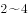

# 2022年深圳市考公务员录用考试《行测》试题（网友回忆版）

> 言语理解与表达 · 25 题 · 深圳市考 2022

## 第 1 题　qid 4651836 · 逻辑填空

将下列选项中的词语依次填入句子横线处，最恰当的一组是：
党的十九大以来，党中央全面分析国际科技创新竞争        ，深入研判国内外发展形势，针对我国科技事业面临的突出问题和挑战，坚持把科技创新摆在国家发展全局的核心位置，全面        科技创新工作。

- **A**. 态势 谋划　✅
- **B**. 大势 谋划
- **C**. 态势 策划
- **D**. 大势 策划

**答案**：A

**官方解析**

第一空，根据“全面分析······深入研判······”可知，此处为相同句式构成的近义并列，因此横线处所填词语需与“形势”并列。“形势”指事物发展的状况，A、C两项“态势”指事物发展的形势及状态，与“形势”语义相近，符合文意，保留。B、D两项“大势”指事物发展的趋势，体现为事物发展的动向、倾向，与文意不符，排除。
第二空，搭配“科技创新工作”及“全面”，根据文意可知，横线处应表达如何开展多角度思考宏观的科技创新工作之意。A项“谋划”指计划、想办法，符合文意，且“全面谋划”为常用搭配，当选。C项“策划”指积极主动地想办法，定计划，常用于表达具体事情的计划，不符合文意，且一般不与“全面”搭配使用，排除。
故正确答案为A。
【文段出处】《实现高水平科技自立自强》

---

## 第 2 题　qid 4651843 · 逻辑填空

将下列选项中的词语填入句子横线处，最恰当的一组是：
这次疫情是对全球卫生治理体系的一次集中        。我们要加强和发挥联合国和世界卫生组织作用，完善全球疾病预防控制体系，更好预防和应对今后的疫情。

- **A**. 检验　✅
- **B**. 考验
- **C**. 锻炼
- **D**. 磨炼

**答案**：A

**官方解析**

横线处所填词语形容“疫情”与“全球卫生治理体系”的关系，A项“检验”指检查验看，检查验证，侧重表示对本身应该具备的能力进行验证，全球卫生治理体系理应可以应对疫情，故用“检验”可形容两者关系，表达通过疫情验证全球卫生治理体系是否合格之意，当选。B项“考验”指通过具体事件、行动或困难环境来检验，侧重考察被考验者的水平等，不一定表示对本身应该具备的能力进行验证，排除；C项“锻炼”比喻通过实践，提高人的工作能力和思想水平，D项“磨炼”指人在艰苦困难的环境中经受锻炼，均与“全球卫生治理体系”搭配不当，排除。
故正确答案为A。
【文段出处】《习近平在全球健康峰会上的讲话》

---

## 第 3 题　qid 4651846 · 逻辑填空

将下列选项中的词语依次填入句子横线处，最恰当的一组是：
个人信息保护是数字经济和社会治理的底线，个人信息保护法的一大使命就是划出行为边界，引导并        政府和市场主体，使个人信息的收集、存储、使用、加工、传输、提供、公开等            ，令侵害个人信息的行为能够得到法律惩处，为个人信息保护创造稳定可预期的常态化局面。

- **A**. 约束 有章可循　✅
- **B**. 约束 有据可查
- **C**. 制约 有章可循
- **D**. 制约 有据可查

**答案**：A

**官方解析**

第一空，由“个人信息保护法的一大使命就是划出行为边界”可知，横线处应体现出“个人信息保护法”规定了“政府和市场主体”的行为，即法律的规范作用。A、B两项“约束”指按照约定（特定）条件限制，管束，多与“法律、协议、道德”等搭配，置于此处可体现出法律对政府和市场主体的规范作用，符合文意，保留。C、D两项“制约”指一事物的存在、变化是另一事物存在、变化的先决条件，则前者制约后者，侧重限制，并非法律的规范作用，排除。
第二空，形容“个人信息保护法”所带来的效果，即让“个人信息的收集”等行为有法可依，A项“有章可循”指有章法可以遵循，符合文意，当选。B项“有据可查”意思是有依据可以查到，指的是在办事工作过程中，要注意保留依据，与文意不符，排除。
故正确答案为A。
【文段出处】《社论｜个人信息保护亟待进入常态化》

---

## 第 4 题　qid 4651849 · 逻辑填空

将下列选项中的词语依次填入句子横线处，最恰当的一组是：
身居“唐宋八大家”之列的欧阳修，        文章冠绝一时，其为政措施        颇具创新意识。        欧阳修一生仕途坎坷，为官几十年竟遭三次贬谪，但他始终宠辱不惊，晚年        是旷达潇洒。

- **A**. 不但 还 不过 更
- **B**. 不仅 也 尽管 也　✅
- **C**. 不仅 也 不过 更
- **D**. 不但 还 尽管 也

**答案**：B

**官方解析**

本题可从前两空入手，根据“文章冠绝一时”“为政措施······颇具创新意识”可知，文段意在说明欧阳修的文章和为政措施均十分优秀。B、C两项“不仅······也······”可引导并列关系，符合文段逻辑，保留。A、D两项“不但······还······”表示递进关系，强调后者，而文段并未强调欧阳修的政治能力更加突出，与文段逻辑不符，排除。
第三空，根据文意可知，横线处所填词语与“但”连用构成转折关系。B项“尽管”表示姑且承认某种事实，关联词搭配恰当，保留。C项“不过”表示转折关系，与后文“但”无法衔接，排除。
第四空，代入验证。“宠辱不惊”“旷达潇洒”均体现欧阳修面对坎坷时的豁达，B项“也”表示并列关系，置于此处逻辑恰当，当选。
故正确答案为B。

---

## 第 5 题　qid 4651851 · 逻辑填空

将下列选项中的词语依次填入句子横线处，最恰当的一组是：
择业观是价值观和人生观的        ，也是社会发展变化的          ，就业观念的变化，折射出当代青年身上的朝气与锐气，也折射出时代的发展在当代青年身上留下的印记。

- **A**. 掠影 指南针
- **B**. 缩影 指南针
- **C**. 掠影 风向标
- **D**. 缩影 风向标　✅

**答案**：D

**官方解析**

第一空，根据“择业观是价值观和人生观”以及后文可知，横线处需表达“择业观”是“价值观和人生观”的集中体现，B、D两项“缩影”比喻能代表同一类型特征的具体而微的人或事物，与文意相符，保留。A、C两项“掠影”指某些场面的大致情况，与文意不符，排除。
第二空，根据文意可知，横线处需表达通过“择业观”可以知道社会的发展变化，D项“风向标”本意为一种测定风来向的设备，引申为某种事物的发展趋势和方向，置于此处可以体现从“择业观”可知社会的发展变化，符合文意，当选。B项“指南针”比喻辨别正确方向的依据或指导行动的准则，文段并未体现依据或准则，与文意不符，排除。
故正确答案为D。
【文段出处】《让每个选择都有光芒》

---

## 第 6 题　qid 4651856 · 逻辑填空

将下列选项中的词语依次填入句子横线处，最恰当的一组是：
在很多外地人看来，把江西人称为“老表”，似乎是一种贬义，因为“老表”这两个字很下里巴人。江西人却以有这样一个称呼而感到非常自豪，无论海角天涯，无论是否            ，相互之间只要听到“我是老表”，马上就像            的亲戚一样。

- **A**. 萍水相逢 不期而遇
- **B**. 素昧平生 久别重逢　✅
- **C**. 素昧平生 不期而遇
- **D**. 萍水相逢 久别重逢

**答案**：B

**官方解析**

第一空，根据“无论海角天涯······只要听到‘我是老表’，马上就像······的亲戚一样”可知，对江西人来说，不管在哪，不管面对什么样的人，“老表”这一称呼可迅速且极大地拉近人与人之间的关系，故横线处应体现一开始关系非常陌生之意。B、C两项“素昧平生”意为一向不相识，能体现关系非常陌生之意，与文意相符，保留。A、D两项“萍水相逢”比喻向来不认识的人偶然相遇，强调相遇，与文意不符，且与“素昧平生”相比，程度较轻，排除。
第二空，根据“亲戚”可知，横线处应体现关系亲密、亲切之感。B项“久别重逢”意为长久分别后再次相逢，能体现关系亲密、亲切之感，当选。C项“不期而遇”意为没有约定而意外地相遇，强调偶然相遇，无法体现亲密、亲切之感，排除。
故正确答案为B。
【文段出处】《江西老表》

---

## 第 7 题　qid 4651827 · 逻辑填空

将下列选项中的词语依次填入句子横线处，最恰当的一组是：
他深知沦落江湖的艺人的        和痛苦，他是带着深厚的挚爱和同情来        这两个受着生活重压的小人物的。

- **A**. 心酸  刻画
- **B**. 心酸  描绘
- **C**. 辛酸  刻画　✅
- **D**. 辛酸  描绘

**答案**：C

**官方解析**

第一空，横线处所填词语形容“沦落江湖的艺人”，体现出他们漂泊、流离的悲惨生活，C、D两项“辛酸”比喻痛苦悲伤，侧重于对生活状态以及经历某种历程的一种描写，可以与艺人“沦落江湖”的经历形成对应，符合语境，保留。A、B两项“心酸”指心中悲痛，侧重于表达内心伤心难过的一种感受，文段并非强调伤心难过的感受，不符合语境，排除。
第二空，根据文意可知，他是带着深厚的挚爱和同情来塑造这两个受着生活重压的小人物的，C项“刻画”指用文字描写或用其他艺术手段表现（人物的形象、性格等），更侧重于深刻而细致地描写，符合语境，当选。D项“描绘”指画，也指用语言文字来描写，侧重于生动形象地描写，文段并非强调“生动形象”，不符合语境，排除。
故正确答案为C。
【文段出处】《悲剧与赞歌——关于卓别林的&lt;舞台生涯&gt;》

---

## 第 8 题　qid 4651829 · 逻辑填空

将下列选项中的词语依次填入各句横线处，最恰当的一组是：
（1）如果仅凭蜻蜓点水式的观感，作出以偏概全的判断，就容易盲人摸象、            ，就难以读懂真实而鲜活的农村，甚至陷入悲观悲情的泥潭。
（2）在中华民族近代史上，贫困如影随形：多灾多难、饿殍遍地的记录            。

- **A**. 目无全牛  俯拾皆是
- **B**. 一叶障目  俯拾皆是
- **C**. 目无全牛  不胜枚举
- **D**. 一叶障目  不胜枚举　✅

**答案**：D

**官方解析**

第一空，根据顿号可知，横线处所填成语与“盲人摸象”构成近义并列，含义相近，表示看问题不全面，以偏概全之意，B、D两项“一叶障目”比喻被局部的或暂时的现象所迷惑，不能认清事物的全貌或问题的本质，符合文意，保留。A、C两项“目无全牛”形容人的技艺高超，得心应手，已经到达非常纯熟的地步，不符合文意，排除。
第二空，搭配“记录”，且根据前文“贫困如影随形”可知，横线处所填成语表示“饿殍遍地的记录”非常多，D项“不胜枚举”指无法一一全举出来，形容数量极多，符合文意，当选。B项“俯拾皆是”意思是只要低下头来捡取，到处都是，形容多而易得，虽然能体现多的含义，但与“记录”搭配不当，排除。
故正确答案为D。
【文段出处】《心怀农村沃土 激扬梦想力量》《中国反贫困斗争的伟大决战》

---

## 第 9 题　qid 4651831 · 逻辑填空

将下列选项中的词语依次填入句子横线处，最恰当的一组是：
当时，军管组动辄干预并批判他们的技术工作，技术讨论会上甚至不允许使用外文字母作符号。很多技术人员自叹如倾巢之卵，            ，即使慎重、委婉地表达看法，也仍常遭批判。但每次讨论会上，他仍坚持讲真话，明确地讲出自己对技术问题的看法，绝不            。

- **A**. 守口如瓶  随声附和
- **B**. 噤若寒蝉  广谋从众
- **C**. 守口如瓶  广谋从众
- **D**. 噤若寒蝉  随声附和　✅

**答案**：D

**官方解析**

第一空，横线处与“倾巢之卵”构成近义并列，且根据横线前后文可知，横线处成语应体现技术人员因为害怕而不敢说话之意，B、D两项“噤若寒蝉”形容受到压制不敢作声，符合文意，保留。A、C两项“守口如瓶”形容说话谨慎，严守秘密，侧重于强调保守秘密，但文段并没有体现出需要保守秘密，与文意不符，排除。
第二空，根据横线前“他仍坚持讲真话，明确地讲出自己对技术问题的看法”可知，他是有自己主见的，横线前出现否定词“绝不”，故横线处成语应体现没有主见的意思，D项“随声附和”指自己没有主见，别人说什么，自己跟着说什么，符合文意，当选。B项“广谋从众”指集思广益，听从多数人的意见，与文意不符，排除。
故正确答案为D。
【文段出处】新华网《国家最高科技奖获得者于敏：愿将一生献宏谋》

---

## 第 10 题　qid 4651834 · 逻辑填空

将下列选项中的词语依次填入句子横线处，最恰当的一组是：
在博物馆展厅中心，一件19世纪的婚纱头纱美得令人            。这件平铺面积达7平方米的头纱耗时数十年制作，将所有阿朗松针织花边技艺融为一体，仿佛一本花边“百科全书”。人们观赏它，是在探寻时光的        ，也是        时间打磨后的精湛技艺。

- **A**. 心旷神怡  绚烂  品味
- **B**. 心旷神怡  瑰丽  领会
- **C**. 屏息凝神  瑰丽  感受　✅
- **D**. 屏息凝神  绚烂 研习

**答案**：C

**官方解析**

第一空，根据前文“婚纱头纱美得令人”及后文“耗时数十年制作”“所有”可知，横线处成语形容头纱之美带给人的强烈感受，C、D两项“屏息凝神”指全神贯注地看，连呼吸都不敢呼吸一下，符合文意，保留。A、B两项“心旷神怡”指心情舒畅，精神愉快，与“屏息凝神”相比，程度较轻，排除。
第二空，搭配“时光”，C项“瑰丽”、D项“绚烂”均符合文意，保留。
第三空，搭配“技艺”，且根据前文“人们观赏它”可知，通过对头纱的观赏人们能够体会到当年技艺的精湛，C项“感受”符合文意，当选。D项“研习”指研究学习，并非是人们通过“观赏”就能够实现的，排除。
故正确答案为C。
【文段出处】《一针一线编织时光倩影（多彩非遗）》

---

## 第 11 题　qid 4651838 · 语句表达

下列各项中，没有语病的一项是：

- **A**. 月饼创新的落脚点，不仅是要在包装上花样翻新，而是要在口味上与时俱进。
- **B**. 社交媒体上的“家长群”是把双刃剑，它拉近了学校和家庭的距离，降低了老师和家长沟通的成本，同时也会产生很多矛盾。　✅
- **C**. 家暴不是“家务事”，反家庭暴力是家庭、国家和社会的共同责任。
- **D**. 理想的平台不是一对一的众声喧哗，也不应该成为一些人攀比、逞能、谋求私利或推卸责任的“角斗场”。

**答案**：B

**官方解析**

本题为病句辨析题。
A项，“不仅是······而是······”关联词搭配不当，应改为“不是······而是”，排除；
B项，没有语病，表意明确，当选；
C项，“家庭、国家和社会”排列顺序不当，应由大到小排列，改为“国家、社会和家庭”，排除；
D项，“理想的平台不是一对一的众声喧哗”成分残缺，应改为“理想的平台不是一对一的众声喧哗之所”，排除。
故正确答案为B。

---

## 第 12 题　qid 4651839 · 片段阅读

下列各项中，有语病的一项是：

- **A**. 作家是一个敏感的群体，对他们而言，花园是一个庇护所，一个让幻想飞翔的地方。
- **B**. 由于心理压力较大，他决定通过占卜的方式给自己信心。
- **C**. 海阔、湖清、河畅、水净、景美，深圳的冬天着实是一个好地方。　✅
- **D**. 近年来，校外培训在资本助力下迅速扩张，加重了学生课业负担和家长经济负担，减损了人民群众的获得感。

**答案**：C

**官方解析**

本题为病句辨析题。
C项，“深圳的冬天着实是一个好地方”主宾搭配不当，应改为“冬天的深圳着实是一个好地方”，当选；
A、B、D三项均没有病句，表意明确，排除。
故正确答案为C。

---

## 第 13 题　qid 4651835 · 语句表达

下列选项中，没有语病的一项是：

- **A**. 20世纪60年代，西班牙语美洲叙事文学领域的“文学爆炸”，使拉丁美洲文学推向了世界。
- **B**. 傍晚，我们登上回龙山最高处，映入眼帘的是莽莽青山、灼灼晚霞和阵阵凉爽的清风。
- **C**. 现编新教材里的很多课文，对一线经验丰富的教师是再熟悉不过了。
- **D**. 创新不是一蹴而就的，特别是基础科学领域的创新，往往需要“板凳坐得十年冷”的耐心和定力。　✅

**答案**：D

**官方解析**

A项，“使······推向了······”搭配不当，可将“使”改为“将”，排除；
B项，“映入眼帘”与“阵阵凉爽的清风”搭配不当，排除；
C项，语序不当，可改为“一线经验丰富的教师对现编新教材里的很多课文再熟悉不过了”，排除；
D项，句子没有语病，句意明确，当选。
故正确答案为D。
【文段出处】《从马尔克斯到略萨：回溯“文学爆炸”》《书写科技强军新篇章》

---

## 第 14 题　qid 4651842 · 片段阅读

下列选项中，有语病的一项是：

- **A**. “枪声就是命令。”驻扎在附近的八路军115师老四团八连听到枪声后，立即赶来营救朱村百姓，有24名官兵牺牲在这里。
- **B**. 珍珠苑种植专业合作社是由朱村党支部领办的，完成葡萄、香菇特色农产品的绿色认证，注册“珠村”“七岌山”商标，打造了“朱村味道”电商品牌。　✅
- **C**. 沂蒙山区腹地，沂河水畔，曹庄镇朱村，越来越热闹了。一拨又一拨游客来到这里，听红色故事，悟革命传统，品特色文化。
- **D**. 这些年，朱村的变化翻天覆地：建起朱村大桥，开通滨河大道，水泥大道户户通······从偏居一隅变得四通八达。

**答案**：B

**官方解析**

B项，“完成葡萄、香菇特色农产品的绿色认证”缺少主语，成分残缺，应改为“朱村党支部领办的珍珠苑种植专业合作社，完成葡萄、香菇特色农产品的绿色认证······”，故存在语病，当选。
A、C、D三项均表述恰当，没有语病，排除。
故正确答案为B。
【文段出处】《朱村的日子红火起来》

---

## 第 15 题　qid 4651847 · 语句表达

①强盛的罗马帝国灭亡于野蛮的汪达尔人入侵，光芒四射的希腊诸城邦亡于马其顿人等等，均属游牧、半游牧文明战胜农耕文明的典型例证
②尽管受到前朝志士顽强的抵制和反抗，但当尘埃落定，河山重整，世人别无选择，只能像杜牧慨叹的那样“折戟沉沙铁未销，自将磨洗认前朝”了
③在中国，宋、明两个王朝也都是被北方经济文化落后的少数民族灭亡的。偏安王朝因没落而退出历史舞台，九服之外的族群因雄起改变正统走向
④可以说，不论西方文明史还是东方文明史，都是血与火书写的，都是征服与被征服的历史
⑤值得注意的是，野蛮部落灭掉了文明族群，虎狼之国吞并了礼仪之邦，在人类社会发展中并非个案
将以上5个句子重新排列，语序恰当的一项是：

- **A**. ⑤①③④②
- **B**. ⑤④①③②
- **C**. ④⑤①③②　✅
- **D**. ④⑤③①②

**答案**：C

**官方解析**

对比选项，确定首句。④句指出东西方文明史的共同点，⑤句介绍了部落间的吞并，从内容上难以判断首句。
继续观察发现，⑤句提到“虎狼之国吞并了礼仪之邦，在人类社会发展中并非个案”，按照逻辑顺序，接下来应论述具体情况，⑤句后分别衔接①③④三句，①句论述游牧、半游牧文明战胜农耕文明的典型例证，③句介绍宋、明两个王朝的衰亡，⑤句后衔接①③两句均可，保留A、C、D三项。④句指出东西方文明史的共同点，与⑤句话题不一致，排除B项。
接下来继续观察，②句论述“前朝志士”，③句论述“宋、明两个王朝”，论述的内容均与“王朝”相关，故③②两句构成共同信息捆绑，排除A、D两项，保留C项。
验证C项，文段先指出在西方文明史和东方文明史中都有征服与被征服的历史，然后具体介绍有关事例，符合逻辑，当选。
故正确答案为C。
【文段出处】《文明与野蛮的较量——古代战争的基本逻辑》

---

## 第 16 题　qid 4651854 · 片段阅读

对旅游业而言，风景固然很重要，游客口碑更关键。游客都是乘兴而来，希望赏美景、享美食、获得良好服务、留下美好回忆。游客如愿以偿，一传十，十传百，是最生动的“广告”。同时，出门在外，人生地不熟，谁都不愿遇到“欺生”，更怕权益受损、投诉遇冷、败兴而归，那岂不是花钱找罪受？“宰客”事件频发，公然忽悠蒙骗，地方处置不力，自然会令有关地区的旅游形象大打折扣，一些热门旅游地“转冷”殷鉴不远。
下列对上文的理解有误的是：

- **A**. 旅游业管理者不仅要重视打造美景，更要重视打造口碑
- **B**. 唯有游客尽兴而归，才能维护旅游地的游客口碑　✅
- **C**. 地方对“宰客”等旅游问题要处置得力才能暖人心
- **D**. 一些热门旅游地或因“宰客”事件频发而遭遇冷落

**答案**：B

**官方解析**

A项，根据“对旅游业而言，风景固然很重要，游客口碑更关键”可知，表述正确，排除；
B项，根据“游客都是乘兴而来······游客如愿以偿，一传十，十传百，是最生动的‘广告’”可知，“唯有······才······”表述过于绝对，当选；
C、D两项，根据“‘宰客’事件频发，公然忽悠蒙骗，地方处置不力，自然会令有关地区的旅游形象大打折扣，一些热门旅游地‘转冷’殷鉴不远”可知，均表述正确，排除。
本题为选非题，故正确答案为B。
【文段出处】《大理昆明被通报，旅游乱象须整治》

---

## 第 17 题　qid 4651860 · 片段阅读

面对新时代教育的变革与重塑，教师作为教育实践环节的直接执行者，必须以先行者的姿态投身于这场历史洪流之中，而完成这一蜕变的关键就在于，让教师重新构建起以学习科学素养为核心的知识能力体系。对于新时代高水平教师队伍建设来说，学习科学素养不仅仅是对学习科学知识技能的进一步学习与拓展，更重要的是，它从实践应用和意识形态这两个层次，对教师在一线教学中深入理解和综合应用学习科学提出了更高的要求。教师需要从真实学习的基础机制出发，结合真实学科教学的有效设计与学习的有效评价，逐步完成自身学习科学素养的学习与构建。这一综合素养的形成，不仅需要教师自身付出艰巨的努力，同时也需要外界提供强有力的支持。
下列说法与原文意思不相符的是：

- **A**. 教师必须重新构建起以学习科学素养为核心的知识能力体系，否则将难以适应新时代教育的变革与重塑
- **B**. 教师应该从实践应用和意识形态这两个层次，进一步学习与拓展学习科学知识技能　✅
- **C**. 真实学习的基础机制，真实学科教学的有效设计与学习的有效评价是教师学习科学素养建构不可或缺的要素
- **D**. 教师依靠自身，无法形成以学习科学素养为核心的综合素养

**答案**：B

**官方解析**

A项，由“面对新时代教育的变革与重塑······知识能力体系”可知，表述正确，排除；
B项，由“学习科学素养不仅仅······提出了更高的要求”可知，“学习与拓展学习科学知识技能”与“从实践应用和意识形态这两个层次，对教师提出了更高的要求”为“学习科学素养”的两部分内容，表述错误，当选；
C项，由“教师需要从真实学习的基础机制出发······科学素养的学习与构建”可知，表述正确，排除；
D项，由“这一综合素养的形成······同时也需要外界提供强有力的支持”可知，表述正确，排除。
本题为选非题，故正确答案为B。
【文段出处】《高水平教师需养成学习科学素养》

---

## 第 18 题　qid 4651867 · 片段阅读

科学技术可以改善耕地条件，进而扩大某些粮食作物种植区域，还可以提高粮食生产过程中有限资源的利用率。例如在实施塑料薄膜覆盖后，土壤一般可增温，覆盖期内地表积温增加，从而使作物适宜耕作区的纬度向北推移，海拔提高1000～2000m。该技术可应用的作物范围广，一般增产幅度可达30％～50％。农机装备技术的进步也至关重要。深松机、无人驾驶联合耕播作业机等机械设备逐渐被推广使用，很多新技术也在其中得到应用。如遥感技术可应用于农业资源调查、动态监测、生物产量估计与农业灾害预报等领域。

下列说法与原文意思相符的是：

- **A**. 
科技可使农作物的种植范围不受海拔限制

- **B**. 
提高有限资源的利用率可使粮食产量增加
　✅
- **C**. 
覆盖塑料薄膜可以使土壤增温

- **D**. 
遥感技术既能改善农业资源，又能预报农业灾害

**答案**：B

**官方解析**

A项，根据“从而使······海拔提高1000～2000m”可知，文段仅论述农作物在实施塑料薄膜覆盖后，可以使作物适宜耕作区的海拔在一定范围内提高，“种植范围不受海拔限制”表述过于绝对，排除；

B项，根据“科学技术······可以提高粮食生产过程中有限资源的利用率”及“该技术可应用的作物范围广，一般增产幅度可达30％～50％”可知，文段指出科学技术可以提升有限资源的利用率进而实现增产，表述正确，当选；

C项，根据“例如在实施塑料薄膜覆盖后，土壤一般可增温，覆盖期内地表积温增加”可知，文段论述的是地表积温增加，而非“土壤增温”，偷换概念，排除；

D项，根据“如遥感技术可应用于农业资源调查、动态监测、生物产量估计与农业灾害预报等领域”可知，“遥感技术能改善农业资源”文段并未提及，无中生有，排除。

故正确答案为B。

【文段出处】《2021年高考语文第一次综合模拟评估卷（三）》

---

## 第 19 题　qid 4651801 · 片段阅读

火星在40亿年前是一个湿润、温暖，且拥有浓厚大气层的星球。其岩石圈、水和大气之间的相互作用在地表形成了河流、湖泊和地表沉积物。随着火星内部热活动的快速减弱和大气层的逐渐消失，其地表的液态水也随之消失，气候变得干冷，水动力过程对地表结构塑造的主导地位逐渐被风动力所取代。这种由温湿转变到干冷的气候变化大约持续了数亿年的时间，火星的表面逐渐演变成为一个不再宜居的环境。
下列说法与原文意思相符的是：

- **A**. 40亿年前的火星曾有生命且环境宜居
- **B**. 如今的火星气候干冷，液态水已不复存在
- **C**. 火星表面曾存在与水活动相关的地貌　✅
- **D**. 如今不再宜居的环境已经几乎排除了火星上存在生命的可能

**答案**：C

**官方解析**

A项，根据文意可知，文段未提及“火星曾有生命”，无中生有，排除；
B项，根据“随着火星内部热活动······其地表的液态水也随之消失，气候变得干冷”可知，仅火星地表的液态水消失，故“液态水已不复存在”范围扩大，排除；
C项，根据“其岩石圈、水和大气之间的相互作用在地表形成了河流、湖泊和地表沉积物”“水动力过程对地表结构塑造的主导地位逐渐被风动力所取代”可知，表述正确，当选；
D项，根据“火星的表面逐渐演变成为一个不再宜居的环境”可知，火星表面不再宜居，而火星上其他地方的情况并未提及，无法排除火星上存在生命的可能，表述绝对，排除。
故正确答案为C。
【文段出处】《火星PK柴达木盆地 火星上是否有生命似可在柴达木盆地找到线索》

---

## 第 20 题　qid 4651803 · 片段阅读

秦中央集权的确立，还离不开文书行政体制。文书行政，是依靠公文来传递政务信息的政务运行机制。由于文书能保证信息的一致性，不会因层层下达而走样，所以是非常有效的统治工具。秦很重视文书行政。1975年出土的睡虎地秦墓竹简，抄有大量秦律令，其中一条讲：“有事请也，必以书，毋口请，毋羁请（有事情必须请示时，一定要以文书的形式，不要口头请示，也不要让人代为请示）。”它明确要求必须用文书来处理政务。秦律还有《行书律》，专门对文书的收发、传送作严格规定。律文规定，邮传机构接到皇帝的诏书必须立即发送，如有稽留，必受惩罚。通过文书行政，秦王朝确保了中央与地方政务信息的一体化。
下列说法与原文意思相符的是：

- **A**. 文书行政体制是秦中央集权下的特有政务运行机制
- **B**. 在秦王朝以口头形式处理政务会受到惩罚
- **C**. 睡虎地秦墓竹简专门记载了秦王朝的政务处理程序规定
- **D**. 文书行政是秦王朝实现中央与地方政务信息一体化的统治工具　✅

**答案**：D

**官方解析**

A项，根据文意可知，文段未提及“特有政务运行机制”，无中生有，排除；
B项，根据“有事情必须请示时，一定要以文书的形式，不要口头请示，也不要让人代为请示”可知，文段未提及“口头形式处理政务会受到惩罚”，无中生有，排除；
C项，根据“1975年出土的睡虎地秦墓竹简······明确要求必须用文书来处理政务”可知，“睡虎地秦墓竹简”只提到用文书处理政务，并未提及处理程序，故“处理程序”无中生有，排除；
D项，根据“通过文书行政，秦王朝确保了中央与地方政务信息的一体化”可知，表述正确，当选。
故正确答案为D。
【文段出处】《公元前220年秦的统一》

---

## 第 21 题　qid 4651806 · 语句表达

景观就是具有观赏价值的风景，文学景观则是指那些与文学密切相关的景观。文学景观比普通的景观多了一层文学色彩和内涵，是地理环境与文学互相作用的结果，是文学的一种地理呈现。当人们到了文学名篇诞生地时，必然会产生“江山留胜迹，我辈复登临”的渴望，哪怕这座楼是重建的，也可以满足人们欣赏文学景观，触发情感共鸣的需求，名楼的魅力除了来源于楼本身，更多是来源于文学经典，                    。
填入上文横线处的句子，最恰当的是：

- **A**. 如果没有文学和名人加持，楼就很难成为名楼　✅
- **B**. 只要有文学和名人加持，楼就能成为名楼
- **C**. 只有文学和名人的加持，才能使楼成为名楼
- **D**. 当然，即使有了文学和名人加持，楼也未必能成为名楼

**答案**：A

**官方解析**

本题为语句填空题，横线在结尾。文段开篇表明景观与文学景观的含义，并指出文学景观与普通景观的区别，即多了一层文学色彩和内涵，紧接着强调人们之所以到“名楼”，除了“楼”本身，更因为其来源于“文学经典”。横线处与尾句衔接紧密，故应强调文学与名人对于“名楼”的重要性。
A项，“如果没有······楼就很难成为名楼”为反面论证的表述，再次强调文学与名人对于“名楼”的重要性，与上文衔接得当，且“很难成为”表述较为温和，当选；
B项，“只要······就······”表述过于绝对，文段仅强调其很重要，并未强调二者之间存在必然的联系，排除；
C项，“只有······才······”为必要条件关联词，相较文段而言表述程度过重，排除；
D项，“未必能成为名楼”说明文学与名人对于“名楼”并没有那么重要，与文意相悖，排除。
故正确答案为A。
【文段出处】《“丝绸之路”上的文学景观》

---

## 第 22 题　qid 4651808 · 片段阅读

在古代，许多诗人的作品是通过个人题壁、歌女吟唱的方式传之四方。在现代，传统文化不仅可以通过图书、报刊、音像、影视等形式进行传播，还可以通过日常生活中的用具进行传播。作为文房清玩的笺纸，由于和知识分子的生活密不可分，因此扮演了传承传统文化的角色。笺纸中不仅有图画，而且有书法，有篆刻，有诗词，有掌故，通过笺纸，人们可以重温诗词歌赋的名句，可以品味传统文化的精神。比如，林纾的宋人词意笺，陈师曾的杜甫诗意笺，都在很大程度上普及了唐诗宋词。
上文表达的主要观点是：

- **A**. 传统文化的现代传播途径以笺纸为主
- **B**. 唐诗宋词的普及与诗词意笺密不可分
- **C**. 诗词作品的传播形式古今有异
- **D**. 笺纸发挥了传承传统文化的重要作用　✅

**答案**：D

**官方解析**

文段开篇介绍在古代，许多诗人的作品是通过个人题壁、歌女吟唱的方式传播，接着论述在现代，传统文化可以通过多种形式进行传播。随后引出“笺纸”这个话题，紧接着通过结论词“因此”进行总结，指出“笺纸”扮演了传承传统文化的角色，文段结尾对笺纸传承传统文化进行了举例说明。故文段重点为中间的结论，强调“笺纸”对传承传统文化有重要作用，对应D项。
A项，“现代传播途径以笺纸为主”文段未提及，无中生有，排除；
B项，“唐诗宋词”对应“比如”之后举例说明的内容，非重点，排除；
C项，缺少文段主题词“笺纸”，且“传播形式”对应“因此”之前的内容，非重点，排除。
故正确答案为D。
【文段出处】《中国笺纸：微型国画的人文情怀》

---

## 第 23 题　qid 4651809 · 片段阅读

没有安全的国家环境，人们怎么能一心脱贫攻坚并取得历史性成就？没有国家安全、社会稳定，推动创新发展、协调发展、绿色发展、开放发展、共享发展，经济社会发展怎么会有源源不断的活力和动力？没有维护国家安全的能力和信心，面对来势汹汹的新冠肺炎疫情，怎么能以众志成城之力抵挡住病毒的侵袭？国家安全、社会安定、人心安稳，不是从天上掉下来的，而是在发展实践中用行动维护而来的、捍卫而得的、奋战而赢的。
上文表达的主要观点是：

- **A**. 创新发展、协调发展、绿色发展、开放发展、共享发展是当前经济社会发展的实践指南
- **B**. 社会发展的活力和动力是战胜疫情、维护国家安全和社会安定的基本保障
- **C**. 事实告诉我们，没有安全和稳定，一切都无从谈起　✅
- **D**. 在发展实践中，我们要用切实的行动来维护国家安全、社会安定和人心安稳

**答案**：C

**官方解析**

语段通过一连串反问句强调了国家安全和稳定的重要性，主要谈的是“安全和稳定”的重要性，因此C项正确。而A、B项则为某一论据的语段外延展，或强行进行因果关联；D项虽与末句意思相同，但并非语段主旨。
故正确答案为C。
【文段出处】《人民网评：守护国家安全，人人有份有责》

---

## 第 24 题　qid 4651810 · 片段阅读

笔墨大咖，顾名思义，是指在笔墨功夫上有追求、有造就、有作为的人。文学作品、中国书画等等，所倾注的正是淋漓酣畅的笔墨意韵。一个人若是总能做到意在笔先，又何愁不能泼洒出意韵生动的笔墨图景？这样的人，成为笔墨大咖是迟早的事。
上文“这样的人”是指：

- **A**. 能做到意在笔先的人　✅
- **B**. 能泼洒出意韵生动的笔墨图景的人
- **C**. 能倾注淋漓酣畅的笔墨意韵的人
- **D**. 在笔墨功夫上有追求、有造就、有作为的人

**答案**：A

**官方解析**

本题为代词指代题，首先定位“这样的人”出现在文段尾句，重点关注其之前的内容，前文通过反问句，着重强调“做到意在笔先”的人不愁泼洒出意韵生动的笔墨图景，故“这样的人”即“总能做到意在笔先”的人，对应A项。
B项，“能泼洒出意韵生动的笔墨图景”是“做到意在笔先”之后带来的意义，并非前一句话中的重点内容，排除；
C项“能倾注淋漓酣畅的笔墨意韵”和D项“在笔墨功夫上有追求、有造就、有作为”对应文段前两句话的内容，并非代词指代的内容，均排除。
故正确答案为A。
【文段出处】《笔墨大咖》

---

## 第 25 题　qid 4651812 · 片段阅读

日前，四川博物院展出了反映古人分餐制的食具——“清河食官”铜染器，引发了人们的思考：“分餐制”是古已有之的吗？中国社会科学院考古研究所研究员给出的解释是，分餐制可上溯到史前时代。两汉时期，分餐制得到了很好的传承。当时人们没有坐具，分餐进食时，面前摆着一张低矮小食案，一人一案，案上放着食具。考古发现的汉墓壁画及画像石砖等实物和绘画资料，都可以证明这一点。五朝十六国时期，高足坐具的流行，导致传统席地而坐逐渐被更轻松的垂足坐姿取代，也进而影响分餐向会餐的转变。
根据上文，下列对中国古代分餐制理解正确的是：

- **A**. 古人分餐进食的主要食具为铜染器
- **B**. 分餐制在两汉时期得到了全国推广和普及
- **C**. 考古资料证实，古人围案而坐，各有餐具，分餐进食
- **D**. 历史上分餐制到会餐制的演变与古人坐姿变化有关　✅

**答案**：D

**官方解析**

A项，根据“四川博物院展出了反映古人分餐制的食具——‘清河食官’铜染器”可知，铜染器虽是分餐制的食具，但是否为“主要食具”文段未提及，无中生有，排除；
B项，根据“两汉时期，分餐制得到了很好的传承”可知，分餐制是否“得到了全国推广和普及”文段未提及，无中生有，排除；
C项，根据“分餐进食时，面前摆着一张低矮小食案，一人一案，案上放着食具”可知，分餐制下古人一人一案、分餐进食，而非“围案而坐”，表述错误，排除；
D项，根据“高足坐具的流行，导致传统席地而坐逐渐被更轻松的垂足坐姿取代，也进而影响分餐向会餐的转变”可知，表述正确，当选。
故正确答案为D。
【文段出处】《古代人也吃“火锅”？分餐制原来古已有之》

---
