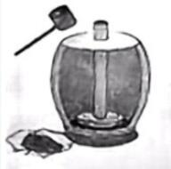
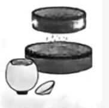
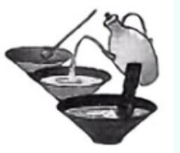

# 2026年浙江省公务员录用考试《行测》题（B类）（网友回忆版）

> 言语理解与表达 · 25 题 · 浙江 2026

## 材料 1

        每到假期，在良渚古城遗址公园的公众考古区，招募成团的公众考古志愿者总会如约而至，来自浙江省文物考古研究所良渚工作站的专家会耐心地给志愿者讲解良渚文化和考古知识。

        “________” 杭州市民小杨听得津津有味。第一次体验考古的他兴奋地挥着手铲，走向发掘体验区内画好的方格网，跃跃欲试。

        良渚古城遗址公园的社教专员先教大家学习如何使用考古手铲、刷子等工具，然后指导大家开始铲边、刮面、捡拾等程序。一把手铲，开启一段探知悠久文明的惊喜之旅。半小时后，小杨捧着刚刚挖出来的文物，向大家展示。专家初步断定，这是一块商周时期的陶片，距今有两三千年的历史。收获惊喜，更要做好保护。志愿者给挖到的 “宝贝” 挨个儿登记、贴标签，并装袋封存，完成考古日志。

        “参加公众考古活动让我对考古工作有了更直观、更深入的认识，也能更深刻地感受良渚文明的魅力。” 小杨说。

### 第 1 题　qid 12019798 · 语句表达

填入画横线部分最恰当的一项是：

- **A**. 我今天一定能挖出点东西！
- **B**. 我从小就喜欢考古，今天是来圆梦的！
- **C**. 没想到考古里藏着这么多有趣的知识！　✅
- **D**. 啊！赶紧开始挖吧！我已经迫不及待了！

**答案**：C

**官方解析**

横线位于第二段开头，需结合上下文分析。文章第一段首先介绍公众考古志愿者来到良渚古城遗址公园，并且考古专家会给志愿者讲解良渚文化和考古知识。横线后介绍杭州市民小杨听得津津有味，第一次体验考古的他非常“兴奋”“跃跃欲试”。结合第一段可知，横线后“听得津津有味”是在听专家介绍良渚文化和考古知识，故横线处应表达出小杨在听专家讲解“良渚文化和考古知识”时的感受，C项符合文意，当选。
A项，“我今天一定能挖出点东西！”体现出小杨十分重视能不能挖出东西这一结果，与前文“听专家讲解知识”以及后文“听得津津有味”衔接不当，排除；
B项，没有表达出小杨在听讲解后的感触，无法对应横线后“听得津津有味”，排除；
D项，“赶紧开始挖吧！”表达出了急于“挖宝”的迫切心情，与后文“听得津津有味”衔接不当，排除。
故正确答案为C。
【文段出处】人民日报《跟着课本游古迹悄然兴起 曾经跃然纸上 此刻映入眼帘（文化中国行·感知文化里的中国）》

---

### 第 2 题　qid 18983269 · 片段阅读

这段新闻报道，有两处直接引用当事人的话，作者最主要的意图是（    ）。

- **A**. 提升新闻报道的可读性
- **B**. 凸显新闻采访的重要性
- **C**. 增强报道的现场感和可信度　✅
- **D**. 借当事人之口，说出作者想说的话

**答案**：C

**官方解析**

这段新闻报道中，两处直接引用当事人的话均出自志愿者小杨，根据“参加公众考古活动让我对考古工作有了更直观、更深入的认识，也能更深刻地感受良渚文明的魅力”可知，通过小杨的话可以直观感受到志愿者参与活动的亲身体验，可以增强新闻报道的现场感和可信度，对应C项。
A项，“新闻报道的可读性”指使人爱读、爱看的特性，文中当事人的话仅表达个体的直观感受，与吸引人的特性无关，排除；
B项，“新闻采访的重要性”侧重“采访”本身的重要性，文段只是引用了采访到的具体话语，而非强调“采访”这一行为的重要性，偏离重点，排除；
D项，文中小杨的话属于自己在活动中的感受，仅代表参与者的个人感受，并非作者强加，排除。
故正确答案为C。
【文段出处】人民日报《跟着课本游古迹悄然兴起 曾经跃然纸上 此刻映入眼帘（文化中国行·感知文化里的中国）》

---

### 第 3 题　qid 12019741 · 逻辑填空

氦            ，在地球上，它的主要存在形式是单独离散的氦原子，即氦气，几乎不与任何元素发生化学反应。氦气轻盈飘逸，它的密度很小，是除了氢气以外密度最小的物质。
填入画横线部分最恰当的一项是：

- **A**. 独善其身
- **B**. 独树一帜
- **C**. 独来独往　✅
- **D**. 独一无二

**答案**：C

**官方解析**

根据“它的主要存在形式是单独离散的氦原子”以及“几乎不与任何元素发生化学反应”可知，氦具有单独存在，不与其他元素发生反应的特性。C项“独来独往”指独身来往，不与其他人为伍，符合文意，当选。A项“独善其身”指怕招惹是非，只顾自己好，不关心身外之事，文段未提及只顾自己，不管别人之意，排除；B项“独树一帜”指独自打起一面旗号，比喻与众不同，自成一格，文段并未对比氦与其他元素的不同，排除；D项“独一无二”形容唯一的，难得的，没有相同或可以相比的，文段未提及氦的唯一性，排除。
故正确答案为C。
【文段出处】知乎《元素的故事：嗨，氦！》

---

### 第 4 题　qid 12019792 · 逻辑填空

“办不成事”窗口冷清，是政务服务效能日益提升的        ，反映出制度越来越完善，流程越来越规范、服务越来越优质、群众办事越来越方便。这扇窗口是一面镜子，时刻提醒着党员干部要持续关注群众需求，不断提升履职能力；它依然是一种保障，能够在群众遇到困难时提供        的帮助。
依次填入画横线部分最恰当的一项是：

- **A**. 写照 托底　✅
- **B**. 成效 精准
- **C**. 证明 应有
- **D**. 缩影 必要

**答案**：A

**官方解析**

本题可从第二空入手，根据“它依然是一种保障”可知，横线处应体现出“‘办不成事’窗口”在政务服务工作中起到的保障作用，即群众办事的核心诉求是办成事，当常规流程无法解决问题时，最终会诉诸“‘办不成事’窗口”去解决问题，这个窗口往往是群众办事时的最后一个环节。A项“托底”指作为最后保障，确保事物不出现最坏结果，符合文意，保留。B项“精准”指非常准确，精确，C项“应有”指应当具有，D项“必要”指不可缺少的，均没有突出“办不成事”窗口所具有的最后一环的特征，排除。
第一空，代入验证，搭配“窗口冷清”，且根据“反映出制度······”可知，横线处所填词语应表示“窗口冷清”这一现象可体现出“政务服务效能日益提升”的状态。A项“写照”指对事物真实状态的刻画、反映，符合文意，当选。
故正确答案为A。
【文段出处】新华日报《“办不成事”窗口遇冷折射了什么》

---

### 第 5 题　qid 12019787 · 逻辑填空

建设科学城有利于探索新时期教育、科技、人才融合发展的新模式，        科学、技术、产业一体化发展的系统性突破，形成系统效应和乘数效应，让科学城成为塑造科技与产业发展的新动能和新优势的“          ”。
依次填入画横线部分最恰当的一项是：

- **A**. 建构 催化剂
- **B**. 催生 试验田　✅
- **C**. 激活 火车头
- **D**. 推动 攻坚战

**答案**：B

**官方解析**

第一空，搭配“系统性突破”，B项“催生”指催促使产生，D项“推动”指推动使事物前进或发展，均可搭配“系统性突破”，保留。A项“建构”指建立构成，常搭配“体系”“理论”等，C项“激活”泛指刺激某事物，使其活跃起来，常与“产业”“项目”等搭配，均与“系统性突破”搭配不当，排除。
第二空，根据前文“建设科学城有利于探索新时期教育······的新模式”可知，横线处应体现科学城对科技与产业的新动能具有探索、引领作用。B项“试验田”指进行试点、探索新方法新路径的地方，符合文意，当选。D项“攻坚战”指攻克敌设有坚固防御的要地，与“探索引领”语意不符，排除。
故正确答案为B。
【文段出处】光明网《统筹推进我国科学城体系化建设》

---

### 第 6 题　qid 12019791 · 逻辑填空

今天，很多昆曲工作者在探索昆曲的发展之路，有结合流行元素的，有挖掘新题材的，有        现代科技的。而我们则着力推动昆曲文化的复原和传承，力求让观众获得            的昆曲观剧体验。
依次填入画横线部分最恰当的一项是：

- **A**. 展现 无与伦比
- **B**. 融入 原汁原味　✅
- **C**. 混合 妙趣横生
- **D**. 运用 身临其境

**答案**：B

**官方解析**

本题可从第二空入手，根据“着力推动昆曲文化的复原和传承”可知，横线处表示“复原和传承”带来的观剧体验，B项“原汁原味”比喻事物本身，没有受到外来影响的风格，与“复原和传承”的语境高度契合，保留。A项“无与伦比”指事物非常完美，没有能跟它相比的，用在此处程度过重，且与“复原和传承”无关，排除；C项“妙趣横生”形容语言或作品洋溢着趣味性，强调“有趣”，D项“身临其境”指亲自到达某种境地获得切身感受，强调“亲身体验”，均与“复原和传承”无法构成语义对应，排除。
第一空，代入验证，根据前文“探索昆曲的发展之路”及“有······有······有······”的并列句式可知，横线处表示昆曲结合现代科技之意，B项“融入”指融合、混入，置于此处表示将现代科技与昆曲融合，符合语境，当选。
故正确答案为B。
【文段出处】人民日报《推动昆曲艺术薪火相传（中国道路中国梦）》

---

### 第 7 题　qid 12019757 · 逻辑填空

蹭知名企业，注册相似的名称博人气、抓流量，达到            的效果······在商业竞争日益激烈的今天，一些不良商家走上“歪门邪道”，通过商业碰瓷来谋取不正当利益。这种“搭便车”的歪风邪气如任其长期存在，将衍化成为严重破坏市场生态的毒瘤，不仅让消费者真假难辨，而且        企业的创新动力和消费者的信任基础。
依次填入画横线部分最恰当的一项是：

- **A**. 鱼龙混杂 蚕食
- **B**. 滥竽充数 危害
- **C**. 鱼目混珠 侵蚀　✅
- **D**. 掩人耳目 削弱

**答案**：C

**官方解析**

第一空，根据“蹭知名企业，注册相似的名称博人气、抓流量”“通过商业碰瓷来谋取不正当利益”可知，一些不良商家故意注册相似名称误导人，让消费者分不清真假，从而谋取不当利益。故横线处所填成语应表达以假乱真、冒充之意。B项“滥竽充数”比喻没有真才实学的人混在行家队伍中充数，也比喻以假的冒充真的，以次的冒充好的，C项“鱼目混珠”意思是用鱼眼假冒珍珠，比喻以假乱真，以次充好，均符合文意，保留。A项“鱼龙混杂”比喻好的坏的混在一起，通常主语是好坏均有的大集合，与文意不符，排除；D项“掩人耳目”指以假象蒙蔽、欺骗别人，而文段侧重“冒充”，与文意不符，排除。
第二空，搭配“企业的创新动力和消费者的信任基础”，且根据前文“如任其长期存在，将衍化成为严重破坏市场生态的毒瘤”可知，横线处所填词语要体现逐渐破坏、损害之意。C项“侵蚀”指逐渐侵害使变坏，与“创新动力和信任基础”搭配得当，且符合文意，当选。B项“危害”指使受破坏、损害，与“动力和基础”搭配不当，且不如“侵蚀”更符合逐渐破坏的过程，排除。
故正确答案为C。
【文段出处】半月谈网《向商业碰瓷毒瘤亮剑》

---

### 第 8 题　qid 12019745 · 逻辑填空

优秀的文旅纪录片，往往以更具真实性的镜头语言、平实的叙事手法来浓缩一个地方的“精华”，将当地的人文特色、历史底蕴、风味生活            ，从而展现小情趣、小美好。当游客循着文旅纪录片中的线索            时，会惊喜地发现“买家秀”与“卖家秀”相差无几，这份期待便稳稳当当地落了地。
依次填入画横线部分最恰当的一项是：

- **A**. 和盘托出   循迹溯源
- **B**. 娓娓道来   按图索骥　✅
- **C**. 平铺直叙   顺藤摸瓜
- **D**. 条分缕析   独辟蹊径

**答案**：B

**官方解析**

第一空，根据“优秀的文旅纪录片”可知，横线处应体现优秀纪录片的特点，感情色彩偏积极，且根据“浓缩一个地方的‘精华’”及“从而展现小情趣、小美好”可知，优秀的文旅纪录片是有选择性的输出有价值的内容，B项“娓娓道来”形容谈论不倦或说话动听，符合文意，保留。A项“和盘托出”原指端东西时连盘子一起托出，引申为毫无保留地陈述事实或表达观点，而文段并非强调全面性，不符合文意，排除；C项“平铺直叙”指说话或写文章不加修饰，没有起伏，重点不突出，也用以形容文章容易理解，无法体现“小情趣、小美好”之意，排除；D项“条分缕析”形容分析得细密清楚而有条理，不符合纪录片“讲述”的特点，排除。
第二空，代入验证，根据上下文“当游客循着文旅纪录片中的线索”及“会惊喜地发现‘买家秀’与‘卖家秀’相差无几”可知，横线处应体现游客按照文旅纪录片中的线索去寻找真实地点，B项“按图索骥”泛指依据一定的线索去寻找事物，符合文意，当选。
故正确答案为B。
【文段出处】浙江宣传《光影里的诗与远方》

---

### 第 9 题　qid 12019755 · 逻辑填空

城市更新，一头连着民生福祉，一头连着城市发展。城市管理者要以绣花功夫        城市肌理，深切        人民群众的真实诉求，把握城市更新与保护的关系，补齐城市短板，提升城市界面“颜值”，不断满足人民美好生活的需要，让民生幸福            。
依次填入画横线部分最恰当的一项是：

- **A**. 打磨 洞悉 绵延不断
- **B**. 修饰 倾听 花开遍地
- **C**. 刻画 回应 落地生根
- **D**. 雕琢 体察 触手可及　✅

**答案**：D

**官方解析**

第一空，根据“城市管理者要以绣花功夫······城市肌理”可知，横线处应体现精细之意。A项“打磨”指在器物的表面摩擦，使光滑精致，D项“雕琢”本义指雕刻加工玉石、木材等器物，引申为对文字或语言的刻意修饰，均能体现精细之意，符合文意，保留。B项“修饰”指修改装饰使整齐美观，侧重装饰外表，文段并非强调装饰外表，与文意不符，排除；C项“刻画”指用文字描写或用其他艺术手段表现，并非强调精细，与文意不符，排除。
第二空，搭配“诉求”，根据“深切······人民群众的真实诉求”可知，横线处应体现深入了解民众需求之意，A项“洞悉”指很清楚地知道，侧重深刻洞察，D项“体察”指体会和观察，均与“诉求”搭配恰当，且符合文意，保留。
第三空，搭配“民生幸福”，根据“不断满足人民美好生活的需要”可知，横线处应体现让民生幸福能够被民众真切感受到。D项“触手可及”指伸手便可接触到，形容距离很近，符合文意，且与“民生幸福”搭配恰当，当选。A项“绵延不断”形容一个接一个不间断地出现，多用于时间或空间上的延续，与“民生幸福”搭配不当，排除。
故正确答案为D。
【文段出处】澎湃新闻《城市更新，始终以人为核心》

---

### 第 10 题　qid 12019756 · 逻辑填空

发挥主动性去探究问题，综合运用已有知识去探索解决问题的方法，是研学的主要目的。强化探究性不仅要根据        的研究主题进行，而且要针对在旅行中孩子们提出的        问题持续推进，这样才能让孩子们深入探究。研学的组织者要善于        孩子们感兴趣的研究主题，鼓励孩子去探索，避免只学不研，或者研究流于形式。
依次填入画横线部分最恰当的一项是：

- **A**. 预设 鲜活 捕捉　✅
- **B**. 现有 真实 延伸
- **C**. 设计 新奇 激发
- **D**. 既定 实际 引导

**答案**：A

**官方解析**

本题可从第三空入手，搭配“研究主题”，且根据后文“鼓励孩子去探索”可知，横线处所填词语应表达组织者应敏锐识别孩子兴趣点之意，A项“捕捉”指获取捉住，符合文意，且与“研究主题”搭配恰当，保留。B项“延伸”指延长扩大，文段强调组织者要发现孩子们感兴趣的研究主题，而非扩展延伸，与文意不符，排除；C项“激发”指激动奋发，D项“引导”指带领、启发，均与“研究主题”搭配不当，排除。
第一空，代入验证，A项“预设”指事先设定或计划的事情，置于此处可体现出强化研究性要根据研学前已经设定好的主题，符合文意，保留。
第二空，代入验证，A项“鲜活”指鲜明生动，置于此处可契合文段旅行中孩子们临时或随时提出问题的动态场景，当选。
故正确答案为A。
【文段出处】光明日报《研学不是“说走就走的旅行”》

---

### 第 11 题　qid 12019813 · 语句表达

①北京地区也有，称作“燕京八景”，也称“燕山八景”“北京八景”“燕台八景”
②祖国河山大好，各地皆有名胜，常常概之以“八景”“十景”之名
③这个说法历史悠久，距今已有800多年，影响也很深远，即使是放在全国范围内来看，也是很有名的
④历朝历代的文人对八景吟咏不绝，八景为文人创作提供了灵感和素材，文人的诗篇又丰富了八景的文化内涵，甚至影响着八景景观的重建与再塑
⑤“燕京八景”也因此而成为北京景观与文化史中饶有趣味的话题
⑥“燕京八景”自然是对北京地区名胜的总结，但其意义又不止于此
将以上6个句子重新排列，语序正确的一项是：

- **A**. ②①③⑥④⑤　✅
- **B**. ②④①⑤③⑥
- **C**. ⑥④③②①⑤
- **D**. ②①③⑤⑥④

**答案**：A

**官方解析**

观察选项，对比首句。②句指出祖国各地的名胜常有“八景”“十景”之名，⑥句对北京地区的“燕京八景”进行分析，按照行文逻辑，应该先介绍祖国各地的名胜常有“八景”“十景”之名，再具体介绍“燕京八景”，故②句在⑥句之前，排除C项。
继续观察选项，对比尾句。④句指出“八景”与文人之间的关系，⑤句通过“因此”对“燕京八景”进行总结，说明“燕京八景”具备景观与文化的双重属性，⑥句指出“燕京八景”是对北京景观的总结，又引出意义不止于此，按照行文逻辑，应该先介绍“燕京八景”与景观相关，再进一步分析其文化方面的意义，最后对景观与文化进行分析总结，故三句顺序应为⑥④⑤，A项当选。
故正确答案为A。

---

### 第 12 题　qid 12019815 · 逻辑填空

智能防撞系统可开启碰撞警示，必要时还将自动刹车；借助AR，智能头盔抬头显示技术把导航等信息“虚拟成像”，骑乘者可提前看到导航路线指引；自平衡技术与辅助驾驶技术，可帮助降低摩托车操控难度；智能骑行服、手套，可集成一些控制按钮或传感器，达成智能化人车交互；手机投屏、赛道模式、弹射起步功能······随着新一代信息技术深入应用，摩托骑行变得更加                    。
填入画横线部分最恰当的一项是：

- **A**. 智能、自如、自由
- **B**. 安全、便捷、炫酷　✅
- **C**. 简单、洒脱、风驰电掣
- **D**. 方便、轻松、随心所欲

**答案**：B

**官方解析**

横线位于文段结尾，需结合前文内容分析。文段开篇指出智能防撞系统可通过碰撞警示、自动刹车保障骑乘安全，接着介绍借助AR，智能头盔抬头显示技术可显示导航、自平衡技术与辅助驾驶技术能降低摩托车操控难度、智能骑行服与手套的集成控制功能，可实现人机交互，都使得骑行更加便捷；最后列举了手机投屏、赛道模式、弹射起步等特色功能，凸显骑乘的科技感与体验感。尾句对前文内容进行总结，重点强调新一代信息技术的深入应用，让摩托骑行在安全、便捷及体验感上实现升级，对应B项。
A项，“自由”文段未提及骑乘“不受限制”的相关表述，无中生有，排除；
C项，“洒脱”侧重骑乘者的气质，文段未对骑乘者姿态进行描述，无中生有，且“风驰电掣”只能对应“弹射起步功能”，表述片面，排除；
D项，“随心所欲”强调“不受约束”，与智能防撞系统的“安全约束”逻辑冲突，同时未提及“安全”“炫酷”的特点，排除。
故正确答案为B。
【文段出处】半月谈《科技催生“成年人的智能玩具”》

---

### 第 13 题　qid 12019794 · 语句表达

我们生活的这个世界，碰撞声总是充斥耳边。俗话说“            ”，可俗话又说“天意难违”；俗话说“                    ”，可俗话又说“留得青山在，不怕没柴烧”。很多话看似自相矛盾，但在各自语境里又恰如其分。
依次填入画横线部分最恰当的一项是：

- **A**. 人定胜天 宁为玉碎，不为瓦全　✅
- **B**. 事在人为  捡了芝麻，丢了西瓜
- **C**. 谋事在人 青山不常在，绿水难长流
- **D**. 成事在天 忍一时风平浪静，退一步海阔天空

**答案**：A

**官方解析**

第一空，根据“可”表转折关系可知，横线处应该与“天意难违”意思相反，“天意难违”指上天的意志难以违背，故横线处应该体现人的厉害之处，A项“人定胜天”指人类可以通过自身的努力克服自然的障碍，B项“事在人为”指事情要靠人去做的，C项“谋事在人”指谋划办事在于人的主观努力，均符合文意，保留。D项“成事在天”指事情究竟能否成功在于天意，与“天意难违”意思一致，构不成转折关系，排除。
第二空，根据“可”表转折关系可知，横线处应该与“留得青山在，不怕没柴烧”意思相反，“留得青山在，不怕没柴烧”指只要保存根本或生命，将来就有希望，故横线处应该体现没有保留任何余地，全力以赴之意，A项“宁为玉碎，不为瓦全”原义指宁愿做高贵的玉器而破碎，也不愿做低贱的瓦器得以保全，比喻宁为正义事业而牺牲，也不苟且偷生，符合文意，当选。B项“捡了芝麻，丢了西瓜”指做事因小失大，得不偿失，C项“青山不常在，绿水难长流”指变化无常，均无法构成转折关系，排除。
故正确答案为A。
【文段出处】南京江北新区公众号《“开车人”与“骑车人”，争的是什么》

---

### 第 14 题　qid 12019783 · 语句表达

《吴越春秋》记载的《弹歌》用八个字勾勒出先民制弓、狩猎的场景；陈子昂《登幽州台歌》，无一字奇险，却冠绝千古。                    。古希腊《荷马史诗》洋洋洒洒48卷，再现特洛伊战争的壮阔与英雄返乡的艰辛；白居易《长恨歌》840字七言诗行，将帝王爱情与王朝兴衰织成一曲悲歌。
填入画横线部分最恰当的一项是：

- **A**. 诗是抒情的，直接诉诸情感，又是最经济的，语短而意长
- **B**. 读诗，不是读者的单向“解码”，而是与作者的“同频共振”
- **C**. 无论古今中外、短章史诗，诗歌始终在做一件事：用语言超越语言
- **D**. 如果说短诗以“留白”激发无尽想象，那么长诗则以“铺陈”描摹无尽世界　✅

**答案**：D

**官方解析**

横线位于文段中间，需联系上下文进行分析。横线前以《弹歌》《登幽州台歌》为例，体现了短诗篇幅简短却意蕴深厚的特点；横线后以《荷马史诗》《长恨歌》为例，展现了长诗篇幅宏阔、铺陈详尽的表达特质。横线处需要起到承上启下的作用，衔接短诗与长诗的不同表达特质。D项前半句总结短诗“留白激发想象”的特点，后半句引出长诗“铺陈描摹世界”的特质，精准衔接了前后文的对比关系，当选。
A项，“语短而意长”对应横线前的“短诗”的特质，但无法对应后文“长诗”的特质，与后文衔接不当，排除；
B项，侧重强调“读者与作者的‘同频共振’”，文段并未提及读者和作者的关系，无中生有，排除；
C项，“无论古今中外、短章史诗”对文段中提到的所有诗歌进行总结，无法体现前文短诗、后文长诗的对比逻辑，起不到承上启下的作用，排除。
故正确答案为D。
【文段出处】浙江宣传《诗歌是特别的》

---

### 第 15 题　qid 12019728 · 片段阅读

粗菜细做是潮菜传承中不变的技巧。比如潮州名菜护国菜，选取番薯叶鲜嫩的部位，与高汤炖煮，色泽碧绿、香醇软滑；摆盘讲究，呈现泾渭分明的太极图案。相传南宋少帝赵员逃至潮州，饥渴交加时，寺庙僧人以野菜煮成汤肴献上，赵员吃后觉得美味无比，赐名“护国菜”。
这段文字没有提及护国菜的：

- **A**. 烹饪方式
- **B**. 传承途径　✅
- **C**. 视觉美感
- **D**. 名字由来

**答案**：B

**官方解析**

A项，根据“选取番薯叶鲜嫩的部位，与高汤炖煮”可知，护国菜的烹饪方式文段已提及，表述正确，排除；
B项，“传承途径”文段并未提及，无中生有，当选；
C项，根据“色泽碧绿”“摆盘讲究，呈现泾渭分明的太极图案”可知，护国菜的视觉美感文段已提及，表述正确，排除；
D项，根据“南宋少帝赵员逃至潮州，饥渴交加时，寺庙僧人以野菜煮成汤肴献上，赵员吃后觉得美味无比，赐名‘护国菜’”可知，护国菜的名字由来文段已提及，表述正确，排除。
本题为选非题，故正确答案为B。
【文段出处】半月谈《人间真味潮州菜》

---

### 第 16 题　qid 12019735 · 片段阅读

码洋是一本图书定价和销售册数的乘积。据统计，2024年我国图书零售市场码洋规模达1129亿元，总体规模保持稳定。从不同渠道码洋结构比例看，平台电商码洋比重为40.9%、内容电商码洋比重为30.4%、垂直及其他电商和实体店占比分别为14.7%和14.0%。从各类图书的码洋构成来看，少儿类是码洋比重最大的类别，为28.16%，其次是教辅类，码洋比重为25.33%，文学和学术文化类码洋比重在7%至9%。
根据这段文字，可以得出：

- **A**. 我国图书零售市场线上码洋规模逐年提升
- **B**. 2024年少儿类和教辅类图书码洋涨幅最高
- **C**. 图书零售业已构建起线上线下融合发展体系　✅
- **D**. 码洋规模主要受销售册数影响，与图书定价关系不大

**答案**：C

**官方解析**

A项，根据“2024年······平台电商码洋比重为40.9%、内容电商码洋比重为30.4%、垂直及其他电商和实体店占比分别为14.7%和14.0%”可知，文段仅提及了2024年码洋相关数据，“逐年提升”文段并未提及，无中生有，排除；
B项，根据“少儿类是码洋比重最大的类别，为28.16%，其次是教辅类，码洋比重为25.33%”可知，文段指出少儿类和教辅类图书码洋占比最高，“涨幅最高”偷换概念，排除；
C项，根据“从不同渠道码洋结构比例看，平台电商码洋比重为40.9%、内容电商码洋比重为30.4%、垂直及其他电商和实体店占比分别为14.7%和14.0%”可知，图书零售业既有电商这一线上销售渠道，同时也有实体店这一线下渠道，表述正确，当选；
D项，根据“码洋是一本图书定价和销售册数的乘积”可知，“与图书定价关系不大”表述与文意相悖，排除。
故正确答案为C。
【文段出处】新华网《报告显示2024年我国图书零售市场总体规模保持稳定》

---

### 第 17 题　qid 12019781 · 片段阅读

生活在网络环境中，没有所谓的“空闲时间”，通勤时刷短视频、吃饭时看直播，甚至洗澡时也要戴着耳机听播客。人们即使在休憩或旅行中，也难以找到独处的状态：度假时，朋友圈定位与九宫格照片发布的优先级高于欣赏日出日落；户外运动时，隔十分钟就想看看手机，生怕错过“重要”信息。安静让他们变得烦躁不安，仿佛独处意味着被世界抛弃，必须用持续的信息输入填满每分钟。这种对“空闲”的恐惧，本质上是对自我的陌生——当剥离了网络标签和社交互动，我们是否还能认识那个独处的自己？
文中“对‘空闲’的恐惧”指的是：

- **A**. 担心错过网络世界的重要信息
- **B**. 害怕在独处中暴露真实自我
- **C**. 无法适应没有即时反馈的生活
- **D**. 因网络社交中断而迷失自我　✅

**答案**：D

**官方解析**

定位原文，“对‘空闲’的恐惧”出现在文段末尾，后文通过“本质上是”进行解释说明，说明了恐惧来源于对自我的陌生，人们可能不认识剥离了网络标签和社交互动后的自己。故文段“对‘空闲’的恐惧”是指人们对脱离网络后的自己感到陌生，对应D项。
A项，“担心错过网络世界的重要信息”是人们为自己没有空闲时间找的借口，并非“对‘空闲’的恐惧”的本质含义，排除；
B项，“暴露真实自我”无中生有，且文段强调恐惧与网络有关，未提及网络，排除；
C项，文段强调恐惧来源于“不认识脱离网络后的自我”，未提及网络与自我，排除。
故正确答案为D。

---

### 第 18 题　qid 12019824 · 片段阅读

十多年前，一项针对2000名英国成年人的调查首次提出可能有爱好基因的存在。只要看看他们的家谱和他们祖先的喜好，就会发现他们强烈倾向于某些类型的活动。科学家甚至发现了一种特殊的基因变体，这种变体决定了填字游戏是否会吸引你。当然，这与你是否擅长无关。不少科技企业花费了大量时间寻找所谓的人才基因，即可能赋予一个人天生独特能力的基因变体，使一个人能够被引导到他最能发挥价值的领域。但到目前为止，似乎对于所有的天赋，无论是数字运算、音乐能力还是运动能力，基因只会产生很小的影响。
下列说法与这段文字意思相符的是：

- **A**. 基因在潜意识中支配着我们的行为
- **B**. 我们的行为很大程度上源于自身意志
- **C**. 未来也许能找到赋予某种天赋的人才基因
- **D**. 基因可能影响着我们进行某些活动的自然倾向　✅

**答案**：D

**官方解析**

A项，根据“······可能有爱好基因的存在”以及“但到目前为止，似乎对于所有的天赋，无论是数字运算、音乐能力还是运动能力，基因只会产生很小的影响”可知，“支配”一词表述过于绝对，排除；
B项，文段仅介绍基因对于人们活动会产生影响，并未涉及“自身意志”对人们行为的影响，无中生有，排除；
C项，文段并未提到未来能否找到赋予某种天赋的人才基因，无中生有，排除；
D项，根据“只要看看他们的家谱和他们祖先的喜好，就会发现他们强烈倾向于某些类型的活动”以及“似乎对于所有的天赋，无论是数字运算、音乐能力还是运动能力，基因只会产生很小的影响”可知，基因确实有可能影响我们的某些活动，符合文意，当选。
故正确答案为D。
【文段出处】科普中国《基因决定你的人生选择？》

---

### 第 19 题　qid 12019784 · 语句表达

西夏文字参照汉字形体创制，特点主要有：根据汉字部首偏旁创制，借鉴汉字的横、竖、撇、捺、钩、折笔画，唯独放弃单个“挑”画不用，常把挑和点连写，类似汉字“两点水”的行书写法；一字一音，字形方正，与契丹、女真字相仿，类似“八分字”，共有6000多字；文字笔画重复、雷同的较多，笔画多在8至20画之间；西夏文字斜画较多，撇、捺等斜画比汉字丰富，有较多的会意字、音义合成字。总体而言，西夏文字的笔画非常均匀规范，严谨而美观。
关于西夏文字，文中没有提及：

- **A**. 创制时间　✅
- **B**. 字形特点
- **C**. 文字数量
- **D**. 造字依据

**答案**：A

**官方解析**

A项，文段并未提及西夏文字的“创制时间”，无中生有，当选；
B项，根据“一字一音，字形方正，与契丹、女真字相仿，类似‘八分字’”可知，西夏文字的“字形特点”文段有所提及，排除；
C项，根据“共有6000多字”可知，西夏文字的“文字数量”文段有所提及，排除；
D项，根据“西夏文字参照汉字形体创制”及“根据汉字部首偏旁创制，借鉴汉字的横······”可知，西夏文字的“造字依据”文段有所提及，排除。
本题为选非题，故正确答案为A。
【文段出处】《论西夏文及其书法艺术》

---

### 第 20 题　qid 12019782 · 片段阅读

传统“正史”中，《史记》和《汉书》双峰并峙，影响深远，而两者间的异同高下之比较，也成了中国史学史上最有兴味的话题之一。有的时代人们喜欢《史记》，有时则更喜欢《汉书》，概略地说，大约中唐之前，人们甲班乙马，宋以后，人们劣固优迁。汉唐间，《汉书》对《史记》占有压倒性优势，因为《史记》被当作诽谤愤怨之书。中唐之后，文风递变，《史记》开始受到青睐，宋人如郑樵和刘辰翁都贬低《汉书》。到明代，文学领域的拟古派、唐宋派都对《史记》推崇备至。清代随着考据学兴起，《汉书》地位相对升高而《史记》稍诎，但也算不上扳回一局。
这段文字没有提到下列哪一现象的原因？

- **A**. 中唐之前甲班乙马
- **B**. 宋代之后劣固优迁
- **C**. 《汉书》在清代地位有所提升
- **D**. 《史记》被认为带有“诽谤”之意　✅

**答案**：D

**官方解析**

A项，“甲班乙马”是中国古代史学批评中的一个术语，意为扬班固及其《汉书》而抑司马迁及其《史记》。根据“汉唐间，《汉书》对《史记》占有压倒性优势，因为《史记》被当作诽谤愤怨之书。”可知，“中唐之前甲班乙马”的原因文段有提及，排除；
B项，“劣固优迁”意为贬低班固及其《汉书》而推崇司马迁及其《史记》。根据“中唐之后，文风递变，《史记》开始受到青睐，宋人如郑樵和刘辰翁都贬低《汉书》”可知，“宋代之后劣固优迁”的原因文段有提及，排除；
C项，根据“清代随着考据学兴起，《汉书》地位相对升高”可知，“《汉书》在清代地位有所提升”的原因文段有提及，排除；
D项，文段仅提到“《史记》被当作诽谤愤怨之书”，但未解释其原因，当选。
本题为选非题，故正确答案为D。
【文段出处】光明日报《“史升汉降”与史学史之延长》

---

### 第 21 题　qid 12019785 · 片段阅读

“西方中心主义”的科学史长期宣扬科学、科学精神、科学思维、科学成就是西方特有的先进事物，中国历史上没有或乏善可陈。如一些观点认为，“在中国，系统化的、自然主义的思维得不到发展”“中国的科学是微不足道的······”这些观点接受“西方中心主义”知识灌输，把中国历史上各种科学技术成就包括一些科学原理的发现和研究，如勾股定理、星体运行规律、医学原理等都贬低成“实用技术”。这种将“科学原理”与“实用技术”割裂的逻辑，本质上是用西方近代科学标准剪裁中国古代科技史，忽视了不同文明对“科学”的多元定义。
这段文字意在指出“西方中心主义”科学史观的哪一错误？

- **A**. 将科学精神与技术应用割裂看待
- **B**. 忽视中国古代科技成就的实用性价值
- **C**. 混淆“科学原理”与“实用技术”的概念边界
- **D**. 以西方近代科学标准否定中国古代科学技术成就　✅

**答案**：D

**官方解析**

文段开篇提出“西方中心主义”科学史观对中国古代科学的片面论断，接着举例说明其将中国古代的勾股定理、星体运行规律等科学原理发现贬低为“实用技术”。最后通过“这种”指代上文做总结，强调“西方中心主义”科学史存在割裂“科学原理”与“实用技术”的逻辑，并点明这一逻辑的本质，即用西方近代科学标准剪裁中国古代科技史，忽视中国对“科学”的定义。故“西方中心主义”科学史观的表层现象是割裂“科学原理”与“实用技术”，本质错误则是用西方标准来否定中国古代科技成就，对应D项。
A项，“将科学精神与技术应用割裂看待”只是题干提到的表层现象，并非其本质错误，排除；
B项，根据“把中国历史上各种科学技术成就······贬低成‘实用技术’”可知，“西方中心主义”承认中国科技的实用性价值，故“忽视实用性价值”与文意相悖，排除；
C项，“混淆概念边界”与文意不符，文段说的是“割裂”二者，而非“混淆”，且只对应题干提到的表层现象，排除。
故正确答案为D。
【文段出处】《科学史上西方中心的思维定式与历史虚无主义》

---

### 第 22 题　qid 12019823 · 语句表达

点茶法出现于晚唐五代，流行于宋元时期。其主要步骤有： 1.碎茶，以纸裹茶饼，锤碎； 2.碾茶，用碾或磨将茶加工成末； 3.罗茶，用罗筛茶，获得细腻茶末，放置于茶末盒中；4.熁（xié）盏，预热茶盏，相当于现在的“温杯”；5.点茶，投茶末入盏，用执壶向茶盏浇注沸水，用茶筅（xiǎn）击拂，使其融合。
根据上述描述，下列图与步骤对应正确的是（    ）。

- **A**. 
罗茶

- **B**. 
熁盏

- **C**. 
点茶
　✅
- **D**. 
碎茶

**答案**：C

**官方解析**

A项，根据“碎茶，以纸裹茶饼，锤碎”可知，图片内容为碎茶，而非罗茶，图片内容与文字步骤不对应，排除；
B项，根据“罗茶，用罗筛茶，获得细腻茶末，放置于茶末盒中”可知，图片内容为罗茶，而非熁盏，图片内容与文字步骤不对应，排除；
C项，根据“点茶，投茶末入盏，用执壶向茶盏浇注沸水，用茶筅（xiǎn）击拂，使其融合”可知，图片内容与文字步骤对应，当选；
D项，根据“熁（xié）盏，预热茶盏，相当于现在的‘温杯’”可知，图片内容为熁盏，而非碎茶，图片内容与文字步骤不对应，排除。
故正确答案为C。

---

### 第 23 题　qid 12019744 · 片段阅读

中国传统的造纸方法是先用水疏散植物纤维，同时施胶（主要用杨桃藤等植物胶）以改善纸抗水性，然后抄纸再加压，榨出纸膜中的水分，最后烘（晾、晒）干形成纸张。而传统古籍修复也是用浆水（小麦粉制成）使纸纤维疏松膨胀，将古籍原纸和修复纸两纸纤维黏合，最后晾干水分，恢复纸张平整。因此用传统方法修复对古籍的损害最小。
文中将造纸与修复技术对比，主要目的是：

- **A**. 说明古籍修复技术的历史渊源
- **B**. 揭示古代造纸与修复技术的传承关系
- **C**. 论证传统修复方法对古籍损害小的原因　✅
- **D**. 比较植物纤维在不同工艺中的应用差异

**答案**：C

**官方解析**

文段首先介绍中国传统的造纸方法，接着介绍了传统古籍修复技术，尾句通过“因此”得出结论，即用传统的古籍修复方法对古籍的损害较小。故文段将造纸与修复技术对比是为了论证传统修复方法修复对古籍损害最小的原因，对应C项。
A项“历史渊源”、B项“传承关系”，文段均未提及，无中生有，排除；
D项，对应文段“因此”之前的内容，并非将造纸与修复技术对比的主要目的，排除。
故正确答案为C。
【文段出处】书籍《古籍修复技术》

---

### 第 24 题　qid 12019822 · 片段阅读

自2017年微软小冰发表诗集以来，人工智能在写作领域掀起变革。其核心优势源于算法支持，既体现在日常文案的即时性输出——如文心一言10秒生成格式规范的新闻稿，又延伸至感性创作的高效性——小冰以平均4秒/首的速度创作“雨”主题诗歌，且能连续产出不重复内容。这种优势突破了写作受限于灵感枯竭、时间耗费的困境，正如人们所说“AI创造力不会枯竭”，而人类创作则受内外因素制约，难以持续稳定输出。
这段文字的论证结构是（    ）。

- **A**. 
提出现象分析成因对比论证揭示影响

- **B**. 
引入话题列举优势比较差异得出结论
　✅
- **C**. 
点明变革例证支撑引用观点指出局限

- **D**. 
引出主题数据论证理论分析预测趋势

**答案**：B

**官方解析**

文段开头“自2017年微软小冰发表诗集以来，人工智能在写作领域掀起变革”引出AI写作的话题，接着指出AI的核心优势是算法支持，并以“文心一言10秒生成新闻稿”“小冰4秒/首创作诗歌”为例列举其即时性、高效性的优势，随后将AI创作（不会枯竭、持续稳定）和人类创作（受制约、难以持续）做差异比较，并由此得出结论强调AI突破人类写作困境，故这段文字的论证结构是引入话题列举优势比较差异得出结论，对应B项。

A项“分析成因”，D项“理论分析”“预测趋势”在文段中均未提及，无中生有，排除；

C项，文段中并未对“人工智能在写作领域掀起变革”作例证支撑，故“点明变革例证支撑”表述错误。

故正确答案为B。

---

### 第 25 题　qid 12019786 · 片段阅读

量子信息分三大块：量子计算机、量子通信、量子精密测量。其共同特点是利用量子态进行信息处理、测量或者传输，但操控量子态需要非常高精尖的严苛环境，目前主要应用于专业领域，并没有任何在医疗健康领域的应用，更不可能用一个手环去操控量子态。所谓的“用量子能量、标量波引起DNA、线粒体共振，给身体带来能量”，仅仅是把公众接触较少的词汇堆砌在一起，是彻底的伪科学骗局。而一些人之所以会觉得它们有效，主要是因为心理暗示。
这段文字意在：

- **A**. 驳斥量子手环具有治病、提供能量的功能　✅
- **B**. 强调量子信息在特定领域的应用是伪科学
- **C**. 证明量子手环在治疗中起到了安慰剂作用
- **D**. 介绍量子信息在医疗健康方面的相关应用

**答案**：A

**官方解析**

文段开篇引出“量子信息”话题，并介绍其涵盖的三大方向所具备的共同特点，即都需要利用量子态，随后通过“但”进行转折，指出操控量子态需要非常高精尖的严苛环境，因此量子信息目前主要应用于专业领域，没有任何在医疗健康领域的应用，进而得出结论，即量子手环是彻底的伪科学骗局，尾句进行补充论证，故整个文段重点强调量子手环是伪科学骗局，对应A项。
B项，缺少文段核心话题“量子手环”，排除；
C项，对应尾句非重点部分，排除；
D项，缺少文段核心话题“量子手环”，且文段重点强调量子信息没有在医疗健康领域的应用，所谓的量子手环是伪科学骗局，排除。
故正确答案为A。
【文段出处】北京青年报《量子能量手环有助健康？想多了！》

---
