# 广东省2019年选调优秀大学毕业生笔试 思维能力测验（网友回忆版）

> 言语理解与表达 · 29 题 · 广东 2019

## 第 1 题　qid 2262046 · 语句表达

近日，某市出现了一种收费自习室，这种自习室置身于写字楼中，主要供需要参加职业资格考试的白领使用。但推出一段时间后，经营者发现自习室空置率较高。
以下选项中最不能解释上述现象的是（  ）。

- **A**. 获取职业资格与个人薪酬未直接挂钩　✅
- **B**. 收费自习室定价过高
- **C**. 收费自习室前期宣传效果不理想
- **D**. 许多白领选择公共图书馆看书备考

**答案**：A

**官方解析**

第一步：找出题干矛盾。
收费自习室置身于写字楼中，供需要参加职业资格考试的白领使用，但是自习室空置率较高。
第二步：逐一分析选项。
A项：只是说获取职业资格与个人薪酬没有直接挂钩，但是不能说明参加职业资格的白领为什么不使用收费自习室，不能解释题干矛盾，当选；
B项：收费自习室定价过高，价格太高白领不愿意去，所以去的人不多，可以解释题干矛盾，排除；
C项：前期宣传效果不理想，说明大多数人不知道收费自习室的存在，所以去的人少，可以解释题干矛盾，排除；
D项：许多白领选择公共图书馆看书备考，说明这些白领已经有了看书备考的地点，所以不会去收费自习室，可以解释题干矛盾，排除。
本题为选非题，故正确答案为A。

---

## 第 2 题　qid 2262053 · 语句表达

某公司正在招聘管理人员。如果应聘人员有七年以上相关工作经验，或有研究生学历，就能够进入面试。小赵获得了面试资格。
据此，不能推出的是（  ）。

- **A**. 小赵或者有七年以上相关工作经验，或者有研究生学历
- **B**. 如果小赵有七年以上相关工作经验，那么他一定没有研究生学历　✅
- **C**. 如果小赵没有七年以上相关工作经验，那么他一定有研究生学历
- **D**. 如果小赵没有研究生学历，那么他一定有七年以上相关工作经验

**答案**：B

**官方解析**

第一步：翻译题干。

七年以上工作经验或研究生学历进入面试

小赵进入面试

第二步：逐一分析选项。

A项：翻译为小赵有七年以上工作经验或研究生学历，通过题干可以推出，排除；

B项：翻译为七年以上工作经验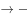研究生学历，肯定了或关系其中一项，无法得到确定结论，当选；

C项：翻译为七年以上工作经验研究生学历，否定了或关系其中一项，否一推一，可以推出，排除；

D项：翻译为研究生学历七年以上工作经验，否定了或关系其中一项，否一推一，可以推出，排除。

本题为选非题，故正确答案为B。

---

## 第 3 题　qid 2262040 · 语句表达

当前，乡村教师留不住是个大问题。对此，有人认为，只要大幅提升乡村教师待遇，就能让他们安心留下来，从而有效解决这一问题。
以下选项中无法削弱上述论断的是（  ）。

- **A**. 不是所有乡村教师都看重待遇
- **B**. 有的乡村教师收入很高
- **C**. 乡村教师收入普遍偏低　✅
- **D**. 不少乡村教师由于生活环境差而辞职

**答案**：C

**官方解析**

第一步：找到论点和论据。
论点：只要大幅提升乡村教师待遇，就能让他们安心留下来，从而有效解决这一问题。
论据：无
第二步：逐一分析选项。
A项：不是所有乡村教师都看重待遇，说明有的乡村老师不看重待遇，所以对于这部分教师，即使提高待遇，他们也不一定会安心留下来，可以削弱，排除；
B项：有的乡村教师收入本来就很高了，所以再提高待遇也不一定会让他们安心留下来，可以削弱，排除；
C项：乡村教师收入普遍偏低，现在提高了，就可能会让他们安心留下来，通过补充论据加强了论点，无法削弱，当选；
D项：不少乡村教师由于生活环境差而辞职，那就不是因为待遇不好而离职，所以即使提高待遇也不一定会让他们留下，可以削弱，排除。
本题为选非题，故正确答案为C。

---

## 第 4 题　qid 2262044 · 逻辑填空

近年来，我国快递行业飞速发展。但是，当前我国快递行业普遍存在服务同质化的问题。由于服务缺少特色，一旦某家快递公司涨价，消费者就会选择其他快递公司。
根据上述表述，下列判断一定正确的是（    ）。
Ⅰ.所有快递公司都存在服务同质化问题
Ⅱ.如果某家快递公司不涨价，消费者就不会选择其他快递公司
Ⅲ.如果消费者一直选择某家快递公司，那么这家快递公司一定没有涨价

- **A**. Ⅰ
- **B**. Ⅲ　✅
- **C**. Ⅰ、Ⅱ
- **D**. Ⅰ、Ⅲ

**答案**：B

**官方解析**

第一步：翻译题干。

快递公司涨价选择其他公司

第二步：逐一分析选项。

Ⅰ翻译为：快递公司服务同质化，题干说的快递行业普遍存在服务同质化，但是否所有快递公司都有服务同质化问题未涉及，该项推不出，排除；

Ⅱ翻译为：快递公司涨价选择其他公司，是对题干翻译的否前，否前得不到确定性的结论，排除；

Ⅲ翻译为：选择其他公司快递公司涨价，是对题干翻译的否后，否后必否前，可以推出。

故正确答案为B。

---

## 第 5 题　qid 2262051 · 语句表达

ETC是我国高速公路使用的不停车收费系统。事实上，所有需要停车缴费的场合，都可以借助ETC实现不停车缴费，而不仅限于在高速公路使用。
根据上述表述，下列判断一定错误的是（  ）。

- **A**. 高速公路是需要停车缴费的场合
- **B**. 有的高速公路无法借助ETC实现不停车缴费　✅
- **C**. 有的需要停车缴费的场合，可以借助ETC实现不停车缴费
- **D**. 能够借助ETC实现不停车缴费的场合，可能是需要停车缴费的场合

**答案**：B

**官方解析**

第一步：翻译题干。
需要停车缴费场合→借助ETC实现不停车收费
第二步：逐一分析选项。
A项：题干最后一句强调所有需要停车缴费的场合都可以借助ETC，不仅限于在高速公路使用，说明高速公路是需要停车缴费的场合，该项正确，排除；
B项：根据题干可知，所有高速公路都是需要停车缴费的场合，结合题干翻译可知，所有高速公路都可以借助ETC实现不停车缴费，与有的高速公路无法借助ETC实现不停车缴费矛盾，该项一定错误，当选；
C项：翻译为有的需要停车缴费的场合→借助ETC实现不停车收费，根据题干翻译，所有可以推出有的，该项正确，排除；
D项：是对题干翻译的肯后，肯后无必然结论，但可以推出可能性的结论，该项正确，排除。
本题为选非题，故正确答案为B。

---

## 第 6 题　qid 2262026 · 片段阅读

随着气候变化，严重干旱和极端高温现象变得越来越频繁。有研究预计，全球棉花产量将大幅下降，以棉花为主要原材料的纺织品价格会进一步上涨，因此服装的批发及零售价格也会大幅上涨。
以下无法削弱上述结论的是（  ）。

- **A**. 棉花作为纺织面料生产的原材料是可以替代的
- **B**. 目前已培育出在干旱条件下能保持产量的棉花新品种
- **C**. 我国用于生产服装的纺织品原料，部分依赖进口　✅
- **D**. 服装生产已经越来越多地使用化学合成纤维材料

**答案**：C

**官方解析**

第一步：找出论点和论据。
 论点：服装的批发及零售价格也会大幅上涨。
 论据：全球棉花产量将大幅下降，以棉花为主要原材料的纺织品价格会进一步上涨。
本题为削弱选非题，排除可以削弱的选项，选择剩下的选项即可。
 第二步：逐一分析选项。
 A项：该项说明可以找到其他原材料替代棉花，那么如果选用了其他原材料就不能通过棉花价格上涨来判断服装价格是否上涨，可以削弱，排除；
 B项：该项说明已培育出保持产量的新品种棉花，说明产量不会下降，可以削弱，排除；
 C项：该项指出我国生产服装的纺织品原料部分依赖进口，而论点说的是服装的批发及零售价格是否会上涨，话题不一致，无法削弱，当选；
 D项：该项说明服装生产中已经越来越多地使用化学合成纤维材料，那么服装生产对于棉花的依赖性随之减弱，也就不能通过棉花价格上涨来判断服装价格是否上涨，可以削弱，排除。
 本题为选非题，故正确答案为C。

---

## 第 7 题　qid 2262031 · 语句表达

调查发现，只有平均每天摄入超过5克钠的人，才会面临心血管疾病风险，在我国接受该调查的人群中，的人日均钠摄入量超过5克。

如果上述调查抽样有代表性，可以推出的是（  ）。

- **A**. 我国80%地区的人口面临着很高的心血管疾病风险
- **B**. 发展中国家的人口大都面临心血管疾病风险
- **C**. 如果某人日均钠摄入量不超过5克，他便不会面临心血管疾病风险　✅
- **D**. 如果某人日均钠摄入量超过5克，他一定会患心血管疾病

**答案**：C

**官方解析**

第一步：翻译题干。
面临心血管疾病风险→平均每天摄入超过5克钠
 第二步：逐一分析选项。
 A项：选项指出80%地区面临风险，题干讨论接受抽样人群中有80%人口人日均钠摄入量超过5克，讨论话题不一致，无法推出，排除；
 B项：题干中抽样调查的范围是中国，而选项中的范围是发展中国家，讨论范围不一致，无法推出，排除；
 C项：可翻译为：某人日均钠摄入量不超过5克→不会面临心血管疾病风险，对于题干翻译否后，根据否后必否前，可以推出，当选；
 D项：可翻译为：某人日均钠摄入量超过5克→会患心血管疾病，对于题干翻译肯后，肯后得不到确定结论，无法推出，排除。
 故正确答案为C。

---

## 第 8 题　qid 2262032 · 语句表达

某市城市规划设计院的一项调查显示，该市中心城区范围内的全部自行车道，被机动车停车占用，有效宽度不足。为了使自行车能够重新在当地中心城区范围内正常行驶，有人建议应当重新规划并加宽自行车道。

以下最无法质疑上述建议的是（  ）。

- **A**. 该市机动车停车难问题越来越严重
- **B**. 市民未能形成良好的停车习惯
- **C**. 对占用自行车道的机动车处罚不够
- **D**. 道路交通规划是一个长期的过程　✅

**答案**：D

**官方解析**

第一步：找出论点和论据。 论点：为了使自行车能够重新在当地中心城区范围内正常行驶，有人建议应当重新规划并加宽自行车道。 论据：某市城市规划设计院的一项调查显示，该市中心城区范围内的全部自行车道，被机动车停车占用，有效宽度不足。 第二步：逐一分析选项。 A项：该项指出该市机动车停车难问题越来越严重，所以即使重新规划了自行车道路，机动车还是没有停车的地方，还可能会去占用自行车道，自行车依然不能在当地中心城区范围内正常行驶，可以削弱，排除； B项：该项指出市民未能形成良好的停车习惯，所以即使重新规划道路，还是会出现因为习惯问题而占用车道的现象，自行车依然不能在当地中心城区范围内正常行驶，可以削弱，排除； C项：该项指出对占用自行车道的机动车处罚不够，违规成本低，从而放纵了占道行为；给出题干乱占道现象一个合理原因，所以应该加大对机动车占用自行车道行为的处罚力度，而不是直接改道或者重新规划，可以削弱，排除； D项：该项指出道路交通规划是一个长期的过程，说明规划需要的时间长，时间长短与题干讨论的自行车是否能够重新在当地中心城区范围内正常行驶无关，无法削弱，当选。 本题为选非题，故正确答案为D。

---

## 第 9 题　qid 2262030 · 语句表达

基因检测能够帮助人们了解自己基因的情况，预测某些疾病的患病风险。有价值的基因检测报告至少符合三项条件：生物学描述明确、基因与疾病的对应关系明确、针对性防治要点明确。
根据上述表述，下列判断一定正确的是（  ）。

- **A**. 针对性防治要点不明确的基因检测报告可能没有价值　✅
- **B**. 一份生物学描述不明确的基因检测报告可能是有价值的
- **C**. 符合上述三项条件的基因检测报告大部分都是有价值的
- **D**. 有的有价值的基因检测报告只符合上述三项条件中的两项

**答案**：A

**官方解析**

第一步：翻译题干。

有价值的基因检测报告生物学描述明确 且 基因与疾病的对应关系明确 且 针对性防治要点明确。

第二步：逐一分析选项。

A项：翻译为针对性防治要点明确可能价值，是对题干箭头后的否定，否后必否前，可以推出基因检测报告一定没有价值，一定可以推出可能，故基因检测报告可能没有价值可以推出，当选；

B项：翻译为生物学描述明确可能有价值，是对题干箭头后的否定，否后必否前，可以推出基因检测报告一定没有价值，故可能有价值无法推出，排除；

C项：翻译为符合上述三项条件大部分有价值，是对题干箭头后的肯定，肯后得不出必然结论，无法推出，排除；

D项：题干指出“有价值的基因检测报告至少符合三项条件”，但该项指出“有的有价值报告只符合上述三项条件中的两项”，与题干表述矛盾，无法推出，排除。

故正确答案为A。

---

## 第 10 题　qid 2262045 · 语句表达

生活不只包含眼前的苟且，它至少还包含诗和远方。
根据上述表述，下列判断一定正确的是（  ）。

- **A**. 生活只包含诗和远方
- **B**. 生活可能包含伦理和政治　✅
- **C**. 生活可能不包含眼前的苟且
- **D**. 生活只包含眼前的苟且和伦理

**答案**：B

**官方解析**

日常结论题，根据题干信息逐一分析选项。
A项：题干中生活至少还包含诗和远方，说明生活除了包含诗和远方还可能包含其他内容，该项说只包含诗和远方，表述错误，无法推出，排除； 
B项：题干中生活至少还包含诗和远方，说明生活除了包含诗和远方还可能包含其他内容，该项说生活可能包含伦理和政治，可以推出，当选；
C项：题干中生活不只包含眼前的苟且，说明生活一定包含眼前的苟且，而该项说生活可能不包含眼前的苟且，表述错误，无法推出，排除； 
D项：题干中生活不只包含眼前的苟且，它至少还包含诗和远方，说明生活除了包含眼前的苟且、诗和远方还可能包含其他内容，而该项说生活只包含眼前的苟且和伦理，表述错误，无法推出，排除。
故正确答案为B。

---

## 第 11 题　qid 2262019 · 语句表达

对企业而言，产品质量是其生存发展的关键。企业要加快发展，提升品质，需要的是更高水平的工人，涌现越来越多的大国工匠，传承工匠精神。因此，企业对于工匠精神的培养是其实现高质量发展的关键。
以下与上述论断结构最为相似的是（  ）。

- **A**. 生态环境保护离不开生态文明体系构建，所以要建设美丽中国，必须加快生态文明制度建设
- **B**. 创新发展必须以创新型人才为基础，创新成果是创造性劳动的结果。因此，创新发展都是创新型人才实现的
- **C**. 理论研究离不开严密的论证过程，严密的论证需要有普遍性和规律性的论点，所以，理论研究一般都有普遍性和规律性的论点　✅
- **D**. 人才培养离不开社会实践，大学生都要通过社会实践考核，所以只有通过社会实践考核的大学生才能毕业

**答案**：C

**官方解析**

第一步：分析题干推理形式。
①企业发展→质量；②提升品质（提升质量）→更高水平的工人、传承工匠精神，因此：③企业高质量发展→培养工匠精神。①和②可以递推成：企业发展→质量→更高水平的工人、传承工匠精神，属于①和②递推后，再肯前推肯后的形式。
第二步：逐一分析选项。
A项：生态环境保护→生态文明体系构建，所以：建设美丽中国→加快生态文明制度建设。题干条件无法递推，且结论中的建设美丽中国在条件中也没出现，与题干推理形式不同，排除； 
B项：①创新发展→创新型人才；②创新性劳动→创新成果，因此：③创新发展→创新型人才。题干条件无法递推，与题干推理结构不相似，排除； 
C项：①理论研究→严密的论证过程；②严密的论证→普遍性和规律性的论点，所以：③理论研究→普遍性和规律性的论点，①和②可以递推成：理论研究→严密的论证过程→普遍性和规律性的论点，属于①和②递推后，再肯前推肯后的形式，与题干推理结构相似，当选； 
D项：①人才培养→社会实践，②大学生→通过社会实践；所以：③毕业→通过社会实践。题干条件无法递推，且结论中的毕业在条件中也没出现，与题干推理结构不相似，排除。
故正确答案为C。

---

## 第 12 题　qid 2261988 · 逻辑填空

某单位组织员工进行爱心募捐，鼓励员工捐款捐物。所有员工都参加了，其中捐物的有45人，捐款的有75人，既捐款又捐物的有31人，则该单位共有员工（  ）人。

- **A**. 89　✅
- **B**. 90
- **C**. 95
- **D**. 99

**答案**：A

**官方解析**

根据两集合容斥原理公式A+B-A∩B=总数-都不，可得到关系：捐物+捐款-两种都捐=总人数-两种都不捐，由“所有员工都参加”可知两种都不捐的人数为0，代入数字：45+75-31=总人数，解得总人数=89人。
故正确答案为A。

---

## 第 13 题　qid 2261992 · 逻辑填空

某企业生产清洁机器人，9月至12月共生产3800台，第四季度每月生产900台，则该企业9月份生产（  ）台。

- **A**. 900
- **B**. 1100　✅
- **C**. 1300
- **D**. 1500

**答案**：B

**官方解析**

第四季度包括10、11、12月，每月生产900台，则10月至12月共生产：900×3=2700台，9月生产台数=9月至12月生产台数-10月至12月生产台数=3800-2700=1100台。
故正确答案为B。

---

## 第 14 题　qid 2261993 · 逻辑填空

某单位购买了30个文件袋，有大、中、小三个型号。已知大号文件袋和中号文件袋数量之比为5：6，中号文件袋和小号文件袋数量之比为3：2。那么，所购的小号文件袋有（    ）个。

- **A**. 4
- **B**. 6
- **C**. 8　✅
- **D**. 10

**答案**：C

**官方解析**

根据题干可得，大号文件袋：中号文件袋=5：6，中号文件袋：小号文件袋=3：2，根据中号文件袋数量不变可得，大号文件袋：中号文件袋：小号文件袋=5：6：4，则小号文件袋占总数比重为，故小号文件袋有个。

故正确答案为C。

---

## 第 15 题　qid 2261996 · 逻辑填空

某单位有若干个部门，每个部门有12名职员。后因业务重组，增加了2个部门，新增了4名职员，现每个部门有8名职员。该单位原有（  ）个部门。

- **A**. 3　✅
- **B**. 4
- **C**. 5
- **D**. 6

**答案**：A

**官方解析**

设该单位原有个部门，则原来共有名职员。根据题干可得，业务重组后增加了2个部门有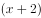个部门，新增了4名职员即总职员有人，由题意可得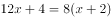，解得。

故正确答案为A。

---

## 第 16 题　qid 2262002 · 语句表达

某超市的食品供货商每2天送货一次，日用品供货商每5天送货一次，办公用品供货商每10天送货一次。已知这三家供货商在10月1日这天同时送货，那么下次他们同时送货的日期是（  ）。

- **A**. 10月10日
- **B**. 10月11日　✅
- **C**. 10月16日
- **D**. 10月20日

**答案**：B

**官方解析**

食品每2天送货一次，说明送货周期是2天；日用品每5天送货一次，说明周期是5天；办公用品每10天送货一次，说明周期是10天。根据题意，求下次同时送货日期，实际是求送货小周期的最小公倍数，2、5、10的最小公倍数是10，已知这三家供货商在10月1日这天同时送货，则下次同时送货时间是10月1日过10天，即10月11日。
故正确答案为B。

---

## 第 17 题　qid 2262007 · 逻辑填空

某公司38名员工一起去划船，共租了8条船，大船坐6人，小船坐4人，刚好坐满，则小船共有（    ）条。

- **A**. 5　✅
- **B**. 4
- **C**. 3
- **D**. 2

**答案**：A

**官方解析**

根据题意，设租小船x条，则租大船条，以员工共38人为等量关系列方程，，解得。

故正确答案为A。

---

## 第 18 题　qid 2262010 · 逻辑填空

一项考试共有35道试题，答对一题得2分，答错一题扣1分，不答则不得分。一名考生一共得了47分，那么，他最多答对（    ）题。

- **A**. 26
- **B**. 27　✅
- **C**. 29
- **D**. 30

**答案**：B

**官方解析**

方法一：设答对题，答错题，不答题，则有①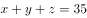、②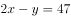，得，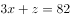，要使答对题数最多，即最大，则最小，当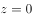时，无整数解；时，，符合题意。

方法二：设答对题，答错题，则有，不定方程用代入排除法，问最大，从最大的D项开始代入。

D项，，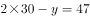，解得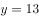，此时，矛盾，排除；

C项，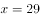，，解得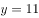，此时，矛盾，排除；

B项，，，解得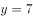，此时，不答的题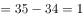，正确。

故正确答案为B。

---

## 第 19 题　qid 2261991 · 语句表达

，，，，（    ）

- **A**. 

- **B**. 
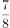

- **C**. 

　✅
- **D**. 

**答案**：C

**官方解析**

观察数列，全部为分数，优先考虑分数数列。原数列中第二项和第四项的分母破坏了数列的单调性，将其进行反约分，数列可转化为：、、、、（    ），发现分子、分母各自呈规律，均为公差为1的等差数列，故（    ）处应填。

故正确答案为C。

---

## 第 20 题　qid 2261998 · 逻辑填空

- **A**. 4
- **B**. 5　✅
- **C**. 8
- **D**. 10

**答案**：B

**官方解析**

题干出现图形，且每组中的大数不在同一位置，考虑凑相等。观察发现：

第一组：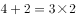；

第二组：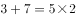；

第三组：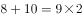；

故规律应为每组数中的前两项之和等于第三项的2倍，则第四组：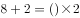，（    ）处应填5。

故正确答案为B。

---

## 第 21 题　qid 2262003 · 逻辑填空

-3，8，2，18，22，（    ）

- **A**. 43
- **B**. 58　✅
- **C**. 60
- **D**. 76

**答案**：B

**官方解析**

方法一：数列起伏不定，作差无规律，相邻两项作和后得到新数列：5，10，20，40，（    ）是公比为2的等比数列，则下一项为80，故题干所求为：；

方法二：数列起伏不定，作差无规律，也可考虑递推，可得第一项的2倍加上第二项等于第三项，即：。

故正确答案为B。

---

## 第 22 题　qid 2262008 · 逻辑填空

0.02，3.13，8.24，5.35，4.46，（  ）

- **A**. 5.57　✅
- **B**. 5.68
- **C**. 6.57
- **D**. 6.68

**答案**：A

**官方解析**

题干为小数数列，考虑机械划分。将已知项划分为三部分：整数部分，小数点后一位，小数点后两位。分析可知，小数点后一位为：0，1，2，3，4，（）；小数点后两位为：2，3，4，5，6，（），这两部分均是公差为1的等差数列，故所求项小数点后一位和小数点后两位分别为：5和7，排除BD项。整数部分起伏不定，作差无规律，考虑整数和小数部分合起来看。分析可知，小数部分相乘后的尾数为整数部分，即选项的整数部分为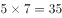的尾数5，故所求项结果为5.57，选A。

故正确答案为A。

---

## 第 23 题　qid 2262011 · 逻辑填空

如图所示的三个图形可以拼成的是（  ）。

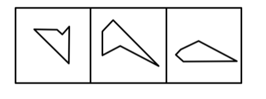

- **A**. 三角形　✅
- **B**. 梯形
- **C**. 正方形
- **D**. 菱形

**答案**：A

**官方解析**

本题考查平面拼合，可采用等长相消的方法进行拼合，题干给出图形在保持原有角度情况下无法拼出任何选项中的图形，所以可以将题干图形进行旋转。将图一顺时针旋转90°后与其他两图拼合，消去等长的线段后组合而成的外部轮廓为三角形，如下图所示：

故正确答案为A。

---

## 第 24 题　qid 2261983 · 逻辑填空

如图所示直角梯形，以它的上底为轴旋转360度，能够得到的立体图形是（  ）。

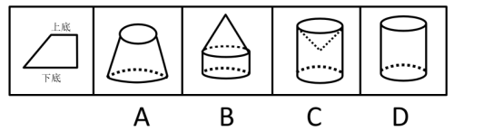

- **A**. A
- **B**. B
- **C**. C　✅
- **D**. D

**答案**：C

**官方解析**

以直角梯形的上底为轴，旋转360度，梯形的斜边转出了一个凹进去的圆锥，梯形的下底以上底为轴旋转360度后形成一个圆柱，故最终得到的立体图形为C项。 
故正确答案为C。

---

## 第 25 题　qid 2261990 · 逻辑填空

以下可由所给立体图形经过旋转得到的是（  ）。

- **A**. A
- **B**. B
- **C**. C　✅
- **D**. D

**答案**：C

**官方解析**

题干图形的中轴线有4个立方体，中轴线的两端的左右两侧各连接2个立方体。
A项：中轴线的一端连着的2个立方体分别位于两侧，无法由题干旋转得到，排除；
B项：中轴线上只有3个立方体，无法由题干旋转得到，排除；
C项：该项可以由立体图形旋转得出，当选；
D项：中轴线的两端连接的2个立方体在中轴线的同一侧，无法由题干旋转得到，排除。 
故正确答案为C。

---

## 第 26 题　qid 2261997 · 逻辑填空

以下符合所给三视图的立体图形是（  ）。

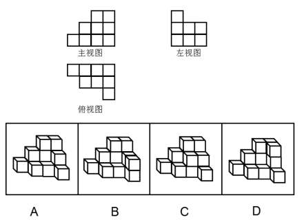

- **A**. A
- **B**. B　✅
- **C**. C
- **D**. D

**答案**：B

**官方解析**

本题考查三视图。

A项：从前往后看，可以看到题干中主视图，从左往右看，第三列只有一个矩形，如图所示，与题干所给的左视图不符，排除；

 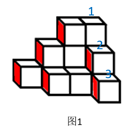

B项：符合题干所给的三视图，当选；

C项：从前往后看，可以看到题干主视图，从左往右看，第三列只有一个矩形，如图所示，与题干所给的左视图不符，排除；

 

D项：从前往后看，可以看到题干中主视图，从左往右看，第三列只有一个矩形，如图所示，与题干所给的左视图不符，排除。

 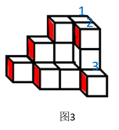

故正确答案为B。

---

## 第 27 题　qid 2262025 · 逻辑填空

左图是一个正四面体的外表面。右边不能由它折叠而成的是（  ）。

- **A**. A
- **B**. B　✅
- **C**. C
- **D**. D

**答案**：B

**官方解析**

本题考查四面体的空间重构。

A项，题干中涉及到的两个面的位置关系与展开图一致，排除；

B项，题干展开图中笑脸中眼睛是是对着三角形其中一个顶角的，B选项笑脸中眼睛指向了边，如下图所示，与展开图不一致，当选；

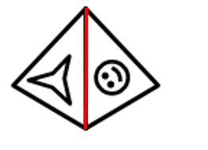

C项，题干中涉及到的两个面的位置关系与展开图一致，排除；

D项，题干中涉及到的两个面的位置关系与展开图一致，排除。

本题为选非题，故正确答案为B。

---

## 第 28 题　qid 2262029 · 逻辑填空

左图所示立体图形，可以由（  ）三个图形组成。

- **A**. ①②③
- **B**. ①②④　✅
- **C**. ①③④
- **D**. ②③④

**答案**：B

**官方解析**

本题考查立体拼合。

立体图可由①②④三个图形拼合而成，如下图所示：

故正确答案为B。

---

## 第 29 题　qid 2262034 · 逻辑填空

以下4张纸条中，沿折痕能够折出如左图所示图形的是（  ）。

- **A**. A
- **B**. B　✅
- **C**. C
- **D**. D

**答案**：B

**官方解析**

题干图形中，可见四个折痕，分别标为1234，如下图所示。

观察可知，折痕1和折痕2方向不同不平行，排除A、D两项。折痕3和折痕4方向不同不平行，排除C项。

故正确答案为B。 

---
