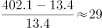
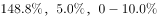
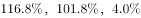
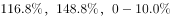
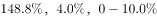

# 广西2019年定向招录选调生笔试

> 言语理解与表达 · 21 题 · 广西 2019

## 材料 1

请阅读以下资料，回答第46至50题。

资料1：2017年中国对美国主要进、出口商品（HS2位码）

资料2：美国对中国服务贸易进出口（亿美元）

资料3：中国对美国支付知识产权使用费（亿美元）

资料4：2017年中美部分关税税率对比

### 第 1 题　qid 2271383 · 逻辑填空

2007-2017年，美国对中国服务贸易年度顺差扩大了（  ）倍。

- **A**. 28
- **B**. 29　✅
- **C**. 30
- **D**. 31

**答案**：B

**官方解析**

2007年美国对中国服务贸易顺差为亿美元；2017年美国对中国服务贸易顺差为亿美元。故2007～2017年，美国对中国服务贸易年度顺差扩大了倍。

故正确答案为B。

---

### 第 2 题　qid 2271386 · 语句表达

2017年中国对美国支付知识产权使用费比2011年增长了（  ）。

- **A**. 

- **B**. 

　✅
- **C**. 

- **D**. 

**答案**：B

**官方解析**

由题干“2017年······比2011年增长了”，结合选项为，可判定本题为一般增长率计算问题。定位资料3可得，2017年中国对美国支付知识产权使用费为72.0亿美元，2011年中国对美国支付知识产权使用费为34.6亿美元。故2017年中国对美国支付知识产权使用费比2011年增长了。

故正确答案为B。

---

### 第 3 题　qid 2271388 · 语句表达

2017年中国对带壳花生、乳制品和货车征收的关税分别比美国相应的关税低（  ）。

- **A**. 

- **B**. 

- **C**. 

- **D**. 

　✅

**答案**：D

**官方解析**

定位资料4可得，中国对带壳花生的关税比美国低；中国对乳制品的关税比美国低；中国对货车的关税比美国低。

故正确答案为D。

---

### 第 4 题　qid 2271290 · 语句表达

伟大的中国人民抗日战争，开辟了世界反法西斯战争的东方主战场，为挽救民族危亡，实现民族独立和人民解放，为争取世界和平的伟大事业，做出了彪炳史册的贡献。
关于抗日战争，下列认识不正确的是（  ）。

- **A**. 九一八事变是中国人民抗日战争的起点
- **B**. 七七事变是中国人民抗日战争的起点　✅
- **C**. 抗日战争的伟大胜利，重新确立了中国在世界上的大国地位
- **D**. 抗日战争的伟大胜利，洗刷了近代以来中国抗击外来侵略屡战屡败的民族耻辱

**答案**：B

**官方解析**

本题考查毛中特。
A项正确，九一八事变是日本在中国东北蓄意制造并发动的一场侵华战争，是日本帝国主义侵华的开端。2017年1月3日，教育部基础教育二司发布《关于在中小学地方课程教材中全面落实“十四年抗战”概念的函》(教基二司函〔2017〕1号)。根据该函，中国抗日战争的起始时间，应从1931年九一八事变算起。
B项错误，七七事变（1937年7月7日—7月31日），又称卢沟桥事变，是日本全面侵华开始的标志，是中华民族进行全面抗战的起点，也象征第二次世界大战亚洲区域战事的起始。
C项正确，习近平总书记在纪念中国人民抗日战争暨世界反法西斯战争胜利70周年大会上的重要讲话中指出：“中国人民抗日战争胜利，这一伟大胜利，重新确立了中国在世界上的大国地位，使中国人民赢得了世界爱好和平人民的尊敬。”
D项正确，习近平总书记在纪念中国人民抗日战争暨世界反法西斯战争胜利70周年大会上的重要讲话中指出：“中国人民抗日战争胜利，是近代以来中国抗击外敌入侵的第一次完全胜利。这一伟大胜利，彻底粉碎了日本军国主义殖民奴役中国的图谋，洗刷了近代以来中国抗击外来侵略屡战屡败的民族耻辱。”
本题为选非题，故正确答案为B。

---

### 第 5 题　qid 2271298 · 片段阅读

今年是广西壮族自治区成立60周年。关于广西区情，下列说法不正确的是（  ）。

- **A**. 广西是我国人口最多的少数民族自治区
- **B**. 广西是我国成立最早的少数民族自治区　✅
- **C**. 广西是我国唯一沿海、沿边、沿江的少数民族自治区
- **D**. 邓小平领导的百色起义发生在广西

**答案**：B

**官方解析**

本题考查地理国情。
A项正确，我国人口最多的少数民族是壮族，主要分布的省区是广西壮族自治区。
B项错误，我国最早建立的少数民族自治区是1947年成立的内蒙古自治区。
C项正确，广西是我国唯一沿海、沿边、沿江的少数民族自治区。从东至西分别与广东、湖南、贵州、云南接壤，南临北部湾、面向东南亚，西南与越南毗邻，是西南地区最便捷的出海通道。
D项正确，邓小平领导百色起义是在1929年12月11日发生的一个历史事件，又称为“右江暴动”。由邓小平、贺昌、陈豪人、张云逸、韦拔群等同志在广西百色组织领导的武装起义，是中国共产党在广西少数民族地区实行“工农武装割据”的一次光辉实践。
本题为选非题，故正确答案为B。

---

### 第 6 题　qid 2271304 · 语句表达

成语是中华民族语言文化的精华，我们不仅能从中读到生动的故事，更能学到许多前人总结的为人处世、治学谋事的人生大智慧。
按故事发生时间的先后，下列成语排序正确的是（  ）。

- **A**. 约法三章  闻鸡起舞  三顾茅庐  徙木立信
- **B**. 约法三章  闻鸡起舞  徙木立信  三顾茅庐
- **C**. 约法三章  徙木立信  闻鸡起舞  三顾茅庐
- **D**. 徙木立信  约法三章  三顾茅庐  闻鸡起舞　✅

**答案**：D

**官方解析**

本题考查人文常识。
约法三章出自《史记·高祖本纪》：与父老约，法三章耳；杀人者死，伤人及盗抵罪。汉高祖刘邦率军攻入关中后，将关中父老、豪杰召集起来，约定三条法规，即杀人者要处死，伤人者要抵罪，盗窃者也要收到惩罚。指事先约好或明确规定的事。
闻鸡起舞出自《晋书·祖逖传》：传说东晋将领祖逖年轻时就很有抱负，每次和好友刘琨谈论时局，总是慷慨激昂，满怀义愤，为了报效国家，他们在半夜一听到鸡鸣，就披衣起床，拔剑练武，刻苦锻炼。原意为听到鸡啼就起来舞剑，后来比喻有志报国的人即时奋起。
三顾茅庐出自《三国志·蜀志·诸葛亮传》，东汉末年，汉朝宗亲左将军刘备三顾茅庐拜访诸葛亮，他们的谈话内容即《隆中对》。比喻真心诚意，一再邀请。
徙木立信出自《史记·卷六十八·商君列传》：孝公既用卫鞅，鞅欲变法，恐天下议己。令既具，未布，恐民之不信，已乃立三丈之木于国都市南门，募民有能徙置北门者予十金。民怪之，莫敢徙。复曰：“能徙者予五十金。”有一人徙之，辄予五十金，以明不欺。卒下令。战国时期秦孝公任用商鞅后，商鞅想要实施变法，担心得不到百姓信任，于是宣布如有人能将一根三丈高的木头从南门搬到北门，就奖励重金。后有人将木头搬到北门，商鞅果然兑现承诺。通过此举，商鞅赢得了百姓的信任，遂实施变法。后指通过某种手段树立典型，而使公众信服的行为。
按照夏、商、周、春秋战国、秦、汉、三国、魏晋南北朝、隋、唐、五代十国、宋、元、明、清的朝代顺序，成语正确排序为：徙木立信、约法三章、三顾茅庐、闻鸡起舞。
故正确答案为D。

---

### 第 7 题　qid 2271313 · 逻辑填空

“帝国主义和一切反动派都是纸老虎”，这句话使用的修辞手法是（  ）。

- **A**. 拟人
- **B**. 比喻　✅
- **C**. 夸张
- **D**. 排比

**答案**：B

**官方解析**

A项，“拟人”指把事物人格化的修辞方式。文中是把“帝国主义”和“反动派”看成“纸老虎”，没有体现拟人化，排除。
B项，“比喻”指打比方。文中是把“帝国主义”和“反动派”比喻成“纸老虎”，符合文意。
C项，“夸张”指是为了达到某种表达效果的需要，对事物的形象、特征、作用、程度等方面着意夸大或缩小的修辞方式。文中是把“帝国主义”和“反动派”看成“纸老虎”符合两者本质情况，没有体现夸大的意思，排除。
D项，“排比”指用一连串结构相似、内容密切相关、语气一致的句子或句子成分来表示意思，用以增强语势，使内容得到强调。与文意不符，排除。
故正确答案为B。
【出处】《毛泽东选集&lt;第四卷&gt;》

---

### 第 8 题　qid 2271314 · 片段阅读

诗词是中华文化的瑰宝。关于下列诗词名句的作者，说法不正确的是（  ）。

- **A**. “三十功名尘与土，八千里路云和月”，作者是岳飞
- **B**. “些小吾曹州县吏，一枝一叶总关情”，作者是郑板桥
- **C**. “人生自古谁无死，留取丹心照汗青”，作者是陆游　✅
- **D**. “天若有情天亦老，人间正道是沧桑”，作者是毛泽东

**答案**：C

**官方解析**

本题考查人文常识。
A项正确，“三十功名尘与土，八千里路云和月”出自岳飞的《满江红》，全诗抒发了作者想要报国立功的赤诚之心。
B项正确，“些小吾曹州县吏，一枝一叶总关情”出自郑板桥的《潍县署中画竹呈年伯包大中丞括》，表明为官者就要关心百姓的点点滴滴，一丝一缕，冷暖疾苦。
C项错误，“人生自古谁无死，留取丹心照汗青”出自文天祥的《过零丁洋》，全诗抒发了诗人的民族气节和舍生取义的生死观。
D项正确，“天若有情天亦老，人间正道是沧桑”出自毛泽东的《七律·人民解放军占领南京》。这是一首纪念南京解放、庆祝革命胜利的诗篇。诗人热情歌颂了人民解放军飞渡长江天堑，解放南京，改造黑暗旧社会的光辉史实。
本题为选非题，故正确答案为C。

---

### 第 9 题　qid 2271318 · 语句表达

《中华人民共和国国歌法》自2017年10月1日起施行。根据该法有关规定，下列做法正确的是（  ）。

- **A**. 某公司在其开业典礼上播放国歌
- **B**. 某歌手在文艺晚会上以说唱方式演唱国歌
- **C**. 某报社开展国歌宣传活动时请专家讲授国歌奏唱礼仪知识　✅
- **D**. 某学校在升国旗仪式上使用自己重新编曲录制的国歌版本

**答案**：C

**官方解析**

本题考查法律常识。
A项错误，根据《中华人民共和国国歌法》第八条规定：“国歌不得用于或者变相用于商标、商业广告，不得在私人丧事活动等不适宜的场合使用，不得作为公共场所的背景音乐等。”公司的开业典礼场合不适宜播放国歌。
B项错误，根据《中华人民共和国国歌法》第六条规定：“奏唱国歌，应当按照本法附件所载国歌的歌词和曲谱，不得采取有损国歌尊严的奏唱形式。”在文艺晚会上以说唱方式演唱国歌，未采用国歌标准演奏曲谱，说唱形式有损国歌尊严。
C项正确，根据《中华人民共和国国歌法》第十二条规定：“新闻媒体应当积极开展对国歌的宣传，普及国歌奏唱礼仪知识。”
D项错误，《中华人民共和国国歌法》第四条规定：“在下列场合，应当奏唱国歌：（四）升国旗仪式。”《中华人民共和国国歌法》第十条第一款规定：“在本法第四条规定的场合奏唱国歌，应当使用国歌标准演奏曲谱或者国歌官方录音版本。”举行升国旗仪式时，应当使用国歌官方录音版本奏唱国歌。
故正确答案为C。

---

### 第 10 题　qid 2271343 · 语句表达

国旗是国家的象征和标志，每个公民和组织都应当尊重和爱护国旗。根据《中华人民共和国国旗法》的有关规定，下列做法不正确的是（  ）。

- **A**. 某学校每周一举行升国旗仪式
- **B**. 某工厂在国庆节期间升挂国旗
- **C**. 某单位升挂了一面污损的国旗　✅
- **D**. 某县在举办壮族“三月三”传统节日活动期间升挂国旗

**答案**：C

**官方解析**

本题考查法律常识。
A项正确，《中华人民共和国国旗法》第十三条规定：“升挂国旗时，可以举行升旗仪式。举行升旗仪式时，在国旗升起的过程中，参加者应当面向国旗肃立致敬，并可以奏国歌或者唱国歌。全日制中学小学，除假期外，每周举行一次升旗仪式。”
B项正确，《中华人民共和国国旗法》第七条第一款规定：“国庆节、国际劳动节、元旦和春节，各级国家机关和各人民团体应当升挂国旗；企业事业组织，村民委员会、居民委员会，城镇居民院（楼）以及广场、公园等公共活动场所，有条件的可以升挂国旗。”
C项错误，《中华人民共和国国旗法》第十七条规定：“不得升挂破损、污损、褪色或者不合规格的国旗。”
D项正确，《中华人民共和国国旗法》第七条第三款规定：“民族自治地方在民族自治地方成立纪念日和主要传统民族节日，可以升挂国旗。”“三月三”是广西壮族自治区的传统民族节日，可以升挂国旗。
本题为选非题，故正确答案为C。

---

### 第 11 题　qid 2271319 · 片段阅读

《中华人民共和国物权法》规定，物权是指权利人依法对特定的物享有直接支配和排他的权利。下列行为不属于侵害物权的是（  ）。

- **A**. 王某未经同意长期占用丁某的私家车位
- **B**. 物业公司擅自出租业主共有的活动室
- **C**. 单身汉张某将单独继承获得的一套房子出售　✅
- **D**. 陈某未经妻子同意自行出售双方共有的一套房子

**答案**：C

**官方解析**

【《中华人民共和国民法典》自2021年1月1日起生效,《中华人民共和国物权法》等同时废止。我国自民法典生效之日起,物权法自动失效。故本题了解即可。】
本题考查法律常识。
A项正确，《中华人民共和国物权法》第六十四条规定：“私人对其合法的收入、房屋、生活用品、生产工具、原材料等不动产和动产享有所有权。”《中华人民共和国物权法》第三十四条规定：“无权占有不动产或者动产的，权利人可以请求返还原物。”王某未经同意，长期占用丁某的私家车位，侵害了丁某的物权。
B项正确，《中华人民共和国物权法》第七十条规定：“业主对建筑物内的住宅、经营性用房等专有部分享有所有权，对专有部分以外的共有部分享有共有和共同管理的权利。”物业公司擅自出租业主共有活动室，侵害了业主共有和共同管理的权利。
C项错误，《中华人民共和国物权法》第二十九条规定：“因继承或者受遗赠取得物权的，自继承或者受遗赠开始时发生效力。”张某获得了房子的物权，可以自行支配，并未侵害物权。
D项正确，《中华人民共和国物权法》第九十五条规定：“共同共有人对共有的不动产或者动产共同享有所有权。”陈某未经妻子同意自行出售双方共有的不动产，侵害了妻子对房屋的所有权。
本题为选非题，故正确答案为C。

---

### 第 12 题　qid 2271320 · 语句表达

我们党历来高度重视党风廉政建设和反腐败斗争，特别是党的十八大以来，坚持反腐败无禁区、全覆盖、零容忍，坚定不移“打虎”“拍蝇”“猎孤”，不敢腐的目标初步实现，不能腐的笼子越扎越牢，不想腐的堤坝正在构筑，反腐败斗争压倒性态势已经形成并巩固发展。
根据有关规定，下列行为不属于违纪违法的是（  ）。

- **A**. 某镇长用公车送孩子上学
- **B**. 某国有企业董事长用公款支付打高尔夫球费用
- **C**. 某局长自费在大排档宴请远道而来的同学　✅
- **D**. 某村干部利用职权给不符合条件的亲戚发放救济款

**答案**：C

**官方解析**

本题考查政治常识。
A项正确，公车私用是典型的违反中央八项规定精神的行为。
B项正确，用公款安排旅游、健身和高消费娱乐活动是典型的违反中央八项规定精神的行为。
C项错误，自费在大排档宴请同学，既没有铺张浪费，也没有违规用公款消费，不属于违纪违法。
D项正确，利用职权在社会保障、政策扶持、救灾救济款物分配等事项中优亲厚友是典型的违反中央八项规定精神的行为。
本题为选非题，故正确答案为C。

---

### 第 13 题　qid 2271321 · 片段阅读

“每个人都有理想和追求，都有自己的梦想。现在，大家都在讨论中国梦，我以为，实现中华民族伟大复兴，就是中华民族近代以来最伟大的梦想。这个梦想，凝聚了几代中国人的夙愿，体现了中华民族和中国人民的整体利益，是每一个中华儿女的共同期盼。”
这段话的主旨是（  ）。

- **A**. 每个人都有理想和追求，都有自己的梦想
- **B**. 每个国家、每个民族都有自己的梦想
- **C**. 中国梦体现了中华民族和中国人民的整体利益
- **D**. 实现中华民族伟大复兴是中华民族近代以来最伟大的梦想　✅

**答案**：D

**官方解析**

第文段首先由“自己的梦”提到“中国梦”，接着强调“中国梦”的观点，即“实现中华民族伟大复兴，就是中华民族近代以来最伟大的梦想”，最后是对这个梦的解释说明。可知，整个文段主要讲实现中华民族伟大复兴是中华民族近代以来最伟大的梦想。对应答案D。
A项，“自己的梦”是为了引出“中国梦”话题，非重点，排除。
B项，文段主要强调“中国梦”，而不是“每个国家、每个民族”的梦想，排除。
C项，“中国梦体现了中华民族和中国人民的整体利益”这是“中国梦”的内容之一，作为主旨内容表述不全面，排除。
故正确答案为D。
【出处】人民网《习近平历次讲话，都讲了什么》

---

### 第 14 题　qid 2271324 · 语句表达

创新、协调、绿色、开放、共享的发展理念，是党中央在深刻总结国内外发展经验教训，深入分析国内外发展大势的基础上提出的，是我国经济实现由大到强的根本遵循。
下列做法与上述发展理念相悖的是（  ）。

- **A**. 某县大力推进教育均衡化
- **B**. 某县设立侨胞产业园
- **C**. 某市出台政策鼓励发展文化创意产业
- **D**. 某市在国家级自然保护区核心区内进行房地产开发　✅

**答案**：D

**官方解析**

本题考查政治常识。
A项正确，党的十八届五中全会强调要坚持共享发展，提高教育质量，推动义务教育均衡发展，普及高中阶段教育。
B项正确，党的十八届五中全会强调要坚持开放发展，奉行互利共赢的开放战略，开创对外开放新局面，完善对外开放战略布局，形成对外开放新体制，推进“一带一路”建设。设立侨胞产业园，鼓励侨胞创业投资，符合开放发展的理念。
C项正确，党的十八届五中全会强调要坚持创新发展，推动大众创业、万众创新，释放新需求，创造新供给，推动新技术、新产业、新业态蓬勃发展。
D项错误，党的十八届五中全会强调要坚持绿色发展，必须坚持节约资源和保护环境的基本国策，坚持可持续发展，坚定走生产发展、生活富裕、生态良好的文明发展道路，加快建设资源节约型、环境友好型社会，形成人与自然和谐发展现代化建设新格局，推进美丽中国建设，为全球生态安全作出新贡献。在国家级自然保护区核心区内进行房地产开发是严重破坏自然生态的行为，与绿色发展理念相悖。
本题为选非题，故正确答案为D。

---

### 第 15 题　qid 2271344 · 片段阅读

相比于事实真相，网络谣言所携带的夺目标题和骇人内容往往更吸引用户关注。在信息噪音和谣言杂音中，辟谣声音要直抵用户化解谬误，不仅要比拼分贝高低，更考验精准与否，需要提升技术水准、讲求传播策略，对谣言套路见招拆招，对杜撰内容抽丝剥茧，让科学声音盖过愚昧观点，令理性分析替代主观臆测。目前，针对时下热转谣言，人民网“求真”栏目等网络平台纷纷盘点梳理典型谣言，拆解谣言套路伎俩，让辟谣更加及时有力、精准到位，协力筑牢“防火墙”，共同营造良好网络生态。
这段话的主要观点是（  ）。

- **A**. 网络谣言难治理
- **B**. 网络治谣重在精准到位　✅
- **C**. 网络谣言呈现新套路、新伎俩
- **D**. 网络谣言的夺目标题和骇人内容更吸引用户关注

**答案**：B

**官方解析**

文段首先提到网络谣言的话题，接着提到辟谣精准与否，需要讲求水准、策略、理性分析等。最后举例说明，针对时下谣言，人民网“求真”栏目等网络平台辟谣及时有力、精准到位。可知整个文段主要讲网络治谣重在精准到位，对应B项。
A项，“谣言难治理”文段没有具体体现，非重点，排除。
C项，“谣言呈现新套路、新伎俩”，是为了强调治谣重在精准到位，非重点，排除。
D项，“谣言的夺目标题和骇人内容更吸引用户关注”是为引出辟谣的话题，非重点，排除。
故正确答案为B。
【出处】人民网《网络治谣重在精准到位》

---

### 第 16 题　qid 2271346 · 片段阅读

中华民族自古以来就重视家庭、重视亲情。家和万事兴、天伦之乐、尊老爱幼、贤妻良母、相夫教子、勤俭持家等，都体现了中国人的这种观念。“慈母手中线，游子身上衣，临行密密缝，意恐迟迟归，谁言寸草心，报得三春晖。”唐代诗人孟郊的这首《游子吟》，生动表达了中国人深厚的家庭情结。
下列选项中，对这段文字内容概括最恰当的是（  ）。

- **A**. 孝老爱亲是中华民族的传统美德
- **B**. 重视家庭和亲情是中华民族的传统　✅
- **C**. 家庭不只是人们身体的住处，更是人们心灵的归宿
- **D**. 领导干部的家风，不仅关系自己的家庭，而且关系党风政风

**答案**：B

**官方解析**

文段首先提出观点：中华民族自古以来就重视家庭、重视亲情。接着以家和万事兴、天伦之乐、尊老爱幼、贤妻良母、相夫教子、勤俭持家和《游子吟》进一步举例说明。因此整个文段主要讲中华民族重视家庭、重视亲情，对应B项。
A项，“孝老爱亲”文段没有具体体现，文段主要强调“重视家庭、重视亲情”，非重点，排除。
C项，文段强调的内容不是停留在“家庭”层面，而是对“家庭”的重视，非重点，排除。
D项，“领导干部的家风”“党风政风”文段没有具体体现，文段主要强调“重视家庭、重视亲情”，无中生有，排除。
故正确答案为B。
【出处】中华网《习近平画出的最美同心圆》

---

### 第 17 题　qid 2271348 · 语句表达

扶贫先扶智，让贫困地区的孩子接受良好教育，是扶贫开发的重要任务，也是阻断贫困代际传递的重要途径。
上述观点最恰当的前提是（  ）。

- **A**. 贫困地区与非贫困地区教育发展不均衡
- **B**. 贫困代际传递导致教育落后
- **C**. 扶贫工作难，扶智工作更难
- **D**. 知识改变命运，教育成就未来　✅

**答案**：D

**官方解析**

第一步：找出论点和论据。
论点：扶贫先扶智。
论据：让贫困地区的孩子们接受良好教育，是扶贫开发的重要任务，也是阻断贫困代际传递的重要途径。
第二步：逐一分析选项。
A项：贫困地区与非贫困地区教育发展不均衡，说明贫困与教育发展有关，但具体是贫困影响教育还是教育影响贫困不明确，无法加强，排除；
B项：贫困代际传递导致教育落后，该项是在讨论贫困的代际传递会导致什么样的后果，而论点讨论的是解决代际传递的办法，所以话题不一致，无法加强，排除
C项：该项讨论的是扶智工作比扶贫工作更难，没有提到教育能否阻断贫困的代际传递，无关项，无法加强，排除；
D项：如果知识不能够改变命运，教育不能成就未来，那么教育就不可以让人不贫困，变得富有，补充必要条件，可以加强，当选。
故正确答案为D。

---

### 第 18 题　qid 2271354 · 语句表达

某家庭有四个姐妹，年龄各不相同，关于谁大谁小她们各有说法。
梦梅说：“梦华比梦红年龄小。”
梦华说：“我比梦梅小。”
梦红说：“梦华不是三女儿。”
梦兰说：“我是长女。”
事实上，小妹和二姐说的是真话，其他两个姐妹说的是假话。
据此推断，四姐妹年龄大小的正确排序是（  ）。

- **A**. 长女梦华、二女儿梦梅、三女儿梦红、小妹梦兰
- **B**. 长女梦红、二女儿梦兰、三女儿梦华、小妹梦梅
- **C**. 长女梦梅、二女儿梦华、三女儿梦兰、小妹梦红　✅
- **D**. 长女梦兰、二女儿梦红、三女儿梦梅、小妹梦华

**答案**：C

**官方解析**

第一步：分析题干。

（1）梦梅：梦华梦红；

（2）梦华：梦华梦梅；

（3）梦红：梦华不是三女儿；

（4）梦兰：梦兰是长女；

（5）小妹和二姐说的是真话，其他两个姐妹说的是假话。

第二步：根据题干条件分析选项。

根据题干确定信息（5）小妹和二姐说的是真话，其他两个姐妹说的是假话，题干条件信息充分，可以代入排除。

代入A项，二女儿为梦梅，“梦华比梦红年龄小”为假，不符合条件（5），排除；

代入B项，二女儿为梦兰，“我是长女”为假，不符合条件（5），排除；

代入C项，二女儿为梦华，“我比梦梅小”为真，小妹为梦红，“梦华不是三女儿”为真，代入条件（1）和条件（4）可知，大女儿和三女儿的话为假，符合小妹和二姐说的是真话，其他两个姐妹说的是假话，当选；

代入D项，二女儿为梦红，“梦华不是三女儿”为真，小妹为梦华，“我比梦梅小”为真，长女为梦兰，“我是长女”为真，不符合只有小妹和二姐说的是真话，排除。

故正确答案为C。

---

### 第 19 题　qid 2271363 · 逻辑填空

上级环保督察组在某县检查时，发现该县辖区内有多家小冶炼厂存在严重的环境污染问题，并严肃地提出了整改要求。为落实督察组的整改要求，该县采取了一系列措施，其中包括：
①出台政策淘汰落后产能，推动企业转型升级
②对辖区内污染企业开展地毯式排查
③立即召开紧急会议研究处置措施
④组织人员赶赴现场调查处理
落实上述措施的先后顺序应该是（  ）。

- **A**. ③④②①　✅
- **B**. ③①④②
- **C**. ④①③②
- **D**. ②④③①

**答案**：A

**官方解析**

本题考查地理国情。
①出台政策淘汰落后产能，推动企业转型升级，淘汰落后产能是为了预防之后发生同样的环境事故，政策的出台需要经过调研、制定和审核的程序，其顺序应排在最后面。
②对辖区内污染企业开展地毯式排查，对辖区企业的排查应该是在督查组对该冶炼厂的环境污染问题进行调研处理之后，不是迫在眉睫需要立马处理的问题，顺序应该在中间。
③和④两项，立即召开紧急会议应该排在最前面，紧急会议的召开可以为现场的调查进行人员分工安排，对于如何处置，是否需要其他部门的协助做好提前布置准备工作，之后再组织人员赶赴现场进行调查。
综上，上述措施的正确步骤应该是召开紧急会议——现场调查处理——辖区污染企业的排查——出台政策进行落实和预防，正确顺序为③④②①。
故正确答案为A。

---

### 第 20 题　qid 2271365 · 语句表达

某市市委书记甲、市长乙、副市长丙共同出席大会并在主席台就坐。按照会议座位排序规范，下列座次正确的是（  ）。

- **A**. 甲坐中间，乙坐甲的左侧，丙坐甲的右侧　✅
- **B**. 甲坐中间，乙坐甲的右侧，丙坐甲的左侧
- **C**. 乙坐中间，甲坐乙的右侧，丙坐乙的左侧
- **D**. 乙坐中间，甲坐乙的左侧，丙坐乙的右侧

**答案**：A

**官方解析**

本题考查人文常识。

A项正确，会议座位排序规范：首先是前高后低，其次是中央高于两侧，最后是左高右低（会议座位惯例）。在主席台并列就座时，中国惯例以左为尊，即：左为上，右为下。三人职务排序为：，故甲坐中间，乙坐甲的左侧，丙坐甲的右侧。

B项错误，三人职务排序为：。中国惯例以左为尊，应当甲坐中间，乙坐甲的左侧，丙坐甲的右侧。

C项错误，会议座位排序规范：首先是前高后低，其次是中央高于两侧，最后是左高右低。甲职务最高，应当坐中间。

D项错误，会议座位排序规范：首先是前高后低，其次是中央高于两侧，最后是左高右低。甲职务最高，应当坐中间。

故正确答案为A。

---

### 第 21 题　qid 2271366 · 语句表达

握手是人际交往中十分常见的礼仪。下列符合握手礼仪的是（  ）。

- **A**. 戴着手套握手
- **B**. 男士见到女士主动先伸手
- **C**. 男士见到女士等女士先伸手　✅
- **D**. 见到上级领导主动先伸手

**答案**：C

**官方解析**

本题考查人文常识。
A项错误，和长辈及年长的人握手，不论男女都要起身趋前握手，并要脱下手套以示尊敬；男子握手时要脱帽，摘掉手套，戴手套相握；与男子握手，女子可不摘手套。
B项错误，按照握手礼仪，男女之间握手，男士要等女士先伸手后才握手；如果女士没有握手的意思，男方可改用点头礼表示礼貌。
C项正确，按照握手礼仪，男女之间握手，男士要等女士先伸手后才握手；如果女士没有握手的意思，男方可改用点头礼表示礼貌。
D项错误，按照握手礼仪，上下级之间握手，下级要等上级先伸手。
故正确答案为C。

---
