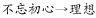
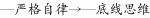

# 河北省2019年度定向招录选调生考试《基本素质和能力测试》题

> 言语理解与表达 · 21 题 · 河北 2019

## 第 1 题　qid 2343330 · 逻辑填空

坚决惩治和有效预防腐败，关系人心向背和党的生死存亡，是重大政治任务。

- （选项）[]

**答案**：A

**官方解析**

本题主要考查政治知识。
2011年7月1日，在庆祝中国共产党成立90周年大会上，胡锦涛同志发表重要讲话：90年来党的发展历程告诉我们，坚决惩治和有效预防腐败，关系人心向背和党的生死存亡，是党必须始终抓好的重大政治任务。
故题干表述正确。

---

## 第 2 题　qid 2343337 · 逻辑填空

党的纪律包括政治纪律、组织纪律、廉洁纪律、群众纪律、工作纪律和生活纪律。

- （选项）[]

**答案**：A

**官方解析**

本题主要考查政治知识。
根据《中国共产党章程》第四十条的规定，党的纪律主要包括政治纪律、组织纪律、廉洁纪律、群众纪律、工作纪律、生活纪律。
故题干表述正确。

---

## 第 3 题　qid 2343338 · 逻辑填空

雾霾，顾名思义是雾和霾，加重雾霾天气污染的罪魁祸首是PM2.5。

- （选项）[]

**答案**：B

**官方解析**

本题主要考查科技常识。
雾霾，是雾和霾的组合词。空气中的灰尘、硫酸、硝酸等颗粒物组成的气溶胶系统造成视觉障碍的叫霾；雾是由大量悬浮在近地面空气中的微小水滴或冰晶组成的气溶胶系统。
二氧化硫、氮氧化物以及可吸入颗粒物这三项是雾霾的主要组成部分，前两者为气态污染物，最后一项颗粒物才是加重雾霾天气污染的罪魁祸首。可吸入颗粒物，通常是指粒径在10微米以下的颗粒物，又称PM10。而PM2.5指环境空气中空气动力学当量直径小于等于 2.5微米的颗粒物。因此题干的说法将定义范围缩小了。
故题干表述错误。

---

## 第 4 题　qid 2343342 · 逻辑填空

党的作风建设主要包括思想作风、学风、工作作风、领导作风和干部生活作风建设。

- （选项）[]

**答案**：A

**官方解析**

本题主要考查政治常识。
党的作风是党的形象，是观察党群干群关系、人心向背的晴雨表。党的作风建设主要包括思想作风、学风、工作作风、领导作风、干部生活作风。作风建设的核心是保持党同人民群众的血肉联系，是以人民为中心价值取向对党自身提出的道德要求。
故题干表述正确。

---

## 第 5 题　qid 2343344 · 片段阅读

公务员因工作需要在机关外兼职，应当经有关机关批准，可以领取兼职报酬。

- （选项）[]

**答案**：B

**官方解析**

本题主要考查法律常识。
《公务员法》第四十四条规定：“公务员因工作需要在机关外兼职，应当经有关机关批准，并不得领取兼职报酬。”因此“可以领取兼职报酬”的说法是错误的。
故题干表述错误。

---

## 第 6 题　qid 2343346 · 逻辑填空

公务员因违纪违法受到的处分分为：警告、记过、记大过、降级、撤职、开除。

- （选项）[]

**答案**：A

**官方解析**

本题主要考查法律常识。
《公务员法》第六十二条规定：“处分分为：警告、记过、记大过、降级、撤职、开除。”
故题干表述正确。

---

## 第 7 题　qid 2343369 · 片段阅读

一个国家在一定时期内所生产的最终产品（包括产品和劳务）的市场价值的总和，称为该国的                。

- **A**. 国内生产总值（GDP）　✅
- **B**. 国民生产总值（GNP）
- **C**. 国内生产净值（NDP）
- **D**. 国民生产净值（NNP）

**答案**：A

**官方解析**

本题考查经济常识。

A项正确，国内生产总值（GDP）是指在一定时期内（一年或核算期），一个国家或地区的经济中所生产出的全部最终产品和劳务的价值，常被认为是衡量国家经济状况的最佳指标。

B项错误，国民生产总值（GNP）是指某国国民所拥有的全部生产要素在一定时期内所生产的最终产品的市场价值。

C项错误，国内生产净值（NDP）是指一个国家（或地区）所有常住单位在一定时期（通常为一年）内运用生产要素净生产的全部最终产品（包括物品和劳务）的市场价值，。

D项错误，国民生产净值（NNP）是指一个国家的全部国民在一定时期内，国民经济各部门生产的最终产品和劳务价值的净值，它等于。

故正确答案为A。

---

## 第 8 题　qid 2343371 · 逻辑填空

建设现代化经济体系，必须把发展经济的着力点放在                上，把提高供给体系质量作为主攻方向，显著增强我国经济质量优势。

- **A**. 实体经济　✅
- **B**. 共享经济
- **C**. 国有经济
- **D**. 国民经济

**答案**：A

**官方解析**

本题考查政治常识。
党的十九大报告指出：“建设现代化经济体系，必须把发展经济的着力点放在实体经济上，把提高供给体系质量作为主攻方向，显著增强我国经济质量优势。”
故正确答案为A。

---

## 第 9 题　qid 2343388 · 片段阅读

在平山县西柏坡村，毛泽东和他的战友们组织、指挥了震惊中外的                         三大战役，谱写了中国革命史上的辉煌篇章。

- **A**. 辽沈、中原、平津
- **B**. 辽沈、淮海、平津　✅
- **C**. 辽沈，渡江、平津
- **D**. 辽沈、黄海、平津

**答案**：B

**官方解析**

本题考查毛中特。三大战役是指1948年9月至1949年1月，中国人民解放军同中华民国国军进行的战略决战，包括辽沈战役、淮海战役、平津战役三个战略性战役。
A项错误，中原大战是指1930年（民国十九年）5月至10月，蒋介石与阎锡山、冯玉祥、李宗仁等在河南、山东、安徽等省发生的一场新军阀混战，又称蒋冯阎战争、蒋冯阎李战争，因为这次战争主要在中原地区进行，所以又称为“中原大战”。
B项正确，辽沈战役1948年9月12日开始，同年11月2日结束，共历时52天。战役结束后，中国人民解放军首次在兵力数量方面超越国民党军。淮海战役于1948年11月6日开始，1949年1月10日结束，是三大战役中解放军牺牲最重，歼敌数量最多，政治影响最大、战争样式最复杂的战役。平津战役发生在解放战争时期1948年11月29日至1949年1月31日。三大战役的胜利，奠定了人民解放战争在全国胜利的基础。
C项错误，渡江战役是指1949年4月21-23日，人民解放军横渡长江。1948年9月-1949年1月，人民解放军取得了解放战争中三大战役的胜利，国民党主力基本被消灭，全面胜利的曙光初现。1949年1月21日，蒋介石被迫下野，回到老家奉化溪口遥控局势，从此再也没能踏上南京这片土地。4月20日，国民党代总统李宗仁告知拒绝在国共和平谈判八项条件上签字，和平谈判宣告破裂。4月21日，毛泽东、朱德致电渡江前线指挥中心，立刻发动渡江战役，国民党的长江防线顷刻间土崩瓦解，4月23日，人民解放军登上“总统府”大楼，撤下象征国民党统治的青天白日满地红旗，宣告南京解放！
D项错误，黄海战役是指中日甲午战争中，日本联合舰队与我国北洋舰队的一次大海战。海战发生在中国黄海北部海面大东沟口外，亦称“大东沟之役”。
故正确答案为B。

---

## 第 10 题　qid 2343397 · 片段阅读

某市市政公司为安装管道，在街道上挖掘坑道，并于坑道两侧设置了障碍物和夜间警示灯。某夜，司机甲酒后驾车，撞毁了障碍物和夜间警示灯后逃逸。随后骑自行车经过的乙摔入坑道中，造成粉碎性腿骨骨折，乙的赔偿责任由谁承担？

- **A**. 乙自己承担
- **B**. 司机甲承担
- **C**. 市政公司承担　✅
- **D**. 市政公司和甲共同承担

**答案**：C

**官方解析**

本题考查民法常识。
根据《侵权责任法》第九十一条规定：“在公共场所或者道路上挖坑、修缮安装地下设施等，没有设置明显标志和采取安全设施造成他人损害的，施工人应当承担侵权责任。地下设施造成他人损害的，管理人不能证明尽到管理职责的，应当承担侵权责任。”在公共场所或者道路上施工，应当设置明显标志和采取安全措施，包括以下几个方面的内容：1、设置的警示标志必须具有明显性；2、施工人要保证警示标志的稳固并负责对其进行维护，使警示标志持续地存在于施工期间；3、施工人还应当采取其他有效的安全措施。本题中虽然市政公司在挖掘的坑道两侧设置了障碍物和夜间警示灯，但是被甲撞坏后，并没有及时进行修复和维修，从而致使他人发生伤亡，所以乙的损失应当由市政公司承担侵权责任。所以C项正确，ABD项错误。
故正确答案为C。

---

## 第 11 题　qid 2343403 · 片段阅读

古人用“父母教，须敬听；父母责，须顺承”来劝谕人们要尊敬父母，这句话出自：

- **A**. 《弟子规》　✅
- **B**. 《三字经》
- **C**. 《千字文》
- **D**. 《百家姓》

**答案**：A

**官方解析**

本题考查人文常识。
“父母教，须敬听；父母责，须顺承”这句话出自《弟子规·入则孝》，意思是对父母的教诲，要恭敬地聆听；对父母的责备，要顺从地接受。
故正确答案为A。

---

## 第 12 题　qid 2343407 · 片段阅读

国家公职人员如果没有底线思维，就不能做到严格自律。而只有不忘初心，才能始终保持底线思维。也只有始终坚守理想，才能不忘初心。根据以上信息可以得出：

- **A**. 如果不能做到严格自律，就会丧失底线思维
- **B**. 公职人员只有不忘初心，才能做到严格自律　✅
- **C**. 只有始终坚守理想信念，才能做到严格自律
- **D**. 公职人员只要不忘初心，就能做到严格自律

**答案**：B

**官方解析**

第一步：翻译题干。

①

②

③

将①逆否和②③可以递推出④：

第二步：逐一分析选项。

A项翻译：，肯定条件①的后件无法得到确定性结论，排除；

B项翻译：，通过④可以递推出，当选；

C项翻译：，通过④只能推出，未提及信念，且文段的翻译都是针对国家公职人员这一主体展开，而C项未提及，因此C项有瑕疵，没有B项好，排除；

D项翻译：，通过④可以递推出，肯定后件无法得出肯定性结论，排除。

故正确答案为B。

---

## 第 13 题　qid 2343408 · 逻辑填空

是我们党的优良传统和作风，是我们党保持同人民群众血肉联系的一个重要法宝。

- **A**. 艰苦奋斗　✅
- **B**. 联系群众
- **C**. 服务人民
- **D**. 勤俭节约

**答案**：A

**官方解析**

本题考查政治常识。
胡锦涛同志在《坚持发扬艰苦奋斗的优良作风　努力实现全面建设小康社会的宏伟目标》中指出：“艰苦奋斗作为我们党的优良传统和作风，作为我们马克思主义政党的政治本色，是凝聚党心民心、激励全党和全体人民为实现国家富强、民族振兴共同奋斗的强大精神力量，是我们党保持同人民群众血肉联系的一个重要法宝。”
故正确答案为A。

---

## 第 14 题　qid 2343410 · 逻辑填空

食用含碘食盐可满足人体对碘的摄取，人们平时使用的食盐一般是含碘食盐。我们对含碘食盐要密封保存，因为碘具有            。

- **A**. 易潮性　✅
- **B**. 挥发性
- **C**. 吸味性
- **D**. 还原性

**答案**：A

**官方解析**

本题考查科技常识。食盐中加的碘是以碘酸钾的形式存在的。
A项正确，易潮性是指物体吸收水蒸气而引起自身理化性质发生改变的特性。碘酸钾遇潮或者遇热都会分解成碘化钾，碘化钾受热会被氧化成碘。
B项错误，挥发性是指化合物由固体或液体变为气体或蒸汽的过程。碘酸钾是离子晶体，沸点高，不具挥发性，所以炒菜时不必强调在出锅前或食用时才加盐。
C项错误，吸味性是指物体存放在有异味的环境中时，有吸收异味的特性。
D项错误，还原性是指在化学反应中原子、分子或离子失去电子的能力。物质含有的粒子失电子能力越强，物质本身的还原性就越强；反之越弱，而其还原性就越弱。碘酸钾是一种较强的氧化剂，具有氧化性。
故正确答案为A。

---

## 第 15 题　qid 2343424 · 片段阅读

必须坚持党员个人服从党的组织，少数服从多数，下级组织服从上级组织，全党各个组织和全体党员服从党的全国代表大会和中央委员会，核心是：

- **A**. 党员个人服从党的组织
- **B**. 少数服从多数
- **C**. 下级组织服从上级组织
- **D**. 全党各个组织和全体党员服从党的全国代表大会和中央委员会　✅

**答案**：D

**官方解析**

本题考查政治常识。
《关于新形势下党内政治生活的若干准则》第三部分“坚决维护党中央权威”中指出：“坚决维护党中央权威、保证全党令行禁止，是党和国家前途命运所系，是全国各族人民根本利益所在，也是加强和规范党内政治生活的重要目的。必须坚持党员个人服从党的组织，少数服从多数，下级组织服从上级组织，全党各个组织和全体党员服从党的全国代表大会和中央委员会，核心是全党各个组织和全体党员服从党的全国代表大会和中央委员会。”
故正确答案为D。

---

## 第 16 题　qid 2343437 · 片段阅读

新陈代谢是生物体内全部有序化学变化的总称，其中的化学变化一般都是在酶的催化作用下进行的。下列选项中，直接体现生命新陈代谢的是：

- **A**. 长江后浪推前浪，一浪高过一浪
- **B**. 今春香肌瘦几分？缕带宽三寸　✅
- **C**. 江畔何人初见月？江月何年初照人
- **D**. 中庭地白树栖鸦，冷露无声湿桂花

**答案**：B

**官方解析**

本题考查科技常识。新陈代谢是指生物体与外界环境之间的物质和能量交换以及生物体内物质和能量的转变过程，它包括物质代谢和能量代谢两个方面。
A项错误，“长江后浪推前浪，一浪高过一浪”比喻事物的不断前进，多指新人新事代替旧人旧事，没有直接体现生命新陈代谢。
B项正确，“今春香肌瘦几分？缕带宽三寸”出自元代的《十二月过尧民歌·别情》，形容春天身体消瘦，衣带宽出三寸。诗句中的“香肌瘦”直接体现了生命体物质和能量交换过程，即新陈代谢。
C项错误，“江畔何人初见月？江月何年初照人”出自唐代张若虚的《春江花月夜》，表现了诗人神思飞跃，但又紧紧联系着人生，探索着人生的哲理与宇宙的奥秘，并未直接体现生命新陈代谢的过程。
D项错误，“中庭地白树栖鸦，冷露无声湿桂花”出自唐代王建的《十五夜望月》，意为庭院中月映地白树栖昏鸦，那寒露悄然无声沾湿桂花，描绘了自然现象，并未直接体现生命新陈代谢。
故正确答案为B。

---

## 第 17 题　qid 2343443 · 片段阅读

在管理过程中引导组织之间、人员之间建立相互协作和主动配合的良好关系，有效利用各种资源，以实现共同预期目标的活动是：

- **A**. 协调　✅
- **B**. 控制
- **C**. 决策
- **D**. 指挥

**答案**：A

**官方解析**

本题考查管理学。
A项正确，协调是管理的重要职能，是在管理过程中引导组织之间、人员之间建立相互协作和主动配合的良好关系，有效利用各种资源，以实现共同预期目标的活动。协调的对象包括组织与人员。管理协调就是正确处理人与人、人与组织以及组织与组织间的关系。
B项错误，控制是管理过程的调节器，包括制定各种控制标准，检查工作是否按计划进行，是否符合既定的标准。若工作发生偏差要及时发出信号，然后分析偏差产生的原因，纠正偏差或制定新的计划，以确保实现组织目标。
C项错误，决策是人们在政治、经济、技术和日常生活中普遍存在的一种行为。决策是管理的核心，其质量决定了组织活动的有效性。决策能力是衡量管理者水平的重要标志。
D项错误，指挥现已广泛应用于社会各界管理层面，意指上级对所属下级各种活动进行的组织领导活动，不符合题干要求。
故正确答案为A。

---

## 第 18 题　qid 2343463 · 语句表达

关于标点符号的运用，下列说法错误的一项是：

- **A**. 复句内各分句之间的停顿，除了有时用分号，一般用逗号
- **B**. 问号用于句子的末尾，表达疑问语气（包括反问、设问等）
- **C**. 句号用于句子末尾，表示陈述语气，表示说完一句话的停顿
- **D**. 书名号用于标示书名、篇名、刊物名、报纸名、网站名、文件名等　✅

**答案**：D

**官方解析**

A项，复句内各分句之间的停顿，一般用逗号。在复句内各分句之间为并列关系时，一般用分号，因此除了有时用分号，一般用逗号表述正确；B、C两项均表述正确。
D项，书名号是用于标明书名、篇名、报刊名、文件名、戏曲名、歌曲名、图画名等的标点符号，亦用于歌曲、电影、电视剧等与书面媒介紧密相关的文艺作品。网站名即网站的名称，一般出现在网站首页上，起到区分网站的目的。因此网站名不能视为作品，不能用书名号，表述错误。
本题为选非题，故正确答案为D。

---

## 第 19 题　qid 2343471 · 逻辑填空

《公务员法》规定，公务员定期考核的结果分为优秀、称职、基本称职和不称职四个等次。在年度考核中被确定为不称职的，按照规定程序                。

- **A**. 降低一个职务或者职级层次任职　✅
- **B**. 降级使用
- **C**. 降低一级工资或者降低一级职务
- **D**. 予以辞退

**答案**：A

**官方解析**

本题考查法律常识。
根据《公务员法》第五十条第二款规定：“公务员在年度考核中被确定为不称职的，按照规定程序降低一个职务或者职级层次任职。”
故正确答案为A。

---

## 第 20 题　qid 2343476 · 片段阅读

将污染物排入天然水体后引起的嗅觉、味觉、外观、透明度等方面的恶化，这种污染是属于：

- **A**. 生理性污染　✅
- **B**. 物理性污染
- **C**. 化学性污染
- **D**. 生物性污染

**答案**：A

**官方解析**

本题考查地理国情。
从卫生学上划分，通常把水污染分为四类，即生理性污染、物理性污染、化学性污染和生物性污染。
A项正确，生理性污染，是指污水排入水体后，引起感官性状恶化，所以也叫感官性污染。衡量指标主要有嗅觉、味觉、外观、透明度等。
B项错误，物理性污染，是指污水排入水体后，改变水体的物理特性，使浑浊度增高，悬浮物增加，出现颜色，水面漂浮泡沫、油膜等。衡量指标主要有浑浊度、色度、悬浮物等。
C项错误，化学性污染，是指污水排入水体后，改变了水体化学性质。如许多有机物质在水体中分解时要消耗大量溶解氧；酸碱污水使水体pH值发生变化；钙、镁盐等物质使水硬度提高；某些有毒物质超过一定量时，使水体变成“毒水”等。衡量指标主要有pH值、硬度、化学需氧量、生化需氧量、溶解氧化及汞、镉、砷、氰、铬等有毒物质含量。
D项错误，生物性污染，是指病原微生物排入水体后，可直接或间接地传染各种疾病。衡量指标主要有细菌总数、大肠菌群等。
故正确答案为A。

---

## 第 21 题　qid 2343481 · 片段阅读

当水杯盖拧不开时，人们常常用小刀或螺丝刀轻轻撬一下，一拧就开了。这主要是因为用刀撬杯盖                。

- **A**. 减小杯盖侧壁对杯的压力
- **B**. 减小杯盖与杯口的接触面积
- **C**. 减小杯内外气体的压力差　✅
- **D**. 增大杯盖另一侧对杯的压力

**答案**：C

**官方解析**

本题考查科技常识。
A、D项错误，撬动杯盖时，杯盖侧壁与水杯之间压力会增大，若用力过大，会损坏水杯。
C项正确，水杯盖拧不开主要是因为热水冷却后导致杯子内气体体积减小，杯内气压低于外界气压，使杯子内外存在一个压力差，所以水杯不易打开。这时用小刀或螺丝刀等薄片状金属轻轻撬动杯盖，外界空气会在大气压力下瞬间进入杯内，使杯子内外大气压力几乎相同，此时杯子就可以轻松地打开。
B项错误，题干表述是“轻轻撬一下”杯盖，即撬完后再去拧杯盖，故瓶盖发生弹性形变之后即可恢复原状，所以一般情况下拧杯盖时接触面积不会减小，即便是有不可恢复的形变，也几乎可以忽略不计，相比之下C项更符合题意。
故正确答案为C。

---
