# 2016年3月四川省选调优秀大学生到基层工作考试 行政职业能力测验试卷（精选）

> 数量关系 · 10 题 · 四川 2016

## 第 1 题　qid 2262889 · 数学运算

的值的个位数是：

- **A**. 3
- **B**. 5　✅
- **C**. 6
- **D**. 7

**答案**：B

**官方解析**

口诀：底数留个位，指数除以4留余数，余数为0时指数为4，所得数字的尾数与原数尾数相同。，由口诀可得出原式的个位数等于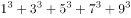的个位数。的个位数分别为1、7、5、3、9，1+7+5+3+9=25，所以原式的个位数是5。

故正确答案为B。

---

## 第 2 题　qid 2262891 · 数学运算

有一只机械手表，每小时慢2分钟，某天中午11:50的时候，把手表调成了标准时间，那么当这只手表走到第二天中午12:00时，此时的标准时间是：

- **A**. 12:50　✅
- **B**. 13:00
- **C**. 12:48
- **D**. 13:02

**答案**：A

**官方解析**

根据题意可知，手表与标准时间的速度比为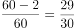。从前一天11:50到第二天12点，手表共走了24小时10分钟，即1450分钟。则标准时间过了，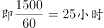，此时标准时间为第二天的12:50。

故正确答案为A。

---

## 第 3 题　qid 2262894 · 数学运算

某设计公司设计了十款不同款式的运动鞋并把图纸送往工厂加工生产，其中有六个款式每个款式各加工生产运动鞋2双，有两个款式每个款式各加工生产运动鞋3双，有两个款式每个款式各加工生产运动鞋6双，若设计师要去厂里抽验运动鞋的生产质量，那么从中至少抽验(  )双运动鞋，才能保证抽出的运动鞋中至少3双的款式相同。

- **A**. 24
- **B**. 25
- **C**. 23
- **D**. 21　✅

**答案**：D

**官方解析**

最不利构造问题，想要保证抽出的运动鞋中至少3双的款式相同，可先考虑最不利情况。即每种款式各抽出两双，为2×10=20双，此时再抽出任意一双即可满足题意要求，为双。

故正确答案为D。

---

## 第 4 题　qid 2262972 · 数学运算

“六一”儿童节，某海洋公园到检票时间有许多家长和儿童在门口等候，假定每分钟到的游客人数一样多。从开始检票到等候的队伍消失，若同时开3个检票口需40分钟，若同时开5个检票口需20分钟，那么同时开6个检票口需（    ）分钟。

- **A**. 10
- **B**. 12
- **C**. 15
- **D**. 16　✅

**答案**：D

**官方解析**

设原有游客y，每分钟到达游客为x，根据牛吃草公式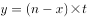可得，解得，。那么同时开放6个检票口时，解得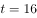分钟。

故正确答案为D。

---

## 第 5 题　qid 2262975 · 数学运算

桌上有甲乙两个水果篮，甲篮里有苹果40个，梨10个，乙篮里有苹果33个，梨47个，从乙篮里去取出一些水果放入甲篮，发现甲篮里的苹果和梨的数量之比变为7:3，乙篮变为2:3，则从乙篮中共取出了（    ）个水果放入甲篮。

- **A**. 15
- **B**. 20　✅
- **C**. 25
- **D**. 30

**答案**：B

**官方解析**

根据题意可知，从乙篮取出一部分放到甲篮后，甲篮比例变为7:3，则甲篮总数一定为的倍数。甲篮原有个，是10的倍数，则从乙篮拿出来的部分也应是10的倍数，可排除A、C两项。

代入B项，甲篮总数变为个，苹果为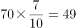个，梨为个。分别增加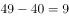个，个。乙篮总数变为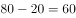个，苹果为个，梨为个。分别减少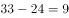个， 个，且苹果与梨的比例为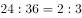。

B项符合题意所有要求，无需验证D项。

故正确答案为B。

---

## 第 6 题　qid 2262977 · 数学运算

某公司春节7天假期安排员工值班，要求值班的员工每人任选不连续的2天值班，则至少需要安排（    ）人，才能保证每天至少有4人值班。

- **A**. 14　✅
- **B**. 21
- **C**. 45
- **D**. 63

**答案**：A

**官方解析**

每天有4人值班，一共有7天，则值班共需4×7=28人次，每个人都值班两天，所以共需要28÷2=14人。14人不连续2天值班，具体值班方式有很多，随机列举一种如下表：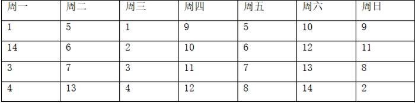

注：数字1-14指的是14个不同的人

故正确答案为A。

---

## 第 7 题　qid 2262983 · 数学运算

甲、乙二人单独去做一件工作，如果甲工作效率提高，则可提前2天完工；如果乙工作效率降低，则要延后2天完工。若二人合作几天能完成？

- **A**. 3天
- **B**. 4天　✅
- **C**. 5天
- **D**. 6天

**答案**：B

**官方解析**

根据题意可知，甲工作效率提升前与提升后效率之比为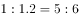。总量相同，效率与时间成反比，则时间之比为6:5。提升后比提升前时间少了1份，又已知工作提前2天完工，所以，可知甲提升前、后完成时间分别为12天、10天。

同理，乙工作效率降低前与降低后效率之比为，则时间之比为。降低后比降低前多了一份，又已知延后2天完工，所以，可知降低前、后时间分别为6天、8天。

甲单独完工需12天，乙单独完工需6天，12和6的最小公倍数12为工作总量，则效率分别为，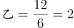。故甲乙合作时间天。

故正确答案为B。

---

## 第 8 题　qid 2262984 · 数学运算

小张的母亲买了一袋米，若只有小张和母亲在家18天吃完，若母亲和父亲在家15天吃完，若三人同时在家10天吃完。则小张一人在家时，吃完整袋大米需（    ）天。

- **A**. 32
- **B**. 30　✅
- **C**. 28
- **D**. 25

**答案**：B

**官方解析**

题干给定三个不同的完成时间，可用赋总量的方法解题。

第一步，赋总量，将总量赋为时间18、15、10的最小公倍数90。

第二步，求效率，小张与母亲的效率之和为，母亲与父亲的效率之和为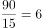，三人效率和为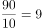。

第三步，列式求解。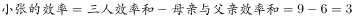，则小张单独吃完需。

故正确答案为B。

---

## 第 9 题　qid 2262987 · 数学运算

某公司为了增加员工凝聚力，将276名员工分成三个组搞活动，第一组与第二组的人数之比是4：5，第二组比第三组多4人。第三组有（    ）人。

- **A**. 96　✅
- **B**. 93
- **C**. 92
- **D**. 91

**答案**：A

**官方解析**

设第二组为5x人，则第一组为4x人，第三组为人。根据题意可列方程，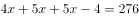，解得人，则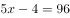人。

故正确答案为A。

---

## 第 10 题　qid 2262989 · 数学运算

某公司组织一次健康知识普及竞赛，主办的部门准备了若干间教室作为考室，如果每间考室安排25人，还余15人没有考室，如果安排30人，不仅多了一个教室还有一间教室安排的人少于8人，则主办方准备了（    ）间教室。

- **A**. 10
- **B**. 12
- **C**. 14　✅
- **D**. 15

**答案**：C

**官方解析**

设共有x间教室，每间安排30人时，最后一间有人。根据题意可列方程，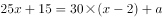，化简得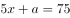，根据倍数特性5x和75均为5的倍数，因此a也是5的倍数，又已知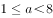，所以，代入方程得。

故正确答案为C。

---
