# 2016年423联考《行测》题（江西卷）

> 数量关系 · 15 题 · 江西 2016

## 第 1 题　qid 2114548 · 数学运算

某企业原有职工110人，其中技术人员是非技术人员的10倍，今年招聘后，两类人员的人数之比未变，且现有职工中技术人员比非技术人员多153人。问今年新招非技术人员多少名？

- **A**. 7　✅
- **B**. 8
- **C**. 9
- **D**. 10

**答案**：A

**官方解析**

原有职工110人，其中技术人员是非技术人员的10倍，可知二者人数之比为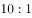，总数共为11份，每份10人，可以得到非技术人员为1份10人，技术人员为10份100人。招聘后，两类人员的人数之比未变，即新招聘的人员中，技术人员是非技术人员的10倍，可以设新招聘的非技术人员为，则技术人员为，则有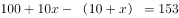，解得。

故正确答案为A。

秒杀技：尾数法。人数比是10倍，技术人员总数的尾数为0，两者相差153，则非技术人员尾数为7，原来是10，现在就是17，新招7人。

---

## 第 2 题　qid 1797910 · 数学运算

一环形跑道上画了100个标记点，已知相邻任意两个标记点之间的跑道距离相等。某人在环形跑道上跑了半圈，问他最多能经过几个标记点？

- **A**. 49
- **B**. 51　✅
- **C**. 50
- **D**. 100

**答案**：B

**官方解析**

一环形跑道上画了100个标记点，赋值标记点的间隔1米，根据环形植树公式，。某人跑了半圈，即跑了50米，此时要经过的标记点最多，就从一个标记点出发，。

故正确答案为B。

---

## 第 3 题　qid 1796268 · 数学运算

A工程队的效率是B工程队的2倍，某工程交给两队共同完成需要6天。如果两队的工作效率均提高一倍，且B队中途休息了1天，问要保证工程按原来的时间完成，A队中途最多可以休息几天？

- **A**. 4　✅
- **B**. 3
- **C**. 2
- **D**. 1

**答案**：A

**官方解析**

A工程队的效率是B工程队的2倍，可以赋值A工程队效率为2，B工程队效率为1，此时工程总量为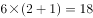。如果两队的工作效率均提高一倍，A工程队效率即为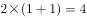，B工程队效率为。设A工程队休息t天，则有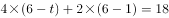，解得。

故正确答案为A。

---

## 第 4 题　qid 1797908 · 数学运算

木匠加工2张桌子和4张凳子共需要10个小时，加工4张桌子和8张椅子需要22个小时。问如果他加工桌子、凳子和椅子各10张，共需要多少小时？

- **A**. 47.5
- **B**. 50
- **C**. 52.5　✅
- **D**. 55

**答案**：C

**官方解析**

假设加工每张桌子、凳子、椅子的所需时间分别为a小时、b小时、c小时，则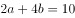、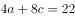，化简得到 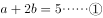，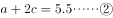，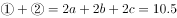，则，所需时间为52.5小时。

故正确答案为C。

---

## 第 5 题　qid 1796258 · 数学运算

某地居民用水价格分二级阶梯，户年用水量在0~180（含）吨的水价；180吨以上的水价。户内人口在5人以上的，每多1人，阶梯水量标准增加30吨。老张家5人，老李家6人，去年用水量都是210吨。问老李家的人均水费比老张家少多少元？

- **A**. 12
- **B**. 35
- **C**. 47　✅
- **D**. 60

**答案**：C

**官方解析**

由题意可得：老张家人均水费=元，老李家人均水费=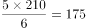元，则老李家人均水费比老张家少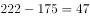元。

故正确答案为C。

---

## 第 6 题　qid 1797792 · 数学运算

甲、乙两个相同的杯子中分别装满了浓度为20%和30%的同种溶液，将甲杯中倒出一半溶液，用乙杯中的溶液将甲杯加满混合，再将甲杯倒出一半溶液，又用乙杯中的溶液将甲杯加满，问最后甲杯中溶液的浓度是多少？

- **A**. 22.5%
- **B**. 25.0%
- **C**. 20.5%
- **D**. 27.5%　✅

**答案**：D

**官方解析**

假设甲、乙两烧杯容量为100，则起初两杯中溶质的量分别为20、30，甲倒出一半又用乙杯中溶液加满后，甲杯中溶质的量为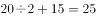，甲再倒出一半且用乙杯中溶液加满后，甲杯中溶质的量为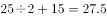，此时甲杯中溶液的量为100，故浓度为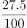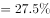。

故正确答案为D。

---

## 第 7 题　qid 1796212 · 数学运算

老王围着边长为50米的正六边形的草地跑步，他从某个角点出发，跑了500米之后，与出发点相距有多远？

- **A**. 
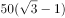米

- **B**. 
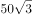米
　✅
- **C**. 
米

- **D**. 
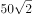米

**答案**：B

**官方解析**

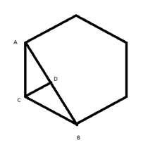

正六边形的边长为50米，则周长为300米，假设老王从A点顺时针跑，500米后应在B点，此时与出发点的距离为AB，做CD垂直于AB，是一个三个角分别为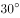、、的直角三角形。在直角三角形中，30°角对应的边等于斜边的一半，则，根据勾股定理可计算得BD为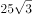米，因此边AB应为米。

故正确答案为B。

---

## 第 8 题　qid 1796254 · 数学运算

A、B两辆列车早上8点同时从甲地出发驶向乙地，途中A、B两列车分别停了10分钟和20分钟，最后A车于早上9点50分，B车于早上10点到达目的地。问两车平均速度之比为多少？

- **A**. 1：1　✅
- **B**. 3：4
- **C**. 5：6
- **D**. 9：11

**答案**：A

**官方解析**

A、B两车均为8:00出发，到达的时间分别为9：50和10：00，中途分别停了10分钟和20分钟，因为两车所用的时间均为1小时40分钟，行驶路程也相同，故二者平均速度之比为。

故正确答案为A。

---

## 第 9 题　qid 1796260 · 数学运算

某餐厅设有可坐12人和可坐10人两种规格的餐桌共28张，最多可容纳332人同时就餐，问该餐厅有几张10人桌？

- **A**. 2　✅
- **B**. 4
- **C**. 6
- **D**. 8

**答案**：A

**官方解析**

方法一：设可坐10人的桌子有张，则可坐12人的桌子有（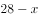）张，则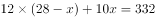，解得。

故正确答案为A。

方法二：假设所有桌子都是10人桌，则总共可坐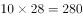人，而现在可坐332人，则多余的人必然是坐到12人桌，而每个12人桌比10人桌可多坐2人，则12人桌子数为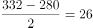，则10人桌为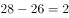张。

故正确答案为A。

---

## 第 10 题　qid 1797894 · 数学运算

某高校艺术学院分音乐系和美术系两个系别，已知学院男生人数占总人数的，且音乐系男女生人数之比为，美术系男女生人数之比为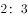，问音乐系和美术系的总人数之比为多少？

- **A**. 5：2
- **B**. 5：1
- **C**. 3：1
- **D**. 2：1　✅

**答案**：D

**官方解析**

方法一：设音乐系人，美术系人，根据题意音乐系与美术系男生之和占总人数的，可得：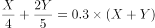，解得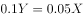，故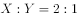。

方法二：音乐系男生的比重为，美术系男生的比重为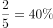，混合后占的比重为，根据线段法画图如下：

   

量与距离成反比，因此。

故正确答案为D。

---

## 第 11 题　qid 1796232 · 数学运算

2014年父亲、母亲的年龄之和是年龄之差的23倍，年龄之差是儿子年龄的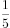，5年后母亲和儿子的年龄都是平方数。问2014年父亲的年龄是多少？（年龄都按整数计算）

- **A**. 36岁
- **B**. 40岁
- **C**. 44岁
- **D**. 48岁　✅

**答案**：D

**官方解析**

由2014年父母年龄之差是儿子年龄的，可得儿子的年龄是5的倍数，而5年后儿子的年龄也必然是5的倍数，是5的倍数且为平方数的只能为25，则可得到2014年儿子的年龄为20岁，父母年龄差即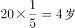，年龄和为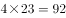岁，假设父亲年龄比母亲年龄大，则可得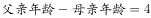，可得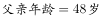，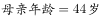，5年后母亲年龄为49岁，是平方数，满足条件。

故正确答案为D。

---

## 第 12 题　qid 1796240 · 数学运算

某商店10月1日开业后，每天的营业额均以100元的速度上涨，已知该月15号这一天的营业额为5000元，问该商店10月份的总营业额为多少元？

- **A**. 163100
- **B**. 158100　✅
- **C**. 155000
- **D**. 150000

**答案**：B

**官方解析**

由“每天的营业额均以100元的速度上涨”可知，10月份每天营业额成一个公差为100的等差数列；由该月15号的营业额为5000元得知，，。10月共31天，由等差数列求和公式可得,元。

故正确答案为B。

---

## 第 13 题　qid 1796222 · 数学运算

如下图，正方形ABCD边长为10厘米，一只小蚂蚁E从A点出发匀速移动，沿边AB，BC，CD前往D点。问哪个图形能反映三角形AED的面积与时间的关系？

A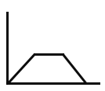B

CD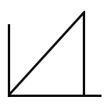

- **A**. A　✅
- **B**. B
- **C**. C
- **D**. D

**答案**：A

**官方解析**

小蚂蚁从A点到B点的过程中，三角形AED的底为AD，长度不变，高AE随着小蚂蚁向上爬而增长，故三角形AED的面积随时间增长（如图1所示）；小蚂蚁从B点到C点的过程中，三角形AED的底为AD，长度不变，高为正方形的边长10cm，也不变，故三角形AED的面积不随时间变化，一直相等（如图2所示）；小蚂蚁从C点到D点的过程中，三角形AED的底为AD，长度不变，高DE随着小蚂蚁向下爬而减少，故三角形AED的面积随时间减少（如图3所示）。只有A项符合三角形AED面积随时间先增长，再不变最后减小的趋势。

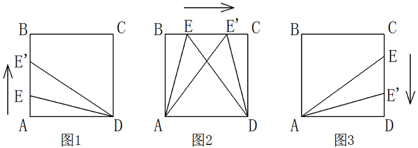

故正确答案为A。

---

## 第 14 题　qid 1796218 · 数学运算

某种商品原价25元，每半天可销售20个。现知道每降价1元，销量即增加5个。某日上午将该商品打八折，下午在上午价格的基础上再打八折出售，问其全天销售额为多少元？

- **A**. 1760
- **B**. 1940　✅
- **C**. 2160
- **D**. 2560

**答案**：B

**官方解析**

由题意可得，商品每降价1元销量增加5个。上午商品打八折出售，下午商品在上午价格的基础上再打八折，列表可得：

 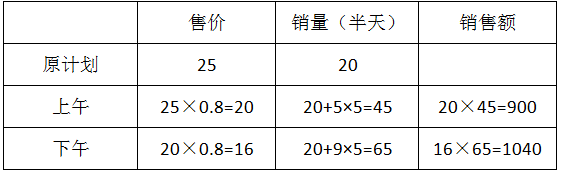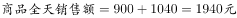。

故正确答案为B。

---

## 第 15 题　qid 1797770 · 数学运算

社长、主编和副主编三人轮流主持每周一的编辑部发稿会。某年（非闰年）1月6日的发稿会由社长主持，问当年副主编第12次主持发稿会是在哪一天？

- **A**. 9月8日　✅
- **B**. 9月9日
- **C**. 9月1日
- **D**. 9月2日

**答案**：A

**官方解析**

主持发稿会的顺序为社长、主编、副主编，每周轮换一次，故一个轮换周期为三周，副主编第十二次主持，应为第十二个周期的第三周，即第36周，中间间隔35周，即副主编主持第十二次所需时间为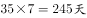。选项均为9月，先算至8月31日。从1月6起，到8月31日，共有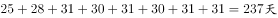，故9月还需要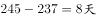。

故正确答案为A。

---
