# 2016年423联考《行测》题（陕西卷）

> 数量关系 · 10 题 · 陕西 2016

## 第 1 题　qid 2253319 · 数学运算

某班共有42名同学，喜欢读小说的有25人，喜欢读诗歌的有30人，既喜欢读小说又喜欢读诗歌的同学最少有多少人？

- **A**. 8
- **B**. 9
- **C**. 10
- **D**. 11
- **E**. 12
- **F**. 13　✅
- **G**. 14
- **H**. 15

**答案**：F

**官方解析**

由两集合容斥原理公式“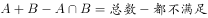”可得，，整理得。想让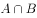最小，两者都不喜欢的同学应尽量少，取值为0，此时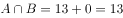。

故正确答案为F。

---

## 第 2 题　qid 2253320 · 数学运算

某高校艺术学院分音乐系和美术系两个系别，已知学院男生人数占总人数的，且音乐系男女生人数之比为1∶3，美术系男女生人数之比为2∶3。问音乐系和美术系的总人数比为多少？

- **A**. 2∶1　✅
- **B**. 3∶2
- **C**. 3∶1
- **D**. 5∶4
- **E**. 1∶2
- **F**. 2∶3
- **G**. 1∶3
- **H**. 4∶5

**答案**：A

**官方解析**

方法一：设音乐系人，美术系人，根据题意音乐系与美术系男生之和占总人数的，可得：，解得，故。

方法二：音乐系男生的比重为，美术系男生的比重为，混合后占的比重为，根据线段法画图如下：

量与距离成反比，因此。

故正确答案为A。

---

## 第 3 题　qid 2253321 · 数学运算

A工程队的效率是B工程队的2倍，某工程交给两队共同完成需要6天，如果两队的工作效率均提高一倍，且B队中途休息了1天，问要保证工程按原来的时间完成，A队中途最多可以休息几天？

- **A**. 8
- **B**. 7
- **C**. 6
- **D**. 5
- **E**. 4　✅
- **F**. 3
- **G**. 2
- **H**. 1

**答案**：E

**官方解析**

A工程队的效率是B工程队的2倍，可以赋值A工程队效率为2，B工程队效率为1，此时工程总量为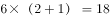。如果两队的工作效率均提高一倍，A工程队效率即为，B工程队效率为。设A工程队休息t天，则有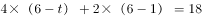，解得。

故正确答案为E。

---

## 第 4 题　qid 2253322 · 数学运算

A、B两辆车同时从甲地出发驶向乙地，A车到达乙地后立即返回，返回途中与B车相遇，相遇点距乙地30公里，相遇后A车经过4小时返回甲地，B车经过0.5小时到达乙地，则A车往返一趟总共用了多少小时？

- **A**. 

- **B**. 
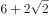
　✅
- **C**. 
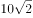

- **D**. 

- **E**. 

- **F**. 

- **G**. 
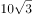

- **H**. 
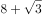

**答案**：B

**官方解析**

方法一：设A、B两车从出发到相遇用时为t小时、相遇地点为丙地。由题意可知，乙丙之间的距离为30公里，B车用时为0.5小时，则B车速度为。从甲到丙，A车用时4小时，B车用时t小时，二者路程一定，速度和时间成反比，则，即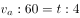，可得。根据A车来看，甲乙之间的距离为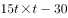；根据B车来看，甲乙之间的距离为；因此可得：，化简得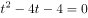，解方程得。则A车在甲乙两地之间往返一趟总共用了小时。

方法二：如图所示，从丙到乙B车用时0.5小时，由题意可知A车速度快于B车，则从丙到乙A车用时应小于0.5小时。因此从甲到乙，A车用时小于4.5小时，往返全程用时应小于9小时。观察选项，只有B项小于9小时。

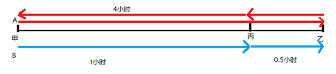

故正确答案为B。

---

## 第 5 题　qid 2253323 · 数学运算

甲、乙两个相同的杯子中分别装满了浓度为和的两种溶液。将甲杯中倒出一半溶液，用乙杯中的溶液将甲杯加满混合，然后再将已经加满的甲杯中的溶液全部倒入一杯清水中且未溢出，溶液浓度变为。若该溶液密度与水完全相同，问原甲杯中溶液的质量是这杯清水质量的多少倍？

- **A**. 1
- **B**. 2
- **C**. 3
- **D**. 4　✅
- **E**. 5
- **F**. 6
- **G**. 7
- **H**. 8

**答案**：D

**官方解析**

由题意可知，甲倒出一半后又用乙杯中的溶液加满，即浓度为的溶液和等量的浓度为的溶液混合。根据两种溶液的量相等，混合后溶液浓度为原两溶液浓度的平均数，则混合后的浓度为。

又将浓度为的甲与清水（可看作浓度为）混合，混合后浓度为，根据线段法：距离（浓度差）与量（溶液质量）成反比，则，即原甲杯中溶液的质量是清水质量的4倍。

故正确答案为D。

---

## 第 6 题　qid 2253324 · 数学运算

某种商品原价25元，成本为15元，每天可销售20个。现在每降价1元就可以多卖5个，为获得最大利润，需要按照多少元来卖？

- **A**. 23
- **B**. 22　✅
- **C**. 21
- **D**. 20
- **E**. 19
- **F**. 18
- **G**. 17
- **H**. 16

**答案**：B

**官方解析**

假设降价x元，利润为y，则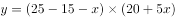，判定其为一元二次函数，当x的值为函数对称轴时，y值最大。令，则，；或，，当x的值取对称轴时，y取得最大值，此时售价为元。

故正确答案为B。

---

## 第 7 题　qid 2253325 · 数学运算

一个工程师加工2张桌子和4张凳子共需要10个小时，加工4张桌子和8张椅子需要22个小时。问如果他加工桌子、凳子和椅子各10张，共需要多少小时？

- **A**. 42.5
- **B**. 45
- **C**. 47.5
- **D**. 50
- **E**. 52.5　✅
- **F**. 55
- **G**. 57.5
- **H**. 60

**答案**：E

**官方解析**

方法一：假设每张桌子、凳子、椅子的所需时间分别为小时、小时、小时。

则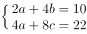，a、b、c的值不一定为整数，所以可以使用赋“0”法，为了方便计算，可以赋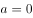，则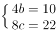，，。

方法二：假设每张桌子、凳子、椅子的所需时间分别为小时、小时、小时。

则，化简得到两式相加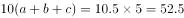，所需时间为52.5小时。

故正确答案为E。

---

## 第 8 题　qid 2253326 · 数学运算

6个小朋友围成一圈做游戏，小华和小明需要挨在一起，问有多少种安排方法？

- **A**. 720
- **B**. 180
- **C**. 560
- **D**. 480
- **E**. 360
- **F**. 240
- **G**. 120
- **H**. 48　✅

**答案**：H

**官方解析**

小华和小明需要挨在一起，可将小华和小明绑在一起做为一个整体，再与剩余4个小朋友进行环形排列，因此可有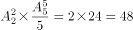种安排方法。

故正确答案为H。

---

## 第 9 题　qid 2253327 · 数学运算

有100人参加五项活动，参加人数最多的活动的人数不超过参加人数最少活动人数的两倍，问参加人数最少的活动最少有多少人参加？

- **A**. 10
- **B**. 11
- **C**. 12　✅
- **D**. 13
- **E**. 14
- **F**. 15
- **G**. 16
- **H**. 17

**答案**：C

**官方解析**

将五项活动按参加人数由多到少依次排序为1、2、3、4、5，则参加人数最少的活动为第5项，设第5项活动有x人参加。要使第5项活动参加的人数最少，则其余四项活动参加人数应尽量多，根据题意可知，则其他四项活动参加人数最多可均为人。可列式为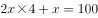,解得，问最少应向上取整，则参加人数最少的活动最少有12人参加。

故正确答案为C。

---

## 第 10 题　qid 2253328 · 数学运算

一个正六边形，边长为50米，一个人从正六边形的一个角点出发沿边长跑步，跑了500米后，问此人与出发点的直线距离为多少米？

- **A**. 

- **B**. 

- **C**. 
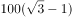

- **D**. 

- **E**. 

- **F**. 

- **G**. 

- **H**. 

　✅

**答案**：H

**官方解析**

正六边形的边长为50米，则周长为300米，假设此人从A点顺时针跑，500米后应在B点，此时与出发点的距离为AB，做CD垂直于AB，是一个三个角分别为、、的直角三角形。在直角三角形中，角对应的边等于斜边的一半，则，根据勾股定理可计算得BD为米，因此边AB应为米。

故正确答案为H。

---
