# 2016年上海市公务员录用考试《行测》题（A类）

> 数量关系 · 9 题 · 上海 2016

## 第 1 题　qid 1758856 · 数学运算

小张购买艺术品A，在其价格上涨后卖出盈利元，用卖价的一半购买艺术品B，又在其价格上涨后卖出盈利元,发现大于。则X的取值范围是（  ）。

- **A**. 大于100　✅
- **B**. 大于200
- **C**. 小于100
- **D**. 小于200

**答案**：A

**官方解析**

方法一：利润=成本×利润率。根据题干条件可得方程：

；。因，则，将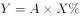代入不等式方程后，化简可得：，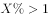，即。

方法二：因题干未出现任何具体数值，故可赋值解题。设艺术品成本为1，根据得出，代入不等式方程：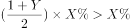，可得。

故正确答案为A。

---

## 第 2 题　qid 1805090 · 数学运算

某大型社区提供巴士换乘地铁服务，规定车满载后直达地铁站，中间站不再停留上客。如果巴士共有座位48个，第一站上来1人，第二站2人，第三站3人，按照这个规律，第（  ）站司机将不再停车。

- **A**. 8
- **B**. 9
- **C**. 10
- **D**. 11　✅

**答案**：D

**官方解析**

依据条件，第一站上来1人，第二站2人，第三站3人······，每次上来的人数呈等差数列，故根据等差数列求和公式可得，在第n站时车上一共有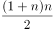人。因当满载时将不再停车，车上共有48座位，故当≥48人时不再停车。当n=9时，人，不满足要求；当n=10时，人，满足要求。即在第十站停车上人后，人数达到55人，满载，从第11站开始将不再停车。 

故正确答案为D。

---

## 第 3 题　qid 1758848 · 数学运算

一艘轮船先顺水航行40千米，再逆水航行24千米，共用了8小时。若该船先逆水航行20千米，再顺水航行60千米，也用了8小时。则在静水中这艘船每小时航行（  ）千米。

- **A**. 11
- **B**. 12　✅
- **C**. 13
- **D**. 14

**答案**：B

**官方解析**

设船在静水中的速度为千米/小时，水流的速度为千米/小时，根据题干条件可得方程：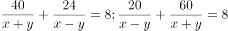。方程化简后得：。将代入原式，解得，。

备注：【秒杀计】两方程联立化简后可得，结合题干数据和选项均为整数，故可猜测应为3的倍数，只有B项满足。

故正确答案为B。

---

## 第 4 题　qid 1758850 · 数学运算

某收藏家有三个古董钟，时针都掉了，只剩下分针，而且都走得较快，每小时分别快2分钟、6分钟及12分钟。如果在中午将这三个钟的分针都调整指向钟面的12点位置，多少小时后这3个钟的分针会指在相同的分钟位置？

- **A**. 24
- **B**. 26
- **C**. 28
- **D**. 30　✅

**答案**：D

**官方解析**

由题意可得：假设每小时快2分钟、快6分钟、快12分钟的古董钟分别为A钟、B钟、C钟，则B钟与A钟速度差为分钟/小时，已知整个钟盘有60分钟，即经过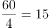小时，B钟的分针比A钟的分针恰好多走一圈，且此时两钟分针重合，同理，C钟与A钟速度差为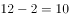分钟/小时，即经过小时，C钟的分针比A钟的分针恰好多走一圈，此时两钟分针重合，取6和15的最小公倍数30，即经过30小时，B钟的分针比A钟的分针恰好多走2圈，C钟的分针比A钟的分针恰好多走5圈，且此时三个分针处于同一个位置。

故正确答案为D。

---

## 第 5 题　qid 1805094 · 数学运算

长方形ABCD，从图示的位置开始沿着AP每秒转动90度（无滑动情况），AB=4厘米，BC=3厘米，当长方形的右端到达距离A为46厘米的位置时是（    ）秒后。

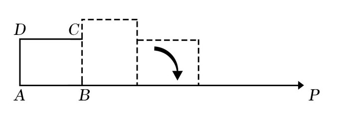

- **A**. 11
- **B**. 12　✅
- **C**. 13
- **D**. 14

**答案**：B

**官方解析**

开始的时候，长方形的右端距离A点为4cm，故只需通过滑动46-4=42cm的距离即可满足题目要求。从第一秒开始，每次滑动的距离分别为3cm、4cm、3cm、4cm······，即每两秒滑动7cm。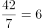次，故所需的时间=6×2=12秒。

故正确答案为B。

---

## 第 6 题　qid 1805096 · 数学运算

现有21本故事书要分给5个人阅读，如果每个人得到的数量均不相同，那么得到故事书数量最多的人至少可以得到（   ）本。

- **A**. 5
- **B**. 7　✅
- **C**. 9
- **D**. 11

**答案**：B

**官方解析**

设得到数量最多的人得到了x本书。要使最多的人尽可能的少，则其他人应尽可能多，而每人得到的数量均不相同，可设分别比最多的少了1本、2本、3本、4本，则可得5x-10=21，解得x=6.2，故得到数量最多的人至少应得到7本书。

故正确答案为B。

---

## 第 7 题　qid 1758844 · 数学运算

甲乙丙三员工共同修剪6060平方米草地，甲的修剪效率为30平方米/分钟，乙的修剪效率为40平方米/分钟，丙的效率为60平方米/分钟。上午，甲7点30分开始修剪，乙7点45分开始，丙8点15分开始，他们同一时间完成工作，乙用了（  ）分钟。

- **A**. 56
- **B**. 57　✅
- **C**. 58
- **D**. 59

**答案**：B

**官方解析**

三人同一时间完成工作，且甲、乙分别先于丙45、30分钟开始工作。设任务完成时丙共工作了分钟，则甲应工作了分钟，乙应工作了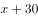分钟。工程总量，解得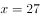，则乙工作了分钟。

故正确答案为B。

---

## 第 8 题　qid 1805100 · 数学运算

下图中间阴影部分为长方形。它的四周是四个正方形，这四个正方形的周长和是320厘米，面积和是1700平方厘米，则阴影部分的面积是（   ）平方厘米。

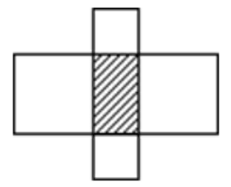

- **A**. 375　✅
- **B**. 400
- **C**. 425
- **D**. 430

**答案**：A

**官方解析**

设阴影部分长方形的长为厘米，宽为厘米，面积即为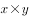。四周四个正方形的周长，化简后得：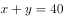；四周四个正方形的面积，化简后得：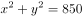。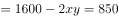，解得平方厘米。

故正确答案为A。

---

## 第 9 题　qid 1758846 · 数学运算

小王打算购买围巾和手套送给朋友们，预算不超过500元，已知围巾的单价是60元，手套的单价是70元，如果小王至少要买3条围巾和2双手套，那么不同的选购方式有（  ）种。

- **A**. 3
- **B**. 5
- **C**. 7　✅
- **D**. 9

**答案**：C

**官方解析**

在保证必买3条围巾和2双手套的前提下，剩余购买情况不能超过元。设围巾再次购买了条，手套再次购买了双，则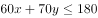，依次分析、的取值情况。

当时，可取0、1、2，共3种方式；

当时，可取0、1，共2种方式；

当时，可取0，共1种方式；

当时，可取0，共1种方式。

即还有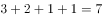种购买方式。

故正确答案为C。

---
